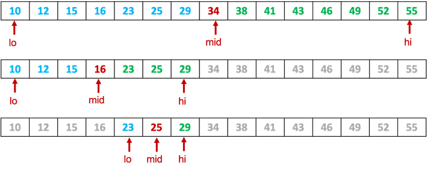

# Arrays

In einer Variable können wir genau einen Wert speichern. Wenn wir 5 Werte speichern wollen, benötigen wir 5 Variablen und wenn wir 1000 Werte speichern wollen, benötigen wir 1000 Variablen. Das ist natürlich unzweckmäßig. Wenn Sie mehrere Werte gleichen Typs speichern wollen, dann verwenden Sie dazu besser *Arrays* (*Felder*). Arrays sind Objekte.

Wir schauen uns mal ein einführendes Beispiel an. Angenommen, wir wollen 5 `int`-Werte `0`, `1`, `4`, `9` und `16` speichern. Bis jetzt benötigten wir dazu 5 Variablen:

```java
int number1 = 0;
int number2 = 1;
int number3 = 4;
int number4 = 9;
int number5 = 16;
```

Jetzt wollen wir dazu ein Array verwenden. Die Erzeugung und Initialisierung sieht so aus:

```java linenums="1"
int[] numbers = new int[5];		// Array der Laenge 5
numbers[0] = 0;					// erstes Element Wert 0
numbers[1] = 1;					// zweites Element Wert 1
numbers[2] = 4;					// drittes Element Wert 4
numbers[3] = 9;					// viertes Element Wert 9
numbers[4] = 16;				// fuenftes Element Wert 16
```

1. Ein Array erkennen wir an den eckigen Klammern `[]`. 
2. Unser Array im Beispiel ist vom Typ `int`, d.h. jedes *Element* in diesem Array ist vom Typ `int`. Arrays können von einem beliebigen Typ sein, sowohl Wertetypen als auch Referenztypen. Ein Array wird immer für genau einen Typ deklariert, bei uns `int` --> deshalb `int[]`. Bestünde das Array aus lauter Strings, dann wäre der Typ `String[]`.
3. In unserem Beispiel ist `numbers` die Referenzvariable, die auf unser Array-Objekt zeigt. 
4. Mithilfe des Schlüsselwortes `new` wird unser Array erzeugt. Nach `new` kommt nochmal das Array (`Typ[]`), aber in den eckigen Klammern steht die Länge des Arrays. In unserem Beispiel `5`. Bei der Erzeugung des Arrays muss immer die Länge angegeben werden. Die Länge eines Arrays kann sich **nicht** ändern.
5. Der Zugriff auf die einzelnen Elemente erfolgt über den *Index*. Jedes Array ist automatisch "nummeriert". Die "Nummerierung" (der Index) beginnt immer mit `0` und erhöht sich für jedes Element um `1`. Der Index eines Arrays ist immer vom Typ `int`.

Wir können uns unser Array `numbers` so vorstellen:


Wir haben 5 Elemente (Länge `5`), die jeweils durch den Index nummeriert sind. Diese Elemente können nun Werte enthalten:


Der Zugriff auf die Werte eines Arrays erfolgt dann immer unter Verwendung der Referenzvariable, dahinter eckige Klammern und in den Klammern der entsprechende Index:

> `Referenzvariable[Index]=Wert;`

Also in unserem Beispiel `numbers[0]`.

## Erzeugung und Initialisierung eines Arrays

Die Erzeugung und Initialisierung eines Arrays erfolgt in drei Schritten:

1. Schritt: Definition einer Referenzvariablen, die auf das Array-Objekt zeigt	(siehe oben in Zeile `1`: `int[] numbers`)
2. Schritt: Erzeugen des Arrays, d. h. eines Array-Objektes, das aus Elementen eines bestimmten Datentyps besteht (und Zuweisung an die zuvor definierte Referenzvariable - siehe oben Zeile `1`: `new int[5]`)
3. Schritt: Belegen der Array-Elemente mit Werten, d. h. Initialisierung des Arrays (siehe oben Zeilen `2-6`). 

Beispiele verschiedene Arrays erzeugen:

```java
double[] noten = new double[10];		// Array aus double-Elemente Laenge 10
String[] satz = new String[30];			// Array aus Zeichenketten Laenge 30
boolean[] filled = new boolean[100]; 	// Array aus boolean-Elementen Laenge 100
int[] statistics = new int[10000];		// Array aus int-Elementen Laenge 10000
```

Die Initialisierung erfolgt elementweise über den Zugriff auf den Index, z.B. (siehe oben):

```java
numbers[0] = 0;					// erstes Element Wert 0
numbers[1] = 1;					// zweites Element Wert 1
numbers[2] = 4;					// drittes Element Wert 4
numbers[3] = 9;					// viertes Element Wert 9
numbers[4] = 16;				// fuenftes Element Wert 16
```

Da der Index stets vom Typ `int` ist, hätten wir unser Array auch wie folgt initialisieren können:

```java linenums="1"
for(int index=0; index<5; index++)
{
	numbers[index] = (index*index);
}
```

Beachten Sie:

1. Der größte Index ist immer um eins kleiner als die Länge des Arrays (Länge ist `5`, größter Index ist `4` --> deshalb `index < 5`)
2. Der Index ist immer `int`, egal von welchem Typ das Array ist
3. In unserem Beispiel entsprechen die Werte der einzelnen Elementen Quadratzahlen. Deshalb konnten wir als Wert `(index * index)` verwenden.

### Die Eigenschaft `length`

Jedes Array besitzt die Eigenschaft `length`. Darüber können wir die Länge des Arrays auslesen. Der Wert von `length` kann nicht neu gesetzt werden (ist konstant). Wir benutzen die Eigenschaft `length` insbesondere in den Schleifen, mit denen wir auf den Index zugreifen.

> `Referenzvariable.length`

Unser obiges Initialisierungsbeispiel hätte also besser so ausgesehen:

```java linenums="1"
for(int index=0; index<numbers.length; index++)
{
	numbers[index] = (index*index);
}
```

### Ausgabe der Werte

Den jetzt bereits bekannten Zugriff auf die einzelnen Elemente können wir auch für das Auslesen der Werte eines Arrays verwenden:

```java linenums="1"
for(int index=0; index<numbers.length; index++)
{
	System.out.println(numbers[index]);
}
```

### Verwenden der Werte 

Wir erläutern ein einfaches Beispiel zur Verwendung der Werte, wir bilden die Summe aller Werte über das Array (wir gehen davon aus, dass das `numbers`-Array so wie oben erzeugt un initialisiert wurde):

```java
int sum = 0;
for(int index=0; index<numbers.length; index++)
{
	sum = sum + numbers[index];
}
System.out.println("Summe aller Elemente : " + sum);
```

### Mögliche andere Form der Erzeugung und Initialisierung

Das Array kann auch in einer anderen Form erzeugt und initialisiert werden:

```java
int[] numbers = {0, 1, 4, 9, 16};
```

Diese Form erzeugt ein `int[]`-Array der Länge `5` mit den Werten 

```java
numbers[0] = 0;					// erstes Element Wert 0
numbers[1] = 1;					// zweites Element Wert 1
numbers[2] = 4;					// drittes Element Wert 4
numbers[3] = 9;					// viertes Element Wert 9
numbers[4] = 16;				// fuenftes Element Wert 16
```

Es handelt sich um eine einfache Form der Erzeugung und Initialisierung in einem Schritt. 

### Weitere Beispiele von Arrays

Wir zeigen einige Beispiele anderer Arrays:

```java linenums="1"
String[] satz = new String[4];
satz[0] = "Das";
satz[1] = "ist";
satz[2] = "ein";
satz[3] = "Satz";

for(int index=0; index<satz.length-1; index++)
{
	System.out.print(satz[index] + " ");
}
System.out.println(satz[satz.length-1] + ".");
```

Das Beispiel zeigt die Erzeugung und Initialisierung eines Arrays, in dem alle Elemente vom Typ `String` sind. Nach der Erzeugung und Initialisierung in den Zeilen `1` bis `5` folgt die Ausgabe der Werte des Arrays. Es werden alle Werte ausgegeben und ein Leerzeichen angehängt. Das gilt aber nur für alle Elemente einschließlich des vorletzten (`index<satz.length-1`). Hinter das letzte Element (`satz[satz.length-1]`) folgt kein Leerzeichen, sondern ein Punkt.

Wir hätten das Array auch so erzeugen und initialisieren können: `String[] satz = {"Das", "ist", "ein", "Satz"};`

Ein weiteres Beispiel mit einem `char`-Array:

```java linenums="1"
char[] alphabet = new char[26];
for(int index=0; index<26; index++)
{
	alphabet[index] = (char) (index+65);
}
for(int index=0; index<26; index++)
{
	System.out.print(alphabet[index]+" ");
}
```

Es wird zunächst ein `char`-Array erzeugt (Zeile `1`) und initialisiert (Zeilen `2` bis `5`). Anschließend wird es ausgelesen Zeilen `6` bis `9`). Es entsteht folgende Ausgabe:

```bash
A B C D E F G H I J K L M N O P Q R S T U V W X Y Z 
```

!!! Success
	Wir können uns Arrays erzeugen und initialisieren. Wir können Werte in diesen Arrays ändern und aus den Arrays auslesen. Wir kennen die `length`-Variable von Arrays und können den Index verwenden, um auf die einzelnen Elemente zuzugreifen. 
	Nächste Woche geht es mit Arrays weiter!

## Algorithmen über Arrays

Wir werden uns mit verschiedenen Algorithmen beschäftigen, die alle Arrays zur Grundlage haben. Wir beginnen zur Auffrischung mal mit einer kleinen Übung. Wir wollen ein Array erstellen, in dem die [**Fibonacci-Folge**](https://de.wikipedia.org/wiki/Fibonacci-Folge) enthalten ist. Diese geht so, dass das erste Element den Wert `0` hat und das zweite Element den Wert `1` und alle nachfolgenden Elemente als Wert die Summe der Werte ihrer beiden Vorgänger hat, also `0, 1, 1, 2, 3, 5, 8, 13, 21, 34, ...`. 

Ausgangspunkt ist also etwas in der folgenden Art:

```java
public void main(String[] args)
{
	int length = 20;
	int[] fibonacci = new int[length];
	fibonacci[0] = 0;
	fibonacci[1] = 1;
}
```

??? question "Befüllen Sie den Rest des `fibonacci`-Arrays!"
	```java
	public void main(String[] args)
	{
		int length = 20;
		int[] fibonacci = new int[length];
		fibonacci[0] = 0;
		fibonacci[1] = 1;
		for(int index=2; index<fibonacci.length; index++)
		{
			fibonacci[index] = fibonacci[index-1] + fibonacci[index-2];
		}
	}
	```

Wir wollen dieses Array nun mehrfach verwenden, um anhand von Beispielen einige Algorithmen über Arrays kennenzulernen. Beachten Sie, dass wir für das `fibonacci`-Array die Länge auf `20` festgesetzt hatten. Dies können wir aber problemlos ändern und deutlich längere `fibonacci`-Arrays erstellen. Alles, was wir dazu tun müssen, ist den Wert von `length` zu ändern. Beachten Sie außerdem, dass `length` eine von uns erzeugte Variable ist, aber `fibonacci.length` eine Variable des Arrays (deren Wert wir nicht ändern, sondern nur auslesen könnnen). 

### Methoden mit Arrays als Parameter

Wir werden uns einige Methoden erstellen, um z.B. ein als Parameter übergebenes Array auszugeben oder einige Berechnungen über die Werte des Arrays durchzuführen. Wir beginnen damit, uns eine Methode zu schreiben, die ein als Parameter übergebenes Array auf die Konsole ausgibt.

#### Ausgabe der Werte auf die Konsole

Zunächst wollen wir alle Werte nur durch Leerzeichen getrennt auf die Konsole ausgeben. Die dazugehörige Methode sieht so aus:

```java linenums="1"
	public void printArray(int[] a)
	{
		for(int index=0; index<a.length; index++)
		{
			System.out.print(a[index] + " ");
		}
		System.out.println();
	}
``` 

Wir übergeben also ein `int[]`-Array als Parameter und durchlaufen es in einer Schleife vollständig von `index=0` bis `index=a.length-1` und geben alle Werte von `a[index]` auf die Konsole durch Leerzeichen getrennt aus. 

Wenn wir nun in `main()` `printArray(fibonacci);` aufrufen, bekommen wir folgende Ausgabe:

```bash
0 1 1 2 3 5 8 13 21 34 55 89 144 233 377 610 987 1597 2584 4181 
```

---

Jetzt wollen wir die Ausgabe ändern. Das Array soll in folgender Form ausgegeben werden:

```bash
[ 0, 1, 1, 2, 3, 5, 8, 13, 21, 34, 55, 89, 144, 233, 377, 610, 987, 1597, 2584, 4181 ]
```

Das heißt, die Werte sollen alle innerhalb von eckigen Klammern erscheinen und die Werte sind durch Komma getrennt. Das Hauptproblem dabei ist, dass nach dem letzten Wert kein Komma ausgegeben werden soll. Angenommen, wir ändern obigen Code nur geringfügig:

```java linenums="1" hl_lines="3 6 8"
	public void printArray(int[] a)
	{
		System.out.print("[ ");
		for(int index=0; index<a.length; index++)
		{
			System.out.print(a[index] + ", ");
		}
		System.out.println(" ]");
	}
``` 

dann hätten wir eine Ausgabe in der Form:

```bash
[ 0, 1, 1, 2, 3, 5, 8, 13, 21, 34, 55, 89, 144, 233, 377, 610, 987, 1597, 2584, 4181,  ]
```

Wir hätten also schonmal die eckigen Klammern, aber nach dem letzten Wert käme noch ein Komma. Deshalb lassen wir nun die Schleife nur noch bis `index<a.length-1` laufen und behandeln das letzte Element extra. *Welchen Index hat das letzte Element von `a`?* Wir kennen die Länge nicht, wir kennen aber `a.length`. Das letzte Element hat den Index `a.length-1`, d.h. der größte Index ist stets die Länge des Arrays minus 1. Wir könnten die Methode also so schreiben:

```java linenums="1" hl_lines="4 8"
	public void printArray(int[] a)
	{
		System.out.print("[ ");
		for(int index=0; index<a.length-1; index++)
		{
			System.out.print(a[index] + ", ");
		}
		System.out.print(a[a.length-1]);
		System.out.println(" ]");
	}
``` 

---

Jetzt gibt es nur noch ein kleines Problem: Was passiert, wenn die Länge des Arrays `0` ist, das als Parameter übergebene Array also gar keine Elemente besitzt? Ein solches Array ließe sich z.B. durch 

```java
int[] arr1 = new int[0];
int[] arr2 = {};
```

erzeugen. Wenn `a` die Länge `0` hätte, dann würden wir mit `a[a.length-1]` auf das Element von `a` mit dem Index `-1` zugreifen wollen und ein solches Element/ein solcher Index existiert nicht. Es würde eine `ArrayIndexOutOfBounds`-Exception geworfen werden. Um sich dagegen zu schützen, prüfen wir vor diesem Zugriff noch, ob die Länge grßer als `0` ist:


```java linenums="1" hl_lines="8 9 11"
	public void printArray(int[] a)
	{
		System.out.print("[ ");
		for(int index=0; index<a.length-1; index++)
		{
			System.out.print(a[index] + ", ");
		}
		if(a.length>0)
		{
			System.out.print(a[a.length-1]);
		}
		System.out.println(" ]");
	}
``` 

??? question "Was wird ausgegeben, wenn `a` die Länge `0` hat?"
	```bash
	[  ]
	```

??? question "Schreiben Sie die obige Methode so, dass die Ausgabe nicht auf der Konsole erfolgt, sondern der Ausgabe-String zurückgegeben wird!"
	```java
		public String getOutputStringOfArray(int[] a)
		{
			String s = "[ "; 
			for(int index=0; index<a.length-1; index++)
			{
				s = s + a[index] + ", ";
			}
			if(a.length > 0)
			{
				s = s + a[a.length-1] + " ]";
			}
			return s;
		}
	```

#### Maximumwert ermitteln

Angenommen, wir bekommen ein `int[]`-Array als Parameter übergeben und sollen den größten Wert innerhalb dieses Arrays ermitteln (und zurückgeben). Eine Idee für einen solchen Algorithmus wäre:

- wir merken uns das aktuelle Maximum in einer Variablen
- wir laufen durch das Array durch und immer wenn der aktuelle Wert im Array größer ist, als unser aktuelles Maximum, speichern wir den Wert als (neues) aktuelles Maximum
- wenn wir vollständig durch das Array durchgelaufen sind, haben wir den größten Wert als aktuelles Maximum gespeichert und können ihn zurückgeben

Eine solche Implementierung könnte so aussehen:

```java linenums="1"
	public int getMaximum(int[] a)
	{
		int currentMaximum = 0;	
		for (int index = 0; index < a.length; index++)
		{
			if(a[index]>currentMaximum)
			{
				currentMaximum = a[index];
			}
		}		
		return currentMaximum;
	}
```

Das sieht zunächst exakt wie die Implementierung des oben beschriebenen Algorithmus' aus. In Zeile `3` erstellen wir unsere Variable `currentMaximum`, mit der wir uns das aktuelle Maximum speichern wollen. Mit der `for`-Schleife laufen wir durch alle Elemente unseres Arrays (Zeile `4`) und wenn ein Wert aus dem Array größer ist als das bis dahin gespeicherte Maximum (Zeile `6`), speichern wir den Wert des Elements als neues Maximum (Zeile `8`). Nach dem Verlassen der `for`-Schleife ist der größte Wert in `currentMaximum` gespeichert und kann zurückgegeben werden. 

Wir testen das mal in `main()` mit unserer Fibonacci-Folge und rufen `System.out.println(getMaximum(fibonacci));` auf. Wir erhalten:

```bash
4181
```

Es scheint also zu funktionieren. Wir haben jedoch ein Problem: Was passiert, wenn die Werte in `a` alle negativ sind? Dann würde der Vergleich in Zeile `6` nie `true` sein und `currentMaximum` nie den Wert ändern, da der initiale Wert von `currentMaximum` größer als alle Werte aus dem Array ist. Wir müssen also etwas am initialen Wert von `currentMaximum` ändern. Eine Idee ist, dass wir `currentMaximum` mit dem ersten Wert aus dem `a`-Array initialisieren:

```java linenums="1"
	public int getMaximum(int[] a)
	{
		int currentMaximum = a[0];	
		for (int index = 1; index < a.length; index++)
		{
			if(a[index]>currentMaximum)
			{
				currentMaximum = a[index];
			}
		}		
		return currentMaximum;
	}
```

Dann müssen wir beim Schleifendurchlauf nur noch alle Elemente betrachten, deren Index `>=1` ist, da wir das Element mit dem Index `0` (das erste Element aus `a`) bereits bei der Initialisierung von `currentMaximum` betrachtet haben. Nun funktioniert unsere Methode auch für Arrays, die nur negative Werte enthalten. 

Ein Problem bleibt noch: Was passiert, wenn das Array `a` leer ist, also eine Länge von `0` hat? Dann können wir nämlich auch nicht `a[0]` aufrufen, da dieses Element (der Index `0`) nicht existiert. Wir bekämen eine `ArrayIndexOutOfBounds`-Exception. Hierbei stellt sich die grundsätzliche Frage, was durch unsere Methode zurückgegeben werden soll, wenn das übergebene Array gar kein Maximum hat, nämlich dann, wenn es leer ist? Darauf gibt es keine befriedigende Antwort. Wür müssen ein `int` zurückgeben, aber kein `int` aus dem Wertebereich wäre korrekt. Grundsätzlich sollte so etwas vor Aufruf der Methode geprüft werden. Wir könnten uns z.B. eine Methode `isEmpty()` schreiben:

```java	
	public boolean isEmpty(int[] a)
	{
		return (a.length==0);
	}
```

Diese Methode gibt `true` zurück, wenn das Array `a` leer ist (also die Länge `0`) hat und `false` sonst. Diese Methode kann man für den Aufruf von `getMaximum()` verwenden:

```java
if(!isEmpty(arr1))
{
	int maximum = getMaximum(arr1);
}
```

Das heißt, wir rufen die Methode `getMaximum()` für ein Array nur dann auf, wenn wir wissen, dass dieses Array nicht leer ist. Dann arbeitet unsere Methode nämlich korrekt - und nur dann.

#### Zwei Arrays auf Gleichheit prüfen

Wir wollen eine Methode schreiben, die überprüft, ob 2 Arrays gleich sind - also vollständig gleiche Werte enthalten. Z.B. sollen diese Arrays gleich sein:

```java
int[] arr1 = {8, 9, 2, 3, 7, 4, 1, 0, 9, 6 };
int[] arr2 = {8, 9, 2, 3, 7, 4, 1, 0, 9, 6 };
```
aber 
```java
int[] arr3 = {8, 9, 2, 3, 7, 5, 1, 0, 9, 6 };
```

ist ungleich zu `arr1` und `arr2`, da `arr3` an 6. Stelle den Wert `5` statt `4` hat.

Die algorithmische Idee ist:

- wir laufen gleichzeitig durch beide Arrays durch
- solange die Werte bei gleichem Index gleich sind, machen wir weiter
- sobald zwei Werte bei gleichem Index ungleich sind, wissen wir, dass die Arrays ungleich sind
- wenn wir alle Elemente betrachtet haben und alle waren gleich, dann sind auch unsere Arrays gleich

```java linenums="1"
public boolean areEqual(int[] a, int[] b)
{	
	boolean areEqual = true;
	for(int index=0; index < a.length; index++)
	{
		if(a[index]!=b[index])
		{
			areEqual = false;
		}
	}
	return areEqual;
}
```

Diese Methode setzt unseren Algorithmus um und wenn wir die Methode mit den obigen Arrays testen

```java
System.out.println(areEqual(arr1, arr2));
System.out.println(areEqual(arr1, arr3));
```

, dann wird auch korrekt 

```bash
true
false
```

ausgegeben. Doch was passiert, wenn wir die Methode für diese beiden Arrays aufrufen:

```java
int[] arr4 = {8, 9, 2 };
int[] arr5 = {8, 9, 2, 3 };
```

??? question "Welcher Wert wird bei Aufruf `System.out.println(areEqual(arr4, arr5));` ausgegeben?"
	```bash
	true
	```

Wollen wir das?


??? question "Welcher Wert wird bei Aufruf `System.out.println(areEqual(arr5, arr4));` ausgegeben?"
	- keiner, sondern 
	```bash
	Exception in thread "main" java.lang.ArrayIndexOutOfBoundsException: Index 3 out of bounds for length 3
	```

Warum?

Grundsätzlich sollte es bei einer solchen Methode egal sein, welche Reihenfolge die übergebenen Arrays in der Parameterliste haben, d.h. `areEqual(arr4, arr5)` und `areEqual(arr5, arr4)` sollten den gleichen Wert zurückliefern, denn entweder sind sie gleich `true` oder sie sind es nicht `false`. Die Gleichheit ist eine [*symmetrische Relation*](https://de.wikipedia.org/wiki/Symmetrische_Relation). 

---

Was ist das Problem unserer bisherigen Lösung? Wir durchlaufen die Schleife auch dann, wenn die Arrays unterschiedliche Länge haben. In dem Aufruf `areEqual(arr4, arr5)` wird das letzte Element von `arr5` gar nicht mehr geprüft, da der `index` in der Schleife nur bis `arr4.length-1` läuft. In dem Aufruf `areEqual(arr5, arr4)` wird versucht, das letzte Element von `arr5` mit einem Element von `arr4` zu vergleichen, das gar nicht existiert. Der Zugriff auf `arr4[3]` führt zu einer `ArrayIndexOutOfBoundsException`. Wir werden deshalb zunächst prüfen, ob die beiden Arrays überhaupt gleich lang sind und nur dann durchlaufen wir die beiden Arrays:

```java linenums="1" hl_lines="4-8"
public boolean areEqual(int[] a, int[] b)
{	
	boolean areEqual = true;
	if(a.length != b.length)
	{
		areEqual = false;
	}
	for(int index=0; index < a.length && areEqual; index++)
	{
		if(a[index]!=b[index])
		{
			areEqual = false;
		}
	}
	return areEqual;
}
```

Außerdem haben wir in die `for`-Schleife die Bedingung um `&& areEqual` erweitert. Das hat zwei Gründe:

- erstens betreten wir die `for`-Schleife dann gar nicht, wenn die beiden Arrays unterschiedliche Längen haben, denn dann ist `areEqual==fasle` und somit ist die gesamte Bedingung `index < a.length && areEqual` `false`. --> das ist also notwendig, um korrekt zu sein (wir könnten auch die `for`-Schleife in den `else`-Block der Selektion packen)
- zweitens beenden wir das Durchlaufen der `for`-Schleife sofort, wenn wir ungleiche Elemente gefunden haben, denn dann setzen wir ja auch `areEqual` auf `false`. Es genügt ja, zwei ungleiche Elemente zu finden, dann sind die Arrays ungleich und wir müssen gar nicht weiter suchen. --> das ist also nicht notwendig, aber performanter

Zur Übung mit einem Array als Parameter können Sie:

??? question "Bestimmen Sie die Summe aller Werte eines `int`-Arrays, welches als Parameter der Methode übergeben wird. Geben Sie die Summe zurück."
	```java
	public int getSumme(int[] a)
	{
		int sum = 0;
		for (int i = 0; i < a.length; i++)
		{
			sum += a[i];
		}
		return sum;
	}
	```

??? question "Bestimmen Sie den Durchschnitt/Mittelwert aller Werte eines `int`-Arrays, welches als Parameter der Methode übergeben wird. Geben Sie den Durchschnitt zurück zurück."
	```java
	public double getAverage(int[] a)
	{
		/*
		 * diese Aufgabe ist leider komplizierter, da wir 
		 * das Problem haben, dass getSumme(a) ein int
		 * zurueckliefert und a.length ebenfalls ein int ist
		 * und wir somit int / int rechnen, also eine
		 * ganzzahlige Division durchführen
		 * Mithilfe des Typkonvertierungsoperators (double) 
		 * können wir aber aus einem int ein double machen,
		 * z.B. wird mit (double)a.length aus der Laenge ein 
		 * double
		 * int / double ist eine Gleitkommadivision
		 * Probieren Sie es einmal ohne (double) und
		 * einmal mit (double) aus
		 */
		double average = getSumme(a)/ (double)a.length;
		return average;
	}
	```

### Methoden mit Array als Rückgabe

Wir betrachten nun Methoden, die ein Array zurückgeben. Wir fangen an mit einer Methode, der eine `int length` übergeben wird und die damit ein `int[]` der Länge `length` erzeugt und dieses Array mit Zufallszahlen befüllt:

```java linenums="1"
public int[] createAndFillArray(int length)
{
	int[] a = new int[length];
	Random r = new Random();					
	for(int i=0; i<a.length; i++)
	{
		a[i]=r.nextInt();
	}
	return a;
}
```

Betrachten wir die Methode genauer:

- in Zeile `3` wird eine Variable `a` vom Typ `int[]` deklariert und ein `int[]`-Array der Länge `length` erzeugt. Die Variable `a` zeigt auf dieses neu erzeugte Array. 
- in Zeile `4` erzeugen wir ein `Random`-Objekt und die Referenzvariable `r` vom Typ `Random` zeigt auf dieses Objekt. Beachten Sie, dass Sie die Klasse `Random` aus dem `java.util`-Paket importieren müssen!
- in den Zeilen `5-8` laufen wir durch das Array durch und belegen jedes Element mit einer Zufallszahl indem wir `r.nextInt()` aufrufen. 
- in Zeile `9` wird das Array zurückgegeben. 

Aufruf der Methode in `main()` (oder einer anderen Methode):

```java
int[] arr6 = createAndFillArray(5);
printArray(arr6);
```

Wir rufen die Methode mit einem Wert `5` für `length` auf. Das bedeutet, dass die Methode ein Array der Länge `5` erzeugt und mit Zufallszahlen befüllt. Das zurückgegebene Arry speichern wir in der Variablen `arr6`, die ebenfalls vom Typ `int[]` ist. Wir geben das Array mithilfe der von uns erzeugten Methode `printArray(arr6);` aus (wir hätten auch direkt `printArray(createAndFillArray(5));` aufrufen können, dann hätten wir das erzeugte Array aber nirgendwo gespeichert). Es erscheint z.B. eine Ausgabe wie:

```bash
[ 1463666318, -2121738539, -1174806146, 337579240, -108604609 ]
```

---

Wenn wir den Wertebereich der zufällig erzeugten Zahlen eingrenzen möchten, z.B. nur Werte aus dem Bereich `[0, 1, ..., 19]`, können wir die `nextInt(int bound)`-Methode von `Random` verwenden ([siehe](../hilfsklassen/#nextintint-bound)). Wir erweitern die Methode `createAndFillArray()` um einen solchen `bound`-Parameter:

```java linenums="1"
public int[] createAndFillArray(int length, int bound)
{
	int[] a = new int[length];
	Random r = new Random();					
	for(int i=0; i<a.length; i++)
	{
		a[i]=r.nextInt(bound);
	}
	return a;
}
```

Beachten Sie, dass bei `nextInt(int bound)` der Wert von `bound` exklusiv ist, d.h. dieser Wert gibt die erste Zahl an, die **nicht** mehr zufällig erzeugt wird. Wenn wir also zufällig Zahlen aus dem Bereich `[0, 1, ..., 19]` erzeugen wollen, dann muss `bound=20` sein. 

Der Aufruf von 

```java
int[] arr7 = createAndFillArray(10, 20);
printArray(arr7);
```

erzeugt dann z.B. eine solche Ausgabe (bei Ihnen natürlich anders - sind ja Zufallszahlen):

```bash
[ 2, 17, 7, 5, 17, 3, 19, 8, 6, 18 ]
```

#### Array kopieren

Wir erstellen eine Methode, der ein Array als Parameter übergeben wird und die davon eine Kopie erstellt und diese Kopie zurückgibt. 

```java linenums="1"
public int[] copyArray(int[] original)
{
	int length = original.length;
	int[] copy = new int[length];
	for(int index=0; index<length; index++)
	{
		copy[index] = original[index];
	}
	return copy;
}
```

- in Zeile `1` wird das Original-Array übergeben und in der Referenzvariablen `original` gespeichert,
- in Zeile `3` erstellen wir uns eine Variable `length` vom Typ `int`, in der die Länge des Original-Arrays gespeichert wird,
- in Zeile `4` wird das `copy`-Array erstellt, das genau so lang ist, wie das Original,
- In den Zeilen `5-8` kopieren wir jeden einzelnen Wert aus dem Original-Array in das `copy`-Array (elementweise),
- in Zeile `9` geben wir das `copy`-Array zurück[^1] 

[^1]: ganz genau geben wir die Referenz auf das `copy`-Array zurück, aber dazu später

Der Aufruf der Methode, z.B. 

```java
int[] original = createAndFillArray(10, 20);
System.out.print("original : ");
printArray(original);
int[] copy = copyArray(original);
System.out.print("copy     : ");
printArray(copy);
```

erzeugt folgende Ausgabe (Zufallszahlen):

```bash
original : [ 2, 2, 5, 19, 19, 6, 1, 1, 4, 8 ]
copy     : [ 2, 2, 5, 19, 19, 6, 1, 1, 4, 8 ]
```

Angenommen, wir übergeben unserer Methode nicht nur das Original-Array, sondern auch eine Länge, bis zu der das Original-Array kopiert werden soll. Der Methodenkopf würde dann also so aussehen:

```java
public int[] copyArray(int[] original, int newLength)
```

Dann gibt es 3 verschiedene Varianten:

- Original-Array und Kopie des Arrays gleich lang (wenn `newLength == original.length`)
- Original-Array kürzer als Kopie (z.B. falls Original-Array zu klein geworden ist, um weitere Elemente einzufügen; wenn `newLength > original.length`)
Original-Array länger als Kopie (falls nur ein Teil kopiert werden soll; wenn `newLength < original.length`)

Wir fügen in unsere Methode eine entsprechende Fallunterscheidung ein:

```java linenums="1"
public int[] copyArray(int[] original, int newLength)
{
	int[] copy = new int[newLength];
	if(original.length<=newLength)
	{
		for(int index=0; index<original.length; index++)
		{
			copy[index]=original[index];
		}
	}
	else
	{
		for(int index=0; index<copy.length; index++)
		{
			copy[index]=original[index];
		}
	}
	return copy;
}
```

- in Zeile `1` wurde der neue Parameter `newLength` hinzugefügt, der die Länge des `copy`-Arrays bestimmt,
- in Zeile `3` wird das `copy`-Array mit der Länge `newLength` erzeugt, 
- in Zeile `4` erfolgt die Fallunterscheidung:
	- falls die Kopie mindestens so lang ist wie das Original, werden alle Elemente aus dem Original in die Kopie kopiert (Zeilen `6-9`) --> Beachten Sie Verwendung von **original.length** in der Bedingung der `for`-Schleife,
	- falls die Kopie kürzer ist als das Original, werden nur die ersten `newLength` Elemente aus dem Original-Array kopiert (Zeilen `13-16`) --> Beachten Sie Verwendung von **copy.length** in der Bedingung der `for`-Schleife,

Bei dem Aufruf von 

```java
int[] original = createAndFillArray(10, 20);	// Original Laenge 10
System.out.print("original : ");
printArray(original);
int[] copy = copyArray(original, 8);			// Kopie Laenge 8
System.out.print("copy     : ");
printArray(copy);
```

erfolgt folgende Ausgabe (Zufallszahlen):

```bash
original : [ 8, 13, 11, 4, 7, 2, 5, 1, 15, 5 ]
copy     : [ 8, 13, 11, 4, 7, 2, 5, 1 ]
```

Bei dem Aufruf von 

```java
int[] original = createAndFillArray(10, 20);	// Original Laenge 10
System.out.print("original : ");
printArray(original);
int[] copy = copyArray(original, 18);			// Kopie Laenge 18
System.out.print("copy     : ");
printArray(copy);
```

erfolgt folgende Ausgabe (Zufallszahlen):

```bash
original : [ 1, 18, 0, 9, 12, 18, 2, 8, 17, 12 ]
copy     : [ 1, 18, 0, 9, 12, 18, 2, 8, 17, 12, 0, 0, 0, 0, 0, 0, 0, 0 ]	
```

Beachten Sie, dass Elementen, denen kein Wert zugewiesen wurde, den Wert `0` haben (Standardwert von `int`). 


#### Array verketten

Wir erstellen eine Methode, der zwei Arrays als Parameter übergeben werden und die daraus ein neues Array erstellt, welche alle Elemente des einen **und** alle Elemente des anderen Arrays enthält. Die algorithmische Idee dabei ist wie folgt:

Array `a` und Array `b` aneinanderhängen:

- neues Array `c` erzeugen (die Länge von `c` ergibt sich aus `a.length + b.length`),
- Elemente von `a` nach `c` kopieren (bis Index `a.length-1`),
- Elemente von `b` nach `c` kopieren (ab Index `a.length`),  
- `c` zurückgeben

Die folgende Abbildung verdeutlicht ein Beispiel mit `a.length==6` und `b.length==4`. Es wird ein Array `c` mit Länge `10` erzeugt. In die ersten 6 Elemente von `c`werden die Werte von `a` kopiert und in die folgenden 4 Elemente die Werte von `b`. Beachten Sie, dass in dem Beispiel z.B. `c[6]=b[0]`kopiert wird. 


Eine mögliche Methode könnte so aussehen:

```java linenums="1"
public int[] concatArrays(int[] a, int[] b)
{
	int[] c = new int[a.length+b.length];

	for(int index=0; index<a.length; index++)
	{
		c[index] = a[index];
	}
	for(int index=0; index<b.length; index++)
	{
		c[index+a.length] = b[index];
	}
	return c;
}
```

Wichtig ist hier, unbedingt zu verstehen, warum wir innerhalb der zweiten `for`-Schleife `c[index+a.length] = b[index];` verwenden! 


#### Suchen in Arrays

Bei der Suche in Arrays geht es darum, einen bestimmten Wert zu finden, der im Array enthalten ist (oder er wird nicht gefunden, falls er nicht im Array existiert.) Grundsätzlich müssen wir zwischen der Suche in 

- unsortierten und
- sortierten 

Arrays unterscheiden. In sortierten Arrays sind die Elemente alle hinsichtlich ihrer Werte geordnet, also z.B. numerisch bei Zahlen oder alphanumerisch bei Zeichen und Zeichenketten. Wir beginnen mit der Suche in unsortierten Arrays.

##### Suche in unsortierten Arrays

Wir wollen eine Methode erstellen, der ein Array übergeben wird und ein Element gleichen Typs. Die Methode soll ein `true` zurückgeben, wenn das Element in dem Array enthalten ist und ein `false`, wenn nicht. Die Idee dabei ist

- wir durchlaufen das Array solange, bis 
	- wir entweder das Element gefunden haben --> dann können wir die Suche beenden und ein `true` zurückgeben
	- oder wir am Ende des Arrays angekommen sind und das Element nicht gefunden haben --> dann geben wir ein `false` zurück


Eine solche Methode könnte so aussehen: 

```java
public boolean contains(int[] a, int element)
{
	boolean found = false;
	for(int index=0; index<a.length && !found; index++)
	{
		if(a[index]==element)
		{
			found = true;
		}
	}
	return found;
}
``` 

Wir prüfen also, ob `element` als Wert in `a` enthalten ist. 

- in Zeile `3` definieren wir uns eine Variable `found`, deren Wert initial auf `false` gesetzt wird (`element` noch nicht gefunden)
- in Zeilen `4-10` durchlaufen wir das Array, entweder so lange 
	- bis wir das `element` gefunden haben (Zeilen `6-9`) --> `found==true` oder
	- bis wir das Ende des Arrays erreicht haben (`index==a.length`) --> `found==false`
- in Zeile `11` geben wir den Wert von `found` zurück

Beachten Sie, dass es wichtig ist, dass `found` initial den Wert `false` bekommt und dass die Schleife sofort verlassen wird, sobald wir das Element gefunden haben (Schleifen bedingung `&& !found`). 

---

Wir bleiben bei der Suche in unsortierten Arrays. Jetzt soll unsere Methode aber den Index zurückgeben, an dem das Element im Array enthalten ist. Wir wissen, dass der Index nur Werte zwischen `0` und `array.length-1` annehmen kann, also nur positive Werte. Wenn das Element nicht im Array enthalten ist, dann geben wir eine `-1` zurück. Hierbei sind zwei Sachen zu beachten:

- Erstens sollten wir solche "Codierungen" von Rückgabewerten vermeiden. Die aufrufende Methode muss ja "wissen", dass ein negativer Rückgabewert bedeutet, dass das Element gar nicht im Array enthalten ist. Auf der anderen Seite müssen wir aber ein `int` zurückgeben. Im Gegensatz zur `getMaximum()`-Methode oben, gibt es hier jedoch zumindest eine "Lösung" für das Problem, dass das Element nicht enthalten ist. Trotzdem sollte man auf jeden Fall zunächst `contains()` aufrufen und nur, wenn `contains()` ein `true`zurückliefert, dann die `getIndex()`-Methode.
- Zweitens ist die `-1` eine sogenannte *magic number*. Wir sollten ihr einen Namen geben. Wir betrachten die Methode zunächst ohne einen Namen für die `-1`:

```java linenums="1"
public int getIndex(int[] a, int element)
{
	int indexAtElement = -1;
	for(int index=0; index<a.length; index++)
	{
		if(a[index]==element)
		{
			indexAtElement = index; 
		}
	}
	return indexAtElement;
}
```

Wir durchlaufen das Array und sobald wir das `element` "finden" (Zeile `6`), merken wir uns den aktuellen Index (Zeile `8`). Am Ende wird der gemerkte Index zurückgegeben (Zeile `11`). Wenn Zeile `8` nie ausgeführt wurde, dann wird der initiale Wert von `indexAtElement` zurückgegeben, nämlich `-1`. Diese `-1` ist eine sogenannte *magic number*. Man kennt die Bedeutung dieses Wertes nicht. Es ist deshalb besser, dafür einen Namen einzuführen - als Konstante (zu [Konstanten siehe hier](../variablen/#konstanten)). 


```java linenums="1"
public int getIndex(int[] a, int element)
{
	final int NOT_FOUND = -1;
	int indexAtElement = NOT_FOUND;
	for(int index=0; index<a.length; index++)
	{
		if(a[index]==element)
		{
			indexAtElement = index; 
		}
	}
	return indexAtElement;
}
```

Eine [Konstante](../variablen/#konstanten) ist eine Variable, die genau einmal einen Wert zugewiesen bekommt (initialisiert wird) und deren Wert nie wieder überschrieben werden kann. Die Namen von Konstanten schreiben wir durchgehend GROSS. 

??? question "Angenommen, das `element` kommt mehrmals im Array `a` vor. Wird der erste Index des Auftretens von `element` im Array zurückgegeben oder der letzte Index? Wie könnte man das ändern?"
	- Der letzte. Man könnte beim ersten Finden des Elementes die Schleife sofort verlassen (aber nicht `break;` verwenden!)

---


##### Suche in sortierten Arrays

In sortierten Arrays sucht es sich etwas schneller nach einem `element`. Dafür gibt es zwei Gründe:

- einerseits kann eine sequentielle Suche (also das Durchlaufen des Arrays) schneller abgebrochen werden, falls das Element nicht im Array enthalten ist, denn sobald man einen Wert im Array erreicht, der größer ist, als der gesuchte Wert, kann das `element` ja gar nicht mehr vorkommen (falls das Array *aufsteigend* sortiert ist)
- andererseits kann man Algorithmen anwenden, die den Suchraum schnell einschränken, eine sogenannte *binäre Suche*.

Wir betrachten zunächst die sequentielle Suche. Angenommen, wir haben folgendes aufsteigend sortiertes Array:

```bash
[ 0, 2, 2, 3, 4, 4, 5, 7, 8, 9, 11, 11, 11, 14, 16, 16, 18, 18, 18, 19 ]
```

und angenommen, wir wollen prüfen, ob die `10` im Array enthalten ist. In einem unsortierten Array müssten wir das gesamte Array durchlaufen, um zu merken, dass die `10` nicht enthalten ist. Hier, bei dem sortierten Array, merken wir das schon, wenn wir die erste `11` gefunden haben, denn danach kann die `10` nicht mehr kommen. Die `contains()`-Methode kann also ein weiteres Abbruchkriterium der Suche enthalten:

```java
public boolean containsSorted(int[] aSorted, int element)
{
	boolean found = false;
	boolean greater = false;
	for(int index=0; index<aSorted.length && !found && !greater; index++)
	{
		if(aSorted[index]==element)
		{
			found = true;
		}
		if(aSorted[index]>element)
		{
			greater = true;
		}
	}
	return found;
}
```

Im Vergleich zur `contains()`-Methode für unsortierte Arrays haben wir einen weiteren "Schalter" hinzugefügt, `greater`. Damit haben wir auch die Bedingung in der `for`-Schleife erweitert (`&& !greater`). Sollten wir das `element` noch nicht gefunden haben, der Wert `aSorted[index]` aber größer als `element` sein (Zeile `11`), setzen wir `greater` auf `true` und die Schleife wird verlassen. 

??? question "Funktioniert die `contains()`-Methode, die wir für unsortierte Arrays implementiert haben, auch für sortierte Arrays?"
	- Ja, wir nutzen nur die Möglichkeit des früheren Abbruchs der Suche nicht aus. 


??? question "Schreiben Sie eine Methode `getIndexSorted(int[] aSorted, int element)`, die den Index von `element` in `a` zurückgibt (und sonst `-1`). Genau wie `getIndex()` für unsortierte Arrays, aber auch hier nutzen Sie die frühere Abbruchmöglichkeit der Suche aus."
	```java
	public int getIndexSorted(int[] aSorted, int element)
	{
		final int NOT_FOUND = -1;
		boolean greater = false;
		int indexAtElement = NOT_FOUND;
		for(int index=0; index<aSorted.length && !greater; index++)
		{
			if(aSorted[index]==element)
			{
				indexAtElement = index; 
			}
			if(aSorted[index]>element)
			{
				greater = true;
			}
		}
		return indexAtElement;
	}
	```

---

Bis jetzt sind wir immer sequenziell durch das Array durchgelaufen, also von vorne nach hinten, beginnend mit dem Index `0` bis wir bei `array.length` angekommen waren. In sortierten Arrays können wir das Prinzip ändern: 

- Wir fangen einfach in der Mitte des Arrays an und wenn der Wert, den wir suchen, kleiner ist, als der Wert in der Mitte, dann suchen wir links weiter und sonst suchen wir rechts weiter. 
- Dann gehen wir mit der linken bzw. rechten Hälfte genau so vor usw.

Diese Suche nennt sich **binäre Suche** (*binary search*), in jedem Schritt wird der (verbliebene) Suchraum halbiert. Angenommen, wir suchen in dem folgenden Array die **25**:



1. wir ermitteln zunächst den Index, der in der Mitte des Arrays ist (`mid`). Dieser ergibt sich aus dem Mittelwert von `lo` (das ist der kleinste Index, der ist am Anfang `0`) und `hi` (das ist der größte Index, der ist am Anfang `14`, da unser Beispiel-Array die Länge 15 hat). Unserer Index in der Mitte ist also `mid=7`. 
2. Wir greifen über diesen Index `mid` auf den Wert in dem Array zu; der Wert ist `34`. 
3. `34` ist größer als die gesuchte `25` --> wir suchen also in dem linken Teil des Arrays weiter. Wir ermitteln den größten Index `hi` in diesem Teil (der ist um `1` kleiner als `mid` davor, also `6`). Der Wert von `lo` bleibt `0`. Der neue Wert von `mid` ist `3`.
4. Wir greifen über diesen Index `mid` auf den Wert in dem Array zu; der Wert ist `16`. 
5. `16` ist kleiner als die gesuchte `25` --> wir suchen also in dem rechten Teil des Arrays weiter. Wir ermitteln den größten Index `lo` in diesem Teil (der ist um `1` größer als `mid` davor, also `4`). Der Wert von `hi` bleibt `6`. Der neue Wert von `mid` ist `5`.
6. Wir greifen über diesen Index `mid` auf den Wert in dem Array zu; der Wert ist `25`. Wir haben das Element gefunden. 


??? question "Ehe Sie sich die Implementierung der binären Suche anschauen, sollten Sie in dem Beispiel aus dem Bild noch die `41` suchen. Achten Sie insbesondere darauf, wie sich die Werte von `lo`, `mid` und `high` in jedem Suchschritt ändern."
	1. wir beginnen mit `lo=0`, `hi=14` und also `mid=7`. Der Wert im Index `7` ist `34` und somit kleiner als die gesuchte `41` --> wir suchen rechts weiter
	2. `lo=8`, `hi=14` und also `mid=11`. Der Wert im Index `11` ist `46` und somit größer als die gesuchte `41` --> wir suchen links weiter
	3. `lo=8`, `hi=10` und also `mid=9`. Der Wert im Index `9` ist `41` --> gefunden

??? question "Ehe Sie sich die Implementierung der binären Suche anschauen, sollten Sie in dem Beispiel aus dem Bild noch die `42` suchen. Wann stellen Sie fest, dass die `42` nicht im Array enthalten ist?"
	1. wir beginnen mit `lo=0`, `hi=14` und also `mid=7`. Der Wert im Index `7` ist `34` und somit kleiner als die gesuchte `42` --> wir suchen rechts weiter
	2. `lo=8`, `hi=14` und also `mid=11`. Der Wert im Index `11` ist `46` und somit größer als die gesuchte `42` --> wir suchen links weiter
	3. `lo=8`, `hi=10` und also `mid=9`. Der Wert im Index `9` ist `41` und somit kleiner als die gesuchte `42` --> wir suchen rechts weiter
	4. `lo=10`, `hi=10` und also `mid=10`. Der Wert im Index `10` ist `46` --> nicht gefunden (`hi` und `lo` haben den gleichen Wert --> zu Ende)

```java linenums="1"
public boolean containsBinarySearch(int[] aSorted, int element)
{
	boolean found = false;
	int lo = 0;
	int hi = aSorted.length-1;
	while(lo<=hi && !found)
	{
		int mid = (hi+lo)/2;
		if(element == aSorted[mid])		// gefunden
		{
			found = true;
		}
		else							// nicht gefunden
		{
			if(element < aSorted[mid]) 			// links weitersuchen
			{
				hi = mid-1;
			}
			else	// 	element > aSorted[mid]	   rechts weitersuchen
			{
				lo = mid+1; 
			}
		}
	}
	return found;
}
```

- in Zeile `4` wir die `lo`-Variable mit dem Index-Wert `0` initialisiert (kleinster Index),
- in Zeile `5` wir die `hi`-Variable mit dem Index-Wert `aSorted.length-1` initialisiert (größter Index),
- in Zeile `6` steht die Bedingung, wie lange die Suche fortgesetzt werden soll:
	- solange das Element noch nicht gefunden wurde (`!found`) oder
	- solange der kleinere Index `lo` kleiner (gleich) `hi` ist; falls `element` nicht gefunden wurde
- in Zeile `8` steht die Berechnung des mittleren Index `mid`. Beachten Sie, dass es sich um eine Integer-Division handelt. Es könnte also auch sein, dass die Summe von `lo` und `hi` ungerade ist, aber selbst dann ist `mid` eine ganze positive Zahl
- wenn das `element` gefunden wird (Bedingung in Zeile `9` ist `true`), dann wird `found` auf `true` gesetzt und die `while`-Schleife wird verlassen
- wenn links weiter gesucht wird (Bedingung in Zeile `15` ist `true`), dann  wird `hi` neu gesetzt und die Schleifenbedingung erneut geprüft
- wenn rechts weiter gesucht wird (Bedingung in Zeile `15` ist `false`), dann  wird `lo` neu gesetzt und die Schleifenbedingung erneut geprüft
- zurückgegeben (Zeile `25`)  wird `true`, wenn das `element` gefunden wurde (Zeilen `9-12`oder `false`, wenn es nicht gefunden wurde - initialer Wert von `found`)


??? question "Implementieren Sie eine `getIndexBinarySearch()`-Methode unter Verwendung des Prinzips der binären Suche!"
	```java
	public int getIndexBinarySearch(int[] aSorted, int element)
	{
		boolean found = false;
		final int NOT_FOUND = -1;
		int indexAtElement = NOT_FOUND; 
		int lo = 0;
		int hi = aSorted.length-1;
		while(lo<=hi && !found)
		{
			int mid = (hi+lo)/2;
			if(element == aSorted[mid])		// gefunden
			{
				found = true;
				indexAtElement = mid;
			}
			else							// nicht gefunden
			{
				if(element < aSorted[mid]) 			// links weitersuchen
				{
					hi = mid-1;
				}
				else	// 	element > aSorted[mid]	   rechts weitersuchen
				{
					lo = mid+1; 
				}
			}
		}
		return indexAtElement;
	}
	```

---

**Nur zur Info :** 

Mithilfe der binären Suche ist die Suche nach einem Element in einem sortierten Array enorm beschleunigt. Unter der **Komplexität** eines Algorithmus wird der Bedarf des Algorithmus an den zur Verfügung stehenden Ressourcen 

- Laufzeit (wie schnell?) --> sogenannte *Zeitkomplexität* 
- Speicherplatz (wie viel Speicherplatz nötig?)  --> sogenannte Speicherkomplexität

verstanden. Die Komplexität eines Algorithmus in Abhängigkeit von der Größe `n` der von ihm bearbeiteten Daten ausgedrückt. Dafür hat sich die *Landau-Notation* durchgesetzt. Diese beschreibt mit `O(n)` sogenannte *Komplexitätsklassen*. Beispielsweise wird die Verkettung von zwei Arrays der Länge `n` und `m` mit der Komplexitätsklasse `O(n+m)` angegeben (maximale Zeit- und Speicherkomplexität), während die Komplexitätsklasse der sequentiellen Suche in unsortierten und sortierten Arrays `O(n)` ist und die binäre Suche in sortierten Arrays `O(log n)`. 

Wir messen im Folgenden einmal den Zeitverbrauch der Methoden `getIndex()`, `getIndexSorted()` und `getIndexBinarySearch()` unter Verweung der Klassen `Instant` und `Duration` aus dem Paket `java.time`:

```java linenums="1"
int[] test = createAndFillArray(100000000, 10000000);
Arrays.sort(test);
Instant start = Instant.now();
int index = getIndex(test, 80000000);
Instant finish = Instant.now();
long duration = Duration.between(start, finish).toMillis();
System.out.println("index : " + index + " duration : " + duration);

start = Instant.now();
index = getIndexSorted(test, 80000000);
finish = Instant.now();
duration = Duration.between(start, finish).toMillis();
System.out.println("index : " + index + " duration : " + duration);

start = Instant.now();
index = getIndexBinarySearch(test, 80000000);
finish = Instant.now();
duration = Duration.between(start, finish).toMillis();
System.out.println("index : " + index + " duration : " + duration);
```

- Zeile `1`: Wir erstellen uns mithilfe der Methode `createAndFillArray()` ein Array mit 100 Millionen Einträgen. 
- Zeile `2`: Unter Verwendung der Klasse `Arrays` (aus dem `java.util`-Paket) wird dieses Array sortiert (die Klasse kennen wir noch nicht). 
- Zeile `3`: Mithilfe der `Instant`-Klasse (aus `java.time`) und deren Methode `now()` ermitteln wir die aktuelle Zeit und speichern sie in der Variablen `start` (vom Typ `Instant`); die Klasse kennen wir noch nicht
- Zeile `4`: Wir verwenden die Methode `getIndex()`, um das Element mit dem Wert `8.000.000` im Array `test` zu suchen
- Zeile `5`: Mithilfe `Instant.now()` ermitteln wir erneut die aktuelle Zeit und speichern sie in der Variablen `finish`
- Zeile `6`: wir berechnen die Differenz zwischen `finish` und `start` in Millisekunden und speichern sie in der Variablen `duration` vom Typ `long` (zur Differenzberechnung verwenden wir die Klasse `Duration` aus dem `java.time`-Paket; die Klasse kennen wir noch nicht)
- Zeile `7`: wir geben den Index und die Dauer der Ausführung aus
- Zeile `10`: wir wiederholen alles mit der `getIndexSorted()`-Methode
- Zeile `16`: wir wiederholen alles mit der `getIndexBinarySearch()`-Methode

Es erfolgt folgende Ausgabe (Element wurde in diesem Fall nicht gefunden):

```bash
index : -1 duration : 47
index : -1 duration : 94
index : -1 duration : 0
```

`getIndexBinarySearch()` verbraucht also (fast) keine Zeit. Es überrascht vielleicht, dass `getIndexSorted()` doppelt so viel Zeit verbraucht, wie `getIndex()`. Das liegt aber daran, dass in `getIndex()` einerseits die Bedingung der `for`-Schleife nur eine Prüfung enthält, während es in `getIndexSorted()` drei Teilbedingungen sind, die verknüpft werden müssen und es außerdem in `getIndex()` innerhalb der `for`-Schleife nur eine Bedingung zur Prüfung gibt, während es in `getIndexSorted()` zwei sind. Da das gesuchte Element mit dem Wert `8 Mio` relativ weit hinten im Array liegen würde (der Bereich der Zufallszahlen ist `[0 ... 9999999]` Zufallszahlen in den `100 Mio`Einträgen des Arrays), ist der Vorteil der Suche im sortierten Array hier zu gering. 

Würden wir z.B. stattdessen nach der Zahl `100000` suchen, wäre das Ergebnis so:

```bash
index : 1000579 duration : 53
index : 1000579 duration : 4
index : 1000575 duration : 0
```

---

### Einfügen in Arrays

Hier geht es darum, dass wir ein Element in ein Array einfügen wollen. Wir unterscheiden wieder zwischen dem Einfügen in ein unsortiertes und dem Einfügen in ein sortiertes Array. Wir betrachten zunächst das Einfügen in ein unsortiertes Array. 

#### Einfügen in ein unsortiertes Array

Angenommen, wir haben folgendes `int`-Array `a`:


und wir wollen ein weiteres Element mit dem Wert `13` einfügen. Man könnte auf die Idee kommen, dass die Elemente mit dem Index `10` bis `14` dafür zur Verfügung stehen, da diese mit dem Standartwert für `int`, der `0` belegt sind. Aber woher sollen wir wissen, dass dies gar keine "richtigen" Werte sind? Da das Array ein unsortiertes `int`-Array ist, können Nullen an allen Stellen vorkommen. Bei dem Einfügen in ein unsortiertes Array handelt es sich eigentlich um ein Anhängen (`append`) des neuen Elementes an das alte Array. Wir benötigen dazu ein neues Array, das um `1` länger ist als das ursprüngliche Array. Wir gehen also wie folgt vor: 

1.  wir erzeugen ein neues Array `b`, das um `1` länger ist als das Array `a`
2. wir kopieren alle Werte aus `a` nach `b`
3. wir speichern in das letzte Element von `b` den neuen Wert `element`

Eine mögliche Implementierung dafür sieht so aus:

```java linenums="1"
public int[] append(int[] a, int element)
{
	int[] b = new int[a.length+1];
	for(int index=0; index<a.length; index++)
	{
		b[index]=a[index];
	}

	b[b.length-1] = element;
	return b;
}
```

- in Zeile `3` wird das neue Array `b` erzeugt, das um `1` änger ist als `a`
- in den Zeilen `4-7` werden alle Werte aus `a` nach `b` kopiert
- in Zeile `9` wird dem letzten Element von `b` der Wert `element` zugewiesen

Es geschieht also folgendes:


Wir merken uns also: das Einfügen in ein unsortiertes Array ist in Wirklichkeit ein Anhängen des Elementes an ein unsortiertes Array. Dazu muss ein neues Array erzeugt werden, das um `1` länger ist als das Array, an das angehängt werden soll. 


#### Einfügen in ein sortiertes Array

Das Einfügen in ein sortiertes Array ist deutlich komplizierter, denn das einzufügende Element muss korrekt, d.h. an die richtige Stelle entsprechend der Sortierung, eingefügt werden. Angenommen, wir haben folgende Ausgangsposition:


Das einzufügende Element mit dem Wert `13` muss zwischen die beiden Elemente mit den Werten `12` und `14` eingefügt werden. Wir gehen dabei wie folgt vor:

1. wir erzeugen ein neues Array `b`, das um `1` länger ist als `a`
2. wir kopieren alle Werte aus `a` nach `b` **solange** die Werte kleiner sind als das einzufügende Element
3. **wenn** wir auf das erste Element in `a` stoßen, das größer ist als das einzufügende Element, fügen wir das Element ein
4. danach kopieren wir die restlichen Werte aus `a` nach `b` 


Wir setzen obigen Algorithmus in folgender Methode um: 

```java linenums="1"
public int[] insertIntoSortedArray(int[] a, int element)
{
	int[] b = new int[a.length+1];
	int indexB=0, indexA =0;
	while(indexA<a.length && a[indexA]<element)  
	{
		b[indexB++]=a[indexA++];
	}
	
	b[indexB++] = element;	// from now on indexB = indexA+1
	
	while(indexB<b.length)
	{
		b[indexB++]=a[indexA++];
	}
	return b;
}
```

- in Zeile `3` wird das Array `b` erzeugt, welches um `1` länger ist als `a`
- in Zeilen `5-8` kopieren wir alle Werte aus `a` nach `b`, die kleiner sind als unser `element`
- in Zeile `10` wird `element` in `b` eingefügt
- in Zeilen `12-15` kopieren wir die restlichen Werte aus `a` nach `b`

Beachten Sie:

- in der Anweisung `b[indexB++]=a[indexA++];` passieren mehrere Sachen auf einmal: 
	- einerseits `b[indexB]=a[indexA];` und
	- außerdem noch `indexB++;` 
	- und `indexA++`; 
- nach der Anweisung `b[indexB++] = element;` ist `indexB` um `1` größer als `indexA` (was ja auch gut ist, siehe im Bild das "rote" Kopieren)

??? question "Spielen Sie den Fall durch, dass eine `0` in das Beispiel-Array aus der Abbildung eingefügt werden soll!"
	- Dann wird die erste `while`-Schleife gar nicht betreten, da die (Teil-)Bedingung `a[indexA]<element` gleich `false` ist

??? question "Spielen Sie den Fall durch, dass eine `27` in das Beispiel-Array aus der Abbildung eingefügt werden soll!"
	- Dann wird die zweite `while`-Schleife gar nicht betreten, da die Bedingung `indexB<b.length` gleich `false` ist

??? question "Die Bedingung der ersten `while`-Schleife lautet `indexA<a.length && a[indexA]<element`. Könnte man das auch umdrehen und `a[indexA]<element && indexA<a.length` schreiben?"
	- Nein, das könnte zu einem Fehler führen. Der Operator `&&` hat (im Gegensatz zum Operator `&`) die Eigenschaft, dass die zweite Teilbedingung (also `a[indexA]<element`) gar nicht mehr geprüft wird, wenn die erste bereits `false` ist. Angenommen, die Teilbedingung `indexA<a.length` ist `false`, dann ist `indexA==a.length`. Dann können wir aber nicht mehr mit `a[indexA]` auf ein Element in `a` zugreifen, da der Index `a.length` nicht existiert. Wir würden eine `ArrayIndexOutOfBoundsException` geworfen bekommen. Für den Fall also, dass das neu einzufügende Element ganz an das Ende des neuen Arrays `b` kommt, muss die Bedingung genau in dieser Reihenfolge formuliert werden. 

!!! success
	Wir kennen jetzt Arrays. Wir können sie erzeugen, wir können sie miteinander verbinden. Wir können Elemente darin suchen, sowohl in sortierten als auch in unsortierten Arrays. Wir können Elemente einfügen. Bitte beachten Sie, dass die Elemente eines Arrays von jedem beliebigen Typ sein können, auch Referenztypen. Jetzt lernen wir noch, wie wir Arrays sortieren können und werden uns später nochmal mit Arrays beschäftigen, deren Elemente von Referenztypen sind und somit Objekte beinhalten. 

