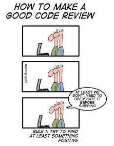
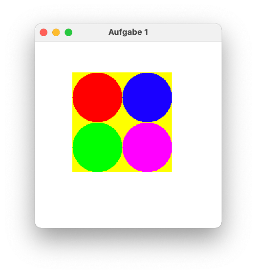

# Aufgaben

Hier finden Sie die Aufgaben. Die Abgabefristen der einzelnen Aufgaben stehen [hier](../#planung-vorlaufig-kann-sich-noch-andern). Beachten Sie die nachfolgenden Hinweise zum Hochladen der Aufgaben. 

## Hinweise zur Abgabe der Aufgaben

Die Aufgaben laden Sie in [Moodle](https://moodle.htw-berlin.de/course/view.php?id=29156) unter dem Reiter "Aufgaben" hoch. Dort ist für jede Aufgabe eine Moodle-Aufgabe erstellt. Beachten Sie, dass ein Hochladen nach Ablauf der Abgabefrist nicht mehr möglich ist. 


### BlueJ vs. Eclipse

Die ersten Wochen verwenden wir als Entwicklungsumgebung BlueJ. Für die Aufgaben, die wir mit BlueJ lösen, werde ich Ihnen jeweils Hinweise zur Abgabe für jede Aufgabe einzeln geben. 

Sobald wir Eclipse verwenden, gelten die folgenden Hinweise: 

- Achten Sie darauf, dass Sie die Quelldateien (also die `.java`-Dateien aus dem `src`-Verzeichnis) hochladen. 
- Ihre Klassen erstellen Sie immer in einem package `aufgaben.aufgabeX`. Das heißt, Aufgabe1 ist im package `aufgaben.aufgabe1`, Aufgabe2 im package `aufgaben.aufgabe2` usw. 
- In Ihrem `workspace`gibt es dann einen Ordner für Ihr Java-Projekt, z.B. `WS21` (je nachdem, wie Sie Ihr Java-Projekt genannt haben) und darin befindet sich ein `bin`- und ein `src`-Ordner. In dem `src`-Ordner befindet sich dann ein Ordner `aufgaben` und darin ein Ordner `aufgaben1` (für Aufgabe1). Darin befindet sich Ihre `.java`-Datei, die Sie hochladen sollen. Angenommen, Sie haben Ihre Klasse `Aufgabe1` genannt, dann heißt die Klasse also `Aufgabe1.java`. Sie folgen also dem Pfad `workspace`--> *Java-Projekt* (z.B. `WS21`) --> `src` --> `aufgaben` --> `aufgabe`*X*.
- Wenn Ihre Lösung aus mehreren Klassen (mehreren `.java`-Dateien) besteht, können Sie entweder die Dateien einzeln hochladen oder Sie zippen Ihre Dateien (am besten dann den `aufgabeX`-Ordner und laden das `.zip`-File hoch. 
- In Ihrer Lösung (Ihrer/n Klasse/n) fügen Sie direkt oberhalb Ihrer Klassendefinition einen JavaDoc-Kommentar ein (`/** ... */`). Dieser enthält ein `@author`-Tag. dahinter schreiben Sie Ihren Namen. Das sieht dann z.B. so aus:
	```java
	package aufgaben.aufgabe1;

	/**
	 * 
	 * @author Jörn Freiheit
	 * 
	 * Diese Klasse gibt auf die Konsole ein Rhombus (eine Raute) aus.
	 * Der Rhombus ist entweder gefuellt oder ungefuellt. 
	 *
	 */
	public class Aufgabe1
	{
		// hier Ihre Implementierung
	}
	```
- Sie können Ihre Aufgaben zu zweit lösen. Tragen Sie dann hinter das `@author`-Tag beide Namen ein und **laden Sie bitte beide** die Lösung in Moodle hoch!

## Code Review

Für jede abgegebene Aufgabe wird Ihnen die Lösung einer Kommilitonin zum Review zugewiesen. Analysieren Sie den Code Ihrer Kommilitonin und geben Sie ihr dazu eine Rückmeldung!  Es genügen 2 bis 3 Review-Kommentare.
Zur offiziellen Abgabe einer Aufgabe gehören also

- das Hochladen der eigenen Lösung,
- das Analysieren/Kommentieren einer fremden Lösung.

#### Hinweise zum Review:

- Es geht nicht darum, das Programm zu überarbeiten, sondern darum es nachzuvollziehen und Ihrer Kommilitonin eine Rückmeldung und eventuell Anregungen zu geben.
- Weisen Sie sowohl auf Stärken als auch auf Schwächen des Quelltexts hin.
- Worauf Sie u.a. achten können:
	- Ist der Quelltext gut strukturiert und verständlich?
	- Haben Variablen und Methoden passende Namen? Werden die Namen konsistent verwendet?
	- Werden Konventionen eingehalten? Beispiel: Klassennamen starten immer mit Großbuchstaben, Objektnamen immer mit Kleinbuchstaben
	- Ist das Programm übersichtlich formatiert? Beispiel: kein horizontales Scrolling nötig
- Machen Sie ggf. Vorschläge für (alternative) Lösungen.
- Gehen Sie respektvoll miteinander um, es gibt keinen Grund, unhöflich zu sein.
- Lesen Sie Ihre Kommentare noch einmal durch, bevor Sie sie an Ihre Kommilitonin weitergeben.



## Aufgaben

#### Aufgabe 1 (Abgabe bis 25.10.2021 24:00 Uhr)
??? "Aufgabe1 - Square mit Circles"
	- Verwenden Sie BlueJ und öffnen Sie das Projekt `picture` aus dem `examples`-Ordner von BlueJ. Speichern Sie das Projekt als Projekt `aufgabe1` ab. Die Klasse `Picture` können Sie wie folgt anpassen:
		```java
		/**
		 * Aufgabe 1
		 * 
		 */
		public class Picture
		{
		    /**
		     * Constructor for objects of class Picture
		     */
		    public Picture()
		    {// nothing to do... instance variables are automatically set to null
		        
		    }

		    /**
		     * Draw this picture.
		     */
		    public void draw()
		    {
		        Square s1 = new Square();		        
		        Circle c1 = new Circle();
		        Circle c2 = new Circle();
		        Circle c3 = new Circle();  
		        Circle c4 = new Circle();
		        // hier die Implementierung
		    }
		}
		```
	 - Programmieren Sie die `draw()`-Methode so, dass folgendes Bild gezeichnet wird:
	 	
	 	
	 	Die Größen bleiben Ihnen überlassen, aber die vier Kreise sollen das gelbe Quadrat vollständig ausfüllen. Den Titel des Fensters müssen Sie nicht ändern (geht aber in der Klasse `Canvas`).

	 - Erstellen Sie sich eine Testklasse `PictureTest`, in der es eine Testmethode `testDraw()` gibt, die die `draw()`-Methode für ein `Picture`-Objekt ausführt. 
	 - Zippen Sie Ihr Projekt `aufgabe1` und laden es in Moodle hoch. 


#### Aufgabe 2 (Abgabe bis 01.11.2021 24:00 Uhr)
??? "Aufgabe2 - Methoden und Ausgaben"
	- Erstellen Sie sich ein neues Projekt `aufgabe2` und darin eine neue Klasse `Aufgabe2`, die wie folgt aussieht:
		```java
					
		public class Aufgabe2
		{
		    public Aufgabe2()
		    {
		        
		    }

		    public void start()
		    {
		        // rufen Sie hier Ihre Methoden auf:
		        
		    }
		}

		```
	- Implementieren Sie eine Methode `computeSum(double number1, double number2)`, die die Summe der beiden Zahlen `number1` und `number2` als `double` *zurückgibt*. 
	- Implementieren Sie eine Methode `printSum(double number1, double number2`, die die Summe der beiden Zahlen `number1` und `number2` in der folgenden Form *ausgibt*. Die Ausgabe sieht für die Beispielwerte `number1 = 4.0` und `number2 = 5.0` so aus:
		```bash
		4.0 + 5.0 = 9.0
		```
		Rufen Sie in der `printSum(double number1, double number2`-Methode die Methode `computeSum(double number1, double number2)` auf!
	- Implementieren Sie ähnliche Methoden auch für die Subtraktion, Multiplikation und Division von zwei `double`-Zahlen. Verwenden Sie jeweils die `computeXXX()`-Methoden in den `printXXX()`-Methoden. 
	- Erstellen Sie eine Methode `printComputations(double number1, double number2)`, in der alle vier `printXXX()`-Methoden aufgerufen werden, so dass durch den Aufruf der `printComputations(double number1, double number2)`-Methode folgende Ausgabe erscheint (Beispielwerte `4.0` und `5.0`):
		```bash
		4.0 + 5.0 = 9.0
		4.0 - 5.0 = -1.0
		4.0 * 5.0 = 20.0
		4.0 / 5.0 = 0.8
		```
	- Zippen Sie Ihr Projekt `aufgabe2` und laden es in Moodle hoch. 


#### Aufgabe 3 (Abgabe bis 08.11.2021 24:00 Uhr)
??? "Aufgabe3 - Rechteck"
	- Erstellen Sie sich ein neues Projekt `aufgabe3` und darin eine neue Klasse `Aufgabe3`, die wie folgt aussieht:
		```java
					
		public class Aufgabe3
		{
		    public Aufgabe3()
		    {
		        
		    }

		    public void start()
		    {
		        // rufen Sie hier Ihre Methoden auf:
		        
		    }
		}

		```
	- Implementieren Sie eine Methode `public void printRectangle(int width, int height, boolean filled){}`
	- Ist der Parameterwert von `filled` `true`, dann soll ein Rechteck wie folgt auf die Konsole ausgegeben werden (Beispielausgabe für `width=11` und `height=5`):
		```bash
		***********
		***********
		***********
		***********
		***********
		```
	- Ist der Parameterwert von `filled` `false`, dann soll das Rechteck ungefüllt sein, also so:
		```bash
		***********
		*		  *
		*		  *
		*		  *
		***********
		```
	- Die obere Ausgabe ist also durch die Anweisung `printRectangle(11, 5, true);` und die untere durch die Anweisung `printRectangle(11, 5, false);` entstanden.
	- **Tipp:**: Schreiben Sie sich zwei weitere Methoden `public void printRectangleFilled(int width, int height){}` und `public void printRectangleUnfilled(int width, int height){}`, die Sie entsprechend des Wertes von `filled` aufrufen. In der einen Methode erstellen Sie das ausgefüllte Rechteck und in der anderen das ungefüllte. Dann wird Ihr Programm nicht zu unübersichtlich. Fangen Sie am besten mit der ausgefüllten an, die ist etwas leichter. 
	- Das Programm soll für beliebige (nicht so große - max. Werte für `width` und `height` je `100`) positive Zahlen (also `> 0`) funktionieren. Insbesondere sind die Tests für `width=1` und `height=1` bzw. `height=2` interessant. 
	- Zippen Sie Ihr Projekt `aufgabe3` und laden es in Moodle hoch. Viel Spaß und viel Erfolg!


#### Aufgabe 4 (Abgabe bis 15.11.2021 24:00 Uhr)
??? "Aufgabe4 - Rhombus"
	- Erstellen Sie sich ein neues Projekt `aufgabe4` und darin eine neue Klasse `Aufgabe4`, die wie folgt aussieht:
		```java
					
		public class Aufgabe4
		{
		    public Aufgabe4()
		    {
		        
		    }

		    public void start()
		    {
		        // rufen Sie hier Ihre Methoden auf:
		        
		    }
		}

		```
	- Implementieren Sie eine Methode `public void printRhombus(int upperHalf, boolean filled){}`
	- Ist der Parameterwert von `filled` `true`, dann soll ein Rhombus (eine Raute) wie folgt auf die Konsole ausgegeben werden:
		```bash
		      *
		     ***
		    *****
		   *******
		  *********
		 ***********
		  *********
		   *******
		    *****
		     ***
		      *
		```
	- Ist der Parameterwert von `filled` `false`, dann soll der Rhombus ungefüllt sein, also so:
		```bash
		      *
		     * *
		    *   *
		   *     *
		  *       *
		 *         *
		  *       *
		   *     *
		    *   *
		     * *
		      *
		```
	- der Wert für `upperHalf` gibt die Höhe einer Hälfte des Rhombus an. Die Gesamthöhe des Rhombus berechnet sich aus `
		```java
		int height = 2 * upperHalf +1;
		```
	- In unserem oben gezeigten Beispiel ist der Wert von `upperHalf` `5` und die Gesamthöhe des Rhombus `11`. 
	- Die obere Ausgabe ist also durch die Anweisung `printRhombus(5, true);` und die untere durch die Anweisung `printRhombus(5, false);` entstanden.
	- Die Berechnung der Höhe aus dem Parameterwert `upperHalf` hat die Vorteile, 
		- dass die Höhe dadurch immer eine ungerade Zahl ist (was notwendig ist) und 
		- dass Sie den Wert `upperHalf` gut verwenden können (was ebenfalls notwendig ist, wie Sie merken werden)
	- **Tipp:**: Schreiben Sie sich zwei weitere Methoden `public void printRhombusFilled(int upperHalf){}` und `public void printRhombusUnfilled(int upperHalf){}`, die Sie entsprechend des Wertes von `filled` aufrufen. In der einen Methode erstellen Sie die ausgefüllte Raute und in der anderen die ungefüllte. Dann wird Ihr Programm nicht zu unübersichtlich. Fangen Sie am besten mit der ausgefüllten an, die ist etwas leichter. 
	- Das Programm soll für beliebige (nicht so große - max. Wert `100`) positive Zahlen (also `> 0`) von `upperHalf` funktionieren. Insbesondere sind die Tests für `upperhalf == 1` interssant. 
	- Zippen Sie Ihr Projekt `aufgabe4` und laden es in Moodle hoch. Viel Spaß und viel Erfolg!


#### Aufgabe 5 (Abgabe bis 22.11.2021 24:00 Uhr)
??? "Aufgabe5 - Knobeleien"
	- Diese Aufgabe ist hauptsächlich dazu da, um das algorithmische Denken zu schulen. Sie werden im Netz jeweils viele Lösungen finden, aber Sie sollten versuchen, alleine auf eine Lösung zu kommen. Versuchen Sie es! Ich gebe zu jeder Aufgabe kleine Tipps. 
	- Erstellen Sie sich ein neues Projekt `aufgabe5` und darin eine neue Klasse `Aufgabe5`, die wie folgt aussieht:
		```java				
		public class Aufgabe5
		{
		    public Aufgabe5()
		    {
		        
		    }

		    public void start()
		    {
		        // rufen Sie hier Ihre Methoden auf:
		        
		    }
		}
		```
	- Implementieren Sie eine Methode `public int computeChecksum(int number){}`. Diese Methode berechnet die Quersumme der Zahl `number` und gibt diese zurück. Hier ein paar Beispiele:
		```
		number: 123456 		-> checksum: 21
		number: -123456 	-> checksum: -21
		number: 0 			-> checksum: 0
		number: 2147483647 	-> checksum: 46
		number: -2147483648	-> checksum: -47
		```
		**Tipp**: "Laufen" Sie am besten von hinten nach vorne durch die Zahl `number` und lösen immer die letzte Ziffer von der Zahl, um diese dann zur Quersumme zu addieren. Welchen Operator kennen Sie, um als Ergebnis die letzte Ziffer einer Dezimalzahl zu erhalten? Wie lange müssen Sie "laufen"?
	- Implementieren Sie eine Methode `public void printCombinations36(){}`. Diese Methode gibt alle Kombinationen für 3 **ganze** Zahlen `x`, `y` und `z` auf der Konsole aus, für die Folgendes gilt:
		```
		x <= y <= z und
		x * y * z = 36
		``` 
		**Tipp**: Überlegen Sie sich zuerst, wie man z.B. alle Kombinationen ermitteln kann, wenn `x`, `y` und `z` jeweils Werte zwischen `-50` und `50` (das ist aber nicht der endgültige Wertebereich!!! - Sie können gerne auch anders anfangen) annehmen können (das sind dann `100^3`, also `1000000` Kombinationen). Überlegen Sie dann, wie Sie diese Wertebereiche mithilfe der beiden Bedingungen einschränken können. Es gibt übrigens 28 Kombinationen, für die die beiden obigen Bedingungen gelten.  

		---

		***Wenn Sie diese beiden Aufgaben erledigt haben, dann haben Sie genug geknobelt. Herzlichen Glückwunsch - Aufgabe erfüllt! Nur für diejenigen unter Ihnen, die vom Knobeln nicht genug bekommen können, gibt es die folgende Zusatzaufgabe. Ist aber wirklich keine Pflicht, sondern soll nur Vergnügen sein :-)***

		---

	- **Zusatzaufgabe**: Implementieren Sie eine Methode `public void printPrimeFactors(int number){}`, die für die übergebene Zahl `number` die Primzahlfaktorzerlegung auf die Konsole ausgibt, also z.B. so:
		```
		480 --> 2 2 2 2 2 3 5 
		17 --> 17 
		12345 --> 3 5 823
		```
		**Tipp:**: Nützliche Methoden sind sicherlich `boolean isPrime(int number)` und `boolean isDivider(int factor, int number)`, wobei Letztere prüft, ob `factor` ein ganzzahliger Teiler von `number` ist. Achten Sie darauf, dass wenn Sie einen Primfaktor gefunden haben, es auch derselbe Primfaktor wiederholt sein kann. Ist knifflig!  


#### Aufgabe 6 (Abgabe bis 29.11.2021 24:00 Uhr)
??? "Aufgabe6 - Triangle"
	- Wir erstellen uns einen neuen Datentyp `Triangle`

	- Erstellen Sie sich ein neues Projekt `aufgabe6` und darin eine neue Klasse `Triangle` sowie dafür eine Testklasse `TestTriangle` mit einer `testTriangle()`-Methode. 

	- In der Klasse `Triangle` erstellen Sie drei Objektvariablen `a`, `b` und `c` jeweils vom Typ `int` und alle `private`. Das sollen die Seiten unseres Dreiecks sein. 

	- Erstellen Sie einen Konstruktor, dem drei Parameterwerte übergeben werden `pa`, `pb` und `pc` alle vom Typ `int`. Mit diesen Werten werden die Objektvariablen initialisiert. 

	- Schreiben Sie eine Objektmethode `print()`, die die Seitenlängen des Dreiecks in der folgenden Form ausgibt:
		```bash
		Seiten          : a=3, b=4, c=5
		```
		für den Fall, dass die Seitenlängen `3`, `4` und `5` sind. 

	- Wenn Sie jetzt in der `testTriangle()`-Methode der Testklasse `TestTriangle` folgende Anweisungen ausführen
		```java 
		Triangle t1 = new Triangle(3, 4, 5);
		Triangle t2 = new Triangle(4, 4, 7);
		Triangle t3 = new Triangle(5, 5, 5);
		Triangle t4 = new Triangle(4, 5, 3);
		Triangle t5 = new Triangle(4, 3, 5);
		Triangle t6 = new Triangle(3, 4, 5);
		
		t1.print();
		t2.print();
		t3.print();
		t4.print();
		t5.print();
		t6.print();
		```
		dann sollte die Ausgabe ungefähr so aussehen:
		```bash
		Seiten          : a=3, b=4, c=5
		Seiten          : a=4, b=4, c=7
		Seiten          : a=5, b=5, c=5
		Seiten          : a=4, b=5, c=3
		Seiten          : a=4, b=3, c=5
		Seiten          : a=3, b=4, c=5
		```

	- Erstellen Sie in der Klasse `Triangle` eine Objektmethode `public int circumference()`, die den Umfang des Dreiecks zurückgibt (also die Summe der drei Seitenlängen).

	- Erstellen Sie in der Klasse `Triangle` eine Objektmethode `public double area()`, die den Flaecheninhalt des Dreiecks zurückgibt.  Der Flächeninhalt `A` eines Dreiecks lässt sich nach der [Heron'schen Formel](https://de.wikipedia.org/wiki/Satz_des_Heron) wie folgt berechnen:
		- `A` = Math.sqrt(s * (s-a) * (s-b) * (s-c))
		- wobei `s = (a + b + c) / 2`
		- Achten Sie darauf, dass Sie stets mit `double` rechnen!
		- Beachten Sie, dass in einem Dreieck keine Seite länger sein darf als die Summe der beiden anderen. Für die oben in der `testTriangle()`-Methode erstellten Objekte gilt das aber. Wir müssen deshalb nichts weiter beachten. 

	- Erweitern Sie die Objektmethode `print()` nun so, dass auch der Umfang und der Flaecheninhalt in der folgenden Form ausgegeben werden (Sie können in die `print()`-methode auch die Leerzeile integrieren):
		```bash
		Seiten          : a=3, b=4, c=5
		Umfang          : 12
		Flaecheninhalt  : 6.0

		Seiten          : a=4, b=4, c=7
		Umfang          : 15
		Flaecheninhalt  : 6.777720855862979

		Seiten          : a=5, b=5, c=5
		Umfang          : 15
		Flaecheninhalt  : 10.825317547305483

		Seiten          : a=4, b=5, c=3
		Umfang          : 12
		Flaecheninhalt  : 6.0

		Seiten          : a=4, b=3, c=5
		Umfang          : 12
		Flaecheninhalt  : 6.0

		Seiten          : a=3, b=4, c=5
		Umfang          : 12
		Flaecheninhalt  : 6.0
		```

	- Erstellen Sie in der Klasse `Triangle` eine Objektmethode `public boolean equilateral()`, die ein `true` zurückgibt, wenn das Dreieck gleichseitig ist (also alle Seiten des Dreiecks gleich lang sind) und `false` sonst.

	- Erstellen Sie in der Klasse `Triangle` eine Objektmethode `public boolean isosceles()`, die ein `true` zurückgibt, wenn das Dreieck gleichschenklig ist (also zwei Seiten des Dreiecks gleich lang sind) und `false` sonst.

	- Erweitern Sie die Objektmethode `print()` nun so, dass die Prüfungen, ob sich um ein gleichseitiges oder gleichschenkliges (oder unregelmäßiges) Dreieck handelt, in der folgenden Form ausgegeben werden:
		```bash
		Seiten          : a=3, b=4, c=5
		Umfang          : 12
		Flaecheninhalt  : 6.0
		Das Dreieck ist unregelmaessig.

		Seiten          : a=4, b=4, c=7
		Umfang          : 15
		Flaecheninhalt  : 6.777720855862979
		Das Dreieck ist gleichschenklig.

		Seiten          : a=5, b=5, c=5
		Umfang          : 15
		Flaecheninhalt  : 10.825317547305483
		Das Dreieck ist gleichseitig.

		Seiten          : a=4, b=5, c=3
		Umfang          : 12
		Flaecheninhalt  : 6.0
		Das Dreieck ist unregelmaessig.

		Seiten          : a=4, b=3, c=5
		Umfang          : 12
		Flaecheninhalt  : 6.0
		Das Dreieck ist unregelmaessig.

		Seiten          : a=3, b=4, c=5
		Umfang          : 12
		Flaecheninhalt  : 6.0
		Das Dreieck ist unregelmaessig.
		```

	- ---

	**Wenn Sie das geschafft haben, dann haben Sie die Aufgabe erfüllt! Herzlichen Glückwunsch! Die folgenden Aufgaben sind optional (kann auch sein, dass wir die Objektvergleiche noch gar nicht haben, dann wird es erst recht knifflig :-) ):**

	- ---

	- Erstellen Sie in der Klasse `Triangle` eine Objektmethode `public boolean sameCircumference(Triangle t)`, die ein `true` zurückgibt, wenn das aufrufende Objekt den gleichen Umfang hat wie `t` und `false` sonst.

	- Erstellen Sie in der Klasse `Triangle` eine Objektmethode `public boolean isSmaller(Triangle t)`, die ein `true` zurückgibt, wenn das aufrufende Objekt einen kleineren Flächeninhalt hat, als `t` und `false` sonst.

	- Erstellen Sie in der Klasse `Triangle` eine Objektmethode `public boolean isBigger(Triangle t)`, die ein `true` zurückgibt, wenn das aufrufende Objekt einen größeren Flächeninhalt hat, als `t` und `false` sonst.

	- Testen Sie in der `testTriangle()`-Methode der Testklasse `TestTriangle` die drei zuletztgeschriebenen Methoden, so dass folgende Ausgaben erzeugt werden:
		```bash
		t1 und t2 gleicher Umfang ? : false
		t1 und t3 gleicher Umfang ? : false
		t2 und t3 gleicher Umfang ? : true

		t1 kleiner als t2 ? : true
		t2 kleiner als t1 ? : false
		t1 kleiner als t4 ? : false
		t4 kleiner als t1 ? : false

		t1 groesser als t2 ? : false
		t2 groesser als t1 ? : true
		t1 groesser als t4 ? : false
		t4 groesser als t1 ? : false
		```

	- Erstellen Sie in der Klasse `Triangle` eine Objektmethode `public boolean sidesAreEqual(Triangle t)`, die ein `true` zurückgibt, wenn das aufrufende Objekt die gleichen Seitenlängen hat wie `t` und `false` sonst.
		- Beachten Sie, dass folgende Dreiecke mit z.B. dem Dreieck (`a=3, b=4, c=5`) gleich sein sollen: (`a=3, b=4, c=5`), aber auch (`a=4, b=5, c=3`), aber auch (`a=5, b=3, c=4`) --> die "Benennung" der Seiten ist also egal
		- Jedoch soll z.B. (`a=4, b=3, c=5`) nicht gleich zu (`a=3, b=4, c=5`) sein
		- für die obigen Objekte soll somit gelten:
			```bash
			t1 und t2 gleiche Seiten ? : false
			t1 und t4 gleiche Seiten ? : true
			t1 und t5 gleiche Seiten ? : false
			t1 und t6 gleiche Seiten ? : true
			```
			Erzeugen Sie diese Ausgabe in `testTriangle()`.

	- Erstellen Sie in der Klasse `Triangle` eine Objektmethode `public boolean isRightAngled()`, die ein `true` zurückgibt, wenn das Dreieck rechtwinklig ist und `false` sonst.
		- der [Satz des Pythagoras](https://de.wikipedia.org/wiki/Satz_des_Pythagoras) besagt, dass in einem rechtwinkligen Dreieck gilt: `a^2 + b^2 = c^2`
		- es gilt aber auch die Umkehrung, d.h. wenn von 2 Seiten die Summe der Quadrate dem Quadrat der dritten Seite entspricht, dann ist das Dreieck rechtwinklig 
	- Erweitern Sie die Objektmethode `print()` nun so, dass die Prüfungen, ob sich um ein rechtwinkliges Dreieck handelt, in der folgenden Form ausgegeben werden:
		```bash
		Seiten          : a=3, b=4, c=5
		Umfang          : 12
		Flaecheninhalt  : 6.0
		Das Dreieck ist unregelmaessig.
		Das Dreieck ist rechtwinklig.

		Seiten          : a=4, b=4, c=7
		Umfang          : 15
		Flaecheninhalt  : 6.777720855862979
		Das Dreieck ist gleichschenklig.
		Das Dreieck ist nicht rechtwinklig.

		Seiten          : a=5, b=5, c=5
		Umfang          : 15
		Flaecheninhalt  : 10.825317547305483
		Das Dreieck ist gleichseitig.
		Das Dreieck ist nicht rechtwinklig.

		Seiten          : a=4, b=5, c=3
		Umfang          : 12
		Flaecheninhalt  : 6.0
		Das Dreieck ist unregelmaessig.
		Das Dreieck ist rechtwinklig.

		Seiten          : a=4, b=3, c=5
		Umfang          : 12
		Flaecheninhalt  : 6.0
		Das Dreieck ist unregelmaessig.
		Das Dreieck ist rechtwinklig.

		Seiten          : a=3, b=4, c=5
		Umfang          : 12
		Flaecheninhalt  : 6.0
		Das Dreieck ist unregelmaessig.
		Das Dreieck ist rechtwinklig.
		```

	- Viel Spaß und viel Erfolg!


#### Aufgabe 7 (Abgabe bis 6.12.2021 24:00 Uhr)
??? "Aufgabe7 - Time"
	- Wir erstellen uns einen neuen Datentyp `Time`

	- Erstellen Sie sich ein neues Projekt `aufgabe7` und darin eine neue Klasse `Time` sowie dafür eine Testklasse `TimeTest` mit einer `testTime()`-Methode. 

	- In der Klasse `Time` erstellen Sie zwei Objektvariablen `hours` und `minutes`, jeweils vom Typ `int` und beide `private`. 

	- Erstellen Sie einen parameterlosen Konstruktor, der die Objektvariablen mit jeweils `0` initialisiert. 

	- Implementieren Sie eine Methode `public void changeTime(int diffMinutes)`. Dieser Methode wird als Parameterwert eine Anzahl von Minuten übergeben, um die sich die aktuelle Zeit ändern soll. Beachten Sie:

		- die Objektvariable `minutes` soll nur Werte von `0` bis `59` annehmen dürfen,
		- die Objektvariable `hours` soll nur Werte von `0` bis `23` annehmen dürfen,
		- `diffMinutes` kann auch negativ sein.

	- Implementieren Sie eine Methode `public String timeToString()`. Diese Methode gibt die aktuelle Zeit in der Form `hh:mm` als String zurück. Beachten Sie:

		- Sowohl die Stunden als auch die Minuten haben eventuelle führende Nullen, d.h. Beispiele für den Rückgabestring können auch `01:00` sein oder `09:09`.

	- Implementieren Sie eine Methode `public void printTime()`. Diese Methode gibt die aktuelle Uhrzeit unter Verwendung der Methode `timeToString()` auf die Konsole aus. 

	- Wenn Sie die Testmethode `testTime()` z.B. wie folgt implementieren:
		```java
		@Test
	    public void testTime()
	    {
	        Time t1 = new Time();
	        t1.printTime();
	        t1.changeTime(30);
	        t1.printTime();
	        t1.changeTime(30);
	        t1.printTime();
	        t1.changeTime(60);
	        t1.printTime();
	        t1.changeTime(600);
	        t1.printTime();
	        t1.changeTime(660);
	        t1.printTime();
	        t1.changeTime(60);
	        t1.printTime();
	        t1.changeTime(-60);
	        t1.printTime();
	    }
		```
		dann sollte folgende Ausgabe auf der Konsole erscheinen:
		```bash
		00:00
		00:30
		01:00
		02:00
		12:00
		23:00
		00:00
		23:00
		```

	- Insbesondere für die `changeTime()`-Methode sollten Sie erst ausführlich überlegen, ehe Sie losprogrammieren. Nicht vergessen, dass Zettel und Stift die wichtigsten Werkzeuge der Programmiererin sind! 

	- Viel Spaß und viel Erfolg!


#### Aufgabe 8 (Abgabe bis 13.12.2021 24:00 Uhr)
??? "Aufgabe8 - Counter und Clock"
	- Wir erstellen uns zwei neue Datentypen `Counter` und `Clock`

	- Erstellen Sie sich ein neues Projekt `aufgabe8` und darin eine neue Klasse `Counter` sowie eine Programm-/Testklasse `Programclass` mit einer `start()`-Methode. 

	- Die Idee der Klasse `Counter` soll sein, einen `counter` bis zu einem bestimmten `limit` hochzuzählen. Bevor der `counter` das `limit` erreicht, wird er wieder auf `0` gesetzt. Angenommen also das `limit` ist `60` und der `counter` hat den aktuellen Wert `59` und soll erhöht werden, dann ist der nächste Wert von `counter` wieder `0`, da das `limit` erreicht wurde. 

	- In der Klasse `Counter` erstellen Sie zwei Objektvariablen `counter` und `limit`, jeweils vom Typ `int` (beide nur in der Klasse sichtbar). 

	- Erstellen Sie einen parametrisierten Konstruktor `public Counter(int limit)`, der den `counter` auf `0` initialisiert und das `limit` auf den Parameterwert. 

	- Implementieren Sie eine Methode `public boolean increase()`. Diese Methode soll den Wert von `counter` um `1` erhöhen. Es muss jedoch geprüft werden, ob eventuell das `limit` erreicht wurde. Sollte dies der Fall sein, wird der Wert von `counter` wieder auf `0` gesetzt. Wird der `counter` tatsächlich um `1` erhöht, gibt die Methode ein `true` zurück, wurde der Wert von `counter` jedoch auf `0` gesetzt, gibt die Methode `false` zurück. Beispiel:

		- Angenommen `counter` hat den Wert `58` und das `limit` ist `60`. Dann ist der neue Wert von `counter` `59` und die Methode gibt `true` zurück. 
		- Angenommen `counter` hat den Wert `59` und das `limit` ist `60`. Dann ist der neue Wert von `counter` `0` und die Methode gibt `false` zurück. 

	- Implementieren Sie eine Methode `public String toString()`. Diese Methode gibt den Wert von `counter` als zweistelligen String zurück. Beachten Sie

		- Ist der Wert von `counter` einstellig, z.B. `5`, dann soll der String `"05"` zurückgegeben werden.

	- Implementieren Sie eine Methode `public void print()`. Diese Methode gibt den aktuellen Wert von `counter` unter Verwendung der Methode `toString()` auf die Konsole aus. 

	- Wenn Sie die Methode `start()` in der `Programclass` z.B. wie folgt implementieren:
		```java
		public void start()
	    {
	        Counter counter = new Counter(60);
	        for(int i=0; i<120; i++)
	        {
	            counter.increase();
	            System.out.printf("%3d : ", i);
	            counter.print();
	        }
	    }
		```
		dann sollte folgende Ausgabe auf der Konsole erscheinen:

		??? "Ausgabe auf der Konsole"

			```bash
			  0 : 01
			  1 : 02
			  2 : 03
			  3 : 04
			  4 : 05
			  5 : 06
			  6 : 07
			  7 : 08
			  8 : 09
			  9 : 10
			 10 : 11
			 11 : 12
			 12 : 13
			 13 : 14
			 14 : 15
			 15 : 16
			 16 : 17
			 17 : 18
			 18 : 19
			 19 : 20
			 20 : 21
			 21 : 22
			 22 : 23
			 23 : 24
			 24 : 25
			 25 : 26
			 26 : 27
			 27 : 28
			 28 : 29
			 29 : 30
			 30 : 31
			 31 : 32
			 32 : 33
			 33 : 34
			 34 : 35
			 35 : 36
			 36 : 37
			 37 : 38
			 38 : 39
			 39 : 40
			 40 : 41
			 41 : 42
			 42 : 43
			 43 : 44
			 44 : 45
			 45 : 46
			 46 : 47
			 47 : 48
			 48 : 49
			 49 : 50
			 50 : 51
			 51 : 52
			 52 : 53
			 53 : 54
			 54 : 55
			 55 : 56
			 56 : 57
			 57 : 58
			 58 : 59
			 59 : 00
			 60 : 01
			 61 : 02
			 62 : 03
			 63 : 04
			 64 : 05
			 65 : 06
			 66 : 07
			 67 : 08
			 68 : 09
			 69 : 10
			 70 : 11
			 71 : 12
			 72 : 13
			 73 : 14
			 74 : 15
			 75 : 16
			 76 : 17
			 77 : 18
			 78 : 19
			 79 : 20
			 80 : 21
			 81 : 22
			 82 : 23
			 83 : 24
			 84 : 25
			 85 : 26
			 86 : 27
			 87 : 28
			 88 : 29
			 89 : 30
			 90 : 31
			 91 : 32
			 92 : 33
			 93 : 34
			 94 : 35
			 95 : 36
			 96 : 37
			 97 : 38
			 98 : 39
			 99 : 40
			100 : 41
			101 : 42
			102 : 43
			103 : 44
			104 : 45
			105 : 46
			106 : 47
			107 : 48
			108 : 49
			109 : 50
			110 : 51
			111 : 52
			112 : 53
			113 : 54
			114 : 55
			115 : 56
			116 : 57
			117 : 58
			118 : 59
			119 : 00
			```

	- Erstellen Sie sich im Projekt `aufgabe8` eine weitere Klasse `Clock`. 

	- In der Klasse `Clock` verwenden Sie zwei `Counter`. Der eine `Counter` zählt die `minutes` und hat das `limit` `60` und der andere `Counter` zählt die `hours` udn hat das `limit` `24`.  

	- In der Klasse `Clock` erstellen Sie zwei Objektvariablen `minutes` und `hours`, jeweils vom Typ `Counter` (beide nur in der Klasse sichtbar). 

	- Erstellen Sie einen parameterlosen Konstruktor `public Clock()`. Darin erzeugen Sie für `minutes` das `Counter`-Objekt mit dem `limit` `60` und für `hours` das `Counter`-Objekt mit dem `limit` `24`.  

	- Implementieren Sie eine Methode `public void increase()`. Diese Methode soll den Wert von `minutes` um `1` erhöhen. Sollte jedoch das `limit` von `minutes` erreicht sein, wird auch `hours` um `1` erhöht. Nutzen Sie die `increase()`-Methode von `Counter`!

	- Implementieren Sie eine Methode `public String toString()`. Diese Methode gibt die Werte von `minutes` und `hours` in der Form `hh:mm`als String zurück, also z.B. `"23:59"` oder `"01:09"`. Nutzen Sie die `toString()`-Methode von `Counter`!

	- Implementieren Sie eine Methode `public void print()`. Diese Methode gibt den aktuellen Wert von `Clock` unter Verwendung der Methode `toString()` auf die Konsole aus. 

	- Wenn Sie die Methode `start()` in der `Programclass` z.B. wie folgt erweitern (der Test von `Counter` ist hier gelöscht):
		```java
		public void start()
	    {
	        Clock clock = new Clock();
	        for(int i=0; i<1600; i++)
	        {
	            clock.increase();
	            if(i%50==0)
	            {
	                System.out.printf("%4d : ", i);
	                clock.print();
	            }
	        }
	    }
		```
		dann sollte folgende Ausgabe auf der Konsole erscheinen:

		??? "Ausgabe auf der Konsole"

			```bash
			   0 : 00:01
			  50 : 00:51
			 100 : 01:41
			 150 : 02:31
			 200 : 03:21
			 250 : 04:11
			 300 : 05:01
			 350 : 05:51
			 400 : 06:41
			 450 : 07:31
			 500 : 08:21
			 550 : 09:11
			 600 : 10:01
			 650 : 10:51
			 700 : 11:41
			 750 : 12:31
			 800 : 13:21
			 850 : 14:11
			 900 : 15:01
			 950 : 15:51
			1000 : 16:41
			1050 : 17:31
			1100 : 18:21
			1150 : 19:11
			1200 : 20:01
			1250 : 20:51
			1300 : 21:41
			1350 : 22:31
			1400 : 23:21
			1450 : 00:11
			1500 : 01:01
			1550 : 01:51
			```

	- Viel Spaß und viel Erfolg!


#### Aufgabe 9 (Abgabe bis 20.12.2021 24:00 Uhr)
??? "Aufgabe9 - Bruch"
	- Wir erstellen uns einen Datentyp `Bruch` (extra mal etwas Mathematisches ;-))

	- Erstellen Sie sich ein neues Projekt `aufgabe9` und darin eine neue Klasse `Bruch` sowie eine Programm-/Testklasse `Programclass` mit einer `main()`-Methode. 

	- In der Klasse `Bruch` erstellen Sie zwei Objektvariablen `zaehler` und `nenner` jeweils vom Typ `int` und `private`. 

	- Implementieren Sie für die Klasse `Bruch` zwei verschiedene Konstruktoren
		- parameterlos --> `zaehler` und `nenner` erhalten jeweils den Wert `1`
		- mit zwei Parametern (`int zaehler, int nenner`) --> entspr. Werte der Objektvariablen 

	- Implementieren Sie folgende Objektmethoden
		- `public Bruch plus(Bruch b)` --> gibt den gekürzten Bruch aus der Addition eines Bruchs mit `b` zurück
		- `public Bruch minus(Bruch b)` --> gibt den gekürzten Bruch aus der Subtraktion eines Bruchs mit `b` zurück
		- `public Bruch mal(Bruch b)` --> gibt den gekürzten Bruch aus der Multiplikation eines Bruchs mit `b` zurück
		- `public Bruch geteilt(Bruch b)` --> gibt den gekürzten Bruch aus der Division eines Bruchs mit `b` zurück
		- `public Bruch kuerzen()` --> gibt den gekürzten Bruch zurück (Sie brauchen dazu den `ggT`)
		_ `public String toString()` --> gibt einen Bruch als `String` in der Form `zaehler / nenner` zurück (annotieren Sie diese Methode als **überschrieben**!)
		- `public int ggT(int zahl1, int zahl2)` --> gibt den größten gemeinsamen Teiler (ggT) der beiden Zahlen `zahl1` und `zahl2` als `int` zurück - siehe [Euklidischer Algorithmus](../start/#beispiel-euklidischer-algorithmus)

	- Geben Sie in die `main()`-Methode der `Programclass`-Klasse mindestens folgende Anweisungen ein:
		```java 
		Bruch b1 = new Bruch(3,7);
		Bruch b2 = new Bruch(4,8);
		Bruch b3 = new Bruch(2,5);
		Bruch b4 = new Bruch(5,11);
		Bruch b5 = new Bruch();
		
		System.out.printf("%n%n------------------------- Rechnen -----------------------------------%n%n");
		System.out.printf("%5s + %5s = %5s %n", b1.toString(), b2.toString(), b1.plus(b2).toString());
		System.out.printf("%5s - %5s = %5s %n", b3.toString(), b4.toString(), b3.minus(b4).toString());
		System.out.printf("%5s * %5s = %5s %n", b1.toString(), b3.toString(), b1.mal(b3).toString());
		System.out.printf("%5s / %5s = %5s %n", b2.toString(), b1.toString(), b2.geteilt(b1).toString());
		System.out.printf("%5s + %5s = %5s %n", b5.toString(), b4.toString(), b5.plus(b4).toString());	
		System.out.printf("%5s - %5s = %5s %n", b1.toString(), b1.toString(), b1.minus(b1).toString());		// nenner sollte ungleich 0 bleiben!	
		``` 
		und führen Sie die `main()`-Methode aus. Es sollten folgende Augaben entstehen:
		```bash
		------------------------- Rechnen -----------------------------------

		  3/7 +   4/8 = 13/14 
		  2/5 -  5/11 = -3/55 
		  3/7 *   2/5 =  6/35 
		  4/8 /   3/7 =   7/6 
		  1/1 +  5/11 = 16/11
		  3/7 -   3/7 =   0/1 
		```
	
	- Implementieren Sie folgende Objektmethoden
		- `public boolean istGroesser(Bruch b)` --> gibt `true` zurück, wenn der aufrufende Bruch größer als `b` ist, `false` sonst
		- `public boolean istKleiner(Bruch b)` --> gibt `true` zurück, wenn der aufrufende Bruch kleiner als `b` ist, `false` sonst
		- `public boolean equals(Bruch b)` --> gibt `true` zurück, wenn der aufrufende Bruch gleich `b` ist, `false` sonst (annotieren Sie diese Methode als **überschrieben**!)

	- Fügen Sie in die Klasse `Bruch` noch folgende Methode ein:
		```java
		@Override
		public int hashCode()
		{
			return this.zaehler * this.nenner;
		}
		```

	- Geben Sie in die `main()`-Methode der `Programclass`-Klasse mindestens folgende weitere Anweisungen ein:
		```java 
		System.out.printf("%n%n------------------------- Vergleichen -----------------------------------%n%n");
		System.out.printf("%5s  > %5s ? %b %n", b1.toString(), b2.toString(), b1.istGroesser(b2));
		System.out.printf("%5s  < %5s ? %b %n", b1.toString(), b2.toString(), b1.istKleiner(b2));
		System.out.printf("%5s == %5s ? %b %n", b1.toString(), b2.toString(), b1.equals(b2));
		System.out.printf("%5s  > %5s ? %b %n", b3.toString(), b4.toString(), b3.istGroesser(b4));
		System.out.printf("%5s  < %5s ? %b %n", b3.toString(), b4.toString(), b3.istKleiner(b4));
		System.out.printf("%5s == %5s ? %b %n", b3.toString(), b4.toString(), b3.equals(b4));
		System.out.printf("%5s  > %5s ? %b %n", b5.toString(), b5.toString(), b5.istGroesser(b5));
		System.out.printf("%5s  < %5s ? %b %n", b5.toString(), b5.toString(), b5.istKleiner(b5));
		System.out.printf("%5s == %5s ? %b %n", b5.toString(), b5.toString(), b5.equals(b5));
		``` 
		und führen Sie die `main()`-Methode aus. Es sollten folgende weitere Ausgaben entstehen:
		```bash
		------------------------- Vergleichen -----------------------------------

		  3/7  >   4/8 ? false 
		  3/7  <   4/8 ? true 
		  3/7 ==   4/8 ? false 
		  2/5  >  5/11 ? false 
		  2/5  <  5/11 ? true 
		  2/5 ==  5/11 ? false 
		  1/1  >   1/1 ? false 
		  1/1  <   1/1 ? false 
		  1/1 ==   1/1 ? true 
		```
	- Viel Spaß und viel Erfolg!

