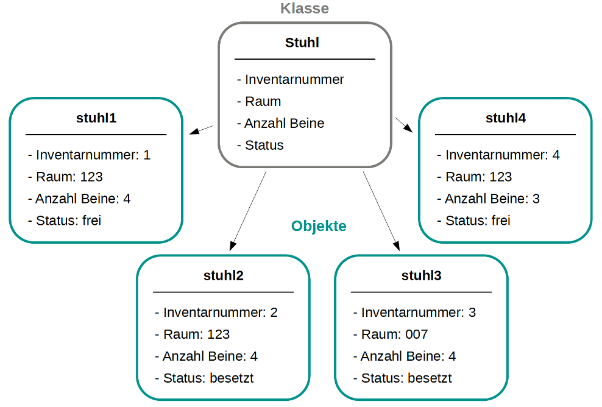
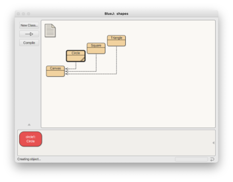
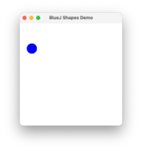
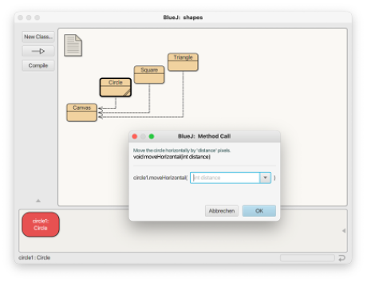
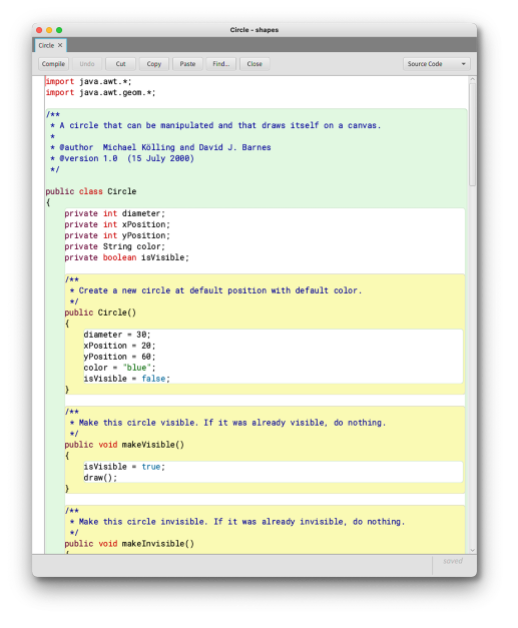
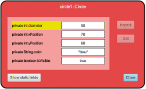
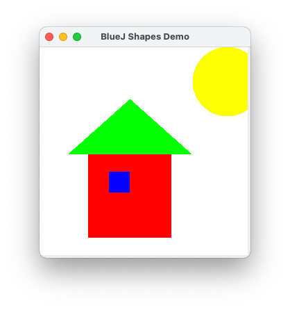

# BlueJ

Wir lernen unsere Entwicklungsumgebung kennen, die wir in den ersten Wochen für das Programmieren nutzen werden. Es handelt sich um [BlueJ](../tools/#bluej). [BlueJ](https://www.bluej.org/) wurde extra für Studierende entwickelt, die Programmieren lernen. Das **J** in **BlueJ** steht für **Java**. Mit BlueJ wird also das Programmieren mit Java gelernt. Eine wesentliche Idee hinter der Entwicklung von BlueJ bestand darin, gleich am Anfang mit der *objektorientierten* Programmierung zu beginnen, d.h. sich gleich mit *Klassen* und *Objekten* zu beschäftigen. Das passiert häufig erst recht spät in der Programmierausbildung. 

Wir geben zunächst einen groben Überblick und lernen dabei in kurzer Zeit viele neue Konzepte und Begriffe kennen. Aber keine Sorge, mit all diesen Konzepten beschäftigen wir uns jeweils noch ganz ausführlich. 

## Objekte und Klassen

Wenn wir uns die Welt betrachten, dann besteht diese aus lauter *Objekten*, die miteinander in Beziehung stehen. Man ganz *konkret* über bestimmte *Objekte* sprechen:

- „das ist ein schöner Stuhl“
- „das ist ein teurer Tisch“
- „das Auto ist blau“

oder ganz *allgemein* über eine *Klasse* von Objekten:

- „InformatikerInnen sind Nerds“
- „Computer machen immer, was sie wollen“
- „die Bahnen kommen immer zu spät“

In der Welt des *objektorientierten Programmierens* sind die *Klassen* die "Muster" oder die "Bauanleitungen" für konkrete *Objekte*. Mit *Klassen* beschreiben wir die allgemeinen Eigenschaften, die für alle *Objekte* dieser Klasse gelten. Klassen beschreiben

- eine *Struktur* der Objekte (das sind die sogenannten *Objektvariablen*) und
- ein *Verhalten* dieser Objekte (das sind die sogenannten *Objektmethoden*). 

Insgesamt sprechen wir bei der Struktur und dem Verhalten von den *Eigenschaften* einer Klasse. Eine Klasse ist ein *Datentyp* und jeder "Wert"[^1] ist ein konkretes *Objekt* von diesem Typ. Von einer Klasse können wir beliebig viele Objekte erzeugen. 

[^1]: In der objektorientierten Programmierung unterscheiden wir sehr genau zwischen Objekten und Werten. Werte sind soetwas wie `4`, `true`, `5.5` usw. Solche Werte haben kein Verhalten. Objekte haben aber ein Verhalten (die Objektmethoden - siehe z.B. für `String` die Methoden `charAt()`, `length()`, `substring()`). Wir werden sehr detailliert auf die Unterschiede zwischen Werten und Objekten eingehen. Die Datentypen, die wir erstellen, sind sogenannte *Referenztypen*. Eine Variable von so einem Referenztyp *zeigt auf* (referenziert) ein Objekt.

> *Objekte* werden aus *Klassen* erzeugt. Eine *Klasse* beschreibt die Art und Weise, den Aufbau von Objekten. Objekte sind die speziellen *Instanzen* einer allgemeinen Klasse.

Ein typisches Beispiel ist *Auto*. Ein Auto kann fahren, hat eine Farbe, ist von einer bestimmten Marke, hat einen bestimmten Motor, eine bestimmte Anzahl von Türen und so weiter. Das sind alles Eigenschaften eines Autos. Diese Eigenschaften werden in einer Klasse definiert und beschreiben ein Auto im Allgemeinen. Davon gibt es dann konkrete Objekte: ein roter VW Golf mit 5 Türen, ein blauer Toyota mit 3 Türen usw. 

Eine Klasse beschreibt also alle möglichen Objekte, die von dieser Klasse erstellt werden können. Die *Eigenschaften* der Objekte werden in 

- *Objektvariablen* und
- *Objektmethoden* 

beschrieben. Beispiele dafür zeigen zunächst die folgenden Abbildungen:



#### Objektvariablen

In der Klasse `Stuhl` ist beschrieben, dass jeder Stuhl (jedes `Stuhl`-Objekt) 

- eine `Inventarnummer` hat, 
- in einem `Raum` steht,
- eine bestimmt `Anzahl Beine` hat und 
- einen `Status`, der beschreibt, ob er frei oder besetzt ist. 

Diese Eigenschaften werden als *Objektvariablen*  definiert. Jedes Objekt der Klasse `Stuhl` hat seinen eigenen *Objektvariablen*, nämlich genau die vier. Das bedeutet, alle Objekte der Klasse Stuhl haben die gleichen Eigenschaften, aber **die konkreten Werte dieser Objektvariablen** sind von Stuhl(-Objekt) zu Stuhl(-Objekt) unterschiedlich. Vier konkrete Stuhl-Objekte `stuhl1`, `stuhl2`, `stuhl3` und `stuhl4` sind in der Abbildung dargestellt. 

#### Objektmethoden

Jedes Objekt der Klasse `Stuhl` hat jeweils konkrete Werte für die Objektvariablen. Zum Beispiel hat das Objekt `stuhl1` den Wert `1` für die `Inventarnummer`, den Wert `123` für den `Raum`, den Wert `4` für `Anzahl Beine` und den Wert `frei` für `Status`. **Wie können diese Werte geändert werden?** Die Antwort ist: *durch Objektmethoden*. *Objektmethoden* beschreiben das *Verhalten* eines Objektes. Z.B. kann der `Status` dadurch geändert werden, dass man sich auf den Stuhl setzt oder wieder aufsteht. Solche Tätigkeiten bzw. so ein Verhalten lassen sich durch *Obejktmethoden* beschreiben. Darin wird **etwas getan** und zwar hauptsächlich die Werte von *Objektvariablen* geändert oder einfach ausgelesen. Mögliche *Objektmethoden* wären also

- *aufstehen* (den `Status` in `frei` ändern),
- *hinsetzen* (den `Status` in `besetzt` ändern),
- *umziehen* (den `Raum` ändern),
- *inventarisieren* (die `Inventarnummer` auslesen),
- *zusammenkrachen* (die `Anzahl Beine` ändern) usw.


### Ein erstes Beispiel mit BlueJ

Wir öffnen `BlueJ`dann im Menü auf `Project --> Open Project`. Im `examples`-Ordner von `BlueJ` finden wir den Ordner `shapes`. Wir wählen den Ordner und klicken auf `Open`. Es erscheint:


Klicken Sie den Button `Compile`.  

#### Objekt erzeugen

Klicken Sie dann mit der rechten Maustaste auf das orangene Kästchen `Circle` und wählen aus dem Kontextmenü

```bash
new Circle()
```

Den Namen `circle1` können Sie einfach mit `Ok` bestätigen. Sie haben soben Ihr erstes Objekt erzeugt!



Das orangene Kästchen, auf das Sie mit der rechten Maus geklickt haben, repräsentiert die *Klasse* `Circle`. Das rote Kästchen links unten mit dem Namen `circle1` repräsentiert ein *Objekt*  dieser Klasse. 

> Konvention: Klassennamen beginnen immer mit Großbuchstaben und Objektnamen immer mit einem kleinen Buchstaben. 

#### Methoden aufrufen

Klicken Sie nun mit der rechten Maustaste auf das **rote** Kästchen `circle1` (also auf das Objekt) und wählen dann

```bash
void makeVisible()
```

aus. Es erscheint:




`makeVisible()` ist eine *Methode*. Genauer gesagt, handelt es sich um eine *Objektmethode*. Als wir darauf geklickt haben, haben wir diese Methode *aufgerufen*. 


??? note "Übung Methoden aufrufen"
	Rufen Sie (auch mehrmals) die Methoden `makeLeft()`, `makeRight()`, `makeUp` und `makeDown()` auf. Rufen Sie auch `makeInvisible()` und dann wieder `makeVisible()` auf.

> Methoden erkennen wir an den runden Klammern **()** hinter dem Namen. In diesen Klammern kann auch ein **Wert** stehen. Dazu kommen wir jetzt, zu den sogenannten **Parametern**.

#### Parameter

Nun rufen wir die Methode `moveHorizontal(int distance)` auf. Es erscheint ein Dialog:



geben Sie in das Eingabefeld eine Zahl ein, z.B. `50` und klicken `OK`. Der Kreis bewegt sich horizontal um `50` Bildschirmpunkte nach rechts. Wir **übergeben** dem Methodenaufruf einen **Wert** (hier: der Wert `50`).

Klicken Sie mit der **rechten Maustaste** auf das orangene Kästchen `Circle1` (also auf die *Klasse* `Circle`) und wählen Sie `Open Editor`.  Es erscheint:



Das Fenster, das sich öffnet, ist der sogenannte **Editor**. Darin sehen wir die **Implementierung** der Klasse `Circle`. So sieht ein Java-Programm aus. Wir kommen zu den Details später. Zunächst suchen wir den folgenden gelb hinterlegten Block (ab Zeile `81`[^2]):

[^2]: Um sich die Zeilennummern anzeigen zu lassen, öffnen Sie das `BlueJ`-Menü und wählen `Preferences`. Unter dem Reiter `Editor` finden Sie `Display line numbers`. Setzen Sie dort das Häkchen.  

```java
    /**
     * Move the circle horizontally by 'distance' pixels.
     */
    public void moveHorizontal(int distance)
    {
        erase();
        xPosition += distance;
        draw();
    }
```

Bei den ersten drei Zeilen


```java
    /**
     * Move the circle horizontally by 'distance' pixels.
     */
```

handelt es sich um einen Kommentar (genauer gesagt, um einen JavaDoc-Kommentar). Wir kommen bald zu Kommentaren. Jetzt geht es uns zunächst nur um diese Zeile:


```java
    public void moveHorizontal(int distance)
```

Dies ist die sogenannte *Signatur* der Methode `moveHorizontal`. `moveHorizontal` ist der *Name* der Methode und `distance` ist der Name des *Parameters* der Methode. Vor dem Namen des Parameters steht ein *Datentyp*. In diesem Fall ist es der *Datentyp* `int`. 

#### Datentypen

`int` steht für *Integer* und bedeutet *ganze Zahl* (also auch negative Zahlen). Wir werden uns ausgiebig mit Datentypen beschäftigen. In dem Beispiel `int distance` steht der Datentyp `int ` dafür, dass wir der Methode `moveHorizontal` bei dem Aufruf einen ganzzahligen Wert übergeben müssen. 

Rufen Sie die Methode `moveHorizontal` auf und übergeben Ihr einen negativen Zahlenwert!

Wenn wir uns die Java-Implementierung der Klasse `Circle` nochmal genauer anschauen, dann sehen wir, dass die Methoden entweder **keinen** Parameter haben:

```java
    public Circle()
    public void makeVisible()
    public void makeInvisible()
    public void moveRight()
    public void moveLeft()
    public void moveUp()
    public void moveDown()
    private void draw()
    private void erase()
```

, dann muss dem Aufruf der Methode kein Wert übergeben werden. 

Oder die Methode erwartet einen Parameterwert und dieser Wert muss einer ganzen Zahl entsprechen:

```java
    public void moveHorizontal(int distance)
    public void moveVertical(int distance)
    public void slowMoveHorizontal(int distance)
    public void slowMoveVertical(int distance)
    public void changeSize(int newDiameter)
```

Außerdem gibt es noch eine Methode, die als Parameterwert einen `String` erwartet. `String` ist ebenfalls ein Datentyp. Dieser Datentyp steht aber nicht für ganze Zahlen, sondern für **Zeichenketten**. 

```java
    public void changeColor(String newColor)
```

> Zeichenketten (`String`) schreiben wir in Java in doppelten Anführungszeichen `"Zeichenkette"`.

Rufen Sie die Methode `changeColor` auf und übergeben Sie als Parameterwert `"red"`. Probieren Sie auch die Werte `"yellow"`, `"green"`, `"magenta"` und `"black"` aus. 


!!! question "Fragen"
	* Was passiert, wenn Sie nur `red` schreiben?
	* Was passiert, wenn Sie `"pink"` schreiben?
	* Was passiert, wenn Sie `"blau"` schreiben?
	* Was passiert, wenn Sie `"hallo"` schreiben?


#### Mehrere Objekte

Von unserer Klasse `Circle` haben wir bereits ein Objekt `circle1` erzeugt. Von einer Klasse lassen sich beliebig viele Objekte erzeugen! Alle diese Objekte haben dieselben Eigenschaften! Das bedeutet, dass all diesen Objekten, die Sie erzeugen, die gleichen Objektmethoden zur Verfügung stehen (und auch die gleichen Objektvariablen). 


!!! question "Aufgabe"
	Erzeugen Sie fünf Objekte von der Klasse `Circle`. Weisen Sie allen Objekten unterschiedliche Farben zu! Sorgen Sie dafür, dass sich die Objekte in der Darstellung nicht überdecken! 

Wie Sie sehen, haben zwar alle Objekte dieselben Eigenschaften (dieselben Objektmethoden und dieselben Objektvariablen). Aber wir können ihnen jeweils unterschiedliche Werte zuweisen, so dass einige `Circle`-Objekte z.B. rot oder blau oder schwarz sind und auch jeweils andere Positionen haben. Wir schauen uns im Folgenden an, dass jedes Objekt einen eigenen *Zustand* hat. 

#### Der Zustand eines Objektes

Klicken Sie mit der rechten Maustaste auf ein Objekt und wählen Sie `Inspect`. Es öffnet sich das folgende Fenster:



Lassen Sie dieses Inspektionsfenster geöffnet und ändern Sie die Farbe des Objektes. Was beobachten Sie im Inspektionsfenster?

Das Inspektionsfenster zeigt den **Zustand** eines Objektes. Der Zustand wird durch die *Werte* der *Objektvariablen* beschrieben. Schauen wir uns die Java-Implementierung der Klasse `Circle` an, dann finden wir in den Zeilen `13-17` folgende Anweisungen:

```java
    private int diameter;
    private int xPosition;
    private int yPosition;
    private String color;
    private boolean isVisible;
```

Das sind die *Objektvariablen* der Klasse `Circle`. Jedes Objekt der Klasse `Circle` besitzt **seine eigenen** Objektvariablen. Jede Variable hat einen *Wert*. Die Variablen `diameter`, `xPosition` und `yPosition` haben als Wert eine ganze Zahl. Diese Zahl gibt z.B. für `diameter` die Größe des Umfanges des Kreises an. Der Wert für `xPosition` beschreibt den Wert auf der x-Koordinate und der Wert von `yPosition` beschreibt den Wert auf der y-Koordinate zur Darstellung des Kreises. 

Der Wert der Objektvariablen `color` beschreibt die Farbe des Kreises als Zeichenkette ( `String`). Die Objektvariable `isVisible` ist von einem Datentyp, den wir noch nicht kennen: `boolean`. Diese Variable kann nur zwei verschiedene Werte annehmen: `true` (sichtbar) oder `false` (nicht sichtbar). 

Die Werte der Variablen können mithilfe der Objektmethoden geändert werden. 

!!! question "Fragen"
	* Welche Methode müssen Sie aufrufen, um den Wert der Variablen `color` zu ändern?
	* Welche Methode müssen Sie aufrufen, um den Wert der Variablen `diameter` zu ändern?
	* Welche Methode(n) müssen Sie aufrufen, um den Wert der Variablen `isVisible` zu ändern? 
	* Welche Methode(n) müssen Sie aufrufen, um den Wert der Variablen `xPosition` zu ändern? 
	* Welche Methode(n) müssen Sie aufrufen, um den Wert der Variablen `yPosition` zu ändern? 

> Die Kombination der Werte aller Objektvariablen beschreibt den **Zustand** eines Objektes. 

!!! question "Aufgabe"
	Erzeugen Sie mehrere Objekte der Klasse `Circle`! Öffnen Sie für alle Objekte jeweils das Inspektionsfenster. Ändern Sie für unterschiedliche Objekte die Werte von Objektvariablen durch Methodenaufrufe und beobachten Sie die jeweiligen Zustandsänderungen. 


## Zusammenfassung

Wir haben viele neue Begriffe kennengelernt:

- *Klassen* und *Objekte*,
- *Methoden*, *Methodenaufrufe*,
- *Parameter*,
- *Datentypen* (`int`, `String`, `boolean`), 
- *Objektvariablen*, *Objektmethoden*,
- *Zustand* eines Objektes. 

Das ist ganz schön viel auf einmal! Diese Begriffe werden wir in den kommenden Wochen verwenden und vertiefen. Zunächst zum Abschluss noch eine "kleine" Aufgabe zum Entspannen. Zeichnen Sie dieses Bild:




!!! success
	Wir kennen schon Klassen, Objekte, Objektvariablen, Objektmethoden, Parameter, einige Datentypen, können Objekte erzeugen und Objektmethoden aufrufen. Super!   


