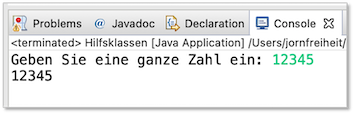

# Nützliche Klassen

---

***Auf diesen Abschnitt werden wir im Laufe des Semesters immer wieder zurückgreifen. Wir werden die einzelnen Klassen nach und nach verwenden. Der Abschnitt muss (noch) nicht in Gänze gelesen und verstanden werden.***

---


In Java gibt es eine Vielzahl bereits existierender Klassen, auf die wir zugreifen können. Wir werden nach und nach einige davon kennenlernen - aber längst nicht alle. Bis jetzt haben wir nur zwei Klassen direkt verwendet:

- die Klasse [`System`](https://docs.oracle.com/en/java/javase/11/docs/api/java.base/java/lang/System.html), die uns eine Schnittstelle zu unserer Konsole (dem Standardausgabegerät zur Verfügung stellt - z.B. `System.out.println()`) und 
- die Klasse [`String`](https://docs.oracle.com/en/java/javase/11/docs/api/java.base/java/lang/String.html), die einen Datentyp für Zeichenketten darstellt und dafür auch nützliche Methoden mitbringt, die wir uns hier mal genauer anschauen wollen.

Beide Klassen gehören zum Paket `java.lang`. Dieses Paket muss nicht importiert werden, umn die Klassen daraus zu nutzen. Bei anderen Klassen, die wir im Folgenden betrachten, ist das teilweise anders.

## Die Klasse `Scanner`

Wir können derzeit Ausgaben auf die Konsole schreiben. Wir können jedoch noch keine Eingaben tätigen. Das wird sich mit der Verwendung der Klasse `Scanner` nun ändern. 

Die Verwendung dieser Klasse durch uns erfolgt durch 

1. die Erzeugung eines `Scanner`-*Objektes* 
2. den Aufruf einer passenden *Objektmethode*, je nachdem, was wir einlesen wollen, ein `int`, ein `double` oder einen `String`.

### Erzeugen eines `Scanner`-Objektes

Wir haben oben zwei begriffe verwendet, deren Bedeutung wir erst später kennenlernen: *Objekt* und *Objektmethode*. Das soll uns aber nicht aufhalten, einfach einmal ein `Scanner`-Objekt zu erzeugen:

```java
Scanner sc = new Scanner(System.in);
```

Hierbei passiert folgendes:

- wir deklarieren uns eine Variable `sc` vom Datentyp `Scanner`,
- wir erzeugen mithilfe von `new Scanner()` ein neues Objekt vom Datentyp `Scanner`,  
- wir übergeben der Methode, die ein `Scanner`-Objekt erzeugt unser Standardeingabegerät (`System.in`) - das ist die Konsole, d.h. wir wollen unsere Daten über die Konsole einlesen
- wir weisen unser neues Objekt (genauer gesagt: eine *Referenz* auf unser neues Objekt) der Variablen `sc` zu

Wenn Sie obige Anweisung z.B. in Ihre `main()`-Methode einfügen, dann stellen Sie fest, dass beide `Scanner` rot unterstrichen sind. Die Fehlerausgabe ist `Scanner cannot be resolved to a type`. Das liegt daran, dass die Klasse `Scanner` nicht zum Standardpaket `java.lang` gehört, sondern wir sie erst importieren müssen. Das lassen wir aber von unserer IDE erledigen. Wir wählen eines der vorgeschlagenen `quick fixes` aus, und zwar `import Scanner (java.util)`. Achten Sie darauf, dass dies nicht der erste Vorschlag für ein `quick fix` ist! Nachdem die entsprechende `import`-Anweisung (`import java.util.Scanner;`) eingefügt wurde, ist die Fehlermeldung behoben. Das Programm könnte also so aussehen:

```java linenums="1"
package themen.hilfsklassen;

import java.util.Scanner;

public class Hilfsklassen
{

	public static void main(String[] args)
	{
		Scanner sc = new Scanner(System.in);
	}
	
}
```

Die `import`-Anweisung (Zeile `3`) erfolgt außerhalb und vor der Klassendeklaration. 

### Aufrufen der passenden Objektmethoden

Für ein solches Objekt vom Typ `Scanner` stehen eine Vielzahl von Methoden zur Verfügung, von denen wir uns nur die folgenden anschauen wollen:

- `next()`: liest einen `String` ein
- `nextInt()`: liest ein `int` ein
- `nextDouble()`: liest ein `double` ein
- `nextBoolean()`: liest ein `boolean` ein

Es sei erwähnt, dass es auch noch `nextLong()`, `nextFloat()`, `nextShort()` usw. gibt. 

Der Aufruf einer solchen Objektmethode erfolgt stets nach dem Prinzip:

```bash
referenzVariable.objektMethode()
```

Das heißt die Variable, die eine Referenz auf das Objekt hält (bei uns `sc`), ruft über *Punktnotation*  (mit einem `.` verbinden) die entsprechende Objektmethode auf. Wir betrachten Beispiele:

```java linenums="1" hl_lines="6"
public static void main(String[] args)
{
	Scanner sc = new Scanner(System.in);
	
	System.out.print("Geben Sie eine ganze Zahl ein: ");
	int ganzeZahl = sc.nextInt();
	System.out.println(ganzeZahl); 
}
```
In Zeile `6` sehen Sie den Aufruf der Methode `nextInt()` für das `sc`-Objekt, also `sc.nextInt()`. Die Methode `nextInt()` gibt die eingegebene Zahl zurück, d.h. der Aufruf der Methode entspricht einer Zahl vom Datentyp `int`. Diese speichern wir in obigem Beispiel in der Variablen `ganzeZahl` vom Typ `int`.

Wenn Sie auf der Konsole dann eine Zahl eingeben, sieht das so aus:


Was passiert, wenn Sie keine Zahl eingeben? Dann wird eine sogenannte * Exception* geworfen. Eine Exception ist ein Fehler, der zur Laufzeit passiert. Wir werden bald lernen, wie man soclhe Exceptions abfängt, damit es nicht einen solchen "Systemabsturz" gibt. Derzeit müssen wir damit noch leben. Eine solche fehlerhafte Eingabe würde so aussehenen:


Für diejenigen, die es interessiert, ist hier eine Methode, die einen solchen Fehlerfall abfängt. Das müssen sie jetzt aber noch nicht verstehen - es ist, wie gesagt, nur für eventuelles Interesse:

```java linenums="1"
package themen.hilfsklassen;

import java.util.InputMismatchException;
import java.util.Scanner;

public class Hilfsklassen
{
	public static int ganzeZahlEinlesen(String message)
	{
		Scanner sc = new Scanner(System.in);
		int number = 0;
		boolean inputOk = false;

		do
		{
			System.out.print(message + ": ");
			try {
				number = sc.nextInt();
				inputOk = true;
			}
			catch(InputMismatchException e)
			{
				message = "Sie müssen eine Zahl eingeben";
				sc.next();
			}
		}while(!inputOk);
		return number;
	}

	public static void main(String[] args)
	{
		int ganzeZahl = ganzeZahlEinlesen("Geben Sie eine Zahl ein");
		System.out.println(ganzeZahl); 
	}
}
```

Ein möglicher Ablauf wäre dann wie folgt: 


Wir gehen erstmal davon aus, dass die Eingaben korrekt erfolgen und schauen uns noch weitere Beispiele an:

```java
public static void weitereBeispiele()
{
	Scanner sc = new Scanner(System.in);
	
	System.out.print("int Zahl : ");
	int intNumber = sc.nextInt();
	System.out.println(intNumber);
	
	System.out.print("double Zahl : ");
	double doubleNumber = sc.nextDouble();
	System.out.println(doubleNumber);
	
	System.out.print("boolean : ");
	boolean wahrheitswert = sc.nextBoolean();
	System.out.println(wahrheitswert);
	
	System.out.print("String : ");
	String zeichenkette = sc.next();
	System.out.println(zeichenkette);
}
```

Ein Aufruf der Methode `weitereBeispiele();` (z.B. in `main()`) könnte dann so aussehen:


Beachten Sie:

1. Bei der Eingabe einer `double`-Zahl müssen Sie anstelle des Punktes ein **Komma** eingeben. Das hängt mit den ländertypischen Einstellungen von Eclipse zusammen. (Bei manchen ist es vielleicht ein Punkt.)
2. Wenn Sie ein `String` eingeben, dann wird bei der Methode `next()` nur der String bis zum ersten Leerzeichen eingelesen. (Das lässt sich ändern, aber darauf gehen wir hier nicht näher ein.) 

!!! success 
	Wir können jetzt Eingaben über unsere Konsole tätigen!

## Die Klasse `Math` 

Die Klasse `Math` enthält viele mathematische Funktionen als Methoden. Außerdem ist in ihr z.B. die Konstante `PI` definiert. Um die Klasse `Math` zu verwenden, müssen wir sie nicht importieren, denn sie befindet sich im Paket `java.lang`. Wir müssen auch kein Objekt der Klasse erzeugen, da alle Methoden dieser Klasse *Klassenmethoden* (also `static` sind). Um eine Methode dieser Klasse aufzurufen, setzen wir vor die Methode einfach `Math.`. Wir schauen uns Beispiele an:

```java
		double nr1 = 16.0;
		double nr2 = Math.sqrt(nr1);		// Quadratwurzel
		double nr3 = Math.PI * 3.0;
		double nr4 = Math.abs(-12.0);		// absoluter Betrag
		double nr5 = Math.floor(12.3456);	// abgeschnitten -> 12
		double nr6 = Math.floor(12.9876);	// abgeschnitten -> 12
		double nr7 = Math.floor(-12.3456);	// abgeschnitten -> -13
		double nr8 = Math.floor(-12.9876);	// abgeschnitten -> -13
		double nr9 = Math.pow(2,5);			// 2 hoch 5 = 32
```

Beachten Sie, dass `floor()` nicht rundet, sondern die nächste ganze Zahl angibt, die **kleiner** als der Parameterwert ist. 

Mithilfe der `Math.random()`-Methode können Sie sich außerdem `double`-Zufallszahlen aus dem Bereich `0.0 <= zufallszahl <1.0` erzeugen lassen. Wir werden das aber meistens mithilfe der folgenden Klasse `Random` erledigen. 

Alle Methoden der Klasse `Math` finden Sie [hier](https://docs.oracle.com/en/java/javase/11/docs/api/java.base/java/lang/Math.html). 

## Die Klasse `Random`

Mithilfe der Klasse `Random` können wir Zufallszahlen erzeugen. Bei der Klasse `Random` ist es ähnlich wie bei `Scanner`:

1. wir erzeugen uns ein `Random`-Objekt,
2. die Klasse befindet sich im Paket `java.util`, d.h. wir müssen sie importieren, 
3. wir wählen die passende Methode aus, je nachdem, von welchem Datentyp unsere Zufallszahl sein soll

### Ein `Random`-Objekt erzeugen

Wir erzwugen uns ein `Random`-Objekt wie folgt
```java
Random r = new Random();
```

Um die Klasse `Random` verwenden zu können, muss sie importiert werden. Hier ein Ausschnitt aus der Klasse, in der wir neben `Random` auch `Scanner` verwenden:
```java linenums="1"
package themen.hilfsklassen;

import java.util.Random;
import java.util.Scanner;

public class Hilfsklassen
{
```

In Zeile `3` wird die Klasse `Random` importiert. 


### Objektemethoden der Klasse `Random`

Die Klasse `Random` bietet verschiedene Methoden, um Zufallswerte der einzelnen Datentypen zu generieren:

- `nextDouble()`: erzeugt eine `double`-Zahl (aus dem Bereich `0.0` inklusive bis `1.0` exclusive)
- `nextFloat()`: erzeugt eine `float`-Zahl (aus dem Bereich `0.0` inklusive bis `1.0` exclusive)
- `nextLong()`: erzeugt eine `long`-Zahl (aus (fast) dem Bereich gesamten Bereich von `long`)
- `nextBoolean()`: erzeugt einen `boolean`-Wert zufällig (`true` oder `false`)

Wir betrachten jedoch hauptsächlich die Methoden, die uns zufällig einen `int`-Wert liefern:

- `nextInt()`: erzeugt eine `int`-Zahl aus dem gesamten Wertebereich von `int` - also auch negative Zahlen,
- `nextInt(int bound)`: erzeugt eine `int`-Zahl aus dem Bereich `0` inklusive bis `bound` exclusive)

#### `nextInt()` 

Schauen wir uns zunächst `nextInt()` an. Wir implementieren eine Methode, die uns 10 Zufallszahlen mithilfe der Methode `nextInt()`erzeugt und auf die Konsole ausgibt:
```java linenums="1"
public static void printIntRandomNumbers()
{
	Random r = new Random();
	for(int i=0; i<10; i++)
	{
		int randomNumber = r.nextInt();
		System.out.println(randomNumber);
	}
}
```

In Zeile `6` sehen wir den Aufruf der Methode `nextInt()`. Die Referenzvariable `r` zeigt auf unser `Random`-Objekt. Für die Referenzvariable wird mithilfe der Punktnotation die Methode `nextInt()` aufgerufen, also `r.nextInt();`. Diese Methode gibt eine Zufallszahl zurück, die wir in der Variablen `randomNumber` speichern.

Ein Aufruf der Methode `printIntRandomNumbers();` z.B. in `main()` kann zu folgender Ausgabe führen (das sind Zufallszahlen, also jeder Aufruf liefert andere Werte):
```bash
1362288576
1801089219
-1573362027
56087730
1015233281
1341464232
2112804572
841838154
1460116224
-910734474
```

#### `nextInt(int bound)`

Die Methode `nextInt()` existiert auch parametrisiert, d.h. wir können ihr einen Parameterwert (vom Datentyp `int`) übergeben. Dieser Wert muss positiv sein! Wenn nicht, dann wird eine `IllegalArgumentException` geworfen. Die Idee dieses Parameters ist zunächst die, dass wir den Wertebereich einschränken, aus dem die Zufallszahlen erzeugt werden. Angenommen, wir übergeben eine `6`, dann werden die Zufallszahlen aus dem Bereich `0`, `1`, `2`, `3`, `4`, `5` erzeugt. Für `nextInt(bound)` gilt also, dass eine Zufallszahl aus dem Bereich `0` (inklusive)  bis `bound`(exklusive) (`0 <= zufZahl < bound`) erzeugt wird. 

Wir betrachten folgendes Beispiel:

```java linenums="1"
public static void printIntRandomNumbers()
{
	Random r = new Random();
	int bound = 10;
	for(int i=0; i<10; i++)
	{
		int randomNumber = r.nextInt(bound);
		System.out.println(randomNumber);
	}
}
```

Wir haben die gleiche Methode wie oben, nur dass wir jetzt nicht `nextInt()`, sondern `nextInt(bound)` aufrufen (Zeile `7`). `bound` ist vom Typ `int` und hat den Wert `10` (Zeile `4`).

Ein Aufruf der Methode `printIntRandomNumbers();` z.B. in `main()` kann zu folgender Ausgabe führen (das sind Zufallszahlen, also jeder Aufruf liefert andere Werte):
```bash
2
8
8
6
8
2
5
9
8
3
```

Angenommen, wir wollen einen Würfel implementieren. Mit dem Aufruf `nextInt(6)` würden wir Zahlen zufällig aus dem Bereich `[0, ..., 5]` erzeugen. Das wäre es noch nicht ganz. Erst, wenn wir zu der erzeugten Zufallszahl jeweils eine `1` hinzuaddieren, "würfeln" wir Zahlen aus dem Bereich `[1, ..., 6]`. Ein Würfel würde also so implementiert werden:

```java
Random r = new Random();
int wurf = r.nextInt(6) + 1;  	// zufaellig Zahlen 1 bis 6
```

Eine generelle Methode, um mithilfe der Methode `nextInt(bound)` einen beliebigen Bereich aus dem `int`-Wertebereich zufällig abzudecken, sehe z.B. wie folgt aus:

```java linenums="1"
public static int getRandomNumber(int fromInclusive, int toInclusive)
{
	Random r = new Random();
	int bound = (toInclusive - fromInclusive) + 1;  // +1 wegen toInclusive soll auch
	int randomNumber = r.nextInt(bound) + fromInclusive;
	return randomNumber;
}
```

Die Methode ist nicht besonders stabil. Wir müssten eigentlich überprüfen, ob `toInclusive` größer ist als `fromInclusive`, aber wir wollen hier zunächst nur das Prinzip erläutern.

Wir "testen" unsere Methode und schauen mal, ob wir Zufallszahlen aus dem Bereich `[90, ... , 99]` erzeugen:

```java
for(int i=0; i<50; i++)
{
	System.out.print(getRandomNumber(90, 99)+" ");
}
```

Eine mögliche Ausgabe:
```bash
96 99 92 98 95 91 95 96 97 93 97 90 94 92 92 94 95 93 99 91 92 95 99 90 91 97 99 93 92 98 91 92 99 90 90 97 95 90 92 97 93 92 94 93 94 90 92 96 96 94 
```

Noch ein "Test", diesmal Zahlen aus dem Bereich `[-33 , ... , -10]`:

```java
for(int i=0; i<50; i++)
{
	System.out.print(getRandomNumber(-33, -10)+" ");
}
```

Eine mögliche Ausgabe:
```bash
-10 -31 -29 -29 -33 -11 -19 -15 -33 -22 -13 -15 -14 -10 -28 -27 -24 -19 -13 -26 -21 -10 -25 -16 -29 -28 -16 -18 -29 -15 -23 -26 -18 -25 -29 -19 -12 -23 -26 -22 -15 -26 -11 -16 -18 -22 -20 -12 -21 -25
```

Von `[-10, ... , 10]` geht auch:

```java
for(int i=0; i<50; i++)
{
	System.out.print(getRandomNumber(-10, -10)+" ");
}
```

und unser Würfel klappt auch:

```java
for(int i=0; i<50; i++)
{
	System.out.print(getRandomNumber(1, 6)+" ");
}
```

## Die Klasse `String` 

Wir haben die Klasse `String` bereits bei den [Datentypen](./variablen/#der-datentyp-string) betrachtet. Dort haben wir gesagt, dass `String` ein anderer Datentyp ist, als die *Wertetypen* `int`, `boolean`, `double` usw. Bei `String` handelt es sich um einen *Referenztypen*. Ein `String` ist eine *Referenz* auf ein Objekt. Wenn wir also so etwas haben:
```java
String str = "Hallo FIW!"; 
```
dann ist `str` eine *Referenzvariable*, so wie z.B. `r` bei `Random` und `sc` bei `Scanner`. Wie bei `Random` und `Scanner` gibt es auch für String Methoden, die wir auf die Objekte anwenden können. Einige davon schauen wir uns im Folgenden an. Zunächst untersuchen wir jedoch, was so ein String eigentlich intern ist. Bei einer Zeichenkette handelt es sich um ein *Array* aus einzelnen Zeichen, also `char`. Wir wissen noch nicht, was ein *Array* ist, aber wir bekommen hier eine Vorstellung davon. Angenommen, wir haben den obigen String (`"Hallo FIW!"`). Intern sieht der so aus:
  

Ein String besteht also aus einzelnen Zeichen (vom Typ `char`) und diese sind sogar automatisch "nummeriert". Wir haben einen sogenannten *Index*. Dieser Index ist eine ganze Zahl (`int`) und beginnt beim ersten Zeichen mit `0` und läuft dann fortlaufend mit jedem Zeichen eins höher. 

Betrachten wir unsere erste Methode für String: die Methode `length()`. Diese Methode gibt die Länge eines Strings zurück - in unserem Beispiel `10`.

```java
String str = "Hallo FIW!";
System.out.println(str.length());		// 10
```

Sie können die Methode über Punktnotation übrigens auch direkt an das Literal anhängen, also so:

```java
System.out.println("Hallo FIW!".length());		// 10
```

das gilt für alle der folgenden Objektmethoden. Beachten Sie, dass Länge (`length()`) eines Strings um 1 größer ist als der größte Indexwert. In der obigen Abbildung sehen wir, dass das Ausrufezeichen (`!`) mit dem Index `9` nummeriert ist. Das liegt daran, dass der erste Index die `0` ist.  

Nun wollen wir den Index verwenden, also die "Nummer" jedes einzelnen Zeichens in einem String. Die Methode `charAt(int index)` liefrt das Zeichen eines Strings an dem Index `index` zurück. Also z.B.:

```java
char c = "Hallo FIW!".charAt(6);		// 'F'
System.out.println(c);					// F
``` 

Wir lassen uns einmal alle Zeichen einzeln eines Strings ausgeben. Dazu verwenden wir eine `for`-Schleife. Die Laufvariable nimmt alle Werte aus dem Index an, d.h. `0` bis kleiner als `length()`:

```java
String str = "Hallo FIW!";

for(int i=0; i<str.length(); i++)
{
	char c = str.charAt(i);
	System.out.println(c);
}
``` 

Das erzeugt folgende Ausgabe:

```bash
H
a
l
l
o
 
F
I
W
!
```

??? "Verschlüsseln"
	Wir wissen ja, dass `char` ein ganzzahliger Datentyp ist. Wir könnten unsere Zeichenkette jetzt verschlüsseln, indem wir einfach zu dem ASCII-Code des jeweiligen Zeichens eine `1` hinzuaddieren. Das machen wir mal:

	```java
	String str = "Hallo FIW!";
	System.out.println(str);			// Hallo FIW!

	for(int i=0; i<str.length(); i++)
	{
		char c = str.charAt(i);
		c++;							// naechstgroesserer ASCII-Code (um 1 addiert)
		System.out.print(c);			// Ibmmp!GJX"
	}
	``` 

	Erzeugt folgende Ausgabe:
	```bash
	Hallo FIW!
	Ibmmp!GJX"
	```

Wir können auch einen bestimmten Index erfragen. Die Methode `indexOf(char c)` gibt den Index zurück, an dem das Zeichen zum **ersten** Mal im String autaucht. Die Methode `lastIndexOf(char c)` gibt den Index zurück, an dem das Zeichen zum **letzten** Mal im String autaucht. 

```java
int first = "Hallo FIW!".indexOf('l');					// 2
int last = "Hallo FIW!".lastIndexOf('l');				// 3
System.out.println("l zum ersten Mal  : " + first);
System.out.println("l zum letzten Mal : " + last);
```

Mithilfe des Index können wir auch Teile eines Strings extrahieren. Die Methode `substring(int beginIndex)` liefert den Teilstring beginnend mit dem Index `beginIndex` bis zum Ende des Strings zurück. Die Methode `substring(int beginIndex, int endIndex)` liefert den Teilstring beginnend mit dem Index `beginIndex` (inklusive) bis zum Index `endIndex` (exklusive) zurück.

```java
String substr1 = "Hallo FIW!".substring(3);			// lo FIW!
String substr2 = "Hallo FIW!".substring(3,7);		// lo F
System.out.println(substr1);
System.out.println(substr2);
```

Mithilfe der Methode `toLowerCase()` werden alle Buchstaben eines Strings in Kleinbuchstaben umgewandelt.  
Mithilfe der Methode `toUpperCase()` werden alle Buchstaben eines Strings in Großbuchstaben umgewandelt. 

```java
String lower = "Hallo FIW!".toLowerCase();			// hallo fiw!
String upper = "Hallo FIW!".toUpperCase();			// HALLO FIW!
System.out.println(lower);
System.out.println(upper);
```

Um zwei Strings lexikographisch miteinander zu vergleichen, kann die Methode `compareTo(String)` verwendet werden. Diese gibt ein `int` zurück. Wir betrachten dazu ein Beispiel:

```java linenums="1"
int result1 = "abc".compareTo("abd");			// -1 
int result2 = "abd".compareTo("abc");			// 1
int result3 = "abc".compareTo("abc");			// 0
```

- In Zeile `1` ruft der String `"abc"` die `compareTo()`-Methode auf und vergleicht sich mit dem String `"abd"`. Da `"abc"` "kleiner" ist als `"abd"`, ist der Rückgabewert **negativ** `-1`. 
- In Zeile `2` ruft der String `"abd"` die `compareTo()`-Methode auf und vergleicht sich mit dem String `"abc"`. Da `"abd"` "größer" ist als `"abc"`, ist der Rückgabewert **positiv** `1`. 
- In Zeile `3` ruft der String `"abc"` die `compareTo()`-Methode auf und vergleicht sich mit dem String `"abc"`. Da beide Strings gleich sind, ist der Rückgabewert `0`. 

Um einen Wert von einem Wertetypen (also die primitiven Datentypen `int`, `boolean`, `double` usw.) in einen String umzuwandeln, stehen die *Klassenmethoden* `valueOf()` zur Verfügung. Der Zugriff auf eine solche Methode erfolgt mittels Punktschreibweise und dem Namen der Klasse, also `String.valueOf()` (es handelt sich um `static` Methoden). Die Umwandlung erfolgt also wie folgt:

```java 
String si9 = String.valueOf(9);			// int --> String
String si123 = String.valueOf(123);		// int --> String
String sb = String.valueOf(true);		// boolean --> String
String sd = String.valueOf(5.5);		// double --> String
```

### `format()`-Methode und `printf()`

In der [Übung 2](../uebungen/#ubungsblatter-wochenweise) sollte das kleine 1x1 einaml als Liste und einmal als Matrix ausgegeben werden. Bei beiden war die Formatierung der Ausgabe nicht besonders schön, da die Zahlen unterschiedliche Längen hatten. Schöner wäre es gewesen, die Ausgabe der Zahlen rechtsbündig zu gestalten. Das geht mit der `System.out.printf()`-Methode. Die `printf()`-Methode verwendet die `format()`-Methode von Strings zur Formatierung der Ausgabe. Wir schauen uns zunächst ein einführendes Beispiel an:

```java linenums="1"
String output = String.format("in %s angemeldet : %d Studentinnen", "FIW", 44);
System.out.println(output);
```

Die `format()`-Methode in Zeile `1` hat drei Parameter:

- einen Ausgabestring, der *Platzhalter* enthält
- einen String `"FIW"` und
- eine `int`-Zahl `44`

Der Ausgabestring enthält sogenannte *Platzhalter*, nämlich `%s` für einen `String` und `%d` für ein `int`. Anstelle dieser Platzhalter werden die nach dem Ausgabestring aufgelisteten Werte eingefügt, also für `%s` wird `"FIW"` eingesetzt und für `%d` die `44`. Die Ausgabe sieht dann so aus:

```bash
in FIW angemeldet : 44 Studentinnen
```

Das ist zunächst wenig spektakulär. Hier zunächst eine Tabelle mit den wichtigsten Platzhaltern:

| Platzhalter | Eingabetyp | Ausgabe (String) |
|-------------|------------|------------------|
| %d          | int/long/...        | ganze Zahl       |
| %f          | float/double      | Gleitkommazahl, Standardnotation |
| %e          | float/double      | Gleitkommazahl, wiss. Notation |
| %s          | String     | Zeichenkette |
| %c          | char       | Buchstabe |
| %n          |            | Zeilenumbruch | 

Ein Beispiel sieht also so aus:


Die eigentliche Formatierung erfolgt durch die Angabe der vorgesehenen Breite für einen Ausgabewert und ob dieser Wert rechtsbündig oder linksbündig dargestellt werden soll. Die allgemeine Syntax für einen solchen Platzhalter ist wie folgt:

```bash
% [Schalter] [Breite] . [Genauigkeit] Typ
```

Dabei sind:

- `%` :  Formatierungsausdruck beginnt
- `Schalter` (optional): verändert das Format der Ausgabe (Minuszeichen (-) = linksbündige Ausgabe)
- `Breite` : Anzahl der ausgegebenen Zeichen 
- `Genauigkeit` (optional): Nachkommastellen 
- `Typ` : Ausgabetyp (`s` (String): Zeichenkette kleingeschrieben, `S`: Zeichenkette großgeschrieben, `d` (decimal): Ganzzahl, `f` (floating-point): Nachkommazahl)

Dazu ein Beispiel:

```java
public static void createTable(int rows)
{
	Random r = new Random();
	int number1 = 0;
	int number2 = 0;

	System.out.println("  a   |   b   |  a + b   |  a - b  |  a * b  |  a / b  |  a % b ");
	System.out.println("----------------------------------------------------------------");

	for(int i=0; i<rows; i++)
	{
		number1 = r.nextInt(100)+1;
		number2 = r.nextInt(100)+1;
		System.out.printf("%4d  | %4d  |  %5d   | %5d   |%7d  |  %5d  | %4d %n",
			number1, number2, number1+number2, number1-number2, number1*number2,
			number1/number2, number1%number2);
	}
}
```

Bei Aufruf von `createTable(8);` erreichen wir zum Beispiel folgende Ausgabe:

```bash
  a   |   b   |  a + b   |  a - b  |  a * b  |  a / b  |  a % b 
----------------------------------------------------------------
   4  |   39  |     43   |   -35   |    156  |      0  |    4 
  60  |    2  |     62   |    58   |    120  |     30  |    0 
  93  |   60  |    153   |    33   |   5580  |      1  |   33 
   8  |   68  |     76   |   -60   |    544  |      0  |    8 
  80  |   82  |    162   |    -2   |   6560  |      0  |   80 
  31  |   10  |     41   |    21   |    310  |      3  |    1 
   7  |   30  |     37   |   -23   |    210  |      0  |    7 
  54  |   12  |     66   |    42   |    648  |      4  |    6 
```

Die Zahlen erscheinen also alle geordnet untereinander und rechtsbündig. Wie gesagt, `System.out.printf()` und `String.format()` funktionieren exakt gleich, da `printf()` `format()` verwendet. Weitere Beispiele für Schalter und ihre Breitenangaben:

```java
String output;
output = String.format("|%10d|", 1234); 			// |      1234|
output = String.format("|%-10d|", 1234); 			// |1234      |
output = String.format("|%010d|", 1234); 			// |0000001234|
output = String.format("|%+10d|", 1234); 			// |     +1234|
output = String.format("|%,10d|", 1234); 			// |     1.234|
output = String.format("|%10.2f|", 1234.567); 		// |   1234,57|
output = String.format("|%-10.2f|", 1234.567); 		// |1234,57   |
output = String.format("|%5.2f|", 1234.567); 		// |1234,57|
output = String.format("|%15s|", "Hallo FIW!"); 	// |     Hallo FIW!|
output = String.format("|%-15s|", "Hallo FIW!"); 	// |Hallo FIW!     |
output = String.format("|%.7s|", "Hallo FIW!"); 	// |Hallo F|
```

Unsere beiden Methoden des kleinen 1x1 aus Übung 2 hätten dann auch eine schönere Ausgabe:

```java
	public static void printTimesTables(int nr1, int nr2)
	{
		for(int faktor1 = 1; faktor1<=nr1; faktor1++)
		{
			for(int faktor2 = 1; faktor2<=nr2; faktor2++)
			{
				int produkt = faktor1 * faktor2;
				System.out.printf("%2d  * %2d = %3d %n", faktor1, faktor2, produkt);
			}
			System.out.println();
		}
	}
	
	public static void printTimesMatrix(int nr1, int nr2)
	{
		for(int faktor1 = 1; faktor1 <= nr1; faktor1++)
		{
			for(int faktor2 = 1; faktor2 <= nr2; faktor2++)
			{
				int produkt = faktor1 * faktor2;
				System.out.printf("%4d", produkt);
			}
			System.out.println();
		}
	}
```

Nämlich so:

```bash
----- Aufgabe 1 ------

 1  *  1 =   1 
 1  *  2 =   2 
 1  *  3 =   3 
 1  *  4 =   4 
 1  *  5 =   5 
 1  *  6 =   6 
 1  *  7 =   7 
 1  *  8 =   8 
 1  *  9 =   9 
 1  * 10 =  10 

 2  *  1 =   2 
 2  *  2 =   4 
 2  *  3 =   6 
 2  *  4 =   8 
 2  *  5 =  10 
 2  *  6 =  12 
 2  *  7 =  14 
 2  *  8 =  16 
 2  *  9 =  18 
 2  * 10 =  20 

 3  *  1 =   3 
 3  *  2 =   6 
 3  *  3 =   9 
 3  *  4 =  12 
 3  *  5 =  15 
 3  *  6 =  18 
 3  *  7 =  21 
 3  *  8 =  24 
 3  *  9 =  27 
 3  * 10 =  30 

 4  *  1 =   4 
 4  *  2 =   8 
 4  *  3 =  12 
 4  *  4 =  16 
 4  *  5 =  20 
 4  *  6 =  24 
 4  *  7 =  28 
 4  *  8 =  32 
 4  *  9 =  36 
 4  * 10 =  40 

 5  *  1 =   5 
 5  *  2 =  10 
 5  *  3 =  15 
 5  *  4 =  20 
 5  *  5 =  25 
 5  *  6 =  30 
 5  *  7 =  35 
 5  *  8 =  40 
 5  *  9 =  45 
 5  * 10 =  50 

 6  *  1 =   6 
 6  *  2 =  12 
 6  *  3 =  18 
 6  *  4 =  24 
 6  *  5 =  30 
 6  *  6 =  36 
 6  *  7 =  42 
 6  *  8 =  48 
 6  *  9 =  54 
 6  * 10 =  60 

 7  *  1 =   7 
 7  *  2 =  14 
 7  *  3 =  21 
 7  *  4 =  28 
 7  *  5 =  35 
 7  *  6 =  42 
 7  *  7 =  49 
 7  *  8 =  56 
 7  *  9 =  63 
 7  * 10 =  70 

 8  *  1 =   8 
 8  *  2 =  16 
 8  *  3 =  24 
 8  *  4 =  32 
 8  *  5 =  40 
 8  *  6 =  48 
 8  *  7 =  56 
 8  *  8 =  64 
 8  *  9 =  72 
 8  * 10 =  80 

 9  *  1 =   9 
 9  *  2 =  18 
 9  *  3 =  27 
 9  *  4 =  36 
 9  *  5 =  45 
 9  *  6 =  54 
 9  *  7 =  63 
 9  *  8 =  72 
 9  *  9 =  81 
 9  * 10 =  90 

10  *  1 =  10 
10  *  2 =  20 
10  *  3 =  30 
10  *  4 =  40 
10  *  5 =  50 
10  *  6 =  60 
10  *  7 =  70 
10  *  8 =  80 
10  *  9 =  90 
10  * 10 = 100 


----- Aufgabe 2 ------

   1   2   3   4   5   6   7   8   9  10
   2   4   6   8  10  12  14  16  18  20
   3   6   9  12  15  18  21  24  27  30
   4   8  12  16  20  24  28  32  36  40
   5  10  15  20  25  30  35  40  45  50
   6  12  18  24  30  36  42  48  54  60
   7  14  21  28  35  42  49  56  63  70
   8  16  24  32  40  48  56  64  72  80
   9  18  27  36  45  54  63  72  81  90
  10  20  30  40  50  60  70  80  90 100

```

#### Formatierung von Gleikommazahlen

Um Gleitkommazahlen in der Standardnotation (nicht wissenschaftliche Notation) formatiert auszugeben, wird der Platzhalter `%f` verwendet. Die allgemeine Syntax ist also

```bash
% [Schalter] [Breite] . [Genauigkeit] f
```

Der `Schalter` kann `-` sein, dann wird die Zahl linksbündig dargestellt. Ist kein `Schalter` angegeben, erfolgt die Ausgabe rechtsbündig. Die `Breite` beschreibt die gesamte Anzahl der Stellen für die Zahl. Die `Breite` enthält insbesondere auch eine Stelle für das Komma und die Anzahl der Stellen für die `Genauigkeit`. Die `Genauigkeit` gibt die Anzahl der Nachkommastellen an.  

Angenommen, der Plathalter lautet `%7.2f`. Dann werden insgesamt sieben Stellen für die gesamte Zahl reserviert, inklusive dem Komma und den `2` Nachkommastellen, also

```bash
_ _ _ _ , _ _ 
```

Wenn die Gesamtlänge beliebig ist, Sie aber nur genau 2 Nachkommastellen haben möchten, dann können Sie auch `%.2f` als Platzhalter angeben. Für eine Nachkommastelle `%.1f`. Die Nachkommastellen werden sogar gerundet. 

Hier nochmal einige Beispiele von oben nur für Gleikommazahlen:

```java linenums="1"
System.out.printf("|%10.2f|", 1234.567); 		// |   1234,57|
System.out.printf("|%-10.2f|", 1234.567); 		// |1234,57   |
System.out.printf("|%7.2f|", 1234.567); 		// |1234,57|
System.out.printf("|%5.2f|", 1234.567); 		// |1234,57|
```

Beachten Sie auch das letzte Beispiel (Zeile `4`). Es wurden nur insgesamt `5` Stellen für die gesamte Zahl reserviert. Davon benötigen wir alleine `2` Stellen für die Nachkommastellen und `1` Stelle für das Komma. Die Vorkommastellen hätten also nur `2`Stellen Platz. Vorne wird die Zahl aber **nie** abgeschnitten. Sollte der reservierte Platz für die Vorkommastellen nicht ausreichen, wird der Vorkommabereich trotzdem vollständig dargestellt. Es kann also trotz der Formatierung zu Verzerrungen in der Ausgabe kommen!
