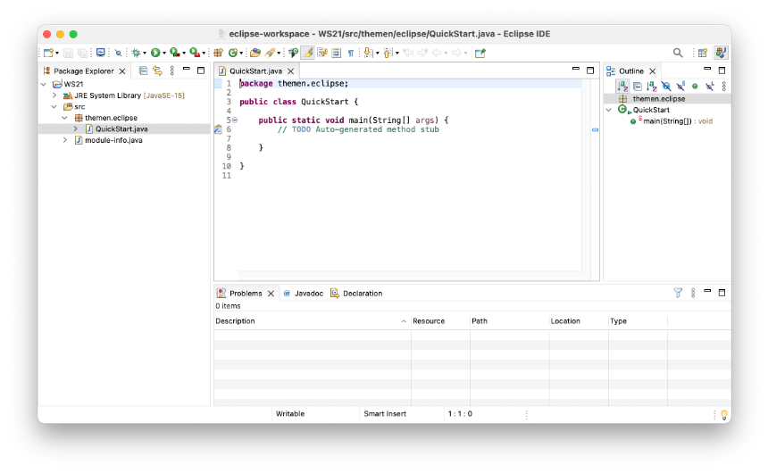

# Integrated Developmemt Environment (IDE)

Es gibt eine Vielzahl von Integrierten Entwicklungsumgebungen (*Integrated Developmemt Environment (IDE)*) für Java und viele davon sind auch wirklich gut und für die professionelle Entwicklung von Java-Anwendungen geeignet. Hervorzuheben sind z.B. [eclipse](https://www.eclipse.org/), [IntelliJ IDEA](https://www.jetbrains.com/de-de/idea/) und [Visual Studio Code (VSCode)](https://code.visualstudio.com/). 

Sie sollten sich für eine der drei entscheiden. Es bleibt Ihnen überlassen, welche IDE Sie wählen. Alle drei IDEs sind hervorragend geeignet. Höchstwahrscheinlich werden Sie spätestens für *WebTech* zu *IntelliJ IDEA* oder *VSCode* wechseln, obwohl man auch dort *Eclipse* sehr gut verwenden kann. Der große Pluspunkt von *Eclipse* ist, dass es sich um eine Open-Source-Community-Anwendung handelt, die alle Bedürfnisse erfüllt. Grundsätzlich ist es sehr gut, verschiedene IDEs auszuprobieren, bis Sie die IDE für sich entdecken, die Sie in Zukunft verwenden wollen. Probieren Sie es einfach aus. 

Ich werde *Eclipse* zum Zeigen der Implementierungen und in den Screenshots im Skript verwenden. 

**Eclipse** 

ist Open Source, wird von einer engagierten Community entwickelt und sehr weit auch im professionellen Umfeld verbreitet. Eclipse gibt es bereits seit 20 Jahren und kann [hier](https://www.eclipse.org/downloads/) heruntergeladen werden. Wenn Sie Eclipse für Ihre Java-Entwicklungen installieren wollen, dann wählen Sie bei der Installation die `Eclipse IDE for Java Developers` aus. Dabei wird auch das *Java Development Kit (JDK)* installiert und nach dem Start von Eclipse können Sie sofort losprogrammieren. Die aktuelle Version ist `2021-12`. Wählen Sie beim ersten Start von Eclipse Ihren `workspace` aus. Der `workspace` ist der Ordner, in dem Sie Ihre Programme speichern. 

**IntelliJ IDEA** 

[IntelliJ IDEA](https://www.jetbrains.com/de-de/idea/) wird nun auch bereits seit über 20 Jahren von der Firma *JetBrains* entwickelt, ist in Java geschrieben und war ursprünglich für die reine Java-Entwicklung geplant, kann aber nun für die Programmierung mit vielen verschiedenen Programmiersprachen verwendet werden. Die Produktauswahl ist mittlerweile sehr vielfältig. Die *Ultimate Version* ist kostenpflichtig, kann jedoch von Studentinnen kostenlos verwendet werden. Dazu ist allerdings die Registrierung mit der `...htw-berlin.de`-Adresse notwendig. Interessant, wenn auch leider teilweise kostenpflichtig, sind in diesem Zusammenhang auch die Angebote [JetBrains Academy](https://www.jetbrains.com/de-de/academy/) und [IntelliJ IDEA Edu](https://www.jetbrains.com/de-de/idea-edu/).

**VSCode**

setzt sich zunehmend immer mehr bei WebTech-Programmiererinnen durch, ist aber auch sehr geeignet für die Implementierung mit Java. Ein guter Startpunkt für die Java-Entwicklung mit *VSCode* findet sich [hier](https://code.visualstudio.com/docs/java/java-tutorial). Folgen Sie dort den Links `Install the Coding Pack for Java - ...` und `Install the Extension for Java`. Das wirklich Tolle an *VSCode* ist, dass es sich um eine Webanwendung handelt (eine sogenannte *progressive web app*). Sie läuft also eigentlich im Browser, was man aber gar nicht merkt. Die Unterstützung für die Java-Implementierung ist, wie auch bei *Eclipse* und *IntelliJ*, ausgezeichnet. 

## Starten mit Eclipse

Bei ersten Start von Eclipse werden Sie gefragt, wo Sie den `workspace` festlegen wollen. Der `workspace` ist der Ordner, in dem Sie Ihre Programme speichern. Wählen Sie einen Ordner, in dem Sie alle Schreibrechte haben, z.B. `Documents/HTW/Prog1/workspace`.

Sobald Eclipse geöffnet ist, können Sie ein Java Projekt erstellen. Wählen Sie dazu `File --> New --> Java Project`. Im ersten Semester kommen Sie mit einem projekt aus, d.h. Sie können Ihr Java-Projekt z.B. `WS21` nennen. 

Markieren auf der linken Seite (im `Package Explorer`) das Projekt `WS21` und wählen dann `File --> New --> Package`. Mit *Paketen* strukturieren wir Java-Projekte. *Pakete* können wir uns wie Ordner vorstellen (sind sie auch). Paketnamen werden *kleingschrieben* und mit einem Punkt getrennt. Wir geben für unser neues Package z.B. den Namen `themen.eclipse` an. Es entsteht ein ordner `themen` und darin ein Unterordner `eclipse`. Wenn Sie zukünftig weitere *Themen*  bearbeiten, können Sie das dann im Package `themen.unterthema` machen (wobei `unterthema` für einen Themennamen steht). 

Wir markieren das Package `themen.eclipse` und wählen `File --> New --> Class`. Es öffnet sich ein Eingabefenster:


In dieses Fenster tragen wir den Namen unserer Klasse ein, z.B. `QuickStart`. Außerdem klicken wir das Häkchen dem dem Label `public static void main(String[] args)` an und klicken dann auf den Button `Finish`.

Es erscheint unsere Klasse im Editor-Fenster:



Die Klasse `Quickstart` wird in der folgenden Form erzeugt:

```java linenums="1"
package themen.eclipse;

public class QuickStart {

	public static void main(String[] args) {
		// TODO Auto-generated method stub

	}

}
```

In Zeile `1` steht die `package`-Deklaration. Darin wird angegeben, dass sich unsere Klasse im Paket `themen.eclipse` befindet. Die zeilen `3-10` enthalten die Klasse `QuickStart`. Diese Klasse enthält eine einzige Methode, die `main()-Methode`.

### Die `main()`-Methode

In `BlueJ` hatten wir immer eine Methode ausgewählt, die wir ausgeführt haben. Von nun an ist es so, dass **immer** die `main()`-Methode ausgeführt wird (automatisch durch Programmstart). Wenn wir also unser Programm übersetzen und starten, wird genau die `main()`-Methode ausgeführt - ohne dass wir ein Objekt der Klasse `QuickStart` erzeugen müssen. Es wird nun immer eine *Programmklasse* geben, die die `main()`-Methode enthält. Ohne die `main()`-Methode kann auch nichts ausgeführt werden. 

Dass wir von der Klasse kein Objekt erzeugen müssen, um die `main()`-Methode zu starten, erkennen wir am Schlüsselwort `static` im Methodenkopf. Eine Methode, die als `static` deklariert wird, kann ausgeführt werden, ohne ein Objekt der Klasse zu erzeugen. 

### Übersetzen und Ausführen des Programms

Geben Sie in die `main()`-Methode `syso` ein, drücken Sie `Strg + Leer`-Taste (`Control + Leer`) und dann `Enter`. Es erscheint `System.out.println()`. Erweitern Sie die Methode um die Ausgabe der Zeichenkette `"Hello FIW!`:


```java linenums="1" hl_lines="6"
package themen.eclipse;

public class QuickStart {

	public static void main(String[] args) {
		System.out.println("Hello FIW!");

	}

}
```

Wählen Sie dann `Run --> Run` oder klicken Sie auf den grünen runden Button mit dem weißen Pfeil in der Werkzeugleiste . Das Programm wird *compiliert* und ausgeführt. Es öffnet sich unten das *Konsolen*-Fenster und dort erscheint `Hello FIW!`:


Fertig. Sie haben Eclipse eingerichtet.

### Ordnerstruktur

gehen Sie im `Finder` oder im `Datei Explorer` in den `wiorkspace`-Ordner. Darin sehen Sie den Ordner `WS21` (das Java-Projekt). In dem `WS21` gibt es einen `bin`- und einen `src`-Ordner. 

Im `src`-Ordner finden Sie den Ordner `themen` (ein `package`) und darin den Ordner `eclipse` (ebenfalls ein `package`). Darin liegt die `QuickStart.java`. 

Der `bin`-Ordner ist genauso aufgebaut, wie der `src`-Ordner, nur dass darin die `*.class`-Dateien gespeichert sind und nicht die `*.java`-Dateien. 

Die Ordnerstruktur zeigt nochmal, dass Pakete der Strukturierung unserer Dateien dienen. 


