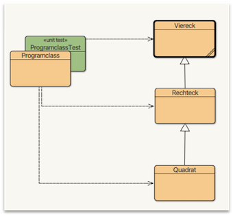

# Programmieren I

Herzlich willkommen zur **Programmieren I** Veranstaltung! Wir werden unter Verwendung der Programmiersprache Java die wesentlichen Konzepte lernen, die für das Verständnis modernen Programmierens notwendig sind. Es sind keinerlei Vorkenntnisse erforderlich. Hier einige Tipps, damit Sie die Veranstaltung erfolgreich durchführen und Sie dabei auch Spaß haben:

1. Lösen Sie alle **Übungsaufgaben** selbständig! Es ist kein Problem, wenn Sie für das Bewältigen der Übungen etwas länger benötigen. Sollten Sie es gar nicht alleine schaffen, ist das auch kein Problem. Wichtig ist dann, dass Sie sich die Lösung anschauen und es erneut selbständig versuchen. Hören Sie nicht auf, bis Sie es geschafft haben!
2. Sie können die **Hausaufgaben** zu zweit lösen. Achten Sie aber darauf, dass Sie Ihre gemeinsame Lösung vollständig verstanden haben und dass Sie sie danach auch alleine erstellen können. Sie können beim Lösen der Hausaufgaben beliebig kreativ sein! Die Aufgabenstellung gibt Ihnen Anhaltspunkte für eine eventuelle Lösung. Sie können es aber auch ganz anders machen!
3. Die Klausurvorbereitung beginnt mit Beginn der Veranstaltung! Es ist nicht möglich, die Klausur am Ende des Semesters zu bestehen, wenn Sie nicht das ganze Semester über intensiv programmieren. Die Übungsaufgaben sind "kleine" Aufgaben, um das in der Vorlesung vermittelte Wissen direkt anzuwenden. Für die Lösung der Hausaufgaben ist bereits ein gewisses Abstraktionsniveau erforderlich, um zu erkennen, dass das in der Vorlesung vermittelte Wissen dafür ausreichend ist. 
4. Programmieren lernt man nur durch Programmieren! Sie müssen es **tun**. Das Lesen von Büchern oder das "Anschauen" von Code genügt nicht. Eine Sprache lernt man auch nur durch Sprechen. Sie müssen programmieren, programmieren, prohgrammieren...
5. Lassen Sie sich durch Fehler nicht verunsichern, sondern analysieren Sie Ihre Fehler! Bis zur Klausur sollten Sie alle Fehler einmal gemacht haben. Wenn Sie sich überlegen, warum das jeweils ein Fehler war, dann werden Sie diesen Fehler nicht wiederholen und haben durch die Reflektion eine Menge gelernt. Fehler zu machen (und darüber zu reflektieren) gehört zu den besten Lernmethoden des Programmierens.
6. Haben Sie Spaß! Je mehr Sie das Programmieren lernen, je mehr Spaß werden Sie haben. Sollte es Ihnen zwischendurch keinen Spaß mehr machen, geben Sie mir sofort Bescheid!

Viel Erfolg! Und viel Spaß!

## Organisatorisches


Der Plan zur Durchführung der Veranstaltung ist derzeit wie folgt:

- Themen werden ausführlich in der Vorlesung vorgestellt und in diesem Skript beschrieben.
- Es ist geplant, die neuen Themen stets vorab in diesem Skript hier zu veröffentlichen. Sie können sich also bereits vorab mit dem jeweiligen neuen Thema beschäftigen. 
- Zusammen mit dem Skript (das neue Thema) werden sowohl die dazugehörige Übung als auch die dazugehörige Aufgabe hochgeladen.
- Die beiden Übungen am Mittwoch sind jeweils gleich (d.h. dort werden die gleichen Übungsaufgaben gelöst). Die Übungen behandeln den Stoff, der am Mittwoch in der Vorwoche und am Dienstag in der gleichen Woche besprochen wird. Das bedeutet: das neue Thema wird am Mittwoch und am darauffolgenden Dienstag in der Vorlesung vermittelt und an dem Mittwoch darauf in der Übung angewendet. 
- Sie können frei wählen, welche der beiden Übungen Sie besuchen. Sie können auch beliebig wöchentlich wechseln. 
- Es wird ein Tutorium angeboten (Termin wird noch bekanntgegeben). 
- Sollten Sie Wünsche haben, diesen Plan zu ändern, kommen Sie gerne auf mich zu.

Zur erfolgreichen Durchführung der Veranstaltung müssen Sie die **Aufgaben** (Hausaufgaben) lösen und zu den jeweiligen Fristen auf Moodle hochladen. Wenn Sie alle Aufgaben fristgerecht hochgeladen haben, dürfen Sie an der Klausur teilnehmen. Es werden insgesamt wahrscheinlich 12 Aufgaben sein, die Sie selbständig lösen und hochladen müssen. Sie können die Aufgaben auch zu zweit lösen. Laden Sie dann aber bitte beide jeweils die Lösung hoch. Am Ende des Semesters schreiben wir eine **Klausur** (am Rechner). Diese Klausur wird bewertet und entspricht der Note für "Programmieren 1". 

Unter [**Aufgaben**](./aufgaben/#aufgaben) sind die Aufgaben beschrieben, die Sie in jeder Woche ausführen sollen. Damit Sie dies erfolgreich erledigen können, ist jeweils angegeben, welche Themen Sie dafür durcharbeiten müssen. Das Durcharbeiten der jeweiligen Themen entspricht meistens jeweils einem Wochenthema. Diese wird also selbständig durchgeführt. 

Daneben gibt es jede Woche (zu jedem Thema) **Übungen**, die wir in den Übungszeiten besprechen. Diese dienen der Anwendung und der Festigung der erlangten Kenntnisse. Die [**Übungen**](./uebungen/#ubungsblatter-wochenweise) sind kleine Aufgaben, an denen Sie das neue Wissen anwenden sollen. Die Übungen dienen der Befähigung, die (größeren) Aufgaben lösen zu können.  

Für die Kommunikation untereinander verwenden wir [**Slack**](https://slack.com/intl/de-de/). Dort können Sie alle inhaltlichen und organisatorischen Fragen stellen. Ich fände es gut, wenn eine Art internes Diskussionsforum entsteht. Es ist sehr gewünscht, dort Fragen zu stellen und noch mehr gewünscht, dass Sie sich diese gegenseitig beantworten. Damit wäre allen geholfen und wir können besser erkennen, wo noch Nachhol- bzw. Erläuterungsbedarf bei den meisten besteht. Bei Bedarf beantworten die Lehrenden die Fragen natürlich.  

Es wird ein Programmier-Tutorium angeboten. Dieses findet montags um 16:00 Uhr in C 639 statt - Start ist am 25.10.2021. Unsere Tutorin ist [Lisanne Delfs](mailto:Lisanne.Delfs@Student.HTW-Berlin.de).  


## Planung


Nachfolgend der vorläufige Wochenplan (wird eventuell angepasst).

| | Woche | Themen (Vorlesung) | Aufgabe | Abgabe Aufgabe bis | 
|-|-------|--------------------|-------|-----------------|
| 1. | 11.-15.10.2021 | [Einführung](./start/#was-ist-programmieren) und [Organisatorisches](./#organisatorisches), [Klassen und Objekte - BlueJ](./bluej/#bluej) | -  | - | 
| 2. | 18.-22.10.2021 | [Variablen und Datentypen](./variablen/#variablen-und-datentypen) und [Operatoren und Ausdrücke](./ausdruecke/#operatoren-und-ausdrucke) | [Aufgabe 1](./aufgaben/#aufgabe-1-abgabe-bis-25102021-2400-uhr)  | 25.10.2021 | 
| 3. | 25.-29.10.2021 | [Methoden](./methoden/#methoden) | [Aufgabe 2](./aufgaben/#aufgabe-2-abgabe-bis-01112021-2400-uhr)  | 01.11.2021 | 
| 4. | 01.-05.11.2021 | [Selektion](./selektion/#selektion) ([if](./selektion/#ifelse)) und [Iteration](./iteration/#iteration) ([for](./iteration/#die-for-schleife))| [Aufgabe 3](./aufgaben/#aufgabe-3-abgabe-bis-08112021-2400-uhr) | 08.11.2021 | 
| 5. | 08.-12.11.2021 | [Iteration (while)](./iteration/#die-while-schleife) | [Aufgabe 4](./aufgaben/#aufgabe-4-abgabe-bis-15112021-2400-uhr) | 15.11.2021 | 
| 6. | 15.-19.11.2021 | [Klassen und Objekte](./objekte/#klassen-und-objekte) | [Aufgabe 5](./aufgaben/#aufgabe-5-abgabe-bis-22112021-2400-uhr)  | 22.11.2021 | 
| 7. | 22.-26.11.2021 | [Konstruktoren, this, eigene Datentypen, Rückgabe von Objekten](./objekte/#eine-weiterer-datentyp-point) | [Aufgabe 6](./aufgaben/#aufgabe-6-abgabe-bis-29112021-2400-uhr)  | 29.11.2021 | 
| 8. | 29.-03.12.2021 | [Eigene Datentypen in Datentypen verwenden](./objekte/#eigene-datentypen-in-eigenen-datentypen-verwenden)  | [Aufgabe 7](./aufgaben/#aufgabe-7-abgabe-bis-6122021-2400-uhr)  | 06.12.2021 |
| 9. | 06.-10.12.2021 | [Vererbung](./vererbung/#vererbung), [Object und Polymorphie](./object/#die-klasse-object) | [Aufgabe 8](./aufgaben/#aufgabe-8-abgabe-bis-13122021-2400-uhr)  | 13.12.2021 |
| 10. | 13.-17.12.2021 | [Arrays](./arrays/#arrays) | [Aufgabe 9](./aufgaben/#aufgabe-9-abgabe-bis-03012022-2400-uhr) | 03.01.2022 |
| 11. | 20.-24.12.2021 | [Algorithmen über Arrays](./arrays/#algorithmen-uber-arrays)  | [Aufgabe 10](./aufgaben/#aufgabe-10-abgabe-bis-10012022-2400-uhr)  | 10.01.2022 |
| | | | | | | |
| 12. | 03.-07.01.2022 | [Sortieren von Arrays](./sortieren/#sortieren-von-arrays)  | [Aufgabe 11](./aufgaben/#aufgabe-11-abgabe-bis-17012022-2400-uhr)  | 17.01.2022 |
| 13. | 10.-14.01.2022 | [Suchen in Arrays](./arrays/#suchen-in-arrays) | [Aufgabe 12](./aufgaben/#aufgabe-12-abgabe-bis-24012022-2400-uhr) | 24.01.2022 |
| 14. | 17.-21.01.2022 | Wiederholung, Klausurvorbereitung  | -  | - |
| 15. | 24.-28.01.2022 | Wiederholung, Klausurvorbereitung | - | - |
| 16. | 02.02.2022 14:00 Uhr| Klausur  | -  | - |


## Code (und Videos) aus der Vorlesung


??? note "Vorlesung Variablen -- 19. und 20.10.2021"
	=== "Variablen.java"
		```java
		public class Variablen
		{
		    // instance variables - replace the example below with your own 
		    private int x;

		    public Variablen()
		    {
		        // initialise instance variables
		        x = 5;
		    }

		    public void printObjectState()
		    {
		        System.out.println("endlich programmieren!");
		        System.out.println();
		        System.out.println(x);
		        System.out.println();
		        System.out.println("endlich programmieren!");
		        System.out.println();
		        System.out.println(x);
		        
		        System.out.println();
		                
		        int intVariable = 123;
		        System.out.println(intVariable);
		        intVariable = 5;
		        System.out.println(intVariable);  
		        intVariable = -1234566;
		        System.out.println(intVariable);  
		        
		        long longVariable = 123456;
		        System.out.println(longVariable);
		        
		        double doubleVariable;
		        doubleVariable = 1555.0507897865437654321872;
		        System.out.println(doubleVariable);  
		        
		        double doubleVariable1;
		        doubleVariable1 = 15.0507897865437654321872;
		        System.out.println(doubleVariable1);  
		        
		        float floatVariable;
		        floatVariable = 0.3f;
		        
		        char charVariable = 'a';
		        System.out.println(charVariable);
		        
		        charVariable = 65;
		        System.out.println(charVariable);
		        
		        charVariable = '\u00A9';
		        System.out.println(charVariable);
		        
		        charVariable = '©';
		        System.out.println(charVariable);
		        
		        charVariable = 12337;
		        System.out.println(charVariable);
		        
		        int a = 4;
		        int b = 7;
		        
		        int summe = a + b;  // 11
		        int produkt = a * b;
		        
		        System.out.println("Postfix und Prefix");
		        int a1 = 5;
		        System.out.println(a1);
		        a1++;
		        System.out.println(a1);
		        ++a1;
		        System.out.println(a1);
		        
		        int b1 = a1;
		        System.out.println(b1);
		        b1 = a1++;
		        System.out.println(b1);
		        b1 = ++a1;
		        System.out.println(b1);
		        
		        a1 = 7;
		        b1 = 8;
		        int c1 = 9;
		        boolean result = (true ^ true);
		        System.out.println(result);
		        
		        String s1 = "Informatik ";
		        String s2 = "und ";
		        String s3 = "Wirtschaft!";
		        String s4 = s1 + s2 + s3;
		        System.out.println(s1 + s2 + s3);
		        
		        int nr1 = 7;
		        int nr2 = 4;
		        System.out.println(nr1 + " + " + nr2 + " = " + (nr1 + nr2));
		    }
		}
		```


??? note "Vorlesung Methoden -- 26. und 27.10.2021"
	=== "Methods.java"
		```java
		public class Methods
		{
		    public Methods()
		    {

		    }

		    public void printSum(int nr1, int nr2)
		    {
		        System.out.println(nr1 + " + " + nr2 + " = " + computeSum(nr1,nr2));
		    }
		    
		    public int computeSum(int nr1, int nr2)
		    {
		        int sum = nr1 + nr2;
		        return sum;
		    }
		    
		    public boolean isEven(int number)
		    {
		        boolean isEven = ((number % 2) == 0);
		        return isEven;
		    }
		    
		    public void start()
		    {
		     System.out.println("Heute Methoden!");
		     printSum(3,4);
		     printSum(-7, 6);
		     
		     int sum = computeSum(computeSum(1,2),4) + computeSum(-7, 6);
		     System.out.println(sum);
		    }
		}
		```

??? note "Vorlesung Selektion if und Iteration for -- 2. und 3.11.2021"
	=== "SelektionIteration.java"
		```java
		public class SelektionIteration
		{
		    public SelektionIteration()
		    {

		    }

		    public boolean isEven(int number)
		    {
		        return (number%2 == 0);
		    }
		    
		    public void printSumFrom1ToN(int n)
		    {
		        int sum = 0;
		        String term = "0";
		        for(int summand = 1; summand <= n; summand++)
		        {
		            term = term + " + " + summand;
		            sum = sum + summand;
		            System.out.println(term + " = " + sum);
		        }
		    }
		    
		    public int computeSumFrom1ToN(int n)
		    {
		        int sum = 0;
		        for(int summand = 1; summand <= n; summand++)
		        {
		            sum += summand;
		        }
		        return sum;
		    }
		    
		    
		    public void printSomething(int height, int width)
		    {
		        for(int row = height; row  > 0; row--)
		        {
		            // String output = "row = " + row + " : ";
		            for(int col = 0; col < row ; col++)
		            {
		                // output += " col=" + col;
		                System.out.print("*");
		            }
		            System.out.println();
		        }
		    }
		    
		    public boolean isOdd(int number)
		    {
		        return !isEven(number);
		    }
		    
		    public void start()
		    {
		        boolean result = isEven(4);
		        int number = 7;
		        int a = 3;
		        int b = 2;
		        if(isOdd(number))
		        {
		            System.out.println(number + " ist ungerade");
		        }
		        else
		        {
		            System.out.println(number + " ist gerade");
		        }
		        System.out.println(result);
		        
		        int i = 0;
		        for(i = 0; i > 10; i = i + 1)
		        {
		            System.out.println("Wert von i " + (i+1) ); 
		        }
		        System.out.println("Ende der Schleife. Wert von i " + i ); 
		        
		        printSumFrom1ToN(7);
		        
		        printSomething(5, 4);
		    }
		}
		```

??? note "Vorlesung Iteration while -- 9.11.2021"
	=== "IterationWhile.java"
		```java
		public class IterationWhile
		{
		    public IterationWhile()
		    {

		    }

		    public void printCollatz(int start)
		    {
		        int number = start;
		        while(number > 1)
		        {
		            System.out.print(number + " ");
		            if(number%2==0)
		            {
		                number = number / 2;
		            }
		            else
		            {
		                number = 3 * number + 1;
		            }
		        }
		    }
		    
		    public void printGGT(int a, int b)
		    {
		        int number1 = a;
		        int number2 = b;
		        while(number1!=number2)
		        {
		            if(number1>number2)
		            {
		                number1 = number1 - number2;
		            }
		            else
		            {
		                number2 = number2 - number1;
		            }
		        }
		        
		        System.out.println("ggT von " + a +" und " + b + " ist " + number1);
		    }
		    
		    public void start()
		    {
		        printGGT(40, 24);
		        printCollatz(7);
		    }
		}
		```


??? note "Vorlesung Schleifen -- 10.11.2021"
	```java
	public class Loops
	{
	    public Loops()
	    {

	    }

	    public void collatz(int start)
	    {
	        int count = 0;
	        int number = start;
	        while(number > 1)
	        {
	            System.out.print(number + " ");
	            count++;
	            number = successor(number);   
	        }
	        count++;
	        System.out.println(number + " --> " + count + " Zahlen");
	    }
	    
	    public int successor(int nr1)
	    {
	        int successor = 0;
	        if(isEven(nr1))
	        {
	            successor = nr1 / 2;
	        }
	        else
	        {
	            successor = 3 * nr1 +1;
	        } 
	        return successor;
	    }
	    
	    public boolean isEven(int nr)
	    {
	        return (nr%2==0);
	    }
	    
	    public void start()
	    {
	        collatz(7);

	    }
	}
	```


??? note "Vorlesung Klassen und Objekte -- 16.11.2021"
	=== "Adresse.java"
		```java	linenums="1" 
		public class Adresse
		{
		    public String street;
		    public int number;
		    public int zipcode;
		    public String city;
		    public String country;
		    
		    public String getAddress()
		    {
		        return street + " " + number + " " + zipcode + " " + city;
		    }

		    public void printAddress()
		    {
		        System.out.println(getAddress());
		    }
		}
		```
	=== "AdresseTest.java"
		```java	linenums="1" hl_lines="31-50"
		import static org.junit.jupiter.api.Assertions.*;
		import org.junit.jupiter.api.AfterEach;
		import org.junit.jupiter.api.BeforeEach;
		import org.junit.jupiter.api.Test;

		/**
		 * The test class AdresseTest.
		 *
		 * @author  (your name)
		 * @version (a version number or a date)
		 */
		public class AdresseTest
		{
		    /**
		     * Default constructor for test class AdresseTest
		     */
		    public AdresseTest()
		    {
		    }

		    /**
		     * Sets up the test fixture.
		     *
		     * Called before every test case method.
		     */
		    @BeforeEach
		    public void setUp()
		    {
		    }

		    @Test
		    public void testAdresse()
		    {
		        Adresse adresse1 = new Adresse();
		        adresse1.street = "Wilhelminnenhofstr.";
		        adresse1.number = 75;
		        adresse1.zipcode = 12459;
		        adresse1.city = "Berlin";
		        adresse1.printAddress();
		        System.out.println(adresse1.getAddress());
		        
		        Adresse adresse2 = new Adresse();
		        adresse2.street = "Treskowallee";
		        adresse2.number = 8;
		        adresse2.zipcode = 10318;
		        adresse2.city = "Berlin";
		        adresse2.printAddress();
		        System.out.println(adresse2.getAddress());
		        
		    }
		    
		    /**
		     * Tears down the test fixture.
		     *
		     * Called after every test case method.
		     */
		    @AfterEach
		    public void tearDown()
		    {
		    }
		}
		```

??? info "Video zur Vorlesung Klassen und Objekte -- 16.11.2021"
	<iframe src="https://mediathek.htw-berlin.de/media/embed?key=3d2363e3873400f4808875f878bcd5ec&width=720&height=432&autoplay=false&autolightsoff=false&loop=false&chapters=false&related=false&responsive=false&t=0" data-src="" class="iframeLoaded" width="720" height="432" frameborder="0" allowfullscreen="allowfullscreen" allowtransparency="true" scrolling="no" aria-label="media embed code" style=""></iframe>


??? note "Vorlesung Klassen und Objekte -- 17.11.2021"
	=== "Adress.java"
		```java	linenums="1" 
		public class Address
		{
		    private String street;
		    private int number;
		    private int zipcode;
		    private String city;
		    
		    public Address(String pStreet, int pNumber, 
		    int pZipcode, String pCity )
		    {
		        street = pStreet;
		        number = pNumber;
		        zipcode = pZipcode;
		        city = pCity;
		    }
		    
		    public void renameStreet(String newStreetName)
		    {
		        street = newStreetName;
		    }
		    
		    public String getAddress()
		    {
		        return street +" "+number+"\n"+zipcode+" "+city;
		    }
		    
		    public void printAddress()
		    {
		        System.out.println(getAddress());
		    }
		}
		```
	=== "AdressTest.java"
		```java	linenums="1" hl_lines="31-41"

		import static org.junit.jupiter.api.Assertions.*;
		import org.junit.jupiter.api.AfterEach;
		import org.junit.jupiter.api.BeforeEach;
		import org.junit.jupiter.api.Test;

		/**
		 * The test class AddressTest.
		 *
		 * @author  (your name)
		 * @version (a version number or a date)
		 */
		public class AddressTest
		{
		    /**
		     * Default constructor for test class AddressTest
		     */
		    public AddressTest()
		    {
		    }

		    /**
		     * Sets up the test fixture.
		     *
		     * Called before every test case method.
		     */
		    @BeforeEach
		    public void setUp()
		    {
		    }
		    
		    @Test
		    public void testAddress()
		    {
		        Address htwWilh = new Address("Alte Strasse", 75, 1249 , "Berlin");
		        htwWilh.printAddress();
		        
		        Address htwTres = new Address("Treskowallee", 8, 10318, "Berlin");
		        htwTres.printAddress();
		        htwTres.renameStreet("Neue Strasse");
		        htwTres.printAddress();
		    }
		    
		    /**
		     * Tears down the test fixture.
		     *
		     * Called after every test case method.
		     */
		    @AfterEach
		    public void tearDown()
		    {
		    }
		}
		```

??? info "Video zur Vorlesung Klassen und Objekte -- 17.11.2021"
	<iframe src="https://mediathek.htw-berlin.de/media/embed?key=2439aaf7e8446bd2f96733041f3f7e23&width=720&height=432&autoplay=false&autolightsoff=false&loop=false&chapters=false&related=false&responsive=false&t=0" data-src="" class="iframeLoaded" width="720" height="432" frameborder="0" allowfullscreen="allowfullscreen" allowtransparency="true" scrolling="no" aria-label="media embed code" style=""></iframe>


??? note "Vorlesung Point und this -- 23.11.2021"
	=== "Point.java"
		```java	linenums="1" 

		public class Point
		{
		    // Objektvariablen
		    private int x;
		    private int y;
		    
		    // Konstruktor
		    public Point(int x, int y)
		    {
		        this.x = x;
		        this.y = y;
		    }
		    
		    public void print()
		    {
		        System.out.println("[ x=" + this.x + ", y=" + this.y + "]");
		    }
		    
		    public int getX()
		    {
		        return this.x;
		    }
		    
		    public int getY()
		    {
		        return this.y;
		    }
		    
		    public void translate(int deltaX, int deltaY)
		    {
		        this.x = this.x + deltaX;
		        this.y = this.y + deltaY;
		    }
		    
		    public boolean isLeft(Point p)
		    {
		        return (this.x < p.x);
		    }
		    
		    public boolean isAbove(Point p)
		    {
		        return (this.y > p.y);
		    }
		}
		```
	=== "Programmklasse.java"
		```java	linenums="1" 

		public class Programmklasse
		{
		    public void testPoint()
		    {
		        Point p1 = new Point(3,4);
		        Point p2 = new Point(1,2);
		        Point p3 = new Point(-3,6);
		        
		        p1.print();
		        p2.print();
		        p3.print();
		        
		        System.out.println("p1 : (" + p1.getX() + ", " + p1.getY() + ")");
		        System.out.println("p2 : (" + p2.getX() + ", " + p2.getY() + ")");
		        System.out.println("p3 : (" + p3.getX() + ", " + p3.getY() + ")");
		        
		        p1.translate(1,2);
		        System.out.println("p1 : (" + p1.getX() + ", " + p1.getY() + ")");
		        p1.print();
		        p1.translate(-2,-4);
		        p1.print();
		        
		        System.out.println("p1 links von p2 ? " + p1.isLeft(p2) );
		        System.out.println("p2 links von p1 ? " + p2.isLeft(p1) );
		        
		    }
		}

		```

??? info "Video zur Vorlesung Point und this -- 23.11.2021"
	<iframe src="https://mediathek.htw-berlin.de/media/embed?key=fd299b15d59eb74c91ea73c246676282&width=720&height=450&autoplay=false&autolightsoff=false&loop=false&chapters=false&related=false&responsive=false&t=0" data-src="" class="iframeLoaded" width="720" height="450" frameborder="0" allowfullscreen="allowfullscreen" allowtransparency="true" scrolling="no" aria-label="media embed code" style=""></iframe>


??? note "Vorlesung Circle -- 24.11.2021"
	=== "Circle.java"
		```java	linenums="1" 

		public class Circle
		{
		    private double radius;
		    
		    public Circle(double radius1)
		    {
		        this.radius = radius1;
		    }
		    
		    public double getRadius()
		    {
		        return this.radius;
		    }
		    
		    public double getDiameter()
		    {
		        return 2.0 * this.radius;
		    }
		    
		    public boolean isSmaller(Circle otherCircle)
		    {
		        return this.radius < otherCircle.radius;
		    }
		    
		    public void print()
		    {
		        System.out.println("Radius      : " + this.radius);
		        System.out.println("Durchmesser : " + this.getDiameter() );
		        
		    }
		}

		```
	=== "Programmklasse.java"
		```java	linenums="1" 

		public class Programmklasse
		{

			public void testCircle()
		    {
		        Circle c1 = new Circle(5.0);
		        Circle c2 = new Circle(4.0);
		        Circle c3 = c1;
		        
		        System.out.println(c1.getRadius());
		        System.out.println(c2.getRadius());
		        
		        c1.print();
		        c2.print();
		        c3.print();
		        
		        System.out.println("c1 kleiner c2 ? " + c1.isSmaller(c2));
		        System.out.println("c2 kleiner c1 ? " + c2.isSmaller(c1));
		    }
		}

		```

??? info "Video zur Vorlesung Circle -- 24.11.2021"
	<iframe src="https://mediathek.htw-berlin.de/media/embed?key=83773673af2c6de5c49fefa4d922e2df&width=720&height=432&autoplay=false&autolightsoff=false&loop=false&chapters=false&related=false&responsive=false&t=0" data-src="" class="iframeLoaded" width="720" height="432" frameborder="0" allowfullscreen="allowfullscreen" allowtransparency="true" scrolling="no" aria-label="media embed code" style=""></iframe>


??? note "Vorlesung Person, Address, Circle -- 30.11.2021"
	=== "Circle.java"
		```java	linenums="1" 
		public class Circle
		{
		    private double radius;
		    
		    public Circle(double radius)
		    {
		        this.radius = radius;
		    }
		    
		    public Circle()
		    {
		        this.radius = 1.0;
		    }
		    
		    public double getRadius()
		    {
		        return this.radius;
		    }
		    
		    public double getDiameter()
		    {
		        return 2.0 * this.radius;
		    }
		    
		    public double area()
		    {
		        return Math.PI * this.radius * this.radius;
		    }
		    
		    public boolean isSmaller(Circle otherCircle)
		    {
		        return this.radius < otherCircle.radius;
		    }
		    
		    public void print()
		    {
		        System.out.println("Radius         : " + this.radius);
		        System.out.println("Durchmesser    : " + this.getDiameter() );
		        System.out.println("Flaecheninhalt : " + this.area() );
		        System.out.println();
		    }
		}
		```

		=== "Address.java"
		```java	linenums="1" 
		public class Address
		{
		    private String street;
		    private int number;
		    private int zipcode;
		    private String city;

		    public Address(String street, int number, 
		    int zipcode, String city )
		    {
		        this.street = street;
		        this.number = number;
		        this.zipcode = zipcode;
		        this.city = city;
		    }

		    public void renameStreet(String newStreetName)
		    {
		        this.street = newStreetName;
		    }

		    public String getAddressAsString()
		    {
		        return this.street + " " + this.number + "\n" + this.zipcode + " " + this.city;
		    }

		    public void printAddress()
		    {
		        System.out.println( this.getAddressAsString() );
		    }
		}		
		```

		=== "Person.java"
		```java	linenums="1" 
		public class Person
		{
		    private String name;
		    private String forename;
		    private Address address;
		    
		    public Person(String name, String forename, Address address)
		    {
		        this.name = name;
		        this.forename = forename;
		        this.address = address;
		    }
		    
		    public Address getAddress()
		    {
		        return this.address;
		    }
		    
		    public void print()
		    {
		        System.out.println(this.forename + " " + this.name);
		        //this.address.printAddress();
		        System.out.println(this.address.getAddressAsString());
		        System.out.println();
		    }
		}
		```

	=== "Programmklasse.java"
		```java	linenums="1" 
		public class Programmklasse
		{
		    public void testCircle()
		    {
		        Circle c1 = new Circle(5.0);
		        Circle c2 = new Circle(4.0);
		        Circle c3 = c1;
		        Circle c4 = new Circle();
		        Circle c5 = new Circle(6);
		        
		        System.out.println(c1.getRadius());
		        System.out.println(c2.getRadius());
		        
		        c1.print();
		        c2.print();
		        c3.print();
		        c4.print();
		        c5.print();
		        
		        System.out.println("c1 kleiner c2 ? " + c1.isSmaller(c2));
		        System.out.println("c2 kleiner c1 ? " + c2.isSmaller(c1));
		    }
		    
		    public void testPoint()
		    {
		        Point p1 = new Point(3,4);
		        Point p2 = new Point(1,2);
		        Point p3 = new Point(-3,6);
		        
		        p1.print();
		        p2.print();
		        p3.print();
		        
		        System.out.println("p1 : (" + p1.getX() + ", " + p1.getY() + ")");
		        System.out.println("p2 : (" + p2.getX() + ", " + p2.getY() + ")");
		        System.out.println("p3 : (" + p3.getX() + ", " + p3.getY() + ")");
		        
		        p1.translate(1,2);
		        System.out.println("p1 : (" + p1.getX() + ", " + p1.getY() + ")");
		        p1.print();
		        p1.translate(-2,-4);
		        p1.print();
		        
		        System.out.println("p1 links von p2 ? " + p1.isLeft(p2) );
		        System.out.println("p2 links von p1 ? " + p2.isLeft(p1) );
		        
		    }
		    
		    public void testAddress()
		    {
		        Address htwTA = new Address("Treskowallee", 8, 10431, "Berlin");
		        Address htwWH = new Address("Wilhelminenhofstr.", 75, 12459, "Berlin");
		        
		        htwTA.printAddress();
		        htwWH.printAddress();
		        
		        Person maria = new Person("Musterfrau", "Maria", htwTA);
		        maria.print();
		        Person max = new Person("Mustermann", "Max", new Address("Musterstr.", 4, 11111, "Berlin"));
		        max.print();
		        
		        htwTA.renameStreet("Neue Str.");
		        htwTA.printAddress();
		        
		        //maria.address.renameStreet("Teststr.");
		        Address mariasAddress = maria.getAddress();
		        String mariasAddressAsString = mariasAddress.getAddressAsString();
		        // System.out.println( maria.getAddress().getAddressAsString() );
		        System.out.println(mariasAddressAsString);
		        maria.getAddress().renameStreet("Teststr. ");
		        htwTA.printAddress();
		    }
		}
		```

??? info "Video zur Vorlesung Person, Address, Circle -- 30.11.2021"
	<iframe src="https://mediathek.htw-berlin.de/media/embed?key=40f30ef3aabee358897562f7ac9b47c5&width=720&height=450&autoplay=false&autolightsoff=false&loop=false&chapters=false&related=false&responsive=false&t=0" data-src="" class="iframeLoaded" width="720" height="450" frameborder="0" allowfullscreen="allowfullscreen" allowtransparency="true" scrolling="no" aria-label="media embed code" style=""></iframe>


??? note "Vorlesung Methodenstack -- 1.12.2021"
	=== "Methodenstack.java"
		```java	linenums="1" 
		public class Methodenstack
		{
		    public void a(int vaa)
		    {
		        int vab = 1;
		        System.out.println("+--a()   --> vaa = " + vaa + " vab = " + vab);
		        b(vaa, vab);
		    }

		    public void b(int vba, int vbb)
		    {
		        System.out.println("+----b() --> vba = " + vba + " vbb = " + vbb);
		        System.out.println();
		    }

		    public void start()
		    {
		        for(int va=0; va<3; va++)
		        {
		            System.out.println("start()  --> va  = " + va);
		            a(va);
		        }
		    }
		}
		```

		=== "Programclass.java"
		```java	linenums="1" 
		public class Programclass
		{
		    public void main()
		    {
		        Methodenstack ms = new Methodenstack();
		        ms.start();
		    }
		}		
		```

		=== "Point.java"
		```java	linenums="1" 
		public class Point
		{
		    // Objektvariablen
		    private int x;
		    private int y;
		    
		    // Konstruktor
		    public Point(int x, int y)
		    {
		        this.x = x;
		        this.y = y;
		    }
		    
		    public void print()
		    {
		        System.out.println("[ x=" + this.x + ", y=" + this.y + "]");
		    }
		    
		    public int getX()
		    {
		        return this.x;
		    }
		    
		    public int getY()
		    {
		        return this.y;
		    }
		    
		    public void translate(int deltaX, int deltaY)
		    {
		        this.x = this.x + deltaX;
		        this.y = this.y + deltaY;
		    }
		    
		    public boolean isLeft(Point p)
		    {
		        return (this.x < p.x);
		    }
		    
		    public boolean isAbove(Point p)
		    {
		        return (this.y > p.y);
		    }
		}
		```

	=== "UsePoint.java"
		```java	linenums="1" 
		public class UsePoint
		{
		    public UsePoint()
		    {

		    }

		    public void doSomething(Point p)
		    {
		        p.translate(2,2);
		    }
		    
		    public void doSomething(int a)
		    {
		        a = 6;
		    }
		    
		    public void main()
		    {
		        Point p1 = new Point(3,4);
		        p1.print();
		        doSomething(p1);
		        p1.print();
		        
		        int a = 5;
		        System.out.println("a = " + a);
		        doSomething(a);
		        System.out.println("a = " + a);
		    }
		}
		```

??? info "Video zur Vorlesung Methodenstack -- 1.12.2021"
	<iframe src="https://mediathek.htw-berlin.de/media/embed?key=59840a2894bd8a77392219ce9dc37776&width=720&height=432&autoplay=false&autolightsoff=false&loop=false&chapters=false&related=false&responsive=false&t=0" data-src="" class="iframeLoaded" width="720" height="432" frameborder="0" allowfullscreen="allowfullscreen" allowtransparency="true" scrolling="no" aria-label="media embed code" style=""></iframe>


??? note "Vorlesung Vererbung -- 7.12.2021"
	=== "Viereck.java"
		```java	linenums="1" 
		public class Viereck
		{
		    protected int a,b,c,d;    // Seiten des Vierecks
		    
		    public Viereck(int a, int b, int c, int d)
		    {
		        this.a = a;
		        this.b = b;
		        this.c = c;
		        this.d = d;
		        // System.out.println("Objekt von Viereck erzeugt");
		    }
		    
		    public int umfang()
		    {
		        return this.a + this.b + this.c + this.d;
		    }
		    
		    public String toString()
		    {
		        String s = String.format("[ a=%d, b=%d, c=%d, d=%d ], Umfang des Vierecks : %d %n", this.a, this.b, this.c, this.d, this.umfang());
		        return s;
		    }
		    
		    public void print()
		    {
		        System.out.println( this.toString() );
		    }
		}
		```

	=== "Rechteck.java"
		```java	linenums="1" 
		public class Rechteck extends Viereck   // Rechteck erbt von Viereck
		{
		    // es werden alle Objekteigenschaften der Klasse Viereck geerbt
		    // a, b, c, d, umfang(), toString(), print()

		    public Rechteck(int laenge, int breite)
		    {
		        super(laenge, breite, laenge, breite);      // Aufruf des Konstruktors von Viereck
		        // System.out.println("Objekt von Rechteck erzeugt");
		    }

		    public int flaecheninhalt()
		    {
		        return this.a * this.b;
		    }

		    @Override
		    public String toString()
		    {
		        String s = String.format("[ laenge=%d, breite=%d ], Umfang des Rechtecks : %d  und Flaecheninhalt : %d %n", 
		        this.a, this.b, this.umfang(), this.flaecheninhalt());
		        return s;  
		    }
		}	
		```

	=== "Quadrat.java"
		```java	linenums="1" 
		public class Quadrat extends Rechteck       // Quadrat erbt von Rechteck
		{
		    // es werden alle Objekteigenschaften der Klasse Rechteck geerbt
		    // a, b, c, d, umfang(), toString() (neu), print(), flaecheninhalt()
		    
		    public Quadrat(int seite)
		    {
		        super(seite, seite);    // Aufruf des Konstruktors von Rechteck
		    }
		    
		    @Override
		    public String toString()
		    {
		        String s = String.format("[ seitenlaenge=%d ], Umfang des Quadrats : %d  und Flaecheninhalt : %d %n", 
		        this.a, this.umfang(), this.flaecheninhalt());
		        return s;
		    }
		}
		```

	=== "Programclass.java"
		```java	linenums="1" 
		public class Programclass
		{
		    public void main()
		    {
		        Viereck v1 = new Viereck(10, 20, 30, 40); 
		        v1.print();

		        Viereck v2 = new Viereck(11, 22, 33, 44);
		        v2.print();
		        // System.out.println("Flaecheninhalt des Vierecks : " + v2.flaecheninhalt());  // Error!

		        Rechteck r1 = new Rechteck(15, 25);
		        r1.print();
		        System.out.println("Flaecheninhalt des Rechtecks : " + r1.flaecheninhalt());

		        Quadrat q1 = new Quadrat(15);
		        q1.print();
		    }
		}
		```

	=== "ProgramclassTest.java"
		```java	linenums="1" 
		import static org.junit.jupiter.api.Assertions.*;
		import org.junit.jupiter.api.AfterEach;
		import org.junit.jupiter.api.BeforeEach;
		import org.junit.jupiter.api.Test;

		public class ProgramclassTest
		{
		    public ProgramclassTest()
		    {
		    }

		    @Test
		    public void testMain()
		    {
		        Programclass pc = new Programclass();
		        pc.main();
		    }
		}
		```

	

??? info "Video zur Vorlesung Vererbung -- 7.12.2021"
	<iframe src="https://mediathek.htw-berlin.de/media/embed?key=bc4a067615f619fd6d7725bd90ad4c30&width=720&height=466&autoplay=false&autolightsoff=false&loop=false&chapters=false&related=false&responsive=false&t=0" data-src="" class="iframeLoaded" width="720" height="466" frameborder="0" allowfullscreen="allowfullscreen" allowtransparency="true" scrolling="no" aria-label="media embed code" style=""></iframe>


??? note "Vorlesung Object -- 8.12.2021"
	=== "Programclass.java"
		```java	linenums="1" 
		public class Programclass
		{
		    public void main()
		    {
		        Viereck v1 = new Viereck(10, 20, 30, 40); 
		        Viereck v2 = new Viereck(11, 22, 33, 44);
		        Rechteck r1 = new Rechteck(15, 25);
		        Quadrat q1 = new Quadrat(15);
		        
		        /*
		        v1.print();
		        v2.print();
		        r1.print();
		        q1.print();
		        */
		       
		       System.out.println(v1.toString());
		        System.out.println(r1.toString());
		       System.out.println(q1.toString());
		       
		        System.out.println(v1.getClass());
		        System.out.println(r1.getClass());
		        System.out.println(q1.getClass());
		        
		        Viereck vn1 = new Viereck(11, 22, 33, 44);
		        Viereck vn2 = new Rechteck(23, 34);
		        Viereck vn3 = new Quadrat(7);
		        
		        Rechteck rn1 = (Rechteck)vn2;
		        
		        // vn2 = new Viereck(1, 2, 3, 4);
		        
		        System.out.println(((Rechteck)vn2).flaecheninhalt());
		        System.out.println(vn2.getClass());
		        
		        Object o1 = new Quadrat(1);
		        
		        if(vn2 instanceof Rechteck)
		        {
		            System.out.println("bin Rechteck");
		        }

		        if(vn2 instanceof Viereck)
		        {
		            System.out.println("bin Viereck");
		        }
		        
		        if(vn2 instanceof Quadrat)
		        {
		            System.out.println("bin Quadrat");
		        }
		        
		        System.out.printf("%n%n----------- toString() -----%n%n");
		        System.out.println(vn1.toString());
		        System.out.println(vn2.toString());
		        System.out.println(vn3.toString());
		       
		        System.out.printf("%n%n----------- vn1, n2, vn3 -----%n%n");
		        System.out.println(vn1);
		        System.out.println(vn2);
		        System.out.println(vn3);
		    }
		}

		```


??? info "Video zur Vorlesung Object -- 8.12.2021"

	=== "Teil1 (bis zum Absturz :-( )"
		<iframe src="https://mediathek.htw-berlin.de/media/embed?key=3b54ef0c799502a2cba8b00b5366a704&width=720&height=540&autoplay=false&autolightsoff=false&loop=false&chapters=false&related=false&responsive=false&t=0" data-src="" class="iframeLoaded" width="720" height="540" frameborder="0" allowfullscreen="allowfullscreen" allowtransparency="true" scrolling="no" aria-label="media embed code" style=""></iframe>

	=== "Teil2 (nach dem Absturz ;-) )"
		<iframe src="https://mediathek.htw-berlin.de/media/embed?key=6169600634360a352aef0f64dd740d7f&width=720&height=432&autoplay=false&autolightsoff=false&loop=false&chapters=false&related=false&responsive=false&t=0" data-src="" class="iframeLoaded" width="720" height="432" frameborder="0" allowfullscreen="allowfullscreen" allowtransparency="true" scrolling="no" aria-label="media embed code" style=""></iframe>


??? note "Vorlesung Object (equals())-- 14.12.2021"
	=== "Programclass.java"
		```java	linenums="1" 
		public class Programclass
		{
		    public void main()
		    {
		        Viereck v1 = new Viereck(10, 20, 30, 40); 
		        Rechteck r1 = new Rechteck(15, 25);
		        Quadrat q1 = new Quadrat(15);
		        
		        Viereck vn1 = new Viereck(11, 22, 33, 44);
		        Viereck vn2 = new Rechteck(23, 34);
		        Viereck vn3 = new Quadrat(7);
		        vn1.umfang();
		        //vn2.flaecheninhalt();
		        
		        Object o1 = new Viereck(11, 22, 33, 44);
		        Object o2 = new Rechteck(23, 34);
		        Object o3 = new Quadrat(7);
		        // o1.umfang();
		        
		        
		        if(vn3 instanceof Quadrat)
		        {
		           // true 
		        }
		        
		        // if(v instanceof Object) {} // IMMER true
		        
		        // Polymorphie!!
		        System.out.println(vn1.toString());
		        System.out.println(vn2.toString());
		        System.out.println(vn3.toString());
		        
		        // exakt gleich zu Zeilen 20-31
		        System.out.println(vn1);
		        System.out.println(vn2);
		        System.out.println(vn3);
		        
		        Viereck v2 = new Viereck(10, 20, 30, 40); 
		        Viereck v3 = v1;
		        
		        v1.equals(v1);
		        v1.equals(v3);
		        
		        Viereck v4;         // "Wert" von v4 ist null
		        // v4.equals(v1)    // null.equals()
		        
		        
		        
		        System.out.println("v1 gleich v2 ? " + (v1 == v2));  // Referenzvergleich!!!
		        System.out.println("v1 gleich v3 ? " + (v1 == v3));  // Referenzvergleich!!!
		        
		        System.out.println("v1 gleich v2 ? " + (v1.equals(v2)));  // Objektvergleich!!!
		        System.out.println("v1 gleich v3 ? " + (v1.equals(v3)));  // Objektvergleich!!!
		        
		    }
		}

		```
	=== "Viereck.java"
		```java	linenums="1" hl_lines="31-41"
		public class Viereck
		{
		    protected int a,b,c,d;    // Seiten des Vierecks
		    
		    public Viereck(int a, int b, int c, int d)
		    {
		        this.a = a;
		        this.b = b;
		        this.c = c;
		        this.d = d;
		        // System.out.println("Objekt von Viereck erzeugt");
		    }
		    
		    public int umfang()
		    {
		        return this.a + this.b + this.c + this.d;
		    }
		    
		    @Override
		    public String toString()
		    {
		        String s = String.format("[ a=%d, b=%d, c=%d, d=%d ], Umfang des Vierecks : %d %n", this.a, this.b, this.c, this.d, this.umfang());
		        return s;
		    }
		   
		    public void print()
		    {
		        System.out.println( this.toString() );
		    }
		    
		    @Override
		    public boolean equals(Object other)
		    {
		        if(this == null) return false;
		        if(this == other) return true;
		        if(other.getClass() != this.getClass()) return false;
		        
		        Viereck otherV = (Viereck)other;
		        
		        return (this.a == otherV.a && this.b == otherV.b && this.c == otherV.c && this.d == otherV.d);
		    }
		}
		```


??? info "Video zur Vorlesung Object (equals())-- 14.12.2021"
	<iframe src="https://mediathek.htw-berlin.de/media/embed?key=c7cc23933293c7378cd08df3c8b756e7&width=720&height=466&autoplay=false&autolightsoff=false&loop=false&chapters=false&related=false&responsive=false&t=0" data-src="" class="iframeLoaded" width="720" height="466" frameborder="0" allowfullscreen="allowfullscreen" allowtransparency="true" scrolling="no" aria-label="media embed code" style=""></iframe>


??? note "Vorlesung Arrays -- 15.12.2021"
	=== "Programclass.java"
		```java	linenums="1" 
		public class Programclass
		{
		    public void main()
		    {
		        System.out.printf("-------- Arrays ---------%n");
		        int number1 = 0;
		        int number2 = 1;
		        int number3 = 4;
		        int number4 = 9;
		        int number5 = 16;
		        
		        int[] numbers = new int[25];
		        /*
		        numbers[0] = 0;
		        numbers[1] = 1;
		        numbers[2] = 4;
		        numbers[3] = 9;
		        numbers[4] = 16;
		        */
		       
		        for(int index=0; index < numbers.length; index++)
		        {
		            numbers[index] = (index * index);
		        }
		        
		        // numbers[5] = 25; // ArrayIndexOutBoundsException!
		        
		        Viereck v1 = new Viereck(2,3,4,5);
		        v1.print();
		        
		        Viereck[] vierecke = new Viereck[3]; 
		        
		        vierecke[0] = new Viereck(10,20,30,40);
		        vierecke[0].print();
		        vierecke[1] = new Rechteck(11,22);
		        vierecke[1].print();
		        vierecke[2] = new Quadrat(15);
		        vierecke[2].print();
		        
		        String[] satz1 = new String[4];
		        satz1[0] = "Das";
		        satz1[1] = "ist";
		        satz1[2] = "ein";
		        satz1[3] = "Satz";
		        
		        String[] satz2 = { "Das", "ist", "ein", "Satz" };
		        
		        System.out.printf("-------- Ausgabe von Arrays ---------%n");
		        
		        for(int index=0; index < numbers.length; index++)
		        {
		            System.out.printf("%d ", numbers[index] );
		        }
		        System.out.println();
		        
		        for(int i = 0; i < satz1.length - 1; i++)
		        {
		            System.out.print(satz1[i] + " ");
		        }
		        System.out.println(satz1[satz1.length-1] + ".");
		        
		        int[] randomnumbers = new int[20];
		        Random r = new Random();
		        for(int index=0; index < randomnumbers.length; index++)
		        {
		            randomnumbers[index] = r.nextInt(199)-99;
		        }
		        
		        for(int index=0; index < randomnumbers.length; index++)
		        {
		            System.out.printf("%d ", randomnumbers[index] );
		        }
		        System.out.println();  
		    }
		}

		```

??? info "Video zur Vorlesung Arrays -- 15.12.2021"
	<iframe src="https://mediathek.htw-berlin.de/media/embed?key=38a8fe63059db15537019eba5efd5957&width=720&height=432&autoplay=false&autolightsoff=false&loop=false&chapters=false&related=false&responsive=false&t=0" data-src="" class="iframeLoaded" width="720" height="432" frameborder="0" allowfullscreen="allowfullscreen" allowtransparency="true" scrolling="no" aria-label="media embed code" style=""></iframe>


??? note "Vorlesung Eclipse + Arrays -- 21.12.2021"
	=== "Programclass.java"
		```java	linenums="1" 
		package vorlesungen.vorlesung1221;

		public class Programclass {

			public static void main(String[] args) {
				System.out.println("Endlich Eclipse!");
				System.out.println();
				
				char[] alphabet = new char[26];
				alphabet[0] = 'A';
				System.out.println("Laenge des Arrays: " + alphabet.length);
				System.out.println("erstes Element : " + alphabet[0]);
				
				alphabet[1] = 66;
				System.out.println("zweites Element : " + alphabet[1]);
				
				// alphabet befuellen
				for(int index = 0; index < alphabet.length; index++)
				{
					alphabet[index] = (char)(index + 65);
				}
				
				// alphabet ausgeben
				for (int index = 0; index < alphabet.length; index++)
				{
					System.out.print(alphabet[index] + " ");		
				}
				System.out.println();

				MyArrays ma = new MyArrays();
				System.out.println(ma.arrayToString(alphabet));
				ma.printArray(alphabet);
				
				char[] ca1 = { 'a', 'b', 'c', 'a', 'b', 'c' };
				ma.printArray(ca1);
				
				char[] ca2 = new char[0];		// []
				ma.printArray(ca2);
				
				char[] ca3 = { 'a' };
				ma.printArray(ca3);
				
				int m = 10000;
				int n = 10000;
				for(int x = 0; x < m; x++)
				{
					for(int y = 0; y < n; y++)
					{
						// n * m  O(n^2)
						System.out.println(x * y);	// 100.000.000 Ausgaben
					}
				}
			}

		}
		```
	=== "MyArrays.java"
		```java	linenums="1" 
		package vorlesungen.vorlesung1221;

		public class MyArrays {
			
			public String arrayToString(char[] carr)
			{
				// [ a, b, c, d, e, f ]
				// bei Laenge 0: [ ]
				String s = "[ ";
				if(carr.length == 0)
				{
					s = s + "]";
				}
				else
				{
					for (int index = 0; index < carr.length - 1; index++) 
					{
						s = s + carr[index] + ", ";
					}	
					s = s + carr[carr.length - 1] + " ]";
				}
				
				return s;
			}
			
			public String arrayToString1(char[] carr)
			{
				// [ a, b, c, d, e, f ]
				// bei Laenge 0: [ ]
				String s = "[ ";
				for (int index = 0; index < carr.length; index++) 
				{
					s = s + carr[index];
					if(index != carr.length - 1)
					{
						s = s + ", ";
					}		
				}	
				s = s + " ]";
				
				return s;
			}
			
			public void printArray(char[] carr)
			{
				System.out.println(this.arrayToString1(carr));
			}

		}
		```

??? info "Video zur Vorlesung Eclipse + Arrays -- 21.12.2021"
	<iframe src="https://mediathek.htw-berlin.de/media/embed?key=5a98021820b3b63391c1ae125198593e&width=720&height=420&autoplay=false&autolightsoff=false&loop=false&chapters=false&related=false&responsive=false&t=0" data-src="" class="iframeLoaded" width="720" height="420" frameborder="0" allowfullscreen="allowfullscreen" allowtransparency="true" scrolling="no" aria-label="media embed code" style=""></iframe>


??? note "Vorlesung TicTacToe -- 22.12.2021"
	=== "Programclass.java"
		```java	linenums="1" 
		package vorlesungen.vorlesung1222;

		public class Programclass 
		{

			public static void main(String[] args) 
			{
				TicTacToe ttt = new TicTacToe(3);
				/*
				ttt.printField();
				ttt.move(1, 0);
				ttt.printField();
				ttt.move(1, 1);
				ttt.printField();
				ttt.move(1, 2);
				ttt.printField();
				ttt.move(0, 1);
				ttt.printField();
				ttt.move(0, 1);
				ttt.printField();
				ttt.move(2, 0);
				ttt.printField();
				ttt.move(3, 3);
				ttt.printField();
				ttt.move(2, 1);
				ttt.printField();
				*/
				ttt.playGame();
			}

		}
		```
	=== "TicTacToe.java"
		```java	linenums="1" 
		package vorlesungen.vorlesung1222;

		import java.util.Random;

		/**
		 * 3x3 Feld 
		 * 2 Spielerinnen (1, 2)
		 * auf dem Feld: 	0 --> hat noch niemand gesetzt
		 * 					1 --> Spielerin 1
		 * 					2 --> Spielerin 2
		 * Ziel: 3 gleiche in einer Reihe oder Spalte oder Diagonale
		 * 
		 * @author jornfreiheit
		 *
		 */
		public class TicTacToe
		{
			private int[][] field;
			private int player;			// 1 und 2 --> enum viel besser
			private int size;
			
			public TicTacToe(int size)
			{
				this.size = size;
				this.field = new int[this.size][this.size];
				for(int row = 0; row < this.size; row++)
				{
					for(int col = 0; col < this.size; col++)
					{
						this.field[row][col] = 0;
					}
				}
				this.player = 1;		// 1 faengt an
			}
			
			public void printField()
			{
				for(int row = 0; row < this.size; row++)
				{
					for(int col = 0; col < this.size; col++)
					{
						if(this.field[row][col] == 0)
						{
							System.out.print("- ");
						}
						else if(this.field[row][col] == 1)
						{
							System.out.print("x ");
						}
						else if(this.field[row][col] == 2)
						{
							System.out.print("o ");
						}
					}
					// Ende der Zeile
					System.out.println();
				}
				// nach Ausgabe des Feldes
				System.out.println();
			}
			
			public void switchPlayer()
			{
				if(this.player == 1)
				{
					this.player = 2;
				}
				else	// this.player == 2
				{
					this.player = 1;
				}
				
				// this.player = (this.player % 2) + 1;		// geht auch
			}
			
			public void move(int row, int col)
			{
				if(this.movePossible(row, col))
				{
					this.field[row][col] = this.player;
					/*
					if(this.won())
					{
						this.printWon();
					}
					else
					{
						this.switchPlayer();
					}
					*/
				}
			}
			
			public boolean movePossible(int row, int col)
			{
				boolean movePossible = false;
				// row und col jeweils koorekter Index ???
				if(row >= 0 && row < this.size && col >= 0 && col < this.size)
				{
					// ist das Feld ueberhaupt leer (0) ???
					if(this.field[row][col] == 0)
					{
						movePossible = true;
					}
				}
				return movePossible;
			}
			
			public boolean won()
			{
				boolean won = false;
				// 3 nebeneinander ???
				for(int row = 0; row < this.size && !won; row++)
				{
					if( this.field[row][0] == this.player && 
						this.field[row][1] == this.player &&
						this.field[row][2] == this.player) 
					{
						won = true;
					}
				}
				// 3 untereinander ???
				for(int col = 0; col < this.size && !won; col++)
				{
					if( this.field[0][col] == this.player && 
						this.field[1][col] == this.player &&
						this.field[2][col] == this.player) 
					{
						won = true;
					}
				}
				// von links oben nach rechts unten - Diagonale
				if( !won && this.field[0][0] == this.player && 
					this.field[1][1] == this.player &&
					this.field[2][2] == this.player) 
				{
					won = true;
				}
				// von rechts oben nach links unten - Diagonale
				if( !won && this.field[0][2] == this.player && 
					this.field[1][1] == this.player &&
					this.field[2][0] == this.player) 
				{
					won = true;
				}
				return won;
			}
			
			public void printWon()
			{
				if(this.player == 1)
				{
					System.out.println("Spielerin x hat gewonnen !!!" );
				}
				else
				{
					System.out.println("Spielerin o hat gewonnen !!!" );
				}
			}
			
			public boolean fieldFilled()
			{
				for(int row = 0; row < this.size; row++)
				{
					for(int col = 0; col < this.size; col++)
					{
						if(this.field[row][col] == 0)
						{
							return false;
						}
					}
				}
				return true;
			}
			
			public boolean draw()
			{
				return this.fieldFilled() && !this.won();
			}
			
			public boolean finished()
			{
				return this.draw() || this.won();
			}
			
			public void automaticMove()
			{
				Random r = new Random();
				int row = r.nextInt(this.size);
				int col = r.nextInt(this.size);
				while(!this.movePossible(row, col))
				{
					row = r.nextInt(this.size);
					col = r.nextInt(this.size);
				}
				this.move(row, col);
			}
			
			public void automaticMoveAndCheck()
			{
				this.automaticMove();
				this.printField();
				if(this.finished())
				{
					if(this.won())
					{
						this.printWon();
					}
					else	// draw
					{
						System.out.println("Unentschieden !!!");
					}
				}
				else
				{
					this.switchPlayer();
				}
			}
			
			public void playGame()
			{
				while(!this.finished())
				{
					this.automaticMoveAndCheck();
				}
			}
			
			
		}
		```

??? info "Video zur Vorlesung TicTacToe -- 22.12.2021"
	<iframe src="https://mediathek.htw-berlin.de/media/embed?key=3eac07cc13a908a94cdbfafefb61588b&width=720&height=466&autoplay=false&autolightsoff=false&loop=false&chapters=false&related=false&responsive=false&t=0" data-src="" class="iframeLoaded" width="720" height="466" frameborder="0" allowfullscreen="allowfullscreen" allowtransparency="true" scrolling="no" aria-label="media embed code" style=""></iframe>


??? note "Vorlesung Arrays (getMaximum, areEqual) -- 04.01.2022"
	=== "Programclass.java"
		```java	linenums="1" 
		package vorlesungen.vorlesung0104;

		public class Programclass
		{
			public static void main(String[] args)
			{
				// myArray wird erzeugt und befuellt --> Objektvariable in MyArrays2
				MyArrays2 ma = new MyArrays2(10);
				ma.printArray();
				System.out.println();
				
				// arr1 wird erzeugt und befuellt
				int[] arr1 = ma.createAndFill(20);
				System.out.print("arr1 : ");
				ma.printArray(arr1);
				int max1 = ma.getMaximum(arr1);
				System.out.println("Maximum von arr1 ist : " + max1);
				System.out.println();
				
				// arr2 wird erzeugt und befuellt
				int[] arr2 = ma.createAndFill(15);
				System.out.print("arr2 : ");
				ma.printArray(arr2);
				int max2 = ma.getMaximum(arr2);
				System.out.println("Maximum von arr2 ist : " + max2);
				System.out.println();
				
				int[] arr3 = new int[0];
				System.out.print("arr3 : ");
				ma.printArray(arr3);
				if(!ma.isEmpty(arr3))
				{
					int max3 = ma.getMaximum(arr3);
					System.out.println("Maximum von arr3 ist : " + max3);
				}
				else
				{
					System.out.println("arr3 is empty!");
				}
				System.out.println();
				
				
				int[] arr4 = { 8, 2, 4, 3 };
				System.out.print("arr4 : ");
				ma.printArray(arr4);
				int[] arr5 = { 8, 2, 4, 3 };
				System.out.print("arr5 : ");
				ma.printArray(arr5);
				System.out.println("arr4 gleich arr5 ? " + ma.areEqual(arr4, arr5));
				System.out.println();
				
				int[] arr6 = new int[0];
				System.out.print("arr6 : ");
				ma.printArray(arr6);
				System.out.println("arr6 gleich arr5 ? " + ma.areEqual(arr6, arr5));
				System.out.println();
			}

		}
		```
	=== "MyArrays2.java"
		```java	linenums="1" 
		package vorlesungen.vorlesung0104;

		import java.util.Random;

		public class MyArrays2
		{
			int[] myArray;
			
			public MyArrays2(int length)
			{
				this.myArray = this.createAndFill(length);
			}
			
			public int[] createAndFill(int length)
			{
				// create
				int[] a = new int[length];
				Random r = new Random();
				
				// fill
				for (int index = 0; index < a.length; index++)
				{
					a[index] = (r.nextInt(length)+1);  // 0 ... length-1
				}
				
				return a;
			}
			
			public void printArray(int[] arr)
			{
				System.out.print("[ ");
				for (int index = 0; index < arr.length-1; index++)
				{
					System.out.print(arr[index] + ", ");
				}
				if(arr.length > 0)
				{
					System.out.print(arr[arr.length - 1]);
				}
				System.out.println(" ]");
			}
			
			
			public void printArray()
			{
				System.out.print("myArray : [ ");
				for (int index = 0; index < this.myArray.length-1; index++)
				{
					System.out.print(this.myArray[index] + ", ");
				}
				if(this.myArray.length > 0)
				{
					System.out.print(this.myArray[this.myArray.length - 1]);
				}
				System.out.println(" ]");
			}
			
			public int getMaximum(int[] a)
			{
				int aktMaximum = a[0];
				for (int index = 0; index < a.length; index++)
				{
					if(a[index] > aktMaximum)
					{
						aktMaximum = a[index];
					}
				}
				return aktMaximum;
			}
			
			public boolean isEmpty(int[] a)
			{
				return (a.length == 0);
			}
			
			public boolean areEqual(int[] a, int[] b)
			{
				if(a.length != b.length)
				{
					return false;
				}
				for (int index = 0; index < a.length; index++)
				{
					if(a[index] != b[index])
					{
						return false;
					}
				}
				return true;
			}
		}
		```

??? info "Video zur Vorlesung Arrays (getMaximum, areEqual) -- 04.01.2022"
	<iframe src="https://mediathek.htw-berlin.de/media/embed?key=19107e9734b3520eaed78b6e2413ee08&width=720&height=466&autoplay=false&autolightsoff=false&loop=false&chapters=false&related=false&responsive=false&t=0" data-src="" class="iframeLoaded" width="720" height="466" frameborder="0" allowfullscreen="allowfullscreen" allowtransparency="true" scrolling="no" aria-label="media embed code" style=""></iframe>


??? note "Vorlesung Arrays Sortieren -- 05.01.2022"
	=== "Programclass.java"
		```java	linenums="1" 
		package vorlesungen.vorlesung0104;

		public class Programclass
		{
			public static void main(String[] args)
			{
				// myArray wird erzeugt und befuellt --> Objektvariable in MyArrays2
				MyArrays2 ma = new MyArrays2(10);
				ma.printArray();
				System.out.println();
				
				// arr1 wird erzeugt und befuellt
				int[] arr1 = ma.createAndFill(20);
				System.out.print("arr1 : ");
				ma.printArray(arr1);
				int max1 = ma.getMaximum(arr1);
				System.out.println("Maximum von arr1 ist : " + max1);
				System.out.println();
				
				// arr2 wird erzeugt und befuellt
				int[] arr2 = ma.createAndFill(15);
				System.out.print("arr2 : ");
				ma.printArray(arr2);
				int max2 = ma.getMaximum(arr2);
				System.out.println("Maximum von arr2 ist : " + max2);
				System.out.println();
				
				int[] arr3 = new int[0];
				System.out.print("arr3 : ");
				ma.printArray(arr3);
				if(!ma.isEmpty(arr3))
				{
					int max3 = ma.getMaximum(arr3);
					System.out.println("Maximum von arr3 ist : " + max3);
				}
				else
				{
					System.out.println("arr3 is empty!");
				}
				System.out.println();
				
				
				int[] arr4 = { 8, 2, 4, 3 };
				System.out.print("arr4 : ");
				ma.printArray(arr4);
				int[] arr5 = { 8, 2, 4, 3 };
				System.out.print("arr5 : ");
				ma.printArray(arr5);
				System.out.println("arr4 gleich arr5 ? " + ma.areEqual(arr4, arr5));
				System.out.println();
				
				int[] arr6 = new int[0];
				System.out.print("arr6 : ");
				ma.printArray(arr6);
				System.out.println("arr6 gleich arr5 ? " + ma.areEqual(arr6, arr5));
				System.out.println();

				// ab hier 5.1.2022

				int[] arr7 = ma.copy(arr4);
				ma.printArray(arr7);
				
				// Sortieren
				System.out.printf("%n%n-------------- Sortieren ----------%n%n");
				int[] arr8 = ma.createAndFill(20);
				ma.printArray(arr8);
				int[] arr9 = ma.bubblesort(arr8);
				ma.printArray(arr9);

			}

		}
		```
	=== "MyArrays2.java"
		```java	linenums="1" 
		package vorlesungen.vorlesung0104;

		import java.util.Random;

		public class MyArrays2
		{
			int[] myArray;
			
			public MyArrays2(int length)
			{
				this.myArray = this.createAndFill(length);
			}
			
			public int[] createAndFill(int length)
			{
				// create
				int[] a = new int[length];
				Random r = new Random();
				
				// fill
				for (int index = 0; index < a.length; index++)
				{
					a[index] = (r.nextInt(length)+1);  // 0 ... length-1
				}
				
				return a;
			}
			
			public void printArray(int[] arr)
			{
				System.out.print("[ ");
				for (int index = 0; index < arr.length-1; index++)
				{
					System.out.print(arr[index] + ", ");
				}
				if(arr.length > 0)
				{
					System.out.print(arr[arr.length - 1]);
				}
				System.out.println(" ]");
			}
			
			
			public void printArray()
			{
				System.out.print("myArray : [ ");
				for (int index = 0; index < this.myArray.length-1; index++)
				{
					System.out.print(this.myArray[index] + ", ");
				}
				if(this.myArray.length > 0)
				{
					System.out.print(this.myArray[this.myArray.length - 1]);
				}
				System.out.println(" ]");
			}
			
			public int getMaximum(int[] a)
			{
				int aktMaximum = a[0];
				for (int index = 0; index < a.length; index++)
				{
					if(a[index] > aktMaximum)
					{
						aktMaximum = a[index];
					}
				}
				return aktMaximum;
			}
			
			public boolean isEmpty(int[] a)
			{
				return (a.length == 0);
			}
					
			public boolean areEqual(int[] a, int[] b)
			{
				boolean areEqual = true;
				if(a.length != b.length)
				{
					areEqual = false;
				}
				else 
				{
					for (int index = 0; index < a.length && areEqual; index++)
					{
						if(a[index] != b[index])
						{
							areEqual = false;
						}
					}
				}
				return areEqual;
			}
			
			public int[] copy(int[] original)
			{
				int[] copy = new int[original.length];
				for (int index = 0; index < copy.length; index++)
				{
					copy[index] = original[index];
				}
				return copy;
			}
			
			public int[] bubblesort(int[] a)
			{
				int[] copy = this.copy(a);
				for(int bubble = 0; bubble < copy.length - 1; bubble++ )
				{
					for(int index = 0; index < copy.length - 1 - bubble; index++)
					{
						if(copy[index] > copy[index+1])
						{
							int tmp = copy[index + 1];
							copy[index + 1] = copy[index];
							copy[index] = tmp;
						}
					}
				}
				return copy;
			}
		}
		```

??? info "Video zur Vorlesung Arrays Sortieren -- 05.01.2022"
	<iframe src="https://mediathek.htw-berlin.de/media/embed?key=917ae99e9b23083e83622ea3714a3d60&width=720&height=432&autoplay=false&autolightsoff=false&loop=false&chapters=false&related=false&responsive=false&t=0" data-src="" class="iframeLoaded" width="720" height="432" frameborder="0" allowfullscreen="allowfullscreen" allowtransparency="true" scrolling="no" aria-label="media embed code" style=""></iframe>


??? note "Vorlesung Bruch und Bubblesort -- 11.01.2022"
	=== "Programclass.java"
		```java	linenums="1" 
		package vorlesungen.vorlesung0111;

		public class Programclass
		{
			public static void main(String[] args)
			{
				System.out.printf("%n%n-------------- Bruch -----------------------%n%n");
				Bruch b1 = new Bruch(3,7);		// 12/28
				Bruch b2 = new Bruch(3,4);		// 21/28
				Bruch sumB1B2 = b1.plus(b2);
				System.out.printf("Summe: (%d/%d) %n", sumB1B2.getZaehler(), sumB1B2.getNenner());
				
				Bruch diffB1B2 = b1.minus(b2);
				System.out.printf("Differenz: (%d/%d) %n", diffB1B2.getZaehler(), diffB1B2.getNenner());
				
				Bruch diffB1B1 = b1.minus(b1);
				System.out.printf("Differenz: (%d/%d) %n", diffB1B1.getZaehler(), diffB1B1.getNenner());
				
				
				System.out.printf("%n%n-------------- Beispielarrays erzeugen -----------------------%n%n");
				MyArrays3 m3 = new MyArrays3();
				int[] a1 = m3.createAndFill(20);
				m3.printArray(a1);
				m3.bubblesort(a1);
				m3.printArray(a1);
			}

		}
		```
	=== "MyArrays3.java"
		```java	linenums="1" 
		package vorlesungen.vorlesung0111;

		import java.util.Random;

		public class MyArrays3
		{
			
			public void printArray(int[] arr)
			{
				System.out.print("[ ");
				for (int index = 0; index < arr.length-1; index++)
				{
					System.out.print(arr[index] + ", ");
				}
				if(arr.length > 0)
				{
					System.out.print(arr[arr.length - 1]);
				}
				System.out.println(" ]");
			}
			
			public int[] createAndFill(int length)
			{
				int[] a = new int[length];
				Random r = new Random();
				
				for(int index = 0; index < a.length; index++)
				{
					a[index] = r.nextInt(length) + 1;
				}
				
				return a;
			}
			
			public void bubblesort(int[] a)
			{
				boolean swapped = true;
				for(int bubble = 0; bubble < a.length - 1  && swapped; bubble++)
				{
					swapped = false;
					System.out.printf("%n------ Bubble-Phase %2d -------%n", bubble);
					for(int index = 0; index < a.length - 1 - bubble; index++ )
					{
						if(a[index] > a[index + 1])
						{
							int tmp = a[index + 1];
							a[index + 1] = a[index];
							a[index] = tmp;
							swapped = true;
						}
					}
					this.printArray(a);
				}
			}
		}
		```
	=== "Bruch.java"
		```java	linenums="1" 
		package vorlesungen.vorlesung0111;

		public class Bruch
		{
			private int nenner;
			private int zaehler;

			public Bruch(int zaehler, int nenner)
			{
				this.nenner = nenner;
				this.zaehler = zaehler;
			}

			public Bruch plus(Bruch b)
			{
				int gleichnamigerNenner = this.nenner * b.nenner;
				int summeZaehler = this.zaehler * b.nenner + b.zaehler * this.nenner;

				Bruch summeBruch = new Bruch(summeZaehler, gleichnamigerNenner);
				Bruch gekuerzterBruch = summeBruch.kuerzen();

				return gekuerzterBruch;
			}
			

			public int getNenner()
			{
				return this.nenner;
			}

			public int getZaehler()
			{
				return this.zaehler;
			}

			public Bruch minus(Bruch b)
			{
				int gleichnamigerNenner = this.nenner * b.nenner;
				int differenzZaehler = this.zaehler * b.nenner - b.zaehler * this.nenner;

				Bruch differenzBruch = new Bruch(differenzZaehler, gleichnamigerNenner);
				Bruch gekuerzterBruch = differenzBruch.kuerzen();

				return gekuerzterBruch;
			}

			public Bruch kuerzen()
			{
				int ggT=this.ggT(this.zaehler, this.nenner);
				this.zaehler=this.zaehler/ggT;
				this.nenner=this.nenner/ggT;
				// return new Bruch(this.zaehler, this.nenner);
				return this;
			}

			public int ggT(int zahl1, int zahl2)
			{
				zahl1 = Math.abs(zahl1);
				zahl2 = Math.abs(zahl2);
				
				/*
				if(zahl1 < 0 )
				{
					zahl1 = -zahl1;
				}
				
				zahl1 = (zahl1 < 0) ? -zahl1 : zahl1;
				
				if(zahl2 < 0)
				{
					zahl2 = -zahl2;
				}
				*/
				
				if(zahl1 != 0 && zahl2 != 0)
				{
					while(zahl1!=zahl2)
					{
						if (zahl1>zahl2)
						{
							zahl1=zahl1-zahl2;
						}
						else
						{
							zahl2=zahl2-zahl1;
						}
					}
				}
				else {
					zahl1 = 1;
				}
				return zahl1;
			}

		}

		``` 

??? info "Video zur Vorlesung Bruch und Bubblesort -- 11.01.2022"
	<iframe src="https://mediathek.htw-berlin.de/media/embed?key=47ade407c18d1229cb024ec2f5bea350&width=720&height=466&autoplay=false&autolightsoff=false&loop=false&chapters=false&related=false&responsive=false&t=0&loadonclick=true&thumb=true" data-src="https://mediathek.htw-berlin.de/media/embed?key=47ade407c18d1229cb024ec2f5bea350&width=720&height=466&autoplay=false&autolightsoff=false&loop=false&chapters=false&related=false&responsive=false&t=0&loadonclick=true" class="" width="720" height="466" frameborder="0" allowfullscreen="allowfullscreen" allowtransparency="true" scrolling="no" aria-label="media embed code" style=""></iframe>


??? note "Vorlesung Suche in Arrays -- 12.01.2022"
	=== "Programclass.java"
		```java	linenums="1" 
		package vorlesungen.vorlesung0111;

		public class Programclass
		{
			public static void main(String[] args)
			{
				System.out.printf("%n%n-------------- Suchen in unsortierten Arrays -----------------------%n%n");
				
				int[] a2 = m3.createAndFill(20);
				m3.printArray(a2);
				int nr = 6;
				System.out.printf("%n%d in a2 ? : %b%n", nr, m3.containsUnsorted(a2, nr));
				if(m3.containsUnsorted(a2, nr))
				{
					System.out.printf("%nIndex von %d in a2 ? : %d%n", nr, m3.getIndexUnsorted(a2, nr));			
				}
				else
				{
					System.out.println("Fehlercode : " + m3.getIndexUnsorted(a2, nr));
				}
				
				System.out.printf("%n%n-------------- Suchen in sortierten Arrays -----------------------%n%n");
				m3.bubblesort(a2);
				m3.printArray(a2);
				System.out.printf("%n%d in a2 ? : %b%n", nr, m3.containsSorted(a2, nr));
				int[] a3 = { 10, 12, 15, 16, 23, 25, 29, 34, 38, 41, 43, 46, 49, 52, 55 };
				m3.printArray(a3);
				System.out.printf("%n%d in a3 ? : %b%n", 25, m3.binarySearch(a3, 25));
			}

		}
		```
	=== "MyArrays3.java"
		```java	linenums="1" 
		package vorlesungen.vorlesung0111;

		import java.util.Random;

		public class MyArrays3
		{

			public void printArray(int[] arr)
			{
				System.out.print("[ ");
				for (int index = 0; index < arr.length-1; index++)
				{
					System.out.print(arr[index] + ", ");
				}
				if(arr.length > 0)
				{
					System.out.print(arr[arr.length - 1]);
				}
				System.out.println(" ]");
			}

			public int[] createAndFill(int length)
			{
				int[] a = new int[length];
				Random r = new Random();

				for(int index = 0; index < a.length; index++)
				{
					a[index] = r.nextInt(length) + 1;
				}

				return a;
			}

			public void bubblesort(int[] a)
			{
				boolean swapped = true;
				for(int bubble = 0; bubble < a.length - 1  && swapped; bubble++)
				{
					swapped = false;
					// System.out.printf("%n------ Bubble-Phase %2d -------%n", bubble);
					for(int index = 0; index < a.length - 1 - bubble; index++ )
					{
						if(a[index] > a[index + 1])
						{
							int tmp = a[index + 1];
							a[index + 1] = a[index];
							a[index] = tmp;
							swapped = true;
						}
					}
					// this.printArray(a);
				}
			}

			public boolean containsUnsorted(int[] a, int element)
			{
				boolean found = false;
				for (int index = 0; index < a.length && !found; index++)
				{
					if(a[index] == element)
					{
						found = true;
					}
				}
				return found;
			}

			public int getIndexUnsorted(int[] a, int element)
			{
				final int NOT_FOUND = -1;
				for (int index = 0; index < a.length; index++)
				{
					if(a[index] == element)
					{
						return index;
					}
				}
				return NOT_FOUND;
			}


			public boolean containsSorted(int[] a, int element)
			{
				this.bubblesort(a);
				boolean found = false;
				boolean greater = false;
				for (int index = 0; index < a.length && !found && !greater; index++)
				{
					if(a[index] == element)
					{
						found = true;
					}
					if(a[index] > element)
					{
						greater = true;
					}
				}
				return found;
			}

			public boolean binarySearch(int[] a, int element)
			{
				int lo = 0; 
				int hi = a.length - 1;
				boolean found = false;
				
				while(lo <= hi && !found)
				{
					// suche
					int mid = (lo + hi) / 2;
					if(a[mid] == element)
					{
						found = true;
					}
					else
					{
						if(a[mid] > element)
						{
							// wir suchen links von mid weiter
							hi = mid - 1;
						}
						else	// a[mid] < element
						{
							// wir suchen rechts weiter
							lo = mid + 1;
						}
					}
				}
				
				return found;
			}
		}
		```


??? info "Video zur Vorlesung Suche in Arrays -- 12.01.2022"
	<iframe src="https://mediathek.htw-berlin.de/media/embed?key=d77dad52e602b71b34657ed5b82b8d3a&width=720&height=466&autoplay=false&autolightsoff=false&loop=false&chapters=false&related=false&responsive=false&t=0&loadonclick=true&thumb=true" data-src="https://mediathek.htw-berlin.de/media/embed?key=d77dad52e602b71b34657ed5b82b8d3a&width=720&height=466&autoplay=false&autolightsoff=false&loop=false&chapters=false&related=false&responsive=false&t=0&loadonclick=true" class="" width="720" height="466" frameborder="0" allowfullscreen="allowfullscreen" allowtransparency="true" scrolling="no" aria-label="media embed code" style=""></iframe>


??? note "Vorlesung Klausurvorbereitung 1 -- 18.01.2022"
	=== "Programclass.java"
		```java	linenums="1" 
		package vorlesungen.vorlesung0118;

		public class Programclass
		{

			public static void main(String[] args)
			{
				CharArrays caObj1 = new CharArrays();
				
				char[] ca1 = caObj1.createAndFillCharArray();
				caObj1.print(ca1);
				
				if(caObj1.contains(ca1, 'b'))
				{
					System.out.println("b ist enthalten");
				}
				else
				{
					System.out.println("b ist nicht enthalten");
				}
			}

		}
		```
	=== "CharArrays.java"
		```java	linenums="1" 
		package vorlesungen.vorlesung0118;

		import java.util.Random;

		public class CharArrays
		{
			char[] alphabet;
			
			public CharArrays()
			{
				this.alphabet = new char[25];
			}
			
			
			public char[] createAndFillCharArray() 
			{
				final int LAENGE_ALPHABET = 26;
				final int ASCII_CODE_a = 97;
				
				char[] ca = new char[LAENGE_ALPHABET - 1];
				Random r = new Random();
				
				for (int index = 0; index < ca.length; index++)
				{
					int anzVersuche = 1;
					char c = (char)(r.nextInt(LAENGE_ALPHABET) + ASCII_CODE_a);
					while(this.contains(ca, c))
					{
						c = (char)(r.nextInt(LAENGE_ALPHABET) + ASCII_CODE_a);
						anzVersuche++;
					}
					ca[index] = c;
					System.out.println(index + " : " + anzVersuche + " Versuche");
				}

				return ca;
			}
			
			public void print(char[] arr)
			{
				System.out.print("[ ");
				for (int index = 0; index < arr.length-1; index++)
				{
					System.out.print(arr[index] + ", ");
				}
				if(arr.length > 0)
				{
					System.out.print(arr[arr.length - 1]);
				}
				System.out.println(" ]");
			}
			
			
			public void print()
			{
				System.out.print("[ ");
				for (int index = 0; index < this.alphabet.length-1; index++)
				{
					System.out.print(this.alphabet[index] + ", ");
				}
				if(this.alphabet.length > 0)
				{
					System.out.print(this.alphabet[this.alphabet.length - 1]);
				}
				System.out.println(" ]");
			}
			
			public boolean contains(char[] caFind, char element)
			{
				for (int index = 0; index < caFind.length; index++)
				{
					if(caFind[index] == element)
					{
						return true;
					}
				}
				return false;
			}
			
			
			public boolean contains(char element)
			{
				for (int index = 0; index < this.alphabet.length; index++)
				{
					if(this.alphabet[index] == element)
					{
						return true;
					}
				}
				return false;
			}
		}
		```


??? info "Video zur Vorlesung Klausurvorbereitung 1 -- 18.01.2022"
	<iframe src="https://mediathek.htw-berlin.de/media/embed?key=3c2e538513a6877d6daa410ee03cfa8c&width=720&height=405&autoplay=false&autolightsoff=false&loop=false&chapters=false&related=false&responsive=false&t=0&loadonclick=true&thumb=true" data-src="https://mediathek.htw-berlin.de/media/embed?key=3c2e538513a6877d6daa410ee03cfa8c&width=720&height=405&autoplay=false&autolightsoff=false&loop=false&chapters=false&related=false&responsive=false&t=0&loadonclick=true" class="" width="720" height="405" frameborder="0" allowfullscreen="allowfullscreen" allowtransparency="true" scrolling="no" aria-label="media embed code" style=""></iframe>


??? note "Vorlesung Klausurvorbereitung 2 -- 19.01.2022"
	=== "Programclass.java"
		```java	linenums="1" 
		package vorlesungen.vorlesung0118;

		public class Programclass
		{

			public static void main(String[] args)
			{
				CharArrays caObj1 = new CharArrays();
				
				System.out.printf("%n%n--------- Erstellen ---------------%n%n");
				char[] ca1 = caObj1.createAndFillCharArray();
				caObj1.print(ca1);
				
				if(caObj1.contains(ca1, 'b'))
				{
					System.out.println("b ist enthalten");
				}
				else
				{
					System.out.println("b ist nicht enthalten");
				}
				
				System.out.printf("%n%n--------- Sortieren ---------------%n%n");
				caObj1.sort(ca1);
				caObj1.print(ca1);
				
				System.out.printf("%n%n--------- Alphabet ---------------%n%n");
				for(int asciiValue = 97; asciiValue<123; asciiValue++)
				{
				    char c = (char) asciiValue;
				    if(!caObj1.contains(ca1, c))
				    {
				    	System.out.println(c + " fehlt!");
				    }
				    
				}
				
				System.out.println(caObj1.getMissingLetter(ca1) + " fehlt!");
				
				System.out.printf("%n%n--------- FindWord ---------------%n%n");
				caObj1.findWord("weihnachten");
				
			
			}

		}
		```
	=== "CharArrays.java"
		```java	linenums="1" 
		package vorlesungen.vorlesung0118;

		import java.util.Random;

		public class CharArrays
		{
			char[] alphabet;

			public CharArrays()
			{
				this.alphabet = new char[25];
			}


			public char[] createAndFillCharArray() 
			{
				final int LAENGE_ALPHABET = 26;
				final int ASCII_CODE_a = 97;

				char[] ca = new char[LAENGE_ALPHABET - 1];
				Random r = new Random();

				for (int index = 0; index < ca.length; index++)
				{
					int anzVersuche = 1;
					char c = (char)(r.nextInt(LAENGE_ALPHABET) + ASCII_CODE_a);
					while(this.contains(ca, c))
					{
						c = (char)(r.nextInt(LAENGE_ALPHABET) + ASCII_CODE_a);
						anzVersuche++;
					}
					ca[index] = c;
					// System.out.println(index + " : " + anzVersuche + " Versuche");
				}

				return ca;
			}

			public void sort(char[] ca)
			{
				for (int bubble = 1; bubble < ca.length; bubble++)
				{
					for (int index = 0; index < ca.length - bubble; index++)
					{
						if(ca[index] > ca[index + 1])
						{
							char tmp = ca[index];
							ca[index] = ca[index + 1];
							ca[index + 1] = tmp;
						}
					}
				}
			}

			public void print(char[] arr)
			{
				System.out.print("[ ");
				for (int index = 0; index < arr.length-1; index++)
				{
					System.out.print(arr[index] + ", ");
				}
				if(arr.length > 0)
				{
					System.out.print(arr[arr.length - 1]);
				}
				System.out.println(" ]");
			}


			public void print()
			{
				System.out.print("[ ");
				for (int index = 0; index < this.alphabet.length-1; index++)
				{
					System.out.print(this.alphabet[index] + ", ");
				}
				if(this.alphabet.length > 0)
				{
					System.out.print(this.alphabet[this.alphabet.length - 1]);
				}
				System.out.println(" ]");
			}

			public boolean contains(char[] caFind, char element)
			{
				for (int index = 0; index < caFind.length; index++)
				{
					if(caFind[index] == element)
					{
						return true;
					}
				}
				return false;
			}


			public boolean contains(char element)
			{
				for (int index = 0; index < this.alphabet.length; index++)
				{
					if(this.alphabet[index] == element)
					{
						return true;
					}
				}
				return false;
			}

			public char getMissingLetter(char[] a)
			{
				this.sort(a);
				final char FEHLER = 'F';

				for (int index = 0; index < a.length; index++)
				{
					if(index != (a[index] - 97))
					{
						return (char)(index + 97);
					}
				}
				
				/*
				for(int asciiValue = 97; asciiValue<123; asciiValue++) 
				{ 
					char c = (char)asciiValue; 
					if(!this.contains(a, c)) 
					{ 
						return c; 
					} 
				}
		*/
				return FEHLER;
			}

			public void findWord(String word)
			{
				String allesKlein = word.toLowerCase();

				for(int index = 0; index < allesKlein.length(); index++)
				{
					char letter = allesKlein.charAt(index);	

					System.out.print(letter);

					char[] ca = this.createAndFillCharArray();
					char missingLetter = this.getMissingLetter(ca);
					int anzVersuche = 1;

					while(missingLetter != letter)
					{
						System.out.print(".");
						ca = this.createAndFillCharArray();
						missingLetter = this.getMissingLetter(ca);
						anzVersuche++;
					}

					System.out.println(missingLetter + " (" + anzVersuche +")" );
				}
			}
		}
		```


??? info "Video zur Vorlesung Klausurvorbereitung 2 -- 19.01.2022"
	<iframe src="https://mediathek.htw-berlin.de/media/embed?key=9e0f985a900e3d359d551a4f2d04f9cc&width=720&height=466&autoplay=false&autolightsoff=false&loop=false&chapters=false&related=false&responsive=false&t=0&loadonclick=true&thumb=true" data-src="https://mediathek.htw-berlin.de/media/embed?key=9e0f985a900e3d359d551a4f2d04f9cc&width=720&height=466&autoplay=false&autolightsoff=false&loop=false&chapters=false&related=false&responsive=false&t=0&loadonclick=true" class="" width="720" height="466" frameborder="0" allowfullscreen="allowfullscreen" allowtransparency="true" scrolling="no" aria-label="media embed code" style=""></iframe>


??? note "Vorlesung Klausurvorbereitung 3 -- 25.01.2022"
	=== "Programclass.java"
		```java	linenums="1" 
		package vorlesungen.vorlesung0125;

		public class Programclass
		{

			public static void main(String[] args)
			{
				MyArray m1 = new MyArray();
				m1.printArray();
				m1.equals(m1); 
				
				System.out.println(m1.getClass());
				Object o = m1;
				System.out.println(o.getClass());
				
				
				MyArray m2 = new MyArray(5);
				m2.printArray();
				m2.equals(m1); 
				
				m2.insert(3);
				m2.printArray();
					
				m2.insert(2);
				m2.printArray();
				
				m2.insert(8);
				m2.printArray();
					
				m2.insert(7);
				m2.printArray();
				
				m2.insert(4);
				m2.printArray();
				
				m2.insert(4);
				m2.printArray();
				
				int[] a1 = { 1, 2, 3, 4 };
				int[] a2;
				a2 = new int[]{ 1, 2, 3, 4 };
				
				int i1 = 5;
				int i2; 
				i2 = 5;
				
				System.out.println(m1 == m2);  // Referenzvergleich!!!
			}

		}
		```
	=== "MyArray.java"
		```java	linenums="1" 
		package vorlesungen.vorlesung0125;

		public class MyArray
		{
			private int[] a;

			public MyArray()
			{
				this.a = new int[0]; 
			}

			public MyArray(int value)
			{
				this.a = new int[]{ value };
			}

			public int getLength()
			{
				return this.a.length;
			}

			public void printArray()
			{
				System.out.print("[ ");
				for (int index = 0; index < this.a.length-1; index++)
				{
					System.out.print(this.a[index] + ", ");
				}
				if(this.a.length > 0)
				{
					System.out.print(this.a[this.a.length - 1]);
				}
				System.out.println(" ]");
			}

			public boolean contains(int value)
			{
				for (int i = 0; i < this.a.length; i++)
				{
					if(this.a[i] == value)
					{
						return true;
					}
				}
				return false;
			}

			public boolean insert(int newValue)
			{
				boolean inserted = this.contains(newValue);
				if(!inserted)
				{
					// angenommen: this.a = { 2, 4, 7, 9, 11 }
					// newValue = 8
					// newA = mit Laenge 6 (1 groesser als a)

					int[] newA = new int[this.a.length + 1];

					// jetzt kopiere ich aus this.a alle Werte, die kleiner sind als newValue in newA
					// newA = { 2, 4, 7, _  , _  , _  } 

					int indexA=0;
					int indexNewA=0;

					while(indexA<this.a.length && (this.a[indexA] < newValue))
					{
						newA[indexNewA] = this.a[indexA];
						indexA++;
						indexNewA++;
					}

					// wo (auf welchem Index) soll mein newValue in newA gespeichert werden???
					// newA = { 2, 4, 7, 8  , _  , _  } 
					newA[indexNewA] = newValue;
					indexNewA++;
					// ab jetzt ist indexNewA 1 groesser als indexA


					// Rest aus this.a nach newA kopieren
					// newA = { 2, 4, 7, 8  , 9  , 11  } 
					while(indexA < this.a.length)
					{
						newA[indexNewA] = this.a[indexA]; 
						indexA++;
						indexNewA++;
					}

					this.a = newA;
					inserted = true;
				}
				return inserted;
			}
			
			@Override
			public boolean equals(Object other)
			{
				if(other == null) return false;
				if(this == other) return true;
				if(this.getClass() != other.getClass()) return false;
				
				// hier wissen wir, dass other vom Laufzeittyp MyClass ist
				MyArray otherMyArray = (MyArray)other;
				
				// if(this.a.length == other.a.length) 
				if(this.a.length == otherMyArray.a.length)
				{
					for(int index = 0; index < this.a.length; index++ )
					{
						if(this.a[index] != otherMyArray.a[index])
						{
							return false;
						}
					}
					return true;
				}
				else
				{
					return false;
				}
			}

		}
		```


??? info "Video zur Vorlesung Klausurvorbereitung 3 -- 25.01.2022"
	<iframe src="https://mediathek.htw-berlin.de/media/embed?key=b5769c87aec68a01bd881d8eebf451ba&width=720&height=466&autoplay=false&autolightsoff=false&loop=false&chapters=false&related=false&responsive=false&t=0&loadonclick=true&thumb=true" data-src="https://mediathek.htw-berlin.de/media/embed?key=b5769c87aec68a01bd881d8eebf451ba&width=720&height=466&autoplay=false&autolightsoff=false&loop=false&chapters=false&related=false&responsive=false&t=0&loadonclick=true" class="" width="720" height="466" frameborder="0" allowfullscreen="allowfullscreen" allowtransparency="true" scrolling="no" aria-label="media embed code" style=""></iframe>
