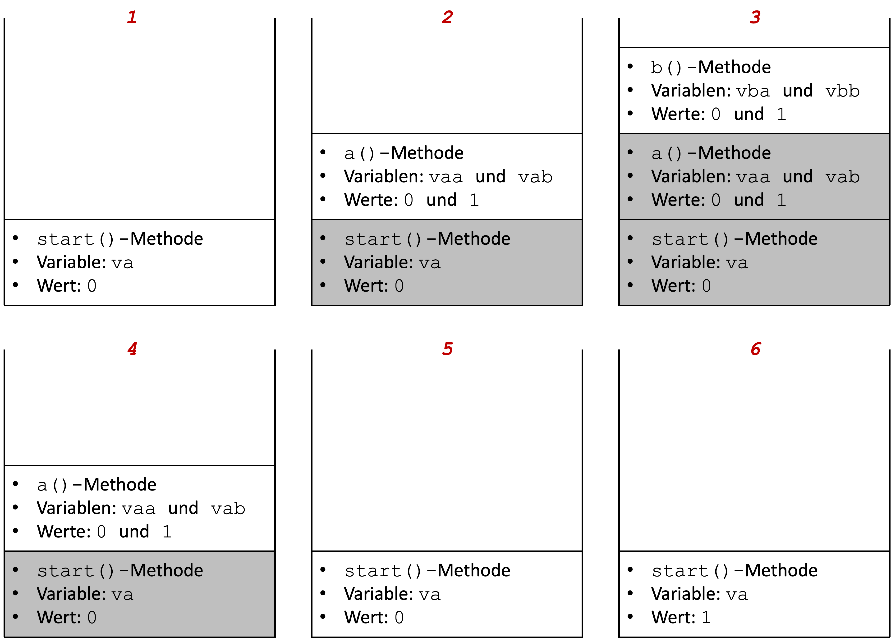
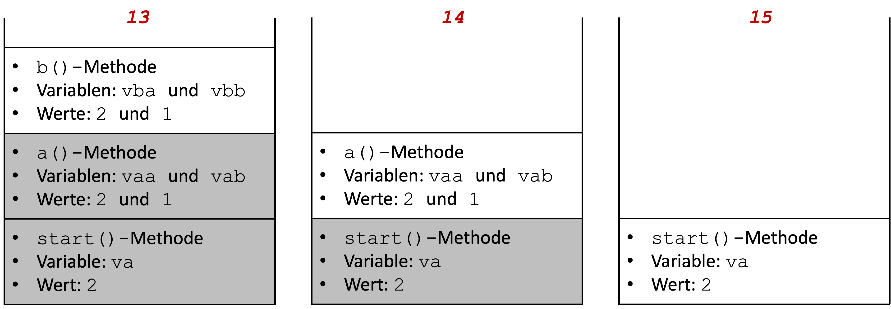

# Methodenstack

Programme und die dazugehörigen Variablen (und deren Werte) befinden sich zur Ausführung im Arbeitsspeicher. Der Speicher ist in Blöcke (Bytes) unetrteilt, die jeweils adressierbar sind. So könnte alles jeweils eine Adresse zugeordnet werden und mit einer komplexen Adressverwaltung ließen sich die Einzelteile ansprechen. Das ist jedoch viel zu aufwendig und inperformant. Deshalb werden Speichermodelle verwendet, die die Verwaltung der Programmteile erleichtern. Ein solches Speichermodell ist der *Stack* (*Stapelspeicher*). 

Bei einem Stack gilt das *Last in first out (LIFO)* Prinzip, also das, was zuletzt in den Stack kam, muss auch als erstes wieder hinaus. tatsächlich gibt es nur ganz wenige Funktionalitäten, um einen solchen Stack zu verwalten: 

- `push`: Element oben auf den Stack hinzufügen 
- `pop`: Element von oben aus dem Stack entfernen
- `top` (manchmal auch `peek` genannt): auf oberes Element zugreifen (lesen, aber im Stack belassen)

Folgende Abbildung stellt diese Methoden grafisch dar:


Für einen solchen Stack gibt es jetzt nur drei Möglichkeiten:

- Element `E` kann gelesen werden (aber im Stack belassen) - `top`
- Element `E`kann aus dem Stack entfernt werden - `pop`
- ein neues Element (z.B. `F`) kann zum Stack hinzugefügt werden - `push` (dann kann auch `E` nicht mehr gelesen werden; so wie bereits `A`-`D`)


## Abarbeitung von Methoden

Wir betrachten das Speichermodell *Stack*, weil die Abarbeitung von Methoden nach diesem Prinzip funktioniert. Methoden, die abgearbeitet (aufgerufen) werden, werden in einem solchen Stack angeordnet. Wir betrachten ein Beispiel:

=== "Methodenstack.java"
	```java linenums="1"
	public class Methodenstack
	{
		public void a(int vaa)
		{
			int vab = 1;
			System.out.println("+--a()   --> va  = " + vaa + " vb  = " + vab);
			b(vaa, vab);
		}
		
		public void b(int vba, int vbb)
		{
			System.out.println("+----b() --> vba = " + vba + " vbb = " + vbb);
			System.out.println();
		}
		
		public void start()
		{
			for(int va=0; va<3; va++)
			{
				System.out.println("start()  --> va  = " + va);
				a(va);
			}
		}
	}
	```

In diesem Beispiel gibt es drei Methoden: 

- die `start()`-Methode mit der Variablen `va`,
- die `a()`-Methode mit den Variablen `vaa` und `vab` und 
- die `b()`-Methode mit den Variablen `vba` und `vbb`.

Die `start()`-Methode ruft die Methode `a()` auf und die `a()`-Methode ruft die `b()`-Methode auf. 

Die Ausgabe des Programms ist wie folgt:

```bash
start()  --> va  = 0
+--a()   --> va  = 0 vb  = 1
+----b() --> vba = 0 vbb = 1

start()  --> va  = 1
+--a()   --> va  = 1 vb  = 1
+----b() --> vba = 1 vbb = 1

start()  --> va  = 2
+--a()   --> va  = 2 vb  = 1
+----b() --> vba = 2 vbb = 1
```

Die `start()`-Methode ruft also drei Mal (innerhalb der Schleife) die `a()`-Methode auf, welche wiederum die `b()`-Methode aufruft. 

Bei dem Aufruf von Methoden passiert folgendes:

- bei jedem Methodenaufruf wird eine **Methodeninstanz** auf den Stack gelegt
- eine **Methodeninstanz** sind alle zur Laufzeit veränderlichen Daten, die zur Methode gehören (Parameter und lokale Variablen)
- nach Abarbeitung der Methode (oft durch `return` - muss aber nicht, wie in unserem Beispiel) wird die Methodeninstanz wieder aus dem Stack entfernt (und somit auch alle dazu gehörenden Daten (Parameter, lokale Variablen und deren Werte))

In unserem Beispiel passiert also folgendes:





1. Die `start()`-Methode wird ausgeführt; die Variable `va` wird **erzeugt** und bekommt den Wert `0`. Die `start()`-Methode erzeugt eine Ausgabe auf die Konsole und ruft dann die Methode `a()` auf.
2. Die `a()`-Methode wird ausgeführt; die Variablen `vaa` und `vab` werden **erzeugt** und bekommen die Werte `0`und `1`. In der `a()`-Methode erfolgt eine Ausgabe auf die Konsole. Die `a()`-Methode ruft die Methode `b()` auf. 
3. Die `b()`-Methode wird ausgeführt; die Variablen `vba` und `vbb` werden **erzeugt** und bekommen die Werte `0`und `1`. In der `b()`-Methode erfolgt eine Ausgabe auf die Konsole. Danach ist die Ausführung der `b()`-Methode zu Ende. Alles, was mit der `b()`-Methode zu tun hat, insb. die Variablen `vba` und `vbb` werden aus dem Speicher **gelöscht**.  
4. Zurück zur Ausführung von `a()`. Keine weitere Anweisung - die Ausführung der `a()`-Methode zu Ende. Alles, was mit der `a()`-Methode zu tun hat, insb. die Variablen `vaa` und `vab` werden aus dem Speicher **gelöscht**.  
5. Zurück zur Ausführung von `start()`. Die Variable `va` bekommt innerhalb der Schleife den neuen Wert `1`. 
6. Die Variable `va` hat nun den Wert `1`. Die `start()`-Methode erzeugt eine Ausgabe auf die Konsole und ruft dann die Methode `a()` auf.
7. Die `a()`-Methode wird ausgeführt; die Variablen `vaa` und `vab` werden **erzeugt** und bekommen die Werte `1`und `1`. In der `a()`-Methode erfolgt eine Ausgabe auf die Konsole. Die `a()`-Methode ruft die Methode `b()` auf. 
8. Die `b()`-Methode wird ausgeführt; die Variablen `vba` und `vbb` werden **erzeugt** und bekommen die Werte `1`und `1`. In der `b()`-Methode erfolgt eine Ausgabe auf die Konsole. Danach ist die Ausführung der `b()`-Methode zu Ende. Alles, was mit der `b()`-Methode zu tun hat, insb. die Variablen `vba` und `vbb` werden aus dem Speicher **gelöscht**.  
9. Zurück zur Ausführung von `a()`. Keine weitere Anweisung - die Ausführung der `a()`-Methode zu Ende. Alles, was mit der `a()`-Methode zu tun hat, insb. die Variablen `vaa` und `vab` werden aus dem Speicher **gelöscht**.  
10. Zurück zur Ausführung von `start()`. Die Variable `va` bekommt innerhalb der Schleife den neuen Wert `2`. 
11. Die Variable `va` hat nun den Wert `2`. Die `start()`-Methode erzeugt eine Ausgabe auf die Konsole und ruft dann die Methode `a()` auf.
12. Die `a()`-Methode wird ausgeführt; die Variablen `vaa` und `vab` werden **erzeugt** und bekommen die Werte `2`und `1`. In der `a()`-Methode erfolgt eine Ausgabe auf die Konsole. Die `a()`-Methode ruft die Methode `b()` auf. 
13. Die `b()`-Methode wird ausgeführt; die Variablen `vba` und `vbb` werden **erzeugt** und bekommen die Werte `2`und `1`. In der `b()`-Methode erfolgt eine Ausgabe auf die Konsole. Danach ist die Ausführung der `b()`-Methode zu Ende. Alles, was mit der `b()`-Methode zu tun hat, insb. die Variablen `vba` und `vbb` werden aus dem Speicher **gelöscht**.  
14. Zurück zur Ausführung von `a()`. Keine weitere Anweisung - die Ausführung der `a()`-Methode zu Ende. Alles, was mit der `a()`-Methode zu tun hat, insb. die Variablen `vaa` und `vab` werden aus dem Speicher **gelöscht**.  
15. Zurück zur Ausführung von `start()`. Die Variable `va` bekommt innerhalb der Schleife den neuen Wert `3`. Die Bedingung der Schleife `va<3` ist somit `false`. Die Schleife wird verlassen, keine weitere Anweisung in `start()`. Die Abarbeitung des Programms ist zu Ende. Alles, was mit der `start()`-Methode zu tun hat, insb. Variable `va` wird aus dem Speicher gelöscht. 


## Lebensdauer und Sichtbarkeit von lokalen Variablen

Die Variablen, die wir bis jetzt verwendet haben, wurden in Methoden deklariert oder in Anweisungsblöcken, die in Methoden liegen (z.B. in `for`-Schleifen). Bei solchen Variablen sprechen wir von *lokalen* Variablen. Wir werden später noch *globale* Variablen kennenlernen. Zunächst interessieren uns aber nur die *lokalen* Variablen. Das obige Beispiel zeigt, dass *lokale* Variablen, also solche, die in Methoden deklariert werden, nur so lange **existieren**, wie diese Methode ausgeführt wird. Generell gilt:

> Eine Variable **existiert** in dem Anweisungsblock, in dem sie deklariert wurde, solange dieser Anweisungsblock **ausgeführt** wird. 

Schauen wir uns dazu die Situationen in dem oberen Beispiel an:

- Die Variable `va` wird in der `start()`-Methode deklariert. Die `start()`-Methode wird die ganze Zeit ausgeführt. Also existiert auch die Variable `va` die gesamte Zeit des Programmablaufs. 
- Die Variablen `vaa` und `vab` werden in der `a()`-Methode deklariert. Sie existieren immer nur dann, wenn die `a()`-Methode ausgeführt wird. In unserem Beispiel existieren die Variablen `vaa` und `vab` also drei Mal (sie werden drei Mal erzeugt und drei Mal wieder vollständig gelöscht). Da die Methode `a()` die Methode `b()` aufruft, existieren die Variablen `vaa` und `vab` auch während der Ausführung von `b()`, da zur Zeit der Ausführung von `b()` ja auch `a()` ausgeführt wird (und `start()`).
- Die Variablen `vba` und `vbb` werden in der `b()`-Methode deklariert. Sie existieren immer nur dann, wenn die `b()`-Methode ausgeführt wird. In unserem Beispiel existieren die Variablen `vba` und `vbb` also drei Mal (sie werden drei Mal erzeugt und drei Mal wieder vollständig gelöscht). 

Die Lebensdauer eine Variable wird somit von der Ausführungsdauer des Anweisungsblockes bestimmt, in dem die Variable deklariert wurde. 

!!! note "Lebensdauer"
	Es ist eine gängige Praxis, alle Variablen, die man in einer Methode verwenden möchte, am Anfang der Methode zu deklarieren. Erstens sieht man dann, welche Variablen innerhalb der Methode alle verwendet werden und zweitens kann man diese Variablen in allen Anweisungsblöcken innerhalb der Methode verwenden. Einzige Ausnahme stellen Laufvariablen der `for`-Schleifen dar. Diese werden häufig direkt in der `for`-Schleife deklariert (`for(int i=0, i<10; i++){}`). Sie existieren dann aber auch nur in dieser `for`-Schleife! Außerhalb der `for`-Schleife existiert diese Variable dann nicht (mehr)! Das bedeutet auch, dass wenn Sie diese Variable in einer anderen `for`-Schleife verwenden wollen, müssen Sie sie dort erneut deklarieren. 

Unter *Sichtbarkeit* einer Variablen versteht man die Möglichkeit, auf diese Variable zuzugreifen (also ihr entweder einen neuen Wert zuzuweisen oder ihren Wert auszulesen). Generell gilt:

> Eine lokale Variable ist in dem Anweisungsblock sichtbar, in dem sie deklariert wird und in allen Anweisungsblöcken, die sich in diesem Anweisungsblock befinden. Außerhalb des Anweisungsblockes, in dem die Variable deklariert wurde, ist die Variable nicht sichtbar. 

Das heißt für unser Beispiel, dass die Variable `va` nur in der `start()`-Methode sichtbar ist (also nur dort auf sie zugegriffen werden kann/sie nur dort verwendet werden kann), die Variablen `vaa` und `vab` nur in der `a()`-Methode verwendet werden können (sichtbar sind) und die Variablen `vba` und `vbb` nur in `b()`. 

!!! note "Sichtbarkeit"
	Der Vorteil dieser *lokalen* Sichtbarkeit besteht darin, dass man sich z.B. keine Sorgen machen muss, ob eine gleichnamige Variable evtl. bereits in einer anderen Methode deklariert wurde. Eine Variable darf ja immer nur einmal deklariert werden. Da alle anderen Variablen aber nicht in der eigenen Methode sichtbar sind, gibt es keinerlei Konflikte mit anderen lokalen Variablen. Die lokalen Variablen aus anderen Methoden haben mit den Variablen aus der eigenen Methode gar nichts zu tun. Außerdem ist es auch nicht möglich, einfach Werte von Variablen aus anderen Methoden zu schreiben oder zu lesen. Das würde ansonsten große Sicherheitsprobleme mit sich bringen und man könnte Programme auch leicht zum Absturz bringen. 

## Werte- vs. Referenztypen

Es ist ganz wichtig, zu verstehen, dass es ganz wesentliche Unterschiede zwischen Werte- und Referenztypen gibt. Einige der Unterschiede sind in der folgenden Tabelle aufgelistet:

|            | Wertetypen | Referenztypen |
|------------|------------|---------------|
| Beispiele  | `int`, `double`, `boolean`, `char`, `long`, `float`, `byte`, `short` | `String`, `Point`, `Triangle`, `Circle`, `Adresse`, `System`, ... |
| neue erzeugbar? | nein | ja - einfach eigene Klasse erstellen |
| Was ist der "Wert" einer Variablen? | ein Wert (`5`, `true`, `1.234`, `'a'`, ...) | die Referenz auf ein Objekt |
| Manipulation von Werten | mit Operatoren (`+`, `==`, `&&`, ...) | mit Methoden | 
| `variable1 = variable2;` | Kopie des **Wertes** (`variable1` hat den Wert und `variable2` hat den Wert) | Kopie der **Referenz** auf das Objekt (beide Variablen zeigen auf das gleiche Objekt) |

Insbesondere den letzten Punkt wollen wir uns genauer anschauen. Zunächst Wertetypen. Angenommen, wir haben folgende Anweisungen:

```java
int a = 5;
int b = a;
```

Nach Abarbeitung dieser Anweisungen hat sowohl die Variable `a` den Wert `5` als auch die Variable `b`. Wenn wir nun `a=6;` setzen, dann hat `a` den Wert `6` und `b` immer noch den Wert `5`. 

> Der Wert einer Variablen von einem Wertetyp kann sich nur durch den Zuweisungsoperator `=` ändern!

Folgende Abbildung zeigt die Verwaltung der beiden `int`-Variablen `a` und `b` im Speicher:


Die Zahlen in den Kästchen unter `a` und `b` stehen für Speicheradressen. Das Gute an Java ist, dass wir uns um solche Adressen nicht kümmern müssen. Wir greifen auf die Werte von `a` und `b` einfach über die Variablennamen `a` und `b` zu. Die Speicherdressen interessieren uns dabei (zum Glück) gar nicht. Wichtig ist, dass jede Variable **ihren eigenen Wert** hat. Wenn wir den Wert von `a` ändern, ändert sich nur der Wert von `a`, wenn wir den Wert von `b` ändern, ändert sich nur der Wert von `b`. Dabei ist ganz egal, ob `b` den Wert `5` durch die Wertzuweisung `b=5;` erhalten hat oder durch `b=a;`, wobei `a` den Wert `5` hatte. 

Anders ist es bei Referenzvariablen, also bei Variablen, die von einem Referenztyp sind. Nehmen wir z.B. unsere Klasse `Point` und führen folgende Anweisungen aus:

```java
Point p1 = new Point(3,4);
Point p2 = p1;
```

Hier gibt es **genau ein** Objekt, nämlich das Objekt, in dem die Objektvariablen `x` und `y` den Wert `3` bzw. `4` haben. Die beiden Variablen `p1` und `p2` referenzieren **das gleiche** Objekt, d.h. sie zeigen darauf. Die folgende Abbildung verdeutlicht diesen Fall:


Beide Variablen `p1` und `p2` zeigen auf **dasselbe** Objekt. Es gibt ja auch nur **ein** Objekt. Ein Objekt kann nur durch `new` und die Angabe des Konstruktors erzeugt werden. Das passiert hier genau einmal. Während also bei `int b = a;` eine **Kopie des Wertes** erfolgt, erfolgt bei `Point p2 = p1;` eine **Kopie der Referenz** (aber keine Kopie des Objektes!).

Wichtig ist jetzt noch zu wissen, dass wir auf die Objekteigenschaften des `Point`-Objektes sowohl über die Referenz `p1` als auch über die Referenz `p2` zugreifen können, d.h. dass z.B. `p1.print()` und `p2.print()` exakt die gleiche `print()`-Methode aufrufen, nämlich die des obigen `Point`-Objektes. Sowohl `p1.getX()` als auch `p2.getX()` geben `3` zurück, da sie den Wert **derselben** Objektvariablen `x` abfragen.

> Wenn mehrere Referenzen auf dasselbe Objekt existieren, ist es egal, über welche Referenz wir auf die Objekteigenschaften zugreifen; es handelt sich um genau **ein** Objekt (mit mehreren Referenzen darauf).

Wir müssen nun also wissen, dass bei den folgenden Anweisungen 

```java
int a = 5;
int b = a;
b = 4;
System.out.println(a);
```

der Wert von `a` ausgegeben wird und der ist `5`, denn es gibt genau eine Wertzuweisung für `a` und das ist `a=5;`. Es spielt gar keine Rolle, ob `b` seinen Wert zwischendurch ändert oder nicht - bei der Anweisung `b = a;` ist der Wert `5` kopiert worden und der Wert von `a` ist danach völlig unabhängig von `b` und umgedreht. 

Wir müssen nun auch wissen, dass bei den folgenden Anweisungen 


```java
Point p1 = new Point(3,4);
Point p2 = p1;
p2.translate(1,2);
System.out.println(p1.getX());
```

der Wert der Objektvariablen `x` des **einen** Objektes ausgegeben wird, das existiert. Durch die `translate()`-Methode ist der `x`-Wert des Objektes nun `4` (und der `y`-Wert ist `6`). Das heißt, es wird eine `4` ausgegeben. Dabei ist völlig egal, ob die `translate()`-Methode über die Referenz `p1` oder über die Referenz `p2` aufgerufen wird und es ist auch völlig egal, ob die `print()`-Methode über die Referenz `p1` oder über die Referenz `p2` aufgerufen wird. Beide referenzieren dasselbe Objekt.

### Arrays sind (auch) Objekte!

Schauen wir uns folgenden Fall an:

```java
int[] a1 = { 3, 4 };
int[] a2 = a1;
a2[1] = 5;
System.out.println(a1[1]);
```

Arrays sind (auch) Objekte. Also haben wir hier den gleichen Fall, wie bene bei `Point`. Auch referenzieren sowohl `a1` als auch `a2` **dasselbe** Array (es gibt ja nur eins). Wenn wir also über die Referenz `a2` den zweiten Wert im Array auf `5` setzen und wir danach über die Referenz `a1` den zweiten Wert dieses Array auslesen, dann ist er `5`.

Sie werden sich jetzt sicherlich fragen, warum wir uns überhaupt Kopien der Referenzen machen - das ist doch nur verwirrend. Die Antwort ist, dass dieser Fall sogar sehr oft vorkommt, nämlich immer genau dann, wenn wir Referenzen von Objekten als Parameter übergeben. Schauen wir uns folgendes Beispiel an:

```java linenums="1"
public static void swap(int[] arr, int index1, int index2)
{
	if(index1 >=0 && index1<arr.length && index2 >= 0 && index2<arr.length)
	{
		int tmp = arr[index1];
		arr[index1] = arr[index2];
		arr[index2] = tmp;
	}
}
```

Diese Methode implementiert das Vertauschen zweier Elemente in einem `int`-Array. So, wie wir es z.B. in vielen Sortieralgorithmen benötigen. Die Werte der Elemente an den Indizes `index1` und `index2` werden miteinander getauscht. Wir speichern den einen Wert zwischen, damit wir ihn nicht überschreiben. Es wird vorab geprüft, ob die beiden Indizes `index1` und `index2` überhaupt im Array `arr` existieren. 

Angenommen, wir haben nun in der `start()`-Methode (oder einer anderen Methode) folgende Anweisungen

```java linenums="1"
int[] a1 = { 1, 2, 3, 4, 5 };
swap(a1, 0, 1);			// Uebergabe der Referenz auf das Array
for(int i=0; i<a1.length; i++)
{
	System.out.println(a1[i] + " ");
}
```
, dann ist die Ausgabe 

```bash
2 1 3 4 5
```

Wir übergeben bei Aufruf der Methode `swap(a1, 0, 1);` die Referenz auf das Array und in der Methode wird die lokale Variable `arr` mit genau dieser Referenz initialisiert, d.h. es existieren dann zwei Referenzen auf das Array! Die Referenz `arr` innnerhalb der `swap()`-Methode und die Referenz `a1` innerhalb der `start()`-Methode. Zwei Referenzen, aber nur ein Objekt!

Lösen Sie die folgenden Übungsaufgaben durch Überlegen!

??? "Was wird ausgegeben? (start() wird ausgeführt)"
	```java
	public void swap(int a, int b)
	{
		int tmp = a;
		a = b;
		b = tmp;
	}


	public void start()
	{
		int a = 3;
		int b = 4;
		swap(a, b);
		System.out.println(a);
	}
	```

??? "Was wird ausgegeben?"
	=== "I.java"
		```java
		public class I
		{
			private int o;
			
			public I(int o)
			{
				this.o = o;
			}
			
			public int getO()
			{
				return this.o;
			}
			
			public void add1()
			{
				o++;
			}
		}
		```
	=== "TestI.java"
		```java
		public void doSomething(I i2)
		{
			i2.add1();
		}

		public void start()
		{
			I i1 = new I(1);
			I i2 = i1;
			i2.add1();
			I i3 = i1;
			doSomething(i3);
			System.out.println(i1.getO());
			System.out.println(i2.getO());
			System.out.println(i3.getO());
		}
		```


## Das "Leben" der Objekte

Wir haben uns bereits eingehend mit der [Lebensdauer und der Sichtbarkeit](./#lebensdauer-und-sichtbarkeit-von-lokalen-variablen) von *lokalen* Variablen beschäftigt. Es ist dabei übrigens gaz egal, ob es sich um Variablen von einem Werte- oder einem Referenztyp handelt. Auf die Lebensdauer und Sichtbarkeit hat das keinen Einfluss. 

Wir wissen auch bereits, dass *Objektvariablen* für jeweils ein Objekt existieren. Die Lebensdauer einer Objektvariablen entspricht also der Lebensdauer ihres Objektes. Wir wissen auch über die Sichtbarkeit der Objektvariablen bescheid, denn sie sind in der gesamten Klasse sichtbar, in der sie deklariert werden, also auch in allen Methoden dieser Klasse. Ob sie darüber hinaus auch über eine Referenz auf ein Objekt in anderen Klassen sichtbar sind, hängt vom Sichtbarkeitsmodifizierer ab. Normalerweise nicht, denn wir deklarieren alle Objektvariablen als `private`.

Wir wollen nun untersuchen, wie lange Objekte existieren. Wir wissen bereits, dass ihre Existenz mit der Anweisung `new` gefolgt vom Konstruktor beginnt. 

Wir haben gelernt, dass Methoden in einem sogenannten *Stack* abgearbeitet werden und dass in diesem Stack auch die lokalen Variablen existieren - und zwar so lange, so lange die Methode abgearbeitet wird, also im Stack existiert. Sichtbar sind jedoch nur die lokalen Variablen, die zur Methode gehören, die im Stack ganz oben liegt, also *gerade* abgearbeitet wird. Objekte werden **nicht** im Stack abgelegt. Der Speicherbereich für Objekte nennt sich *Heap*. Wir wollen auf die Speicherstruktur des *Heap* gar nicht weiter eingehen, wichtig ist nur, dass bei Erzeugung eines Objektes Speicherplatz im *Heap* für das Objekt reserviert wird. Die Größe des reservierten Speicherplatzes bestimmt der Konstruktor und ist von den Objektvariablen des Objektes abhängig, also von der Größe und der Anzahl der Objektvariablen[^1]. Die Objektvariablen existieren auf dem Heap. Lebt das Objekt nicht mehr, wird der Speicherplatz auf dem Heap (automatisch) freigegeben.

[^1]: Ein `Point`-Objekt besteht z.B. aus zwei `int`-Variablen (`x` und `y`) und benötigt somit 2 x 32Bit, also 64Bit. 

Wir wissen, wann Objekte anfangen, zu existieren (wenn sie erzeugt werden), aber wann hören Sie auf, zu existieren? Wir betrachten "das Leben" eines Objektes am Beispiel eines `Point`-Objektes:

1. Objekt-Referenz deklarieren

	```java
	public void start()
	{
		Point p1;
	}
	```

	Damit ist bereits eine Referenz mit dem Namen `p1` auf ein `Point`-Objekt definiert. Das Objekt existiert aber noch gar nicht! Aber es sind schonmal 64Bit im Heap reserviert. 

	Die (Referenz-)Variable `p1` ist eine *lokale* Variable der Methode `start()`. `p1` ist nur in der `start()`-Methode sichtbar, sie existiert so lange, solange `start()` ausgeführt wird und sie existiert im *Stack*. 

2. Objekt erzeugen

	```java
	public void start()
	{
		Point p1 = new Point(3,4);
	}
	```

	Jetzt existiert ein `Point`-Objekt! Es wird im *Heap* abgelegt. Insbesondere werden die Objektvariablen `x` und `y` im Heap abgelegt und bekommen die Werte `3` und `4`. 

	Jetzt gibt es eine Referenzvariable `p1` im Stack und ein Objekt mit Objektvariablen im Heap. Durch den Zuweisungsoperator `=` werden die beiden miteinander verbunden, d.h `p1` *zeigt* jetzt auf das `Point`-Objekt. 
	
	

	An dieser Stelle ist es schonmal sinnvoll zu betonen, dass die **einzige** Möglichkeit, auf das `Point`-Objekt zuzugreifen, derzeit über die `p1`-Variable existiert. Gäbe es diese Variable nicht, hätten wir keinen Zugriff auf das Objekt!

3. Ein weiteres Objekt und eine Referenz darauf erzeugen

	Wir erzeugen zur Veranschaulichung ein weiteres Objekt und die Referenzvariable `p2`, die darauf zeigt.

	```java
	public void start()
	{
		Point p1 = new Point(3,4);
		Point p2 = new Point(3,4);
	}
	```

	Jetzt existieren zwei `Point`-Objekte im Heap und zwei Referenzvariablen `p1` und `p2`, die jeweils auf eines der beiden Objekte zeigen. `p1` und `p2` sind lokale Variablen der `start()`-Methode und existieren im Stack. 

	

	Beachten Sie, dass die beiden Objekte zwar Objektvariablen haben, die gleiche Werte aufweisen, aber es handelt sich um zwei (verschiedene) Objekte!

4. Eine weitere Referenz erzeugen

	Jetzt erzeugen wir noch eine weitere Referenz auf das erste `Point`-Objekt. Wir nennen die Referenzvariable `p3`. 

	```java
	public void start()
	{
		Point p1 = new Point(3,4);
		Point p2 = new Point(3,4);
		Point p3 = p1;
	}
	```

	Diese Situation lässt sich so veranschaulichen:

	

	Auf das erste Objekt existieren also gleich zwei Referenzen. Über beide Referenzen kann mittels Punktnotation auf das Objekt (dessen Objekteigenschaften) zugegriffen werden. Es ist also egal, ob man `p1.` oder `p3.` schreibt, beide zeigen auf das gleiche Objekt. 

5. Eine Referenz ändern

	Wir ändern nun die soeben erstellte Referenz und lassen sie nun auf das zweite Objekt zeigen:

	```java
	public void start()
	{
		Point p1 = new Point(3,4);
		Point p2 = new Point(3,4);
		Point p3 = p1;
		p3 = p2;
	}
	```

	`p3` darf natürlich nicht erneut deklariert werden. Wir kopieren die Referenz von `p2` nach `p3`. `p3` zeigt damit nun auf das zweite Objekt. 

	

	Nun zeigen `p2` und `p3` auf dasselbe Objekt. Nun ist es also egal, ob man `p2.` oder `p3.` schreibt, beide zeigen auf dasselbe - das "zweite" - Objekt. Auf das "erste" Objekt zeigt nur noch `p1`. 

6. Eine weitere Referenz ändern

	Nun lassen wir auch noch `p1` auf das zweite Objekt zeigen. 

	```java
	public void start()
	{
		Point p1 = new Point(3,4);
		Point p2 = new Point(3,4);
		Point p3 = p1;
		p3 = p2;
		p1 = p2; 		// exakt gleich zu p1 = p3;
	}
	```
	
	Die nun entstandene Situation lässt sich wie folgt veranschaulichen:

	

	Der entscheidende Punkt ist nun der, dass es auf das erste Objekt **keine Referenz** mehr gibt. Damit ist das Objekt für uns verloren - wir haben **keinen Zugriff** mehr darauf!

	Was passiert mit einem solchen Objekt? Es wird aus dem Speicher gelöscht. Dies erfolgt automatisch. Die Laufzeitumgebung erkennt solche Objekte, auf die keine Referenz mehr zeigt. Die sogenannte *Garbage Collection* gibt diesen Speicher wieder für die weitere Verwendung frei. In Java müssen wir uns - im Gegensatz zu anderen Programmiersprachen - nicht um die Speicherfreigabe kümmern. Das erfolgt im Hintergrund und ganz automatisch. 

Neben der Änderung einer Referenz kann eine Referenzvariable auch aufhören, zu existieren und damit ist ein Objekt ohne Referenz. Das folgende Beispiel zeigt einen solchen Fall:

```java
public void createPoint()
{
	Point p = new Point(3,4);
}

public void start()
{
	createPoint();
}
```

In der `start()`-Methode wird die `createPoint()`-Methode aufgerufen. Darin wird eine Referenz `p` erzeugt und ein `Point`-Objekt. `p` zeigt auf dieses Objekt. Sobald die Methode abgearbeitet ist und verlassen wird, hört die lokale Variable `p` jedoch auf zu existieren. Sie wird aus dem Stack gelöscht. Somit ist das `Point`-Objekt im Heap ohne eine Referenz und muss von der *Garbage Collection* entsorgt werden. 

??? "Erweitern Sie obiges Programm so, dass eine Referenz auf das `Point`-Objekt nicht verloren geht"

### Der `null`-Wert

Zeigt eine Referenzvariable auf **kein** Objekt, so ist ihr Wert `null`. Beispiel:

```java
public void start()
{
	Point p1;	// p1 hat den Wert null
}
```

Die Referenzvariable `p1` vom Typ `Point` existiert bereits, aber es existiert (noch) kein `Point`-Objekt, auf das sie zeigt. Somit ist der "Wert" der Referenzvariable `p1` `null`. Referenzvariablen können auch explizit auf `null` gesetzt werden:

```java
public void start()
{
	Point p1 = new Point(3,4);	// Point-Objekt existiert, p1 zeigt auf das Point-Objekt
	p1 = null;					// p1 zeigt auf kein Objekt (mehr) - das Point-Objekt wird von der GC entsorgt
}
```

Im oberen Beispiel wurde die `p1`-referenzvariable vom Typ `Point` deklariert und ein `Point`-Objekt. Die `p1`-variable referenziert (zeigt auf) das `Point`-Objekt. Danach wird `p1` explizit der "Wert" `null` zugeordnet. Die `p1`-Variable zeigt auf *kein* `Point`-Objekt mehr. Da das `Point`-Objekt nun keine Referenz mehr auf sich hat (und somit nicht mehr verwendet werden kann), wird es durch die Garbage Collection entsorgt. 

### Referenzvergleiche mit `==`

Wir kennen den Operator `==` als logischen Vergleichsoperator von Werten, z.B. können wir `int`-Werte damit vergleichen oder `char`-Werte oder `boolean`-Werte usw. Der Vergleichsoperator `==` kann auch für Referenzvergleiche verwendet werden, aber **Achtung!**, es handelt sich dann ausschließlich um Referenzvergleiche und nicht um eine **Gleichheit** von Objekten (dazu verwenden wir später `equals()`). Beispiele:

```java
public void start()
{
	Point p1 = new Point(3,4);
	Point p2 = new Point(3,4);
	Point p3 = p1;
	System.out.println(p1 == p2); 	// false - nicht die gleiche Referenz (zwei verschiedene Objekte)
	System.out.println(p1 == p3); 	// true - die gleiche Referenz (ein Objekt)
	Point p4;
	System.out.println(p4 == null); // true - keine Referenz auf ein Objekt
	System.out.println(p1 != null); // true - Referenz auf ein Objekt, deshalb ungleich null

}
```

Es ist eigentlich ungünstig, den Gleichheitsoperator `==` von Werten auch für Referenzen zu verwenden, da dies am Anfang verwirrend sein kann. Wichtig ist, dass der "Wert" einer Referenz die Referenz(-adresse) auf ein Objekt ist. Haben zwei Referenzvariablen den gleichen "Wert", dann zeigen sie auf dasselbe Objekt (und somit ist `==` `true`). Der Gleichheitsoperator `==` prüft **nicht** die Gleichheit von Objekten (z.B. beide `x`-variablen `3` und beide `y`-Variablen `4` - das erledigen wir später, indem wir die `equals()`-Methode überschreiben)!

> Wird der Vergleichsoperator `==` für Referenztypen verwendet, so wird nur die Gleichheit von Referenzen verglichen, nicht aber die Gleichheit von Objekten!

!!! success
	Wir haben zwei Aspekte diskutiert, die beide sehr wichtig für das Verständnis der objektorientierten Programmierung sind. Einerseits den Unterschied zwischen Werte- und Referenztypen und andererseits, dass ein Objekt aufhört, zu existieren, sobald es keine Referenz mehr gibt, die auf dieses Objekt zeigt. Insbesondere das Verständnis über den Unterschied zwischen Werte- und Referenztypen ist wirklich wichtig, um die Konzepte der objektorientierten Programmierung gut verstehen zu können!


