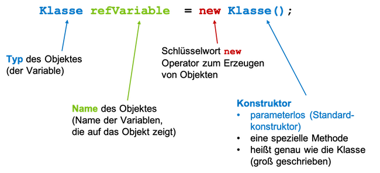

# Klassen und Objekte

Wir haben bereits grob die Begriffe *Klassen*  und *Objekte* kennengelernt. Nun wollen wir das Verständnis dafür vertiefen. Dazu erstellen wir uns unsere erste "richtige" eigene Klasse.


### Ein erster eigener Datentyp `Adresse`

Wir erstellen uns ein neues BlueJ-Projekt und nennen es `adresse`. Darin erstellen wir eine neue Klasse `Adresse`. Wir löschen alles aus dieser Klasse, so dass nur 

=== "Adresse.java"
	```java linenums="1"
	public class Adresse
	{

	}
	```

übrig bleibt. Von dieser Klasse erzeugen wir uns eine Testklasse - BlueJ nennt sie `AdresseTest`. Ein Doppelklick auf das grüne Rechteck der Testklasse öffnet den Editor und zeigt


=== "AdresseTest.java"
	```java linenums="1"
	public class Adresse
	{
		import static org.junit.jupiter.api.Assertions.*;
		import org.junit.jupiter.api.AfterEach;
		import org.junit.jupiter.api.BeforeEach;
		import org.junit.jupiter.api.Test;

		/**
		 * The test class AdresseTest.
		 *
		 * @author  (your name)
		 * @version (a version number or a date)
		 */
		public class AdresseTest
		{
		    /**
		     * Default constructor for test class AdresseTest
		     */
		    public AdresseTest()
		    {
		    }

		    /**
		     * Sets up the test fixture.
		     *
		     * Called before every test case method.
		     */
		    @BeforeEach
		    public void setUp()
		    {
		    }

		    /**
		     * Tears down the test fixture.
		     *
		     * Called after every test case method.
		     */
		    @AfterEach
		    public void tearDown()
		    {
		    }
		}
	}
	```

In diese Testklasse fügen wir eine Methode `testAdresse()` wie folgt hinzu:

=== "AdresseTest.java"
	```java linenums="1" hl_lines="21-25"
	import static org.junit.jupiter.api.Assertions.*;
	import org.junit.jupiter.api.AfterEach;
	import org.junit.jupiter.api.BeforeEach;
	import org.junit.jupiter.api.Test;

	/**
	 * The test class AdresseTest.
	 *
	 * @author  (your name)
	 * @version (a version number or a date)
	 */
	public class AdresseTest
	{
	    /**
	     * Default constructor for test class AdresseTest
	     */
	    public AdresseTest()
	    {
	    }

	    @Test
	    public void testAdresse()
	    {
	        Adresse adresse1;
	    }

	    /**
	     * Sets up the test fixture.
	     *
	     * Called before every test case method.
	     */
	    @BeforeEach
	    public void setUp()
	    {
	    }

	    /**
	     * Tears down the test fixture.
	     *
	     * Called after every test case method.
	     */
	    @AfterEach
	    public void tearDown()
	    {
	    }
	}
	```

Wir wollen uns zunächst um diese Testklasse nicht weiter kümmern und ignorieren auch zunächst den gesamten Rest. Um Platz zu sparen, zeigen wir von nun an immer nur noch die `testAdresse()`-Methode. In dieser Methode sehen wir aber bereits die Deklaration einer Variablen `adresse1` vom Typ `Adresse`. Das bedeutet, dass unser neuer Datentyp `Adresse` bereits zur Verfügung steht und wir ihn verwenden können. Wir haben unseren ersten eigenen Datentyp erstellt!

#### Eigenschaften definieren

Unser Datentyp `Adresse` hat noch keine Eigenschaften. Als erstes definieren wir uns **Objektvariablen** für unsere Klasse:

=== "Adresse.java"
	```java linenums="1"
	public class Adresse
	{
		// --- Objektvariablen -----
		public String strasse;
		public int nummer;
		public int postleitzahl;
		public String wohnort;
		
	}
	```

Die *Struktur* aller Objekte unserer Klasse sieht also wie folgt aus. **Jedes Objekt** vom Typ `Adresse` hat 

- **eine eigene** Variable `strasse` (vom Typ `String`),
- **eine eigene** Variable `nummer` (vom Typ `int`),
- **eine eigene** Variable `postleitzahl` (vom Typ `int`),
- **eine eigene** Variable `wohnort` (vom Typ `String`).

#### Objektvariablen sind global!

Bis jetzt hatten wir unsere Variablen immer *lokal* in einer Methode deklariert. Diese Variablen waren nur in der Methode sichtbar und existierten auch nur in der Methode, in der sie deklariert wurden. Siehe dazu [Sichtbarkeit und Lebensdauer von lokalen Variablen](../methodenstack/#lebensdauer-und-sichtbarkeit-von-lokalen-variablen). 

Objektvariablen sind in der **Klasse** deklariert, nicht in einer Methode - sie sind *global*. Objektvariablen sind deshalb in der gesamten Klasse sichtbar, d.h. es kann in der gesamten Klasse daruf zugegriffen werden (in jeder Methode der Klasse). Objektvariablen existieren für ein konkretes Objekt. Jedes Objekt hat seine eigenen Objektvariablen. Diese existieren für das Objekt also so lange, solange das Objekt existiert. 

> Objektvariablen sind *global* und sind in allen Methoden der Klasse sichtbar, d.h. es kann in allen Methoden der Klasse auf die Objektvariablen zugegriffen werden.

#### Objektmethode hinzufügen

Jetzt wollen wir auch noch ein *Verhalten* implementieren und definieren uns dazu eine **Objektmethode**:

=== "Adresse.java"
	```java linenums="1"
	public class Adresse
	{
		// --- Objektvariablen -----
		public String strasse;
		public int nummer;
		public int postleitzahl;
		public String wohnort;
	
		// --- Objektmethoden ------
		public String getAdresse()
		{
			return strasse + " " + nummer + " in " + postleitzahl + " " + wohnort;
		}		
	}
	```


#### Objekte erzeugen - der Konstruktor

Wir haben jetzt einen "Bauplan" für alle Objekte vom Datentyp `Adresse` erzeugt. Nun wollen wir nach diesem Bauplan Objekte von der Klasse (vom Datentyp) `Adresse` erzeugen. Das geschieht mithilfe des *Konstruktors*.

> der Konstruktor einer Klasse heißt genau wie die Klasse selbst, ist aber eine Methode (z.B. `Adresse()`)

Um ein Objekt der Klasse zu erzeugen, verwenden wir das Schlüsselwort `new` und rufen dann den Konstruktor der Klasse auf:

> `new Klassenname();` 


Wir erzeugen in der `testAdresse()`-Methode der `Testklasse` zwei Objekte der Klasse `Adresse`:

=== "AdresseTest.java"
	```java linenums="21"
	@Test
    public void testAdresse()
    {
        Adresse adresse1 = new Adresse();
        Adresse adresse2 = new Adresse();
    }
	```


Das generelle Vorgehen bei der Erzeugung eines Objektes zeigt die folgende Abbildung:



Wir haben nun zwei Objekte vom Typ `Adresse` erstellt. Die *Referenzvariable* `adresse1` zeigt auf das erste Objekt (Sie können auch sagen, dass `adresse1` der Name des ersten Objektes ist) und die Referenzvariable `adresse2` zeigt auf das zweite Objekt. **Jedes** dieser beiden Objekte hat seine eigenen Objektvariablen `strasse`, `nummer`, `postleitzahl` und `wohnort` und seine eigene Objektmethode `getAdresse()`. Wir werden jetzt auf diese Eigenschaften zugreifen.

#### Zugriff auf Objekteigenschaften - Punktnotation

Auf die Eigenschaften eines Objektes können wir über die Referenzvariable mittels *Punktnotation* zugreifen. Die Syntax ist also wie folgt:

> `referenzVariable.eigenschaft` 

Wir verwenden die Punktnotation für unsere Objekte vom Typ `Adresse`, um ihnen Werte für die Objektvariablen zuzuweisen und jeweils auf die Objektmethode zuzugreifen:

=== "AdresseTest.java"
	```java linenums="21"
	@Test
    public void testAdresse()
    {
        Adresse adresse1 = new Adresse();
        Adresse adresse2 = new Adresse();

		adresse1.strasse = "Wilhelminenhofstr.";
		adresse1.nummer = 75;
		adresse1.postleitzahl = 12459;
		adresse1.wohnort = "Berlin";
		
		adresse2.strasse = "Treskowallee";
		adresse2.nummer = 8;
		adresse2.postleitzahl = 10318;
		adresse2.wohnort = "Berlin";
		
		System.out.println(adresse1.getAdresse());
		System.out.println(adresse2.getAdresse());
    }
	```

Wir weisen also den jeweiligen Objektvariablen der beiden Objekte Werte zu und geben diese jeweils mithilfe der `getAdresse()`-Methode aus. Es ist ganz wichtig, zu verstehen, dass jedes Objekt seine eigenen Objektvariablen und seine eigenen Objektmethoden hat. Zugriff auf diese Variablen und Methoden gibt es stets nur über ein Objekt!

Die Ausgabe für obiges Beispiel sieht so aus:

```bash
Wilhelminenhofstr. 75 in 12459 Berlin
Treskowallee 8 in 10318 Berlin
```

Alle Objekte werden also nach dem gleichen "Bauplan" erstellt. Alle Objekte vom Typ `Adresse` haben die Eigenschaften:

- `strasse`, 
- `nummer`, 
- `postleitzahl`,  
- `wohnort` und 
- `getAdresse()`

Wenn wir die Klasse `Adresse` ändern, dann ändern sich auch die Eigenschaften entsprechend für **alle** Objekte dieser Klasse. 

#### Datenkapselung (Information Hiding) - das Schlüsselwort `private`

Ein wesentlicher Grundsatz der objektorientierten Programmierung ist das Prinzip der *Datenkapselung* (auch *data hiding* oder *information hiding* genannt). Dieses Prinzip dient dem Datenschutz. Wir wollen vermeiden, dass

- Unbefugte die Struktur (die Daten) unserer Objekte kennen und
- Unbefugte die Daten ändern können, ohne dass wir es erlauben. 

Angenommen, Sie haben eine Klasse `Konto` und es wäre möglich, ganz einfach auf ihre `pin` zuzugreifen. Das wäre fatal. Bereits der lesende Zugriff darauf könnte schädlich sein, aber genau so ärgerlich wäre es, wenn die `pin` einfach durch Fremde geändert werden könnte. Wir wollen deshalb sowohl den lesenden als auch den schreibenden Zugriff auf unsere Daten (auf unsere Objektvariablen) verbieten. Dazu deklarieren wir unsere Objektvariablen als `private`:

=== "Adresse.java"
	```java linenums="1"
	public class Adresse
	{
		// --- Objektvariablen -----
		private String strasse;			// Zugriff nur innerhalb der Klasse
		private int nummer;				// Zugriff nur innerhalb der Klasse
		private int postleitzahl;		// Zugriff nur innerhalb der Klasse
		private String wohnort;			// Zugriff nur innerhalb der Klasse
	
		// --- Objektmethoden ------
		public String getAdresse()
		{
			return strasse + " " + nummer + " in " + postleitzahl + " " + wohnort;
		}		
	}
	```

Wir haben die *Sichtbarkeit* der Objektvariablen in unserer Klasse geändert. Vorher waren die Objektvariablen als `public` deklariert. Das führte dazu, dass sie von allen anderen Klassen gelesen und geschrieben werden konnten (z.B. von unserer Testklasse `AdresseTest`). Indem wir die Variablen als `private` deklarieren, ist der Zugriff darauf außerhalb unserer Klasse nicht mehr möglich. 

Wenn wir uns jetzt unsere Testklasse `AdresseTest` anschauen, dann sehen wir Fehler:


Die `Testklasse` lässt sich nun nicht mehr compilieren und ausführen. Auch lesende Zugriffe, z.B. `System.out.println(adresse1.wohnort);` sind nicht mehr möglich. Beachten Sie aber, dass wir weiterhin die Methode `getAdresse()` aufrufen können. Sie ist als `public` deklariert und deshalb in anderen Klassen durch `Adresse`-Objekte ausführbar. Wir könnten auch die Methode als `private` deklarieren, dann würde auch sie nicht mehr ausführbar in anderen Klassen sein. 

> Auf eine als `private` deklarierte Variable kann außerhalb der Klasse, in der sie deklariert ist, nicht zugegriffen werden.

> Eine als `private` deklarierte Methode kann außerhalb der Klasse, in der sie definiert ist, nicht ausgeführt (aufgerufen) werden. 

Wie können wir unseren Objektvariablen aber nun Werte zuweisen? Dafür gibt es zwei Antworten

1. durch einen parametrisierten Konstruktor und
2. durch sogenannte *Getter*

Wir betrachten zunächst den parametrisierten Konstruktor. 

#### Ein eigener Konstruktor

Wir haben einen *Konstruktor* bereits kennengelernt. Ein Konstruktor ist eine Methode, die genau wie die Klasse heißt (also auch großgeschrieben) und mit runden Klammern. Wir haben den Konstruktor auch bereits verwendet, nämlich zur Erzeugung von Objekten (genau dafür ist er auch da). Betrachten wir nochmal die beiden Aufrufe:

```java
Adresse adresse1 = new Adresse();	// Aufruf des Standardkonstruktors
Adresse adresse2 = new Adresse();	// Aufruf des Standardkonstruktors
```

Wir konnten die Objekte vom Typ `Adresse` mithilfe des Konstrutors `Adresse()` erzeugen. Dies ist ein sogenannter *Standardkonstruktor*, denn er existiert automatisch für jede neue Klasse (für jeden Datentyp), die wir erstellen. Jetzt wollen wir aber einen eigenen Konstruktor definieren, den wir in Zukunft zur Erzeugung unserer `Adresse`-Objekte verwenden wollen. In unserem neuen Konstruktor wollen wir nämlich bereits Werte als Parameter übergeben, die für die Initialisierung der Objektvariablen verwendet werden sollen. Wir erweitern unsere Klasse `Adresse` um einen solchen Konstruktor:

=== "Adresse.java"
	```java linenums="1"
	public class Adresse
	{
		// --- Objektvariablen -----
		private String strasse;			// Zugriff nur innerhalb der Klasse
		private int nummer;				// Zugriff nur innerhalb der Klasse
		private int postleitzahl;		// Zugriff nur innerhalb der Klasse
		private String wohnort;			// Zugriff nur innerhalb der Klasse
		
		// --- Konstruktor ---------
		public Adresse(String str, int nr, int plz, String ort)
		{
			strasse = str;
			nummer = nr;
			postleitzahl = plz;
			wohnort = ort;
		}

		// --- Objektmethoden ------
		public String getAdresse()
		{
			return strasse + " " + nummer + " in " + postleitzahl + " " + wohnort;
		}		
	}
	```

In den Zeilen `10-16` haben wir einen solchen Konstruktor hinzugefügt. Wir übergeben dem Konstruktor vier Parameterwerte. Diese Werte werden verwendet, um unsere Objektvariablen zu initialisieren. Der Konstruktor wird aufgerufen, um ein neues Objekt zu erzeugen. Wir verwenden ihn hinter dem Schlüsselwort `new`. 

Bei der Definition eines solchen Konstruktors sind zwei Dinge zu beachten: 

1. Der Konstruktor heißt exakt wie die Klasse (also auch Großschreibung beachten).
2. Der Konstruktor hat **keinen** Rückgabetyp (auch nicht `void`).

Die Aufgabe eines Konstruktors ist einzig und allein Objekte der Klasse zu erzeugen. Die "Rückgabe" eines solchen Konstruktors ist also ein Objekt der Klasse. Theoretisch wäre der Rückhgabetyp hier also `Adresse`. Aber wie gesagt, bei der Definition eines Konstruktors gibt man keinen Rückgabetyp an!

Wenn wir uns nun erneut die Testklasse `AdresseTest` anschauen, dann sind durch die Definition eines eigenen Konstruktors weitere Fehler hinzugekommen:


Dadurch, dass wir einen eigenen Konstruktor geschrieben haben, existiert der Standardkonstruktor `Adresse()` nicht mehr. Wir müssen (und wollen ja auch) nun unseren eigenen Konstruktor verwenden, um Objekte zu erzeugen. Wir passen die Testklasse `AdresseTest` entsprechend an:

=== "AdresseTest.java"
	```java linenums="1" hl_lines="4-5"
	@Test
    public void testAdresse()
    {
		Adresse adresse1 = new Adresse("Wilhelminenhofstr.", 75, 12459, "Berlin");			
		Adresse adresse2 = new Adresse("Treskowallee", 8, 10318, "Berlin");			
		
		System.out.println(adresse1.getAdresse());
		System.out.println(adresse2.getAdresse());
    }
	```

In den Zeilen `4` und `5` verwenden wir nun den eigenen Konstruktor und übergeben die Werte für die Objektvariablen als Parameter. Bei der Erzeugung der Objekte werden die Objektvariablen nun gleich initialisiert. Der direkte Zugriff auf die Objektvariablen wurde entfernt, da dieser aufgrund der `private`-Deklaration nicht mehr möglich ist. Die Ausgaben in Zeilen `7` und `8` zeigen aber, dass die Objekte die entsprechenden Werte enthalten:

```bash
Wilhelminenhofstr. 75 in 12459 Berlin
Treskowallee 8 in 10318 Berlin
```

Die Objekte erhalten somit gleich bei der Erzeugung alle Werte für die Objektvariablen und es ist nun auch nicht mehr möglich, diese Werte zu ändern. Ein direkter Zugriff auf die Objektvariablen ist nicht möglich. Die einzigen Wertzuweisungen finden im Konstruktor statt. Objekte, deren Werte nicht mehr geändert werden können, heißen *immutable objects* (*unveränderliche Objekte*). Sehr häufig ist es wünschenswert, dass Objekte *immutable* sind - das vermeidet Fehler. Wir kommen (sehr viel später) nochmal darauf zu sprechen. 

Die einzige Schnittstelle (also die Möglichkeiten anderer Klassen unseren neuen Datentyp `Adresse` zu nutzen) unserer Klasse besteht nun aus zwei Methoden: dem Konstruktor zum Erzeugen eines Objektes und der Methode `getAdresse()`. Wenn wir aber z.B. nur den `wohnort` wissen wollen, dann ist es derzeit noch nicht möglich. Wir wollen deshalb den **lesenden** Zugriff auf unsere Objektvariablen erlauben und definieren uns dafür sogenannte *Getter*.


#### `getXXX()`-Methoden - Getter

Da die Objektvariablen alle als `private` deklariert sind, ist außerhalb der Klasse `Adresse` kein Zugriff auf diese Variablen möglich. Wir können ihnen weder Werte zuweisen, noch deren Werte auslesen. Wir haben bereits gesagt, dass dies ein Feature der objektorientierten Programmierung ist, ein solches *information hiding* einfach durchführen zu können. 

Wir können jetzt steuern, ob und wie der Zugriff doch möglich sein soll. Wenn man bspw. den lesenden Zugriff erlauben möchte, dann definiert man sich innerhalb der Klasse sogenannte `get`-Methoden (*Getter*). Eine solche `get`-methode gibt den Wert einer Objektvariablen zurück. Es wird somit ein *lesender* Zugriff auf den Wert der Variablen ermöglicht. Für unsere Klasse schreiben wir uns nun für jede Objektvariable einen eigenen Getter:

- `getWohnort()` gibt den Wert von `wohnort` zurück, ist also vom Rückgabetyp `String`
- `getPostleitzahl()` gibt den Wert von `postleitzahl` zurück, ist also vom Rückgabetyp `int`
- `getStrasse()` gibt den Wert von `strasse` zurück, ist also vom Rückgabetyp `String`
- `getNummer()` gibt den Wert von `nummer` zurück, ist also vom Rückgabetyp `int`

Unsere Klasse `Adresse` sieht nun wie folgt aus:

=== "Adresse.java"
	```java linenums="1"
	public class Adresse
	{
		// --- Objektvariablen -----
		private String strasse;
		private int nummer;
		private int postleitzahl;
		private String wohnort;
		
		// --- Konstruktor ---------
		public Adresse(String str, int nr, int plz, String ort)
		{
			strasse = str;
			nummer = nr;
			postleitzahl = plz;
			wohnort = ort;
		}
		
		// --- Objektmethoden ------
		public String getAdresse()
		{
			return strasse + " " + nummer + " in " + postleitzahl + " " + wohnort;
		}
		
		public String getStrasse()
		{
			return strasse;
		}
		
		public int getNummer()
		{
			return nummer;
		}
		
		public int getPostleitzahl()
		{
			return postleitzahl;
		}
		
		public String getWohnort()
		{
			return wohnort;
		}
	}
	```

Unsere Schnittstelle hat sich also erweitert. Es sind jetzt auch mehr Methoden unserer Klasse `Adresse` nutzbar. Wir probieren die Methoden in unserer Testklasse `AdresseTest` aus:

=== "AdresseTest.java"
	```java linenums="1" hl_lines="10-11 13-14"
	@Test
    public void testAdresse()
    {
		Adresse adresse1 = new Adresse("Wilhelminenhofstr.", 75, 12459, "Berlin");			
		Adresse adresse2 = new Adresse("Treskowallee", 8, 10318, "Berlin");			
		
		System.out.println(adresse1.getAdresse());
		System.out.println(adresse2.getAdresse());
		
		System.out.println("Strasse Nr  : " + adresse1.getStrasse() + " " +  adresse1.getNummer());
		System.out.println("PLZ Wohnort : " + adresse1.getPostleitzahl() + " " + adresse1.getWohnort());
		
		System.out.println("Strasse Nr  : " + adresse2.getStrasse() + " " +  adresse1.getNummer());
		System.out.println("PLZ Wohnort : " + adresse2.getPostleitzahl() + " " +  adresse1.getWohnort());
    }
	```

Beachten Sie, dass der Aufruf unserer `get`-Methoden auch wieder nur für konkrete Objekte erfolgen kann, hier also für `adresse1` und `adresse2`. Wir greifen also wieder mittels Punktnotation auf diese Methoden zu. Wir sehen, dass wir nun mithilfe der Getter lesenden Zugriff auf die Objektvariablen haben - in der Testklasse `AdresseTest` können also die einzelnen Werte der Objektvariablen der jeweiligen `Adresse`-Objekte ausgelesen werden. 

!!! success
	Wir haben unseren ersten eigenen Datentyp erstellt! Wir haben dazu eine Klasse geschrieben. Die Klasse enthält Objektvariablen und Objektmethoden. Wir haben mithilfe des Schlüsselwortes `new` und dem Aufruf eines Konstruktors Objekte dieser Klasse erzeugt. Über die Punktnotation können wir auf die Objektmethoden zugreifen und diese ausführen. Wir haben außerdem das Schlüsselwort `private` kennengelernt. Auf Objektvariablen und Objektmethoden, die als `private` deklariert sind, kann außerhalb der Klasse nicht zugegriffen werden. Um doch einen lesenden Zugriff auf die Werte der Objektvariablen zu ermöglichen, haben wir Getter definiert. 

--- 


