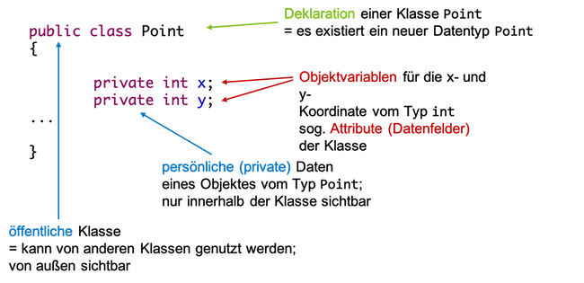

# Klassen und Objekte

Wir haben bereits grob die Begriffe *Klassen*  und *Objekte* kennengelernt. Nun wollen wir das Verständnis dafür vertiefen. Dazu erstellen wir uns unsere erste "richtige" eigene Klasse.


### Ein erster eigener Datentyp `Adresse`

Wir erstellen uns ein neues BlueJ-Projekt und nennen es `adresse`. Darin erstellen wir eine neue Klasse `Adresse`. Wir löschen alles aus dieser Klasse, so dass nur 

=== "Adresse.java"
	```java linenums="1"
	public class Adresse
	{

	}
	```

übrig bleibt. Von dieser Klasse erzeugen wir uns eine Testklasse - BlueJ nennt sie `AdresseTest`. Ein Doppelklick auf das grüne Rechteck der Testklasse öffnet den Editor und zeigt


=== "AdresseTest.java"
	```java linenums="1"
	public class Adresse
	{
		import static org.junit.jupiter.api.Assertions.*;
		import org.junit.jupiter.api.AfterEach;
		import org.junit.jupiter.api.BeforeEach;
		import org.junit.jupiter.api.Test;

		/**
		 * The test class AdresseTest.
		 *
		 * @author  (your name)
		 * @version (a version number or a date)
		 */
		public class AdresseTest
		{
		    /**
		     * Default constructor for test class AdresseTest
		     */
		    public AdresseTest()
		    {
		    }

		    /**
		     * Sets up the test fixture.
		     *
		     * Called before every test case method.
		     */
		    @BeforeEach
		    public void setUp()
		    {
		    }

		    /**
		     * Tears down the test fixture.
		     *
		     * Called after every test case method.
		     */
		    @AfterEach
		    public void tearDown()
		    {
		    }
		}
	}
	```

In diese Testklasse fügen wir eine Methode `testAdresse()` wie folgt hinzu:

=== "AdresseTest.java"
	```java linenums="1" hl_lines="21-25"
	import static org.junit.jupiter.api.Assertions.*;
	import org.junit.jupiter.api.AfterEach;
	import org.junit.jupiter.api.BeforeEach;
	import org.junit.jupiter.api.Test;

	/**
	 * The test class AdresseTest.
	 *
	 * @author  (your name)
	 * @version (a version number or a date)
	 */
	public class AdresseTest
	{
	    /**
	     * Default constructor for test class AdresseTest
	     */
	    public AdresseTest()
	    {
	    }

	    @Test
	    public void testAdresse()
	    {
	        Adresse adresse1;
	    }

	    /**
	     * Sets up the test fixture.
	     *
	     * Called before every test case method.
	     */
	    @BeforeEach
	    public void setUp()
	    {
	    }

	    /**
	     * Tears down the test fixture.
	     *
	     * Called after every test case method.
	     */
	    @AfterEach
	    public void tearDown()
	    {
	    }
	}
	```

Wir wollen uns zunächst um diese Testklasse nicht weiter kümmern und ignorieren auch zunächst den gesamten Rest. Um Platz zu sparen, zeigen wir von nun an immer nur noch die `testAdresse()`-Methode. In dieser Methode sehen wir aber bereits die Deklaration einer Variablen `adresse1` vom Typ `Adresse`. Das bedeutet, dass unser neuer Datentyp `Adresse` bereits zur Verfügung steht und wir ihn verwenden können. Wir haben unseren ersten eigenen Datentyp erstellt!

#### Eigenschaften definieren

Unser Datentyp `Adresse` hat noch keine Eigenschaften. Als erstes definieren wir uns **Objektvariablen** für unsere Klasse:

=== "Adresse.java"
	```java linenums="1"
	public class Adresse
	{
		// --- Objektvariablen -----
		public String strasse;
		public int nummer;
		public int postleitzahl;
		public String wohnort;
		
	}
	```

Die *Struktur* aller Objekte unserer Klasse sieht also wie folgt aus. **Jedes Objekt** vom Typ `Adresse` hat 

- **eine eigene** Variable `strasse` (vom Typ `String`),
- **eine eigene** Variable `nummer` (vom Typ `int`),
- **eine eigene** Variable `postleitzahl` (vom Typ `int`),
- **eine eigene** Variable `wohnort` (vom Typ `String`).

#### Objektvariablen sind global!

Bis jetzt hatten wir unsere Variablen immer *lokal* in einer Methode deklariert. Diese Variablen waren nur in der Methode sichtbar und existierten auch nur in der Methode, in der sie deklariert wurden. Siehe dazu [Sichtbarkeit und Lebensdauer von lokalen Variablen](../methodenstack/#lebensdauer-und-sichtbarkeit-von-lokalen-variablen). 

Objektvariablen sind in der **Klasse** deklariert, nicht in einer Methode - sie sind *global*. Objektvariablen sind deshalb in der gesamten Klasse sichtbar, d.h. es kann in der gesamten Klasse daruf zugegriffen werden (in jeder Methode der Klasse). Objektvariablen existieren für ein konkretes Objekt. Jedes Objekt hat seine eigenen Objektvariablen. Diese existieren für das Objekt also so lange, solange das Objekt existiert. 

> Objektvariablen sind *global* und sind in allen Methoden der Klasse sichtbar, d.h. es kann in allen Methoden der Klasse auf die Objektvariablen zugegriffen werden.

#### Objektmethode hinzufügen

Jetzt wollen wir auch noch ein *Verhalten* implementieren und definieren uns dazu eine **Objektmethode**:

=== "Adresse.java"
	```java linenums="1"
	public class Adresse
	{
		// --- Objektvariablen -----
		public String strasse;
		public int nummer;
		public int postleitzahl;
		public String wohnort;
	
		// --- Objektmethoden ------
		public String getAdresse()
		{
			return strasse + " " + nummer + " in " + postleitzahl + " " + wohnort;
		}		
	}
	```


#### Objekte erzeugen - der Konstruktor

Wir haben jetzt einen "Bauplan" für alle Objekte vom Datentyp `Adresse` erzeugt. Nun wollen wir nach diesem Bauplan Objekte von der Klasse (vom Datentyp) `Adresse` erzeugen. Das geschieht mithilfe des *Konstruktors*.

> der Konstruktor einer Klasse heißt genau wie die Klasse selbst, ist aber eine Methode (z.B. `Adresse()`)

Um ein Objekt der Klasse zu erzeugen, verwenden wir das Schlüsselwort `new` und rufen dann den Konstruktor der Klasse auf:

> `new Klassenname();` 


Wir erzeugen in der `testAdresse()`-Methode der `Testklasse` zwei Objekte der Klasse `Adresse`:

=== "AdresseTest.java"
	```java linenums="21"
	@Test
    public void testAdresse()
    {
        Adresse adresse1 = new Adresse();
        Adresse adresse2 = new Adresse();
    }
	```


Das generelle Vorgehen bei der Erzeugung eines Objektes zeigt die folgende Abbildung:


Wir haben nun zwei Objekte vom Typ `Adresse` erstellt. Die *Referenzvariable* `adresse1` zeigt auf das erste Objekt (Sie können auch sagen, dass `adresse1` der Name des ersten Objektes ist) und die Referenzvariable `adresse2` zeigt auf das zweite Objekt. **Jedes** dieser beiden Objekte hat seine eigenen Objektvariablen `strasse`, `nummer`, `postleitzahl` und `wohnort` und seine eigene Objektmethode `getAdresse()`. Wir werden jetzt auf diese Eigenschaften zugreifen.

#### Zugriff auf Objekteigenschaften - Punktnotation

Auf die Eigenschaften eines Objektes können wir über die Referenzvariable mittels *Punktnotation* zugreifen. Die Syntax ist also wie folgt:

> `referenzVariable.eigenschaft` 

Wir verwenden die Punktnotation für unsere Objekte vom Typ `Adresse`, um ihnen Werte für die Objektvariablen zuzuweisen und jeweils auf die Objektmethode zuzugreifen:

=== "AdresseTest.java"
	```java linenums="21"
	@Test
    public void testAdresse()
    {
        Adresse adresse1 = new Adresse();
        Adresse adresse2 = new Adresse();

		adresse1.strasse = "Wilhelminenhofstr.";
		adresse1.nummer = 75;
		adresse1.postleitzahl = 12459;
		adresse1.wohnort = "Berlin";
		
		adresse2.strasse = "Treskowallee";
		adresse2.nummer = 8;
		adresse2.postleitzahl = 10318;
		adresse2.wohnort = "Berlin";
		
		System.out.println(adresse1.getAdresse());
		System.out.println(adresse2.getAdresse());
    }
	```

Wir weisen also den jeweiligen Objektvariablen der beiden Objekte Werte zu und geben diese jeweils mithilfe der `getAdresse()`-Methode aus. Es ist ganz wichtig, zu verstehen, dass jedes Objekt seine eigenen Objektvariablen und seine eigenen Objektmethoden hat. Zugriff auf diese Variablen und Methoden gibt es stets nur über ein Objekt!

Die Ausgabe für obiges Beispiel sieht so aus:

```bash
Wilhelminenhofstr. 75 in 12459 Berlin
Treskowallee 8 in 10318 Berlin
```

Alle Objekte werden also nach dem gleichen "Bauplan" erstellt. Alle Objekte vom Typ `Adresse` haben die Eigenschaften:

- `strasse`, 
- `nummer`, 
- `postleitzahl`,  
- `wohnort` und 
- `getAdresse()`

Wenn wir die Klasse `Adresse` ändern, dann ändern sich auch die Eigenschaften entsprechend für **alle** Objekte dieser Klasse. 

#### Datenkapselung (Information Hiding) - das Schlüsselwort `private`

Ein wesentlicher Grundsatz der objektorientierten Programmierung ist das Prinzip der *Datenkapselung* (auch *data hiding* oder *information hiding* genannt). Dieses Prinzip dient dem Datenschutz. Wir wollen vermeiden, dass

- Unbefugte die Struktur (die Daten) unserer Objekte kennen und
- Unbefugte die Daten ändern können, ohne dass wir es erlauben. 

Angenommen, Sie haben eine Klasse `Konto` und es wäre möglich, ganz einfach auf ihre `pin` zuzugreifen. Das wäre fatal. Bereits der lesende Zugriff darauf könnte schädlich sein, aber genau so ärgerlich wäre es, wenn die `pin` einfach durch Fremde geändert werden könnte. Wir wollen deshalb sowohl den lesenden als auch den schreibenden Zugriff auf unsere Daten (auf unsere Objektvariablen) verbieten. Dazu deklarieren wir unsere Objektvariablen als `private`:

=== "Adresse.java"
	```java linenums="1"
	public class Adresse
	{
		// --- Objektvariablen -----
		private String strasse;			// Zugriff nur innerhalb der Klasse
		private int nummer;				// Zugriff nur innerhalb der Klasse
		private int postleitzahl;		// Zugriff nur innerhalb der Klasse
		private String wohnort;			// Zugriff nur innerhalb der Klasse
	
		// --- Objektmethoden ------
		public String getAdresse()
		{
			return strasse + " " + nummer + " in " + postleitzahl + " " + wohnort;
		}		
	}
	```

Wir haben die *Sichtbarkeit* der Objektvariablen in unserer Klasse geändert. Vorher waren die Objektvariablen als `public` deklariert. Das führte dazu, dass sie von allen anderen Klassen gelesen und geschrieben werden konnten (z.B. von unserer Testklasse `AdresseTest`). Indem wir die Variablen als `private` deklarieren, ist der Zugriff darauf außerhalb unserer Klasse nicht mehr möglich. 

Wenn wir uns jetzt unsere Testklasse `AdresseTest` anschauen, dann sehen wir Fehler:


Die `Testklasse` lässt sich nun nicht mehr compilieren und ausführen. Auch lesende Zugriffe, z.B. `System.out.println(adresse1.wohnort);` sind nicht mehr möglich. Beachten Sie aber, dass wir weiterhin die Methode `getAdresse()` aufrufen können. Sie ist als `public` deklariert und deshalb in anderen Klassen durch `Adresse`-Objekte ausführbar. Wir könnten auch die Methode als `private` deklarieren, dann würde auch sie nicht mehr ausführbar in anderen Klassen sein. 

> Auf eine als `private` deklarierte Variable kann außerhalb der Klasse, in der sie deklariert ist, nicht zugegriffen werden.

> Eine als `private` deklarierte Methode kann außerhalb der Klasse, in der sie definiert ist, nicht ausgeführt (aufgerufen) werden. 

Wie können wir unseren Objektvariablen aber nun Werte zuweisen? Dafür gibt es zwei Antworten

1. durch einen parametrisierten Konstruktor und
2. durch sogenannte *Getter*

Wir betrachten zunächst den parametrisierten Konstruktor. 

#### Ein eigener Konstruktor

Wir haben einen *Konstruktor* bereits kennengelernt. Ein Konstruktor ist eine Methode, die genau wie die Klasse heißt (also auch großgeschrieben) und mit runden Klammern. Wir haben den Konstruktor auch bereits verwendet, nämlich zur Erzeugung von Objekten (genau dafür ist er auch da). Betrachten wir nochmal die beiden Aufrufe:

```java
Adresse adresse1 = new Adresse();	// Aufruf des Standardkonstruktors
Adresse adresse2 = new Adresse();	// Aufruf des Standardkonstruktors
```

Wir konnten die Objekte vom Typ `Adresse` mithilfe des Konstrutors `Adresse()` erzeugen. Dies ist ein sogenannter *Standardkonstruktor*, denn er existiert automatisch für jede neue Klasse (für jeden Datentyp), die wir erstellen. Jetzt wollen wir aber einen eigenen Konstruktor definieren, den wir in Zukunft zur Erzeugung unserer `Adresse`-Objekte verwenden wollen. In unserem neuen Konstruktor wollen wir nämlich bereits Werte als Parameter übergeben, die für die Initialisierung der Objektvariablen verwendet werden sollen. Wir erweitern unsere Klasse `Adresse` um einen solchen Konstruktor:

=== "Adresse.java"
	```java linenums="1"
	public class Adresse
	{
		// --- Objektvariablen -----
		private String strasse;			// Zugriff nur innerhalb der Klasse
		private int nummer;				// Zugriff nur innerhalb der Klasse
		private int postleitzahl;		// Zugriff nur innerhalb der Klasse
		private String wohnort;			// Zugriff nur innerhalb der Klasse
		
		// --- Konstruktor ---------
		public Adresse(String str, int nr, int plz, String ort)
		{
			strasse = str;
			nummer = nr;
			postleitzahl = plz;
			wohnort = ort;
		}

		// --- Objektmethoden ------
		public String getAdresse()
		{
			return strasse + " " + nummer + " in " + postleitzahl + " " + wohnort;
		}		
	}
	```

In den Zeilen `10-16` haben wir einen solchen Konstruktor hinzugefügt. Wir übergeben dem Konstruktor vier Parameterwerte. Diese Werte werden verwendet, um unsere Objektvariablen zu initialisieren. Der Konstruktor wird aufgerufen, um ein neues Objekt zu erzeugen. Wir verwenden ihn hinter dem Schlüsselwort `new`. 

Bei der Definition eines solchen Konstruktors sind zwei Dinge zu beachten: 

1. Der Konstruktor heißt exakt wie die Klasse (also auch Großschreibung beachten).
2. Der Konstruktor hat **keinen** Rückgabetyp (auch nicht `void`).

Die Aufgabe eines Konstruktors ist einzig und allein Objekte der Klasse zu erzeugen. Die "Rückgabe" eines solchen Konstruktors ist also ein Objekt der Klasse. Theoretisch wäre der Rückhgabetyp hier also `Adresse`. Aber wie gesagt, bei der Definition eines Konstruktors gibt man keinen Rückgabetyp an!

Wenn wir uns nun erneut die Testklasse `AdresseTest` anschauen, dann sind durch die Definition eines eigenen Konstruktors weitere Fehler hinzugekommen:


Dadurch, dass wir einen eigenen Konstruktor geschrieben haben, existiert der Standardkonstruktor `Adresse()` nicht mehr. Wir müssen (und wollen ja auch) nun unseren eigenen Konstruktor verwenden, um Objekte zu erzeugen. Wir passen die Testklasse `AdresseTest` entsprechend an:

=== "AdresseTest.java"
	```java linenums="1" hl_lines="4-5"
	@Test
    public void testAdresse()
    {
		Adresse adresse1 = new Adresse("Wilhelminenhofstr.", 75, 12459, "Berlin");			
		Adresse adresse2 = new Adresse("Treskowallee", 8, 10318, "Berlin");			
		
		System.out.println(adresse1.getAdresse());
		System.out.println(adresse2.getAdresse());
    }
	```

In den Zeilen `4` und `5` verwenden wir nun den eigenen Konstruktor und übergeben die Werte für die Objektvariablen als Parameter. Bei der Erzeugung der Objekte werden die Objektvariablen nun gleich initialisiert. Der direkte Zugriff auf die Objektvariablen wurde entfernt, da dieser aufgrund der `private`-Deklaration nicht mehr möglich ist. Die Ausgaben in Zeilen `7` und `8` zeigen aber, dass die Objekte die entsprechenden Werte enthalten:

```bash
Wilhelminenhofstr. 75 in 12459 Berlin
Treskowallee 8 in 10318 Berlin
```

Die Objekte erhalten somit gleich bei der Erzeugung alle Werte für die Objektvariablen und es ist nun auch nicht mehr möglich, diese Werte zu ändern. Ein direkter Zugriff auf die Objektvariablen ist nicht möglich. Die einzigen Wertzuweisungen finden im Konstruktor statt. Objekte, deren Werte nicht mehr geändert werden können, heißen *immutable objects* (*unveränderliche Objekte*). Sehr häufig ist es wünschenswert, dass Objekte *immutable* sind - das vermeidet Fehler. Wir kommen (sehr viel später) nochmal darauf zu sprechen. 

Die einzige Schnittstelle (also die Möglichkeiten anderer Klassen unseren neuen Datentyp `Adresse` zu nutzen) unserer Klasse besteht nun aus zwei Methoden: dem Konstruktor zum Erzeugen eines Objektes und der Methode `getAdresse()`. Wenn wir aber z.B. nur den `wohnort` wissen wollen, dann ist es derzeit noch nicht möglich. Wir wollen deshalb den **lesenden** Zugriff auf unsere Objektvariablen erlauben und definieren uns dafür sogenannte *Getter*.


#### `getXXX()`-Methoden - Getter

Da die Objektvariablen alle als `private` deklariert sind, ist außerhalb der Klasse `Adresse` kein Zugriff auf diese Variablen möglich. Wir können ihnen weder Werte zuweisen, noch deren Werte auslesen. Wir haben bereits gesagt, dass dies ein Feature der objektorientierten Programmierung ist, ein solches *information hiding* einfach durchführen zu können. 

Wir können jetzt steuern, ob und wie der Zugriff doch möglich sein soll. Wenn man bspw. den lesenden Zugriff erlauben möchte, dann definiert man sich innerhalb der Klasse sogenannte `get`-Methoden (*Getter*). Eine solche `get`-methode gibt den Wert einer Objektvariablen zurück. Es wird somit ein *lesender* Zugriff auf den Wert der Variablen ermöglicht. Für unsere Klasse schreiben wir uns nun für jede Objektvariable einen eigenen Getter:

- `getWohnort()` gibt den Wert von `wohnort` zurück, ist also vom Rückgabetyp `String`
- `getPostleitzahl()` gibt den Wert von `postleitzahl` zurück, ist also vom Rückgabetyp `int`
- `getStrasse()` gibt den Wert von `strasse` zurück, ist also vom Rückgabetyp `String`
- `getNummer()` gibt den Wert von `nummer` zurück, ist also vom Rückgabetyp `int`

Unsere Klasse `Adresse` sieht nun wie folgt aus:

=== "Adresse.java"
	```java linenums="1"
	public class Adresse
	{
		// --- Objektvariablen -----
		private String strasse;
		private int nummer;
		private int postleitzahl;
		private String wohnort;
		
		// --- Konstruktor ---------
		public Adresse(String str, int nr, int plz, String ort)
		{
			strasse = str;
			nummer = nr;
			postleitzahl = plz;
			wohnort = ort;
		}
		
		// --- Objektmethoden ------
		public String getAdresse()
		{
			return strasse + " " + nummer + " in " + postleitzahl + " " + wohnort;
		}
		
		public String getStrasse()
		{
			return strasse;
		}
		
		public int getNummer()
		{
			return nummer;
		}
		
		public int getPostleitzahl()
		{
			return postleitzahl;
		}
		
		public String getWohnort()
		{
			return wohnort;
		}
	}
	```

Unsere Schnittstelle hat sich also erweitert. Es sind jetzt auch mehr Methoden unserer Klasse `Adresse` nutzbar. Wir probieren die Methoden in unserer Testklasse `AdresseTest` aus:

=== "AdresseTest.java"
	```java linenums="1" hl_lines="10-11 13-14"
	@Test
    public void testAdresse()
    {
		Adresse adresse1 = new Adresse("Wilhelminenhofstr.", 75, 12459, "Berlin");			
		Adresse adresse2 = new Adresse("Treskowallee", 8, 10318, "Berlin");			
		
		System.out.println(adresse1.getAdresse());
		System.out.println(adresse2.getAdresse());
		
		System.out.println("Strasse Nr  : " + adresse1.getStrasse() + " " +  adresse1.getNummer());
		System.out.println("PLZ Wohnort : " + adresse1.getPostleitzahl() + " " + adresse1.getWohnort());
		
		System.out.println("Strasse Nr  : " + adresse2.getStrasse() + " " +  adresse1.getNummer());
		System.out.println("PLZ Wohnort : " + adresse2.getPostleitzahl() + " " +  adresse1.getWohnort());
    }
	```

Beachten Sie, dass der Aufruf unserer `get`-Methoden auch wieder nur für konkrete Objekte erfolgen kann, hier also für `adresse1` und `adresse2`. Wir greifen also wieder mittels Punktnotation auf diese Methoden zu. Wir sehen, dass wir nun mithilfe der Getter lesenden Zugriff auf die Objektvariablen haben - in der Testklasse `AdresseTest` können also die einzelnen Werte der Objektvariablen der jeweiligen `Adresse`-Objekte ausgelesen werden. 

!!! success
	Wir haben unseren ersten eigenen Datentyp erstellt! Wir haben dazu eine Klasse geschrieben. Die Klasse enthält Objektvariablen und Objektmethoden. Wir haben mithilfe des Schlüsselwortes `new` und dem Aufruf eines Konstruktors Objekte dieser Klasse erzeugt. Über die Punktnotation können wir auf die Objektmethoden zugreifen und diese ausführen. Wir haben außerdem das Schlüsselwort `private` kennengelernt. Auf Objektvariablen und Objektmethoden, die als `private` deklariert sind, kann außerhalb der Klasse nicht zugegriffen werden. Um doch einen lesenden Zugriff auf die Werte der Objektvariablen zu ermöglichen, haben wir Getter definiert. 

--- 


Wir wollen jetzt das Neuerlernte an weiteren Beispielen festigen.

### Eine weiterer Datentyp `Point`

Angenommen, wir wollen in einem kartesischen Koordinatensystem einen Punkt beschreiben, also soetwas wie in der folgenden Abbildung:


Um uns eine eigene Klasse für `Point` zu schreiben, überlegen wir uns zunächst, was die allgemeine Struktur eines solchen Punktes ist. Das ist recht leicht aus der oberen Abbildung zu erkennen: ein Punkt wird durch zwei `int`-Werte `x` und `y` beschrieben. Dieses werden also unsere Objektvariablen:

=== "Point.java"
	```java linenums="1"
	public class Point
	{
		// --- Objektvariablen -----
		private int x;
		private int y;
	}
	```

Wir setzen die Objektvariablen nun gleich auf `private`. Wenn keine zwingenden Gründe dagegen sprechen (und das ist fast nie der Fall), deklarieren wir unsere Objektvariablen stets als `private`, um dem Prinzip des *information hiding* zu entsprechen. Hier nochmal eine Übersicht der bisherigen Begriffe und Bedeutungen:



Wir erstellen uns auch gleich einen parametrisierten Konstruktor, um den Objektvariablen bereits beim Erzeugen der Objekte ihre Werte zuzuweisen:

=== "Point.java"
	```java linenums="1"
	public class Point
	{
		// --- Objektvariablen -----
		private int x;
		private int y;

		// --- Konstruktor ---------
		public Point(int px, int py)
		{
			x = px;
			y = py;
		}
	}
	```

Wie wir bereits wissen, heißt der Konstruktor exakt wie die Klasse und hat keinen Rückgabetyp (auch nicht `void`). Achten Sie darauf, dass die Parameter (derzeit noch) anders heißen, als die Objektvariablen. Wir haben ansonsten innerhalb des Konstruktors einen Namenskonflikt. Diesen werden wir auflösen, wenn wir das Schlüsselwort `this` kennenlernen. 

In unserer Testklasse (Testklasse `PointTest` erzeugen und Testmethode `testPoint()` anlegen) können wir uns nun einige `Point`-Objekte erzeugen:


=== "PointTest.java"
	```java linenums="1"
	@Test
    public void testPoint()
    {
		Point p1 = new Point(1, 2);
		Point p2 = new Point(2, 4);
		Point p3 = new Point(4, 6);
		Point p4 = new Point(5, 3);
    }
	```


Wir erstellen uns also vier `Point`-Objekte. Die Variablen `p1`, `p2`, `p3` und `p4` referenzieren jeweils ein `Point`-Objekt und sind vom Typ `Point`. Wir können uns die vier Objekte wie folgt veranschaulichen:


Jedes `Point`-Objekt hat also seine eigenen Objektvariablen mit den dazugehörigen Werten.  

#### Getter und eine `print()`-Methode für `Point`

Wir wollen jetzt, dass außerhalb der Klasse die Werte von `x` und `y` ausgelesen werden können. Dazu definieren wir uns Getter, also eine `getX()`- und eine `getY()`-Methode. Außerdem wollen wir eine `print()`-Methode zur Klasse `Point` hinzufügen, um die Werte von `x` und `y` auf die Konsole auszugeben. Die Klasse `Point` sieht nun so aus:

=== "Point.java"
	```java linenums="1"
	public class Point
	{
		// --- Objektvariablen -----------
		private int x;
		private int y;
		
		// --- Konstruktor ---------------
		public Point(int px, int py)
		{
			x = px;
			y = py;
		}
		
		// --- Getter --------------------
		public int getX()
		{
			return x;
		}
		
		public int getY()
		{
			return y;
		}
		
		// --- weitere Objektmethoden ----
		public void print()
		{
			System.out.println("[ x=" + x + ", y=" + y + " ]");
		}
	}
	```

Wir testen die neuerstellten Objektmethoden in unserer Testklasse `PointTest`:


=== "PointTest.java"
	```java linenums="1"
	@Test
    public void testPoint()
    {
		Point p1 = new Point(1, 2);
		Point p2 = new Point(2, 4);
		Point p3 = new Point(4, 6);
		Point p4 = new Point(5, 3);
		
		System.out.println(" p1 : ( " + p1.getX() + ", " + p1.getY() + " )");
		System.out.println(" p2 : ( " + p2.getX() + ", " + p2.getY() + " )");
		System.out.println(" p3 : ( " + p3.getX() + ", " + p3.getY() + " )");	
		System.out.println(" p4 : ( " + p4.getX() + ", " + p4.getY() + " )");
		
		p1.print();
		p2.print();
		p3.print();
		p4.print();
    }
	```

Wir greifen also wieder über die jeweilige Referenzvariable `p1`, `p2`, `p3` bzw. `p4` über Punktnotation auf die Objektmethoden zu. Beachten Sie, dass - genau wie für die Objektvariablen - auch bei den Objektmethoden jedes Objekt "seine eigene" Objektmethode hat. `p1.getX()` gibt also genau den `x`-Wert des Objektes aus, auf das `p1` zeigt (`1`) und `p2.getX()` gibt also genau den `x`-Wert des Objektes aus, auf das `p2` zeigt (`2`). Die `print()`-Methode gibt genau die `x`- und `y`-Werte des Objektes aus, das die `print()`-Methode aufgerufen hat. Unsere vier Objekte können wir uns nun also so veranschaulichen:


Die Ausgabe sieht so aus:

```bash
 p1 : ( 1, 2 )
 p2 : ( 2, 4 )
 p3 : ( 4, 6 )
 p4 : ( 5, 3 )
[ x=1, y=2 ]
[ x=2, y=4 ]
[ x=4, y=6 ]
[ x=5, y=3 ]
```

Wir erstellen eine weitere Objektmethode für die Klasse `Point`, um einen Punkt zu verschieben. 

#### Objektmethode `translate()` für `Point`

Wir wollen einen Punkt um ein `deltaX` nach links oder rechts und um ein `deltaY` nach oben oder unten verschieben:


Angenommen, unser Punkt ist, wie in der obigen Abbildung gezeigt, bei `x=1` und `y=2` und er soll um `deltaX=4` nach rechts und um `deltaY=3` nach oben verschoben werden, dann ist er nach `translate(4,3)` bei `x=5` und `y=5`. Wir implementieren die Objektmethode in der Klasse `Point` wie folgt:

```java
	public void translate(int deltaX, int deltaY)
	{
		x = x + deltaX;
		y = y + deltaY;
	}
```

Beachten Sie, dass der Rückgabetyp `void` ist. Das hatten wir bisher immer nur bei Methoden, in denen eine Ausgabe auf die Konsole erfolgte. Bei Objektmethoden wird dies nun häufig vorkommen. In der Methode `translate()` werden die Werte von den Objektvariablen `x` und `y` neu gesetzt. Sie ergeben sich hier aus den alten Werten von `x` und `y` und der Addition mit `deltaX` bzw. `deltaY`. Beachten Sie auch, dass die Werte von `deltaX` und `deltaY` negativ sein können. Dann wird der Punkt nach links bzw. nach unten verschoben. Im Ergebnis der Ausführung der Methode `translate()` haben die Objektvariablen des Objektes, das diese Methode aufgerufen hat, neue Werte. Wir testen das in unserer Testklasse `PointTest`:


=== "PointTest.java"
	```java linenums="1"
	@Test
    public void testPoint()
    {
		/* hier gekuerzt - siehe oben 						*/
		/* die Erzeugung der Objekte muss bleiben 			*/
		/* Testen der Getter und print() kann auch bleiben 	*/ 

		p1.print();				// [ x=1, y=2 ]
		p1.translate(4, 3);
		p1.print();				// [ x=5, y=5 ]
		
		p4.print();				// [ x=5, y=3 ]
		p4.translate(-3, -1);
		p4.print(); 			// [ x=2, y=2 ]
    }
	```


#### Vergleiche mit anderen Objekten gleichen Typs

Angenommen, ein Punkt möchte "wissen", ob er selbst weiter links positioniert ist, als ein anderer Punkt. Dann muss er seinen eigenen `x`-Wert mit dem `x`-Wert des anderen Punktes vergleichen. Wenn wir dafür eine Objektmethode schreiben wollen, dann müssen wir den anderen Punkt als Parameter übergeben. Das ist kein Problem:

```java
	public boolean isLeft(Point otherPoint)
	{
		return (x < otherPoint.x);
	}
```

Wir übergeben der Objektmethode ein Objekt vom Typ `Point`. Wir wissen, dass jedes `Point`-Objekt folgende Eigenschaften hat:

- `x`, 
- `y`, 
- `getX()`, 
- `getY()`,
- `print()` und 
- `translate()` 

Auf diese Eigenschaften können wir natürlich auch innerhalb der Klasse über die Punktnotation zugreifen. Hierbei ist anzumerken, dass wir innerhalb der Klasse auch direkt auf die `x`- und `y`-variablen zugreifen können. Der Sichtbarkeitsmodifizierer `private` besagt nur, dass wir **nicht außerhalb** der Klasse auf die Objektvariablen zugreifen können. Innerhalb der Klasse ist der direkte Zugriff erlaubt! Wir hätten aber auch über die `getX()`-Methode den Wert von `x` von `otherPoint` auslesen können. 

Wir erweitern um die Methoden `isRight()`, `isAbove()`, `isBelow()`. Die gesamte Klasse `Point` sieht dann so aus:

=== "Point.java"
	```java linenums="1"
	public class Point
	{
		// --- Objektvariablen -----------
		private int x;
		private int y;
		
		// --- Konstruktor ---------------
		public Point(int px, int py)
		{
			x = px;
			y = py;
		}
		
		// --- Getter --------------------
		public int getX()
		{
			return x;
		}
		
		public int getY()
		{
			return y;
		}
		
		// --- weitere Objektmethoden ----
		public void print()
		{
			System.out.println("[ x=" + x + ", y=" + y + " ]");
		}
		
		public void translate(int deltaX, int deltaY)
		{
			x = x + deltaX;
			y = y + deltaY;
		}
		
		public boolean isLeft(Point otherPoint)
		{
			return (x < otherPoint.x);
		}
		
		public boolean isRight(Point otherPoint)
		{
			return (x > otherPoint.x);
		}
		
		public boolean isAbove(Point otherPoint)
		{
			return (y > otherPoint.y);
		}
		
		public boolean isBelow(Point otherPoint)
		{
			return (y < otherPoint.y);
		}
	}
	```

Wir testen die Methoden in unserer Testklasse:


=== "PointTest.java"
	```java linenums="1" hl_lines="27-30"
	@Test
    public void testPoint()
    {
		Point p1 = new Point(1, 2);
		Point p2 = new Point(2, 4);
		Point p3 = new Point(4, 6);
		Point p4 = new Point(5, 3);
		
		System.out.println(" p1 : ( " + p1.getX() + ", " + p1.getY() + " )");
		System.out.println(" p2 : ( " + p2.getX() + ", " + p2.getY() + " )");
		System.out.println(" p3 : ( " + p3.getX() + ", " + p3.getY() + " )");	
		System.out.println(" p4 : ( " + p4.getX() + ", " + p4.getY() + " )");
		
		p1.print();
		p2.print();
		p3.print();
		p4.print();
		
		p1.print();				// [ x=1, y=2 ]
		p1.translate(4, 3);
		p1.print();				// [ x=5, y=5 ]
		
		p4.print();				// [ x=5, y=3 ]
		p4.translate(-3, -1);
		p4.print(); 			// [ x=2, y=2 ]
		
		System.out.println("p1 links  von p2 ? " + p1.isLeft(p2));		// p1.x=5 > p2.x=2
		System.out.println("p1 rechts von p2 ? " + p1.isRight(p2));
		System.out.println("p3 ueber p4 ? " + p3.isAbove(p4));			// p3.y=6 > p4.y=2
		System.out.println("p3 unter p4 ? " + p3.isBelow(p4));
    }
	```

Beachten Sie, dass es immer ein Objekt gibt, das die Methode aufruft und ein Objekt, das der Methode als Parameter übergeben wird. Beispielsweise ist bei `p1.isLeft(p2)` das `Point`-Objekt `p1` das aufrufende Objekt und das `Point`-Objekt `p2` das Objekt, das der Methode als Parameter"wert" übergeben wird. `p1` vergleicht sich also selbst mit `p2`. Da der `x`-Wert von `p1` `5` ist und der `x`-Wert von `p2` ist `2` ergibt `p1.isLeft(p2)` `false`. Der Aufruf `p2.isLeft(p1)` würde dann `true` ergeben. 

!!! success
	Wir haben einen weiteren Datentyp erstellt, nämlich `Point`. In diesem beispiel gibt es eine Methode `translate()`, in der die Werte der Objektvariablen `x` und `y` geändert werden. Objekte vom Typ `Point` sind somit nicht *immutable* (unveränderlich). Der Rückgabetyp solcher Objektmethoden, die die Werte von Objektvariablen ändern, ist typischerweise `void`. Wir haben außerdem Objektmethoden definiert, in denen sich das aufrufende Objekt mit einem anderen Objekt gleichen Typs vergleicht. Der Vergleich erfolgt über die Werte der Objektvariablen sowohl des aufrufenden Objektes, als auch der Werte der Objektvariablen des Objektes, mit dem verglichen wird (das als Parameter übergeben wird). 

---

Wir festigen unserer neuen Erkenntnisse an noch einem weiteren Beispiel:

### Ein weiterer Datentyp `Circle`

Wir erstellen uns einen Datentyp, der einen Kreis repräsentiert. Wir nennen den Datentyp `Circle`. Ein Kreis ist durch seinen `radius` eindeutig beschrieben. Wir könnten als Objektvariable auch den Durchmesser `diameter` wählen, das bleibt sich gleich und ist eine eigene Programmierentscheidung. Wir sollten aber keinesfalls `radius` **und** `diameter` als Objekteigenschaften wählen, da es ansonsten zu Inkonsistenten kommen könnte - angenommen, `radius` hätte den Wert `5` und `diameter` den Wert `11`, das wäre inkonsistent und würde nicht passen. Vielmehr kann der Durchmesser aus dem Radius berechnet werden. Wir implementieren also:


=== "Circle.java"
	```java linenums="1"
	public class Circle
	{
		// ------- Objektvariable ---------------
		private double radius;
		
		// --------- Konstruktor ----------------
		public Circle(double pRadius)
		{
			radius = pRadius;
		}
		
		// ----- Getter der Objektvariablen -----
		public double getRadius()
		{
			return radius;
		}
		
		// ----- weitere Objektmethoden ---------
		public double getDiameter()
		{
			return 2.0 * radius;
		}
		
		public void print()
		{
			System.out.println("Radius      : " + radius);
			System.out.println("Durchmesser : " + getDiameter());	// Aufruf Objektmethode
		}
	}
	```

Die Objektvariable `radius` ist wieder als `private` deklariert - es gibt keinen Grund, dies nicht zu tun. Wir erlauben aber den lesenden Zugriff darauf durch die Erstellung der `getRadius()`-Methode, die `public` ist. Außerdem berechnen wir auch noch den Durchmesser und geben ihn mit der `getDiameter()`-Methode zurück. Beachten Sie, dass sowohl `radius` als auch `getDiameter()` vom Typ `double` sind. Damit wir die Werte auch ausgeben, haben wir eine `print()`-Methode erstellt. Beachten Sie, dass wir in der `print()`-Methode die Objektmethode `getDiameter()` aufrufen. 

Wir testen den Datentyp `Circle` in einer Testklasse `CircleTest`:

=== "CircleTest.java"
	```java linenums="1"
	@Test
    public void testCircle()
    {
		Circle c1 = new Circle(5.0);
		Circle c2 = new Circle(3.5);

		c1.print();
		System.out.println();
		c2.print();
    }
	```

Es werden folgende Ausgaben erzeugt:

```bash
Radius      : 5.0
Durchmesser : 10.0

Radius      : 3.5
Durchmesser : 7.0
```

Für einen Kreis können wir auch noch den Umfang `circumference()` und den Flächeninhalt `area()` berechnen und verwenden dazu die Konstante `PI` aus der `Math`-Klasse (siehe [Die Klasse `Math`](../hilfsklassen/#die-klasse-math)). Mit den Ergebnissen der `circumference()`- und der `area()`-Methode erweitern wir auch die Ausgabe in `print()`: 


=== "Circle.java"
	```java linenums="1" hl_lines="28-29 32-35 37-40"
	public class Circle
	{
		// ------- Objektvariable ---------------
		private double radius;
		
		// --------- Konstruktor ----------------
		public Circle(double pRadius)
		{
			radius = pRadius;
		}
		
		// ----- Getter der Objektvariablen -----
		public double getRadius()
		{
			return radius;
		}
		
		// ----- weitere Objektmethoden ---------
		public double getDiameter()
		{
			return 2.0 * radius;
		}
	
		public void print()
		{
			System.out.println("Radius         : " + radius);
			System.out.println("Durchmesser    : " + getDiameter());	// Aufruf Objektmethode
			System.out.println("Umfang 		   : " + circumference());	// Aufruf Objektmethode
			System.out.println("Flaecheninhalt : " + area());	// Aufruf Objektmethode
		}
		
		public double circumference()
		{
			return Math.PI * getDiameter();
		}
		
		public double area()
		{
			return Math.PI * radius * radius;
		}
	}
	```


Das erneute Ausführen der `Testklasse` (in der `Testklasse` nichts geändert, aber die `print()`-Methode wurde geändert) ergibt:

```bash
Radius         : 5.0
Durchmesser    : 10.0
Umfang         : 31.41592653589793
Flaecheninhalt : 78.53981633974483

Radius         : 3.5
Durchmesser    : 7.0
Umfang         : 21.991148575128552
Flaecheninhalt : 38.48451000647496
```

Zur Wiederholung und Festigung wollen wir auch hier zwei `Circle`-Objekte miteinander vergleichen. Auch hier gibt es immer ein aufrufendes `Circle`-Objekt und ein `Circle`-Objekt, das als Parameter übergeben wird. Wir schreiben drei Methoden, die jeweils ein `boolean` zurückgeben: `isSmaller()`, `isBigger()`, `isEqual()`:


=== "Circle.java"
	```java linenums="1" hl_lines="42-45 47-50 52-55"
	public class Circle
	{
		// ------- Objektvariable ---------------
		private double radius;
		
		// --------- Konstruktor ----------------
		public Circle(double pRadius)
		{
			radius = pRadius;
		}
		
		// ----- Getter der Objektvariablen -----
		public double getRadius()
		{
			return radius;
		}
		
		// ----- weitere Objektmethoden ---------
		public double getDiameter()
		{
			return 2.0 * radius;
		}
	
		public void print()
		{
			System.out.println("Radius         : " + radius);
			System.out.println("Durchmesser    : " + getDiameter());	// Aufruf Objektmethode
			System.out.println("Umfang 		   : " + circumference());	// Aufruf Objektmethode
			System.out.println("Flaecheninhalt : " + area());	// Aufruf Objektmethode
		}
		
		public double circumference()
		{
			return Math.PI * getDiameter();
		}
		
		public double area()
		{
			return Math.PI * radius * radius;
		}

		public boolean isSmaller(Circle c)
		{
			return (radius < c.radius);
		}
		
		public boolean isBigger(Circle c)
		{
			return (radius > c.radius);
		}
		
		public boolean isEqual(Circle c)
		{
			return !isSmaller(c) && !isBigger(c);
		}
	}
	```

In der `isEqual()`-Methode hätten wir natürlich auch `return radius==c.radius;` schreiben können. Aber wir wollten hier nochmal die Verwendung von Objektmethoden innerhalb der Klasse zeigen. Die Testklasse `CircleTest`

=== "CircleTest.java"
	```java linenums="1"
	@Test
    public void testCircle()
    {
		Circle c1 = new Circle(5.0);
		Circle c2 = new Circle(3.5);

		c1.print();
		System.out.println();
		c2.print();
    }
	```

erzeugt folgende Ausgaben (nur die Vergleiche):

```

bash
c1 groesser als c2 ? true
c1 kleiner als c2  ? false
c1 gleich c2       ? false

c2 groesser als c1 ? false
c2 kleiner als c1  ? true
c2 gleich c1       ? false

c1 groesser als c1 ? false
c1 kleiner als c1  ? false
c1 gleich c1       ? true
```

Beachten Sie, dass im dritten Vergleichsblock das `c1`-Objekt mit sich selbst verglichen wird. Auch das ist ohne Probleme möglich (aber normalerweise sinnlos).

!!! success
	Wir haben in diesem dritten Beispiel die ersten Erkenntnisse über das objektorientierte Programmieren wiederholt und gefestigt. In der Klasse `Circle` haben wir insbesondere häufiger die Objektmethoden innerhalb der Klasse aufgerufen. Die Einführung in die objektorientierte Programmierung ist hiermit zunächst beendet. Beim nächsten Mal werden wir mehrere Konstruktoren in der Klasse definieren, wir werden eigene Datentypen in neuen Datentypen verwenden und das Schlüsselwort `this` kennenlernen. Viel Spaß beim [Üben](https://www.youtube.com/watch?v=oHg5SJYRHA0)!

??? "Die Klassen `Adresse`, Point`, `Circle` und `Testklasse`"

	=== "Adresse.java"
		```java linenums="1"
		public class Adresse
		{
			// --- Objektvariablen -----
			private String strasse;
			private int nummer;
			private int postleitzahl;
			private String wohnort;
			
			// --- Konstruktor ---------
			public Adresse(String str, int nr, int plz, String ort)
			{
				strasse = str;
				nummer = nr;
				postleitzahl = plz;
				wohnort = ort;
			}
			
			// --- Objektmethoden ------
			public String getAdresse()
			{
				return strasse + " " + nummer + " in " + postleitzahl + " " + wohnort;
			}
			
			public String getStrasse()
			{
				return strasse;
			}
			
			public int getNummer()
			{
				return nummer;
			}
			
			public int getPostleitzahl()
			{
				return postleitzahl;
			}
			
			public String getWohnort()
			{
				return wohnort;
			}
		}
		```

	=== "Point.java"
		```java linenums="1"
		public class Point
		{
			// --- Objektvariablen -----------
			private int x;
			private int y;
			
			// --- Konstruktor ---------------
			public Point(int px, int py)
			{
				x = px;
				y = py;
			}
			
			// --- Getter --------------------
			public int getX()
			{
				return x;
			}
			
			public int getY()
			{
				return y;
			}
			
			// --- weitere Objektmethoden ----
			public void print()
			{
				System.out.println("[ x=" + x + ", y=" + y + " ]");
			}
			
			public void translate(int deltaX, int deltaY)
			{
				x = x + deltaX;
				y = y + deltaY;
			}
			
			public boolean isLeft(Point otherPoint)
			{
				return (x < otherPoint.x);
			}
			
			public boolean isRight(Point otherPoint)
			{
				return (x > otherPoint.x);
			}
			
			public boolean isAbove(Point otherPoint)
			{
				return (y > otherPoint.y);
			}
			
			public boolean isBelow(Point otherPoint)
			{
				return (y < otherPoint.y);
			}
		}
		```

	=== "Circle.java"
		```java linenums="1"
		public class Circle
		{
			// ------- Objektvariable ---------------
			private double radius;
			
			// --------- Konstruktor ----------------
			public Circle(double pRadius)
			{
				radius = pRadius;
			}
			
			// ----- Getter der Objektvariablen -----
			public double getRadius()
			{
				return radius;
			}
			
			// ----- weitere Objektmethoden ---------
			public double getDiameter()
			{
				return 2.0 * radius;
			}
			
			public void print()
			{
				System.out.println("Radius         : " + radius);
				System.out.println("Durchmesser    : " + getDiameter());	// Aufruf Objektmethode
				System.out.println("Umfang         : " + circumference());	// Aufruf Objektmethode
				System.out.println("Flaecheninhalt : " + area());	// Aufruf Objektmethode
				System.out.println();
			}
			
			public double circumference()
			{
				return Math.PI * getDiameter();
			}
			
			public double area()
			{
				return Math.PI * radius * radius;
			}
			
			public boolean isSmaller(Circle c)
			{
				return (radius < c.radius);
			}
			
			public boolean isBigger(Circle c)
			{
				return (radius > c.radius);
			}
			
			public boolean isEqual(Circle c)
			{
				return !isSmaller(c) && !isBigger(c);
			}
		}		
		```

	=== "Testklasse.java"
		```java linenums="1"
		import static org.junit.jupiter.api.Assertions.*;
		import org.junit.jupiter.api.AfterEach;
		import org.junit.jupiter.api.BeforeEach;
		import org.junit.jupiter.api.Test;

		public class Testklasse
		{

			@Test
			public void testAll()
			{
				// Tests fuer Adresse
				System.out.printf("%n%n ---------------- Testen des Datentyps Adresse ------------------ %n%n");
				Adresse adresse1 = new Adresse("Wilhelminenhofstr.", 75, 12459, "Berlin");			
				Adresse adresse2 = new Adresse("Treskowallee", 8, 10318, "Berlin");			
				
				System.out.println(adresse1.getAdresse());
				System.out.println(adresse2.getAdresse());
				
				System.out.println("Strasse Nr  : " + adresse1.getStrasse() + " " +  adresse1.getNummer());
				System.out.println("PLZ Wohnort : " + adresse1.getPostleitzahl() + " " + adresse1.getWohnort());
				
				System.out.println("Strasse Nr  : " + adresse2.getStrasse() + " " +  adresse1.getNummer());
				System.out.println("PLZ Wohnort : " + adresse2.getPostleitzahl() + " " +  adresse1.getWohnort());
			
				// Tests fuer Point
				System.out.printf("%n%n ---------------- Testen des Datentyps Point ------------------ %n%n");
				Point p1 = new Point(1, 2);
				Point p2 = new Point(2, 4);
				Point p3 = new Point(4, 6);
				Point p4 = new Point(5, 3);
				
				System.out.println(" p1 : ( " + p1.getX() + ", " + p1.getY() + " )");
				System.out.println(" p2 : ( " + p2.getX() + ", " + p2.getY() + " )");
				System.out.println(" p3 : ( " + p3.getX() + ", " + p3.getY() + " )");	
				System.out.println(" p4 : ( " + p4.getX() + ", " + p4.getY() + " )");
				
				p1.print();
				p2.print();
				p3.print();
				p4.print();
				
				p1.print();				// [ x=1, y=2 ]
				p1.translate(4, 3);
				p1.print();				// [ x=5, y=5 ]
				
				p4.print();				// [ x=5, y=3 ]
				p4.translate(-3, -1);
				p4.print(); 			// [ x=2, y=2 ]
				
				System.out.println("p1 links  von p2 ? " + p1.isLeft(p2));		// p1.x=5 > p2.x=2
				System.out.println("p1 rechts von p2 ? " + p1.isRight(p2));
				System.out.println("p3 ueber p4 ? " + p3.isAbove(p4));			// p3.y=6 > p4.y=2
				System.out.println("p3 unter p4 ? " + p3.isBelow(p4));
				
				
				// Tests fuer Circle
				System.out.printf("%n%n ---------------- Testen des Datentyps Circle ------------------ %n%n");
				Circle c1 = new Circle(5.0);
				Circle c2 = new Circle(3.5);
				
				c1.print();
				System.out.println();	
				c2.print();
				
				System.out.println("c1 groesser als c2 ? " + c1.isBigger(c2));		
				System.out.println("c1 kleiner als c2  ? " + c1.isSmaller(c2));		
				System.out.println("c1 gleich c2       ? " + c1.isEqual(c2));
				System.out.println();
				
				System.out.println("c2 groesser als c1 ? " + c2.isBigger(c1));		
				System.out.println("c2 kleiner als c1  ? " + c2.isSmaller(c1));		
				System.out.println("c2 gleich c1       ? " + c2.isEqual(c1));
				System.out.println();
				
				System.out.println("c1 groesser als c1 ? " + c1.isBigger(c1));		
				System.out.println("c1 kleiner als c1  ? " + c1.isSmaller(c1));		
				System.out.println("c1 gleich c1       ? " + c1.isEqual(c1));
				System.out.println();		
			}
		}	
		```

---


## Klassen und Objekte II

Wir machen weiter mit eigenen Datentypen und erstellen uns Objekte, die von diesen Typen sind. Wir werden im Folgenden

- eigene Datentypen in neuen Datentypen verwenden, 
- mehrere Konstruktoren in der Klasse definieren,
- in Methoden Objekte erzeugen und diese auch zurückgeben und
- das Schlüsselwort `this` kennenlernen. 

## Eigene Datentypen in eigenen Datentypen verwenden

Wir beginnen damit, eigene Datentypen in neuen Datentypen zu verwenden, da dies eine gute Wiederholung ist. Angenommen, wir haben unsere Klasse [`Adresse`](./#ein-erster-eigener-datentyp-adresse) in einem BlueJ-Projekt erstellt. In diesem Projekt erstellen wir uns eine neue Klasse `Person` mit folgenden Objektvariablen:

- `name` vom Typ `String`,
- `vorname` vom Typ `String` und
- `adresse` vom Typ `Adresse`. 

Wir fügen auch gleich noch den Konstruktor hinzu und bereiten die `print()`-Methode vor:

=== "Person.java"
	```java linenums="1"

	public class Person
	{
		// ------- Objektvariablen -----------
		private String name;
		private String vorname;
		private Adresse adresse;
		
		// ------- Konstruktor -----------
		public Person(String pName, String pVorname, Adresse pAdresse)
		{
			name = pName;
			vorname = pVorname;
			adresse = pAdresse;
		}
		
		// ------- Objektmethoden -----------
		public void print()
		{
			// wie sieht die Ausgabe aus?
			// wie kann ich die Adresse ausgeben?
		}
	}
	```

- In Zeile `6` verwenden wir [die von uns geschriebene](./#ein-erster-eigener-datentyp-adresse) Klasse `Adresse`.
- der Konstruktor (Zeilen `9-14`) sieht aus, wie erwartet. Wir initialisieren alle Objektvariablen mit den als Parameter übergebenen Werten. 
- in den Zeilen `17-21` haben wir auch schon die `print()`-Methode vorbereitet. Darin wollen wir alle Informationen über das jeweilige `Person`-Objekt ausgeben. Für `name` und `vorname` ist das sicherlich einfach. Aber wie kommen wir an die Informationen von `adresse`? 

Wir erstellen uns in einer Testklasse zunächst Objekte der Klasse `Person`. 

### `Person`-Objekte erzeugen

Um Objekte von `Person` erstellen zu können, benötigen wir Objekte des Typs `Adresse`, da diese dem Konstruktor als Parameter übergeben werden müssen. Beachten Sie auch hier, dass wir die Klasse `Adresse` dazu aus dem package `themen.objekte` importieren. 

=== "Testklasse.java"
	```java linenums="1"
	public class Testklasse
	{

		public void main()
		{
			Adresse adresse1 = new Adresse("Wilhelminenhofstr.", 75, 12459, "Berlin");			
			Adresse adresse2 = new Adresse("Treskowallee", 8, 10318, "Berlin");	
			
			Person maria = new Person("Musterfrau", "Maria", adresse1);
			Person max = new Person("Mustermann", "Max", adresse2);

		}
	}
	```

### Objektmethoden aufrufen

Zunächst erweitern wir unsere `print()`-Methode in `Person`:

=== "print() in Person.java erweitern"
	```java linenums="20"
	// ------- Objektmethoden -----------
	public void print()
	{
		System.out.println(vorname + " " + name); 
		// wie kann ich die Adresse ausgeben?
	}
	```

In der `Testklasse` rufen wir die `print()`-Methode für die beiden `Person`-Objekte auf:


=== "main() in Testklasse.java erweitern"
	```java linenums="8"
	public void main()
	{
		Adresse adresse1 = new Adresse("Wilhelminenhofstr.", 75, 12459, "Berlin");			
		Adresse adresse2 = new Adresse("Treskowallee", 8, 10318, "Berlin");	
		
		Person maria = new Person("Musterfrau", "Maria", adresse1);
		Person max = new Person("Mustermann", "Max", adresse2);
		
		maria.print();
		max.print();
	}
	```

Die Ausgabe erfolgt wie gewünscht:

```bash
Maria Musterfrau
Max Mustermann
```

Wie können wir nun auch die Adressen von `maria` und `max` ausgeben? Die Antwort ist: mithilfe der Objektmethoden von `Adresse`. Schauen wir uns die Objektmethoden von `Adresse` nochmal an (siehe auch [hier](./#getxxx-methoden-getter)):


=== "Objektmethoden von Adresse.java"
	```java linenums="20"
	// --- Objektmethoden ------
	public String getAdresse()
	{
		return strasse + " " + nummer + " in " + postleitzahl + " " + wohnort;
	}
	
	public String getStrasse()
	{
		return strasse;
	}
	
	public int getNummer()
	{
		return nummer;
	}
	
	public int getPostleitzahl()
	{
		return postleitzahl;
	}
	
	public String getWohnort()
	{
		return wohnort;
	}
	```

Alle diese Methoden sind `public` und können von allen Klassen aufgerufen werden. Wir nutzen in der `print()`-Methode von `Person` die Objektmethode `getAdresse()` von `Adresse`, könnten aber auch alle anderen Objektmethoden verwenden. 

=== "print() in Person.java erweitern"
	```java linenums="20"
	// ------- Objektmethoden -----------
	public void print()
	{
		// adresse ist vom Typ Adresse und besitzt die Objektmethode getAdresse()
		System.out.println(vorname + " " + name + " wohnt in " + adresse.getAdresse()); 
	}
	```

Erneutes Ausführen der `Testklasse` erzeugt nun folgende Ausgabe:

```bash
Maria Musterfrau wohnt in Wilhelminenhofstr. 75 in 12459 Berlin
Max Mustermann wohnt in Treskowallee 8 in 10318 Berlin
```

Die Objekteigenschaft `adresse` der Klasse `Person` ist vom Typ Adresse. Um ein Objekt der Klasse `Person` zu erzeugen, muss dem Konstruktor der Klasse `Person` ein Objekt der Klasse `Adresse` übergeben werden - das erwartet der Konstruktor als Parameter. Jedes Objekt vom Typ `Person` "besitzt" somit ein eigenes Objekt von Typ `Adresse`, welches in `adresse` gespeichert ist. Für dieses Objekt können alle Objekteigenschaften aus `Adresse` aufgerufen werden (z.B. auch `getStrasse()`, `getNummer()`, `getPostleitzahl()` und `getWohnort()`). 

### Getter für `Person` erzeugen

Wir erstellen uns für die Klasse `Person` getter (also `getXXX()`-Methoden) für die Objektvariablen:

=== "Person.java"
	```java linenums="1"
	public class Person
	{
		// ------- Objektvariablen -----------
		private String name;
		private String vorname;
		private Adresse adresse;
		
		// ------- Konstruktor -----------
		public Person(String pName, String pVorname, Adresse pAdresse)
		{
			name = pName;
			vorname = pVorname;
			adresse = pAdresse;
		}
		
		// ------- Objektmethoden -----------
		public void print()
		{
			// adresse ist vom Typ Adresse und besitzt die Objektmethode getAdresse()
			System.out.println(vorname + " " + name + " wohnt in " + adresse.getAdresse()); 
		}
		
		public String getName()
		{
			return name;
		}

		public String getVorname()
		{
			return vorname;
		}

		public Adresse getAdresse()
		{
			return adresse;
		}
	}
	```

Die Implementierungen der Getter sind so, wie wir sie bereits kennen. Wir nennen die Methoden `get` und hängen jeweils in *camel-case*-Schreibweise den Namen der Objektvariablen an, also `getName()`, `getVorname()` und `getAdrese()`. Der Rückgabetyp der Methode entspricht stets dem Typ der Variablen, also für `name` und `vorname` ist der Rückgabetyp der Methoden `getName()` und `getVorname()` jeweils `String` und der Rückgabetyp von `getAdresse()` ist wie der Typ von `adresse`, nämlich `Adresse`. 

Wir betrachten nun besonders die Methode `getAdresse()` der Klasse `Person` und rufen diese in der `Testklasse` auf. 

=== "main() in Testklasse.java erweitern"
	```java linenums="1"
	public void main()
	{
		Adresse adresse1 = new Adresse("Wilhelminenhofstr.", 75, 12459, "Berlin");			
		Adresse adresse2 = new Adresse("Treskowallee", 8, 10318, "Berlin");	
		
		Person maria = new Person("Musterfrau", "Maria", adresse1);
		Person max = new Person("Mustermann", "Max", adresse2);
		
		maria.print();
		max.print();
		
		Adresse mariasAdresse = maria.getAdresse(); // getAdresse() von Person
		Adresse maxAdresse = max.getAdresse(); 		// getAdresse() von Person
		
		System.out.println(mariasAdresse.getAdresse()); // getAdresse() von Adresse
		System.out.println(maxAdresse.getAdresse()); 	// getAdresse() von Adresse
	}
	```

- In Zeile `12` rufen wir die soeben erstelle Methode `getAdresse()` für das `Person`-Objekt `maria` auf. Die Rückgabe dieser Objektmethode ist die `adresse` von `maria`, also ein Objekt vom Typ `Adresse`, welches wir in der Referenzvariablen `mariasAdresse` vom Typ `Adresse` speichern. 
- In Zeile `13` passiert das gleiche mit dem `Person`-Obejkt `max`. In der Variablen `maxAdresse` vom Typ `Adresse` ist nun das `Adresse`-Objekt von `max` gespeichert. 
- für diese beiden `Adresse`-Objekte können wir nun alle Objektmethoden aus `Adresse` aufrufen. In Zeile `15` wird z.B. die `getAdresse()`-Methode des Objektes `mariasAdresse` aufgerufen und in Zeile `16` die `getAdresse()`-Methode des `Adresse`-Objektes `maxAdresse`. 

Beachten Sie, dass es **zwei** Methoden mit dem **gleichen Namen** gibt! Es existiert eine `getAdresse()`-Methode für den Datentyp `Adresse`. Diese Methode kann von Objekten des Typs `Adresse` aufegrufen werden und gibt einen `String` zurück. Außerdem gibt es eine `getAdresse()`-Methode für den Datentyp `Person`. Diese kann von Objekten des Datentyps `Person` aufgerufen werden und gibt eine `Adresse` zurück. 

### Aneinanderreihung von Aufrufen von Objektmethoden

Wir hätten in der `main()`-Methode der `Testklasse` auch folgende Anweisungen ausführen können:

=== "main() in Testklasse.java erweitern"
	```java linenums="1" hl_lines="19 20"
	public void main()
	{
		Adresse adresse1 = new Adresse("Wilhelminenhofstr.", 75, 12459, "Berlin");			
		Adresse adresse2 = new Adresse("Treskowallee", 8, 10318, "Berlin");	
		
		Person maria = new Person("Musterfrau", "Maria", adresse1);
		Person max = new Person("Mustermann", "Max", adresse2);
		
		maria.print();
		max.print();
		
		Adresse mariasAdresse = maria.getAdresse(); // getAdresse() von Person
		Adresse maxAdresse = max.getAdresse(); 		// getAdresse() von Person
		
		System.out.println(mariasAdresse.getAdresse()); // getAdresse() von Adresse
		System.out.println(maxAdresse.getAdresse()); 	// getAdresse() von Adresse

		// ginge auch
		System.out.println(maria.getAdresse().getAdresse()); // getAdresse() von Person und von Adresse
		System.out.println(max.getAdresse().getAdresse());	 // getAdresse() von Person und von Adresse
	}
	```

Die Anweisung `maria.getAdresse()` gibt, wie gesagt, ein `Adresse`-Objekt zurück. Wir müssen dieses Objekt nicht zwingend zwischenspeichern (so, wie in Zeile `12`), sondern können auch gleich für dieses Objekt eine Objektmethode aufrufen, nämlich z.B. die Methode `getAdresse()` des Typs `Adresse`, welche einen `String` zurückgibt, der durch `println()` ausgegeben wird. Das gleiche passiert in Zeile `20` mit dem `Person`-Objekt `max`, für das zunächst die `getAdresse()`-Methode aus `Person` aufgerufen wird, welche ein `Adresse`-Objekt zurückgibt und für diese `Adresse`-Objekt wird die Objektmethode `getAdresse()` des Typs `Adresse` aufgerufen. 

Wir sehen bereits an diesem einfachen Beispiel, dass eine solche Hintereinanderreihung von Aufrufen von Objektmethoden leicht für Verwirrung Sorgen kann und schwer zu verstehen ist. Hier kommt noch gesondert hinzu, dass verschiedene Methoden gleich heißen. Eine solche Hintereinanderreihung von Objektmethoden sollten wir möglichst vermeiden. Wir könnten unserer `Person`-Klasse z.B. eine Methode `getAdresseString()` hinzufügen, die uns die Adresse als `String` zurückgibt:

=== "Person.java"
	```java linenums="1" hl_lines="38-41"
	public class Person
	{
		// ------- Objektvariablen -----------
		private String name;
		private String vorname;
		private Adresse adresse;
		
		// ------- Konstruktor -----------
		public Person(String pName, String pVorname, Adresse pAdresse)
		{
			name = pName;
			vorname = pVorname;
			adresse = pAdresse;
		}
		
		// ------- Objektmethoden -----------
		public void print()
		{
			// adresse ist vom Typ Adresse und besitzt die Objektmethode getAdresse()
			System.out.println(vorname + " " + name + " wohnt in " + adresse.getAdresse()); 
		}
		
		public String getName()
		{
			return name;
		}

		public String getVorname()
		{
			return vorname;
		}

		public Adresse getAdresse()
		{
			return adresse;
		}

		public String getAdresseString()
		{
			return adresse.getAdresse();
		}
	}
	```

Dann könnten wir in der `main()`-Methode der `Testklasse` 


=== "main() in Testklasse.java erweitern"
	```java linenums="21"
	public void main()
	{
		/* gekuerzt - siehe oben */

		System.out.println(maria.getAdresseString());
		System.out.println(max.getAdresseString());
	}
	```

die neue Objektmethode aus `Person` aufrufen und bekämen die Adresse als `String` zurück. 

## Das Schlüsselwort `this`

Wir wissen jetzt schon, dass Objektmethoden immer nur von Objekten aufgerufen werden können. Wir können z.B. nicht einfach nur `getAdresseString()` aus der Klasse `Person` aufrufen, sondern benötigen ein Objekt der Klasse `Person`, welches die Objektmethode aufruft. 

> Objektmethoden können nur von einem Objekt aufgerufen werden!

In dem obigen Beispiel hatten wir z.B. die Objekte `maria` und `max` vom Typ `Person`, die beide jeweils (für sich) die Objektmethode `getAdresseString()` aufgerufen haben. 

Wenn wir uns also den Aufruf einer Objektmethode anschauen, dann wissen wir auch immer:

> Wenn eine Objektmethode aufgerufen wird, dann immer durch genau ein konkretes Objekt. 

Innerhalb der Klasse `Person` wissen wir nicht, von welchem konkreten Objekt eine Objektmethode aufgerufen wird. Die Referenzvariablen `max` und `maria` sind z.B. innerhalb der Klasse `Person` nicht sichtbar (es sind lokale Variablen der `main()`-Methode von `Testklasse`). Wir wissen aber, dass es ein aufrufendes Objekt gibt (denn nur für ein konkretes Objekt kann eine Objektmethode aufgerufen werden). Dieses konkrete Objekt können wir innerhalb der Klasse referenzieren - das machen wir mit dem Schlüsselwort `this`. `this` steht also für das konkrete Objekt, das die Methode (gerade) aufruft. 

> `this` ist das aufrufende Objekt.

Schauen wir uns zur Wiederholung nochmal die Klasse [Circle](./#ein-weiterer-datentyp-circle) an. In der dazugehörigen `Testklasse` hatten wir zwei Objekte der Klasse `Circle` erstellt und diese Objekte haben Objektmethoden aufgerufen:

=== "Testklasse.java"
	```java linenums="1"
	public class Testklasse
	{

		public void main()
		{
			Circle c1 = new Circle(5.0);
			Circle c2 = new Circle(3.5);
			
			c1.print();
			System.out.println();	
			c2.print();
			
			System.out.println("c1 groesser als c2 ? " + c1.isBigger(c2));		
			System.out.println("c1 kleiner als c2  ? " + c1.isSmaller(c2));		
			System.out.println("c1 gleich c2       ? " + c1.isEqual(c2));
			System.out.println();
		}
	}
	```

In den Zeilen `6` und `7` werden die beiden `Circle`-Objekte erzeugt. In Zeile `9` ruft das `c1`-Objekt die `print()`-Methode auf und in Zeile `11` ruft das `c2`-Objekt die `print()`-Methode auf. Innerhalb der Klasse wäre dann `this` einmal das `c1`-Objekt (nämlich bei `c1.print()`) und ein anderes Mal ist `this` das `c2`-Objekt, nämlich bei `c2.print()`. Bei den Aufrufen `c1.isBigger(c2)`, `c1.isSmaller(c2)` und `c1.isEqual(c2)` ist das aufrufende Objekt immer `c1`. 

Wozu benötigen wir `this` überhaupt? Bis jetzt kamen wir ohne `this` aus. Aber schauen wir uns nur einmal den Konstruktor von `Circle` an:

=== "Circle.java"
	```java linenums="1"
	public class Circle
	{
		// ------- Objektvariable ---------------
		private double radius;
		
		// --------- Konstruktor ----------------
		public Circle(double pRadius)
		{
			radius = pRadius;
		}
	}
	```

Im Konstruktor wird die Objektvariable `radius` mit dem Wert des Parameters `pRadius` initialisiert. Die Objektvariable `radius` ist [global](./#objektvariablen-sind-global), d.h. wir haben in jeder Methode der Klasse Zugriff auf diese Variable. Objektvariablen werden innerhalb der Klasse (nicht innerhalb einer Methode) deklariert und sind deshalb in dem gesamten Anweisungsblock der Klasse, also in der gesamten Klasse sichtbar. Wir können **in allen Methoden** der Klasse auf die Objektvariablen zugreifen. 

Der Parameter `pRadius` ist eine lokale Variable. Diese Variable wird in der Methode deklariert und ist auch nur dort sichtbar. Sie existiert auch nur, solange die Methode ausgeführt wird. Was passiert aber, wenn wir den Parameter genau wir die Objektvariable nennen?

=== "Circle.java"
	```java linenums="1"
	public class Circle
	{
		// ------- Objektvariable ---------------
		private double radius;
		
		// --------- Konstruktor ----------------
		public Circle(double radius)	// Parameter heisst wie die Objektvariable
		{
			radius = radius;			// Achtung!!! nur Parameter sichtbar - sogenanntes shadowing!!!
		}
	}
	```

Wenn der Parameter genau so heißt, wie die Objektvariable, gibt es einen Namenskonflikt. Wir können in der Methode auf die Objektvariable zugreifen (sie ist ja global), es gibt aber auch eine lokale Variable mit dem gleichen Namen `radius`. Woher soll der Compiler (oder die Laufzeitumgebung) nun wissen, ob wir die Objektvariable `radius` meinen oder die lokale Variable `radius`? 

Tatsächlich, stehen in der Anweisung `radius = radius;` in Zeile `9` beide `radius` für den Parameter, d.h. wir weisen dem Parameter `radius` dort den Wert des Parameters `radius` zu. Das ist erstens nicht gewollte und zweitens unsinnig. Die Objektvariable `radius` wird durch den Parameter `radius` **überschattet** - sogenanntes *shadowing*. Wenn wir in diesem Falle die Objektvariable `radius` meinen, dann **müssen** wir `this.radius` schreiben. 

> Mit `this.` können wir innerhalb der Klasse auf alle Objekteigenschaften (Objektvariablen und Objektmethoden) zugreifen. 

Die korrekte Implementierung des Konstruktors lautet also:

=== "Circle.java"
	```java linenums="1"
	public class Circle
	{
		// ------- Objektvariable ---------------
		private double radius;
		
		// --------- Konstruktor ----------------
		public Circle(double radius)	// Parameter heisst wie die Objektvariable
		{
			this.radius = radius;		// Objektvariable = Parameterwert;
		}
	}
	```

Jetzt wird der Objektvariablen `this.radius` der Wert des Parameters `radius` zugewiesen. 

Ab jetzt referenzieren wir **alle Objekteigenschaften** innerhalb der Klasse mit `this`! Wir passen zunächst die Implementierung von `Circle` an:

=== "Circle.java"
	```java linenums="1"
	public class Circle
	{
		// ------- Objektvariable ---------------
		private double radius;
		
		// --------- Konstruktor ----------------
		public Circle(double radius)	// Parameter heisst wie die Objektvariable
		{
			this.radius = radius;		// hier muss this
		}
		
		// ----- Getter der Objektvariablen -----
		public double getRadius()
		{
			return this.radius;			// hier kann this - sollte ab jetzt aber immer
		}
		
		// ----- weitere Objektmethoden ---------
		public double getDiameter()
		{
			return 2.0 * this.radius;
		}
		
		public void print()
		{
			System.out.println("Radius         : " + this.radius);
			System.out.println("Durchmesser    : " + this.getDiameter());	// Aufruf Objektmethode
			System.out.println("Umfang         : " + this.circumference());	// Aufruf Objektmethode
			System.out.println("Flaecheninhalt : " + this.area());			// Aufruf Objektmethode
			System.out.println();
		}
		
		public double circumference()
		{
			return Math.PI * this.getDiameter();
		}
		
		public double area()
		{
			return Math.PI * this.radius * this.radius;
		}
		
		public boolean isSmaller(Circle c)
		{
			return (this.radius < c.radius);
		}
		
		public boolean isBigger(Circle c)
		{
			return (this.radius > c.radius);
		}
		
		public boolean isEqual(Circle c)
		{
			return !this.isSmaller(c) && !this.isBigger(c);
		}
	}
	```

Wir sehen, dass wir überall dort, wo wir auf Objekteigenschaften zugreifen, die Referenz `this.` davor gesetzt haben. das sollten wir von un ab in Zukunft auch immer so handhaben, da der Code dann leichter erweiterbar ist (wir müssen uns nicht darum kümmern, ob eine neue lokale Variable eventuell genau so heißt, wie eine Objektvariable) und er ist auch besser lesbar, denn wir können leichter zwischen Methoden anderer Klassen und eigenen unterscheiden. 

Betrachten wir die Implementierung der Methode `isSmaller()` nochmal genauer:

```java
public boolean isSmaller(Circle c)
{
	return (this.radius < c.radius);
}
```

Angenommen, wir haben, wie oben in dem Beispiel, in der `main()`-Methode den Aufruf `c1.isSmaller(c2)`. Dann ist `c1` das aufrufende Objekt dieser Objektmethode und steht innerhalb der Klasse für das `this`. Das Objekt `c2` wird als Parameter übergeben und steht in der Implementierung für das Objekt `c` der Klasse `Circle`. Innerhalb der Methode werden die Werte von `radius` vom aufrufenden Objekt `this` und vom Parameter `c` miteinander verglichen. 

Wir passen auch unsere Klasse `Person` entsprechend an:

=== "Person.java mit `this`"
	```java linenums="1" 
	public class Person
	{
		// ------- Objektvariablen -----------
		private String name;
		private String vorname;
		private Adresse adresse;
		
		// ------- Konstruktor -----------
		public Person(String name, String vorname, Adresse adresse)
		{
			this.name = name;
			this.vorname = vorname;
			this.adresse = adresse;
		}
		
		// ------- Objektmethoden -----------
		public void print()
		{
			// adresse ist vom Typ Adresse und besitzt die Objektmethode getAdresse()
			System.out.println(this.vorname + " " + this.name + " wohnt in " + this.adresse.getAdresse()); 
		}
		
		public String getName()
		{
			return this.name;
		}

		public String getVorname()
		{
			return this.vorname;
		}

		public Adresse getAdresse()
		{
			return this.adresse;
		}

		public String getAdresseString()
		{
			return this.adresse.getAdresse();
		}
	}
	```

Insbesondere innerhalb der Methode `getAdresseString()` erkennen wir gut, dass wir darin nicht auf die `getAdresse()`-Methode von `Person` zugreifen, sondern auf die `getAdresse()`-Methode von `Adresse`. Wir haben auch die Parameter des Konstruktors anegpasst, denn es ist völlig üblich, die Parameter so zu nennen, wie die Objektvariablen, die damit initialisiert werden sollen. Aber dann **muss** vor den Objektvariablen auch jeweils `this.` stehen!

??? question "Integrieren Sie auch in den Klassen `Adresse` und `Point` die `this.`-Referenz!"

## Mehrere Konstruktoren

Es kann vorkommen, dass wir gar nicht allen Objektvariablen einen Wert im Konstruktor übergeben wollen. Wenn wir für eine Objektvariable keinen Wert im Konstruktor übergeben, dann soll dieser Objektvariablen ein Standardwert zugewiesen werden. Ein einfaches Beispiel wäre, dass wir für unsere Klasse `Circle` einen Konstruktor haben, dem ein Wert für `radius` übergeben wird und einen Konstruktor, der parameterlos ist, dem also kein Wert für `radius` übergeben wird. In diesem Fall soll `radius` den Wert `1.0` annhmen, also der [Einheitskreis](https://de.wikipedia.org/wiki/Einheitskreis) sein. 

Diese Anforderung erfüllen wir, indem wir zwei Konstruktoren definieren:

=== "Circle.java mit zwei Konstruktoren"
	```java linenums="1" hl_lines="12-15"
	public class Circle
	{
		// ------- Objektvariable ---------------
		private double radius;
		
		// --------- Konstruktoren ----------------
		public Circle(double radius)	// Parameter heisst wie die Objektvariable
		{
			this.radius = radius;		// hier muss this
		}
		
		public Circle()					// parameterlos
		{
			this.radius = 1.0;			// Standardwert - Einheitskreis
		}
		
		/* alle anderen Methoden bleiben, wie sie sind - siehe oben */
	}
	```

Jetzt können Objekte von `Circle` sowohl unter Verwendung des parametrisierten Konstruktors, als auch unter Verwendung des parameterlosen Konstruktors erzeugt werden:

=== "Testklasse.java - Auszug main()-Methode"
	```java
	Circle c1 = new Circle(5.0);
	Circle c2 = new Circle(3.5);
	Circle c3 = new Circle();		// parameterloser Konstruktor - Einheitskreis
	
	c1.print();	
	c2.print();
	c3.print();
	```

ergibt folgende Ausgabe:

```bash
Radius         : 5.0
Durchmesser    : 10.0
Umfang         : 31.41592653589793
Flaecheninhalt : 78.53981633974483

Radius         : 3.5
Durchmesser    : 7.0
Umfang         : 21.991148575128552
Flaecheninhalt : 38.48451000647496

Radius         : 1.0
Durchmesser    : 2.0
Umfang         : 6.283185307179586
Flaecheninhalt : 3.141592653589793
```

Das Prinzip, das hierbei angewendet wird, nennt sich *Überladen von Methoden*. 

### Überladen von Methoden

Wir hatten dieses Prinzip auch bereits in [Übung 4]() angewendet, wo wir zwei `print()`-Methoden erstellt hatten. Die eine `print()`-Methode hat ein `char[]` als Parameter erwartet und die andere ein `int[]`. Das *Überladen von Methoden* erfolgt immer dann, wenn Methoden gleichen Namens existieren. Wichtig ist, dass sich diese Methoden in ihrer Parameterliste unterscheiden.

Was bedeutet, dass sich Parameterlisten von Methoden unterscheiden? Methoden haben eine **unterschiedliche Parameterliste**, wenn

- sich die Anzahl der Parameter unterscheidet oder wenn
- sich die Typen bzw. die Typreihenfolge der Parameter unterscheiden. 

Angenommen, unsere Methode heißt `method`, dann haben folgende Methoden eine unterschiedliche Parmaterliste:

1. `method(int number)`					// nur ein Parameter
2. `method(int nr1, int nr2)`			// zwei Parameter int, int
3. `method(double nr1, double nr2)` 	// zwei Parameter double, double
4. `method(int nr1, double nr2)`		// zwei Parameter int, double
5. `method(double nr1, int nr2)` 		// zwei parameter double, int

Die Methode `method` wäre also in diesem Fall (wenn es jeweils noch passende Implementierungen dazu gibt), fünf Mal *überladen*. Dem Compiler muss beim Aufruf klar sein, welche der jeweiligen Methoden er aufrufen muss. Das ist durch unterschiedliche Parameterlisten gegeben. Folgende Beispiele zeigen dies:

- `method(3.0, 3);` 	// ruft Methode 5. auf
- `method(3, 3);`		// ruft Methode 2. auf
- `method(3.0, 3.0);`	// ruft Methode 3. auf
- `method(3);`			// ruft Methode 1. auf
- `method(3, 3.0);`		// ruft Methode 4. auf

Die Namen der Parameter spielen **keine** Rolle. Beispielsweise wäre `method(int number1, int number2)` ein Dopplung zu Methode 2. Das programm ließe sich gar nicht übersetzen. Auch der Rückgabetyp wird nicht zur Unterscheidung der *Methodensignatur*  hinzugezogen. Die beiden Methoden `int method(int nr1, int nr2)` und `double method(int nr1, int nr2)` wären ebenfalls eine Dopplung. Woher soll der Compiler beim Aufruf von z.B.  `method(3, 3);` wissen, welche der beiden Methoden ausgeführt werden soll, die die ein `int` zurückgibt oder die, die ein `double` zurückgibt. 

> Zur Methodensignatur gehören der Name der Methode und die Parameterliste.

> Für alle Methoden einer Klasse müssen sich deren Methodensignaturen unterscheiden, also entweder deren Namen oder deren Parameterlisten. 

### Mehrere Konstruktoren in `Point`

Für unsere Klasse [`Point`](./#eine-weiterer-datentyp-point) wollen wir ebenfalls mehrere Konstruktoren definieren:

- Konstruktor mit zwei Paramtern (haben wir schon) --> `x` und `y` werden mit den Parameterwerten initialisiert
- Konstruktor mit einem Parameter --> `x` und `y` bekommen den gleichen Wert, den des Parameters
- Konstruktor ohne Parameter --> `x` und `y` bekommen jeweils den Wert `0`

=== "Point.java Ausschnitt nur Konstruktoren"
	```java
	public class Point
	{
		// --- Objektvariablen -----------
		private int x;
		private int y;
		
		// --- Konstruktoren ---------------
		public Point(int x, int y)
		{
			this.x = x;
			this.y = y;
		}
		
		public Point(int value)
		{
			this.x = value;
			this.y = value;
		}
		
		public Point()
		{
			this.x = 0;
			this.y = 0;
		}

		/* restliche Methoden bleiben gleich - hier gekuerzt 	*/
		/* siehe oben.  										*/ 
	```


### Mehrere Konstruktoren in `Person`

Der Konstruktor in `Person` sieht derzeit so aus:

```java
public Person(String name, String vorname, Adresse adresse)
{
	this.name = name;
	this.vorname = vorname;
	this.adresse = adresse;
}
```

Das heißt, wir erwarten ein Objekt vom Typ `Adresse`, um ein Objekt vom Typ `Person` erstellen zu können. Es könnte ja aber sein, dass ein solches Objekt (noch) gar nicht existiert und wir selbst ein solches Objekt innerhalb unserer Konstruktors erstellen müssen. Wir bräuchten dafür nur alle Informationen, um das Objekt erstellen zu können, also 

- eine Strasse (`String`), 
- eine Hausnummer (`int`),
- ein Wohnort (`String`) und
- eine Postleitzahl (`int`).

Wir erstellen uns einen Konstruktor, der dafür Werte übergibt (und auch für `name` und `vorname`):

```java
public Person(String name, String vorname, String strasse, int nummer, int postleitzahl, String wohnort)
{
	this.name = name;
	this.vorname = vorname;
	this.adresse = new Adresse(strasse, nummer, postleitzahl, wohnort);
}
```

Es wird also kein existierendes `Adresse`-Objekt dem Konstruktor übergeben, sondern erst im Konstruktor eines erstellt. Die restliche Implementierung der Klasse `Person` ändert sich aber nicht, da sich ja auch für `adresse` nichts geändert hat - die Variable zeigt auf ein `Adresse`-Objekt. 

### Objekterzeugende Methoden

Genau die gleiche Lösung können wir verwenden, wenn eine `Person` umzieht, also ihre `Adresse` ändert. `umzug()` ist dabei auf jeden Fall eher eine Eigenschaft der Klasse `Person`, als der Klasse `Adresse`! Wir erweitern die Klasse `Person` um zwei `umzug()`-Methoden. Die eine erwartet ein (neues) `Adresse`-Objekt und die andere bekommt Werte für die Erstellung eines neuen `Adresse`-Objektes übergeben:

=== "Person.java - Auszug: umzug()-Methoden"
	```java linenums="1"
	public void umzug(Adresse neueAdresse)
	{
		this.adresse = neueAdresse;
	}
	
	public void umzug(String neueStrasse, int neueNummer, int neuePostleitzahl, String neuerWohnort)
	{
		this.adresse = new Adresse(neueStrasse, neueNummer, neuePostleitzahl, neuerWohnort);
	}
	```

Der Aufruf in der `main()`-Methode könnte dann so aussehen:

```java
public void main()
{
	Adresse adresse1 = new Adresse("Wilhelminenhofstr.", 75, 12459, "Berlin");			
	Adresse adresse2 = new Adresse("Treskowallee", 8, 10318, "Berlin");	
	
	Person maria = new Person("Musterfrau", "Maria", adresse1);	
	System.out.println(maria.getAdresseString());
	maria.umzug(adresse2);
	System.out.println(maria.getAdresseString());
	maria.umzug("Rudower Chaussee", 25, 12489, "Berlin");
	System.out.println(maria.getAdresseString());
}
```

mit folgender Ausgabe:

```bash
Wilhelminenhofstr. 75 in 12459 Berlin
Treskowallee 8 in 10318 Berlin
Rudower Chaussee 25 in 12489 Berlin
```

### Objekterzeugende Methoden mit Objekt als Rückgabe

Wir betrachten zur Wiederholung erneut die Klasse `Point`. Wir erinnern uns: ein `Point` bestand aus einer `x`- und einer `y`-Koordinate. Wir hatten verschiedene Objektmethoden für `Point` erstellt - siehe [hier](./#eine-weiterer-datentyp-point). 

Angenommen, wir wollen zwei Punkte addieren - z.B. ein `Point p1` und ein `Point p2`. Die Idee dabei ist, dass die Summe der beiden `x`-Werte (`p1.x + p2.x`) einen neuen `x`-Wert und die Summe der beiden `y`-Werte (`p1.y + p2.y`) einen neuen `y`-Wert ergibt. 

Wir starten einen ersten Versuch und implementieren eine `add()`-Methode wie folgt:

```java
public void add(Point p)
{
	this.x = this.x + p.x;
	this.y = this.y + p.y;
}
```  

Der Aufruf in einer `Testklasse` mit:

```java
Point p1 = new Point(1, 2);
Point p2 = new Point(2, 4);

p1.print();
p1.add(p2);
p1.print();
```

führt zu folgender Ausgabe:

```bash
[ x=1, y=2 ]
[ x=3, y=6 ]
```

Das heißt, durch die Addition mit `p2` hat sich das `p1`-Objekt geändert. Die Frage ist, ob das beabsichtigt ist und eine eindeutige Antwort *ja* oder *nein* kann hier nicht gegeben werden. Es ist nicht ganz klar, ob sich das aufrufende Objekt selbst verändern sollte, wenn es mit einem anderen `Point` addiert wird. Insbesondere macht es einen Unterschied, ob wir `p1.add(p2)` aufrufen oder `p2.add(p1)`. Im ersten Fall ist nach der Addition `p1 -> [ x=3, y=6 ]` und `p2 -> [ x=2, y=4 ]`. Im zweiten Fall ist nach der Addition `p1 -> [ x=1, y=2 ]` und `p2 -> [ x=3, y=6 ]`. Wir erreichen also einen anderen Gesamtzustand des Systems. 

Es spricht Vieles dafür, die Implementierung zu ändern und die beiden sich addierenden Punkte unverändert zu lassen und stattdessen einen neuen `Point` zu erzeugen:

```java
public Point add(Point p)
{
	int newX = this.x + p.x;
	int newY = this.y + p.y;
	return new Point(newX, newY);
}
```

Das heißt, wir ermitteln erneut die Summen `this.x + p.x` bzw. `this.y + p.y`, doch anstelle mit diesen Summen das aufrufende Objekt zu ändern, wird ein neues `Point`-Objekt erstellt. Wenn man sich nun den Gesamtzustand des gesamten Systems nach der Addition von `p1` und `p2` anschaut, dann ist es egal, ob wir `p1.add(p2)` oder ob wir `p2.add(p1)` aufgerufen haben. Wir haben nach der Addition drei Point-Objekte mit den Werten `p1 -> [ x=1, y=2 ]`, `p2 -> [ x=2, y=4 ]` und ein neues `Point`-Objekt mit `[ x=3, y=6 ]`.

Obiges Beispiel aus der Testklasse würde dann so aussehen:

```java
Point p1 = new Point(1, 2);
Point p2 = new Point(2, 4);

p1.print();
Point p3 = p1.add(p2);	// kann auch p2.add(p1), ist egal
p3.print();
```

mit der Ausgabe

```bash
[ x=1, y=2 ]
[ x=3, y=6 ]
```

Wesentlichster Unterschied zur ersten Variante ist, dass sich weder `p1` noch `p2` durch die Addition geändert haben. Wenn wir das Ziel verfolgen, möglichst unveränderliche Objekte zu erzeugen, dann ist die zweite Lösung auf jeden Fall die bessere. So oder so haben wir eine Methode kennengelernt, in der ein Objekt der Klasse erzeugt und dieses Objekt zurückgegeben wird. Solche Objekte kommen nicht selten vor - und nun kennen wir ein Beispiel. Weitere Beispiele werden wir in der Aufgabe *Bruch* erzeugen.  


!!! success 
	Wir haben eigene Datentypen in der Definition eigener Datentypen verwendet. Wir haben das Schlüsselwort `this` kennengerlernt, mit dem wir innerhalb der Klasse das aufrufende Objekt referenzieren können. Wir haben das Überladen von Methoden betrachtet und Konstruktoren in Klassen mehrfach überladen. Das Überladen von Methoden lässt sich auf alle Methoden anwenden. Darüber hinaus haben wir Methoden erstellt, in denen Objekte erzeugt werden. Zuletzt gibt eine solche Methode das von ihr erzeugte Objekt auch zurück. 


