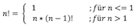
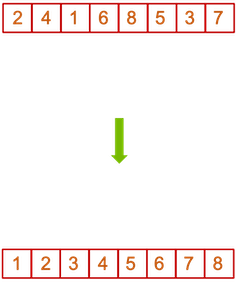

# Sortieren von Arrays

Es ist häufig notwendig, die Elemente von bestimmten Datenstrukturen (Arrays, Listen, Bäume, … - bis jetzt kennen wir davon nur Arrays) zu sortieren. Dazu muss es eine **Ordnung** über die Elemente geben (z.B. numerische Ordnungen von Zahlen, lexikografische Ordnungen von Zeichenketten, …). Man unterscheidet zwischen Sortierverfahren, die mit dem gegebenen Speicherplatz der Datenstruktur auskommen und denen, die zusätzlichen Platz zum zwischenzeitlichen Auslagern von Elementen benötigen. Prinzipiell ist der **paarweise Vergleich aller Elemente** notwendig. Es gibt verschiedene Sortierverfahren, die unterschiedliche Aufwände für den besten Fall, den schlechtesten Fall und im Durchschnitt aufweisen. Wir werden im Folgenden verschiedene Sortierverfahren betrachten. Sie müssen aber nur **eins** selbständig umsetzen können! Ich nehme an, das wird für die allermeisten *Bubble-Sort* sein. 

!!! hint
		In diesem Abschnitt werden häufig Methoden gezeigt, die als `static` deklariert sind. Das Schlüsselwort `static` besagt, dass wir diese Methode verwenden (aufrufen) können, ohne eine Objekt der Klasse erzeugen zu müssen, in der diese Methoden deklariert sind. Es handelt sich um *statische* Methoden oder besser um *Klassenmethoden* (im Gegensatz zu *Objektmethoden*, welche nur für ein Objekt aufgerufen werden können). Die bekannteste *statische* Methode ist die `main`-Methode. Aber auch aus anderen Klassen kennen wir bereits statische Methoden, z.B. `Math.sqrt()`. Wir können die `sqrt()`-Methode der Klasse `Math` aufrufen, ohne ein Objekt der Klasse `Math` zu erzeugen, einfach `Klassenname.klassenMethode()`. 

## Bubble-Sort

Bei Bubble-Sort wird das größte Element immer nach rechts "gebubbled". Das Prinzip bei *Bubble-Sort* ist wie folgt:

- die Datenstruktur (hier: Array) wird von links nach rechts durchlaufen
- „Bubble-Phase“
	- es wird stets das aktuelle Element mit den rechten Nachbarn verglichen
	- ist die Ordnung falsch, werden die Elemente getauscht
	- am Ende einer Bubble-Phase befindet sich das größte Element ganz rechts
- Wiederholung der Bubble-Phase
	- Bubble-Phase wird wiederholt, d.h. es wird wieder vorne im Array angefangen und jedes Element mit seinem rechten Nachbarn verglichen
	- da das ganz rechte Element bereits das größte ist, muss es nicht mehr verglichen werden
	- mit jeder Bubble-Phase muss also ein Vergleich weniger durchgeführt werden und das jeweils größte rutscht nach rechts
	- die Bubble-Phasen werden so oft wiederholt, bis das Array komplett sortiert ist (Länge des Arrays-1 Bubble-Phasen)

Wir betrachten ein Beispiel. Folgendes Array soll sortiert werden:

```bash
55 07 78 12 42
```

Wir starten von links nach rechts und vergleichen die Elemente paarweise:

```bash
1. Bubble-Phase
55 07 78 12 42	--> 55 und 07 vergleichen --> es muss getauscht werden
07 55 78 12 42	--> 55 und 78 vergleichen --> es muss nicht getauscht werden
07 55 78 12 42	--> 78 und 12 vergleichen --> es muss getauscht werden
07 55 12 78 42	--> 78 und 42 vergleichen --> es muss getauscht werden
07 55 12 42 78	--> 1. Bubble-Phase beendet --> die größte Zahl 78 steht ganz rechts
```

Nach der ersten Bubble-Phase steht die größte Zahl aus dem Array ganz rechts. Diese muss nun nicht mehr mitverglichen werden. Bei der 2. Buble-Phase haben wir also einen Vergleich weniger, als bei der ersten.

```bash
2. Bubble-Phase
07 55 12 42 78	--> 07 und 55 vergleichen --> es muss nicht getauscht werden
07 55 12 42 78	--> 55 und 12 vergleichen --> es muss getauscht werden
07 12 55 42 78	--> 55 und 42 vergleichen --> es muss getauscht werden
07 12 42 55 78	--> 2. Bubble-Phase beendet --> die zweitgrößte Zahl 55 steht an zweitletzter Stelle
```

Mit dem letzten Wert muss also in der 2. Bubble-Phase nicht mehr verglichen werden, da im Ergebnis der ersten Bubble-Phase ja der größte Wert nach gaz rechts geschoben wurde. In der dritten Bubble-Phase muss dann auch nicht mehr mit dem vorletzten Wert verglichen werden usw. 

```bash
3. Bubble-Phase
07 12 42 55 78	--> 07 und 12 vergleichen --> es muss nicht getauscht werden
07 12 42 55 78	--> 12 und 42 vergleichen --> es muss nicht getauscht werden
07 12 42 55 78	--> 3. Bubble-Phase beendet --> die drittgrößte Zahl 42 steht an drittletzter Stelle
```

Wie wir sehen, ist dieses Array sogar schon nach der 3. Buble-Phase sortiert. Wir werden uns später auch überlegen, wie wir solche Fälle ausnutzen können, um nicht zwingend alle Bubble-Phasen durchlaufen zu müssen, wenn das Array bereits vorzeitig sortiert ist. Für ein Array der Länge `5`, so wie hier, brauchen wir aber häufig noch die letzte Bubble-Phase `4`:

```bash
4. Bubble-Phase
07 12 42 55 78	--> 07 und 12 vergleichen --> es muss nicht getauscht werden
07 12 42 55 78	--> 4. Bubble-Phase beendet --> ein Array der Länge 5 ist nach spätestens 4 Bubble-Phasen sortiert
```

Für ein Array der Länge `n` braucht es `n-1` Bubble-Phasen. Die erste Bubble-Phase besteht aus `n-1` Vergleichen, die 2. Bubble-Phase besteht aus `n-2` Vergleichen usw. 

Wir wollen uns der algorithmischen Idee von Bubble-Sort annähern. Wir wollen eine Methode `bubblesort()` schreiben, für die folgendes gilt:

- **Parameter**: unsortiertes Array `a` 
- **Rückgabe**: sortiertes Array `b` 

- **Vorgehen**:
	- zuerst `a` komplett nach `b` kopieren, um `a` im Original zu belassen; `b` ist unsortiert
	- Array `b` vom ersten bis zum letzten Element durchlaufen und alle benachbarten Elemente `b[index]` und `b[index+1]` miteinander vergleichen
		- wenn `b[index] <= b[index+1]` ➔ nichts tun
		- wenn `b[index] > b[index+1]` ➔ `b[index]` und `b[index+1]` vertauschen

	- Wenn Array `b` einmal durchlaufen ➔ das größte Element von `b` steht an der letzten Stelle (≈ letztes Element sortiert)
		- Verfahren auf Array `b` vom ersten bis zum *vorletzten* Element anwenden
		- … bis alle Elemente in `b` sortiert


Eine mögliche Implementierung von Bubble-Sort:

```java linenums="1"
for(int bubble=1; bubble<=b.length-1; bubble++)
{
	for(int index=0; index<b.length-bubble; index++)
	{
		if(b[index] > b[index+1])
		{
			int tmp = b[index+1];
			b[index+1] = b[index];
			b[index] = tmp;
		}
	}
}
return b;
``` 

- Zeile `1` zeigt die äußere `for`-Schleife für die Bubble-Phasen. Es werden `length-1` viele Bubble-Phasen durchlaufen (Initialisierung von `bubble` mit `1` und Bedingung `<=`).
- Zeile `3` zeigt die innere `for`-Schleife, die in jeder Bubble-Phase durchlaufen wird. Die Anzahl der Durchläufe wird immer kleiner (wegen `length - bubble` in der Bedingung). Die innere `for`-Schleife ist für den Vergleich aller Nachbarn.
- Zeile `5` zeigt die Bedingung, unter der die Nachbarn tauschen müssen. 
- Zeilen `7-9` zeigt den Tausch der Werte zweier Nachbarn. Wir gehen auf diesen Tausch gleich nochmal ausführlich ein. 
- Wenn die äußere `for`-Schleife abgearbeitet wurde, also alle Bubble-Phasen durchlaufen wurden, ist das Array `b` sortiert und kann zurückgegeben werden. 

??? "Sortieren.java zum Ausprobieren"
	```java
	package themen.arrays.sortieren;

	import java.util.Random;

	public class Sortieren
	{
		/*
		 * aus Skript
		 */
		public static void printArray(int[] a)
		{
			String s = "[ "; 
			for(int index=0; index<a.length-1; index++)
			{
				s = s + a[index] + ", ";
			}
			if(a.length > 0)
			{
				s = s + a[a.length-1] + " ]";
			}
			System.out.println(s);
		}
		
		/*
		 * aus Skript
		 */
		public static int[] createAndFillArray(int length, int bound)
		{
			int[] a = new int[length];
			Random r = new Random();					
			for(int i=0; i<a.length; i++)
			{
				a[i]=r.nextInt(bound);
			}
			return a;
		}
		
		public static int[] bubblesort(int[] a)
		{
			/*
			 * zuerst a nach b kopieren
			 */
			int[] b = new int[a.length];
			for (int index = 0; index < b.length; index++)
			{
				b[index] = a[index];
			}
		
			/*
			 * jetzt b sortieren
			 * aeussere for-Schleife: Bubble-Phasen
			 * innere for-Schleife: Nachbarn vergleichen und eventuell tauschen
			 */
			for(int bubble=1; bubble<=b.length-1; bubble++)
			{
				for(int index=0; index<b.length-bubble; index++)
				{
					if(b[index] > b[index+1])
					{
						int tmp = b[index+1];
						b[index+1] = b[index];
						b[index] = tmp;
					}
				}
			}
			return b;
		}

		public static void main(String[] args)
		{
			int[] unsorted = createAndFillArray(20, 50);
			int[] sorted = bubblesort(unsorted);
			printArray(unsorted);
			printArray(sorted);
		}

	}
	```

### Tauschen der Werte zweier Nachbarn

Angenommen, wir haben folgenden Fall, in dem die Werte `18` und `7` ihre Positionen tauschen sollen, also die `18` auf den Index `3` wechseln soll und die `7` auf den Index `2`. 


Was wir **nicht** machen können, ist etwas in der Art:

```java
b[2] = b[3];	// b[2]==7 und b[3]==7 - die 18 ist überschrieben
b[3] = b[2];	// b[2]==7 und b[3]==7
```

Nach der ersten Anweisung würde sowohl in `b[2]` als auch in `b[3]` der Wert `7` stehen und die `18` wäre "weg". Wir brauchen eine Variable, auf die wir einen Wert zwischenspeichern können.


Wichtig ist, dass diese Variable vom selben Typ ist, wie alle Werte des Arrays (in diesem Fall `int`). In dieser Variablen können wir uns den Wert aus `b[2]` zunächst (zwischen-)speichern.


Nun kann der Wert in `b[2]` problemlos überschrieben werden, denn wir haben ihn ja noch in `tmp` verfügbar. 


Nun müssen wir nur noch den Wert aus `tmp` nach `b[3]` kopieren. 


Die Werte `7` und `18` haben im Array ihre Positionen getauscht. Im obigen Beispiel ist dieses Vertauschen in den 3 Zeilen ausgedrückt:

```java
int tmp = b[index+1];
b[index+1] = b[index];
b[index] = tmp;
``` 

### Verbesserung von Bubble-Sort

In dem eingangs gezeigten Beispiel haben wir gesehen, dass manchmal gar nicht alle `length-1` Bubble-Phasen durchlaufen werden müssen, da das Array manchmal schon vorher fertig sortiert ist. Wir wollen unsere Methode dahingehend verbessern, dass dies erkannt wird und dementsprechend die Sortierung gestoppt wird. 

Woran erkennen wir aber, dass das Array fertig sortiert ist? Die Antwort für den Bubble-Sort-Algorithmus: Wenn in einer Bubble-Phase gar kein Vertauschen mehr stattfindet, dann sind alle linken Nachbarn kleiner als ihre rechten und somit ist das Array fertig sortiert. Das heißt, wir prüfen für eine Bubble-Phase, ob (mindestens) ein Vertauschen stattfand oder nicht. Dazu benötigen wir:

1. eine Variable `swapped` vom Typ `boolean`, die `false` ist, wenn nicht getauscht wurde und `true`, wenn getauscht wurde --> initial ist sie aber `true` (wegen 2.)
2. eine Bedingung in der äußeren `for`-Schleife `&& swapped`. Neben der Bedingung über den `bubble`-Wert prüfen wir nun auch noch, ob `swapped` `true` ist. Nur wenn das der Fall ist (wenn getauscht wurde), betreten wir das Innere der Schleife. Wenn nicht getauscht wurde, ist der Wert von `swapped``false` und die Sortierung wird beendet.
3. eine Anweisung `swapped=false;` direkt nachdem wir die äußere `for`-Schleife betreten haben, d.h. eine neue Bubble-Phase angefangen hat. Wir setzen den Wert also erstmal auf `false` und nur dann, wenn ein Tausch stattfindet, wird er auf `true` gesetzt. 
4. eine Anweisung `swapped=true;` für den Fall, dass getauscht wird. Wenn die Bedingung `b[index] > b[index+1]` `true` ist, dann tauschen die beiden Nachbarn auf den Indizes `index` und `index+1` ihre Positionen und also wurde getauscht --> es muss noch (mindestens) eine weitere Bubble-Phase stattfinden.

Die optimierte Bubble-Sortierung sieht dann so aus:

```java linenums="1" hl_lines="1 2 4 12"
boolean swapped = true;
for(int bubble=1; bubble<=b.length-1 && swapped; bubble++)
{
	swapped = false;
	for(int index=0; index<b.length-bubble; index++)
	{
		if(b[index] > b[index+1])
		{
			int tmp = b[index+1];
			b[index+1] = b[index];
			b[index] = tmp;
			swapped = true;
		}
	}
}
return b;
```

Damit ist die Implementierung von Bubble-Sort vollständig. So kann sie bleiben und genutzt werden. Wir wollen jetzt nur noch ein paar Ausgaben hinzufügen, die aber einzig und allein dem Verständnis des Ablaufs der Sortierung mit Bubble-Sort dienen soll. 

```bash
ori---> [ 46, 12, 15, 39, 37, 12, 20, 37, 49, 38, 41,  6,  2, 36, 49,  3, 14, 26, 24, 31 ]

  1. Bubble-Phase : 
------> [ 46, 12, 15, 39, 37, 12, 20, 37, 49, 38, 41,  6,  2, 36, 49,  3, 14, 26, 24, 31 ]
  0 --> [ 12, 46, 15, 39, 37, 12, 20, 37, 49, 38, 41,  6,  2, 36, 49,  3, 14, 26, 24, 31 ]
  1 --> [ 12, 15, 46, 39, 37, 12, 20, 37, 49, 38, 41,  6,  2, 36, 49,  3, 14, 26, 24, 31 ]
  2 --> [ 12, 15, 39, 46, 37, 12, 20, 37, 49, 38, 41,  6,  2, 36, 49,  3, 14, 26, 24, 31 ]
  3 --> [ 12, 15, 39, 37, 46, 12, 20, 37, 49, 38, 41,  6,  2, 36, 49,  3, 14, 26, 24, 31 ]
  4 --> [ 12, 15, 39, 37, 12, 46, 20, 37, 49, 38, 41,  6,  2, 36, 49,  3, 14, 26, 24, 31 ]
  5 --> [ 12, 15, 39, 37, 12, 20, 46, 37, 49, 38, 41,  6,  2, 36, 49,  3, 14, 26, 24, 31 ]
  6 --> [ 12, 15, 39, 37, 12, 20, 37, 46, 49, 38, 41,  6,  2, 36, 49,  3, 14, 26, 24, 31 ]
  8 --> [ 12, 15, 39, 37, 12, 20, 37, 46, 38, 49, 41,  6,  2, 36, 49,  3, 14, 26, 24, 31 ]
  9 --> [ 12, 15, 39, 37, 12, 20, 37, 46, 38, 41, 49,  6,  2, 36, 49,  3, 14, 26, 24, 31 ]
 10 --> [ 12, 15, 39, 37, 12, 20, 37, 46, 38, 41,  6, 49,  2, 36, 49,  3, 14, 26, 24, 31 ]
 11 --> [ 12, 15, 39, 37, 12, 20, 37, 46, 38, 41,  6,  2, 49, 36, 49,  3, 14, 26, 24, 31 ]
 12 --> [ 12, 15, 39, 37, 12, 20, 37, 46, 38, 41,  6,  2, 36, 49, 49,  3, 14, 26, 24, 31 ]
 14 --> [ 12, 15, 39, 37, 12, 20, 37, 46, 38, 41,  6,  2, 36, 49,  3, 49, 14, 26, 24, 31 ]
 15 --> [ 12, 15, 39, 37, 12, 20, 37, 46, 38, 41,  6,  2, 36, 49,  3, 14, 49, 26, 24, 31 ]
 16 --> [ 12, 15, 39, 37, 12, 20, 37, 46, 38, 41,  6,  2, 36, 49,  3, 14, 26, 49, 24, 31 ]
 17 --> [ 12, 15, 39, 37, 12, 20, 37, 46, 38, 41,  6,  2, 36, 49,  3, 14, 26, 24, 49, 31 ]
 18 --> [ 12, 15, 39, 37, 12, 20, 37, 46, 38, 41,  6,  2, 36, 49,  3, 14, 26, 24, 31, 49 ]

  2. Bubble-Phase : 
------> [ 12, 15, 39, 37, 12, 20, 37, 46, 38, 41,  6,  2, 36, 49,  3, 14, 26, 24, 31, 49 ]
  2 --> [ 12, 15, 37, 39, 12, 20, 37, 46, 38, 41,  6,  2, 36, 49,  3, 14, 26, 24, 31, 49 ]
  3 --> [ 12, 15, 37, 12, 39, 20, 37, 46, 38, 41,  6,  2, 36, 49,  3, 14, 26, 24, 31, 49 ]
  4 --> [ 12, 15, 37, 12, 20, 39, 37, 46, 38, 41,  6,  2, 36, 49,  3, 14, 26, 24, 31, 49 ]
  5 --> [ 12, 15, 37, 12, 20, 37, 39, 46, 38, 41,  6,  2, 36, 49,  3, 14, 26, 24, 31, 49 ]
  7 --> [ 12, 15, 37, 12, 20, 37, 39, 38, 46, 41,  6,  2, 36, 49,  3, 14, 26, 24, 31, 49 ]
  8 --> [ 12, 15, 37, 12, 20, 37, 39, 38, 41, 46,  6,  2, 36, 49,  3, 14, 26, 24, 31, 49 ]
  9 --> [ 12, 15, 37, 12, 20, 37, 39, 38, 41,  6, 46,  2, 36, 49,  3, 14, 26, 24, 31, 49 ]
 10 --> [ 12, 15, 37, 12, 20, 37, 39, 38, 41,  6,  2, 46, 36, 49,  3, 14, 26, 24, 31, 49 ]
 11 --> [ 12, 15, 37, 12, 20, 37, 39, 38, 41,  6,  2, 36, 46, 49,  3, 14, 26, 24, 31, 49 ]
 13 --> [ 12, 15, 37, 12, 20, 37, 39, 38, 41,  6,  2, 36, 46,  3, 49, 14, 26, 24, 31, 49 ]
 14 --> [ 12, 15, 37, 12, 20, 37, 39, 38, 41,  6,  2, 36, 46,  3, 14, 49, 26, 24, 31, 49 ]
 15 --> [ 12, 15, 37, 12, 20, 37, 39, 38, 41,  6,  2, 36, 46,  3, 14, 26, 49, 24, 31, 49 ]
 16 --> [ 12, 15, 37, 12, 20, 37, 39, 38, 41,  6,  2, 36, 46,  3, 14, 26, 24, 49, 31, 49 ]
 17 --> [ 12, 15, 37, 12, 20, 37, 39, 38, 41,  6,  2, 36, 46,  3, 14, 26, 24, 31, 49, 49 ]

  3. Bubble-Phase : 
------> [ 12, 15, 37, 12, 20, 37, 39, 38, 41,  6,  2, 36, 46,  3, 14, 26, 24, 31, 49, 49 ]
  2 --> [ 12, 15, 12, 37, 20, 37, 39, 38, 41,  6,  2, 36, 46,  3, 14, 26, 24, 31, 49, 49 ]
  3 --> [ 12, 15, 12, 20, 37, 37, 39, 38, 41,  6,  2, 36, 46,  3, 14, 26, 24, 31, 49, 49 ]
  6 --> [ 12, 15, 12, 20, 37, 37, 38, 39, 41,  6,  2, 36, 46,  3, 14, 26, 24, 31, 49, 49 ]
  8 --> [ 12, 15, 12, 20, 37, 37, 38, 39,  6, 41,  2, 36, 46,  3, 14, 26, 24, 31, 49, 49 ]
  9 --> [ 12, 15, 12, 20, 37, 37, 38, 39,  6,  2, 41, 36, 46,  3, 14, 26, 24, 31, 49, 49 ]
 10 --> [ 12, 15, 12, 20, 37, 37, 38, 39,  6,  2, 36, 41, 46,  3, 14, 26, 24, 31, 49, 49 ]
 12 --> [ 12, 15, 12, 20, 37, 37, 38, 39,  6,  2, 36, 41,  3, 46, 14, 26, 24, 31, 49, 49 ]
 13 --> [ 12, 15, 12, 20, 37, 37, 38, 39,  6,  2, 36, 41,  3, 14, 46, 26, 24, 31, 49, 49 ]
 14 --> [ 12, 15, 12, 20, 37, 37, 38, 39,  6,  2, 36, 41,  3, 14, 26, 46, 24, 31, 49, 49 ]
 15 --> [ 12, 15, 12, 20, 37, 37, 38, 39,  6,  2, 36, 41,  3, 14, 26, 24, 46, 31, 49, 49 ]
 16 --> [ 12, 15, 12, 20, 37, 37, 38, 39,  6,  2, 36, 41,  3, 14, 26, 24, 31, 46, 49, 49 ]

  4. Bubble-Phase : 
------> [ 12, 15, 12, 20, 37, 37, 38, 39,  6,  2, 36, 41,  3, 14, 26, 24, 31, 46, 49, 49 ]
  1 --> [ 12, 12, 15, 20, 37, 37, 38, 39,  6,  2, 36, 41,  3, 14, 26, 24, 31, 46, 49, 49 ]
  7 --> [ 12, 12, 15, 20, 37, 37, 38,  6, 39,  2, 36, 41,  3, 14, 26, 24, 31, 46, 49, 49 ]
  8 --> [ 12, 12, 15, 20, 37, 37, 38,  6,  2, 39, 36, 41,  3, 14, 26, 24, 31, 46, 49, 49 ]
  9 --> [ 12, 12, 15, 20, 37, 37, 38,  6,  2, 36, 39, 41,  3, 14, 26, 24, 31, 46, 49, 49 ]
 11 --> [ 12, 12, 15, 20, 37, 37, 38,  6,  2, 36, 39,  3, 41, 14, 26, 24, 31, 46, 49, 49 ]
 12 --> [ 12, 12, 15, 20, 37, 37, 38,  6,  2, 36, 39,  3, 14, 41, 26, 24, 31, 46, 49, 49 ]
 13 --> [ 12, 12, 15, 20, 37, 37, 38,  6,  2, 36, 39,  3, 14, 26, 41, 24, 31, 46, 49, 49 ]
 14 --> [ 12, 12, 15, 20, 37, 37, 38,  6,  2, 36, 39,  3, 14, 26, 24, 41, 31, 46, 49, 49 ]
 15 --> [ 12, 12, 15, 20, 37, 37, 38,  6,  2, 36, 39,  3, 14, 26, 24, 31, 41, 46, 49, 49 ]

  5. Bubble-Phase : 
------> [ 12, 12, 15, 20, 37, 37, 38,  6,  2, 36, 39,  3, 14, 26, 24, 31, 41, 46, 49, 49 ]
  6 --> [ 12, 12, 15, 20, 37, 37,  6, 38,  2, 36, 39,  3, 14, 26, 24, 31, 41, 46, 49, 49 ]
  7 --> [ 12, 12, 15, 20, 37, 37,  6,  2, 38, 36, 39,  3, 14, 26, 24, 31, 41, 46, 49, 49 ]
  8 --> [ 12, 12, 15, 20, 37, 37,  6,  2, 36, 38, 39,  3, 14, 26, 24, 31, 41, 46, 49, 49 ]
 10 --> [ 12, 12, 15, 20, 37, 37,  6,  2, 36, 38,  3, 39, 14, 26, 24, 31, 41, 46, 49, 49 ]
 11 --> [ 12, 12, 15, 20, 37, 37,  6,  2, 36, 38,  3, 14, 39, 26, 24, 31, 41, 46, 49, 49 ]
 12 --> [ 12, 12, 15, 20, 37, 37,  6,  2, 36, 38,  3, 14, 26, 39, 24, 31, 41, 46, 49, 49 ]
 13 --> [ 12, 12, 15, 20, 37, 37,  6,  2, 36, 38,  3, 14, 26, 24, 39, 31, 41, 46, 49, 49 ]
 14 --> [ 12, 12, 15, 20, 37, 37,  6,  2, 36, 38,  3, 14, 26, 24, 31, 39, 41, 46, 49, 49 ]

  6. Bubble-Phase : 
------> [ 12, 12, 15, 20, 37, 37,  6,  2, 36, 38,  3, 14, 26, 24, 31, 39, 41, 46, 49, 49 ]
  5 --> [ 12, 12, 15, 20, 37,  6, 37,  2, 36, 38,  3, 14, 26, 24, 31, 39, 41, 46, 49, 49 ]
  6 --> [ 12, 12, 15, 20, 37,  6,  2, 37, 36, 38,  3, 14, 26, 24, 31, 39, 41, 46, 49, 49 ]
  7 --> [ 12, 12, 15, 20, 37,  6,  2, 36, 37, 38,  3, 14, 26, 24, 31, 39, 41, 46, 49, 49 ]
  9 --> [ 12, 12, 15, 20, 37,  6,  2, 36, 37,  3, 38, 14, 26, 24, 31, 39, 41, 46, 49, 49 ]
 10 --> [ 12, 12, 15, 20, 37,  6,  2, 36, 37,  3, 14, 38, 26, 24, 31, 39, 41, 46, 49, 49 ]
 11 --> [ 12, 12, 15, 20, 37,  6,  2, 36, 37,  3, 14, 26, 38, 24, 31, 39, 41, 46, 49, 49 ]
 12 --> [ 12, 12, 15, 20, 37,  6,  2, 36, 37,  3, 14, 26, 24, 38, 31, 39, 41, 46, 49, 49 ]
 13 --> [ 12, 12, 15, 20, 37,  6,  2, 36, 37,  3, 14, 26, 24, 31, 38, 39, 41, 46, 49, 49 ]

  7. Bubble-Phase : 
------> [ 12, 12, 15, 20, 37,  6,  2, 36, 37,  3, 14, 26, 24, 31, 38, 39, 41, 46, 49, 49 ]
  4 --> [ 12, 12, 15, 20,  6, 37,  2, 36, 37,  3, 14, 26, 24, 31, 38, 39, 41, 46, 49, 49 ]
  5 --> [ 12, 12, 15, 20,  6,  2, 37, 36, 37,  3, 14, 26, 24, 31, 38, 39, 41, 46, 49, 49 ]
  6 --> [ 12, 12, 15, 20,  6,  2, 36, 37, 37,  3, 14, 26, 24, 31, 38, 39, 41, 46, 49, 49 ]
  8 --> [ 12, 12, 15, 20,  6,  2, 36, 37,  3, 37, 14, 26, 24, 31, 38, 39, 41, 46, 49, 49 ]
  9 --> [ 12, 12, 15, 20,  6,  2, 36, 37,  3, 14, 37, 26, 24, 31, 38, 39, 41, 46, 49, 49 ]
 10 --> [ 12, 12, 15, 20,  6,  2, 36, 37,  3, 14, 26, 37, 24, 31, 38, 39, 41, 46, 49, 49 ]
 11 --> [ 12, 12, 15, 20,  6,  2, 36, 37,  3, 14, 26, 24, 37, 31, 38, 39, 41, 46, 49, 49 ]
 12 --> [ 12, 12, 15, 20,  6,  2, 36, 37,  3, 14, 26, 24, 31, 37, 38, 39, 41, 46, 49, 49 ]

  8. Bubble-Phase : 
------> [ 12, 12, 15, 20,  6,  2, 36, 37,  3, 14, 26, 24, 31, 37, 38, 39, 41, 46, 49, 49 ]
  3 --> [ 12, 12, 15,  6, 20,  2, 36, 37,  3, 14, 26, 24, 31, 37, 38, 39, 41, 46, 49, 49 ]
  4 --> [ 12, 12, 15,  6,  2, 20, 36, 37,  3, 14, 26, 24, 31, 37, 38, 39, 41, 46, 49, 49 ]
  7 --> [ 12, 12, 15,  6,  2, 20, 36,  3, 37, 14, 26, 24, 31, 37, 38, 39, 41, 46, 49, 49 ]
  8 --> [ 12, 12, 15,  6,  2, 20, 36,  3, 14, 37, 26, 24, 31, 37, 38, 39, 41, 46, 49, 49 ]
  9 --> [ 12, 12, 15,  6,  2, 20, 36,  3, 14, 26, 37, 24, 31, 37, 38, 39, 41, 46, 49, 49 ]
 10 --> [ 12, 12, 15,  6,  2, 20, 36,  3, 14, 26, 24, 37, 31, 37, 38, 39, 41, 46, 49, 49 ]
 11 --> [ 12, 12, 15,  6,  2, 20, 36,  3, 14, 26, 24, 31, 37, 37, 38, 39, 41, 46, 49, 49 ]

  9. Bubble-Phase : 
------> [ 12, 12, 15,  6,  2, 20, 36,  3, 14, 26, 24, 31, 37, 37, 38, 39, 41, 46, 49, 49 ]
  2 --> [ 12, 12,  6, 15,  2, 20, 36,  3, 14, 26, 24, 31, 37, 37, 38, 39, 41, 46, 49, 49 ]
  3 --> [ 12, 12,  6,  2, 15, 20, 36,  3, 14, 26, 24, 31, 37, 37, 38, 39, 41, 46, 49, 49 ]
  6 --> [ 12, 12,  6,  2, 15, 20,  3, 36, 14, 26, 24, 31, 37, 37, 38, 39, 41, 46, 49, 49 ]
  7 --> [ 12, 12,  6,  2, 15, 20,  3, 14, 36, 26, 24, 31, 37, 37, 38, 39, 41, 46, 49, 49 ]
  8 --> [ 12, 12,  6,  2, 15, 20,  3, 14, 26, 36, 24, 31, 37, 37, 38, 39, 41, 46, 49, 49 ]
  9 --> [ 12, 12,  6,  2, 15, 20,  3, 14, 26, 24, 36, 31, 37, 37, 38, 39, 41, 46, 49, 49 ]
 10 --> [ 12, 12,  6,  2, 15, 20,  3, 14, 26, 24, 31, 36, 37, 37, 38, 39, 41, 46, 49, 49 ]

 10. Bubble-Phase : 
------> [ 12, 12,  6,  2, 15, 20,  3, 14, 26, 24, 31, 36, 37, 37, 38, 39, 41, 46, 49, 49 ]
  1 --> [ 12,  6, 12,  2, 15, 20,  3, 14, 26, 24, 31, 36, 37, 37, 38, 39, 41, 46, 49, 49 ]
  2 --> [ 12,  6,  2, 12, 15, 20,  3, 14, 26, 24, 31, 36, 37, 37, 38, 39, 41, 46, 49, 49 ]
  5 --> [ 12,  6,  2, 12, 15,  3, 20, 14, 26, 24, 31, 36, 37, 37, 38, 39, 41, 46, 49, 49 ]
  6 --> [ 12,  6,  2, 12, 15,  3, 14, 20, 26, 24, 31, 36, 37, 37, 38, 39, 41, 46, 49, 49 ]
  8 --> [ 12,  6,  2, 12, 15,  3, 14, 20, 24, 26, 31, 36, 37, 37, 38, 39, 41, 46, 49, 49 ]

 11. Bubble-Phase : 
------> [ 12,  6,  2, 12, 15,  3, 14, 20, 24, 26, 31, 36, 37, 37, 38, 39, 41, 46, 49, 49 ]
  0 --> [  6, 12,  2, 12, 15,  3, 14, 20, 24, 26, 31, 36, 37, 37, 38, 39, 41, 46, 49, 49 ]
  1 --> [  6,  2, 12, 12, 15,  3, 14, 20, 24, 26, 31, 36, 37, 37, 38, 39, 41, 46, 49, 49 ]
  4 --> [  6,  2, 12, 12,  3, 15, 14, 20, 24, 26, 31, 36, 37, 37, 38, 39, 41, 46, 49, 49 ]
  5 --> [  6,  2, 12, 12,  3, 14, 15, 20, 24, 26, 31, 36, 37, 37, 38, 39, 41, 46, 49, 49 ]

 12. Bubble-Phase : 
------> [  6,  2, 12, 12,  3, 14, 15, 20, 24, 26, 31, 36, 37, 37, 38, 39, 41, 46, 49, 49 ]
  0 --> [  2,  6, 12, 12,  3, 14, 15, 20, 24, 26, 31, 36, 37, 37, 38, 39, 41, 46, 49, 49 ]
  3 --> [  2,  6, 12,  3, 12, 14, 15, 20, 24, 26, 31, 36, 37, 37, 38, 39, 41, 46, 49, 49 ]

 13. Bubble-Phase : 
------> [  2,  6, 12,  3, 12, 14, 15, 20, 24, 26, 31, 36, 37, 37, 38, 39, 41, 46, 49, 49 ]
  2 --> [  2,  6,  3, 12, 12, 14, 15, 20, 24, 26, 31, 36, 37, 37, 38, 39, 41, 46, 49, 49 ]

 14. Bubble-Phase : 
------> [  2,  6,  3, 12, 12, 14, 15, 20, 24, 26, 31, 36, 37, 37, 38, 39, 41, 46, 49, 49 ]
  1 --> [  2,  3,  6, 12, 12, 14, 15, 20, 24, 26, 31, 36, 37, 37, 38, 39, 41, 46, 49, 49 ]

 15. Bubble-Phase : 
------> [  2,  3,  6, 12, 12, 14, 15, 20, 24, 26, 31, 36, 37, 37, 38, 39, 41, 46, 49, 49 ]
```

Wir sehen, wie sich von oben nach unten der sortierte Bereich von rechts nach links vergrößert. Es werden immer nur die Zeilen mit ihren jeweiligen Indizes (die ganz linke Zahl am Anfang der Zeile) ausgegeben, in denen Nachbarn getauscht werden. In diesem Beispiel wird bereits in der 15. Bubble-Phase nichts mehr getauscht. Da das Array die Länge `20` hat, gäbe es eigentlich `19` Bubble-Phasen. 

??? "Der Code, der für die obige Ausgabe verwendet wurde"
	```java
	package themen.arrays.sortieren;

	import java.util.Random;

	public class Sortieren
	{
		/*
		 * aus Skript
		 */
		public static void printArray(int[] a)
		{
			String s = "[ "; 
			for(int index=0; index<a.length-1; index++)
			{
				s = s + a[index] + ", ";
			}
			if(a.length > 0)
			{
				s = s + a[a.length-1] + " ]";
			}
			System.out.println(s);
		}
		
		/*
		 * angepasste printArray-Methode
		 * hier wird davon ausgegangen, dass die Zahlen
		 * in dem Array nie größer als zweistellig sind
		 * ist hauptsächlich, damit die Ausgaben der Arrays besser
		 * miteinander verglichen werden können auf der Konsole
		 * 
		 */
		public static void print(int[] a)
		{
			String s = "--> [ "; 
			for(int index=0; index<a.length-1; index++)
			{
				s = s + String.format("%2d, ", a[index]);
			}
			if(a.length > 0)
			{
				s = s + String.format("%2d ]", a[a.length-1]);
			}
			System.out.println(s);
		}
		
		/*
		 * aus Skript
		 */
		public static int[] createAndFillArray(int length, int bound)
		{
			int[] a = new int[length];
			Random r = new Random();					
			for(int i=0; i<a.length; i++)
			{
				a[i]=r.nextInt(bound);
			}
			return a;
		}
		
		public static int[] bubblesort(int[] a)
		{
			/*
			 * zuerst a nach b kopieren
			 */
			int[] b = new int[a.length];
			for (int index = 0; index < b.length; index++)
			{
				b[index] = a[index];
			}
			System.out.print("ori-");
			print(b);		// Ausgangs-Array
			System.out.println();
			/*
			 * jetzt b sortieren
			 * aeussere for-Schleife: Bubble-Phasen
			 * innere for-Schleife: Nachbarn vergleichen und eventuell tauschen
			 */
			boolean swapped = true;
			for(int bubble=1; bubble<=b.length-1 && swapped; bubble++)
			{
				System.out.printf("%3d. Bubble-Phase : %n----", bubble);
				print(b);
				swapped = false;
				for(int index=0; index<b.length-bubble; index++)
				{
					if(b[index] > b[index+1])
					{
						int tmp = b[index+1];
						b[index+1] = b[index];
						b[index] = tmp;
						swapped = true;
						System.out.printf("%3d ", index);
						print(b);
					}
				}
				System.out.println();
			}
			return b;
		}

		public static void main(String[] args)
		{
			int[] unsorted = createAndFillArray(20, 50);
			int[] sorted = bubblesort(unsorted);
			printArray(unsorted);
			printArray(sorted);
		}

	}
	```

Noch kurz ein Wort zur *Komplexität* von Bubble-Sort. Wenn `n` die Länge des Arrays ist, dann finden in der ersten Bubble-Phase `n-1` Vergleiche statt, in der zweiten Bubble-Phase `n-2` Vergleiche usw. Es gibt maximal `n-1` Bubble-Phasen, also `(n-1) + (n-2) + (n-3) + ... + 3 + 2 + 1` Vergleiche. Das sind `n*(n-1)/2` Vergleiche und maximal ebenso viele Vertauschungen. Das ergibt Vergleiche + Vertauschungen = `n*(n-1)` Operationen. Das entspricht einer (Zeit-)Komplexität von `O(n^2)`. 

!!! success
	Wir haben einen Sortieralgorithmus kennengelernt, mit dem wir Arrays sortieren können. Beachten Sie, dass das nicht nur für `int`-Arrays möglich ist, sondern für alle Datentypen, über die sich eine Ordnung definieren lässt. Wir werden jetzt noch weitere Sortieralgorithmen betrachten, aber nur aus Interesse. Den Bubble-Sort-Algorithmus sollten Sie aus dem Kopf beherrschen, also programmieren können. Alle weiteren Sortieralgorithmen sollten Sie "nur" verstehen. 

---

## Selection-Sort

Die Idee des Selection-Sort-Algorithmus ist die, dass bei jedem Durchlauf durch das Array das jeweils kleinste (oder größte - je, nachdem, wie man sortieren möchte) ausgewählt und an seine richtige Position im Array sortiert wird. Wir betrachten erneut unser Beispiel:

```bash
55 07 78 12 42
```

**Erster** Durchlauf:

- Im ersten Schritt suchen wir das kleinste Element im Array und wollen es ganz links (auf den Index `0`) legen
- die `7` ist das kleinste Element, also muss es seine Poition mit der `55` tauschen

Nach dem **ersten** Schritt:

```bash
07 55 78 12 42
```

**Zweiter** Durchlauf: 

- Jetzt steht das kleinste Element ganz links --> es muss nicht mehr betrachtet werden
- wir suchen jetzt das zweitkleinste Element, um es auf den Index `1` zu legen
- die `12` ist das zweitkleinste Element, also muss es seine Position mit der `55` tauschen

Nach dem **zweiten** Schritt:

```bash
07 12 78 55 42
```

**Dritter** Durchlauf: 

- Jetzt stehen die **2** kleinsten Element ganz links --> sie müssen nicht mehr betrachtet werden
- wir suchen jetzt das drittkleinste Element, um es auf den Index `2` zu legen
- die `42` ist das drittkleinste Element, also muss es seine Position mit der `78` tauschen


Nach dem **dritten** Schritt:

```bash
07 12 42 55 78
```

**Vierter** Durchlauf: 

- Jetzt stehen die **3** kleinsten Element ganz links --> sie müssen nicht mehr betrachtet werden
- wir suchen jetzt das viertkleinste Element, um es auf den Index `3` zu legen
- die `55` ist das viertkleinste Element, es ist bereits auf der richtigen Position --> wir müssen also nicht (mehr) tauschen

Ein Array der Länge `5` ist nach `4` Durchläufen sortiert. Generell gilt auch hier wieder, dass ein Array der Länge `n` nach spätestens `n-1` Durchläufen (das waren In Bubble-Sort die Bubble-Phasen) sortiert ist. 

Während bei Bubble-Sort der sortierte Teil des Arrays von rechts anwuchs (von groß nach klein), wächst bei Selection-Sort der sortierte Teil des Arrays von links an (von klein nach groß). Auch hier gilt wieder, dass immer nur der **unsortierte** Teil erneut durchsucht werden muss. Auch hier finden wieder paarweise Vergleiche mit allen unsortierten Elementen statt. Dieses Mal sind es aber nicht die Nachbarn, die verglichen und evtl. getauscht werden müssen, sondern es wird im unsortierten (rechten) Teil nach dem kleinsten Element gesucht. 

Hier noch ein Bild, das den Selection-Sort-Algorithmus an einem anderen Beispiel verdeutlicht: 


Wir wollen uns der algorithmischen Idee von Selection-Sort annähern. Wir wollen eine Methode `selectionsort()` schreiben, für die folgendes gilt:

- **Parameter**: unsortiertes Array `a` 
- **Rückgabe**: sortiertes Array `b` 

- **Vorgehen**:
	- gedachte Teilung des Arrays in 2 Teile: 
		- linker Teil: sortiert  
		- rechter Teil: unsortiert
		- ➔ anfangs: linker Teil leer d.h. Array unsortiert
	- rechten unsortierten Teil `b[j]`,…,`b[n-1]` betrachten (`n` ist Länge des Arrays)
		- das kleinste Element (Minimum) im rechten Teil suchen
		- mit dem ersten Element `b[j]` im rechten Teil vertauschen 
		- ➔ rechter unsortierter Teil des Array `b[j+1]`,…,`b[n-1]` um ein Element kleiner, linker sortierter Teil wächst um ein Element `b[j]`
	- so verfahren, bis rechter Teil nur ein Element `b[n-1]` enthält


Eine mögliche Implementierung von Selection-Sort:

```java linenums="1"
public static int[] selectionsort(int[] a)
{
	int[] b = copy(a);  // copy erzeugt eine Kopie von a und gibt diese zurueck
	
	for (int durchlauf = 0; durchlauf < b.length; durchlauf++)	// durchlauf ist in Vorgehen j (siehe oben)
	{
		int minValue = b[durchlauf];	// in minValue merken wir uns den aktuell kleinsten Wert
		int minIndex = durchlauf;		// in minIndex merken wir uns den Index des aktuell kleinsten Wertes
		for (int index = durchlauf; index < b.length; index++)	// Suche nach dem kleinsten Wert
		{
			if(minValue > b[index])
			{
				minValue = b[index];	// aktuell kleinster Wert
				minIndex = index;		// aktueller Index des kleinsten Wertes
			}
		}
		// jetzt den kleinsten Wert auf den Index durchlauf legen
		// der Wert, der auf durchlauf lag, kommt nach minIndex
		int tmp = b[durchlauf];
		b[durchlauf] = b[minIndex];
		b[minIndex] = tmp;
	}
	return b;
}
``` 

- Zeile `5` zeigt die äußere `for`-Schleife für die Durchläufe. Es werden `length-1` viele Phasen durchlaufen.
- in Zeile `7` wird die Variable deklariert, in der wir uns den kleinsten Wert des rechten (unsortierten) Teils merken. Wir initialisieren die Variable mit dem ersten Wert im unsortierten Teil. Der unsortierte Teil beginnt beim Index `durchlauf`.
- in Zeile `8` wird die Variable deklariert, in der wir uns den Index des kleinsten Wertes im rechten (unsortierten) Teils merken. Wir initialisieren die Variable mit dem ersten Index im unsortierten Teil - dies ist `durchlauf`. 
- in den Zeilen `19-21` tauschen wir die Werte. Der kleinste Wert kommt auf den Index `durchlauf` und der Wert, der auf dem Index `durchlauf` stand, kommt nach `minIndex`
- Wenn die äußere `for`-Schleife abgearbeitet wurde, also alle `length-1` Phasen durchlaufen wurden, ist das Array `b` sortiert und kann zurückgegeben werden. 

Die `copy()`-Methode, die in Zeile `3` verwendet wurde, sieht so aus:

```java
public static int[] copy(int[] a)
{
	int[] b = new int[a.length];
	for (int index = 0; index < b.length; index++)
	{
		b[index] = a[index];
	}
	return b;
}
```

Wir werden jetzt die Implementierung des Selection-Sort-Algorithmus um einige Ausgaben erweitern, damit das Prinzip noch deutlicher wird (wie bei Bubble-Sort). Die Ausgaben haben in der Methode natürlich eigentlich nichts zu suchen - es ist hier nur zur näheren Information:

```bash

  original -------> [ 38, 22, 18,  6, 15, 12,  9,  1, 14,  5, 22, 49, 31, 19, 11, 24, 30, 10, 31, 49 ]

  1. Durchlauf - kleinstes Element soll auf den index  0 
----> kleinster Wert ist   1 auf dem Index   7 
  vor Tausch  : --> [ 38, 22, 18,  6, 15, 12,  9,  1, 14,  5, 22, 49, 31, 19, 11, 24, 30, 10, 31, 49 ]
 nach Tausch  : --> [  1, 22, 18,  6, 15, 12,  9, 38, 14,  5, 22, 49, 31, 19, 11, 24, 30, 10, 31, 49 ]

  2. Durchlauf - kleinstes Element soll auf den index  1 
----> kleinster Wert ist   5 auf dem Index   9 
  vor Tausch  : --> [  1, 22, 18,  6, 15, 12,  9, 38, 14,  5, 22, 49, 31, 19, 11, 24, 30, 10, 31, 49 ]
 nach Tausch  : --> [  1,  5, 18,  6, 15, 12,  9, 38, 14, 22, 22, 49, 31, 19, 11, 24, 30, 10, 31, 49 ]

  3. Durchlauf - kleinstes Element soll auf den index  2 
----> kleinster Wert ist   6 auf dem Index   3 
  vor Tausch  : --> [  1,  5, 18,  6, 15, 12,  9, 38, 14, 22, 22, 49, 31, 19, 11, 24, 30, 10, 31, 49 ]
 nach Tausch  : --> [  1,  5,  6, 18, 15, 12,  9, 38, 14, 22, 22, 49, 31, 19, 11, 24, 30, 10, 31, 49 ]

  4. Durchlauf - kleinstes Element soll auf den index  3 
----> kleinster Wert ist   9 auf dem Index   6 
  vor Tausch  : --> [  1,  5,  6, 18, 15, 12,  9, 38, 14, 22, 22, 49, 31, 19, 11, 24, 30, 10, 31, 49 ]
 nach Tausch  : --> [  1,  5,  6,  9, 15, 12, 18, 38, 14, 22, 22, 49, 31, 19, 11, 24, 30, 10, 31, 49 ]

  5. Durchlauf - kleinstes Element soll auf den index  4 
----> kleinster Wert ist  10 auf dem Index  17 
  vor Tausch  : --> [  1,  5,  6,  9, 15, 12, 18, 38, 14, 22, 22, 49, 31, 19, 11, 24, 30, 10, 31, 49 ]
 nach Tausch  : --> [  1,  5,  6,  9, 10, 12, 18, 38, 14, 22, 22, 49, 31, 19, 11, 24, 30, 15, 31, 49 ]

  6. Durchlauf - kleinstes Element soll auf den index  5 
----> kleinster Wert ist  11 auf dem Index  14 
  vor Tausch  : --> [  1,  5,  6,  9, 10, 12, 18, 38, 14, 22, 22, 49, 31, 19, 11, 24, 30, 15, 31, 49 ]
 nach Tausch  : --> [  1,  5,  6,  9, 10, 11, 18, 38, 14, 22, 22, 49, 31, 19, 12, 24, 30, 15, 31, 49 ]

  7. Durchlauf - kleinstes Element soll auf den index  6 
----> kleinster Wert ist  12 auf dem Index  14 
  vor Tausch  : --> [  1,  5,  6,  9, 10, 11, 18, 38, 14, 22, 22, 49, 31, 19, 12, 24, 30, 15, 31, 49 ]
 nach Tausch  : --> [  1,  5,  6,  9, 10, 11, 12, 38, 14, 22, 22, 49, 31, 19, 18, 24, 30, 15, 31, 49 ]

  8. Durchlauf - kleinstes Element soll auf den index  7 
----> kleinster Wert ist  14 auf dem Index   8 
  vor Tausch  : --> [  1,  5,  6,  9, 10, 11, 12, 38, 14, 22, 22, 49, 31, 19, 18, 24, 30, 15, 31, 49 ]
 nach Tausch  : --> [  1,  5,  6,  9, 10, 11, 12, 14, 38, 22, 22, 49, 31, 19, 18, 24, 30, 15, 31, 49 ]

  9. Durchlauf - kleinstes Element soll auf den index  8 
----> kleinster Wert ist  15 auf dem Index  17 
  vor Tausch  : --> [  1,  5,  6,  9, 10, 11, 12, 14, 38, 22, 22, 49, 31, 19, 18, 24, 30, 15, 31, 49 ]
 nach Tausch  : --> [  1,  5,  6,  9, 10, 11, 12, 14, 15, 22, 22, 49, 31, 19, 18, 24, 30, 38, 31, 49 ]

 10. Durchlauf - kleinstes Element soll auf den index  9 
----> kleinster Wert ist  18 auf dem Index  14 
  vor Tausch  : --> [  1,  5,  6,  9, 10, 11, 12, 14, 15, 22, 22, 49, 31, 19, 18, 24, 30, 38, 31, 49 ]
 nach Tausch  : --> [  1,  5,  6,  9, 10, 11, 12, 14, 15, 18, 22, 49, 31, 19, 22, 24, 30, 38, 31, 49 ]

 11. Durchlauf - kleinstes Element soll auf den index 10 
----> kleinster Wert ist  19 auf dem Index  13 
  vor Tausch  : --> [  1,  5,  6,  9, 10, 11, 12, 14, 15, 18, 22, 49, 31, 19, 22, 24, 30, 38, 31, 49 ]
 nach Tausch  : --> [  1,  5,  6,  9, 10, 11, 12, 14, 15, 18, 19, 49, 31, 22, 22, 24, 30, 38, 31, 49 ]

 12. Durchlauf - kleinstes Element soll auf den index 11 
----> kleinster Wert ist  22 auf dem Index  13 
  vor Tausch  : --> [  1,  5,  6,  9, 10, 11, 12, 14, 15, 18, 19, 49, 31, 22, 22, 24, 30, 38, 31, 49 ]
 nach Tausch  : --> [  1,  5,  6,  9, 10, 11, 12, 14, 15, 18, 19, 22, 31, 49, 22, 24, 30, 38, 31, 49 ]

 13. Durchlauf - kleinstes Element soll auf den index 12 
----> kleinster Wert ist  22 auf dem Index  14 
  vor Tausch  : --> [  1,  5,  6,  9, 10, 11, 12, 14, 15, 18, 19, 22, 31, 49, 22, 24, 30, 38, 31, 49 ]
 nach Tausch  : --> [  1,  5,  6,  9, 10, 11, 12, 14, 15, 18, 19, 22, 22, 49, 31, 24, 30, 38, 31, 49 ]

 14. Durchlauf - kleinstes Element soll auf den index 13 
----> kleinster Wert ist  24 auf dem Index  15 
  vor Tausch  : --> [  1,  5,  6,  9, 10, 11, 12, 14, 15, 18, 19, 22, 22, 49, 31, 24, 30, 38, 31, 49 ]
 nach Tausch  : --> [  1,  5,  6,  9, 10, 11, 12, 14, 15, 18, 19, 22, 22, 24, 31, 49, 30, 38, 31, 49 ]

 15. Durchlauf - kleinstes Element soll auf den index 14 
----> kleinster Wert ist  30 auf dem Index  16 
  vor Tausch  : --> [  1,  5,  6,  9, 10, 11, 12, 14, 15, 18, 19, 22, 22, 24, 31, 49, 30, 38, 31, 49 ]
 nach Tausch  : --> [  1,  5,  6,  9, 10, 11, 12, 14, 15, 18, 19, 22, 22, 24, 30, 49, 31, 38, 31, 49 ]

 16. Durchlauf - kleinstes Element soll auf den index 15 
----> kleinster Wert ist  31 auf dem Index  16 
  vor Tausch  : --> [  1,  5,  6,  9, 10, 11, 12, 14, 15, 18, 19, 22, 22, 24, 30, 49, 31, 38, 31, 49 ]
 nach Tausch  : --> [  1,  5,  6,  9, 10, 11, 12, 14, 15, 18, 19, 22, 22, 24, 30, 31, 49, 38, 31, 49 ]

 17. Durchlauf - kleinstes Element soll auf den index 16 
----> kleinster Wert ist  31 auf dem Index  18 
  vor Tausch  : --> [  1,  5,  6,  9, 10, 11, 12, 14, 15, 18, 19, 22, 22, 24, 30, 31, 49, 38, 31, 49 ]
 nach Tausch  : --> [  1,  5,  6,  9, 10, 11, 12, 14, 15, 18, 19, 22, 22, 24, 30, 31, 31, 38, 49, 49 ]

 18. Durchlauf - kleinstes Element soll auf den index 17 
----> kleinster Wert ist  38 auf dem Index  17 
  vor Tausch  : --> [  1,  5,  6,  9, 10, 11, 12, 14, 15, 18, 19, 22, 22, 24, 30, 31, 31, 38, 49, 49 ]
 nach Tausch  : --> [  1,  5,  6,  9, 10, 11, 12, 14, 15, 18, 19, 22, 22, 24, 30, 31, 31, 38, 49, 49 ]

 19. Durchlauf - kleinstes Element soll auf den index 18 
----> kleinster Wert ist  49 auf dem Index  18 
  vor Tausch  : --> [  1,  5,  6,  9, 10, 11, 12, 14, 15, 18, 19, 22, 22, 24, 30, 31, 31, 38, 49, 49 ]
 nach Tausch  : --> [  1,  5,  6,  9, 10, 11, 12, 14, 15, 18, 19, 22, 22, 24, 30, 31, 31, 38, 49, 49 ]

 20. Durchlauf - kleinstes Element soll auf den index 19 
----> kleinster Wert ist  49 auf dem Index  19 
  vor Tausch  : --> [  1,  5,  6,  9, 10, 11, 12, 14, 15, 18, 19, 22, 22, 24, 30, 31, 31, 38, 49, 49 ]
 nach Tausch  : --> [  1,  5,  6,  9, 10, 11, 12, 14, 15, 18, 19, 22, 22, 24, 30, 31, 31, 38, 49, 49 ]
```

Wenn wir nur alle Zeilen *nach dem Tausch* betrachten, dann sehen wir die Entwicklung der Sortierung von links nach rechts:

```bash

  original -------> [ 38, 22, 18,  6, 15, 12,  9,  1, 14,  5, 22, 49, 31, 19, 11, 24, 30, 10, 31, 49 ]
 nach Tausch  : --> [  1, 22, 18,  6, 15, 12,  9, 38, 14,  5, 22, 49, 31, 19, 11, 24, 30, 10, 31, 49 ]
 nach Tausch  : --> [  1,  5, 18,  6, 15, 12,  9, 38, 14, 22, 22, 49, 31, 19, 11, 24, 30, 10, 31, 49 ]
 nach Tausch  : --> [  1,  5,  6, 18, 15, 12,  9, 38, 14, 22, 22, 49, 31, 19, 11, 24, 30, 10, 31, 49 ]
 nach Tausch  : --> [  1,  5,  6,  9, 15, 12, 18, 38, 14, 22, 22, 49, 31, 19, 11, 24, 30, 10, 31, 49 ]
 nach Tausch  : --> [  1,  5,  6,  9, 10, 12, 18, 38, 14, 22, 22, 49, 31, 19, 11, 24, 30, 15, 31, 49 ]
 nach Tausch  : --> [  1,  5,  6,  9, 10, 11, 18, 38, 14, 22, 22, 49, 31, 19, 12, 24, 30, 15, 31, 49 ]
 nach Tausch  : --> [  1,  5,  6,  9, 10, 11, 12, 38, 14, 22, 22, 49, 31, 19, 18, 24, 30, 15, 31, 49 ]
 nach Tausch  : --> [  1,  5,  6,  9, 10, 11, 12, 14, 38, 22, 22, 49, 31, 19, 18, 24, 30, 15, 31, 49 ]
 nach Tausch  : --> [  1,  5,  6,  9, 10, 11, 12, 14, 15, 22, 22, 49, 31, 19, 18, 24, 30, 38, 31, 49 ]
 nach Tausch  : --> [  1,  5,  6,  9, 10, 11, 12, 14, 15, 18, 22, 49, 31, 19, 22, 24, 30, 38, 31, 49 ]
 nach Tausch  : --> [  1,  5,  6,  9, 10, 11, 12, 14, 15, 18, 19, 49, 31, 22, 22, 24, 30, 38, 31, 49 ]
 nach Tausch  : --> [  1,  5,  6,  9, 10, 11, 12, 14, 15, 18, 19, 22, 31, 49, 22, 24, 30, 38, 31, 49 ]
 nach Tausch  : --> [  1,  5,  6,  9, 10, 11, 12, 14, 15, 18, 19, 22, 22, 49, 31, 24, 30, 38, 31, 49 ]
 nach Tausch  : --> [  1,  5,  6,  9, 10, 11, 12, 14, 15, 18, 19, 22, 22, 24, 31, 49, 30, 38, 31, 49 ]
 nach Tausch  : --> [  1,  5,  6,  9, 10, 11, 12, 14, 15, 18, 19, 22, 22, 24, 30, 49, 31, 38, 31, 49 ]
 nach Tausch  : --> [  1,  5,  6,  9, 10, 11, 12, 14, 15, 18, 19, 22, 22, 24, 30, 31, 49, 38, 31, 49 ]
 nach Tausch  : --> [  1,  5,  6,  9, 10, 11, 12, 14, 15, 18, 19, 22, 22, 24, 30, 31, 31, 38, 49, 49 ]
 nach Tausch  : --> [  1,  5,  6,  9, 10, 11, 12, 14, 15, 18, 19, 22, 22, 24, 30, 31, 31, 38, 49, 49 ]
 nach Tausch  : --> [  1,  5,  6,  9, 10, 11, 12, 14, 15, 18, 19, 22, 22, 24, 30, 31, 31, 38, 49, 49 ]
 nach Tausch  : --> [  1,  5,  6,  9, 10, 11, 12, 14, 15, 18, 19, 22, 22, 24, 30, 31, 31, 38, 49, 49 ]
```

### Verbesserung von Selection-Sort

In dem obigen Beispiel sehen wir, dass die letzten drei Durchläufe gar nicht mehr notwendig waren, da das Array dann bereits vollständig sortiert war. Beim Selection-Sort-Algorithmus ist es jedoch gar nicht leicht, diesen Zustand zu erkennen. Stattdessen könnten wir aber folgende Optimierung vornehmen:

- wir suchen in einem Durchlauf nicht nur das kleinste Element und tauschen dieses nach links, 
- sondern wir suchen gleichzeitig nach dem größten Element und tauschen dieses nach rechts
- dann entstehen drei Teile in unserem Array:
	- ein linker, sortierter Teil,
	- ein rechter, sortierter Teil und
	- ein mittlerer, unsortierter Teil

Die Anzahl der Durchläufe halbiert sich damit! Hier eine mögliche Implementierung des optimieretn Selection-Sort-Algorithmus:

```java linenums="1"
public static int[] selectionsortOptimiert(int[] a)
{
	int[] b = copy(a);  // copy erzeugt eine Kopie von a und gibt diese zurueck
	
	for (int durchlauf = 0; durchlauf < b.length/2+1; durchlauf++)	// durchlauf ist in Vorgehen j (siehe oben)
	{
		int minValue = b[durchlauf];	// in minValue merken wir uns den aktuell kleinsten Wert
		int minIndex = durchlauf;		// in minIndex merken wir uns den Index des aktuell kleinsten Wertes
		int maxValue = b[b.length-1-durchlauf];	// in maxValue merken wir uns den aktuell groessten Wert
		int maxIndex = b.length-1-durchlauf;		// in maxIndex merken wir uns den Index des aktuell groessten Wertes

		for (int index = durchlauf; index < b.length-durchlauf; index++)	// Suche nach dem kleinsten UND groessten Wert
		{
			if(minValue > b[index])
			{
				minValue = b[index];	// aktuell kleinster Wert
				minIndex = index;		// aktueller Index des kleinsten Wertes
			}
			if(maxValue < b[index])
			{
				maxValue = b[index];	// aktuell groesster Wert
				maxIndex = index;		// aktueller Index des groessten Wertes
			}
		}
		/* 
		 * jetzt den kleinsten Wert auf den Index durchlauf legen
		 * der Wert, der auf durchlauf lag, kommt nach minIndex
		 * UND den groessten Wert auf den Index b.length-1-durchlauf legen
		 * der Wert, der auf b.length-1-durchlauf lag, kommt nach maxIndex
		 * wir müssen zunächst aber beide Werte sichern, sonst kann es zu
		 * Konflikten beim Tauschen kommen!
		 * 
		 */
		int tmpMin = b[durchlauf];
		int tmpMax = b[b.length-1-durchlauf];
		b[durchlauf] = minValue;
		b[minIndex] = tmpMin;
		/*
		 * hier wird es sehr kompliziert
		 * wenn der MaximumWert dort war, wo das neue Minimum hin kommt (Index durchlauf), 
		 * dann müssen wir aufpassen, dass wir den alten Wert tmpMax nicht verlieren
		 * es sind jetzt nur noch 3 Werte im Spiel
		 * der alte Wert von durchlauf - ist in tmpMin UND ist gleichzeitig maxValue!
		 * der alte Wert von length-1-durchlauf - ist in tmpMax
		 * der alte Wert von minIndex ist minValue und jetzt auf durchlauf
		 * Versuchen Sie es mal ohne die Bedingung und nur
		 * 	b[b.length-1-durchlauf] = maxValue;
		 * 	b[maxIndex] = tmpMax;
		 * dann sehen Sie den Fehler
		 */
		if(maxIndex == durchlauf)
		{
			b[b.length-1-durchlauf] = b[minIndex];
			b[minIndex] = tmpMax;
		}
		else
		{
			b[b.length-1-durchlauf] = maxValue;
			b[maxIndex] = tmpMax;
		}	

	}
	return b;
}
```

Die Entwicklung eines Arrays mit Zufallszahlen sieht für den optimierten Selection-Sort-Algorithmus z.B. so aus:

```bash
--> [  8,  6,  7, 49,  3,  7, 17, 40, 48, 37, 37, 49, 30, 34, 15, 34,  9, 38,  7, 32 ]		// Ausgangs-Array

--> [  3,  6,  7, 32,  8,  7, 17, 40, 48, 37, 37, 49, 30, 34, 15, 34,  9, 38,  7, 49 ]		// Durchlauf 1
--> [  3,  6,  7, 32,  8,  7, 17, 40, 48, 37, 37,  7, 30, 34, 15, 34,  9, 38, 49, 49 ]		// Durchlauf 2
--> [  3,  6,  7, 32,  8,  7, 17, 40, 38, 37, 37,  7, 30, 34, 15, 34,  9, 48, 49, 49 ]		// Durchlauf 3
--> [  3,  6,  7,  7,  8, 32, 17,  9, 38, 37, 37,  7, 30, 34, 15, 34, 40, 48, 49, 49 ]		// Durchlauf 4
--> [  3,  6,  7,  7,  7, 32, 17,  9, 34, 37, 37,  8, 30, 34, 15, 38, 40, 48, 49, 49 ]		// Durchlauf 5
--> [  3,  6,  7,  7,  7,  8, 17,  9, 34, 15, 37, 32, 30, 34, 37, 38, 40, 48, 49, 49 ]		// Durchlauf 6
--> [  3,  6,  7,  7,  7,  8,  9, 17, 34, 15, 34, 32, 30, 37, 37, 38, 40, 48, 49, 49 ]		// Durchlauf 7
--> [  3,  6,  7,  7,  7,  8,  9, 15, 30, 17, 34, 32, 34, 37, 37, 38, 40, 48, 49, 49 ]		// Durchlauf 8
--> [  3,  6,  7,  7,  7,  8,  9, 15, 17, 30, 32, 34, 34, 37, 37, 38, 40, 48, 49, 49 ]		// Durchlauf 9
--> [  3,  6,  7,  7,  7,  8,  9, 15, 17, 30, 32, 34, 34, 37, 37, 38, 40, 48, 49, 49 ]		// Durchlauf 10
```

Man sieht, dass sich nun die sortierten Teile sowohl von links als auch von rechts annähern und der mittlere, unsortierte Teil immer kleiner wird. 

Die Komplexität des Selection-Sort-Algorithmus ist die gleiche, wie bei Bubble-Sort. Wir benötigen im ersten Durchlauf `n-1` Vergleiche, um das Minimum zu bestimmen, im zweiten Durchlauf `n-2` usw. Insgesamt also wieder `n*(n-1)/2` Vergleiche. Dazu kommen `n-1` Vertauschungen. Das macht insgesamt `n^2/2 + n/2 + n - 1` Operationen und ergibt somit eine Zeitkomplexität von `O(n^2)`.

??? "Aktueller Stand der Klasse `Sortieren.java`"
	```java
	package themen.arrays.sortieren;

	import java.util.Random;

	public class Sortieren
	{
		/*
		 * aus Skript
		 */
		public static void printArray(int[] a)
		{
			String s = "[ "; 
			for(int index=0; index<a.length-1; index++)
			{
				s = s + a[index] + ", ";
			}
			if(a.length > 0)
			{
				s = s + a[a.length-1] + " ]";
			}
			System.out.println(s);
		}
		
		/*
		 * angepasste printArray-Methode
		 * hier wird davon ausgegangen, dass die Zahlen
		 * in dem Array nie größer als zweistellig sind
		 * ist hauptsächlich, damit die Ausgaben der Arrays besser
		 * miteinander verglichen werden können auf der Konsole
		 * 
		 */
		public static void print(int[] a)
		{
			String s = "--> [ "; 
			for(int index=0; index<a.length-1; index++)
			{
				s = s + String.format("%2d, ", a[index]);
			}
			if(a.length > 0)
			{
				s = s + String.format("%2d ]", a[a.length-1]);
			}
			System.out.println(s);
		}
		
		/*
		 * aus Skript
		 */
		public static int[] createAndFillArray(int length, int bound)
		{
			int[] a = new int[length];
			Random r = new Random();					
			for(int i=0; i<a.length; i++)
			{
				a[i]=r.nextInt(bound);
			}
			return a;
		}
		
		public static int[] copy(int[] a)
		{
			int[] b = new int[a.length];
			for (int index = 0; index < b.length; index++)
			{
				b[index] = a[index];
			}
			return b;
		}
		
		public static int[] bubblesortDebug(int[] a)
		{
			/*
			 * zuerst a nach b kopieren
			 */
			int[] b = copy(a);
			
			System.out.print("ori-");
			print(b);		// Ausgangs-Array
			System.out.println();
			/*
			 * jetzt b sortieren
			 * aeussere for-Schleife: Bubble-Phasen
			 * innere for-Schleife: Nachbarn vergleichen und eventuell tauschen
			 */
			boolean swapped = true;
			for(int bubble=1; bubble<=b.length-1 && swapped; bubble++)
			{
				System.out.printf("%3d. Bubble-Phase : %n----", bubble);
				print(b);
				swapped = false;
				for(int index=0; index<b.length-bubble; index++)
				{
					if(b[index] > b[index+1])
					{
						int tmp = b[index+1];
						b[index+1] = b[index];
						b[index] = tmp;
						swapped = true;
						System.out.printf("%3d ", index);
						print(b);
					}
				}
				System.out.println();
			}
			return b;
		}
		
		
		public static int[] bubblesort(int[] a)
		{
			/*
			 * zuerst a nach b kopieren
			 */
			int[] b = copy(a);
			
			/*
			 * jetzt b sortieren
			 * aeussere for-Schleife: Bubble-Phasen
			 * innere for-Schleife: Nachbarn vergleichen und eventuell tauschen
			 */
			boolean swapped = true;
			for(int bubble=1; bubble<=b.length-1 && swapped; bubble++)
			{
				swapped = false;
				for(int index=0; index<b.length-bubble; index++)
				{
					if(b[index] > b[index+1])
					{
						int tmp = b[index+1];
						b[index+1] = b[index];
						b[index] = tmp;
						swapped = true;
					}
				}
			}
			return b;
		}
		
		public static int[] selectionsortDebug(int[] a)
		{
			int[] b = copy(a);  // copy erzeugt eine Kopie von a und gibt diese zurueck
			System.out.print("  original -----");
			print(b);		// Ausgangs-Array
			System.out.println();
			
			for (int durchlauf = 0; durchlauf < b.length; durchlauf++)	// durchlauf ist in Vorgehen j (siehe oben)
			{
				System.out.printf("%3d. Durchlauf - kleinstes Element soll auf den index %2d %n----> ", durchlauf+1, durchlauf);
				int minValue = b[durchlauf];	// in minValue merken wir uns den aktuell kleinsten Wert
				int minIndex = durchlauf;		// in minIndex merken wir uns den Index des aktuell kleinsten Wertes
				for (int index = durchlauf; index < b.length; index++)	// Suche nach dem kleinsten Wert
				{
					if(minValue > b[index])
					{
						minValue = b[index];	// aktuell kleinster Wert
						minIndex = index;		// aktueller Index des kleinsten Wertes
					}
				}
				System.out.printf("kleinster Wert ist %3d auf dem Index %3d %n", minValue, minIndex);
				System.out.printf("%13s : ", "vor Tausch "); print(b);
				// jetzt den kleinsten Wert auf den Index durchlauf legen
				// der Wert, der auf durchlauf lag, kommt nach minIndex
				int tmp = b[durchlauf];
				b[durchlauf] = b[minIndex];
				b[minIndex] = tmp;
				System.out.printf("%13s : ", "nach Tausch "); print(b);
				System.out.println();
			}
			return b;
		}

		
		public static int[] selectionsort(int[] a)
		{
			int[] b = copy(a);  // copy erzeugt eine Kopie von a und gibt diese zurueck
			
			for (int durchlauf = 0; durchlauf < b.length; durchlauf++)	// durchlauf ist in Vorgehen j (siehe oben)
			{
				int minValue = b[durchlauf];	// in minValue merken wir uns den aktuell kleinsten Wert
				int minIndex = durchlauf;		// in minIndex merken wir uns den Index des aktuell kleinsten Wertes
				for (int index = durchlauf; index < b.length; index++)	// Suche nach dem kleinsten Wert
				{
					if(minValue > b[index])
					{
						minValue = b[index];	// aktuell kleinster Wert
						minIndex = index;		// aktueller Index des kleinsten Wertes
					}
				}
				// jetzt den kleinsten Wert auf den Index durchlauf legen
				// der Wert, der auf durchlauf lag, kommt nach minIndex
				int tmp = b[durchlauf];
				b[durchlauf] = b[minIndex];
				b[minIndex] = tmp;
			}
			return b;
		}
		
		
		public static int[] selectionsortOptimiert(int[] a)
		{
			int[] b = copy(a);  // copy erzeugt eine Kopie von a und gibt diese zurueck
			System.out.print("                    ");print(b);		// Ausgangs-Array
			
			for (int durchlauf = 0; durchlauf < b.length/2; durchlauf++)	// durchlauf ist in Vorgehen j (siehe oben)
			{
				int minValue = b[durchlauf];	// in minValue merken wir uns den aktuell kleinsten Wert
				int minIndex = durchlauf;		// in minIndex merken wir uns den Index des aktuell kleinsten Wertes
				int maxValue = b[b.length-1-durchlauf];	// in maxValue merken wir uns den aktuell groessten Wert
				int maxIndex = b.length-1-durchlauf;		// in maxIndex merken wir uns den Index des aktuell groessten Wertes
				System.out.printf("%3d %3d %3d %3d %3d %n", durchlauf, minValue, minIndex, maxValue, maxIndex);
				for (int index = durchlauf; index < b.length-durchlauf; index++)	// Suche nach dem kleinsten UND groessten Wert
				{
					if(minValue > b[index])
					{
						minValue = b[index];	// aktuell kleinster Wert
						minIndex = index;		// aktueller Index des kleinsten Wertes
					}
					if(maxValue < b[index])
					{
						maxValue = b[index];	// aktuell groesster Wert
						maxIndex = index;		// aktueller Index des groessten Wertes
					}
				}
				/* 
				 * jetzt den kleinsten Wert auf den Index durchlauf legen
				 * der Wert, der auf durchlauf lag, kommt nach minIndex
				 * UND den groessten Wert auf den Index b.length-1-durchlauf legen
				 * der Wert, der auf b.length-1-durchlauf lag, kommt nach maxIndex
				 * wir müssen zunächst aber beide Werte sichern, sonst kann es zu
				 * Konflikten beim Tauschen kommen!
				 * 
				 */
				System.out.printf("%3d %3d %3d %3d %3d ", durchlauf, minValue, minIndex, maxValue, maxIndex);
				int tmpMin = b[durchlauf];
				int tmpMax = b[b.length-1-durchlauf];
				b[durchlauf] = minValue;
				b[minIndex] = tmpMin;
				/*
				 * hier wird es sehr kompliziert
				 * wenn der MaximumWert dort war, wo das neue Minimum hin kommt (Index durchlauf), 
				 * dann müssen wir aufpassen, dass wir den alten Wert tmpMax nicht verlieren
				 * es sind jetzt nur noch 3 Werte im Spiel
				 * der alte Wert von durchlauf - ist in tmpMin UND ist gleichzeitig maxValue!
				 * der alte Wert von length-1-durchlauf - ist in tmpMax
				 * der alte Wert von minIndex ist minValue und jetzt auf durchlauf
				 * Versuchen Sie es mal ohne die Bedingung und nur
				 * 	b[b.length-1-durchlauf] = maxValue;
				 * 	b[maxIndex] = tmpMax;
				 * dann sehen Sie den Fehler
				 */
				if(maxIndex == durchlauf)
				{
					b[b.length-1-durchlauf] = b[minIndex];
					b[minIndex] = tmpMax;
				}
				else
				{
					b[b.length-1-durchlauf] = maxValue;
					b[maxIndex] = tmpMax;
				}	

				print(b);
			}
			return b;
		}

		public static void main(String[] args)
		{
			int[] unsorted = createAndFillArray(21, 50);
			
			System.out.printf("%n%n--------------- bubblesort ----------------------%n%n");
			int[] sorted = bubblesort(unsorted);
			printArray(unsorted);
			printArray(sorted);
			
			System.out.printf("%n%n--------------- selection ----------------------%n%n");
			int[] us = { 1, 12, 41, 35, 49,  2, 28, 38, 21, 35, 41, 12, 21, 29, 27, 17,  5,  6, 18,  3 };
			sorted = selectionsortOptimiert(unsorted);
			printArray(unsorted);
			printArray(sorted);
		}

	}
	```


!!! success
	Wir haben einen zweiten Sortieralgorithmus kennengelernt, mit dem wir Arrays sortieren können. Das Grundprinzip hier ist, in jedem Durchgang das Minimum des unsortierten Teils des Arrays zu suchen und dieses an den Anfang des unsortierten Teils zu bewegen. Der Grundalgorithmus des Selection-Sort ist dadurch nicht sehr kompliziert. Die Optimierung von Selection-Sort, nämlich nicht nur das Minimum, sondern auch das Maximum in einem Durchlauf zu bestimmen, ist jedoch aufgrund des recht komplizierten "Vertauschens" der Werte bereits sehr schwer zu verstehen. Aber, wie gesagt, es genügt ja auch, wenn Sie [Bubble-Sort](./#bubble-sort) vollständig verstanden haben. 

---

## Insertion-Sort

Dieser Sortier-Algorithmus (auch häufig *Insert-Sort* genannt) basiert auf einer Idee, die immer mit der Aufnahme eines Kartenspiels verglichen wird. Man nimmt eine Karte auf, steckt sie an die richtige Position, nimmt die nächste Karte auf, steckt sie wieder an die richtige Position usw. Wir betrachten zunächst erneut unser Beispiel:

```bash
55 07 78 12 42
```

- wir beginnen mit dem Index `1`(nicht mit `0` - die erste "Karte", die `55` haben wir bereits "auf der Hand")
- die `7` ist kleiner als die `55`, deshalb "stecken" wir die `7` vor die `55`:


```bash
07 55 78 12 42
```

- jetzt sind die ersten beiden Elemente sortiert
- wir setzen mit dem Index `2` fort
- die `78` ist größer als die `7` und größer als die `55`, deshalb lassen wir die `78` dort, wo sie ist

```bash
07 55 78 12 42
```

- jetzt sind die ersten drei Elemente sortiert
- wir setzen mit dem Index `3` fort
- die `12` ist größer als die `7`, aber kleiner als die `55`, deshalb "stecken" wir die `12` zwischen die `7` und die `55`
- die bereits sortierten Werte `55` und `78` "rutschen" um eins nach rechts

```bash
07 12 55 78 42
```

- jetzt sind die ersten vier Elemente sortiert
- wir setzen mit dem Index `4` fort
- die `42` ist größer als die `7` und größer als die `12`, aber kleiner als die `55`, deshalb "stecken" wir die `42` zwischen die `12` und die `55`
- die bereits sortierten Werte `55` und `78` "rutschen" um eins nach rechts
- die bereits sortierten Werte `55` und `78` "rutschen" um eins nach rechts

```bash
07 12 42 55 78
```

- Index `5` gibt es nicht, wir sind am Ende des Arrays angelangt
- das Array ist sortiert


Hier noch ein Bild, das den Insertion-Sort-Algorithmus an einem anderen Beispiel verdeutlicht: 


Wir nähern uns wieder der algorithmischen Idee von Insertion-Sort an. Wir wollen eine Methode `insertionsort()` schreiben, für die folgendes gilt:

- **Parameter**: unsortiertes Array `a` 
- **Rückgabe**: sortiertes Array `b` 

- **Vorgehen**:
	- gedachte Teilung des Arrays in 2 Teile: 
		- linker Teil: sortiert 
		- rechter Teil: unsortiert
		- ➔ anfangs: linker Teil = `b[0]` - d.h. nur erstes Element *sortiert*
	- erstes unsortiertes Element `b[i]` für `i > 0`, betrachten
		- durch Vergleichen und Verschieben an der richtigen Stelle in das sortierte Array `b[0]`,…,`b[i-1]` einfügen 
		- ➔ rechter unsortierter Teil des Arrays `b[i+1]`,…,`b[n-1]` wird um ein Element kleiner (`n` ist Länge des Arrays), 
		- ➔ linker sortierter Teil wächst um ein Element `b[j]`
	- so verfahren, bis linker Teil das gesamte Array ist und der "rechte" Teil leer


Eine mögliche Implementierung von Insertion-Sort:

```java linenums="1"
public static int[] insertionsort(int[] a)
{
	int[] b = copy(a);  // copy erzeugt eine Kopie von a und gibt diese zurueck
	
	for (int index = 1; index < b.length; index++)	// das Element von index soll an die richtige 
	{												// Position <= index eingefuegt werden
		int indexLinks = 0;
		while(indexLinks < index && b[indexLinks] < b[index])
		{
			indexLinks++;
		}
		/*
		 * jetzt muss der Wert von b[index] an die Stelle von indexLinks eingefuegt werden
		 * dazu muessen alle Elemente von indexLinks bis index-1 um eins nach rechts geschoben
		 * werden
		 * wir merken uns dazu b[index] und schieben dann alle Elemente:
		 *  b[index-1] nach b[index]
		 *  b[index-2] nach b[index-1]
		 *  ...
		 *  b[indexLinks] nach b[indexLinks+1]
		 */
		int tmp = b[index];
		for(int indexInsert = index; indexInsert>indexLinks; indexInsert--)
		{
			b[indexInsert] = b[indexInsert-1];
		}
		b[indexLinks] = tmp;
	}
	return b;
}
```

- die äußere `for`-Schleife (Zeile `5`) legt den aktuellen `index` für das Element fest, das wir betrachten und korrekt links daneben einfügen wollen
- die `while`-Schleife (Zeilen `8-11`) sucht im linken Teil (links von `index`) nach dem ersten Element, das einen größeren Wert hat, als der aktuell einzufügende Wert `b[index]`. 
- ist die `while`-Schleife verlassen (nach Zeile `11`), gibt der Wert in `indexLinks` die Position an, an die der einzufügende Wert eingefügt werden soll 
	➔ dann müssen wir alle Elemente von `indexLinks`, `indexLinks+1`, `indexLinks+2`, ... , `index-2`, `index-1` um eins nach rechts verschieben. Dazu schauen wir uns zunächst die folgenden Abbildungen an:


Angenommen, wir haben das Array aus der Abbildung. Die Elemente `3`, `6`, `7`, `8` sind bereits sortiert. Der aktuelle `index` ist `4` und wir haben ermittelt, dass `indexLinks==1` ist, dass wir also die `4` an die zweite Poition im Array einfügen wollen. Dazu muss die `9` auf den `index==4` geschoben werden, die `7` auf den Index `3` und die `6` auf den Index `2`. Damit wir den Wert `4` nicht überschreiben, müssen wir ihn in einer Variablen zwischenspeichern. 


Jetzt können wir die Werte nach rechts verschieben. Angenommen, wir erstellen uns einen `indexInsert` (siehe Zeile `23` oben), der initial den Wert `index` (also `4`) hat. Dann schieben wir den Wert `9` mithilfe von `b[indexInsert] = b[indexInsert-1];` vom Index `3` nach Index `4`. Wenn wir dann `indexInsert` um `1` reduzieren (Zeile `23` oben), dann wird durch das nächste `b[indexInsert] = b[indexInsert-1];` der Wert `7` vom Index `2` nach Index `3` geschoben. Zuletzt noch die `6` von Index `2` nach Index `3`. Dann haben wir `indexLinks` erreicht. 


Jetzt muss nur noch der zwischengespeicherte Wert aus `tmp` nach `b[indexLinks]` geschrieben werden (Zeile `27` oben) und der Wert `4` wurde korrekt eingefügt und es kann mit dem Index `5` weitergehen. 


Wir fügen zum besseren Verständnis des Algorithmus wieder Ausgaben in unsere Methode ein. Die erste Zeile enthält das Ausgangsarray:

```bash
--> [ 30, 45, 31, 40, 35, 33,  0, 25, 25, 30, 39, 41,  1, 18,  6, 24, 33, 30, 27, 36, 30 ]

Aktueller Index=  1, aktueller Wert= 45, wird eingefügt an Index=  1
--> [ 30, 45, 31, 40, 35, 33,  0, 25, 25, 30, 39, 41,  1, 18,  6, 24, 33, 30, 27, 36, 30 ]

Aktueller Index=  2, aktueller Wert= 31, wird eingefügt an Index=  1
--> [ 30, 45, 31, 40, 35, 33,  0, 25, 25, 30, 39, 41,  1, 18,  6, 24, 33, 30, 27, 36, 30 ]

Aktueller Index=  3, aktueller Wert= 40, wird eingefügt an Index=  2
--> [ 30, 31, 45, 40, 35, 33,  0, 25, 25, 30, 39, 41,  1, 18,  6, 24, 33, 30, 27, 36, 30 ]

Aktueller Index=  4, aktueller Wert= 35, wird eingefügt an Index=  2
--> [ 30, 31, 40, 45, 35, 33,  0, 25, 25, 30, 39, 41,  1, 18,  6, 24, 33, 30, 27, 36, 30 ]

Aktueller Index=  5, aktueller Wert= 33, wird eingefügt an Index=  2
--> [ 30, 31, 35, 40, 45, 33,  0, 25, 25, 30, 39, 41,  1, 18,  6, 24, 33, 30, 27, 36, 30 ]

Aktueller Index=  6, aktueller Wert=  0, wird eingefügt an Index=  0
--> [ 30, 31, 33, 35, 40, 45,  0, 25, 25, 30, 39, 41,  1, 18,  6, 24, 33, 30, 27, 36, 30 ]

Aktueller Index=  7, aktueller Wert= 25, wird eingefügt an Index=  1
--> [  0, 30, 31, 33, 35, 40, 45, 25, 25, 30, 39, 41,  1, 18,  6, 24, 33, 30, 27, 36, 30 ]

Aktueller Index=  8, aktueller Wert= 25, wird eingefügt an Index=  1
--> [  0, 25, 30, 31, 33, 35, 40, 45, 25, 30, 39, 41,  1, 18,  6, 24, 33, 30, 27, 36, 30 ]

Aktueller Index=  9, aktueller Wert= 30, wird eingefügt an Index=  3
--> [  0, 25, 25, 30, 31, 33, 35, 40, 45, 30, 39, 41,  1, 18,  6, 24, 33, 30, 27, 36, 30 ]

Aktueller Index= 10, aktueller Wert= 39, wird eingefügt an Index=  8
--> [  0, 25, 25, 30, 30, 31, 33, 35, 40, 45, 39, 41,  1, 18,  6, 24, 33, 30, 27, 36, 30 ]

Aktueller Index= 11, aktueller Wert= 41, wird eingefügt an Index= 10
--> [  0, 25, 25, 30, 30, 31, 33, 35, 39, 40, 45, 41,  1, 18,  6, 24, 33, 30, 27, 36, 30 ]

Aktueller Index= 12, aktueller Wert=  1, wird eingefügt an Index=  1
--> [  0, 25, 25, 30, 30, 31, 33, 35, 39, 40, 41, 45,  1, 18,  6, 24, 33, 30, 27, 36, 30 ]

Aktueller Index= 13, aktueller Wert= 18, wird eingefügt an Index=  2
--> [  0,  1, 25, 25, 30, 30, 31, 33, 35, 39, 40, 41, 45, 18,  6, 24, 33, 30, 27, 36, 30 ]

Aktueller Index= 14, aktueller Wert=  6, wird eingefügt an Index=  2
--> [  0,  1, 18, 25, 25, 30, 30, 31, 33, 35, 39, 40, 41, 45,  6, 24, 33, 30, 27, 36, 30 ]

Aktueller Index= 15, aktueller Wert= 24, wird eingefügt an Index=  4
--> [  0,  1,  6, 18, 25, 25, 30, 30, 31, 33, 35, 39, 40, 41, 45, 24, 33, 30, 27, 36, 30 ]

Aktueller Index= 16, aktueller Wert= 33, wird eingefügt an Index= 10
--> [  0,  1,  6, 18, 24, 25, 25, 30, 30, 31, 33, 35, 39, 40, 41, 45, 33, 30, 27, 36, 30 ]

Aktueller Index= 17, aktueller Wert= 30, wird eingefügt an Index=  7
--> [  0,  1,  6, 18, 24, 25, 25, 30, 30, 31, 33, 33, 35, 39, 40, 41, 45, 30, 27, 36, 30 ]

Aktueller Index= 18, aktueller Wert= 27, wird eingefügt an Index=  7
--> [  0,  1,  6, 18, 24, 25, 25, 30, 30, 30, 31, 33, 33, 35, 39, 40, 41, 45, 27, 36, 30 ]

Aktueller Index= 19, aktueller Wert= 36, wird eingefügt an Index= 15
--> [  0,  1,  6, 18, 24, 25, 25, 27, 30, 30, 30, 31, 33, 33, 35, 39, 40, 41, 45, 36, 30 ]

Aktueller Index= 20, aktueller Wert= 30, wird eingefügt an Index=  8
--> [  0,  1,  6, 18, 24, 25, 25, 27, 30, 30, 30, 31, 33, 33, 35, 36, 39, 40, 41, 45, 30 ]
```

Hier noch einmal nur das Array. Man sieht, dass sich, im Gegensatz zu den vorherigen Algorithmen, kein fertig sortierter Teil ausbreitet, da die Elemente auch am Ende noch ganz nach vorne eingefügt werden können.  

```bash
--> [ 30, 45, 31, 40, 35, 33,  0, 25, 25, 30, 39, 41,  1, 18,  6, 24, 33, 30, 27, 36, 30 ]

--> [ 30, 45, 31, 40, 35, 33,  0, 25, 25, 30, 39, 41,  1, 18,  6, 24, 33, 30, 27, 36, 30 ]		// Index 1
--> [ 30, 45, 31, 40, 35, 33,  0, 25, 25, 30, 39, 41,  1, 18,  6, 24, 33, 30, 27, 36, 30 ]		// Index 2
--> [ 30, 31, 45, 40, 35, 33,  0, 25, 25, 30, 39, 41,  1, 18,  6, 24, 33, 30, 27, 36, 30 ]		// Index 3
--> [ 30, 31, 40, 45, 35, 33,  0, 25, 25, 30, 39, 41,  1, 18,  6, 24, 33, 30, 27, 36, 30 ]		// Index 4
--> [ 30, 31, 35, 40, 45, 33,  0, 25, 25, 30, 39, 41,  1, 18,  6, 24, 33, 30, 27, 36, 30 ]		// Index 5
--> [ 30, 31, 33, 35, 40, 45,  0, 25, 25, 30, 39, 41,  1, 18,  6, 24, 33, 30, 27, 36, 30 ]		// Index 6
--> [  0, 30, 31, 33, 35, 40, 45, 25, 25, 30, 39, 41,  1, 18,  6, 24, 33, 30, 27, 36, 30 ]		// Index 7
--> [  0, 25, 30, 31, 33, 35, 40, 45, 25, 30, 39, 41,  1, 18,  6, 24, 33, 30, 27, 36, 30 ]		// Index 8
--> [  0, 25, 25, 30, 31, 33, 35, 40, 45, 30, 39, 41,  1, 18,  6, 24, 33, 30, 27, 36, 30 ]		// Index 9
--> [  0, 25, 25, 30, 30, 31, 33, 35, 40, 45, 39, 41,  1, 18,  6, 24, 33, 30, 27, 36, 30 ]		// Index 10
--> [  0, 25, 25, 30, 30, 31, 33, 35, 39, 40, 45, 41,  1, 18,  6, 24, 33, 30, 27, 36, 30 ]		// Index 11
--> [  0, 25, 25, 30, 30, 31, 33, 35, 39, 40, 41, 45,  1, 18,  6, 24, 33, 30, 27, 36, 30 ]		// Index 12
--> [  0,  1, 25, 25, 30, 30, 31, 33, 35, 39, 40, 41, 45, 18,  6, 24, 33, 30, 27, 36, 30 ]		// Index 13
--> [  0,  1, 18, 25, 25, 30, 30, 31, 33, 35, 39, 40, 41, 45,  6, 24, 33, 30, 27, 36, 30 ]		// Index 14
--> [  0,  1,  6, 18, 25, 25, 30, 30, 31, 33, 35, 39, 40, 41, 45, 24, 33, 30, 27, 36, 30 ]		// Index 15
--> [  0,  1,  6, 18, 24, 25, 25, 30, 30, 31, 33, 35, 39, 40, 41, 45, 33, 30, 27, 36, 30 ]		// Index 16
--> [  0,  1,  6, 18, 24, 25, 25, 30, 30, 31, 33, 33, 35, 39, 40, 41, 45, 30, 27, 36, 30 ]		// Index 17
--> [  0,  1,  6, 18, 24, 25, 25, 30, 30, 30, 31, 33, 33, 35, 39, 40, 41, 45, 27, 36, 30 ]		// Index 18
--> [  0,  1,  6, 18, 24, 25, 25, 27, 30, 30, 30, 31, 33, 33, 35, 39, 40, 41, 45, 36, 30 ]		// Index 19
--> [  0,  1,  6, 18, 24, 25, 25, 27, 30, 30, 30, 31, 33, 33, 35, 36, 39, 40, 41, 45, 30 ]		// Index 20
```

Auch für den Insertion-Sort-Algorithmus gibt es Optimierungsvorschläge, von denen wir hier aber keine betrachten wollen. Wir werden uns noch einen letzten Sortier-Algorithmus anschauen, der allerdings ein wenig komplizierter auf den ersten Blick aussieht, der Merge-Sort-Algorithmus. 

---

## Merge-Sort

In `Merge-Sort` kommt ein völlig neues Konzept hinzu, das wir noch gar nicht kennen. Es handelt sich um *Rekursion*. In der Programmierung spricht man von *Rekursion*, wenn sich eine Methode selbst wieder aufruft. 

### Rekursion

Ruft sich eine Methode selbst wieder auf, sprechen wir von *Rekursion* (latein recurrere „zurücklaufen“). Das Prinzip kennen wir schon aus der Mathematik - das klassische Beispiel ist die Definition der Fakultät:



Diese Funktion ist rekursiv definiert, d.h. in der Definition für Fakultät wird selbst wieder die Fakultät verwendet (`n! = n * (n-1)!`). Beachten Sie, dass es eine *Abbruchbedingung* für die Rekursion gibt, nämlich hier `1! = 1`, d.h. es gibt einen (oder mehrere) Wert(e) (`n <= 1`), für den kein rekursicher Aufruf (keine rekursive Defintion) verwendet wird. Als Implementierung sieht diese Funktion so aus:

```java linenums="1"
public static int fakultaet(int n)
{
	int fak = 1;
	if(n>1)
	{
		fak = n * fakultaet(n-1);
	}
	return fak;
}
```

Für `n>1` wird also erneut die Methode aufgerufen, wobei der Parameterwert um `1` rediziert wird und sich somit der *Abbruchbedingung* (dem Rekursionsende) annähert. 


Wir betrachten einmal den Methodenstack bei der Ausführung der Methode für den Aufruf von `fakultaet(5)`:


Beginnend, mit `fakultatet(5)` (links oben) wird im Ausdruck `5 * fakulatet(4)` die Methode `fakultatet(4)` aufgerufen. Darin gibt es den Ausdruck `4 * fakulatet(3)`, so dass dort `fakultaet(3)` aufgerufen wird usw. bis zum Aufruf von `fakulaet(1)`. Dieser Aufruf gibt `1` zurück. Damit wird die Ausführung der Methode `fakultaet(1)` beendet und wir landen im Stack zurück beim Aufruf von `fakultaet(2)`. Darin wird nun `2 * 1` zurückgegeben, also `2` und wir landen im Stack zurück beim Aufruf von `fakultaet(3)`. Darin wird nun `3 * 2` zurückgegeben, also `6` usw. bis der Aufruf von `fakultaet(5)` die `5 * 24`, also `120` zurückgibt. Das ist der Wert, dem der Aufruf von `fakultaet(5)` entspricht. 

Mit Rekursion kann nicht mehr berechnet werden als mit Iteration, d.h. die Rekursion ist kein mächtigeres Konzept als die Iteration. Alles, was mit Iteration geht, geht auch mit Rekursion und umgedreht. Manchmal sind die Algorithmen aber als Rekursion leichter zu implementieren als ohne. Beispiele dafür sind 

- `gebeOrdnerstrukturAus(ordnerOderDatei)`
	- wenn `Datei`, dann Ende
	- wenn `Ordner`, dann alle Unterordner ermitteln und für alle Unterordner: `gebeOrdnerstrukturAus(unterOrdner)` 

- `gebeBaumAus(knoten)`
	- wenn `Blatt`, dann Ende
	- sonst:    
		- ermittle linkes und rechtes Kind des Knotens und rufe auf: 
		- `gebeBaumAus(linkesKind)` 
		- `gebeBaumAus(rechtesKind)`


### Merge-Sort rekursiv

Der Merge-Sort-Algorithmus gehört zu den Algorithmen, die rekursiv besser zu implementieren sind, als iterativ. Das liegt daran, dass Merge-Sort auf dem sogenannten *Divide-and-Conquer*-Prinzip basiert. Dieses Prinzip ist eine rekursive Programmiertechnik, in dem ein großes Problem in gleichartige, aber einfachere Teilprobleme zerlegt wird. Das Grundprinzip bei *Divide-and-Conquer* ist wie folgt:

- Bestimme ein Maß für die Größe des Problems (z.B. Größe des Arrays)
- Finde eine kleinere Größe, für das Problem einfach zu lösen ist (z.B. kleinere Arrays)
- Löse die kleineren Probleme und füge die Lösungen so zusammen, dass sich die Lösung des großen Problems ergibt

Bei Merge-Sort sieht das so aus:

- teile den Datensatz (meistens einfach halbieren)
- sortiere beide Datensätze
- füge sie zusammen (einsortieren der Größe nach)
- das Teilen erfolgt dabei so lange, bis der kleine Datensatz meistens nur noch aus einem einzigen Datum besteht


Wir betrachten ein konkretes Beispiel. Angenommen, wir wollen das Array `{ 2, 4, 1, 6, 8, 5, 3, 7 }` mithilfe von Merge-Sort sortieren:



Dann zerlegen wir das Ausgangsarray zunächst so lange, bis die einzelnen Arrays nur noch jeweils ein Element enthalten:


Das **Teilen** ist also einfach, wir ermitteln einfach immer die Mitte (`mid`) des Ausgangsarrays (`a`) und zwerlegen das Ausgangsarray dann in einen linken und in einen rechten Teil:

```java
public int[] mergesort(int[] a)
{
	int[] b = copy(a);

	if(b.length > 1)
	{
		int mid = b.length/2;

		/*
		 * linken Teil von b in neues Array left kopieren 
		 */	
		int[] left = new int[mid];
		for(int index = 0; index < mid; index++)
		{
			left[index] = b[index];
		}

		/*
		 * rechten Teil von b in neues Array rechts kopieren 
		 */	 
		int[] right = new int[b.length - mid];
		for(int index = mid; index < b.length; index++)
		{
			right[index - mid] = b[index];
		}

		/* 
		 * jetzt haben wir zwei Arrays: left und right
		 * diese sollen jetzt mithilfe von mergesort()
		 * sortiert werden
		 * dazu rufen wir   mergesort für Array left 
		 * und				mergesort für Array right 
		 * auf. Wir bekommen sie sortiert zurück. 
		 * 
		 * Die Methode ruft sich selber wieder auf -->
		 * das nennen wir Rekursion
		 * 
		 */
		left = mergesort(left);			// hier der rekursive Aufruf fuer left
		right = mergesort(right);		// hier der rekursive Aufruf fuer right

		/*
		 * jetzt sind left und right jeweils sortiert
		 * jetzt "mergen" wir sie so, dass insgesamt
		 * ein sortiertes Array entsteht, d.h. wir
		 * nehmen immer ein Element aus left und right und
		 * vergleichen sie miteinander; das kleinere kommt
		 * nach b, das größere bleibt noch und wir 
		 * nehmen aus dem Array, aus dem gerade das Element 
		 * einsortiert wurde, ein neues Element
		 */  

		 /* kommt gleich - siehe unten */
``` 

Das **Zusammenfügen** (*merge*) ist bei Merge-Sort komplizierter - deshalb *Merge-Sort*. Aus dem linken und aus dem rechten Array werden jetzt jeweils die ersten Elemente betrachtet und miteinander verglichen. Das kleinere von beiden kommt in das "zusammengesetzte" (*merged*) Array, das so nach und nach sortiert wächst. 


```java
		/*
		 * jetzt sind left und right jeweils sortiert
		 * jetzt "mergen" wir sie so, dass insgesamt
		 * ein sortiertes Array entsteht, d.h. wir
		 * nehmen immer ein Element aus left und right und
		 * vergleichen sie miteinander; das kleinere kommt
		 * nach b, das größere bleibt noch und wir 
		 * nehmen aus dem Array, aus dem gerade das Element 
		 * einsortiert wurde, ein neues Element
		 */ 
			int indexLeft = 0;
			int indexRight = 0;
			int indexB = 0;

			/*
			 * merge von left und right
			 * solange noch in einem Elemente sind
			 */
			while(indexLeft < left.length && indexRight < right.length)
			{
				if(left[indexLeft] < right[indexRight])
				{
					b[indexB] = left[indexLeft];
					indexLeft++;
				}
				else
				{
					b[indexB] = right[indexRight];
					indexRight++;
				}
				indexB++;
			}

			/*
			 * jetzt ist left oder right leer, aber in dem 
			 * jeweils anderen sind noch Elemente
			 */

			/*
			 * falls noch in left Elemente sind, werden sie
			 * jetzt nach b kopiert
			 */
			while(indexLeft < left.length)
			{
				b[indexB] = left[indexLeft];
				indexLeft++;
				indexB++;
			}

			/*
			 * falls noch in right Elemente sind, werden sie
			 * jetzt nach b kopiert
			 */
			while(indexRight < right.length)
			{
				b[indexB] = right[indexRight];
				indexRight++;
				indexB++;
			}
		}
		return b;
	}	
``` 

Insgesamt sieht die Implementierung von Merge-Sort also so aus:

??? "mergesort(int[] a)"
	```java linenums="1"
	public static int[] mergesort(int[] a)
	{
		int[] b = copy(a);

		if(b.length > 1)
		{
			int mid = b.length / 2;

			/*
			 * linken Teil von b in neues Array left kopieren 
			 */	
			int[] left = new int[mid];
			for(int index = 0; index < mid; index++)
			{
				left[index] = b[index];
			}

			/*
			 * rechten Teil von b in neues Array rechts kopieren 
			 */	 
			int[] right = new int[b.length - mid];
			for(int index = mid; index < b.length; index++)
			{
				right[index - mid] = b[index];
			}

			/* 
			 * jetzt haben wir zwei Arrays: left und right
			 * diese sollen jetzt mithilfe von mergesort()
			 * sortiert werden
			 * dazu rufen wir   mergesort für Array left 
			 * und				mergesort für Array right 
			 * auf. Wir bekommen sie sortiert zurück. 
			 * 
			 * Die Methode ruft sich selber wieder auf -->
			 * das nennen wir Rekursion
			 * 
			 */
			left = mergesort(left);
			right = mergesort(right);

			/*
			 * jetzt sind left und right jeweils sortiert
			 * jetzt "mergen" wir sie so, dass insgesamt
			 * ein sortiertes Array entsteht, d.h. wir
			 * nehmen immer ein Element aus left und right und
			 * vergleichen sie miteinander; das kleinere kommt
			 * nach b, das größere bleibt noch und wir 
			 * nehmen aus dem Array, aus dem gerade das Element 
			 * einsortiert wurde, ein neues Element
			 */       
			int indexLeft = 0;
			int indexRight = 0;
			int indexB = 0;

			/*
			 * merge von left und right
			 * solange noch in einem Elemente sind
			 */
			while(indexLeft < left.length && indexRight < right.length)
			{
				if(left[indexLeft] < right[indexRight])
				{
					b[indexB] = left[indexLeft];
					indexLeft++;
				}
				else
				{
					b[indexB] = right[indexRight];
					indexRight++;
				}
				indexB++;
			}

			/*
			 * jetzt ist left oder right leer, aber in dem 
			 * jeweils anderen sind noch Elemente
			 */

			/*
			 * falls noch in left Elemente sind, werden sie
			 * jetzt nach b kopiert
			 */
			while(indexLeft < left.length)
			{
				b[indexB] = left[indexLeft];
				indexLeft++;
				indexB++;
			}

			/*
			 * falls noch in right Elemente sind, werden sie
			 * jetzt nach b kopiert
			 */
			while(indexRight < right.length)
			{
				b[indexB] = right[indexRight];
				indexRight++;
				indexB++;
			}
		}
		return b;
	}
	```

??? "Sortieren.java"
	```java
	package themen.arrays.sortieren;

	import java.util.Random;

	public class Sortieren
	{
		/*
		 * aus Skript
		 */
		public static void printArray(int[] a)
		{
			String s = "[ "; 
			for(int index=0; index<a.length-1; index++)
			{
				s = s + a[index] + ", ";
			}
			if(a.length > 0)
			{
				s = s + a[a.length-1] + " ]";
			}
			System.out.println(s);
		}

		/*
		 * angepasste printArray-Methode
		 * hier wird davon ausgegangen, dass die Zahlen
		 * in dem Array nie größer als zweistellig sind
		 * ist hauptsächlich, damit die Ausgaben der Arrays besser
		 * miteinander verglichen werden können auf der Konsole
		 * 
		 */
		public static void print(int[] a)
		{
			String s = "--> [ "; 
			for(int index=0; index<a.length-1; index++)
			{
				s = s + String.format("%2d, ", a[index]);
			}
			if(a.length > 0)
			{
				s = s + String.format("%2d ]", a[a.length-1]);
			}
			System.out.println(s);
		}

		/*
		 * aus Skript
		 */
		public static int[] createAndFillArray(int length, int bound)
		{
			int[] a = new int[length];
			Random r = new Random();					
			for(int i=0; i<a.length; i++)
			{
				a[i]=r.nextInt(bound);
			}
			return a;
		}

		public static int[] copy(int[] a)
		{
			int[] b = new int[a.length];
			for (int index = 0; index < b.length; index++)
			{
				b[index] = a[index];
			}
			return b;
		}

		public static int[] bubblesortDebug(int[] a)
		{
			/*
			 * zuerst a nach b kopieren
			 */
			int[] b = copy(a);

			System.out.print("ori-");
			print(b);		// Ausgangs-Array
			System.out.println();
			/*
			 * jetzt b sortieren
			 * aeussere for-Schleife: Bubble-Phasen
			 * innere for-Schleife: Nachbarn vergleichen und eventuell tauschen
			 */
			boolean swapped = true;
			for(int bubble=1; bubble<=b.length-1 && swapped; bubble++)
			{
				System.out.printf("%3d. Bubble-Phase : %n----", bubble);
				print(b);
				swapped = false;
				for(int index=0; index<b.length-bubble; index++)
				{
					if(b[index] > b[index+1])
					{
						int tmp = b[index+1];
						b[index+1] = b[index];
						b[index] = tmp;
						swapped = true;
						System.out.printf("%3d ", index);
						print(b);
					}
				}
				System.out.println();
			}
			return b;
		}


		public static int[] bubblesort(int[] a)
		{
			/*
			 * zuerst a nach b kopieren
			 */
			int[] b = copy(a);

			/*
			 * jetzt b sortieren
			 * aeussere for-Schleife: Bubble-Phasen
			 * innere for-Schleife: Nachbarn vergleichen und eventuell tauschen
			 */
			boolean swapped = true;
			for(int bubble=1; bubble<=b.length-1 && swapped; bubble++)
			{
				swapped = false;
				for(int index=0; index<b.length-bubble; index++)
				{
					if(b[index] > b[index+1])
					{
						int tmp = b[index+1];
						b[index+1] = b[index];
						b[index] = tmp;
						swapped = true;
					}
				}
			}
			return b;
		}

		public static int[] selectionsortDebug(int[] a)
		{
			int[] b = copy(a);  // copy erzeugt eine Kopie von a und gibt diese zurueck
			System.out.print("  original -----");
			print(b);		// Ausgangs-Array
			System.out.println();

			for (int durchlauf = 0; durchlauf < b.length; durchlauf++)	// durchlauf ist in Vorgehen j (siehe oben)
			{
				System.out.printf("%3d. Durchlauf - kleinstes Element soll auf den index %2d %n----> ", durchlauf+1, durchlauf);
				int minValue = b[durchlauf];	// in minValue merken wir uns den aktuell kleinsten Wert
				int minIndex = durchlauf;		// in minIndex merken wir uns den Index des aktuell kleinsten Wertes
				for (int index = durchlauf; index < b.length; index++)	// Suche nach dem kleinsten Wert
				{
					if(minValue > b[index])
					{
						minValue = b[index];	// aktuell kleinster Wert
						minIndex = index;		// aktueller Index des kleinsten Wertes
					}
				}
				System.out.printf("kleinster Wert ist %3d auf dem Index %3d %n", minValue, minIndex);
				System.out.printf("%13s : ", "vor Tausch "); print(b);
				// jetzt den kleinsten Wert auf den Index durchlauf legen
				// der Wert, der auf durchlauf lag, kommt nach minIndex
				int tmp = b[durchlauf];
				b[durchlauf] = b[minIndex];
				b[minIndex] = tmp;
				System.out.printf("%13s : ", "nach Tausch "); print(b);
				System.out.println();
			}
			return b;
		}


		public static int[] selectionsort(int[] a)
		{
			int[] b = copy(a);  // copy erzeugt eine Kopie von a und gibt diese zurueck

			for (int durchlauf = 0; durchlauf < b.length; durchlauf++)	// durchlauf ist in Vorgehen j (siehe oben)
			{
				int minValue = b[durchlauf];	// in minValue merken wir uns den aktuell kleinsten Wert
				int minIndex = durchlauf;		// in minIndex merken wir uns den Index des aktuell kleinsten Wertes
				for (int index = durchlauf; index < b.length; index++)	// Suche nach dem kleinsten Wert
				{
					if(minValue > b[index])
					{
						minValue = b[index];	// aktuell kleinster Wert
						minIndex = index;		// aktueller Index des kleinsten Wertes
					}
				}
				// jetzt den kleinsten Wert auf den Index durchlauf legen
				// der Wert, der auf durchlauf lag, kommt nach minIndex
				int tmp = b[durchlauf];
				b[durchlauf] = b[minIndex];
				b[minIndex] = tmp;
			}
			return b;
		}

		public static int[] insertionsort(int[] a)
		{
			int[] b = copy(a);  // copy erzeugt eine Kopie von a und gibt diese zurueck

			for (int index = 1; index < b.length; index++)	// das Element von index soll an die richtige 
			{												// Position <= index eingefuegt werden
				int indexLinks = 0;
				while(indexLinks < index && b[indexLinks] < b[index])
				{
					indexLinks++;
				}
				/*
				 * jetzt muss der Wert von b[index] an die Stelle von indexLinks eingefuegt werden
				 * dazu muessen alle Elemente von indexLinks bis index-1 um eins nach rechts geschoben
				 * werden
				 * wir merken uns dazu b[index] und schieben dann alle Elemente:
				 *  b[index-1] nach b[index]
				 *  b[index-2] nach b[index-1]
				 *  ...
				 *  b[indexLinks] nach b[indexLinks+1]
				 */
				int tmp = b[index];
				for(int indexInsert = index; indexInsert>indexLinks; indexInsert--)
				{
					b[indexInsert] = b[indexInsert-1];
				}
				b[indexLinks] = tmp;
			}
			return b;
		}

		public static int[] insertionsortDebug(int[] a)
		{
			int[] b = copy(a);  // copy erzeugt eine Kopie von a und gibt diese zurueck

			print(b);		// Ausgangs-Array
			System.out.println();

			for (int index = 1; index < b.length; index++)	// das Element von index soll an die richtige 
			{												// Position <= index eingefuegt werden
				int indexLinks = 0;
				while(indexLinks < index && b[indexLinks] < b[index])
				{
					indexLinks++;
				}
				System.out.printf("Aktueller Index=%3d, aktueller Wert=%3d, wird eingefügt an Index=%3d%n", index, b[index], indexLinks);
				print(b);
				System.out.println();
				/*
				 * jetzt muss der Wert von b[index] an die Stelle von indexLinks eingefuegt werden
				 * dazu muessen alle Elemente von indexLinks bis index-1 um eins nach rechts geschoben
				 * werden
				 * wir merken uns dazu b[index] und schieben dann alle Elemente:
				 *  b[index-1] nach b[index]
				 *  b[index-2] nach b[index-1]
				 *  ...
				 *  b[indexLinks] nach b[indexLinks+1]
				 */
				int tmp = b[index];
				for(int indexInsert = index; indexInsert>indexLinks; indexInsert--)
				{
					b[indexInsert] = b[indexInsert-1];
				}
				b[indexLinks] = tmp;
			}
			return b;
		}


		public static int[] selectionsortOptimiert(int[] a)
		{
			int[] b = new int[0];
			if(a.length>1)
			{
				b = copy(a);  // copy erzeugt eine Kopie von a und gibt diese zurueck
				System.out.print("                    ");print(b);		// Ausgangs-Array

				for (int durchlauf = 0; durchlauf < b.length/2; durchlauf++)	// durchlauf ist in Vorgehen j (siehe oben)
				{
					int minValue = b[durchlauf];	// in minValue merken wir uns den aktuell kleinsten Wert
					int minIndex = durchlauf;		// in minIndex merken wir uns den Index des aktuell kleinsten Wertes
					int maxValue = b[b.length-1-durchlauf];	// in maxValue merken wir uns den aktuell groessten Wert
					int maxIndex = b.length-1-durchlauf;		// in maxIndex merken wir uns den Index des aktuell groessten Wertes
					System.out.printf("%3d %3d %3d %3d %3d %n", durchlauf, minValue, minIndex, maxValue, maxIndex);
					for (int index = durchlauf; index < b.length-durchlauf; index++)	// Suche nach dem kleinsten UND groessten Wert
					{
						if(minValue > b[index])
						{
							minValue = b[index];	// aktuell kleinster Wert
							minIndex = index;		// aktueller Index des kleinsten Wertes
						}
						if(maxValue < b[index])
						{
							maxValue = b[index];	// aktuell groesster Wert
							maxIndex = index;		// aktueller Index des groessten Wertes
						}
					}
					/* 
					 * jetzt den kleinsten Wert auf den Index durchlauf legen
					 * der Wert, der auf durchlauf lag, kommt nach minIndex
					 * UND den groessten Wert auf den Index b.length-1-durchlauf legen
					 * der Wert, der auf b.length-1-durchlauf lag, kommt nach maxIndex
					 * wir müssen zunächst aber beide Werte sichern, sonst kann es zu
					 * Konflikten beim Tauschen kommen!
					 * 
					 */
					System.out.printf("%3d %3d %3d %3d %3d ", durchlauf, minValue, minIndex, maxValue, maxIndex);
					int tmpMin = b[durchlauf];
					int tmpMax = b[b.length-1-durchlauf];
					b[durchlauf] = minValue;
					b[minIndex] = tmpMin;
					/*
					 * hier wird es sehr kompliziert
					 * wenn der MaximumWert dort war, wo das neue Minimum hin kommt (Index durchlauf), 
					 * dann müssen wir aufpassen, dass wir den alten Wert tmpMax nicht verlieren
					 * es sind jetzt nur noch 3 Werte im Spiel
					 * der alte Wert von durchlauf - ist in tmpMin UND ist gleichzeitig maxValue!
					 * der alte Wert von length-1-durchlauf - ist in tmpMax
					 * der alte Wert von minIndex ist minValue und jetzt auf durchlauf
					 * Versuchen Sie es mal ohne die Bedingung und nur
					 * 	b[b.length-1-durchlauf] = maxValue;
					 * 	b[maxIndex] = tmpMax;
					 * dann sehen Sie den Fehler
					 */
					if(maxIndex == durchlauf)
					{
						b[b.length-1-durchlauf] = b[minIndex];
						b[minIndex] = tmpMax;
					}
					else
					{
						b[b.length-1-durchlauf] = maxValue;
						b[maxIndex] = tmpMax;
					}	

					print(b);
				}
			}
			return b;
		}

		public static int[] mergesort(int[] a)
		{
			int[] b = copy(a);

			if(b.length > 1)
			{
				int mid = b.length / 2;

				/*
				 * linken Teil von b in neues Array left kopieren 
				 */	
				int[] left = new int[mid];
				for(int index = 0; index < mid; index++)
				{
					left[index] = b[index];
				}

				/*
				 * rechten Teil von b in neues Array rechts kopieren 
				 */	 
				int[] right = new int[b.length - mid];
				for(int index = mid; index < b.length; index++)
				{
					right[index - mid] = b[index];
				}

				/* 
				 * jetzt haben wir zwei Arrays: left und right
				 * diese sollen jetzt mithilfe von mergesort()
				 * sortiert werden
				 * dazu rufen wir   mergesort für Array left 
				 * und				mergesort für Array right 
				 * auf. Wir bekommen sie sortiert zurück. 
				 * 
				 * Die Methode ruft sich selber wieder auf -->
				 * das nennen wir Rekursion
				 * 
				 */
				left = mergesort(left);
				right = mergesort(right);

				/*
				 * jetzt sind left und right jeweils sortiert
				 * jetzt "mergen" wir sie so, dass insgesamt
				 * ein sortiertes Array entsteht, d.h. wir
				 * nehmen immer ein Element aus left und right und
				 * vergleichen sie miteinander; das kleinere kommt
				 * nach b, das größere bleibt noch und wir 
				 * nehmen aus dem Array, aus dem gerade das Element 
				 * einsortiert wurde, ein neues Element
				 */       
				int indexLeft = 0;
				int indexRight = 0;
				int indexB = 0;

				/*
				 * merge von left und right
				 * solange noch in einem Elemente sind
				 */
				while(indexLeft < left.length && indexRight < right.length)
				{
					if(left[indexLeft] < right[indexRight])
					{
						b[indexB] = left[indexLeft];
						indexLeft++;
					}
					else
					{
						b[indexB] = right[indexRight];
						indexRight++;
					}
					indexB++;
				}

				/*
				 * jetzt ist left oder right leer, aber in dem 
				 * jeweils anderen sind noch Elemente
				 */

				/*
				 * falls noch in left Elemente sind, werden sie
				 * jetzt nach b kopiert
				 */
				while(indexLeft < left.length)
				{
					b[indexB] = left[indexLeft];
					indexLeft++;
					indexB++;
				}

				/*
				 * falls noch in right Elemente sind, werden sie
				 * jetzt nach b kopiert
				 */
				while(indexRight < right.length)
				{
					b[indexB] = right[indexRight];
					indexRight++;
					indexB++;
				}
			}
			return b;
		}
		
		public static int fakultaet(int n)
		{
			int fak = 1;
			if(n>1)
			{
				fak = n * fakultaet(n-1);
			}
			return fak;
		}

		public static void main(String[] args)
		{
			int[] unsorted = createAndFillArray(21, 50);

			System.out.printf("%n%n--------------- bubblesort ----------------------%n%n");
			int[] sorted = bubblesort(unsorted);
			printArray(unsorted);
			printArray(sorted);

			System.out.printf("%n%n--------------- selectionsort ----------------------%n%n");
			int[] us = { 1, 12, 41, 35, 49,  2, 28, 38, 21, 35, 41, 12, 21, 29, 27, 17,  5,  6, 18,  3 };
			sorted = selectionsortOptimiert(unsorted);
			printArray(unsorted);
			printArray(sorted);

			System.out.printf("%n%n--------------- insertionsort ----------------------%n%n");
			sorted = insertionsortDebug(unsorted);
			printArray(unsorted);
			printArray(sorted);


			System.out.printf("%n%n--------------- mergesort ----------------------%n%n");
			sorted = mergesort(unsorted);
			printArray(unsorted);
			printArray(sorted);
			
			System.out.println(fakultaet(5));
		}

	}
	```

## Quicksort

Ein Sortier-Algorithmus, der ebenfalls auf dem *Divide-and-Conquer*-Prinzip berucht, ist [Quicksort](https://de.wikipedia.org/wiki/Quicksort). Bei Quicksort ist, im Gegensatz zu Merge-Sort, das Teilen kompliziert und das Zusammenfügen einfach. Die Methode `sort()` der Klasse `Arrays` verwendet Quicksort. Wir gehen hier aber aus Zeitgründen nicht weiter auf den Algroithmus ein. Sie können sich aber gerne darüber selbständig informieren. Es gibt viele Implementierungen und Erläuterungen davon im Netz, z.B. [hier](https://www.codeflow.site/de/article/java-quicksort), [hier](https://javabeginners.de/Algorithmen/Sortieralgorithmen/Quicksort.php) und [hier](https://studyflix.de/informatik/quicksort-1322).
