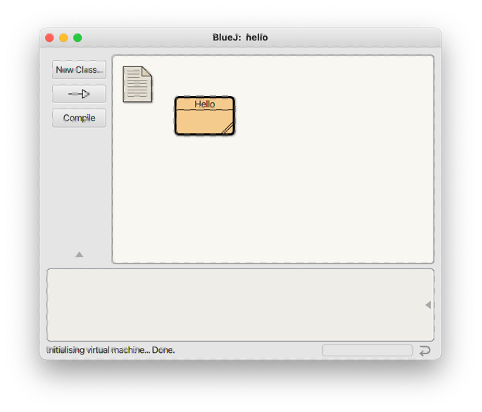
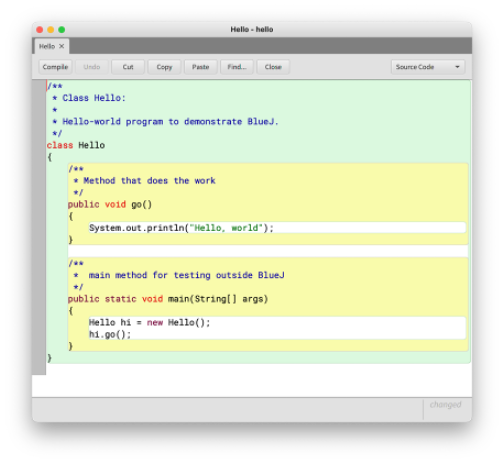
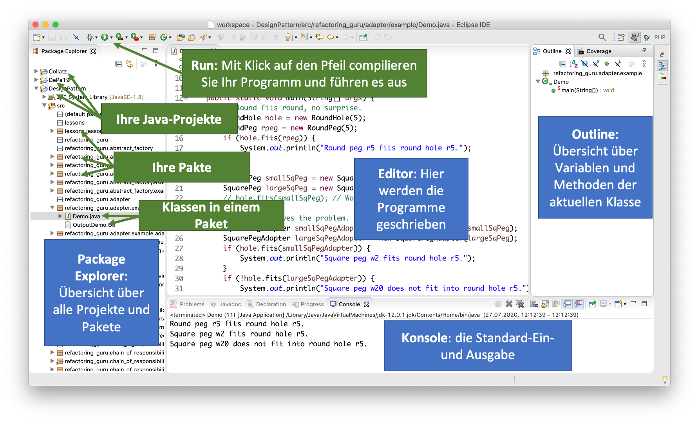

# Werkzeuge

## Literaturempfehlungen

- Joachim Goll, Cornelia Heinisch: *"Java als erste Programmiersprache. Ein professioneller Einstieg in die Objektorientierung mit Java"*,  Springer Vieweg
- Sebastian Dörn: *"Java lernen in abgeschlossenen Lerneinheiten"*, Springer Vieweg
- Dietmar Ratz, Jens Scheffler, Detlef Seese, Jan Wiesenberger: *"Grundkurs Programmieren in Java x"*, Hanser Verlag
- Kathy Sierra, Bert Bates: *"Java von Kopf bis Fuß"*, O'Reilly Verlag
- Joshua Bloch: *"Effective Java. Best practices for the Java platform"*, Pearson Education Inc.
- Robin C. Martin: *"Clean Code: A Handbook of Agile Software Craftmanship"*, Prentice Hall
- und alle Bücher für Einsteigerinnen, die Sie ansprechen...


## Java

Wir verwenden die Programmiersprache *Java*, um die Programmierkonzepte, die wir lernen und anwenden wollen, zu implementieren. 

Java besteht aus 2 Teilen:

- der *Java Run Time Environment (Java RTE)* (Java-Laufzeitumgebung)
- dem *Java Development Kit (JDK)* (die Java-Entwicklungsumgebung)

Die Java-Laufzeitumgebung ist üblicherweise bereits auf allen Rechnern installiert. Sie ist selbst ein Programm. Innerhalb dieses Programms werden Java-Programme ausgeführt. 

Das JDK müssen Sie installieren. Verwenden Sie dazu [diesen Link](https://www.oracle.com/java/technologies/javase-downloads.html) und gehen wie für Ihr Betriebssystem angegeben vor (prüfen Sie aber zunächst, ob Sie nicht eventuell bereits Beides haben - `java -version` und `javac -version` - siehe folgend). 

Testen Sie am besten auf Ihrer Konsole (Terminal), ob Ihr Java korrekt funktioniert. Zum Testen Ihrer Laufzeitumgebung geben Sie dazu

```bash
java -version
``` 

ein. Es sollte soetwas erscheinen, wie (Versionsnummern bei Ihnen sicherlich schon höher):

```bash
java version "15.0.1" 2020-10-20
Java(TM) SE Runtime Environment (build 15.0.1+9-18)
Java HotSpot(TM) 64-Bit Server VM (build 15.0.1+9-18, mixed mode, sharing)
```

Somit wissen Sie, dass die Laufzeitumgebung funktioniert. Zum Testen des JDK rufen wir am besten den Compiler (`javac`) auf:


```bash
javac -version
``` 

Es sollte soetwas erscheinen, wie (Versionsnummern bei Ihnen sicherlich schon höher):

```bash
javac 15.0.1
```

!!! success
    Sie haben nun die Java-Laufzeitumgebung installiert, in der unsere Java-Programme ausgeführt werden und Sie haben das Java Development Kit installiert. Teil des JDK ist z.B. der *Compiler*, der unsere Java-Programme in Byte-Code übersetzt. Dieser Bytecode wird in unserer Java-Laufzeitumgebung ausgeführt.

## IDE

Um unsere Programme "zu schreiben", verwenden wir eine sogenannte *Integrated Development Environment (IDE)*, eine integrierte Entwicklungsumgebung, die uns beim Programmieren unterstützt. Wir könnten unsere Programme auch mit einfachen Texteditoren schreiben, aber eine IDE unterstützt uns, indem der Programmcode geeignet hervorgehoben wird (*Syntx-Highlighting*) und uns Vorschläge für die Verwendung von Methoden und Variablen gemacht werden (*Intelligent Code Completion*). 

### BlueJ

Am Anfang verwenden wir [**BlueJ**](https://www.bluej.org/). BlueJ wird an der University of Kent (UK) entwickelt und richtet sich speziell an Programmieranfängerinnen. Das Tolle an BlueJ ist, dass die *Funktionsblöcke*, die zusammengehören, farbig hervorgehoben werden. Die Download-Seite von BlueJ befindet sich [**hier**](https://www.bluej.org/index.html). Laden Sie BlueJ herunter, **entpacken Sie das zip-File** und bewegen Sie den Ordner `BlueJ` in Ihren Programme-Ordner. Derzeit heißt der Ordner

```bash
BlueJ 5.0.2
```

In dem Ordner befindet sich die ausführbare `BlueJ`-Datei (`BlueJ.app` oder `BlueJ.exe`) und ein `examples`-Ordner. 

1. Öffnen Sie `BlueJ` durch Doppelklick auf die ausführbare `BlueJ`-Datei.
2. Wählen Sie im Menü `Project --> Open Project...`. Klicken Sie zum `examples`-Ordner und wählen Sie das Projekt `hello` und öffnen Sie es. BlueJ sieht dann so aus:



Klicken Sie mit der **rechten** Maustaste auf das gelbe Rechteck `Hello` und wählen Sie im Menü `Open editor` aus. Es erscheint folgendes Fenster: 



Klicken Sie in diesem Fenster auf den Button `Compile`. Es sollte folgendes Fenster erscheinen: 


!!! success
    Sie haben BlueJ erfolgreich installiert und die Java-Programme werden übersetzt (compiliert).


### Eclipse

Nachdem wir anfangs alle BlueJ verwenden, sind Sie danach in der Wahl Ihrer IDE frei. Wir verwenden [**Eclipse**](https://www.eclipse.org/). Eclipse ist in Java geschrieben und Open-Source. Den Download-Link für Eclipse finden Sie [hier](https://www.eclipse.org/downloads/). Es gibt verschiedene Versionen von Eclipse, wir verwenden die *Eclipse IDE for Java Developers*. Installieren Sie Eclipse am besten in ihren *Applications* oder *Programme* Ordner. 

1. Starten Sie Eclipse durch Doppelklick auf das Programmsymbol.
2. Erstellen Sie einen *Workspace* (Arbeitsbereich) in einem gewünschten Ordner (z. B.
Programmieren) im Dateisystem. Achten Sie darauf, dass Sie Schreibrechte in diesem Ordner besitzen.
3. Anlegen eines Projektordners:
	* Auswahl im Menü `File-->New-->Java Project`.
	* Eingabe des `Project name:` Name des Projektes (z.B. *WiSe20* oder *Uebung1* oder *Aufgabe2*). Wenn Sie gefragt werden, ob Sie ein `module-info.java` erstellen wollen, wählen Sie `Don't create`.
	* Klicken auf den Button `Finish`.
4. Erstellen eines neuen Packages (Paketes):
	* Öffnen der Projektmappe im `Package Explorer`.
	* Auswahl des Ordners `src` mit der rechten Maustaste.
	* Auswahl des Menüpunktes `New --> Package`.
	* Geben Sie einen Paketnamen ein (Paketnamen werden kleingeschrieben), z.B. `themen.start`.
5. Erstellen einer neuen Klasse:
	* Öffnen der Projektmappe im Package Explorer.
	* Auswahl des Paketes (z.B. `themen.start`) mit der rechten Maustaste.
	* Auswahl des Menüpunktes `New --> Class`.
	* Eingabe eines beliebigen Namens, der gleichzeitig der Klassen- und Dateiname ist (z.B. `HelloFIW`). Klassennamen werden immer groß geschrieben.
	* Setzen des Häkchens bei `public static void main()`.
	* Klicken auf den Button `Finish`.

Die folgende Abbildung gibt einen Überblick über die Bedeutung der einzelnen Fenster in Eclipse:



### IntelliJ

Diejenigen von Ihnen, die nicht Eclipse verwenden, werden sich stattdessen wahrscheinlich für [**IntelliJ**](https://www.jetbrains.com/de-de/idea/) entscheiden. Das ist völlig in Ordnung. IntelliJ ist von JetBrains, einem tschechischen Unternehmen, und derzeit die wohl modernste IDE auf dem Markt, nicht nur für Java- sondern auch für Web-Entwicklungen. IntelliJ ist nicht Open-Source und ist kostenpflichtig. Mit einer Hochschullizenz erhalten Sie jedoch kostenlosen Zugriff auf alle Enterprise-Versionen. Sie müssen sich dazu bei JetBrains mit Ihrer HTW-Adresse registrieren. 

### Visual Studio Code

Wer gerne mit Microsoft-Produkten arbeitet, kann auch gerne [**Visual Studio Code**](https://code.visualstudio.com/docs/java/java-tutorial) (*VS Code*) arbeiten. Das ist auch eine sehr gute IDE und ebenfalls nicht nur zur Nutzung für die Java-Entwicklung, sondern auch für Web- und App-Entwicklungen geeignet. Spätestens im dritten Semster in *WebTech* werden die meisten von Ihnen entweder auf IntelliJ oder VS Code wechseln. 


## Weitere nützliche Werkzeuge

### Windows: gitBash

Das Terminal (`cmd`) in Windows ist nicht so gut. Installieren Sie sich lieber die [**GitBash für Windows**](https://gitforwindows.org/). Unter Downloads öffnet sich das GitHub-Repository für Git. Aktuell wählen Sie dort [**Git-2.29.2-64-bit.exe**](https://github.com/git-for-windows/git/releases/download/v2.29.2.windows.1/Git-2.29.2-64-bit.exe) und folgen dann den Installationsanweisungen. 

## Online-Kurse

* SoloLearn [https://www.sololearn.com/Course/Java/](https://www.sololearn.com/Course/Java/)
* JetBrains Academy [https://hyperskill.org/tracks/1](https://hyperskill.org/tracks/1)
