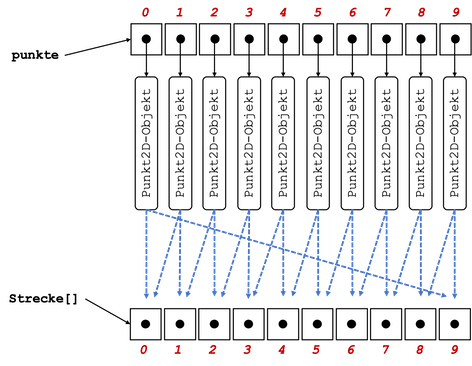

# Übungen

## Übungsblätter (wochenweise)


??? note "Übung 1 (20.10.2021)"

	**Vorbereitung**

	1. Installieren Sie - falls noch nicht geschehen - das Java Davelopment Kit (JDK) (siehe [**Java**](../tools/#java)).
	2. Installieren Sie BlueJ (siehe [**IDE**](../tools/#bluej)). 
	3. Starten Sie BlueJ und öffnen Sie (`Project --> Open Project...`) das Projekt `picture` (im BlueJ-Ordner unter `examples`). Klicken Sie dann den `Compile`-Button.
	4. Klicken Sie mit der rechten Maustaste auf die Klasse `Picture` (das orangene Kästchen mit der Beschriftung `Picture`) und erzeugen Sie davon ein Objekt `picture1`. 
	5. Klicken Sie mit der rechten Maustaste auf das Objekt `picture1` und rufen Sie die Methode `draw()` auf. 
	6. Klicken Sie erneut mit der rechten Maustaste auf die Klasse `Picture` und öffnen Sie den Editor mit `Open Editor`. Es erscheint das Java-Programm (der *Quellcode*) der Klasse `Picture`:
	=== "Picture.java"
		```java linenums="1"
				
		/**
		 * This class represents a simple picture. You can draw the picture using
		 * the draw method. But wait, there's more: being an electronic picture, it
		 * can be changed. You can set it to black-and-white display and back to
		 * colors (only after it's been drawn, of course).
		 *
		 * This class was written as an early example for teaching Java with BlueJ.
		 * 
		 * @author  Michael Kölling and David J. Barnes
		 * @version 1.1  (24 May 2001)
		 */
		public class Picture
		{
		    private Square wall;
		    private Square window;
		    private Triangle roof;
		    private Circle sun;

		    /**
		     * Constructor for objects of class Picture
		     */
		    public Picture()
		    {
		        // nothing to do... instance variables are automatically set to null
		    }

		    /**
		     * Draw this picture.
		     */
		    public void draw()
		    {
		        wall = new Square();
		        wall.moveVertical(80);
		        wall.changeSize(100);
		        wall.makeVisible();

		        window = new Square();
		        window.changeColor("black");
		        window.moveHorizontal(20);
		        window.moveVertical(100);
		        window.makeVisible();

		        roof = new Triangle();
		        roof.changeSize(50, 140);
		        roof.moveHorizontal(60);
		        roof.moveVertical(70);
		        roof.makeVisible();

		        sun = new Circle();
		        sun.changeColor("yellow");
		        sun.moveHorizontal(180);
		        sun.moveVertical(-10);
		        sun.changeSize(60);
		        sun.makeVisible();
		    }

		    /**
		     * Change this picture to black/white display
		     */
		    public void setBlackAndWhite()
		    {
		        if(wall != null)   // only if it's painted already...
		        {
		            wall.changeColor("black");
		            window.changeColor("white");
		            roof.changeColor("black");
		            sun.changeColor("black");
		        }
		    }

		    /**
		     * Change this picture to use color display
		     */
		    public void setColor()
		    {
		        if(wall != null)   // only if it's painted already...
		        {
		            wall.changeColor("red");
		            window.changeColor("black");
		            roof.changeColor("green");
		            sun.changeColor("yellow");
		        }
		    }

		}

		```
			Wir schauen uns diese Klasse ein wenig genauer an und diskutieren einige Details (Objektvariablen, Objektmethoden, Kommentare, ...).

	**Durchführung**

	1. Für diese Übung interessiert uns nur die Methode `draw()`. Die Methodenaufrufe, die wir bis jetzt immer einzeln vorgenommen haben, werden nun "aufgeschrieben" - wir **programmieren**!
	2. Ändern Sie Farben und Positionen der einzelnen Objekte!
	3. Wenn Sie Ihre Änderungen ausprobieren wollen, müssen Sie die Klasse neu `compilieren`. Durch das `Compilieren` gehen die erzeugten Objekte verloren. Warum ist das wohl so?
	4. Lassen Sie die Sonne langsam untergehen. Welche Objektmethode kommt dafür infrage? Für welches Objekt muss diese Objektmethode aufgerufen werden?

	**Tipp:** 

	1. Derzeit ist es recht mühsam, die Änderungen zu testen. Wir müssen die Klasse `Picture` compilieren, dann ein Objekt dieser Klasse erzeugen und dann für dieses Objekt die Methode `draw()` aufrufen. Wir wollen diesen Vorgang etwas vereinfachen und erstellen uns dazu eine *Testklasse*. 
	2. Klicken Sie mit der rechten Maustaste auf die Klasse `Picture` und wählen Sie `Create Test Class` aus. 
	3. Klicken Sie mit der rechten Maustaste auf diese neue Testklasse `PictureTest` und wählen Sie `Create Test Method ...` aus. 
	4. Geben Sie als Namen für diese Testmethode `drawTest` an und bestätigen Sie die Eingabe mit `OK`. 
	5. Nun wird ein Test "aufgenommen". Klicken Sie mit der rechten Maustaste auf die Klasse `Picture` und erzeugen Sie von dieser Klasse eine Objekt `picture1`. Für dieses Objekt rufen Sie die `draw()`-Methode auf. Klicken Sie dann im Hauptfenster auf der linken Seite unter `recording` den Button `End`. Sie haben nun einen Test erzeugt, den Sie leicht aufrufen können. 
	6. Ändern Sie Ihre `draw()`-Methode, compilieren Sie die Klasse `Picture` und wählen Sie nun mit der rechten Maustaste für die Klasse `PictureTest` die Methode `drawTest()` aus und rufen diese auf. 


??? note "Übung 2 (27.10.2021)"
	1. Öffnen Sie `BlueJ` und erstellen Sie ein neues Projekt `uebung2`. 
	2. Erstellen Sie darin eine Klasse `Uebung2`. 
	3. Ersetzen Sie den gesamten Code der Klasse `Uebung2` durch folgenden Code:
		```java 
		public class Uebung2
		{
		    public Uebung2()
		    {
		        
		    }

		    public void printLesson2()
		    {
		        // Schreiben Sie Ihren gesamten Code in diese Methode
		        // und fuehren Sie diese Methode aus
		        
		    }
		}
		```
	3. Deklarieren und initialisieren Sie in der `printLesson2()`-Methode jeweils eine Variable mit dem Datentyp `int`, `long`, `char`, `byte`, `short`, `float`, `double`, `boolean` und `String`. Geben Sie alle Werte einzeln durch Aufruf der `println()`-Methode aus. Erzeugen Sie dabei folgende Ausgabe (Werte nur Beispiele):
	```bash
	Wert vom Typ int 		: 	123
	Wert vom Typ long 		: 	456789
	Wert vom Typ char 		: 	a
	Wert vom Typ byte 		: 	127
	Wert vom Typ short 		: 	32767
	Wert vom Typ float 		: 	4.23
	Wert vom Typ double		: 	6.98
	Wert vom Typ boolean	: 	true
	Wert vom Typ String		: 	Hallo!
	```
	4. Setzen Sie den Wert Ihrer `int`-Variablen auf `2147483647`. Geben Sie den Wert auf der Konsole aus, z.B.:	
	```bash
	Wert von i 	: 	2147483647
	```
	Erhöhen Sie nun den Wert der Variablen um `1` und geben Sie den Wert erneut aus. Was passiert? Warum?
	5. Wiederholen Sie das gleiche mit einer `long-Variablen.
	6. Weisen Sie Ihrer `char`-Variablen den Wert `65` zu. Geben Sie den Wert Ihrer `char`-Variablen aus. Was passiert? Warum?
	7. Deklarieren Sie zwei weitere `int`-Variablen und weisen Sie diesen Variablen Werte zu. Erzeugen Sie unter Verwendung der Werte dieser beiden Variablen folgende Ausgabe (wir nehmen an, die beiden Werte sind `17` und `4`):
	```bash 
	17 geteilt durch 4 ergibt 4. Es bleibt ein Rest von 1
	```
	Ändern Sie das Programm so, dass bei einer ganzzahligen Division ohne Rest die Ausgabe in der Form ist (z.B. für die Werte `16` und `4`): 
	```bash
	16 geteilt durch 4 ergibt 4 ohne Rest.
	```
	8. Fügen Sie (mindestens) zwei weitere Anweisungen hinzu, sodass mit Hilfe der `println()`-Methode folgende Ausgaben (für die Beispielwerte `17` und `4`) erscheinen: 
	```bash 
	17/4 = 4
	17 mod 4 = 1
	```


??? question "Eine mögliche Lösung für Übung 2"
	```java
	public class Uebung2
	{
	    public Uebung2()
	    {
	        
	    }

	    public void printLesson2()
	    {
	        // Schreiben Sie Ihren gesamten Code in diese Methode
	        // und fuehren Sie diese Methode aus

	        int in = 123;
			long lo = 456789;
			char ch = 'a';
			byte by = 127;
			short sh = 32767;
			float fl = 4.23f;
			double d1 = 6.98;
			boolean b1 = true;
			String s1 = "Hallo!";
			
			System.out.println(" --- Aufgabe 3 -------");
			System.out.println();
			System.out.println("Wert vom Typ int     : " + in );
			System.out.println("Wert vom Typ long    : " + lo );
			System.out.println("Wert vom Typ char    : " + ch );
			System.out.println("Wert vom Typ byte    : " + by );
			System.out.println("Wert vom Typ short   : " + sh );
			System.out.println("Wert vom Typ float   : " + fl );
			System.out.println("Wert vom Typ double  : " + d1 );
			System.out.println("Wert vom Typ boolean : " + b1 );
			System.out.println("Wert vom Typ String  : " + s1 );
			
			System.out.println();
			System.out.println(" --- Aufgabe 4 -------");
			System.out.println();
			in = 2147483647;
			System.out.println("Wert vom Typ int     : " + in );
			in = in + 1;		// in++;
			System.out.println("Wert vom Typ int     : " + in );
			
			System.out.println();
			System.out.println(" --- Aufgabe 5 -------");
			System.out.println();
			lo = 2147483647L;
			System.out.println("Wert vom Typ long    : " + lo );
			lo = lo +1 ;
			System.out.println("Wert vom Typ long    : " + lo );
			
			System.out.println();
			System.out.println(" --- Aufgabe 6 -------");
			System.out.println();
			ch = 65;
			System.out.println("Wert vom Typ char    : " + ch );
			
			System.out.println();
			System.out.println(" --- Aufgabe 7 -------");
			System.out.println();
			int nr1 = 17;
			int nr2 = 4;
			int quotient = nr1 / nr2;
			int rest = nr1 % nr2;
			if(rest==0)
			{
				System.out.println(nr1 + " geteilt durch " + nr2 + " ergibt " + quotient + " ohne Rest.");
			}
			else
			{
				System.out.println(nr1 + " geteilt durch " + nr2 + " ergibt " + quotient 
					+ ". Es bleibt ein Rest von " + rest);
			}
			
			System.out.println();
			System.out.println(" --- Aufgabe 8 -------");
			System.out.println();
			int number1 = 17;
			int number2 = 4;
			int result = number1 / number2;
			System.out.println(number1 + "/" + number2 + " = " + result);
			
			int rest = number1 % number2;
			System.out.println(number1 + " mod " + number2 + " = " + rest);
		}
	}
	```


??? note "Übung 3 (3.11.2021)"
	1. Öffnen Sie `BlueJ` und erstellen Sie ein neues Projekt `uebung3`. 
	2. Erstellen Sie darin eine Klasse `Uebung3`. 
	3. Ersetzen Sie den gesamten Code der Klasse `Uebung3` durch folgenden Code:
		```java 
		public class Uebung3
		{
		    public Uebung3()
		    {
		        
		    }

		    public void myLesson3Method()
		    {
		        // Definieren Sie alle Ihre Methoden außerhalb dieser Methode
		        // Rufen Sie alle Ihre Methoden hier auf
		        
		    }
		}
		```
	3. Schreiben Sie eine Umrechnung für eine gegebene Anzahl von Sekunden (`printSeconds(int seconds)`), z.B. `printSeconds(3456789)`:
		```bash
		3456789 Sekunden sind 40 Tage, 13 Minuten, 9 Sekunden.
		```
		Aber z.B. `printSeconds(2345678)`:
		```bash
		2345678 Sekunden sind 27 Tage, 3 Stunden, 34 Minuten, 38 Sekunden.
		```
		Aber z.B. `printSeconds(123456)`:
		```bash
		123456 Sekunden sind 1 Tag, 10 Stunden, 17 Minuten, 36 Sekunden.
		```
		Aber z.B. `printSeconds(12345)`:
		```bash
		12345 Sekunden sind 3 Stunden, 25 Minuten, 45 Sekunden.
		```
	4. Die `printSeconds()`-Methode gibt selbst etwas aus. Welchen Rückgabetyp hat sie? Schreiben Sie eine weitere Methode `computeSeconds(int seconds)`, die genau die gleiche Funktionalität hat, aber den Ausgabestring nicht auf die Konsole ausgibt, sondern zurück. 
	5. Wie könnten (und sollten!) Sie die `computeSeconds()`-Methode in der `printSeconds()`-Methode verwenden? Warum?


??? question "Eine mögliche Lösung für Übung 3"
	```java
	public class Uebung3
		{
		    public Uebung3()
		    {
		        
		    }

		    public void printSeconds(int seconds)
			{
				int minute = 60;
				int hour = 60 * minute;		// 3600
				int day = 24 * hour;		// 86400
				
				int days = seconds / day;
				int remainingSeconds = seconds - (days * day);
				int hours = remainingSeconds / hour;
				remainingSeconds = remainingSeconds - (hours * hour);
				int minutes = remainingSeconds / minute;
				remainingSeconds = remainingSeconds - (minutes * minute);
				
				/*
				System.out.println(seconds + " Sekunden sind " + days + " Tage, " 
				+ hours + " Stunden, " + minutes + " Minuten, " + remainingSeconds + " Sekunden.");
				 */
				
				String output = seconds + " Sekunden sind ";
				if(days==1)
				{
					output = output + " 1 Tag, ";
				}
				else
				{
					if(days > 1)
					{
						output = output + days + " Tage, ";
					}
				}
				if(hours==1)
				{
					output = output + " 1 Stunde, ";
				}
				else
				{
					if(hours > 1)
					{
						output = output + hours + " Stunden, ";
					}
				}
				if(minutes==1)
				{
					output = output + " 1 Minute, ";
				}
				else
				{
					if(minutes > 1)
					{
						output = output + minutes + " Minuten, ";
					}
				}
				if(remainingSeconds==1)
				{
					output = output + " 1 Sekunde.";
				}
				else
				{
					if(remainingSeconds > 1)
					{
						output = output + remainingSeconds + " Sekunden.";
					}
				}
				System.out.println(output);
			}

			public void myLesson3Method()
		    {
				printSeconds(3456789);
				printSeconds(2345678);
				printSeconds(123456);
				printSeconds(12345);        
		    }
	}
	```


??? note "Übung 4 (10.11.2021)"
	1. Öffnen Sie `BlueJ` und erstellen Sie ein neues Projekt `uebung4`. 
	2. Erstellen Sie darin eine Klasse `Uebung4`. 
	3. Ersetzen Sie den gesamten Code der Klasse `Uebung4` durch folgenden Code:
		```java 
		public class Uebung4
		{
		    public Uebung4()
		    {
		        
		    }

		    public void myLesson4Method()
		    {
		        // Definieren Sie alle Ihre Methoden außerhalb dieser Methode
		        // Rufen Sie alle Ihre Methoden hier auf
		        
		    }
		}
		```
	4. Schreiben Sie eine Methode `isPrime(int number)`, die ein `true` zurückgibt, wenn `number` eine Primzahl ist und ein `false`, wenn nicht. Eine Primzahl ist eine natürliche Zahl größer als `1`, die nur durch `1` und sich selbst teilbar ist.   
	5. Schreiben Sie eine Methode `printprimeNumbers(int maximum)`, die alle Primzahlen von `1` bis einschließlich `maximum` wie folgt auf der Konsole ausgibt (Bsp. für `maximum=61`):
		```bash
		Zahl : 61
		.2 3 .5 .7 ...11 .13 ...17 .19 ...23 .....29 .31 .....37 ...41 .43 ...47 .....53 .....59 .61
		```
		d.h. es werden die Zahlen, die Primzahlen sind, ausgegeben und für die anderen Zahlen erscheint nur ein Punkt. Verwenden Sie in der Methode `printPrimenumbers(int)` die Methode `isPrime(int)`.

	***Zusatzaufgabe (gute Wiederholung/Vertiefung von Übung 3)***

	1. Schreiben Sie eine Methode `isLeapYear(int year)`, die ein `true` zurückgibt, wenn `year` ein Schaltjahr ist und ein `false`, wenn nicht. Ein Jahr ist ein Schaltjahr, wenn die Jahreszahl durch `4` teilbar ist, aber nicht durch `100`, außer sie ist durch `400` teilbar. 
	2. Schreiben Sie eine Methode `printleapYear(int year)`, die für `year` auf die Konsole ausgibt (Beispielwerte):
		```bash
		2021 ist kein Schaltjahr. 
		2020 war ein Schaltjahr. 
		2000 war ein Schaltjahr. 
		2024 wird ein Schaltjahr.
		2025 wird kein Schaltjahr.
		```


??? question "Eine mögliche Lösung für Übung 4"
	```java
		
	public class Uebung4
	{
	    public Uebung4()
	    {

	    }
	    
	    public boolean isPrime(int number)
	    {
	        if(number>1)
	        {
	            for (int i=2;i<number;i++)
	            {
	                if(number%i==0) //ob i number ganzzahlig teilt (Division ohne Rest)
	                {
	                    return false;
	                }
	            }
	            return true;
	        }
	        else 
	        {
	            return false;
	        }
	    }
	    
	    public void myLesson4Method()
	    {
	        //System.out.println(isPrime(1)); 
	        printPrimeNumbers(61);
	    }
	    
	    public void printPrimeNumbers(int maximum)
	    {
	        for (int i=2;i<=maximum;i++)
	            {
	                if(isPrime(i)) 
	                {
	                    System.out.print(i+" ");
	                }
	                else
	                {
	                    System.out.print(". ");
	                }
	            }
	    }
	}
	```

??? note "Übung 5 (17.11.2021)"
	1. Öffnen Sie `BlueJ` und erstellen Sie ein neues Projekt `uebung5`. 
	2. Erstellen Sie darin eine Klasse `Uebung5`. 
	3. Ersetzen Sie den gesamten Code der Klasse `Uebung5` durch folgenden Code:
		```java 
		public class Uebung5
		{
		    public Uebung5()
		    {
		        
		    }

		    public void start()
		    {
		        // Definieren Sie alle Ihre Methoden außerhalb dieser Methode
		        // Rufen Sie alle Ihre Methoden hier auf
		        
		    }
		}
		```
	4. Wir schreiben uns zwei Methoden, die mathematische Funktionen umsetzen. Die eine Funktion berechnet die Potenz `base^exp` und die andere Funktion bereechnet die Quadratwurzel einer Zahl. Ziel der Übung ist es insbesondere, uns vorab die algorithmische Idee zu überlegen. Programmieren Sie also nicht gleich los, sondern überlegen Sie gemeinsam, wie Sie die beiden Funktionen umsetzen wollen!
	5. Schreiben Sie eine Methode `public double pow(int base, int exp)`. Dabei steht `pow` für *power*. Es soll `base^exp` berechnet werden. Überlegen Sie sich zunächst z.B.:
		- Wenn `exp` positiv ist, dann wollen wir `base * base * ... * base` berechnen, wobei `base` `exp` oft miteinander multipliziert wird. Welche Kontrollstruktur verwenden wir? Was sind die einzelnen "Teile" dieser Kontrollstruktur?
		- Wir müssen uns irgendwie das `product` dieser Multiplikationen merken. Wie ist der initiale Wert von `product` und warum?
		- Funktioniert Ihre Idee auch, wenn `exp` den Wert `0` hat? Warum bzw. warum nicht?
		- Wenn `exp` negativ ist, dann ist `base^-exp = 1/(base^exp)`. Was müssen wir ändern? 
		- Warum ist der Rückgabetyp `double`? Warum nicht `int`? 
	6. Implementieren Sie eine Methode `public void printPow(int base, int exp)`, um Werte der Methodenaufrufe von `pow()` auf die Konsole auszugeben! Rufen Sie `printPow(int base, int exp)` in `start()` auf!

	***Zusatzaufgabe (falls noch Zeit ist)***

	1. Schreiben Sie eine Methode `public double sqrt(int number)`, die die Quadratwurzel der Zahl `number` berechnet. Wir verfolgen dabei folgende Idee ([Heron-Verfahren](https://de.wikipedia.org/wiki/Heron-Verfahren)):
		- Wir stellen uns ein Rechteck vor, dessen Seitenlängen `number` und `1` sind. Die Fläche dieses Rechtecks ist also `number`. Nun versuchen wir, aus diesem Rechteck ein Quadrat zu machen (rein virtuell natürlich). Der Flächeninhalt von diesem Quadrat soll `number` sein/bleiben. Ein Quadrat mit dem Flächeninhalt `numbeer` hat die Seitenlängen `sqrt(number)`, also das, was wir wollen. 
		- Um aus dem Rechteck ein Quadrat zu machen, gehen wir schrittweise vor: die eine Seite des Rechteckes/Quadrates wird der Mittelwert aus den Seiten des Rechtecks. Nun berechnen wir die andere Seite indem wir den Flächeninhalt des Rechtecks (`number`) durch die neue Seitenlänge teilen. Somit haben wir 2 neue Seitenlängen, das Rechteck behält aber den Flächeninhalt `number`. 
		- Wir berechnen erneut die neue Seitenlänge des Rechtecks, indem wir den Mittelwert der beiden Seitenlängen berechnen und ermitteln dann wieder die andere Seitenlänge, indem wir den Flächeninhalt durch die Seitenlänge teilen. Die beiden Seitenlängen nähern sich dann zunehmend an und sind irgendwann fast identisch, also ein Quadrat. 
		- Wie lange müssen wir das wiederholen? Was ist am Ende unser Ergebnis? Von welchem Datentyp sollten die Seitenlängen sein?
		- Überlegen Sie sich das Vorgehen genau, ehe Sie programmieren!
		- Beispiel zur Berechnung der Wurzel aus 8:

			{ width="250" }

	2. Implementieren Sie eine Methode `public void printSqrt(int number)`, um Werte der Methodenaufrufe von `sqrt()` auf die Konsole auszugeben! Rufen Sie `printSqrt(int number)` in `start()` auf!


??? question "Eine mögliche Lösung für Übung 5"
	```java
	public class Uebung5
	{
	    public double pow(int base, int exp)
	    {
	        double product = 1.0;
	        if(exp < 0)
	        {
	            for(int nr = 1; nr <= -exp; nr++)   // -exp !
	            {
	                product = product * base;
	            }
	            product = 1.0 / product;
	        }
	        else
	        {
	            for(int nr = 1; nr <= exp; nr++)
	            {
	                product = product * base;
	            }
	        }
	        return product;
	    }
	    
	    public double powDifferentSolution(int base, int exp)
	    {
	        double product = 1.0;
	        int copyExp = exp;
	        if(exp < 0)
	        {
	            copyExp = -exp;
	        }
	        for(int nr = 1; nr <= copyExp; nr++)
	        {
	            product = product * base;
	        }
	        if(exp < 0)
	        {
	            product = 1.0 / product;
	        }
	        return product;
	    }
    
	    public double sqrt(int number)
	    {
	        double area = number;
	        double a = number;
	        double b = 1.0;
	        double epsilon = 0.00000001;
	        
	        while( (a-b)*(a-b) > epsilon )
	        {
	            a = (a+b)/2.0;
	            b = area/a;
	        }
	        return a;
	    }
	    
	    public void start()
	    {
	        int base = 2;
	        int exp = 4; 
	        double result = pow(base, exp);
	        System.out.println(base + "^" + exp + " = " + result);
	        
	        base = 2;
	        exp = 0; 
	        result = pow(base, exp);
	        System.out.println(base + "^" + exp + " = " + result);
	        
	        base = 2;
	        exp = -4; 
	        result = pow(base, exp);
	        System.out.println(base + "^" + exp + " = " + result);
	        
	        base = -2;
	        exp = 4; 
	        result = pow(base, exp);
	        System.out.println(base + "^" + exp + " = " + result);
	        
	        base = -2;
	        exp = -4; 
	        result = pow(base, exp);
	        System.out.println(base + "^" + exp + " = " + result);
	               
	        base = -2;
	        exp = 3; 
	        result = pow(base, exp);
	        System.out.println(base + "^" + exp + " = " + result);       
	                
	        base = -2;
	        exp = -3; 
	        result = pow(base, exp);
	        System.out.println(base + "^" + exp + " = " + result);

	        System.out.println(sqrt(4));       
        	System.out.println(sqrt(8));       
        	System.out.println(sqrt(2));
	    }
	}

	```		

	
??? note "Übung 6 (24.11.2021)"
	
	1. Öffnen Sie `BlueJ` und erstellen Sie ein neues Projekt `uebung6`. 
	2. Erstellen Sie darin eine Klasse `Konto`. 
	3. Erstellen Sie eine Testklasse `KontoTest` und fügen Sie darin folgende Methode ein:
		```java

	    @Test
	    public void testKonto()
	    {
	        // hier die Kontoobjekte erzeugen
	        // und die Objektmethoden anwenden
	    }
		```	
	4. Erstellen Sie in der Klasse `Konto` zwei Objektvariablen
		- `guthaben` vom Typ `double` --> nur in der Klasse sichtbar!
		- `pin` vom Typ `int`	--> ebenfalls nur in der Klasse sichtbar!
	5. Erstellen Sie in der Klasse `Konto` einen Konstruktor für `Konto`
		- diesem Konstruktor wird als Parameter `int pPin` übergeben
		- mit dem Wert des Parameters wird innerhalb des Konstruktors der Wert von `pin` initialisiert
		- Initialisieren Sie im Konstruktor auch die Objektvariable `guthaben`. Sie bekommt den Wert `0.0` (hierfür haben wir also keinen Parameter, wir setzen den initialen Wert einfach generell auf `0.0`)
	6. Erstellen Sie in der Klasse `Konto` eine Objektmethode `einzahlen(double betrag)`
		- diese Objektmethode ist `public` und gibt nichts zurück
		- in dieser Methode wird der Wert der Objektvariablen `guthaben` um den Wert von `betrag` erhöht
		- erzeugen Sie in dieser Methode außerdem eine Ausgabe in der Form:
			```bash
			Es wurden 100,00 Euro eingezahlt.
			```
			falls der `betrag` den Wert `100.0` hatte. Die Formatierung des Betrages wird bei Ihnen anders aussehen - siehe dazu auch **Zusatzaufgabe**.
	7. Geben Sie in der `testKonto()`-Methode der Testklasse `KontoTest` ein:
		```java
		Konto k1 = new Konto(1234);
		
		k1.einzahlen(100.0);
		k1.einzahlen(50.0);
		k1.einzahlen(150.0);
		```
		und führen Sie die `testKonto()`-Methode aus. Es sollten folgende Ausgaben erzeugt werden:
		```bash
		Es wurden 100,00 Euro eingezahlt.
		Es wurden 50,00 Euro eingezahlt.
		Es wurden 150,00 Euro eingezahlt.
		```
	8. Erstellen Sie in der Klasse `Konto` eine Objektmethode `kontoauszug(int pPin)`
		- diese Objektmethode ist `public` und gibt nichts zurück
		- einen `kontoauszug(int pPin)` können Sie nur "ziehen", wenn der Parameterwert von `pPin` mit dem Wert der Objektvariablen `pin` übereinstimmt
		- wird der richtige Wert für die `pin` übergeben, geben Sie das `guthaben` in der folgenden Form aus:
			```bash
			Ihr aktuelles Guthaben betraegt 300,00 Euro.
			```
			falls `guthaben` den Wert von `300.0` hat. 
		- wird ein falscher Wert für die `pin` übergeben, geben Sie folgende Ausgabe aus:
			```bash
			Falsche PIN!
			```
	9. Erweitern Sie die `testKonto()`-Methode der Testklasse um folgende Anweisungen:
		```java
		k1.kontoauszug(1235); 		// Falsche PIN!
		k1.kontoauszug(1234); 	
		``` 
		und führen Sie die `testKonto()`-Methode aus. Es sollten folgende (weitere) Ausgaben erzeugt werden:
		```bash
		Falsche PIN!
		Ihr aktuelles Guthaben betraegt 300,00 Euro.
		```
	10. Erstellen Sie in der Klasse `Konto` eine Objektmethode `auszahlen(int pPin, double betrag)`
		- diese Objektmethode ist `public` und gibt nichts zurück
		- es kann nur etwas ausgezahlt werden, wenn der Parameterwert von `pPin` mit dem Wert der Objektvariablen `pin` übereinstimmt
		- stimmen die Werte nicht überein, geben Sie erneut 
			```bash
			Falsche PIN!
			```
			aus. 
		- stimmt der `pin`-Wert, dann müssen Sie prüfen, ob das `guthaben` reicht, um `betrag` auszuzahlen. Ist nicht genug `guthaben` vorhanden, dann geben Sie aus
			```bash
			Ihr Guthaben reicht nicht, um 400,00 Euro auszuzahlen.
			``` 
			falls `betrag` den Wert `400.0` hatte. 
		- wenn der `pin`-Wert stimmt und genug `guthaben` vorhanden ist, um den `betrag` auszuzahlen, dann reduzieren Sie `guthaben` um den entsprechenden `betrag` und geben aus
			```bash
			Es wurden 100,00 Euro ausgezahlt.
			```
			falls der `betrag` den Wert `100.0` hatte.
	11. Erweitern Sie die `testKonto()`-Methode der Testklasse um folgende Anweisungen:
		```java
		k1.auszahlen(1235, 100.0); 	// Falsche PIN!
		k1.auszahlen(1234, 100.0); 	
		k1.kontoauszug(1234); 		
		k1.auszahlen(1234, 300.0);	// Guthaben reicht nicht
		k1.auszahlen(1234, 200.0); 	
		k1.kontoauszug(1234); 	
		``` 
		und führen Sie die `testKonto()`-Methode aus. Es sollten folgende (weitere) Ausgaben erzeugt werden:
		```bash
		Falsche PIN!
		Es wurden 100,00 Euro ausgezahlt.
		Ihr aktuelles Guthaben betraegt 200,00 Euro.
		Ihr Guthaben reicht nicht, um 300,00 Euro auszuzahlen.
		Es wurden 200,00 Euro ausgezahlt.
		Ihr aktuelles Guthaben betraegt 0,00 Euro.
		```
	12. Angenommen, die gesamte Testmethode sieht jetzt so aus: 
		```java 
		@Test
		public void testKonto()
		{
		    Konto k1 = new Konto(1234);

		    k1.einzahlen(100.0);
		    k1.einzahlen(50.0);
		    k1.einzahlen(150.0);

		    k1.kontoauszug(1235);       // Falsche PIN!
		    k1.kontoauszug(1234);       

		    k1.auszahlen(1235, 100.0);  // Falsche PIN!
		    k1.auszahlen(1234, 100.0);  
		    k1.kontoauszug(1234);       
		    k1.auszahlen(1234, 300.0);  
		    k1.auszahlen(1234, 200.0);  
		    k1.kontoauszug(1234); 

		    k1.einzahlen(150.0);
		    k1.kontoauszug(1234);       
		}
		```
		dann sollte die Ausgabe ungefähr so aussehen (wahrscheinlich nur eine Stelle nach dem Komma/Punkt):
		```bash
		Es wurden 100,00 Euro eingezahlt.
		Es wurden 50,00 Euro eingezahlt.
		Es wurden 150,00 Euro eingezahlt.
		Falsche PIN!
		Ihr aktuelles Guthaben betraegt 300,00 Euro.
		Falsche PIN!
		Es wurden 100,00 Euro ausgezahlt.
		Ihr aktuelles Guthaben betraegt 200,00 Euro.
		Ihr Guthaben reicht nicht, um 300,00 Euro auszuzahlen.
		Es wurden 200,00 Euro ausgezahlt.
		Ihr aktuelles Guthaben betraegt 0,00 Euro.
		```
	12. **Zusatzaufgabe (falls noch Zeit ist):** 
		- Informieren Sie sich über die `System.out.printf()`-Methode, um stets genau 2 Stellen nach dem Komma des Betrages auszugeben (siehe [hier](../hilfsklassen/#formatierung-von-gleikommazahlen)). 


??? question "Eine mögliche Lösung für Übung 6"
	=== "Konto.java"
		```java
		public class Konto
		{
		    private double guthaben;
		    private int pin;

		    public Konto (int pin)
		    {
		        this.pin = pin;
		        this.guthaben = 0.0;
		        System.out.println("Neues Konto eroeffnet"); 	// Ausnahme, dass hier Ausgabe!!
		        												// "Das ist des Teufels"
		    }

		    public void einzahlen(double betrag)
		    {
		        this.guthaben = betrag + this.guthaben;
		        System.out.println("Es wurden " + betrag + "0 Euro eingezahlt.");
		    }
		    
		    public void auszahlen(int pin, double betrag)
		    {
		        if(pin == this.pin) // if(pin == this.pin && this.guthaben <= betrag) dann wäre es kürzer, 
		        //aber wir können nicht sehen, wo der fehler liegt, deswegen besser einzeln...)
		        {
		            if(betrag > this.guthaben)
		            {
		                System.out.println("Ihr Guthaben reicht nicht, um " + betrag + "0 Euro auszuzahlen.");
		            }
		            else
		            {
		                this.guthaben = this.guthaben - betrag;
		                System.out.println("Es wurden " + betrag + "0 Euro ausgezahlt.");
		            }
		        }
		        else
		        {
		            System.out.println("Falsche PIN!");
		        }
		    }
		    
		    public void kontoauszug(int pin)
		    {
		        if(pin == this.pin)
		        {
		            System.out.println("Ihr aktuelles Guthaben beträgt " + this.guthaben + "0 Euro.");
		        }
		        else
		        {
		            System.out.println("Falsche PIN!");
		        }
		    }
		}
		```		
	=== "KontoTest.java"
		```java

		import static org.junit.jupiter.api.Assertions.*;
		import org.junit.jupiter.api.AfterEach;
		import org.junit.jupiter.api.BeforeEach;
		import org.junit.jupiter.api.Test;

		public class KontoTest
		{
		    @Test
		    public void testKonto()
		    {
		        Konto k1 = new Konto(1234);
		        
		        k1.einzahlen(100.0);
		        k1.einzahlen(50.0);
		        k1.einzahlen(150.0);
		        
		        k1.kontoauszug(1235);       // Falsche PIN!
		        k1.kontoauszug(1234);
		        
		        k1.auszahlen(1235, 100.0);  // Falsche PIN!
		        k1.auszahlen(1234, 100.0);  
		        k1.kontoauszug(1234);       
		        k1.auszahlen(1234, 300.0);  // Guthaben reicht nicht
		        k1.auszahlen(1234, 200.0);  
		        k1.kontoauszug(1234);
		    
		        k1.einzahlen(150.0);
		        k1.kontoauszug(1234);
		        // hier die Kontoobjekte erzeugen
		        // und die Objektmethoden anwenden
		    }

		    @Test
		    public void teststart()
		    {
		    }
		}

		```		

	
??? note "Übung 7 (1.12.2021)"
	
	1. Öffnen Sie `BlueJ` und erstellen Sie ein neues Projekt `uebung7`. 
	2. Erstellen Sie darin eine Klasse `Rectangle`. 
	3. Erstellen Sie eine Testklasse `RectangleTest` und fügen Sie darin folgende Methode ein:
		```java

	    @Test
	    public void testRectangle()
	    {
	        // hier die Rectangleobjekte erzeugen
	        // und die Objektmethoden anwenden
	    }
		```	
	4. Erstellen Sie in der Klasse `Rectangle` zwei Objektvariablen
		- `a` vom Typ `int` --> nur in der Klasse sichtbar!
		- `b` vom Typ `int`	--> ebenfalls nur in der Klasse sichtbar!
		- `a` und `b` repräsentieren die Seiten des Rechtecks. 
	5. Erstellen Sie für die Klasse `Rectangle` einen parameterlosen Konstruktor `Rectangle()`. Dieser setzt für die Seite `a` den Wert `10` und für die Seite `b` den Wert `20`.
	6. Erstellen Sie außerdem einen parametrisierten Konstruktor `Rectangle(int a, int b)`. Dieser verwendet die Werte der Parameter, um den Objektvariablen Werte zuzuweisen.
	7. Erstellen Sie eine Objektmethode `area()`, die den Flächeninhalt des Rechtecks als `int` zurückgibt. 
	8. Erstellen Sie eine Objektmethode `perimeter()`, die den Umfang des Rechtecks als `int` zurückgibt. 
	9. Erstellen Sie eine Objektmethode `toString()`, die Informationen über das Rechtecks als `String` in z.B. der folgenden Form (Beispielwerte):
		```bash
		Rectangle : ( a=10, b=20, area=200, perimeter=60 )
		```
		zurückgibt. 
	
	10. Implementieren Sie eine Objektmethode `public void print()`, die den durch `toString()` erzeugten `String` auf die Konsole ausgibt.
	11. Geben Sie in der `testRectangle()`-Methode der `RectangleTest`-Klasse ein:
		```java
		// Objekte erzeugen
		Rectangle r1 = new Rectangle();
		Rectangle r2 = new Rectangle(12, 18);
		Rectangle r3 = new Rectangle(40, 5);
		Rectangle r4 = new Rectangle(20, 10);
		Rectangle r5 = new Rectangle(11, 21);
		
		System.out.printf("%n%n--------------- print()-Methode -----------------%n%n");
		r1.print();
		r2.print();
		r3.print();
		r4.print();
		r5.print();
		```
		und rufen Sie die `testRectangle()` auf. Es sollten folgende Ausgaben erzeugt werden:
		```bash
		--------------- print()-Methode -----------------

		Rectangle : ( a=10, b=20, area=200, perimeter=60 )
		Rectangle : ( a=12, b=18, area=216, perimeter=60 )
		Rectangle : ( a=40, b= 5, area=200, perimeter=90 )
		Rectangle : ( a=20, b=10, area=200, perimeter=60 )
		Rectangle : ( a=11, b=21, area=231, perimeter=64 )
		```
	10. Erstellen Sie eine Methode `sidesAreEqual(Rectangle r)`, die ein `true` zurückgibt, wenn die Seiten des aufrufenden Objektes gleich der Seiten des Rechtecks `r` sind; `false` sonst. Sie können entscheiden, dass das Rechteck auch gedreht noch gleiche Seiten haben soll, also `a=10, b=20` ist nicht nur mit `a=10, b=20` gleich, sondern auch mit `a=20, b=10`. Wenn die Seiten ungleich sind, gibt die Methode ein `false` zurück.
	11. Erstellen Sie eine Methode `areasAreEqual(Rectangle r)`, die ein `true` zurückgibt, wenn der Flächeninhalt des aufrufenden Objektes gleich dem Flächeninhalt des Rechtecks `r` ist; `false` sonst.
	12. Erstellen Sie eine Methode `perimetersAreEqual(Rectangle r)`, die ein `true` zurückgibt, wenn der Umfang des aufrufenden Objektes gleich dem Umfang des Rechtecks `r` ist; `false` sonst.
	13. Erstellen Sie eine Methode `printComparison(Rectangle r)`, die die Vergleiche mit `r` auf die Konsole ausgibt, z.B.:
		```bash
		this      Rectangle : ( a=10, b=20, area=200, perimeter=60 ) 
		the other Rectangle : ( a=12, b=18, area=216, perimeter=60 ) 
		sides are not equal 
		areas are not equal 
		perimeters are equal 

		this      Rectangle : ( a=10, b=20, area=200, perimeter=60 ) 
		the other Rectangle : ( a=40, b= 5, area=200, perimeter=90 ) 
		sides are not equal 
		areas are equal 
		perimeters are not equal 

		this      Rectangle : ( a=10, b=20, area=200, perimeter=60 ) 
		the other Rectangle : ( a=20, b=10, area=200, perimeter=60 ) 
		sides are equal 
		areas are equal 
		perimeters are equal 

		this      Rectangle : ( a=10, b=20, area=200, perimeter=60 ) 
		the other Rectangle : ( a=11, b=21, area=231, perimeter=64 ) 
		sides are not equal 
		areas are not equal 
		perimeters are not equal 
		```
	14. Fügen Sie in der `testRectangle()`-Methode der `RectangleTest`-Klasse folgende Anweisungen hinzu:
		```java	
		System.out.printf("%n%n---------- printComparison()-Methode ------------%n%n");
		r1.printComparison(r2);
		r1.printComparison(r3);
		r1.printComparison(r4);
		r1.printComparison(r5);
		```
		und rufen Sie die `testRectangle()`-Methode auf. Es sollten folgende zusätzliche Ausgaben erzeugt werden:
		```bash
		---------- printComparison()-Methode ------------

		this      Rectangle : ( a=10, b=20, area=200, perimeter=60 ) 
		the other Rectangle : ( a=12, b=18, area=216, perimeter=60 ) 
		sides are not equal 
		areas are not equal 
		perimeters are equal 

		this      Rectangle : ( a=10, b=20, area=200, perimeter=60 ) 
		the other Rectangle : ( a=40, b= 5, area=200, perimeter=90 ) 
		sides are not equal 
		areas are equal 
		perimeters are not equal 

		this      Rectangle : ( a=10, b=20, area=200, perimeter=60 ) 
		the other Rectangle : ( a=20, b=10, area=200, perimeter=60 ) 
		sides are equal 
		areas are equal 
		perimeters are equal 

		this      Rectangle : ( a=10, b=20, area=200, perimeter=60 ) 
		the other Rectangle : ( a=11, b=21, area=231, perimeter=64 ) 
		sides are not equal 
		areas are not equal 
		perimeters are not equal 
		```


??? question "Eine mögliche Lösung für Übung 7"
	=== "Rectangle.java"
		```java
		public class Rectangle
		{
		    private int a;
		    private int b;
		    // a,b repräsentieren Seiten des Rechtecks
		    public Rectangle()
		    {
		        this.a = 10;
		        this.b = 20;
		    }

		    public Rectangle(int a, int b)
		    {
		        this.a = a;
		        this.b = b;
		    }

		    public int area()
		    {
		        return this.a * this.b;
		    }

		    public int perimeter()
		    {
		        return 2 * this.a + 2 * this.b;
		    }

		    public String toString()
		    {
		        
		        /*String output = "Rectangle : ( a=" + this.a + ",  b=" + this.b + ", area="; 
		        output = output + " this.area() + ", perimeter=" + this.perimeter() + " )"
		        */
		        String output = String.format("Rectangle : ( a=%2d, b=%2d, area=%3d, perimeter=%2d )", this.a, this.b, this.area(), this.perimeter() );
		        return output;
		    }

		    public void print()
		    {
		        System.out.println(this.toString());
		    }

		    public boolean sidesAreEqual(Rectangle r)
		    {
		        boolean equals = false;
		        if((this.a == r.a && this.b == r.b) || (this.a == r.b && this.b == r.a))
		        {
		            equals = true;
		        }
		        return equals;
		    }

		    public boolean areasAreEqual(Rectangle r)
		    {
		        return (this.area() == r.area());
		    }
		    
		    public boolean perimetersAreEqual(Rectangle r)
		    {
		        return (this.perimeter() == r.perimeter());
		    }
		    
		    public void printComparison(Rectangle r)
		    {
		        System.out.printf("%-9s %s %n", "this", this.toString());
		        System.out.printf("%-9s %s %n", "the other", r.toString());
		        if(this.sidesAreEqual(r))
		        {
		            System.out.println("sides are equal");
		        }
		        else
		        {
		            System.out.println("sides are not equal");
		        }
		        if(this.areasAreEqual(r))
		        {
		            System.out.println("areas are equal");
		        }
		        else
		        {
		            System.out.println("areas are not equal");
		        }
		        if(this.perimetersAreEqual(r))
		        {
		            System.out.println("perimeters are equal");
		        }
		        else
		        {
		            System.out.println("perimeters are not equal");
		        }
		        System.out.println();
		    }
		}
		```		
	=== "RectangleTest.java"
		```java
		import static org.junit.jupiter.api.Assertions.*;
		import org.junit.jupiter.api.AfterEach;
		import org.junit.jupiter.api.BeforeEach;
		import org.junit.jupiter.api.Test;

		public class RectangleTest
		{
		    @Test
		    public void testRectangle()
		    {
		        // Objekte erzeugen
		        Rectangle r1 = new Rectangle();
		        Rectangle r2 = new Rectangle(12, 18);
		        Rectangle r3 = new Rectangle(40, 5);
		        Rectangle r4 = new Rectangle(20, 10);
		        Rectangle r5 = new Rectangle(11, 21);

		        System.out.printf("%n%n--------------- print()-Methode -----------------%n%n");
		        r1.print();
		        r2.print();
		        r3.print();
		        r4.print();
		        r5.print();

		        System.out.printf("%n%n---------- printComparison()-Methode ------------%n%n");
		        r1.printComparison(r2);
		        r1.printComparison(r3);
		        r1.printComparison(r4);
		        r1.printComparison(r5);
		    }
		}
		```		
	
??? note "Übung 8 (8.12.2021)"
	
	1. Öffnen Sie `BlueJ` und erstellen Sie ein neues Projekt `uebung8`. 
	2. Erstellen Sie darin eine Klasse `Date`. 
	3. Erstellen Sie eine Programmklasse `Programclass` und fügen Sie darin folgende Methode ein:
		```java

	    public void start()
	    {
	        // hier die Rectangleobjekte erzeugen
		    // und die Objektmethoden anwenden
	    }

		```	
	4. Erstellen Sie in der Klasse `Date` drei Objektvariablen
		- `day` vom Typ `int` --> nur in der Klasse sichtbar!
		- `month` vom Typ `int`	--> ebenfalls nur in der Klasse sichtbar!
		- `year` vom Typ `int`	--> ebenfalls nur in der Klasse sichtbar! 

	5. Erstellen Sie für die Klasse `Date` einen parameterlosen Konstruktor `public Date()`. Dieser setzt das "Datum" auf den `1.1.1900`.
	6. Erstellen Sie außerdem einen parametrisierten Konstruktor `public Date(int day, int month, int year)`. Dieser verwendet die Werte der Parameter, um den Objektvariablen Werte zuzuweisen.
	7. Erstellen Sie eine Objektmethode `public String toString()`, die das Datum in der Form (Beispielwerte) `"1.1.1900"` als `String` zurückgibt. 
	8. Implementieren Sie eine Objektmethode `public void print()`, die den durch `toString()` erzeugten `String` auf die Konsole ausgibt.
	11. Geben Sie in der `start()`-Methode der `Programclass`-Klasse ein:
		```java
		// Date-Objekte erzeugen
		Date d1 = new Date(11, 11, 2000);
        Date d2 = new Date(20, 10, 2020);
        Date d3 = new Date();
		
		System.out.printf("%n%n--------------- print()-Methode Date -----------------%n%n");
		d1.print();
        d2.print();
        d3.print();
		```
		und rufen Sie die `start()`-Methode auf. Es sollten folgende Ausgaben erzeugt werden:
		```bash
		--------------- print()-Methode Date -----------------

		11.11.2000
		20.10.2020
		1.1.1900
		```

	10. Erstellen Sie im Projekt eine weitere Klasse `Fruit`. 
	11. Erstellen Sie in der Klasse `Fruit` zwei Objektvariablen
		- `name` vom Typ `String` --> nur in der Klasse sichtbar!
		- `expiry` vom Typ `Date`	--> ebenfalls nur in der Klasse sichtbar!

	12. Erstellen Sie für die Klasse `Fruit` einen prametrisierten Konstruktor `public Fruit(String name, Date expiry)`. Dieser verwendet die Werte der Parameter, um den Objektvariablen Werte zuzuweisen.
	13. Erstellen Sie eine Objektmethode `public String toString()`, die die Frucht in der Form (Beispielwerte) `"Banana expires on 11.11.2000"` als `String` zurückgibt. 
	14. Implementieren Sie eine Objektmethode `public void print()`, die den durch `toString()` erzeugten `String` auf die Konsole ausgibt.
	15. Geben Sie in der `start()`-Methode der `Programclass`-Klasse ein:
		```java
		// Fruit-Objekte erzeugen
		Fruit banana = new Fruit("Banana", d1);
        Fruit apple = new Fruit("Apple", d2);
        Fruit pear = new Fruit("Pear", d3);
		
		System.out.printf("%n%n--------------- print()-Methode Fruit -----------------%n%n");
		banana.print();
        apple.print();
        pear.print();
		```
		und rufen Sie die `start()`-Methode auf. Es sollten folgende Ausgaben erzeugt werden:
		```bash
		--------------- print()-Methode Fruit -----------------

		Banana expires on 11.11.2000
		Apple expires on 20.10.2020
		Pear expires on 1.1.1900
		```

	16. Erweiteren Sie die Klasse `Date` um folgende Methode `public void later(int days)`. Bei Anwendung dieser Methode soll zum aktuellen Datum die als Parameter übergebenen `days` hinzugefügt werden. Dabei ist Folgendes zu beachten:

		- Die Anzahl von `days` kann auch mehrere Jahre und mehrere Monate umfassen. Das soll eine Wiederholung von [Übung 3]() sein - aber nicht gleich dort nachgucken, sondern nochmal überlegen!
		- Wir nehmen an, dass jeder Monat nur `30` Tage hat und ein Jahr immer nur `365`.

	17. Erweiteren Sie die Klasse `Fruit` um die Methode `public Date getExpiryDate()`. 

	18. Geben Sie in der `start()`-Methode der `Programclass`-Klasse ein:
		```java
		System.out.printf("%n%n------------ later() und getExpiryDate ----------------%n%n");
        d1.later(12);
        d2.later(123);
        d3.later(1234);
        
        d1.print();
        d2.print();
        d3.print();
        
        banana.print();
        apple.print();
        pear.print();
        
        banana.getExpiryDate().later(12);
        apple.getExpiryDate().later(123);
        pear.getExpiryDate().later(1234);
        
        d1.print();
        d2.print();
        d3.print();
		```

	19. Was stellen Sie fest? Läuft etwas schief? Was sind die Probleme? Worin liegen sie begründet? Haben Sie Ideen, wie Sie diese Probleme vermeiden könnten? (*Übrings: das Thema, das wir hier ein wenig näher beleuchten, nennt sich [immutable objects](https://www.javatpoint.com/mutable-and-immutable-in-java)*)


??? question "Eine mögliche Lösung für Übung 8"
	=== "Date.java"
		```java
		public class Date
		{
		    private int day;
		    private int month;
		    private int year;
		    
		    public Date(int day, int month, int year)
		    {
		        this.day = day;
		        this.month = month;
		        this.year = year;
		    }

		    public Date()
		    {
		        this.day = 1;
		        this.month = 1;
		        this.year = 1900;
		    }
		    
		    /*
		     * Die folgende Implementierung stellt eine Möglichkeit dar, 
		     * ein späteres Datum zu bestimmen. Diese Methode ändert aber
		     * das Objekt selbst, d.h. die Werte der Objektvariablen 
		     * werden neu gesetzt. Dadurch wird das Objekt veränderlich.
		     */
		    public void later(int days)
		    {
		        int years = days / 365;
		        int remainder = days % 365;
		        int months = remainder / 30;
		        remainder = remainder % 30;
		        
		        this.year += years;
		        this.day += remainder;
		        this.month += months;
		        
		        if(this.day > 30)
		        {
		            this.month++;
		            this.day %= 30;
		        }
		        
		        if(this.month > 12)
		        {
		            this.year++;
		            this.month %= 12;
		        }
		    }
		    
		    /*
		     * Die folgende Implementierung stellt eine Möglichkeit dar, 
		     * ein späteres Datum zu bestimmen. Diese Methode ändert aber
		     * das Objekt selbst, d.h. die Werte der Objektvariablen 
		     * werden neu gesetzt. Dadurch wird das Objekt veränderlich.
		     */
		    public Date laterImmutable(int days)
		    {
		        int years = days / 365;
		        int remainder = days % 365;
		        int months = remainder / 30;
		        remainder = remainder % 30;
		        
		        // nur noch lesenden Zugriff auf die 
		        // Werte der Objektvariablen -->
		        // Werte bleiben unverändert
		        int newYears = this.year + years;
		        int newDays = this.day + remainder;
		        int newMonths = this.month + months;
		        
		        if(newDays > 30)
		        {
		            newMonths++;
		            newDays %= 30;
		        }
		        
		        if(newMonths > 12)
		        {
		            newYears++;
		            newMonths %= 12;
		        }
		        
		        return new Date(newDays, newMonths, newYears);
		    }
		    
		    public String toString()
		    {
		        return this.day + "." + this.month + "." + this.year;
		    }
		    
		    public void print()
		    {
		        System.out.println(this.toString());
		    }
		}
		```		
	=== "Fruit.java"
		```java
		public class Fruit
		{
		    private String name;
		    private Date expiry;

		    public Fruit(String name, Date expiry)
		    {
		        this.name = name;
		        this.expiry = expiry;
		        // man könnte hier überlegen, ob man wirklich die Referenz auf
		        // das übergebene Date-Objekt speichern möchte oder lieber
		        // eine eigene Kopie des Objektes erzeugen und diese speichern
		        // dazu fehlen allerdings die Getter der Date-Objektvariablen :-(
		    }

		    public String toString()
		    {
		        return this.name + " expires on " + this.expiry.toString();
		    }
		    
		    public void print()
		    {
		        System.out.println( this.toString() );
		    }
		    
		    public Date getExpiryDate()
		    {
		        return this.expiry;
		        // hier wäre es auch besser, nicht die Referenz, sondern
		        // ein neues Date-Objekt zurückzugeben
		        // dazu fehlen allerdings die Getter der Date-Objektvariablen :-(
		    }
		}
		```		
	=== "Programclass.java"
		```java
		public class Programclass
		{
		    public void start()
		    {
		        Date d1 = new Date(11, 11, 2000);
		        Date d2 = new Date(20, 10, 2020);
		        Date d3 = new Date();
		        
		        System.out.printf("%n%n--------------- print()-Methode Date -----------------%n%n");
		        d1.print();
		        d2.print();
		        d3.print();
		        
		        Fruit banana = new Fruit("Banana", d1);
		        Fruit apple = new Fruit("Apple", d2);
		        Fruit pear = new Fruit("Pear", d3);
		        
		        System.out.printf("%n%n--------------- print()-Methode Fruit -----------------%n%n");
		        banana.print();
		        apple.print();
		        pear.print();
		        
		        System.out.printf("%n%n------------ later() und getExpiryDate ----------------%n%n");
		        d1.later(12);
		        d2.later(123);
		        d3.later(1234);
		        
		        d1.print();
		        d2.print();
		        d3.print();
		        
		        banana.print();
		        apple.print();
		        pear.print();
		        
		        banana.getExpiryDate().later(12);
		        apple.getExpiryDate().later(123);
		        pear.getExpiryDate().later(1234);
		        
		        d1.print();
		        d2.print();
		        d3.print();
		    }
		}
		```		


	
??? note "Übung 9 (15.12.2021)"
	
	1. Diese Übung wird **nicht am Rechner** durchgeführt, sondern es geht um Programmverständinis und algorithmische Ideen!

	2. Zunächst ein Beispiel für eine *“Erklären Sie den folgenden Code in einem Satz”*-Aufgabe:
		```java
		if (a < b)
		{
		    System.out.print(a);
		}
		else
		{
		    System.out.print(b);
		}
		```
		Antwort: *Der kleinere Wert der Variablen a und b wird ausgegeben.*

	3. Was wird durch folgenden Code auf der Konsole ausgegeben?:
		```java
		public class PrinterClass 
		{
			public static void main ( String[] args ) 
			{
				System.out.print ( "answer=" );
				System.out.println ( 40 + 2 );
			}
		}
		```	

	4. Was wird durch folgenden Code auf der Konsole ausgegeben?:
		```java
		int number = 3;
		while (number == 3)
		{
		     System.out.print(number + " + " );
		     number++;
		}
		```	

	5. Was wird durch folgenden Code auf der Konsole ausgegeben?:
		```java
		for (int count=0; count<4; count--) 
		{
		     System.out.print(count);
		}
		```	

	6. Erklären Sie den folgenden Code in einem Satz.
		```java
		int sum = 0;
		for ( int n=1 ; n<=20 ; n++ )
		{
		      sum = sum + n; 			
		} 	
		System.out.println(sum);
		```	

	7. Erklären Sie den folgenden Code in einem Satz.
		```java
		if (a < b)
		{
			if (b < c)
			{
				System.out.println(c);
			}
			else
			{
				System.out.println(b);
			}
		}
		else if (a < c)
		{
			System.out.println(c);
		}
		else
		{
			System.out.println(a);
		}
		```	
		Welche Kombination von Werten sorgt dafür, dass `b` ausgegeben wird?

	8. Was macht der folgende Code?
		```java
		public class Student {
			private String name ;
			private int age ;

			public Student ( String name , int age ) {
				this.name = name ;
				this.age = age ;
			}

			public int getAge ( ) {
				return age ;
			}

			public int hadBirthday ( ) {
				return age = age + 1 ;
			}

			public void main ( ) {
				Student willi = new Student ( "Willi" , 25 ) ;
				willi.hadBirthday ( ) ;
				System.out.print ( willi.getAge ( ) ) ;
			}
		}
		```	

	9. Welchen Wert liefert `rect2.area( )` ?
		```java
		public class Rectangle {
		   private int x1, y1, x2, y2;

		   public Rectangle (int x1 , int y1 , int x2 , int y2) {
			this.x1 = x1;
			this.y1 = y1;
			this.x2 = x2;
			this.y2 = y2;
		   }

		   public int width() { 
		   	return this.x2 - this.x1; 
		   }

		   public int height() { 
		   	return this.y2 - this.y1; 
		   }

		   public double area() { 
		   	return this.width() * this.height(); 
		   }

		   public void main () {
				Rectangle rect1 = new Rectangle(0 , 0 , 10 , 10);
				System.out.println(rect1.area());
				Rectangle rect2 = new Rectangle(5 , 5 , 10 , 10);
				System.out.println(rect2.area());
		   }
		}
		```	

	10. Was macht der folgende Code?
		```java
		public class Vehicle {
			String producer, type;
			int topSpeed, currentSpeed;

			public Vehicle ( String p , String t , int tp ) {
				this.producer = p;
				this.type = t;
				this.topSpeed = tp;
				this.currentSpeed = 0;
			}

			public int accelerate ( int kmh ) {
				if ( ( this.currentSpeed + kmh ) > this.topSpeed ) {
					this.currentSpeed = this.topSpeed;
				} else {
					this.currentSpeed = this.currentSpeed + kmh ;
				}
				return this.currentSpeed;
			}

			public static void main (String args[ ]) {
				Vehicle v = new Vehicle ( "Audi" , "A6" , 200 ) ;
				v.accelerate ( 10 ) ;
			}
		}
		```	

	11. Was wird durch folgenden Code auf der Konsole ausgegeben?
		```java
		int iNum = 3;
		for(int iX = 0; iX < iNum; iX++)
		{
			for(int iY = 0; iY < iNum; iY++)
			{
				System.out.print("*");
			}
			System.out.println();
		}
		```	

	12. Was wird durch folgenden Code auf der Konsole ausgegeben?
		```java
		public class PrintPattern {

			public void printMethod ( int numberOfRows ) {
				for ( int row = 1 ; row <= numberOfRows ; row ++ ) {
					for ( int col = 1 ; col <= row ; col ++ ) {
						System.out.print ( '*' ) ;
					}
					System.out.println ( ) ;
				}
			}

			public void main ( ) {
				PrintPattern p = new PrintPattern();
				p.printMethod ( 3 ) ;
			}
		}
		```	

	13. Was berechnet der folgende Code?
		```java
		public int calculate ( int number1 , int number2 ) {
			int result = number1 ;
			for ( int i = 2 ; i <= number2 ; i += 1 ) {
				result = result * number1 ;
			}
			return result ;
		}
		```	

	14. Was wird durch folgenden Code auf der Konsole ausgegeben?
		```java
		int n = 4;
		for (int row=1; row<=n; row++) {
			for (int column=1; column<=n; column++) {
				if (row==1 || row==n || column==1 || column==n)
					System.out.print ("* ");
				else
					System.out.print ("  "); 				
				}
				System.out.println( );
			}
		}
		```	

	
??? note "Übung 10 (22.12.2021)"
	
	1. **Wir nutzen von nun an [Eclipse](../ide/#integrated-developmemt-environment-ide) in den Übungen und in den Vorlesungen. Bitte installieren!**
	2. Erstellen Sie ein package `uebungen.uebung10`. 
	3. Erstellen Sie in diesem package eine Klasse `Programmklasse` mit `main()`-Methode und eine Klasse `Uebung10`.
	
	4. Implementieren Sie in der Klasse `Uebung10` folgende Methoden: 
		- Implementieren Sie eine `public void print(char[] ca)`-Methode, so dass das `char[] ca` auf die Konsole ausgegeben wird. Achten Sie darauf, dass hinter dem letzten Element kein Komma steht. Testen Sie Ihre Methode auch für ein leeres Array.<br/>
		Bsp:  `print(['a', 'b', 'c', 'a', 'c', 'a', 'b', 'c'])` <br/>
		Ausgabe auf Konsole: `[a, b, c, a, c, a, b, c]`

		- Kopieren Sie die `print`-Methode vollständig und ändern Sie den Typ des Parameters von `char[]` in `int[]`. (Die Methode ist jetzt *überladen* und `print()` kann jetzt entweder ein `char[]` oder ein `int[]` übergeben werden, welches auf die Konsole ausgegeben wird.)

		- Implementieren Sie eine Methode `public char[] stringToCharArray(String s)`. Diese Methode wandelt einen `String` in ein `char[]` um, so dass jedes Zeichen des Strings im `char[]` enthalten ist. Das `char[]` wird zurückgegeben. <br/>
		Tipps: die Länge eines Strings wird mit der Objektmethode `length()` ermittelt. Die einzelnen Zeichen eines Strings können mithilfe der `charAt(index)`-Objektmethode von Strings ermittelt werden. Siehe [String](../hilfsklassen/#die-klasse-string) <br/>
		Bsp.: `stringToCharArray("hallo!")` --> `['h','a','l','l','o','!']` 

		- Implementieren Sie eine Methode `public int[] reverse(int[] iarr)`, der ein `int`-Array übergeben wird und die die Reihenfolge der Elemente des Arrays umdreht (das letzte zuerst usw.) Das neuerstellte Array wird zurückgegeben. <br/>
		Bsp.: `reverse([4,2,8,1,6,2,4,1,8])` --> `[8,1,4,2,6,1,8,2,4]`  <br/>
              `reverse([4])` --> `[4]`

     5. Erzeugen Sie in der `main()`-Methode der `Programmklasse` 
     	- ein `char`-Array mit den Werten `['a', 'b', 'c', 'a', 'c', 'a', 'b', 'c']`,
     	- ein `int`-Array mit den Werten `[4,2,8,1,6,2,4,1,8]` und
     	- ein Objekt der Klasse `Uebung10` und 
     	testen Sie alle Methoden der Klasse `Uebung10`.


??? question "Eine mögliche Lösung für Übung 10"
	=== "Programclass.java"
		```java
		package uebungen.uebung10;

		public class Programclass {

			public static void main(String[] args) 
			{
				char[] ca1 = {'a', 'b', 'c', 'a', 'c', 'a', 'b', 'c'};
				char[] ca2 = new char[0];
				
				int[] ia1 = {4,2,8,1,6,2,4,1,8};
				int[] ia2 = { 4 };
				
				Uebung10 u1 = new Uebung10();
				u1.print(ca1);
				u1.print(ca2);
				u1.print(ia1);
				u1.print(ia2);
				
				char[] ca3 = u1.stringToCharArray("Hallo FIW!");
				u1.print(ca3);
				
				int[] ia3 = u1.reverse(ia1);
				u1.print(ia1);
				u1.print(ia3);
			}
		}
		```		
	=== "Uebung10.java"
		```java
		package uebungen.uebung10;

		public class Uebung10
		{
			public void print(char[] ca)
		    {
		        String s = "[ ";
		        if(ca.length == 0)
		        {
		            s = s + "]";
		        }
		        else
		        {
		            for (int index = 0; index < ca.length - 1; index++) 
		            {
		                s = s + ca[index] + ", ";
		            }   
		            s = s + ca[ca.length - 1] + " ]";
		        }
		        System.out.println(s);
		    }
			
			public void print(int[] ia)
		    {
		        String s = "[ ";
		        if(ia.length == 0)
		        {
		            s = s + "]";
		        }
		        else
		        {
		            for (int index = 0; index < ia.length - 1; index++) 
		            {
		                s = s + ia[index] + ", ";
		            }   
		            s = s + ia[ia.length - 1] + " ]";
		        }
		        System.out.println(s);
		    }
			
			public char[] stringToCharArray(String s)
			{
				char[] ca = new char[s.length()];
				for (int index = 0; index < ca.length; index++)
				{
					ca[index] = s.charAt(index);
				}
				
				return ca;
			}
			
			public int[] reverse(int[] iarr)
			{
				int[] ia = new int[iarr.length];
				for (int index = 0; index < ia.length; index++)
				{
					ia[index] = iarr[iarr.length-1 - index];
				}
				return ia;
			}
		}
		```		
	
??? note "Übung 11 (05.01.2022)"
	
	2. Sie können einfach Ihre Lösung (die Klassen) aus Übung 10 weiterverwenden.
	
	4. Implementieren Sie in der Klasse `Uebung10` (oder wenn Sie doch eine neue Klasse `Uebung11` haben, dann darein) folgende Methoden: 
		- Implementieren Sie eine Methode `public char[] filter(char[] carr, char filter)`, der als Parameter ein `char`-Array und ein `char` übergeben wird. Die Methode soll ein `char`-Array zurückgeben, das dem als Parameter übergeben Array entspricht, außer dass jedes Vorkommen des als Parameter übergeben `carr` entfernt wurde <br/>
		Bsp: `filter(['a', 'b', 'c', 'a', 'c', 'a', 'b', 'c'], 'c')` --> `['a', 'b', 'a', 'a', 'b']`

		- Implementieren Sie eine Methode `public int[] minAndMax(int[] iarr)`, der ein `int`-Array als Parameter übergeben wird und die ein zweielementiges Array zurückgibt. Das erste Element des zurückgegeben Arrays ist das Minimum des als Parameter übergebenen Arrays und das zweite Element ist das Maximum. <br/>
		Bsp.: 	`minAndMax([4,2,8,1,6,2,4,1,8])` --> `[1,8]` <br/>
              	`minAndMax([4])` --> `[4,4]`

        - **Zusatz:** Implementieren Sie eine Methode `public boolean containsDoublets(char[] ca)` die ein `true` zurückgibt, wenn *mindestens* ein Wert in `ca` *mindestens* zwei Mal vorkommt (wenn Sie schon dabei sind, können Sie sich auch überlegen, wenn *genau* ein Wert *genau* zwei Mal vorkommt - oder *mindestens* ein Wert *genau* zwei Mal - oder *genau* ein Wert *mindestens* zwei Mal) und `false` sonst.

     5. Erzeugen Sie in der `main()`-Methode der `Programmklasse` 
     	- ein `char`-Array mit den Werten `['a', 'b', 'c', 'a', 'c', 'a', 'b', 'c']`,
     	- ein `int`-Array mit den Werten `[4,2,8,1,6,2,4,1,8]` und
     	- ein Objekt der Klasse `Uebung10` (oder `Uebung11` - siehe oben) und 
     	testen Sie alle Methoden der Klasse `Uebung10` (oder `Uebung11` - siehe oben).


??? question "Eine mögliche Lösung für Übung 11 (weiter Klasse Uebung10.java verwendet)"
	=== "Programclass.java"
		```java
		package uebungen.uebung10;

		public class Programclass {

			public static void main(String[] args) 
			{
				char[] ca1 = {'a', 'b', 'c', 'a', 'c', 'a', 'b', 'c'};
				char[] ca2 = new char[0];
				
				int[] ia1 = {4,2,8,1,6,2,4,1,8};
				int[] ia2 = { 4 };
				
				Uebung10 u1 = new Uebung10();
				u1.print(ca1);
				u1.print(ca2);
				u1.print(ia1);
				u1.print(ia2);
				
				char[] ca3 = u1.stringToCharArray("Hallo FIW!");
				u1.print(ca3);
				
				int[] ia3 = u1.reverse(ia1);
				u1.print(ia1);
				u1.print(ia3);
				
				System.out.printf("%n%n------------ Uebung 11 filter()---------------%n%n");
				
				u1.print(ca1);
				
				char[] ca4 = u1.filter(ca1, 'c');
				u1.print(ca4);
				
				char[] ca5 = u1.filter(ca1, 'a');
				u1.print(ca5);
					
				char[] ca6 = u1.filter(ca1, 'b');
				u1.print(ca6);
				
				char[] ca7 = u1.filter(ca1, 'd');
				u1.print(ca7);
				
				System.out.println();
				
				u1.print(ca3);
				
				char[] ca8 = u1.filter(ca3, 'l');
				u1.print(ca8);
				
				char[] ca9 = u1.stringToCharArray("superlangerTeststringzumFiltern kann auch Leerzeichen enthalten oder alle möglichen Zeichen ?%$§!*");
				u1.print(ca9);
				u1.print(u1.filter(ca9, 'e'));
				
				System.out.printf("%n%n------------ Uebung 11 minAndMax()---------------%n%n");

				u1.print(ia1);
				int[] mm1 = u1.minAndMax(ia1);
				u1.print(mm1);

				System.out.println();
				
				u1.print(ia2);
				int[] mm2 = u1.minAndMax(ia2);
				u1.print(mm2);
			}
		}
		```		
	=== "Uebung10.java"
		```java
		package uebungen.uebung10;

		public class Uebung10
		{
			public void print(char[] ca)
		    {
		        String s = "[ ";
		        if(ca.length == 0)
		        {
		            s = s + "]";
		        }
		        else
		        {
		            for (int index = 0; index < ca.length - 1; index++) 
		            {
		                s = s + ca[index] + ", ";
		            }   
		            s = s + ca[ca.length - 1] + " ]";
		        }
		        System.out.println(s);
		    }
			
			public void print(int[] ia)
		    {
		        String s = "[ ";
		        if(ia.length == 0)
		        {
		            s = s + "]";
		        }
		        else
		        {
		            for (int index = 0; index < ia.length - 1; index++) 
		            {
		                s = s + ia[index] + ", ";
		            }   
		            s = s + ia[ia.length - 1] + " ]";
		        }
		        System.out.println(s);
		    }
			
			public char[] stringToCharArray(String s)
			{
				char[] ca = new char[s.length()];
				for (int index = 0; index < ca.length; index++)
				{
					ca[index] = s.charAt(index);
				}
				
				return ca;
			}
			
			public int[] reverse(int[] iarr)
			{
				int[] ia = new int[iarr.length];
				for (int index = 0; index < ia.length; index++)
				{
					ia[index] = iarr[iarr.length-1 - index];
				}
				return ia;
			}
			
			public char[] filter(char[] carr, char filter)
			{
				/*
				 * neues Array erzeugen -- Idee:
				 * 		1. neues Array erzeugen (char[])
				 * 		2. aber wie lang ist das neue Array?
				 * 		3. Laenge von neuen Array ist (Laenge von carr - Anzahl des Vorkommens von filter in carr)
				 */
				
				// wie oft kommt filter in carr vor?
				int counter = 0;
				for (int index = 0; index < carr.length; index++)
				{
					if(carr[index] == filter)
					{
						counter++;
					}
				}
				
				// jetzt wissen wir, wie oft filter in carr vorkommt: counter
				int laengeVomNeuenArray = carr.length - counter;
				
				// jetzt kann das neue Array erzeugt werden (jetzt kennen wir die Laenge)
				char[] filterArray = new char[laengeVomNeuenArray];
				
				/*
				 * neues Array befuellen -- Idee:
				 * 		1. wir laufen durch das komplette carr (for-Schleife)
				 * 		2. fuer jedes Element aus carr pruefen, ob es dem filter entspricht
				 * 			2a. wenn es nicht filter entspricht, dann kopieren
				 * 			2b. wenn es filter entspricht, dann wird es nicht kopiert
				 * 		3. wichtig: unterschiedlich indexCarr und indexNeuesArray (haben ja auch unter-
				 * 			schiedliche Laengen)
				 */
				
				// jetzt befuellen - zunaechst for-Schleife fuer carr
				int indexFilterArray = 0;
				for (int indexCarr = 0; indexCarr < carr.length; indexCarr++)
				{
					if(carr[indexCarr] != filter)
					{
						// dann kopieren (sonst nicht)
						// das geht nicht: --> filterArray[indexCarr] = carr[indexCarr];
						filterArray[indexFilterArray] = carr[indexCarr];
						indexFilterArray++;
					}
				}
				return filterArray;
			}
			
			public int[] minAndMax(int[] iarr)
			{
				// wir koennen davon ausgehen, dass iarr.length mind. 1 ist
				int curMin = iarr[0];
				int curMax = iarr[0];
				for (int index = 0; index < iarr.length; index++)
				{
					if(iarr[index] < curMin)
					{
						curMin = iarr[index];	// iarr[index] ist nun mein neues aktuelles Minimum
					}
					if(iarr[index] > curMax)
					{
						curMax = iarr[index];	// iarr[index] ist nun mein neues aktuelles Maximum
					}
				}
				// entweder so:
				/*
				 * int[] minAndMax = new int[2]; 
				 * minAndMax[0] = curMin; 
				 * minAndMax[1] = curMax;
				 * return minAndMax;
				 */
				
				// oder so:
				/*
				 * int[] minAndMax = { curMin, curMax }; 
				 * return minAndMax;
				 */
				
				// oder so:
				return new int[]{ curMin, curMax };
			}
		}
		```		

	
??? note "Übung 12 (12.01.2022)"
	
	1. siehe [Moodle](https://moodle.htw-berlin.de/course/view.php?id=33988)

	
??? note "Übung 13 (19.01.2022)"
	
	1. Erstellen Sie ein package `uebungen.uebung13`. 
	2. Erstellen Sie in diesem package eine Klasse `Lottery` mit 

		- der privaten Objektvariablen `drawingResults` vom Typ `int[]`. 
		- **Information**: *Lottery steht für eine Lotterie, bei der aus 9 Zahlen (1..9) 5 Zahlen zufällig gelost werden (5 aus 9). Das Array `drawingResults` dient zum Speichern der gezogenen 5 Zahlen.*
			
		- Schreiben Sie für die Klasse `Lottery` einen parameterlosen Konstruktor. In diesem Konstruktor wird das Array `drawingResults` mit der Länge 5 erzeugt. 
		- Schreiben Sie eine Objektmethode `contains(int number)`. Diese Methode gibt ein `true` zurück, wenn `number` in `drawingResults` enthalten ist und `false` sonst. 
		- Schreiben Sie eine Objektmethode `drawing()`. In dieser Methode werden die 5 Zufallszahlen gezogen (5 aus 9). Sie benötigen dafür ein Objekt der Klasse `Random` (`Random` muss aus `java.util` importiert werden). „Ziehen“ Sie nun zufällig 5 Zufallszahlen aus dem Bereich `1..9` (1 und 9 inklusive) und speichern Sie diese im Array `drawingResults`. <br/>
		**Achtung**: *Die gleiche Zahl darf nicht doppelt gezogen (gespeichert) werden! D.h. die 5 im Array gespeicherten Zufallszahlen müssen sich voneinander unterscheiden!*
		- Schreiben Sie eine Objektmethode `sort()`. Diese Methode sortiert das Array `drawingResults` aufsteigend (von klein nach groß).

		- Überschreiben Sie die Objektmethode `toString()`, die das `drawingResult`-Array als `String` in folgender Form zurückgibt (Beispielwerte für den Fall, dass `1, 3, 5, 6, 7` gezogen wurden):
			```bash
			( 1 - 3 - 5 6 7 - - )
			```

			1. das `dawingResult`-Array wird zunächst sortiert
			2. ist die Zahl im Array enthalten, wird sie als Wert angezeigt
			3. ist die Zahl nicht enthalten, wird ein `-` angezeigt
			4. d.h. es werden immer die 5 gezogenen Zahlen ausgegeben und 4 Striche.

		- Schreiben Sie eine Objektmethode `print()`, die den von `toString()`zurückgegebenen `String` auf der Konsole ausgibt.
		- Überschreiben Sie die Objektmethode `equals(Object o)`. Diese Methode gibt `true` zurück, wenn wenn bei dem aufrufenden Objekt die gleichen Zahlen gezogen wurden, wie bei `o`. Sonst `false` (`hashCode()` muss nicht überschrieben werden). <br/>
		**Tipp**: *Implementieren Sie die Methode am einfachsten so, dass Sie die beiden `drawingResult`-Arrays erst sortieren und dann die sortierten Arrays elementweise miteinander vergleichen.*     

	3. Erstellen Sie im gleichen package eine Klasse `Programmklasse` mit `main()`-Methode. 

		- Erzeugen Sie in der `main()`-Methode in einer Schleife `10` Objekte der Klasse `Lottery` und rufen (auch in der Schleife) jeweils die `drawing()` und die `print()`-Methode auf. Es entsteht folgende Ausgabe (Beispielwerte sind zufällig und unterscheiden sich!):
			```bash
			( 1 - 3 - 5 6 7 - - )
			( 1 2 3 - 5 - 7 - - )
			( 1 - 3 - - 6 7 8 - )
			( - - 3 4 5 6 - - 9 )
			( 1 2 3 4 - - - - 9 )
			( 1 2 - 4 - 6 - 8 - )
			( - 2 3 - - - 7 8 9 )
			( 1 2 3 - - 6 - - 9 )
			( 1 - - 4 5 - 7 8 - )
			( - 2 3 - 5 - - 8 9 )
			```
		- Erzeugen Sie ein Objekt von `Lottery` und rufen für dieses Objekt die `drawing()`-Methode auf. Erzeugen Sie in einer Schleife so lange ein weiteres Objekt von `Lottery` und rufen dafür die `drawing()`-Methode auf, bis die beiden Objekte die gleichen gezogenen Zahlen enthalten, d.h. laut `equals()`-Methode gleich sind. Geben Sie dann beide Objekte mithilfe der `print()`-Methode aus. Es entsteht folgende Ausgabe (zufällige Beispielwerte):
			```bash
			( 1 - 3 - - 6 - 8 9 )
			( 1 - 3 - - 6 - 8 9 )
			```


??? question "Eine mögliche Lösung für Übung 13"
	=== "Programmklasse.java"
		```java
		package uebungen.uebung13;

		public class Programmklasse
		{

			public static void main(String[] args)
			{

				for (int i = 0; i < 10; i++)
				{
					Lottery lo1 = new Lottery();
					lo1.drawing();
					lo1.print();
				}
				
				System.out.println();
				
				Lottery lo2 = new Lottery();
				lo2.drawing();
				lo2.print();
				
				Lottery lo3 = new Lottery();
				lo3.drawing();
				while(!lo2.equals(lo3))
				{
					lo3.drawing();
				}
				lo3.print();

			}

		}
		```		
	=== "Lottery.java"
		```java
		package uebungen.uebung13;

		import java.util.Random;

		public class Lottery
		{
			private int[] drawingResults;
			
			public Lottery()
			{
				this.drawingResults = new int[5];
			}
			
			public boolean contains(int number)
			{
				boolean contains = false;
				for (int index = 0; index < this.drawingResults.length && !contains; index++)
				{
					if(this.drawingResults[index] == number)
					{
						contains = true;
					}
				}
				return contains;
			}
			
			public void drawing()
			{
				Random r = new Random();
				for (int index = 0; index < this.drawingResults.length; index++)
				{
					int zufZahl = r.nextInt(9) + 1;
					while(this.contains(zufZahl))
					{
						zufZahl = r.nextInt(9) + 1;
					}
					this.drawingResults[index] = zufZahl;
				}
			}
			
			public void sort()
			{
				for (int bubble = 1; bubble <= drawingResults.length -1; bubble++)
				{
					for (int index = 0; index < drawingResults.length - bubble; index++)
					{
						if(this.drawingResults[index] > this.drawingResults[index+1])
						{
							int tmp = this.drawingResults[index];
							this.drawingResults[index] = this.drawingResults[index+1];
							this.drawingResults[index+1] = tmp;
						}
					}
				}
			}
			
			@Override
			public String toString()
			{
				this.sort();
				String s = "( ";
				/*
				for (int index = 0; index < drawingResults.length; index++)
				{
					s = s + this.drawingResults[index] + " ";
				}
				*/

				for(int number = 1; number < 10; number++)
				{
					if(this.contains(number))
					{
						s = s + number + " ";
					}
					else
					{
						s = s + "- ";
					}
				}
				s = s + ")";
				return s;
			}
			
			public void print()
			{
				System.out.println(this.toString());
			}
			
			@Override
			public boolean equals(Object o)
			{
				if(o == null) return false;
				if(o == this) return true;
				if(this.getClass() != o.getClass()) return false;
				
				Lottery lo = (Lottery)o;
				this.sort();
				lo.sort();
				for (int index = 0; index < drawingResults.length; index++)
				{
					if(this.drawingResults[index] != lo.drawingResults[index])
					{
						return false;
					}
				}
				return true;
			}
			
			
		}
		```		


--- 

## Selbständiges Üben

***Falls Sie noch Lust und Zeit haben, ein wenig selbständig zu üben, hier einige Aufgaben:***


### Probeklausuren


??? note "Punkt2D und Punkt3D"
	
	1. Erstellen Sie ein package `klausurvorbereitung1`. 
	2. Erstellen Sie in diesem package eine Klasse `Punkt3D` mit 

		- drei privaten Objektvariablen `x`, `y` und `z`, jeweils vom Typ `int`,
		- einem parametrisierten Konstruktor `Punkt3D(int x, int y, int z)`. Mit den Parameterwerten werden die Objektvariablen initialisiert. 
		- Getter für die drei Objektvariablen (`getX()`, `getY()` und `getZ()`). 
		- Überschreiben Sie die Methode `toString()`, so dass folgende textuelle Reräsentation als `String` erzeugt wird (Beispielwerte):
			```bash
			(5,2,3)
			```
			also in runden Klammern die Werte von `x`, `y` und `z` durch Komma getrennt.
		- Schreiben Sie eine Objektmethode `print()`, die den durch `toString()` erzeugten `String` auf die Konsole ausgibt.
		- Überschreiben Sie die Methode `equals(Object o)` so, dass zwei `Punkt3D`-Objekte gleich sind, wenn ihre Objektvariablen `x`, `y` und `z` jeweils paarweise den gleichen Wert besitzen. 
		- Schreiben Sie eine Objektmethode `xIsSmaller(Punkt3D p)`, die ein `true` zurückgibt, wenn das aufrufende Objekt einen kleineren `x`-Wert hat als `p`; `false` sonst.
		- Schreiben Sie eine Objektmethode `yIsSmaller(Punkt3D p)`, die ein `true` zurückgibt, wenn das aufrufende Objekt einen kleineren `y`-Wert hat als `p`; `false` sonst.
		- Schreiben Sie eine Objektmethode `zIsSmaller(Punkt3D p)`, die ein `true` zurückgibt, wenn das aufrufende Objekt einen kleineren `z`-Wert hat als `p`; `false` sonst.

	3. Erstellen Sie im gleichen package eine Klasse `Punkt2D`. Diese Klasse erbt von `Punkt3D`. Bei einem Objekt vom Typ `Punkt2D` ist der Wert von `z` stets `0`! 

		- Schreiben Sie einen parametrisierten Konstruktor `Punkt2D(int x, int y)`. Verwenden Sie die Parameterwerte, um den entsprechenden Objektvariablen Werte zuzuweisen und setzen Sie den Wert von `z` auf `0`.
		- Überschreiben Sie die Methode `toString()`, so dass folgende textuelle Reräsentation als `String` erzeugt wird (Beispielwerte):
			```bash
			(5,2)
			```
			also in runden Klammern die Werte von `x` und `y` durch Komma getrennt. ( der Wert von `z` wird nicht mehr ausgewertet, er ist ja immer `0`). 

	4. Testen Sie die Klassen `Punkt3D` und `Punkt2D` in einer `Testklasse` mit `main()`-Methode wie folgt:

		- Erstellen Sie ein Array vom Typ `Punkt2D`. Es hat die Länge `3`. 
		- Erzeugen Sie ein `Random`-Objekt. Sie müssen dazu die Klasse `Random` aus dem `java.util`-Paket importieren. 
		- innerhalb einer Schleife soll nun Folgendes passieren:

			- Sie erzeugen sich für `x`, `y` und `z` jeweils Zufallszahlen aus dem Bereich `[0, ... ,9]` (`0` und `9` inklusive, also `10` mögliche Zufallszahlen). 
			- wenn `z` den Wert `0` hat, dann erzeugen Sie mit den zufällig erzeugten Werten von `x` und `y` ein Objekt vom Typ `Punkt2D` und speichern dieses im Array. Rufen Sie dafür die `print()`-Methode auf. 
			- wenn `z` einen Wert ungleich `0` hat, dann erzeugen Sie mit den zufällig erzeugten Werten von `x`, `y` und `z` ein Objekt vom Typ `Punkt3D` und rufen dafür die `print()`-Methode auf. Ein solches Objekt wird nicht weiter gespeichert. 
			- diesen Prozess wiederholen Sie so lange, bis das `Punkt2D[]`-Array befüllt ist, bis Sie also *drei*  `Punkt2D`-Objekte erzeugt und im Array gespeichert haben.  

		- Eine mögliche Ausgabe könnte so sein (Zufallswerte):
			```bash
			---------------- Punkt2D und Punkt3D ---------------

			(3,8,9)
			(3,3,4)
			(1,2,3)
			(7,6,7)
			(0,4,7)
			(9,0,8)
			(0,3,8)
			(3,3,9)
			(7,2,1)
			(2,4)
			(1,8)
			(6,4,7)
			(2,1,2)
			(7,4,1)
			(7,1,1)
			(0,2,2)
			(6,4,9)
			(1,2,7)
			(3,9,8)
			(2,3)
			```
			das letzte Objekt ist immer ein `Punkt2D`-Objekt, denn nach dem dritten `Punkt2D`-Objekt hören Sie ja auf, Objekte zu erzeugen (Schleifenende).

	5. Erstellen Sie im gleichen package eine Klasse `Strecke` mit 

		- den privaten Objektvariablen `start` und `ende`, jeweils vom Typ `Punkt2D`,
		- einem parametrisierten Konstruktor `Strecke(Punkt2D start, Punkt2D ende)`. Mit den Parameterwerten werden die Objektvariablen initialisiert. 
		- einem weiteren parametrisierten Konstruktor `Strecke(int x1, int y1, int x2, int y2)`. Mit den Parameterwerten `x1` und `y1` erzeugen Sie sich ein `Punkt2D`-Objekt, das den `start`-Punkt bildet und mit den Parameterwerten `x2` und `y2` erzeugen Sie sich ein `Punkt2D`-Objekt, das den `ende`-Punkt bildet. 
		- Schreiben Sie eine Objektmethode `laenge()`, die die Länge der `Strecke` als `double` zurückgibt. Sie können dazu die Methoden `Math.abs(number)` für den absoluten Betrag von `number` und `Math.sqrt(number)` für die Quadratwurzel von `number` (als `double`) verwenden. **Tipp:**
			

		- Überschreiben Sie die Methode `toString()`, so dass folgende textuelle Reräsentation der `Strecke` als `String` erzeugt wird (Beispielwerte):
			```bash
			Strecke [start=(2,4), ende=(1,8), Laenge= 4,1231cm]
			```
			also die Start- und Endpunkte ausgegeben werden und die Länge der Strecke in eckigen Klammern nach dem Wort `Strecke`.  
		- Schreiben Sie eine Objektmethode `print()`, die den durch `toString()` erzeugten `String` auf die Konsole ausgibt.

	6. Testen Sie die Klasse `Strecke` in der `Testklasse` mit `main()`-Methode wie folgt:

		- Erzeugen Sie `3` Objekte der Klasse `Strecke`. Wählen Sie 

			- als `start`-Punkt der *ersten* Strecke, den *ersten* Punkt aus dem `Punkt2D`-Array aus dem ersten Teil der Aufgabe, als `ende`-Punkt den *zweiten* Punkt aus dem `Punkt2D`-Array aus dem ersten Teil, 
			- als `start`-Punkt der *zweiten* Strecke, den *zweiten* Punkt aus dem `Punkt2D`-Array aus dem ersten Teil der Aufgabe, als `ende`-Punkt den *dritten* Punkt aus dem `Punkt2D`-Array aus dem ersten Teil, 
			- als `start`-Punkt der *dritten* Strecke, den *dritten* Punkt aus dem `Punkt2D`-Array aus dem ersten Teil der Aufgabe, als `ende`-Punkt den *ersten* Punkt aus dem `Punkt2D`-Array aus dem ersten Teil.
		- Wenden Sie für alle drei `Strecke`-Objekte die `print()`-Methode an. Es sollte folgende Ausgabe erzeugt werden (Beispielwerte):
			```bash
			-------------------- Strecke -----------------------

			Strecke [start=(7,1), ende=(6,4), Laenge= 3,1623cm]
			Strecke [start=(6,4), ende=(4,6), Laenge= 2,8284cm]
			Strecke [start=(4,6), ende=(7,1), Laenge= 5,8310cm]
			```

	7. Erstellen Sie im gleichen package eine Klasse `PunkteArray` mit 

		- der privaten Objektvariablen `punkte` vom Typ `Punkt2D[]`,
		- dem parametrisierten Konstruktor `PunkteArray(int anzahl)`, dem die Anzahl der Punkte, also die Länge des `punkte`-Arrays übergeben wird. Erzeugen Sie unter Verwendung dieser `anzahl` das `punkte`-Array.
		- Schreiben Sie eine Objektmethode `contains(Punkt2D p)`. Diese Methode gibt ein `true` zurück, wenn `p` im `punkte`-Array enthalten ist und `false` sonst. **Tipp:** Beachten Sie, dass es sein kann, dass nicht alle Elemente im `punkte`-Array tatsächlich ein Objekt enthalten. Es kann also sein, dass manche Referenzvariablen `this.punkte[index]` den Wert `null` haben. Mithilfe von `this.punkte[index] != null` können Sie prüfen, ob `this.punkte[index]` **nicht** auf `null` zeigt. 
		- Schreiben Sie eine Objektmethode `fillArray()`. Diese Methode befüllt das `punkte`-Array vollständig mit `Punkte2D`-Objekten. Beachten Sie:

			- die Werte für `x` und `y` aller Objekte sollen jeweils zufällig mithilfe von `Random` erzeugt werden. Der Wertebereich ist dabei jeweils `[0, ... ,9]` (also `0` und `9` inklusive, insgesamt `10` verschiedene Zufallszahlen),
			- `Punkt2D`-Objekte dürfen nicht doppelt im `punkte`-Array vorkommen, d.h. es gibt keine zwei Punkte `p1` und `p2` im `punkte`-Array für die `p1.equals(p2)` den Wert `true` hat. 

		- Überschreiben Sie die Methode `toString()`, so dass folgende textuelle Reräsentation des `PunkteArray` als `String` erzeugt wird (Beispielwerte):
			```bash
			[ (6,7), (3,2), (1,4), (5,0), (4,6), (9,5), (1,5), (0,3), (4,9), (6,9), (5,2), (1,9), (7,6), (2,3), (4,4) ]
			```
			also alle Punkte in eckigen Klammern durch Komma getrennt.  
		- Schreiben Sie eine Objektmethode `print()`, die den durch `toString()` erzeugten `String` auf die Konsole ausgibt.

		- **Hinweis:** (für die folgenden Methoden) Ein *Polygon* ist ein geschlossener Linienezug aus Strecken. Die folgende Abbildung zeigt ein Polygon, das aus den Strecken `(p1, p2)`, `(p2, p3)`, `(p3, p4)`, `(p4, p5)` und `(p5, p1)` besteht. Es gibt darin also `5` Punkte und `5`Strecken:
			

		- Schreiben Sie eine Objektmethode `createPolygon()`, die ein `Strecke[]` zurückgibt. Das `Strecke[]` ist genau so lang wie das `punkte`-Array. Das `Strecke[]` wird mit Objekten vom Typ `Strecke` vollständig befüllt. Dabei sind die `start`- und `ende`-Punkte immer die Nachbarpunkte aus dem `punkte`-Array. Jeder Punkt aus dem `punkte`-Array wird also zwei Mal verwendet, einmal als `ende`-Punkt einer Strecke und einmal als `start`-Punkt der nächsten Strecke im `Strecke[]`. Beachten Sie, dass der `start`-Punkt der letzten Strecke im `Strecke[]` der letzte Punkte im `punkte`-Array und der `ende`-Punkt dieser Strecke der erste Punkt im `punkte`-Array ist - siehe Skizze:
			

		- Schreiben Sie eine Objektmethode `gesamtLaenge()`, die die Gesamtlänge aller Strecken im Polygon ermittelt und diese als `double` zurückgibt. **Tipp:** Sie müssen sich in der Methode erst mithilfe der `createPolygon()`-Methode das Polygon erzeugen. 
		- Schreiben Sie eine Objektmethode `amWeitestenLinks()`, die den `Punkt2D` aus dem `punkte`-Array zurückgibt, der am weitesten links von allen ist (den kleinsten `x`-Wert von allen hat). Geben Sie diesen Punkt zurück.  
		- Schreiben Sie eine Objektmethode `amWeitestenOben()`, die den `Punkt2D` aus dem `punkte`-Array zurückgibt, der am weitesten oben von allen ist (den kleinsten `y`-Wert von allen hat). Geben Sie diesen Punkt zurück. 
		- Schreiben Sie eine Objektmethode `laengsteStrecke()`, die die längste `Strecke` aller Strecken im Polygon ermittelt und diese zurückgibt. **Tipp:** Sie müssen sich in der Methode erst mithilfe der `createPolygon()`-Methode das Polygon erzeugen.  
		- Schreiben Sie eine Objektmethode `printStrecken()`. Diese Methode gibt alle Strecken aus dem Polygon auf die Konsole aus. Außerdem wird die Gesamtlänge aller Strecken aus dem Polygon, der am weitesten links stehende Punkt aus dem `punkte`-Array und der am weitesten oben stehende Punkt aus dem `punkte`-Array ausgegeben. **Tipp:** Sie müssen sich in der Methode erst mithilfe der `createPolygon()`-Methode das Polygon erzeugen. Es sollte folgende Ausgabe erfolgen (Beispielwerte):
			```bash
			Strecke [start=(0,1), ende=(2,1), Laenge= 2,0000cm]
			Strecke [start=(2,1), ende=(5,7), Laenge= 6,7082cm]
			Strecke [start=(5,7), ende=(8,7), Laenge= 3,0000cm]
			Strecke [start=(8,7), ende=(7,4), Laenge= 3,1623cm]
			Strecke [start=(7,4), ende=(8,1), Laenge= 3,1623cm]
			Strecke [start=(8,1), ende=(1,1), Laenge= 7,0000cm]
			Strecke [start=(1,1), ende=(4,6), Laenge= 5,8310cm]
			Strecke [start=(4,6), ende=(2,9), Laenge= 3,6056cm]
			Strecke [start=(2,9), ende=(9,4), Laenge= 8,6023cm]
			Strecke [start=(9,4), ende=(6,8), Laenge= 5,0000cm]
			Strecke [start=(6,8), ende=(9,8), Laenge= 3,0000cm]
			Strecke [start=(9,8), ende=(5,6), Laenge= 4,4721cm]
			Strecke [start=(5,6), ende=(8,4), Laenge= 3,6056cm]
			Strecke [start=(8,4), ende=(6,5), Laenge= 2,2361cm]
			Strecke [start=(6,5), ende=(0,1), Laenge= 7,2111cm]
			Gesamtlaenge der Strecken : 68,5964cm 
			am weitesten links        : (0,1) 
			am weitesten oben         : (0,1) 
			laengste                  : Strecke [start=(2,9), ende=(9,4), Laenge= 8,6023cm] 
			```

	8. Testen Sie die Klasse `PunkteArray` in der `Testklasse` mit `main()`-Methode wie folgt:

		- Erzeugen Sie ein Objekt der Klasse `PunkteArray` und übergeben Sie als Anzahl der `punkte` den Wert `15`.
		- Rufen Sie für diese Objekt die Methoden `fillArray()`, `print()` und `printStrecken()` auf. 
		- Es sollten folgende Ausgaben erzeugt werden (Beispielwerte):
			```bash
			------------------ PunkteArray ---------------------

			[ (0,1), (2,1), (5,7), (8,7), (7,4), (8,1), (1,1), (4,6), (2,9), (9,4), (6,8), (9,8), (5,6), (8,4), (6,5) ]
			Strecke [start=(0,1), ende=(2,1), Laenge= 2,0000cm]
			Strecke [start=(2,1), ende=(5,7), Laenge= 6,7082cm]
			Strecke [start=(5,7), ende=(8,7), Laenge= 3,0000cm]
			Strecke [start=(8,7), ende=(7,4), Laenge= 3,1623cm]
			Strecke [start=(7,4), ende=(8,1), Laenge= 3,1623cm]
			Strecke [start=(8,1), ende=(1,1), Laenge= 7,0000cm]
			Strecke [start=(1,1), ende=(4,6), Laenge= 5,8310cm]
			Strecke [start=(4,6), ende=(2,9), Laenge= 3,6056cm]
			Strecke [start=(2,9), ende=(9,4), Laenge= 8,6023cm]
			Strecke [start=(9,4), ende=(6,8), Laenge= 5,0000cm]
			Strecke [start=(6,8), ende=(9,8), Laenge= 3,0000cm]
			Strecke [start=(9,8), ende=(5,6), Laenge= 4,4721cm]
			Strecke [start=(5,6), ende=(8,4), Laenge= 3,6056cm]
			Strecke [start=(8,4), ende=(6,5), Laenge= 2,2361cm]
			Strecke [start=(6,5), ende=(0,1), Laenge= 7,2111cm]
			Gesamtlaenge der Strecken : 68,5964cm 
			am weitesten links        : (0,1) 
			am weitesten oben         : (0,1) 
			laengste                  : Strecke [start=(2,9), ende=(9,4), Laenge= 8,6023cm] 
			```

??? question "Eine mögliche Lösung für Punkt2D, Punkt3D"
	=== "Punkt3D.java"
		```java 
		package klausurvorbereitung.punkte;

		public class Punkt3D
		{
			private int x;
			private int y;
			private int z;
			
			public Punkt3D(int x, int y, int z)
			{
				this.x = x;
				this.y = y;
				this.z = z;
			}

			public int getX()
			{
				return this.x;
			}

			public int getY()
			{
				return this.y;
			}
			
			public int getZ()
			{
				return this.z;
			}
			
			@Override
			public String toString()
			{
				return String.format("(%d,%d,%d)", this.x, this.y, this.z);
			}
			
			public void print()
			{
				System.out.println(this.toString());
			}
			
			@Override
			public boolean equals(Object o)
			{
				if(o == null) return false;
				if(this == o) return true;
				if(this.getClass() != o.getClass()) return false;
				
				Punkt3D p = (Punkt3D)o;
				return this.x == p.x && this.y == p.y && this.z == p.z;
			}
			
			public boolean xIsSmaller(Punkt3D p)
			{
				return this.x < p.x;
			}	
			
			public boolean yIsSmaller(Punkt3D p)
			{
				return this.y < p.y;
			}
			
			public boolean zIsSmaller(Punkt3D p)
			{
				return this.z < p.z;
			}
		}
		```

	=== "Punkt2D.java"
		```java linenums="1"
		package klausurvorbereitung.punkte;

		public class Punkt2D extends Punkt3D
		{
			public Punkt2D(int x, int y)
			{
				super(x,y,0);
			}
			
			@Override
			public String toString()
			{
				return String.format("(%d,%d)", this.getX(), this.getY());
			}
		}
		```

	=== "Strecke.java"
		```java linenums="1" 
		package klausurvorbereitung.punkte;

		public class Strecke
		{
			private Punkt2D start;
			private Punkt2D ende;
			
			public Strecke(Punkt2D start, Punkt2D ende)
			{
				this.start = start;
				this.ende = ende;
			}
			
			public Strecke(int x1, int y1, int x2, int y2)
			{
				this.start = new Punkt2D(x1, y1);
				this.ende = new Punkt2D(x2, y2);
			}
			
			public double laenge()
			{
				int diffX = Math.abs(start.getX() - ende.getX());
				int diffY = Math.abs(start.getY() - ende.getY());
				int diffX2 = diffX * diffX;
				int diffY2 = diffY * diffY;
				double laenge = Math.sqrt(diffX2 + diffY2);
				return laenge;
			}
			
			@Override
			public String toString()
			{
				String s = String.format("Strecke [start=%s, ende=%s, Laenge=%7.4fcm]", start.toString(), ende.toString(), this.laenge());
				return s;
			}
			
			public void print()
			{
				System.out.println(this.toString());
			}
		}
		```	

	=== "PunkteArray.java"
		```java linenums="1" 
		package klausurvorbereitung.punkte;

		import java.util.Random;

		public class PunkteArray
		{
			private Punkt2D[] punkte;
			
			public PunkteArray(int anzahl)
			{
				this.punkte = new Punkt2D[anzahl];
			}
			
			public boolean contains(Punkt2D p)
			{
				for (int index = 0; index < this.punkte.length; index++)
				{
					if(this.punkte[index] != null && this.punkte[index].equals(p)) 
					{
						return true;
					}
				}
				return false;
			}
			
			public void fillArray()
			{
				Random r = new Random();
				for(int index=0; index < this.punkte.length; index++)
				{
					int x = r.nextInt(10);
					int y = r.nextInt(10);
					Punkt2D p = new Punkt2D(x,y);
					while(this.contains(p))
					{
						x = r.nextInt(10);
						y = r.nextInt(10);
						p = new Punkt2D(x,y);
					}
					this.punkte[index] = p;
				}
			}
			
			@Override
			public String toString()
			{
				String s = "[ ";
				for(int index=0; index < this.punkte.length; index++)
				{
					if(index<this.punkte.length-1)
					{
						s += this.punkte[index].toString() + ", ";
					}
					else
					{
						s += this.punkte[index].toString();
					}
				}
				s += " ]";
				return s;
			}
			
			public void print()
			{
				System.out.println(this.toString());
			}
			
			public Strecke[] createPolygon()
			{
				Strecke[] polygon = new Strecke[this.punkte.length];
				for(int index=0; index < this.punkte.length-1; index++)
				{
					polygon[index] = new Strecke(this.punkte[index], this.punkte[index+1]);
				}
				int index = this.punkte.length-1;
				polygon[index] = new Strecke(this.punkte[index], this.punkte[0]);
				return polygon;
			}
			
			public void printStrecken()
			{
				Strecke[] polygon = this.createPolygon();
				for(int index=0; index < polygon.length; index++)
				{
					polygon[index].print();
				}
				System.out.printf("Gesamtlaenge der Strecken : %7.4fcm %n", this.gesamtLaenge());
				System.out.printf("am weitesten links        : %s %n", this.amWeitestenLinks().toString());
				System.out.printf("am weitesten oben         : %s %n", this.amWeitestenOben().toString());
				System.out.printf("laengste                  : %s %n", this.laengsteStrecke().toString());
					
			}
			
			public double gesamtLaenge()
			{
				Strecke[] polygon = this.createPolygon();
				double gesamtLaenge = 0.0;
				for(int index=0; index < polygon.length; index++)
				{
					gesamtLaenge += polygon[index].laenge();
				}
				return gesamtLaenge;
			}
			
			public Punkt2D amWeitestenLinks()
			{
				int indexLinks = 0;
				for(int index=0; index < this.punkte.length-1; index++)
				{
					if(this.punkte[index].xIsSmaller(this.punkte[indexLinks]))
					{
						indexLinks = index;
					}
				}
				return this.punkte[indexLinks];
			}
			
			public Punkt2D amWeitestenOben()
			{
				int indexOben = 0;
				for(int index=0; index < this.punkte.length-1; index++)
				{
					if(this.punkte[index].yIsSmaller(this.punkte[indexOben]))
					{
						indexOben = index;
					}
				}
				return this.punkte[indexOben];
			}
			
			public Strecke laengsteStrecke()
			{
				Strecke[] polygon = this.createPolygon();
				int indexLaengste = 0;
				for(int index=0; index < polygon.length; index++)
				{
					if(polygon[index].laenge() > polygon[indexLaengste].laenge())
					{
						indexLaengste = index;
					}
				}
				return polygon[indexLaengste];
			}
		}
		```	

	=== "Testklasse.java"
		```java linenums="1" 
		package klausurvorbereitung.punkte;

		import java.util.Random;

		public class Testklasse
		{

			public static void main(String[] args)
			{
				System.out.printf("%n%n---------------- Punkt2D und Punkt3D ---------------%n%n");
				Random r = new Random();
				Punkt2D[] pa = new Punkt2D[3];
				int anz2D = 0;
				while(anz2D < 3)
				{
					int x = r.nextInt(10);
					int y = r.nextInt(10);
					int z = r.nextInt(10);
					Punkt3D p;
					if(z==0)
					{
						pa[anz2D] = new Punkt2D(x,y);
						pa[anz2D].print();
						anz2D++;
					}
					else
					{
						p = new Punkt3D(x,y,z);
						p.print();
					}
				}
				
				System.out.printf("%n%n-------------------- Strecke -----------------------%n%n");
				Strecke s1 = new Strecke(pa[0], pa[1]);
				Strecke s2 = new Strecke(pa[1], pa[2]);
				Strecke s3 = new Strecke(pa[2], pa[0]);
				s1.print();
				s2.print();
				s3.print();
				
				System.out.printf("%n%n------------------ PunkteArray ---------------------%n%n");
				PunkteArray parr = new PunkteArray(15);
				parr.fillArray();
				parr.print();
				parr.printStrecken();
			}

		}
		```	


??? note "Wohnung"
	
	1. Erstellen Sie ein package `klausurvorbereitung.wohnung`. 
	2. Erstellen Sie in diesem package eine Klasse `Wohnung` mit

		- den privaten Objektvariablen 
			- `qm` vom Typ `int`, (entspricht der Größe der Wohnung in m^2)
			- `anzZimmer` vom Typ `int`,
			- `etage` vom Typ `int` und 
			- `qmMiete` vom Typ `double` (entspricht dem Mietpreis pro m^2). 
		- einem parametrisierten Konstruktor Wohnung(int qm, int anzZimmer, int etage, double qmMiete). Die Werte der Parameter werden verwendet, um den Objektvariablen Werte zuzuweisen.
		- Gettern für alle Objektvariablen (`getQm()`, `getAnzZimmer()`, `getEtage()`, `getQmMiete()`)
		- einer Objektmethode `gesamtMiete()`, die die Gesamtmiete der Wohnung berechnet (`qm` * `qmMiete`) und diesen `double`-Wert zurückgibt. 
		- einer Objektmethode `billiger(Wohnung w)`, die ein `true` zurückgibt, wenn die Gesamtmiete des aufrufenden Objektes kleiner ist als die Gesamtmiete von `w`; `false` sonst.
		- einer Objektmethode `teurer(Wohnung w)`, die ein `true` zurückgibt, wenn die Gesamtmiete des aufrufenden Objektes größer ist als die Gesamtmiete von `w`; `false` sonst.
		- einer Objektmethode `toString()` die Details der Wohnung in folgender Form (ab inkl. 1. Etage aufwärts) als `String` zurückgibt (Beispielwerte):
			```bash
			2-Zimmer Wohnung mit 40 qm in der 4. Etage. Monatliche Miete: 360.00 Euro
			```
			Achtung! Sollte sich die Wohnung in der 0.Etage befinden, geben Sie die Details bitte wie folgt zurück (Beispielwerte):
			```bash
			1-Zimmer Wohnung mit 60 qm im Erdgeschoss. Monatliche Miete: 750.00 Euro`
			```

		- und einer Objektmethode `print()`, die den von `toString()`zurückgegebenen `String` auf der Konsole ausgibt

	2. Erstellen Sie im gleichen package eine Klasse `Testklasse` mit `main()`-Methode. Geben Sie in der `main()`-Methode Folgendes ein:
		```java
		System.out.printf("%n%n--------------------- Test Wohnung -------------------------%n%n");
		Wohnung w1 = new Wohnung(70, 3, 4, 12.50);
		Wohnung w2 = new Wohnung(40, 1, 0, 9.50);
		Wohnung w3 = new Wohnung(90, 4, 2, 11.10);
		Wohnung w4 = new Wohnung(60, 2, 0, 9.00);
		
		w1.print();
		w2.print();
		w3.print();
		w4.print();
		```	
		und führen Sie die `Testklasse` aus. Es sollten folgende zusätzliche Ausgaben erzeugt werden:
		```bash
		--------------------- Test Wohnung -------------------------

		3-Zimmer Wohnung mit 70qm in der 4. Etage. Monatliche Miete: 875,00 Euro
		1-Zimmer Wohnung mit 40qm im Erdgeschoss. Monatliche Miete: 380,00 Euro
		4-Zimmer Wohnung mit 90qm in der 2. Etage. Monatliche Miete: 999,00 Euro
		2-Zimmer Wohnung mit 60qm im Erdgeschoss. Monatliche Miete: 540,00 Euro
		```

	2. Erstellen Sie im gleichen package eine Klasse `Dachgeschosswohnung`. Diese erbt von `Wohnung`. 

		- Implementieren Sie einen parametrisierten Konstruktor `Dachgeschosswohnung(int qm, int anzZimmer, double qmMiete)`. Bei Aufruf des Konstruktors werden die entsprechenden Objektvariablen mit den Parameterwerten initialisiert. Die Objektvariable `etage` bekommt stets den Wert `5`. 
		- Überschreiben Sie die Methode `toString()`, so dass eine Zeichenkette der Form (Beispielwerte)
			```bash
			4-Zimmer DG-Wohnung mit 100 qm in der 5. Etage. Monatliche Miete: 1250.00 Euro
			```
			zurückgegeben wird.  

	3. Fügen Sie in der `main()`-Methode der `Testklasse` folgende Anweisungen hinzu:
		```java	
		System.out.printf("%n%n--------------- Test Dachgeschosswohnung -------------------%n%n");
		Dachgeschosswohnung dg1 = new Dachgeschosswohnung(70, 3, 15.50);
		Dachgeschosswohnung dg2 = new Dachgeschosswohnung(100, 4, 17.25);
		
		dg1.print();
		dg2.print();
		```
		und führen Sie die `Testklasse` aus. Es sollten folgende zusätzliche Ausgaben erzeugt werden:
		```bash
		--------------- Test Dachgeschosswohnung -------------------

		3-Zimmer DG-Wohnung mit 70qm in der 5. Etage. Monatliche Miete: 1085,00 Euro
		4-Zimmer DG-Wohnung mit 100qm in der 5. Etage. Monatliche Miete: 1725,00 Euro
		```

	4. Erstellen Sie im gleichen package eine Klasse `Haus`.  

		- Objektvariable ist `wohnungen` vom Typ `Wohnung[]` und nur in der Klasse sichtbar. 
		- Implementieren Sie eine Objektmethode `neueWohnung()`. Diese Methode gibt ein Objekt vom Typ `Wohnung` zurück. In dieser Methode wird zunächst ein `Random`-Objekt erzeugt. Mithilfe dieses `Random`-Objektes und der Objektmethode `nextInt(int bound)` der Klasse `Random` sollen zunächst nacheinander folgende Werte zufällig erzeugt werden:
			- Ein Wert für eine Quadratmeteranzahl `qm` aus dem Wertebereich `[20, 40, 60, 80, 100]` ( --> also zufällig eine dieser 5 Zahlen),
			- Ein Wert für die Anzahl der Zimmer `anzZimmer` aus dem Wertebereich `[1, 2, 3, 4, 5]` ( --> also zufällig eine dieser 5 Zahlen),
			- Ein Wert für die Etage `etage` aus dem Wertebereich `[0, 1, 2, 3, 4, 5]` ( --> also zufällig eine dieser 6 Zahlen),
			- Ein Wert für den Mietpreis pro Quadratmeter `qmMiete` aus dem Wertebereich `[8.0, 8.5, 9.0, 9.5, 10.0, 10.5, 11.0, 11.5, 12.0, 12.5]` ( --> also zufällig eine dieser 10 Zahlen – Achtung hier `double`, Sie können aber trotzdem `nextInt(int bound)` verwenden, müssen dann aber geeignet multiplizieren und addieren).
		Erzeugen Sie mit diesen Werten ein neues `Wohnung`-Objekt und geben Sie dieses Objekt zurück.

		- Implementieren Sie einen parametrisierten Konstruktor `Haus(int anzWohnungen)`. Darin wird das `wohnungen`-Array erzeugt. Die Länge von `wohnungen` entspricht dem Wert von `anzWohnungen`.
		Befüllen Sie das `wohnungen`-Array vollständig mit Objekten vom Typ `Wohnungen`. Rufen Sie dazu für jedes Element des `wohnungen`-Arrays die Objektmethode `neueWohnung()` auf.<br/>
		**Tipp :** Jedes Element des `wohnungen`-Arrays ist nach dem Befüllen mit Objekten vom Typ `Wohnung` eine Referenzvariable auf ein `Wohnung`-Objekt, d.h. z.B. ist `this.wohnungen[0]` vom Typ `Wohnung` und zeigt auf ein `Wohnung`-Objekt. Die folgende Abbildung verdeutlicht das für den Fall, dass das `wohnungen`-Array die Länge `10` hat:
				

		- Implementieren Sie eine Objektmethode `print()`. Bei Aufruf der Methode soll das `wohnungen`-Array wie folgt ausgegeben werden (Beispielwerte für Array-Länge `5`:)
			```bash 
			Das Haus besteht aus : 
			  5-Zimmer Wohnung mit 80qm im Erdgeschoss. Monatliche Miete: 1000,00 Euro
			  4-Zimmer Wohnung mit 60qm in der 5. Etage. Monatliche Miete: 480,00 Euro
			  2-Zimmer Wohnung mit 80qm in der 5. Etage. Monatliche Miete: 880,00 Euro
			  5-Zimmer Wohnung mit 100qm in der 2. Etage. Monatliche Miete: 1100,00 Euro
			  3-Zimmer Wohnung mit 80qm im Erdgeschoss. Monatliche Miete: 920,00 Euro
			```


	5. Fügen Sie in der `main()`-Methode der `Testklasse` folgende Anweisungen hinzu:
		```java	
		System.out.printf("%n%n---------------------- Test Haus ---------------------------%n%n");
		Haus h1 = new Haus(10);
		h1.print();
		```
		und führen Sie die `Testklasse` aus. Es sollten folgende zusätzliche Ausgaben erzeugt werden (Zufallswerte!):
		```bash
		---------------------- Test Haus ---------------------------

		Das Haus besteht aus : 
		  1-Zimmer Wohnung mit 80qm in der 4. Etage. Monatliche Miete: 840,00 Euro
		  3-Zimmer Wohnung mit 60qm in der 3. Etage. Monatliche Miete: 540,00 Euro
		  4-Zimmer Wohnung mit 80qm in der 3. Etage. Monatliche Miete: 1000,00 Euro
		  5-Zimmer Wohnung mit 60qm in der 3. Etage. Monatliche Miete: 540,00 Euro
		  2-Zimmer Wohnung mit 60qm im Erdgeschoss. Monatliche Miete: 510,00 Euro
		  3-Zimmer Wohnung mit 60qm in der 4. Etage. Monatliche Miete: 600,00 Euro
		  4-Zimmer Wohnung mit 20qm in der 3. Etage. Monatliche Miete: 250,00 Euro
		  4-Zimmer Wohnung mit 100qm in der 5. Etage. Monatliche Miete: 850,00 Euro
		  5-Zimmer Wohnung mit 20qm in der 2. Etage. Monatliche Miete: 160,00 Euro
		  2-Zimmer Wohnung mit 40qm in der 2. Etage. Monatliche Miete: 400,00 Euro
		```

	6. **Zusatz:** Erweitern Sie die Klasse `Haus` um folgende Objektmethoden:

		- eine Objektmethode `wohnungenInEtage(int etage)`. Diese Methode gibt ein `Wohnung[]`-Array zurück. Das zurückgegebene `Wohnung[]`-Array soll alle Wohnungen aus dem `wohnungen`-Array enthalten, die in der Etage liegen, die der Methode als Parameter übergeben wird (`etage`). Befindet sich keine Wohnung in der als Parameter übergeben Etage, so wird ein `Wohnung[]`-Array der Länge `0` zurückgegeben.
		- eine Objektmethode `print(Wohnung[] warr)`. Diese Methode gibt das als Parameter übergebene `warr`-Array auf der Konsole aus, in der Form (Bsp.:):
			```bash
			2-Zimmer Wohnung mit 100 qm in der 2. Etage. Monatliche Miete: 1250.00 Euro
			5-Zimmer Wohnung mit 100 qm in der 2. Etage. Monatliche Miete: 1000.00 Euro
			```
		- Testen der beiden Methoden in `main()`:
			```java
			System.out.printf("%n%n----- Test wohnungenInEtage() und print(Wohnung[]) ---------%n%n");
			for(int etage=0; etage<6; etage++)
			{
				System.out.println("Etage " + etage + " ---------------------------------------");
				h1.print(h1.wohnungenInEtage(etage));
				System.out.println();
			}
			```
			sollte folgende Ausgbabe erzeugen (Zufallswerte):
			```bash
			----- Test wohnungenInEtage() und print(Wohnung[]) ---------

			Etage 0 ---------------------------------------
			2-Zimmer Wohnung mit 60qm im Erdgeschoss. Monatliche Miete: 510,00 Euro

			Etage 1 ---------------------------------------

			Etage 2 ---------------------------------------
			5-Zimmer Wohnung mit 20qm in der 2. Etage. Monatliche Miete: 160,00 Euro
			2-Zimmer Wohnung mit 40qm in der 2. Etage. Monatliche Miete: 400,00 Euro

			Etage 3 ---------------------------------------
			3-Zimmer Wohnung mit 60qm in der 3. Etage. Monatliche Miete: 540,00 Euro
			4-Zimmer Wohnung mit 80qm in der 3. Etage. Monatliche Miete: 1000,00 Euro
			5-Zimmer Wohnung mit 60qm in der 3. Etage. Monatliche Miete: 540,00 Euro
			4-Zimmer Wohnung mit 20qm in der 3. Etage. Monatliche Miete: 250,00 Euro

			Etage 4 ---------------------------------------
			1-Zimmer Wohnung mit 80qm in der 4. Etage. Monatliche Miete: 840,00 Euro
			3-Zimmer Wohnung mit 60qm in der 4. Etage. Monatliche Miete: 600,00 Euro

			Etage 5 ---------------------------------------
			4-Zimmer Wohnung mit 100qm in der 5. Etage. Monatliche Miete: 850,00 Euro
			```

		- eine Objektmethode `teuersteWohnung()`. Diese Methode gibt die Wohnung aus dem `wohnungen`-Array zurück, die die höchste Gesamtmiete von allen Wohnungen aus dem `wohnungen`-Array hat.
		- Testen der Methode in `main()`:
			```java
			System.out.printf("%n%n--------------- Test teuersteWohnung() ---------------------%n%n");
			Wohnung teuerste = h1.teuersteWohnung();
			teuerste.print();
			```
			sollte folgende Ausgbabe erzeugen (Zufallswerte):
			```bash
			--------------- Test teuersteWohnung() ---------------------

			4-Zimmer Wohnung mit 80qm in der 3. Etage. Monatliche Miete: 1000,00 Euro
			```

		- eine Objektmethode `gesamtMieteHaus()`. Diese Methode gibt die Summe der Mieten aller Wohnungen im `wohnungen`-Array als `double` zurück. 
		- Testen der Methode in `main()`:
			```java
			System.out.printf("%n%n---------------- Test gesamtMieteHaus() --------------------%n%n");
			System.out.printf("Die Gesamtmiete fuer das Haus betraegt %.2f Euro.%n", h1.gesamtMieteHaus());
			```
			sollte folgende Ausgbabe erzeugen (Zufallswerte):
			```bash
			---------------- Test gesamtMieteHaus() --------------------

			Die Gesamtmiete fuer das Haus betraegt 5690,00 Euro.
			```

		- eine Objektmethode `sortieren()`. Diese Methode sortiert das `wohnungen`-Array nach Gesamtmieten aufsteigend (beginnend mit der billigsten Wohnung und endend mit der teuersten).
		- Testen der Methode in `main()`:
			```java
			System.out.printf("%n%n------------------- Test sortieren() -----------------------%n%n");
			h1.sortieren();
			h1.print();
			```
			sollte folgende Ausgbabe erzeugen (Zufallswerte):
			```bash
			------------------- Test sortieren() -----------------------

			Das Haus besteht aus : 
			  5-Zimmer Wohnung mit 20qm in der 2. Etage. Monatliche Miete: 160,00 Euro
			  4-Zimmer Wohnung mit 20qm in der 3. Etage. Monatliche Miete: 250,00 Euro
			  2-Zimmer Wohnung mit 40qm in der 2. Etage. Monatliche Miete: 400,00 Euro
			  2-Zimmer Wohnung mit 60qm im Erdgeschoss. Monatliche Miete: 510,00 Euro
			  3-Zimmer Wohnung mit 60qm in der 3. Etage. Monatliche Miete: 540,00 Euro
			  5-Zimmer Wohnung mit 60qm in der 3. Etage. Monatliche Miete: 540,00 Euro
			  3-Zimmer Wohnung mit 60qm in der 4. Etage. Monatliche Miete: 600,00 Euro
			  1-Zimmer Wohnung mit 80qm in der 4. Etage. Monatliche Miete: 840,00 Euro
			  4-Zimmer Wohnung mit 100qm in der 5. Etage. Monatliche Miete: 850,00 Euro
			  4-Zimmer Wohnung mit 80qm in der 3. Etage. Monatliche Miete: 1000,00 Euro
			```

??? question "Eine mögliche Lösung für Wohnung"
	=== "Wohnung.java"
		```java 
		package klausurvorbereitung.wohnung;

		public class Wohnung
		{
			private int qm;
			private int anzZimmer;
			private int etage;
			private double qmMiete;
			
			public Wohnung(int qm, int anzZimmer, int etage, double qmMiete)
			{
				this.qm = qm;
				this.anzZimmer = anzZimmer;
				this.etage = etage;
				this.qmMiete = qmMiete;
			}
			
			public int getQm()
			{
				return this.qm;
			}

			public int getAnzZimmer()
			{
				return this.anzZimmer;
			}

			public int getEtage()
			{
				return this.etage;
			}

			public double getQmMiete()
			{
				return this.qmMiete;
			}

			public double gesamtMiete()
			{
				return this.qm * this.qmMiete;
			}
			
			public boolean billiger(Wohnung w)
			{
				return this.gesamtMiete() < w.gesamtMiete();
			}
			
			public boolean teurer(Wohnung w)
			{
				return this.gesamtMiete() > w.gesamtMiete();
			}
			
			public String toString()
			{
				String s = "";
				if(this.etage == 0)
				{
					s = String.format("%d-Zimmer Wohnung mit %d qm im Erdgeschoss. Monatliche Miete: %.2f Euro", 
							this.anzZimmer, this.qm, this.gesamtMiete() );
				}
				else
				{
					s = String.format("%d-Zimmer Wohnung mit %d qm in der %d. Etage. Monatliche Miete: %.2f Euro", 
							this.anzZimmer, this.qm, this.etage, this.gesamtMiete() );
				}
				return s;
			}
			
			public void print()
			{
				System.out.println(this.toString());
			}
			
		}
		```

	=== "Dachgeschoss.java"
		```java 
		package klausurvorbereitung.wohnung;

		public class Dachgeschosswohnung extends Wohnung
		{
			// alle Objektvariablen von Wohnung geerbt
			// qm, anzZimmer, etage, qmMiete
			// alle Objektmethoden von Wohnung geerbt
			
			public Dachgeschosswohnung(int qm, int anzZimmer, double qmMiete)
			{
				super(qm, anzZimmer, 5, qmMiete);	// Konstruktor Wohnung
			}
			
			@Override
			public String toString()
			{
				String s= "";
				s = String.format("%d-Zimmer Wohnung mit %d qm in der %d. Etage. Monatliche Miete: %.2f Euro", 
						this.getAnzZimmer(), this.getQm(), this.getEtage(), this.gesamtMiete() );
				return s;
			}
		}
		```

	=== "Haus.java"
		```java 
		package klausurvorbereitung.wohnung;

		import java.util.Random;

		public class Haus
		{
			private Wohnung[] wohnungen;
			
			public Wohnung neueWohnung()
			{
				Random r = new Random();
				int qm = r.nextInt(5) * 20 + 20;
				int anzZimmer = r.nextInt(5) + 1;
				int etage = r.nextInt(6);
				double qmMiete = r.nextInt(10) * 0.5 + 8.0;
				
				return new Wohnung(qm, anzZimmer, etage, qmMiete);
			}
			
			public Haus(int anzWohnungen)
			{
				this.wohnungen = new Wohnung[anzWohnungen];
				for (int index = 0; index < this.wohnungen.length; index++)
				{
					this.wohnungen[index] = this.neueWohnung();
				}
			}
			
			public void print()
			{
				System.out.println("Das Haus besteht aus :");
				for (int index = 0; index < this.wohnungen.length; index++)
				{
					this.wohnungen[index].print(); 	// print()-Methode von Wohnung
				}
			}
			
			public Wohnung[] wohnungenInEtage(int etage)
			{
				int anzWohnungenInEtage = 0;
				for (int index = 0; index < this.wohnungen.length; index++)
				{
					if(this.wohnungen[index].getEtage()==etage)
					{
						anzWohnungenInEtage++;
					}
				}
				
				Wohnung[] wohnungenInEtage = new Wohnung[anzWohnungenInEtage];
				int indexWIE = 0;
				for (int index = 0; index < this.wohnungen.length; index++)
				{
					if(this.wohnungen[index].getEtage()==etage)
					{
						wohnungenInEtage[indexWIE] = this.wohnungen[index];
						indexWIE++;
					}
				}
				return wohnungenInEtage;
			}
			
			public void print(Wohnung[] warr)
			{
				for (int index = 0; index < warr.length; index++)
				{
					warr[index].print(); 	// print()-Methode von Wohnung
				}
			}
			
			public Wohnung teuersteWohnung()
			{
				int indexMax = 0;
				
				for (int index = 0; index < this.wohnungen.length; index++)
				{
					if(this.wohnungen[index].teurer(this.wohnungen[indexMax]))
					{
						indexMax = index;
					}
				}
				
				return this.wohnungen[indexMax];
			}
			
			public double gesamtMieteHaus()
			{
				double gesamtMieteHaus = 0.0;
				for (int index = 0; index < this.wohnungen.length; index++)
				{
					gesamtMieteHaus = gesamtMieteHaus + this.wohnungen[index].gesamtMiete();
				}
				return gesamtMieteHaus;
			}
			
			public void sortieren()
			{
				for(int bubble = 1; bubble < this.wohnungen.length; bubble++)
				{
					for(int index = 0; index < this.wohnungen.length - bubble; index++)
					{
						if(this.wohnungen[index].teurer(this.wohnungen[index + 1]))
						{
							Wohnung tmp = this.wohnungen[index];
							this.wohnungen[index] = this.wohnungen[index + 1];
							this.wohnungen[index + 1] = tmp;
						}
					}
				}
			}
		}
		```

	=== "Testklasse.java"
		```java 
		package klausurvorbereitung.wohnung;

		public class Testklasse
		{

			public static void main(String[] args)
			{
				System.out.printf("%n%n--------------------- Test Wohnung -------------------------%n%n");
				Wohnung w1 = new Wohnung(70, 3, 4, 12.50);
				Wohnung w2 = new Wohnung(40, 1, 0, 9.50);
				Wohnung w3 = new Wohnung(90, 4, 2, 11.10);
				Wohnung w4 = new Wohnung(60, 2, 0, 9.00);

				w1.print();
				w2.print();
				w3.print();
				w4.print();
				
				System.out.printf("%n%n--------------- Test Dachgeschosswohnung -------------------%n%n");
				Dachgeschosswohnung dg1 = new Dachgeschosswohnung(70, 3, 15.50);
				Dachgeschosswohnung dg2 = new Dachgeschosswohnung(100, 4, 17.25);

				dg1.print();
				dg2.print();
				
				System.out.printf("%n%n---------------------- Test Haus ---------------------------%n%n");
				Haus h1 = new Haus(10);
				h1.print();

				System.out.printf("%n%n----- Test wohnungenInEtage() und print(Wohnung[]) ---------%n%n");
				for(int etage=0; etage<6; etage++)
				{
				    System.out.println("Etage " + etage + " ---------------------------------------");
				    h1.print(h1.wohnungenInEtage(etage));
				    System.out.println();
				}
				
				System.out.printf("%n%n--------------- Test teuersteWohnung() ---------------------%n%n");
				Wohnung teuerste = h1.teuersteWohnung();
				teuerste.print();
				
				System.out.printf("%n%n---------------- Test gesamtMieteHaus() --------------------%n%n");
				System.out.printf("Die Gesamtmiete fuer das Haus betraegt %.2f Euro.%n", h1.gesamtMieteHaus());
			
				System.out.printf("%n%n------------------- Test sortieren() -----------------------%n%n");
				h1.sortieren();
				h1.print();
			}

		}
		```

??? question "Video zu Wohnung"
	- <iframe src="https://mediathek.htw-berlin.de/media/embed?key=6576514d74c8203d934640551f153b64&width=720&height=385&autoplay=false&autolightsoff=false&loop=false&chapters=false&related=false&responsive=false&t=0" data-src="" class="iframeLoaded" width="720" height="385" frameborder="0" allowfullscreen="allowfullscreen" allowtransparency="true" scrolling="no"></iframe>

??? note "Pizza"
	
	1. Erstellen Sie ein package `klausurvorbereitung.pizza`. 
	2. Erstellen Sie in diesem package eine Klasse `Pizza` mit

		- den privaten Objektvariablen 
			- `name` vom Typ `String` und
			- `preis` vom Typ `float`. 
		- einem parametrisierten Konstruktor `Pizza(String name, float preis)`. Die Werte der Parameter werden verwendet, um den Objektvariablen Werte zuzuweisen.
		- Gettern für die Objektvariablen (`getName()`, `getPreis()`)
		- Überschreiben Sie die Objektmethode `toString()`, die Details der Pizza in folgender Form als `String` zurückgibt (Beispielwerte):
			```bash
			Die Pizza Salami kostet 6.90 Euro.
			```
		- und einer Objektmethode `print()`, die den von `toString()`zurückgegebenen `String` auf der Konsole ausgibt.
		- Überschreiben Sie die Objektmethode `equals(Object o)`. Diese Methode gibt `true` zurück, wenn der Name `name` des aufrufenden Objektes gleich dem Namen `name` des als Parameter übergebenen Objektes ist; `false` sonst. **Tipp :** Die Gleichheit von zwei Strings `s1` und `s2` können Sie mithilfe von `s1.equals(s2)` ermitteln. (`hashCode()` muss nicht überschrieben werden).

	3. Erstellen Sie im gleichen package eine Klasse `Testklasse` mit `main()`-Methode. Geben Sie in der `main()`-Methode Folgendes ein:
		```java
		System.out.printf("%n%n------------------------- Test Pizza ---------------------------%n%n");
		Pizza p1 = new Pizza("Salami", 6.9f);
		Pizza p2 = new Pizza("Margheritha", 5.9f);
		Pizza p3 = new Pizza("Tonno", 6.9f);
		Pizza p4 = new Pizza("Hawaii", 6.9f);
		Pizza p5 = new Pizza("Calzone", 7.9f);
		Pizza p6 = new Pizza("Salami", 6.9f);
		
		p1.print();
		p2.print();
		p3.print();
		p4.print();
		p5.print();
		
		System.out.println("p1 gleich p2 ? : " + p1.equals(p2));
		System.out.println("p1 gleich p1 ? : " + p1.equals(p1));
		System.out.println("p1 gleich p6 ? : " + p1.equals(p6));
		```	
		und führen Sie die `Testklasse` aus. Es sollten folgende zusätzliche Ausgaben erzeugt werden:
		```bash
		------------------------- Test Pizza ---------------------------

		Die Pizza Salami kostet 6,90 Euro.
		Die Pizza Margheritha kostet 5,90 Euro.
		Die Pizza Tonno kostet 6,90 Euro.
		Die Pizza Hawaii kostet 6,90 Euro.
		Die Pizza Calzone kostet 7,90 Euro.

		p1 gleich p2 ? : false
		p1 gleich p1 ? : true
		p1 gleich p6 ? : true
		```
	4. Erstellen Sie im gleichen package eine Klasse `Pizzaverkauf` mit

		- den privaten Objektvariablen 
			- `pizza` vom Typ `Pizza` und
			- `anzVerkaeufe` vom Typ `int`. 
		- einem parametrisierten Konstruktor `Pizzaverkauf(Pizza pizza)`. Mit dem Parameterwert `pizza` wird die Objektvariable `pizza` initialisiert. Der Wert der Objektvariablen `anzVerkaeufe` wird auf `0` gesetzt. 
		- einer Objektmethode `verkaufen()`. Darin wird der Wert der Objektvariablen `anzVerkaeufe` um `1` erhöht.
		- Gettern für die Objektvariablen, also `getAnzVerkaeufe()` und `getPizza()`.
		- einer Objektmethode `umsatz()`. Diese Methode gibt ein `double` zurück. Der Wert berechnet sich aus der Anzahl der Verkäufe der Pizza (`anzVerkaeufe`) mal dem Preis der Pizza. 
		- einer Objektmethode `toString()` die Details der Pizzaverkaeufe in folgender Form als `String` zurückgibt (Beispielwerte):
			```bash
			Pizza Salami wurde 0 mal zum Preis von 6.90 Euro verkauft.
			```

		- und einer Objektmethode `print()`, die den von `toString()`zurückgegebenen `String` auf der Konsole ausgibt

	5. Fügen Sie in der `main()`-Methode der `Testklasse` folgende Anweisungen hinzu:
		```java	
		System.out.printf("%n%n--------------------- Test Pizzaverkauf ------------------------%n%n");
		Pizzaverkauf pv1 = new Pizzaverkauf(p1);
		pv1.print();
		pv1.verkaufen();
		pv1.print();
		```
		und führen Sie die `Testklasse` aus. Es sollten folgende zusätzliche Ausgaben erzeugt werden:
		```bash
		--------------------- Test Pizzaverkauf ------------------------

		Pizza Salami wurde 0 mal zum Preis von 6,90 Euro verkauft.
		Pizza Salami wurde 1 mal zum Preis von 6,90 Euro verkauft.
		```

	6. Erstellen Sie im gleichen package eine Klasse `Speisekarte` mit

		- der privaten Objektvariablen 
			- `angebot` vom Typ `Pizza[]`
 
		- einem parameterlosen Konstruktor `Speisekarte()`. In diesem Konstruktor wird für `angebot` ein `Pizza`-Array der Länge `0` erzeugt. 
		- einer Objektmethode `pizzaHinzufuegen(Pizza pizza)`. Diese Methode fügt die als Parameter übergebene `pizza` dem angebot-Array hinzu. <br/>
		**Beachten Sie:**

			- Um dem `angebot`-Array eine neue Pizza hinzuzufügen, muss die Länge des Arrays um 1 erhöht werden.
			- Kopieren Sie sich dazu das alte `angebot`-Array.
			- Erzeugen Sie dann ein neues `angebot`-Array, das um 1 länger ist als das alte.
			- Kopieren Sie das bisherige Angebot zurück in das neue `angebot`-Array.
			- Fügen Sie die neue Pizza (Parameter `pizza`) als letztes Element im neuen `angebot`-Array hinzu.

		- einer Objektmethode `getLength()`. Diese Methode gibt die Länge des `angebot`-Arrays zurück. 
		- einer Objektmethode `pizzaIstImAngebot(Pizza pizza)`. Diese Methode gibt ein `true` zurück, wenn die als Parameter übergebene `pizza` im `angebot`-Array enthalten ist. Prüfen Sie die Gleichheit mithilfe der `equals()`-Methode von `Pizza`. 
		- einer Objektmethode `pizzaLoeschen(Pizza pizza)`. Diese Methode löscht die als Parameter übergebene `pizza` aus dem `angebot`-Array (wenn Sie darin enthalten ist). <br/>
		**Beachten Sie:**
 
			- Nach dem Löschen der Pizza aus dem `angebot`-Array soll das `angebot`-Array wieder um 1 kleiner sein als vorher (falls die zu löschende Pizza überhaupt im `angebot`-Array enthalten war).
			- Kopieren Sie also das alte `angebot`-Array außer die zu löschende Pizza. 
			- Ihre Kopie ist dann das neue `angebot`-Array. 
 
 		- einer Objektmethode `getPizzaAtIndex(int index)`. Diese Methode gibt die Pizza zurück, die im `angebot`-Array beim Index `index` eingetragen ist. Prüfen Sie, ob der übergebene Parameter ein gültiger Index aus dem `angebot`-Array ist. Wenn nicht, geben Sie `null` zurück.

		- Überschreiben Sie die Objektmethode `toString()`, die die Details der Speisekarte in folgender Form als `String` zurückgibt (Beispielwerte):
			```bash
			====== Speisekarte ======
			Salami          6,90 Euro 
			Margheritha     5,90 Euro 
			Tonno           6,90 Euro 
			Hawaii          6,90 Euro 
			Calzone         7,90 Euro
			```

		- und einer Objektmethode `print()`, die den von `toString()`zurückgegebenen `String` auf der Konsole ausgibt

	7. Fügen Sie in der `main()`-Methode der `Testklasse` folgende Anweisungen hinzu:
		```java	
		System.out.printf("%n%n--------------------- Test Speisekarte -------------------------%n%n");
		Speisekarte s1 = new Speisekarte();
		s1.pizzaHinzufuegen(p1);
		s1.pizzaHinzufuegen(p2);
		s1.pizzaHinzufuegen(p3);
		s1.pizzaHinzufuegen(p4);
		s1.pizzaHinzufuegen(p5);
		s1.print();
		
		s1.pizzaLoeschen(p3);
		s1.print();
		```
		und führen Sie die `Testklasse` aus. Es sollten folgende zusätzliche Ausgaben erzeugt werden:
		```bash
		--------------------- Test Speisekarte -------------------------

		====== Speisekarte ======
		Salami          6,90 Euro 
		Margheritha     5,90 Euro 
		Tonno           6,90 Euro 
		Hawaii          6,90 Euro 
		Calzone         7,90 Euro 

		====== Speisekarte ======
		Salami          6,90 Euro 
		Margheritha     5,90 Euro 
		Hawaii          6,90 Euro 
		Calzone         7,90 Euro 
		```

	8. **Zusatz** Erstellen Sie im gleichen package eine Klasse `Pizzaria` mit

		- der privaten Objektvariablen 
			- `verkaeufe` vom Typ `Pizzaverkauf[]`. 
		- einem parametrisierten Konstruktor `Pizzeria(Speisekarte karte)`. In diesem Konstruktor wird 

			- das `verkaeufe`-Array erzeugt und hat die gleiche Länge wie das `angebot`-Array der Speisekarte `karte` (siehe `getLength()`-Methode aus `Speisekarte`).
			- jedes Element des `verkaeufe`-Arrays zeigt auf ein `Pizzaverkauf`-Objekt. Erzeugen Sie alle `Pizzaverkauf`-Objekte. Übergeben Sie dem `Pizzaverkauf`-Konstruktor dazu die jeweiligen `Pizza`-Objekte aus der Speisekarte `karte`.

		- einer Objektmethode `bestellen()`. Diese Methode gibt ein `int` zurück. In dieser Methode soll zufällig ein Index aus dem `verkaeufe`-Array erzeugt werden. Nutzen Sie dazu die Klasse `Random` aus dem `java.util`-Paket. Verwenden Sie die Objektmethode `nextInt(int bound)` der Klasse `Random`. Wenden Sie `nextInt()` so an, dass auch tatsächlich ein gültiger Index des `verkaeufe`-Arrays erzeugt wird. Geben Sie diesen zufällig erzeugten Index zurück (das Bestellen entspricht also dem Nennen einer Nummer aus der Speisekarte). 
		- einer Objektmethode `verkaufen(int index)`. Durch den Aufruf der Methode wird die Pizza verkauft, die im `verkaeufe`-Array am Index `index` steht. Nutzen Sie für den Verkauf die `verkaufen()`-Methode der Klasse Pizzaverkauf. Überprüfen Sie, ob der als Parameter übergebene Wert für `index` tatsächlich einem Index im `verkaeufe`-Array entspricht. 
		- einer Objektmethode `tagesVerkauf(int anzVerkaeufe)`. In dieser Methode wird `anzVerkaeufe` oft eine Pizza verkauft (`verkaufen(int index)`). Welche Pizza verkauft wird (also welcher `index`), wird durch die Methode `bestellen()` jeweils zufällig ermittelt. 
		- einer Objektmethode `print()`. Diese Methode erzeugt folgende Ausgabe (Beispielwerte):
			```bash
			Salami          : ***********************************
			Margheritha     : ************************************
			Hawaii          : *****************************************
			Calzone         : ************************************** 
			```
			Das heißt, es wird am Anfang der Zeile der Name der Pizza aus dem `verkaeufe`-Array ausgegeben und danach für die Anzahl der Verkäufe jeweils ein `*`.
		- einer Objektmethode `meistverkauftePizza()`. Diese Methode gibt die Pizza aus dem `verkaeufe`-Array zurück, die am meisten verkauft wurde.
		- einer Objektmethode `gesamtEinnahmen()`. Diese Methode gibt die Summe aller Einnahmen als `double` zurück. Die Einnahmen ergeben sich aus der Summe der Umsätze aller Pizzen (Methode `umsatz()` von `Pizzaverkauf`) aus dem `verkaeufe`-Array.

	9. Fügen Sie in der `main()`-Methode der `Testklasse` folgende Anweisungen hinzu:
		```java	
		System.out.printf("%n%n------------------------ Test Pizzaria -------------------------%n%n");
		Pizzeria pz1 = new Pizzeria(s1);
		pz1.tagesVerkauf(150);
		pz1.print();
		System.out.println();
		System.out.print("Meistverkaufte Pizza : ");
		pz1.meistverkauftePizza().print();
		System.out.printf("Die Gesamteinnahmen betragen %.2f Euro", pz1.gesamtEinnahmen());
		```
		und führen Sie die `Testklasse` aus. Es sollten folgende zusätzliche Ausgaben erzeugt werden (Zufallswerte):
		```bash
		------------------------ Test Pizzaria -------------------------

		Salami          : ******************************
		Margheritha     : *******************************************
		Hawaii          : *******************************************
		Calzone         : **********************************

		Meistverkaufte Pizza : Die Pizza Margheritha kostet 5,90 Euro.
		Die Gesamteinnahmen betragen 1026,00 Euro
		```

??? question "Eine mögliche Lösung für Übung 9"
	=== "Pizza.java"
		```java 
		package klausurvorbereitung.pizza;

		public class Pizza
		{
			private String name;
			private float preis;
			
			public Pizza(String name, float preis)
			{
				this.name = name;
				this.preis = preis;
			}

			public String getName()
			{
				return this.name;
			}

			public float getPreis()
			{
				return this.preis;
			}
			
			@Override
			public String toString()
			{
				return String.format("Die Pizza %s kostet %.2f Euro.", this.name, this.preis);
			}
			
			public void print()
			{
				System.out.println(this.toString());
			}
			
			@Override
			public boolean equals(Object o)
			{
				if(o == null) return false;
				if(this == o) return true;
				if(this.getClass() != o.getClass()) return false;
				
				Pizza po = (Pizza)o;
				return (this.name.equals(po.name));
			}
		}
		```

	=== "Pizzaverkauf.java"
		```java 
		package klausurvorbereitung.pizza;

		public class Pizzaverkauf
		{
			private Pizza pizza;
			private int anzVerkaeufe;
			
			public Pizzaverkauf(Pizza pizza)
			{
				this.pizza = pizza;
				this.anzVerkaeufe = 0;
			}
			
			public void verkaufen()
			{
				this.anzVerkaeufe++;
			}

			public Pizza getPizza()
			{
				return this.pizza;
			}

			public int getAnzVerkaeufe()
			{
				return this.anzVerkaeufe;
			}
			
			public double umsatz()
			{
				return this.anzVerkaeufe * this.pizza.getPreis();
			}
			
			@Override
			public String toString()
			{
				return String.format("Pizza %s wurde %d mal zum Preis von %.2f Euro verkauft.", 
						this.pizza.getName(), this.anzVerkaeufe, this.pizza.getPreis());
			}
			
			public void print()
			{
				System.out.println(this.toString());
			}
		}
		```

	=== "Speisekarte.java"
		```java 
		package klausurvorbereitung.pizza;

		public class Speisekarte
		{
			private Pizza[] angebot;
			
			public Speisekarte()
			{
				this.angebot = new Pizza[0];
			}
			
			public int getLength()
			{
				return this.angebot.length;
			}
			
			public void pizzaHinzufuegen(Pizza pizza)
			{
				Pizza[] kopie = new Pizza[this.angebot.length + 1];
				for (int index = 0; index < this.angebot.length; index++)
				{
					kopie[index] = this.angebot[index];
				}
				kopie[kopie.length - 1] = pizza;
				this.angebot = kopie;
			}
			
			public boolean pizzaIstImAngebot(Pizza pizza)
			{
				for (int index = 0; index < this.angebot.length; index++)
				{
					if(this.angebot[index].equals(pizza))
					{
						return true;
					}
				}
				return false;
				// System.out.println("dead code");
			}
			
			public void pizzaLoeschen(Pizza pizza)
			{
				if(this.pizzaIstImAngebot(pizza))
				{
					Pizza[] kopie = new Pizza[this.angebot.length - 1];
					int indexKopie = 0;
					for (int indexAngebot = 0; indexAngebot < this.angebot.length; indexAngebot++)
					{
						if(!this.angebot[indexAngebot].equals(pizza))
						{
							kopie[indexKopie] = this.angebot[indexAngebot];
							indexKopie++;
						}
					}
					this.angebot = kopie;
				}
			}
			
			public Pizza getPizzaAtIndex(int index)
			{
				if(index>=0 && index<this.angebot.length)
				{
					return this.angebot[index];
				}
				else
				{
					return null;
				}
			}
			
			@Override
			public String toString()
			{
				String s = String.format("====== Speisekarte ======%n");
				for (int index = 0; index < this.angebot.length; index++)
				{
					s = s + String.format("%-15s %.2f Euro %n", 
							this.angebot[index].getName(), this.angebot[index].getPreis());
				}
				return s;
			}
			
			public void print()
			{
				System.out.println(this.toString());
			}
		}
		```

	=== "Pizzeria.java"
		```java 
		package klausurvorbereitung.pizza;

		import java.util.Random;

		public class Pizzeria
		{
			private Pizzaverkauf[] verkaeufe;
			
			public Pizzeria(Speisekarte karte)
			{
				this.verkaeufe = new Pizzaverkauf[karte.getLength()];
				for (int index = 0; index < this.verkaeufe.length; index++)
				{
					this.verkaeufe[index] = new Pizzaverkauf(karte.getPizzaAtIndex(index));
				}
			}
			
			public int bestellen()
			{
				Random r = new Random();
				int index = r.nextInt(this.verkaeufe.length);
				return index;	
			}
			
			public void verkaufen(int index)
			{
				if(index>=0 && index<this.verkaeufe.length)
				{
					this.verkaeufe[index].verkaufen();
				}
			}
			
			public void tagesVerkauf(int anzVerkaeufe)
			{
				for(int i=0; i<anzVerkaeufe; i++)
				{
					int index = this.bestellen();
					this.verkaufen(index);
				}
			}
			
			public void print()
			{
				for (int index = 0; index < this.verkaeufe.length; index++)
				{
					Pizza p = this.verkaeufe[index].getPizza();
					int anzVerkaeufe = this.verkaeufe[index].getAnzVerkaeufe();
					String s = String.format("%-13s : ", p.getName());
					for(int stars = 0; stars < anzVerkaeufe; stars++)
					{
						s = s + "*";
					}
					System.out.println(s);
				}
			}
			
			public Pizza meistverkauftePizza()
			{
				int maxIndex = 0;
				for (int index = 0; index < this.verkaeufe.length; index++)
				{
					if(this.verkaeufe[index].getAnzVerkaeufe() > this.verkaeufe[maxIndex].getAnzVerkaeufe())
					{
						maxIndex = index;
					}
				}
				return this.verkaeufe[maxIndex].getPizza();
			}
			
			
			public double gesamtEinnahmen()
			{
				double gesamtEinnahmen = 0.0;
				for (int index = 0; index < this.verkaeufe.length; index++)
				{
					gesamtEinnahmen += this.verkaeufe[index].umsatz();
				}
				return gesamtEinnahmen;
			}
		}
		```	

	=== "Testklasse.java"
		```java 
		package klausurvorbereitung.pizza;

		public class Testklasse
		{

			public static void main(String[] args)
			{
				System.out.printf("%n%n------------------------- Test Pizza ---------------------------%n%n");
				Pizza p1 = new Pizza("Salami", 6.9f);
				Pizza p2 = new Pizza("Margheritha", 5.9f);
				Pizza p3 = new Pizza("Tonno", 6.9f);
				Pizza p4 = new Pizza("Hawaii", 6.9f);
				Pizza p5 = new Pizza("Calzone", 7.9f);
				Pizza p6 = new Pizza("Salami", 6.9f);

				p1.print();
				p2.print();
				p3.print();
				p4.print();
				p5.print();

				System.out.println("p1 gleich p2 ? : " + p1.equals(p2));
				System.out.println("p1 gleich p1 ? : " + p1.equals(p1));
				System.out.println("p1 gleich p6 ? : " + p1.equals(p6));

				System.out.printf("%n%n--------------------- Test Pizzaverkauf ------------------------%n%n");
				Pizzaverkauf pv1 = new Pizzaverkauf(p1);
				pv1.print();
				pv1.verkaufen();
				pv1.print();
				
				System.out.printf("%n%n--------------------- Test Speisekarte -------------------------%n%n");
				Speisekarte s1 = new Speisekarte();
				s1.pizzaHinzufuegen(p1);
				s1.pizzaHinzufuegen(p2);
				s1.pizzaHinzufuegen(p3);
				s1.pizzaHinzufuegen(p4);
				s1.pizzaHinzufuegen(p5);
				s1.print();

				s1.pizzaLoeschen(p3);
				s1.print();
				
				System.out.printf("%n%n------------------------ Test Pizzaria -------------------------%n%n");
				Pizzeria pz1 = new Pizzeria(s1);
				pz1.tagesVerkauf(150);
				pz1.print();
				System.out.println();

				System.out.print("Meistverkaufte Pizza : ");
				pz1.meistverkauftePizza().print();
				System.out.printf("Die Gesamteinnahmen betragen %.2f Euro", pz1.gesamtEinnahmen());

			}

		}
		```	


??? note "Power"
	- Implementieren Sie eine Klasse `Power`. 

	- **Idee :** Die Klasse `Power` implementiert die *Potenz*. Eine *Potenz* besteht aus einer Basis (`base`) und dem Exponenten (`exp`): base^exp, z.B. `8^4 = 8 ∙ 8 ∙ 8 ∙ 8`

	- Objektvariablen sind `base` und `exp` vom Typ `int`. Beide Objektvariablen sind nur innerhalb der Klasse sichtbar!
	- Implementieren Sie getter für die Basis (`getBase()`) und für den Exponenten (`getExp()`) (Sichtbarkeit `public`). 
	- Implementieren Sie für die Klasse `Power` einen parametrisierten Konstruktor `Power(int base, int exp)`. Die Werte der Parameter werden verwendet, um den Objektvariablen Werte zuzuweisen.
	- Implementieren Sie eine Objektmethode `getValue()`, die ein `double` zurückgibt. Die Methode gibt den Wert der Potenz zurück, also z.B. für `8^4` den Wert `4096.0`. Beachten Sie: <br/>
		 <br/>
		Die Verwendung der `Math`-Klasse ist nicht erlaubt!
	- Überschreiben Sie die Methode `toString()`, so dass eine Potenz in der Form `(base, exp)` als `String` zurückgegeben wird, wobei `base` und `exp` die Werte der jeweiligen Objektvariablen sein sollen, also z.B. `(8, 4)`. 
	- Implementieren Sie eine Objektmethode `print()`, die mithilfe von `toString()` eine Potenz auf der Konsole ausgibt. 
	- Erstellen Sie eine Klasse `PowerTest` mit `main()`-Methode. Erzeugen Sie in der `main()`-Methode folgende fünf Objekte der Klasse `Power`: `3^4`, `-3^4`, `3^0`, `3^(-4)`, `-3^(-4)`. Wenden Sie jeweils die Methode `print()` an und geben Sie außerdem jeweils den Wert der Potenz auf die Konsole aus. Es sollte eine Ausgabe in ungefähr der folgenden Form erfolgen:
	```bash
	(3,4)
	(3,4) = 81.0
	(-3,4)
	(-3,4) = 81.0
	(3,0)
	(3,0) = 1.0
	(3,-4)
	(3,-4) = 0.012345679012345678
	(-3,-4)
	(-3,-4) = 0.012345679012345678
	```
	---
	- Erstellen Sie eine Klasse `PowerOfTwo`. Diese Klasse erbt von `Power`. 
	- **Idee :** Ein Objekt der Klasse `PowerOfTwo` ist eine Potenz zur Basis `2`, also z.B. `2^4`.
	- Implementieren Sie einen parametrisierten Konstruktor `PowerOfTwo(int exp)`. Beachten Sie, dass der Basis der Wert `2` zugewiesen wird. 
	- Implementieren Sie eine Objektmethode `printBinary()`. Diese Methode gibt die Potenz als Binärzahl (bestehend aus Einsen und Nullen) auf die Konsole aus, z.B. `2^4`: `1 0 0 0 0`. **Tipp :** es kommt vorne immer eine `1` und danach kommen so viele Nullen, wie der Exponent groß ist. Wenn der Exponent kliner als `0` ist, dann geben Sie `Zahl ist kleiner als 1` auf die Konsole aus. Die Binärzahl für eine Potenz kleiner als `0` muss also **nicht** ermittelt werden. 
	- Erzeugen Sie in der `main()`-Methode der Klasse `PowerTest` folgende drei Objekte der Klasse `PowerOfTwo`: `2^4`, `2^(-4)`, `2^0` und rufen Sie jeweils die Methoden `print()` und `printBinary()` auf. Es sollte eine Ausgabe in ungefähr der folgenden Form erfolgen:
	```bash
	(2,4)
	1 0 0 0 0
	(2,-4)
	Zahl ist kleiner als 1
	(2,0)
	1
	```
	---
	- Erstellen Sie eine Klasse `PowerArray`. Objektvariable ist `p` vom Typ `Power[]`. `p` ist nur innerhalb der Klasse sichtbar!
	- Implementieren Sie einen parametrisierten Konstruktor `PowerArray(int length)`. Darin wird das `p`-Array erzeugt. Die Länge von `p` entspricht dem Wert von `length`.
	- Implementieren Sie eine Objektmethode `fillArray()`. Bei Aufruf der Methode soll das Array `p` mit Objekten der Klasse `Power` gefüllt werden. Die Werte der Objektvariablen der `Power`-Objekte werden zufällig mit Hilfe der `Random`-Klasse erzeugt (um die `Random`-Klasse verwenden zu können, müssen Sie diese aus dem `java.util`-Paket importieren). Beachten Sie folgende Anforderungen:
		1. Sowohl die Basis als auch der Exponent können Werte aus dem Wertebereich `1..5` (jeweils inklusive) annehmen
		2. Die Basis soll nie einen größeren Wert als der Exponent haben (aber es können beide gleich sein).
	- Implementieren Sie eine Objektmethode `createArrayOfValues()`. Diese Methode liefert ein `double[]`-Array zurück, das alle Werte der Potenzen aus dem `p`-Array enthält. 
	- Implementieren Sie eine Objektmethode `getIndexExponent(int exponent)`, die den Index des (ersten) Elementes zurückliefert, bei dem das `Power`-Objekt den Exponenten hat, der als Parameter der Methode übergeben wird. Existiert ein solches Objekt nicht im Array, wird `-1` zurückgegeben. 
	- Überschreiben Sie die Methode `toString()`, so dass das `p`-Array in der Form (Beispiel)
		```bash
		[ (2,5), (2,3), (3,3), (1,5), (2,3), (1,3), (1,3), (1,2), (3,5), (2,3) ]
		```
		als `String` zurückgegeben wird. Implementieren Sie eine Methode `print()`, die mithilfe von `toString()` das `p`-Array auf die Konsole ausgibt.
	- Implementieren Sie eine Methode `sort()`, die das `p`-Array nach den Größen der Werte der Potenzen ordnet – vom kleinsten Wert zum größten Wert. Die Verwendung der `Arrays`-Klasse aus dem `java.util`-Paket ist nicht gestattet. Sollten 2 Potenzen den gleichen Wert haben, z.B. `1^2` und `1^4`, dann soll die Potenz mit dem höheren Exponent größer sein als die Potenz mit dem kleineren Exponenten.
	- Erzeugen Sie in der `main()`-Methode der Klasse `PowerTest` ein Objekt der Klasse `PowerArray`, so dass das `p`-Array die Länge `10` hat. Rufen Sie für dieses Objekt die Objektmethoden `fillArray()`, `print()`, `sort()` und wieder `print()` auf. Testen Sie außerdem (mindestens) einmal die `getIndexExponent()`- und die `createArrayOfValues()`- Methode (um das Array of Values auf der Konsole auszugeben, verwenden Sie die statische `toString()`-Methode der `Arrays`-Klasse (`import java.util.Arrays;`). Es sollte eine Ausgabe in ungefähr der folgenden Form erfolgen (Zufallswerte):
	```bash
	[ (1,5), (1,2), (3,5), (3,4), (4,4), (1,5), (1,2), (3,4), (2,3), (3,5) ]
	[ (1,2), (1,2), (1,5), (1,5), (2,3), (3,4), (3,4), (3,5), (3,5), (4,4) ]
	Index : 5
	Index : -1
	[1.0, 1.0, 1.0, 1.0, 8.0, 81.0, 81.0, 243.0, 243.0, 256.0]
	```

??? question "eine mögliche Lösung für Power"
	=== "Power.java"
		```java linenums="1"
		public class Power
		{
			private int base;
			private int exp;
			
			Power(int base, int exp)
			{
				this.base = base;
				this.exp = exp;
			}
			
			public int getBase()
			{
				return this.base;
			}
			
			public int getExp()
			{
				return this.exp;
			}
			
			public double getValue()
			{
				double value=1.0;
				if(this.exp>=0)
				{
					for(int i=1; i<=this.exp; i++)
					{
						value *= this.base;
					}
				}
				else
				{
					for(int i=1; i<=-this.exp; i++)
					{
						value *= this.base;
					}
					value = 1.0/value;
				}
				return value;
			}
			
			@Override
			public String toString()
			{
				return "("+this.base+","+this.exp+")";
			}
			
			public void print()
			{
				System.out.println(this.toString());
			}
			
		}
		```

	=== "PowerOfTwo.java"
		```java linenums="1"
		public class PowerOfTwo extends Power
		{
			public PowerOfTwo(int exp)
			{
				super(2, exp);
			}
			
			public void printBinary()
			{
				if(this.getExp()<0)
				{
					System.out.println("Zahl ist kleiner als 1");
				}
				else
				{
					String s = "1";
					for(int i=1; i<=this.getExp(); i++)
					{
						s += " 0";
					}
					System.out.println(s);
				}
			}
		}
		```

	=== "PowerArray.java"
		```java linenums="1"
		import java.util.Random;

		public class PowerArray
		{
			private Power[] p;
			
			public PowerArray(int length)
			{
				this.p = new Power[length];
			}
			
			public void fillArray()
			{
				Random r = new Random();

				for(int i=0; i<this.p.length; i++)
				{
					int nr1 = r.nextInt(5)+1;
					int nr2 = r.nextInt(5)+1;
					if(nr1>nr2)
					{
						this.p[i] = new Power(nr2, nr1);
					}
					else
					{
						this.p[i] = new Power(nr1, nr2);
					}
				}
			}
			
			public double[] createArrayOfValues()
			{
				double[] values = new double[this.p.length];
				for(int i=0; i<this.p.length; i++)
				{
					values[i] = this.p[i].getValue();
				}
				return values;
			}
			
			public int getIndexExponent(int exponent)
			{
				final int NOT_FOUND = -1;
				for(int i=0; i<this.p.length; i++)
				{
					if(this.p[i].getExp()==exponent)
					{
						return i;
					}
				}
				return NOT_FOUND;
			}
			
			@Override
			public String toString()
			{
				String s = "[ ";
				for(int i=0; i<this.p.length; i++)
				{
					if(i<this.p.length-1)
					{
						s += this.p[i].toString()+", ";
					}
					else
					{
						s += this.p[i].toString();
					}
				}
				s += " ]";
				return s;
			}
			
			public void print()
			{
				System.out.println(this.toString());
			}
			
			public void sort()
			{
				for(int bubble=0; bubble<this.p.length-1; bubble++)
				{
					for(int i=0; i<this.p.length-1-bubble; i++)
					{
						if((this.p[i].getValue()>this.p[i+1].getValue()) ||
							((this.p[i].getValue()==this.p[i+1].getValue() && 
							this.p[i].getExp()>this.p[i+1].getExp())))
							{
								Power temp = this.p[i];
								this.p[i] = this.p[i+1];
								this.p[i+1] = temp;
							}
					}
				}
			}
		}
		```

	=== "PowerTest.java"
		```java linenums="1"
		import java.util.Arrays;

		public class PowerTest
		{

			public static void main(String[] args)
			{
				// Objekte erzeugen
				Power p1 = new Power(3,4);
				Power p2 = new Power(-3,4);
				Power p3 = new Power(3,0);
				Power p4 = new Power(3,-4);
				Power p5 = new Power(-3,-4);
				
				System.out.printf("%n%n---------------------- Ausgaben fuer Power ---------------------------%n%n");
				p1.print();
				System.out.println(p1.toString() + " = " + p1.getValue());
				p2.print();
				System.out.println(p2.toString() + " = " + p2.getValue());
				p3.print();
				System.out.println(p3.toString() + " = " + p3.getValue());
				p4.print();
				System.out.println(p4.toString() + " = " + p4.getValue());
				p5.print();
				System.out.println(p5.toString() + " = " + p5.getValue());
				
				System.out.printf("%n%n-------------------- Ausgaben fuer PowerOfTwo -------------------------%n%n");
				PowerOfTwo p21 = new PowerOfTwo(4);
				p21.print();
				p21.printBinary();
				PowerOfTwo p22 = new PowerOfTwo(-4);
				p22.print();
				p22.printBinary();
				PowerOfTwo p23 = new PowerOfTwo(0);
				p23.print();
				p23.printBinary();
				
				System.out.printf("%n%n-------------------- Ausgaben fuer PowerArray -------------------------%n%n");
				PowerArray pa = new PowerArray(10);
				pa.fillArray();
				pa.print();
				pa.sort();
				pa.print();
				
				System.out.println("Index : " +pa.getIndexExponent(4));
				System.out.println("Index : " +pa.getIndexExponent(0));
				
				double[] values = pa.createArrayOfValues();
				System.out.println(Arrays.toString(values));
			}
		}
		```


??? question "Video zu Pizza"
	- <iframe src="https://mediathek.htw-berlin.de/media/embed?key=d010f9295001a2710d3c409aa244324a&width=720&height=359&autoplay=false&autolightsoff=false&loop=false&chapters=false&related=false&responsive=false&t=0" data-src="" class="iframeLoaded" width="720" height="359" frameborder="0" allowfullscreen="allowfullscreen" allowtransparency="true" scrolling="no"></iframe>


??? note "Computer"
	- Implementieren Sie eine Klasse `Computer`. 

		- Objektvariablen sind `hersteller` vom Typ `String`, `ram` vom Typ `int` und `platte` vom Typ `int`. Die Objektvariablen sind in der Klasse und allen abgeleiteten Klassen sichtbar!
		- Schreiben Sie einen parametrisierten Konstruktor `Computer(String hersteller, int ram, int platte)`. Die Parameterwerte werden genutzt, um den Objektvariablen die entsprechenden Werte zuzuweisen.
		- Schreiben Sie eine Objektmethode `gleicherHersteller(Computer c)`, die ein `true` zurückgibt, wenn `c` vom gleichen Hersteller ist, wie das aufrufende Objekt. Ansonsten wird ein `false` zurückgegeben. 
		- Schreiben Sie eine Objektmethode `gleicherHersteller(String hersteller)`, die ein `true` zurückgibt, wenn das aufrufende Objekt den Hersteller hat, der als Parameterwert der Methode übergeben wird. Ansonsten wird ein `false` zurückgegeben.
		- Überschreiben Sie die Methode `toString()`, so dass der Computer in folgender Form angezeigt wird (Beispielwerte):
			```bash
			lenovo mit 8 RAM und 256 SSD
			```
		- Schreiben Sie eine Methode `print()`, die mit Hilfe von `toString()` eine Ausgabe auf der Konsole erzeugt.

	- Erstellen Sie eine Klasse `Testklasse` mit `main()`-Methode. Erzeugen Sie in der `main()`-Methode fünf Objekte der Klasse `Computer`:

		- lenovo mit 8 RAM und 256 SSD 
		- lenovo mit 16 RAM und 512 SSD 
		- apple mit 4 RAM und 256 SSD 
		- apple mit 8 RAM und 512 SSD 
		- dell mit 8 RAM und 256 SSD

		Wenden Sie jeweils die Methode `print()` an, wenden Sie die Methode `gleicherHersteller(Computer c)` für den ersten Computer an und vergleichen ihn mit dem zweiten und dem dritten. Geben Sie jeweils den Wert des Vergleiches aus. <br/>
		Es sollten folgende Ausgaben auf der Konsole erzeugt werden:
		```bash
		--------------------- Test Computer --------------------

		lenovo mit 8 RAM und 256 SSD
		lenovo mit 16 RAM und 512 SSD
		apple mit 4 RAM und 256 SSD
		apple mit 8 RAM und 512 SSD
		dell mit 8 RAM und 256 SSD
		c1 und c2 gleicher Hersteller ? : true
		c1 und c3 gleicher Hersteller ? : false
		```

	- Erstellen Sie eine Klasse `Notebook`. Diese Klasse erbt von der Klasse `Computer`. 
	
		- Zusätzliche Objektvariable der Klasse `Notebook` ist `monitor` vom Typ `int`. Die Objektvariablen sind in der Klasse und allen abgeleiteten Klassen sichtbar!	
		- Implementieren Sie einen parametrisierten Konstruktor `Notebook(String hersteller, int ram, int platte, int monitor)`. Die Parameterwerte werden genutzt, um den Objektvariablen des zurückgegebenen Objektes die entsprechenden Werte zuzuweisen.
		- Überschreiben Sie die Methode `toString()`, so dass eine Zeichenkette der Form
			```bash
			(hersteller, ram, platte, monitor)
			```
			zurückgegeben wird (die entsprechenden Werte werden eingesetzt - siehe Ausgabe der `main()`-Methode unten).  

	- Erzeugen Sie in der `main()`-Methode der `Testklasse` zwei Objekte der Klasse `Notebook` (Beispielwerte siehe nächste Zeile) und rufen Sie jeweils die `print()`-Methode auf. <br/>
		Es sollten folgende Ausgaben auf der Konsole erzeugt werden:
		```bash
		--------------------- Test Notebook --------------------

		(lenovo, 8, 256, 13)
		(lenovo, 16, 512, 15)
		```

	- Erstellen Sie eine Klasse `NotebookArray`.  

		- Objektvariable ist `notebooks` vom Typ `Notebook[]`. Die Objektvariable ist nur innerhalb der Klasse sichtbar!
		- Schreiben Sie einen parametrisierten Konstruktor `NotebookArray(int anzahl)`. Darin wird das `notebooks`-Array mit der Länge `anzahl` erzeugt (es wird noch nicht mit `Notebook`-Objekten befüllt - das macht die nächste Methode).
		- Schreiben Sie eine Objektmethode `konfigurieren()`. Bei Aufruf der Methode wird das Array `notebooks` mit Objekten der Klasse `Notebook` befüllt. <br/>
		**Beachten Sie folgende Anforderungen:**

			1. das `notebooks`-Array wird vollständig befüllt
			2. für das Erzeugen der Objekte wird eine Zufallszahl aus dem Bereich `[0, 1, 2, 3, 4]` (`4` inklusive) erzeugt. Nutzen Sie dazu die Klasse `Random` aus dem `java.util`-Paket. Mithilfe von `nextInt(int exclusiveBorder)` wird eine Zufallszahl erzeugt. Je nach Wert der Zufallszahl wird ein anderes Notebook erzeugt:

				Wert `0` -> zu erzeugendes Objekt: `("lenovo", 8, 256, 13)` <br/>
				Wert `1` -> zu erzeugendes Objekt: `("lenovo", 16, 512, 15)` <br/>
				Wert `2` -> zu erzeugendes Objekt: `("apple", 4, 256, 13)` <br/>
				Wert `3` -> zu erzeugendes Objekt: `("apple", 8, 512, 13)` <br/>
				Wert `4` -> zu erzeugendes Objekt: `("dell", 8, 512, 15)` <br/>

		- Überschreiben Sie die Objektmethode `toString()`. Diese Methode gibt einen String in der Form (Beispielwerte):
			```bash
			[ 5 : (lenovo, 8, 256, 13 ), (apple, 8, 512, 13 ), (lenovo, 16, 512, 15 ), (lenovo, 8, 256, 13 ), (apple, 8, 512, 13 )]
			```
			zurück. <br/>
			**Beachten Sie:**
	
			1. die eckigen Klammern zu Beginn und Ende des Strings
			2. die Angabe der Anzahl der Elemente am Anfang (im obigen Beispiel `5 : `) 
			3. das Komma zwischen den Elementen (aber nicht nach dem letzten Element)

		- Schreiben Sie eine Methode `print()`, die den in `toString()` erzeugten `String` auf die Konsole ausgibt.

		- Schreiben Sie eine Objektmethode `getHersteller(String hersteller)`. Diese Methode gibt ein Objekt vom Typ `NotebookArray` zurück. Das `notebooks`-Array des erzeugten Objektes enthält genau alle Notebooks aus dem `notebooks`-Array des aufrufenden Objektes, die von dem Hersteller sind, der als Parameterwert übergeben wird.  <br/>
		**Beispiel:** Angenommen, das `notebooks`-Array des aufrufenden Objektes sieht so aus:
			```bash
			[ 10 : (lenovo, 16, 512, 15 ), (apple, 8, 512, 13 ), (apple, 4, 256, 13 ), (apple, 8, 512, 13 ), (lenovo, 8, 256, 13 ), 
				   (lenovo, 16, 512, 15 ), (lenovo, 16, 512, 15 ), (lenovo, 16, 512, 15 ), (apple, 4, 256, 13 ), (apple, 4, 256, 13 ) ]
			```
		Dann würde bei Aufruf der Methode `getHersteller("apple")` das zurückgegebene `NotebookArray`-Objekt folgendes `notebooks`-Array haben:
			```bash
			[ (apple, 8, 512, 13 ), (apple, 4, 256, 13 ), (apple, 8, 512, 13 ), (apple, 4, 256, 13 ), (apple, 4, 256, 13 ) ]
			```
			, bei Aufruf der Methode `getHersteller("lenovo")` das zurückgegebene `NotebookArray`-Objekt folgendes `notebooks`-Array:
			```bash
			[ (lenovo, 16, 512, 15 ), (lenovo, 8, 256, 13 ), (lenovo, 16, 512, 15 ), (lenovo, 16, 512, 15 ), (lenovo, 16, 512, 15 ) ]
			```
			und bei Aufruf der Methode `getHersteller("dell")` das zurückgegebene `NotebookArray`-Objekt ein leeres `notebooks`-Array:
			```bash
			[ ]
			```

		- Schreiben Sie eine Objektmethode `sortRamPlatte()`. Diese Methode sortiert das `notebooks`-Array wie folgt:

			1. aufsteigend nach RAM-Größe (kleinste RAM-Größe zuerst)
			2. ist die RAM-Größer zweier Notebooks gleich, entscheidet die Plattengröße (kleinste Plattengröße zuerst)

	- Erzeugen Sie in der `main()`-Methode der `Testklasse` ein Objekt der Klasse `NotebookArray`, so dass das `notebooks`-Array die Länge `10` hat. Rufen Sie für dieses Objekt die Objektmethoden `konfigurieren()`, `print()`, `sortRamPlatte()` und `print()` auf. Testen Sie außerdem die `getHersteller()`-Methode für alle drei Hersteller und geben Sie jeweils das erzeugte Array aus.  <br/>
		Es sollten folgende Ausgaben auf der Konsole erzeugt werden (**Zufallswerte!**):
		```bash
		------------------ Test NotebookArray ------------------

		[ 10 : (apple, 8, 512, 13), (lenovo, 16, 512, 15), (apple, 4, 256, 13), (lenovo, 8, 256, 13), (apple, 4, 256, 13), (dell, 8, 512, 15), (apple, 4, 256, 13), (apple, 8, 512, 13), (lenovo, 8, 256, 13), (apple, 8, 512, 13)]
		[ 10 : (apple, 4, 256, 13), (apple, 4, 256, 13), (apple, 4, 256, 13), (lenovo, 8, 256, 13), (lenovo, 8, 256, 13), (apple, 8, 512, 13), (dell, 8, 512, 15), (apple, 8, 512, 13), (apple, 8, 512, 13), (lenovo, 16, 512, 15)]
		[ 3 : (lenovo, 8, 256, 13), (lenovo, 8, 256, 13), (lenovo, 16, 512, 15)]
		[ 6 : (apple, 4, 256, 13), (apple, 4, 256, 13), (apple, 4, 256, 13), (apple, 8, 512, 13), (apple, 8, 512, 13), (apple, 8, 512, 13)]
		[ 1 : (dell, 8, 512, 15)]
		```


??? question "eine mögliche Lösung für Computer"
	=== "Computer.java"
		```java linenums="1"
		package loesungen.probeklausuren.probeklausur2;

		public class Computer
		{
			protected String hersteller;
			protected int ram;
			protected int platte;
			
			public String getHersteller()
			{
				return this.hersteller;
			}
			public int getRam()
			{
				return this.ram;
			}
			public int getPlatte()
			{
				return this.platte;
			}
			
			public Computer(String hersteller, int ram, int platte)
			{
				this.hersteller = hersteller;
				this.ram = ram;
				this.platte = platte;
			}
			
			public boolean gleicherHersteller(Computer c)
			{
				return this.hersteller.equals(c.hersteller);
				// es geht auch: return this.hersteller == c.hersteller;
			}
			
			public boolean gleicherHersteller(String hersteller)
			{
				return this.hersteller.equals(hersteller);
				// es geht auch: return this.hersteller == hersteller;
			}
			
			@Override
			public String toString()
			{
				return this.hersteller + " mit " + this.ram + " RAM und " + this.platte + " SSD";
			}
			
			public void print()
			{
				System.out.println(this.toString());
			}
			
			
		}
		```

	=== "Notebook.java"
		```java linenums="1"
		package loesungen.probeklausuren.probeklausur2;

		public class Notebook extends Computer
		{
			protected int monitor;
			
			public Notebook(String hersteller, int ram, int platte, int monitor)
			{
				super(hersteller, ram, platte);
				this.monitor = monitor;
			}
			
			@Override
			public String toString()
			{
				return "(" + this.hersteller + ", " + this.ram + ", " + this.platte + ", " + this.monitor +")";
			}
			
		}
		```

	=== "NotebookArray.java"
		```java linenums="1"
		package loesungen.probeklausuren.probeklausur2;

		import java.util.Random;

		public class NotebookArray
		{
			private Notebook[] notebooks;
			
			public NotebookArray(int anzahl)
			{
				this.notebooks = new Notebook[anzahl];
			}
			
			public void konfigurieren()
			{
				Random r = new Random();
				for (int i = 0; i < this.notebooks.length; i++)
				{
					int auswahl = r.nextInt(5);
					// folgendes kann natuerlich auch mit if..else geloest werden
					this.notebooks[i] = switch(auswahl)
					{
						case 0 -> new Notebook("lenovo", 8, 256, 13); 
						case 1 ->  new Notebook("lenovo", 16, 512, 15); 
						case 2 ->  new Notebook("apple", 4, 256, 13); 
						case 3 ->  new Notebook("apple", 8, 512, 13); 
						case 4 ->  new Notebook("dell", 8, 512, 15); 
						default -> null;
					};
				}
			}
			
			@Override
			public String toString()
			{
				String s = "[ " + this.notebooks.length + " : ";
				for (int i = 0; i < this.notebooks.length; i++)
				{
					if(i<this.notebooks.length-1)
					{
						s += this.notebooks[i].toString() + ", ";
					}
					else
					{
						s += this.notebooks[i].toString();
					}
				}
				s += "]";
				return s;
			}
			
			public void print()
			{
				System.out.println(this.toString());
			}
			
			public NotebookArray getHersteller(String hersteller)
			{
				int anzahl = 0;
				for (int i = 0; i < this.notebooks.length; i++)
				{
					if(this.notebooks[i].gleicherHersteller(hersteller))
					{
						anzahl++;
					}
				}
				NotebookArray na = new NotebookArray(anzahl);
				int indexNA = 0;
				for (int i = 0; i < this.notebooks.length; i++)
				{
					if(this.notebooks[i].gleicherHersteller(hersteller))
					{
						na.notebooks[indexNA++] = this.notebooks[i];
					}
				}
				return na;
			}
			
			public void sortRamPlatte()
			{
				for(int bubble=0; bubble<this.notebooks.length-1; bubble++)
				{
					for(int i=0; i<this.notebooks.length-1-bubble; i++)
					{
						if((this.notebooks[i].getRam()>this.notebooks[i+1].getRam()) ||
							(this.notebooks[i].getRam()==this.notebooks[i+1].getRam() && 
							this.notebooks[i].getPlatte()>this.notebooks[i+1].getPlatte()))
						{
							Notebook temp = this.notebooks[i];
							this.notebooks[i] = this.notebooks[i+1];
							this.notebooks[i+1] = temp;
						}
					}
				}
			}
		}
		```

	=== "Testklasse.java"
		```java linenums="1"
		package loesungen.probeklausuren.probeklausur2;

		public class Testklasse
		{

			public static void main(String[] args)
			{
				
				System.out.printf("%n%n--------------------- Test Computer --------------------%n%n");
				Computer c1 = new Computer("lenovo", 8, 256);
				Computer c2 = new Computer("lenovo", 16, 512);
				Computer c3 = new Computer("apple", 4, 256);
				Computer c4 = new Computer("apple", 8, 512);
				Computer c5 = new Computer("dell", 8, 256);
				
				c1.print();
				c2.print();
				c3.print();
				c4.print();
				c5.print();
				
				System.out.println("c1 und c2 gleicher Hersteller ? : " + c1.gleicherHersteller(c2));
				System.out.println("c1 und c3 gleicher Hersteller ? : " + c1.gleicherHersteller(c3));
				
				System.out.printf("%n%n--------------------- Test Notebook --------------------%n%n");
				Notebook n1 = new Notebook("lenovo", 8, 256, 13);
				Notebook n2 = new Notebook("lenovo", 16, 512, 15);
				
				n1.print();
				n2.print();
				
				System.out.printf("%n%n------------------ Test NotebookArray ------------------%n%n");		
				NotebookArray na = new NotebookArray(10);
				na.konfigurieren();
				na.print();
				na.sortRamPlatte();
				na.print();
				NotebookArray lenovo = na.getHersteller("lenovo");
				lenovo.print();
				NotebookArray apple = na.getHersteller("apple");
				apple.print();
				NotebookArray dell = na.getHersteller("dell");
				dell.print();
				
			}

		}
		```

??? note "Uhrzeit"
	- Implementieren Sie eine Klasse `Uhrzeit`. 

		- Objektvariablen sind `stunden` vom Typ `int`, `minuten` vom Typ `int` und `sekunden` vom Typ `int`. Die Objektvariablen sind nur in der Klasse sichtbar!

		- Schreiben Sie einen parametrisierten Konstruktor `Uhrzeit(int sekunden)`. Übergeben wird eine beliebige Anzahl von Sekunden. Aus diesem Wert wird die Uhrzeit berechnet. 

			- Beispiel 1: Angenommen, es wird der Wert `83` übergeben, dann sind das `0` Stunden, `1` Minute (`60` Sekunden) und `23` Sekunden.

			- Beispiel 2: Angenommen, es wird der Wert `3662` übergeben, dann sind das `1` Stunde (`3600` Sekunden), `1` Minute (`60` Sekunden) und `2` Sekunden. 

			- Beispiel 3: Angenommen, es wird der Wert `86399` übergeben, dann sind das `23` Stunden (`23x3600` Sekunden), `59` Minuten (`59x60` Sekunden) und `59` Sekunden. 

			- Die Stunden sollen immer im Bereich `0..23` sein, d.h. für einen Stunden-Wert größer als `24` nehmen Sie einfach den `Modulo-24`-Wert.

			- Initialisieren Sie die Objektvariablen mit den berechneten Werten.  

		- Schreiben Sie eine Objektmethode `uhrzeitInSekunden()`. Diese Methode gibt die Uhrzeit in Sekunden als `int` zurück. Der Wert der zurückgegebenen Sekunden berechnet sich aus den Stunden multipliziert mit `3600` plus den Minuten multipliziert mit `60` plus den Sekunden des aufrufenden `Uhrzeit`-Objektes.  

		- Schreiben Sie eine Objektmethode `frueher(Uhrzeit u)`, die ein `true` zurückgibt, wenn die Uhrzeit des aufrufenden Objektes früher liegt als der Wert von `u`; `false` sonst. 

		- Schreiben Sie eine Objektmethode `jetztPlusXSekunden(int sekunden)`, die ein neues `Uhrzeit`-Objekt zurückgibt. Die Uhrzeit des neuen Objektes ergibt sich aus der Uhrzeit des aufrufenden Objektes plus der Anzahl der Sekunden, die als Parameter übergeben werden.

		- Schreiben Sie eine Objektmethode `differenzInSekunden(Uhrzeit u)`, die die Anzahl in Sekunden (`int`) zurückgibt, die zwischen der Uhrzeit des aufrufenden Objektes und `u` liegen. Geben Sie die Anzahl stets als positiven Wert zurück! Sie können dazu die Methode `Math.abs(int wert)` verwenden, die den absoluten Betrag von `wert` zurückgibt. 

		- Überschreiben Sie die Methode `toString()`, so dass der Wert des aufrufenden Objektes in der Form `hh:mm:ss` als `String` zurückgegeben wird, z.B. `23:59:59`. Achten Sie darauf, dass die Stunden, Minuten und Sekunden führende Nullen enthalten können, also z.B. `01:02:03`!

	- Erstellen Sie eine Klasse `Testklasse` mit `main()`-Methode. Erzeugen Sie in der `main()`-Methode vier Objekte der Klasse `Uhrzeit`. Verwenden Sie als Parameterwerte: `83`, `3662`, `86399` und `172799`. Wenden Sie jeweils die Methoden `System.out.print()` und `print()` aus `Uhrzeit` so an, dass folgende Ausgabe entsteht:  
		```bash
		z1 : 00:01:23
		z2 : 01:01:02
		z3 : 23:59:59
		z4 : 23:59:59
		```
	- Wenden Sie außerdem jeweils die Methoden `System.out.println()` sowie `frueher()`, `jetztPlusXSekunden()`, `differenzInSekunden()` (und evtl. `toString()`) aus `Uhrzeit` so an, dass folgende Ausgabe entsteht:  
		```bash
		z1 frueher als z2 ? true
		z3 frueher als z4 ? false

		z1 plus   40 Sekunden : 00:02:03
		z2 plus 3598 Sekunden : 02:01:00

		z3-z2 in Sekunden : 82737
		```

	- Erstellen Sie eine Klasse `UhrzeitArray`. Objektvariable `uhren` ist ein Array, das Elemente von `Uhrzeit` aufnimmt. Die Variable ist nur innerhalb der Klasse sichtbar.

		- Schreiben Sie einen parametrisierten Konstruktor `UhrzeitArray(int laenge)`. Innerhalb des Konstruktors wird das Array erzeugt, auf das die Objektvariable `uhren` referenziert. Das Array hat die Länge `laenge` (Parameterwert).
		- Schreiben Sie eine Objektmethode `fill()`, die das `uhren`-Array vollständig mit `Uhrzeit`-Objekten befüllt. Die Parameterwerte der `Uhrzeit`-Objekte werden zufällig erzeugt. Erzeugen Sie ein Objekt der Klasse `Random` (dafür muss `java.util.Random` importiert werden) und erzeugen Sie die Parameter-Werte für die `Uhrzeit`-Objekte zufällig (unter Verwendung des `Random`-Objektes) aus dem Bereich `[0, ..., 86399]` (`0` und `86399` jeweils inklusive)
		- Überschreiben Sie die Objektmethode `toString()`, so dass das `uhren`-Array wie folgt als Zeichenkette zurückgegeben wird (Beispielwerte): 
			```bash
			((06:38:30), (01:59:32), (07:16:48), (01:37:58), (18:16:06), (07:50:33), (01:41:47), (05:07:41), (12:38:08), (02:00:04)) 
			```
			Also die Uhrzeit jeweils in runden Klammern und durch Komma getrennt sowie das ganze Array in runden Klammern. 
		- Schreiben Sie eine Objektmethode `print()`, so dass auf der Konsole die durch `toString()` erzeugte eine Zeichenkette ausgegeben wird.  
		- Schreiben Sie eine Objektmethode `spaeteste()`. Diese Methode gibt die kleinste (früheste) `Uhrzeit` aus dem Array `uhren` zurück. 
		- Schreiben Sie eine Objektmethode `zwischen(Uhrzeit frueh, Uhrzeit spaet)`. Diese Methode gibt ein `UhrzeitArray`-Objekt zurück. Das zurückgegebene `UhrzeitArray`-Objekt enthält alle `Uhrzeit`-Objekte aus dem Array `uhren`, welche zwischen den beiden Uhrzeiten `frueh` und `spaet` liegen.
		- Schreiben Sie eine Objektmethode `sortieren()`. Diese Methode sortiert das `uhren`-Array aufsteigend beginnend mit der kleinsten Uhrzeit.
		- Schreiben Sie eine Objektmethode `kleinsterAbstand()`. Diese Methode gibt ein `UhrzeitArray` der Länge `2` zurück. Es enthält die beiden `Uhrzeit`en aus dem Array `uhren`, welche den kleinsten Abstand (Differenz in Sekunden) haben. Sie können beim Schreiben der Methode davon ausgehen, dass das `uhren`-Array bereits sortiert ist! 

	- Erzeugen Sie in der `main()`-Methode ein Objekt der Klasse `UhrzeitArray`. Das Array soll die Länge `10` haben. 

		- Rufen Sie die `fill()`- und dann die `print()`-Methode auf. Es entsteht folgende Ausgabe (Zufallswerte):
			```bash
			((06:38:30), (01:59:32), (07:16:48), (01:37:58), (18:16:06), (07:50:33), (01:41:47), (05:07:41), (12:38:08), (02:00:04))
			```

		- Wenden Sie jeweils die Methoden `System.out.print()` sowie `spaeteste()` so an, dass folgende Ausgabe entsteht (Zufallswerte):  
			```bash
			spaeteste : 18:16:06
			```

		- Wenden Sie jeweils die Methoden `System.out.print()` sowie `sortieren()` und `print()` so an, dass folgende Ausgabe entsteht (Zufallswerte):
			```bash  
			sortiert  : ((01:37:58), (01:41:47), (01:59:32), (02:00:04), (05:07:41), (06:38:30), (07:16:48), (07:50:33), (12:38:08), (18:16:06))
			```

		- Erzeugen Sie zwei weitere `Uhrzeit`-Objekte `frueh` (Parameterwert `36000`) und `spaet` (Parameterwert `72000`) und rufen Sie damit die Objektmethoden `zwischen(frueh, spaet)` und `print()` auf, so dass folgende Ausgabe entsteht (Zufallswerte):
			```bash
			frueh    : 10:00:00
			spaet    : 20:00:00
			zwischen : ((12:38:08), (18:16:06))
			```

		- Wenden Sie jeweils die Methoden `System.out.print()` sowie `kleinsterAbstand()` und `print()` so an, dass folgende Ausgabe entsteht (Zufallswerte):  
			```bash
			kleinster Abstand : ((01:59:32), (02:00:04))
			```

	- **Zur Kontrolle:** ungefähre Ausgabe auf der Konsole (in Teil 2 Zufallswerte):
		```bash
		--------------- Teil 1 ---------------

		z1 : 00:01:23
		z2 : 01:01:02
		z3 : 23:59:59
		z4 : 23:59:59

		z1 frueher als z2 ? true
		z3 frueher als z4 ? false

		z1 plus   40 Sekunden : 00:02:03
		z2 plus 3598 Sekunden : 02:01:00

		z3-z2 in Sekunden : 82737

		--------------- Teil 2 ---------------

		((06:38:30), (01:59:32), (07:16:48), (01:37:58), (18:16:06), (07:50:33), (01:41:47), (05:07:41), (12:38:08), (02:00:04))

		spaeteste : 18:16:06

		sortiert  : ((01:37:58), (01:41:47), (01:59:32), (02:00:04), (05:07:41), (06:38:30), (07:16:48), (07:50:33), (12:38:08), (18:16:06))

		frueh    : 10:00:00
		spaet    : 20:00:00
		zwischen : ((12:38:08), (18:16:06))

		kleinster Abstand : ((01:59:32), (02:00:04))
		```

??? question "eine mögliche Lösung für Uhrzeit"
	=== "Uhrzeit.java"
		```java linenums="1"
		package loesungen.probeklausuren.probeklausur3;

		public class Uhrzeit
		{
			private int stunden;
			private int minuten;
			private int sekunden;
			
			public Uhrzeit(int sekunden)
			{
				final int STUNDE = 3600;
				final int MINUTE = 60;

				this.stunden = (sekunden/STUNDE)%24;
				int rest = sekunden%STUNDE;	
				this.minuten = rest/MINUTE;
				rest = rest%MINUTE;
				this.sekunden = rest;
			}
			
			public int uhrZeitInSekunden()
			{
				final int STUNDE = 3600;
				final int MINUTE = 60;
				
				int sekunden = this.stunden*STUNDE 
						+ this.minuten*MINUTE 
						+ this.sekunden;
				return sekunden;
			}
			
			public boolean frueher(Uhrzeit u)
			{
				return this.uhrZeitInSekunden() < u.uhrZeitInSekunden();
			}
			
			public boolean spaeter(Uhrzeit u)
			{
				return this.uhrZeitInSekunden() > u.uhrZeitInSekunden();
			}
			
			public Uhrzeit jetztPlusXSekunden(int sekunden)
			{
				int jetzt = this.uhrZeitInSekunden();
				int neu = jetzt + sekunden;
				
				return new Uhrzeit(neu);
			}
			
			public int differenzInSekunden(Uhrzeit u)
			{
				int uhrzeit1 = this.uhrZeitInSekunden();
				int uhrzeit2 = u.uhrZeitInSekunden();
				int diff	= Math.abs(uhrzeit1-uhrzeit2);
				return diff;
			}
			
			@Override
			public String toString()
			{
				String s = "";
				if(this.stunden<10)
				{
					s = s + "0";
				}
				s = s + this.stunden +":";
				if(this.minuten<10)
				{
					s = s + "0";
				}
				s = s + this.minuten +":";
				if(this.sekunden<10)
				{
					s = s + "0";
				}
				s = s + this.sekunden;
				
				return s;
			}
			
			public void print()
			{
				System.out.println(this.toString());
			}
		}
		```

	=== "UhrzeitArray.java"
		```java linenums="1"
		package loesungen.probeklausuren.probeklausur3;

		import java.util.Random;

		public class UhrzeitArray
		{
			private Uhrzeit[] uhren;
			
			public UhrzeitArray(int laenge)
			{
				this.uhren = new Uhrzeit[laenge];
			}
			
			public void fill()
			{
				Random r = new Random();
				for(int i=0; i<this.uhren.length; i++)
				{
					int zufSekunden = r.nextInt(86400);
					this.uhren[i] = new Uhrzeit(zufSekunden);
				}
			}
			
			public void print()
			{
				String s = "(";
				for(int i=0; i<this.uhren.length; i++)
				{
					if(i<this.uhren.length-1)
					{
						s = s + "(" + this.uhren[i].toString() + "), ";
					}
					else
					{
						s = s + "(" + this.uhren[i].toString() + ")";
					}
				}
				s = s +")";
				System.out.println(s);
			}
			
			public Uhrzeit frueheste()
			{
				Uhrzeit frueheste = this.uhren[0];
				for(int i=1; i<this.uhren.length; i++)
				{
					if(this.uhren[i].frueher(frueheste))
					{
						frueheste = this.uhren[i];
					}
				}
				return frueheste;
			}
			
			public UhrzeitArray zwischen(Uhrzeit frueh, Uhrzeit spaet)
			{
				int anzZwischen = 0;
				for(Uhrzeit u : this.uhren)
				{
					if(frueh.frueher(u) && u.frueher(spaet))
					{
						anzZwischen++;
					}
				}
				UhrzeitArray ua = new UhrzeitArray(anzZwischen);
				int uaIndex = 0;
				for(int i=0; i<this.uhren.length; i++)
				{
					if(frueh.frueher(this.uhren[i]) 
							&& this.uhren[i].frueher(spaet))
					{
						ua.uhren[uaIndex] = this.uhren[i];
						uaIndex++;
					}
				}
				return ua;
			}
			
			public void sortieren()
			{
				for(int bubble=0; bubble<this.uhren.length-1; bubble++)
				{
					for(int i=0; i<this.uhren.length-1-bubble; i++)
					{
						if(this.uhren[i+1].frueher(this.uhren[i]))
						{
							Uhrzeit temp = this.uhren[i];
							this.uhren[i] = this.uhren[i+1];
							this.uhren[i+1] = temp;
						}
					}
				}
			}
			
			public UhrzeitArray kleinsterAbstand()
			{
				this.sortieren();
				Uhrzeit u1 = this.uhren[0];
				Uhrzeit u2 = this.uhren[1];
				int kleinsterAbstand = u1.differenzInSekunden(u2);
				for(int i=1; i<this.uhren.length-1; i++)
				{
					if(this.uhren[i].differenzInSekunden(this.uhren[i+1]) 
							< kleinsterAbstand)
					{
						u1 = this.uhren[i];
						u2 = this.uhren[i+1];
						kleinsterAbstand = u1.differenzInSekunden(u2);
					}
				}
				UhrzeitArray ua = new UhrzeitArray(2);
				ua.uhren[0] = u1;
				ua.uhren[1] = u2;
				return ua;
					
			}
		}
		```

	=== "Testklasse.java"
		```java linenums="1"
		package loesungen.probeklausuren.probeklausur3;

		public class Testklasse
		{

			public static void main(String[] args)
			{
				System.out.printf("%n%n---------------------- Test Uhrzeit --------------------------%n%n");
				Uhrzeit z1 = new Uhrzeit(83);
				Uhrzeit z2 = new Uhrzeit(3662);
				Uhrzeit z3 = new Uhrzeit(86399);
				Uhrzeit z4 = new Uhrzeit(172799);
				
				System.out.print("z1 : "); 
				z1.print();
				System.out.print("z2 : "); 
				z2.print();
				System.out.print("z3 : "); 
				z3.print();
				System.out.print("z4 : "); 
				z4.print();
				
				System.out.println("z1 frueher als z2 ? " + z1.frueher(z2));
				System.out.println("z3 frueher als z4 ? " + z3.frueher(z4));
				
				System.out.println("z1 plus   40 Sekunden : " 
				+ z1.jetztPlusXSekunden(40));
				System.out.println("z2 plus 3598 Sekunden : " 
				+ z2.jetztPlusXSekunden(3598));
				
				System.out.println("z3-z2 in Sekunden : " 
				+ z3.differenzInSekunden(z2));
				
				System.out.printf("%n%n------------------- Test UhrzeitArray ------------------------%n%n");
				UhrzeitArray ua = new UhrzeitArray(10);
				ua.fill();
				ua.print();
				System.out.println("frueheste : " + ua.frueheste());
				
				Uhrzeit frueh = new Uhrzeit(36000);
				Uhrzeit spaet = new Uhrzeit(72000);
				UhrzeitArray zwischen = ua.zwischen(frueh, spaet);
				
				System.out.print("frueh    : "); frueh.print();
				System.out.print("spaet    : "); spaet.print();
				System.out.print("zwischen : "); zwischen.print();
				
				ua.sortieren();
				ua.print();
				
				UhrzeitArray kleinsterAbstand = ua.kleinsterAbstand();
				System.out.print("kleinster Abstand : ");
				kleinsterAbstand.print();	
			}
		}
		```

??? note "Länder und Kontinente"
	- Implementieren Sie eine Klasse `Land`. 

		- Objektvariablen sind `name` vom Typ `String` *(Name des Landes)*, `groesse` vom Typ `int` *(Größe des Landes)* und `einwohner` vom Typ `int` *(Anzahl der Einwohner des Landes)*. Die Objektvariablen sind nur in der Klasse sichtbar!

		- Schreiben Sie für alle drei Objektvariablen Getter (`getName()`, `getGroesse()`, `getEinwohner())! 

		- Schreiben Sie eine Objektmethode `erzeugeName()`. Diese Methode gibt einen `String` zurück, der sich aus einem großen Buchstaben und einer Ziffer zusammensetzt, also z.B. `K8`, `L1`, `J4` usw.  Sowohl der Großbuchstabe als auch die Ziffer sollen mithilfe der Klasse `Random` zufällig erzeugt werden. <br/>

		- **Tipps:**
				
			- um die Klasse `Random` verwenden zu können, müssen Sie sie aus dem `java.util`-Paket importieren,
			- verwenden Sie sowohl zum Erzeugen des Großbuchstabens als auch zum Erzeugen der Ziffer die Objektmethode `nextInt(int bound)` der Klasse `Random`,
			- der ASCII-Code von `A` ist `65`, der von `Z` ist `90` (es sind 26 verschiedene Buchstaben)
			- bei den Ziffern sind alle 10 Ziffern [0, …,9] möglich

		- Schreiben Sie für die Klasse `Land` einen parameterlosen Konstruktor. In diesem Konstruktor wird

			- die Objektvariable `name` mithilfe der `erzeugeName()`-Methode initialisiert,
			- die Objektvariable `groesse` wird mit einem Zufallswert aus dem Wertebereich [1, …, 100] (100 verschiedene Zahlen, 1 und 100 inklusive) initialisiert und 
			- die Objektvariable `einwohner` mit einem Zufallswert aus dem Wertebereich [1, …, 1000] (1000 verschiedene Zahlen, 1 und 1000 inklusive) initialisiert. 
			- Nutzen Sie erneut die Klasse `Random` und die Methode `nextInt(bound)`.

		- Schreiben Sie eine Objektmethode `ewDichte()`. Diese Methode gibt ein `double` zurück und gibt die Anzahl der `einwohner` pro `groesse` an. 
		
		- Überschreiben Sie die Objektmethode `toString()` so, dass ein Land in der folgenden Form als ein `String` zurückgegeben wird (Zufallswerte):
			```bash
			A3 :  37 km2 :   91 ew :   2,4595
			```

			- Zuerst der Name des Landes und dann ` : `, 
			- dann die Groesse des Landes gefolgt von ` km2 : `,
			- dann die Anzahl der Einwohner des Landes gefolgt von ` ew : `  und
			- dann die Einwohnerdichte mit vier Stellen nach dem Komma. 

			Der String soll so formatiert sein, dass die Doppelpunkte ` : ` und das Komma bei der Einwohnerdichte bei der Ausgabe mehrerer Strings untereinander stehen!, also z.B. so:
				```bash
				G5 :  76 km2 :   25 ew :   0,3289
				W0 :  60 km2 :   18 ew :   0,3000
				S9 :   6 km2 :  585 ew :  97,5000
				H1 :   4 km2 :  965 ew : 241,2500
				```
	
		- Schreiben Sie eine Objektmethode `print()`. Diese Methode gibt den durch `toString()` erzeugten `String` auf der Konsole aus.

		- Schreiben Sie die Objektmethode `istGroesser(Land land)`. Diese Methode gibt ein `true` zurück, wenn bei dem aufrufenden Objekt der Wert von `groesse` größer ist als von `land`. Ansonsten `false`. 

		- Schreiben Sie die Objektmethode `hatMehrEinwohner(Land land)`. Diese Methode gibt ein `true` zurück, wenn bei dem aufrufenden Objekt der Wert von `einwohner` größer ist als von `land`. Ansonsten `false`. 

		- Schreiben Sie die Objektmethode `nameIstGroesser(Land land)`. Diese Methode gibt ein `true` zurück, wenn bei dem aufrufenden Objekt der Wert von `name` lexikografisch größer ist als von `land`. Ansonsten false.

		**Tipp:** für zwei Strings `s1` und `s2` gilt, dass `s1` lexikografisch größer ist, wenn der Wert von `s1.compareTo(s2)` einem positiven `int`-Wert etspricht. 

		- Überschreiben Sie die Objektmethode `equals(Object o)`. Diese Methode gibt ein `true` zurück, wenn das aufrufende Objekt den gleichen Namen hat wie `o`. Sonst `false`. 

	- Schreiben Sie eine Klasse `Testklasse` mit `main()`-Methode. Erzeugen Sie in der `main()`-Methode in einer Schleife `10` Objekte der Klasse `Land` und rufen (auch in der Schleife) jeweils die `print()`-Methode auf. 

		Es entsteht folgende Ausgabe (Beispielwerte sind zufällig und unterscheiden sich!):
		```bash
		J6 :  34 km2 :  198 ew :   5,8235
		B4 :  72 km2 :  171 ew :   2,3750
		Z8 :  93 km2 :  712 ew :   7,6559
		W2 :  75 km2 :  149 ew :   1,9867
		O0 : 100 km2 :  576 ew :   5,7600
		Q5 :  21 km2 :  210 ew :  10,0000
		O9 :  71 km2 :  533 ew :   7,5070
		B8 :  52 km2 :   57 ew :   1,0962
		K4 :  71 km2 :  830 ew :  11,6901
		A9 :  98 km2 :  288 ew :   2,9388
		```

		- Erzeugen Sie 1 Objekt von `Land` und rufen Sie für dieses Objekt die `print()`-Methode auf. Erzeugen Sie in einer Schleife so lange ein weiteres Objekt von `Land`, bis die beiden Objekte laut `equals()`-Methode gleich sind. Zählen Sie mit, wie viele Objekte von `Land` Sie erzeugen mussten, bis ein gleiches Objekt gefunden wurde. Geben Sie das gefundene Objekt mithilfe der `print()`-Methode aus und wie viele Objekte erzeugt wurden. 

			Es entsteht folgende Ausgabe (Beispielwerte sind zufällig und unterscheiden sich!):
			```bash
			I1 :  28 km2 :  914 ew :  32,6429
			I1 :  80 km2 :    1 ew :   0,0125
			43 andere Laender erzeugt
			```

		- Erzeugen Sie zwei Objekte `l1` und `l2` von `Land` und wenden Sie die Methoden `istGroesser()`, `hatMehrEinwohner()` und `nameIstGroesser()` so an, dass folgende Ausgabe entsteht (Zufallswerte!):
			```bash
			l1 : T0 :  30 km2 :  237 ew :   7,9000
			l2 : K0 :  29 km2 :  328 ew :  11,3103

			l1 groesser als l2 ?                : true
			l1 mehr Einwohner als l2 ?          : false
			l1 lexikografisch groesser als l2 ? : true
			```

	- Schreiben Sie eine Klasse `Kontinent`. 

		- Objektvariablen dieser Klasse sind:

			- `laender` vom Typ `Land[]` und

			- `kontinent` vom Typ `char`. 

			Beide Objektvariablen sind nur innerhalb der Klasse sichtbar!


		- Schreiben Sie einen parametrisierten Konstruktor `Kontinent(char kontinent, int anzahlLaender)`. Innerhalb des Konstruktors werden:

			- der Parameterwert `kontinent` verwendet, um die Objektvariable `kontinent` zu initialisieren, 
			- das Array erzeugt, auf das die Objektvariable `laender` referenziert. Das Array hat die Länge `anzahlLaender`,
			- sowie das `laender`-Array vollständig mit Objekten vom Typ `Land` befüllt.

		- Schreiben Sie eine Objektmethode `getAnzLaender()`. Diese Methode gibt die Anzahl der Länder im `laender`-Array als `int` zurück.

		- Schreiben Sie eine Objektmethode `getLaender()`. Diese Methode gibt eine Referenz auf das `laender`-Array zurück.

		- Schreiben Sie eine Objektmethode `getLandAtIndex(int index)`. Diese Methode gibt das `Land` zurück, das im `laender`-Array unter dem Index `index` gespeichert ist. Sollte `index` kein korrekter Index aus dem `laender`-Array sein, wird `null` zurückgegeben. 

		- Schreiben Sie eine Objektmethode `getSummen()`. Diese Methode gibt ein `int`-Array der Länge `2` zurück. 

			- Der erste Eintrag in diesem Array ist die Summe der Größen aller Länder im `laender`-Array und 
	
			- der zweite Eintrag ist die Summe der Einwohner aller Länder im `laender`-Array. 

		- Überschreiben Sie die Objektmethode `toString()` so, dass ein `String` in der folgenden Form zurückgegeben wird (Zufallswerte!):
		```bash
		Kontinent a 
		--------------------------
		S2 :  81 km2 :  918 ew :  11,3333 
		Z7 :  14 km2 :  453 ew :  32,3571 
		O4 :  35 km2 :  713 ew :  20,3714 
		Q9 :  14 km2 :  728 ew :  52,0000 
		F1 :  23 km2 :  714 ew :  31,0435 
		K9 :  67 km2 :  630 ew :   9,4030 
		W5 :  35 km2 :  128 ew :   3,6571 

		Summen : 269 : 4284 
		```

			- es wird Kontinent und der Name des Kontinents in der ersten Zeile ausgegeben, 

			- dann kommt eine Trennlinie (egal, wie lang), 

			- dann kommen untereinander alle Länder aus dem laender-Array, 

			- dann kommt eine Lehrzeile und

			- dann kommen die Summen der Größen der Länder und die Summen der Einwohner (beliebig formatiert)

		- Schreiben Sie eine Objektmethode `print()`. Diese Methode gibt den durch `toString()` erzeugten `String` auf der Konsole aus.

		- Schreiben Sie eine Objektmethode `sortiere(int nach)`. Diese Methode sortiert das `laender`-Array aufsteigend von klein nach groß. Der Parameter nach hat folgende Bedeutung:

			-	Ist der Wert von `nach` `0`, dann wird das Array nach der `groesse` der Länder sortiert. 

			-	Ist der Wert von `nach` `1`, dann wird das Array nach der Anzahl der `einwohner` der Länder sortiert.

			-	Ist der Wert von `nach` `2`, dann wird das Array nach der Einwohnerdichte (`ewDichte`) der Länder sortiert.

			-	Für jeden anderen Wert von `nach` (also alles außer `0,1,2`) wird das Array lexikografisch nach den Namen der Länder sortiert. 

	- Erzeugen Sie in der `main()`-Methode ein Array, in dem jedes Element vom Typ `Kontinent` ist. Das Array hat die Länge `5`. Befüllen Sie dieses Array mit `Kontinent`-Objekten in einer **Schleife(!)** wie folgt:

		- Die fünf Kontinente haben die Namen `a`, `b`, `c`, `d`, `e` (der ASCII-Code von `a` ist `97`, der von `b` ist `98` usw. ).

		- Der erste Kontinent hat 7 Länder, der zweite hat 8, der dritte 9, der vierte 10 und der fünfte Kontinent hat 11 Länder.

		- Rufen Sie für alle Kontinente jeweils die `print()`-Methode auf. Es entsteht folgende Ausgabe (Zufallswerte!):
		```bash
		Kontinent a
		--------------------------
		S2 :  81 km2 :  918 ew :  11,3333 
		Z7 :  14 km2 :  453 ew :  32,3571 
		O4 :  35 km2 :  713 ew :  20,3714 
		Q9 :  14 km2 :  728 ew :  52,0000 
		F1 :  23 km2 :  714 ew :  31,0435 
		K9 :  67 km2 :  630 ew :   9,4030 
		W5 :  35 km2 :  128 ew :   3,6571 

		Summen : 269 : 4284

		Kontinent b 
		--------------------------
		R8 :  65 km2 :  337 ew :   5,1846 
		L9 :  57 km2 :  732 ew :  12,8421 
		T0 :  74 km2 :  796 ew :  10,7568 
		P4 :  13 km2 :  481 ew :  37,0000 
		L5 :  48 km2 :  575 ew :  11,9792 
		Q2 :  35 km2 :  538 ew :  15,3714 
		M8 :  72 km2 :  865 ew :  12,0139 
		T0 :  29 km2 :  855 ew :  29,4828 

		Summen : 393 : 5179

		Kontinent c 
		--------------------------
		I9 :  91 km2 :   84 ew :   0,9231 
		X9 :  41 km2 :  842 ew :  20,5366 
		V7 :  31 km2 :  120 ew :   3,8710 
		O3 :  48 km2 :  990 ew :  20,6250 
		P6 :  27 km2 :  565 ew :  20,9259 
		J7 :  54 km2 :  810 ew :  15,0000 
		S9 :  72 km2 :  401 ew :   5,5694 
		C4 :  29 km2 :  486 ew :  16,7586 
		I2 :   6 km2 :  393 ew :  65,5000 

		Summen : 399 : 4691

		Kontinent d 
		--------------------------
		C0 :  44 km2 :  122 ew :   2,7727 
		E2 :   8 km2 :  925 ew : 115,6250 
		I1 :  12 km2 :  585 ew :  48,7500 
		X9 :  13 km2 :  583 ew :  44,8462 
		Z6 :  10 km2 :   24 ew :   2,4000 
		J1 :  20 km2 :  161 ew :   8,0500 
		I2 :  75 km2 :  432 ew :   5,7600 
		Y8 :  69 km2 :  224 ew :   3,2464 
		H1 :  45 km2 :  410 ew :   9,1111 
		P1 :  24 km2 :  332 ew :  13,8333 

		Summen : 320 : 3798

		Kontinent e 
		--------------------------
		J6 :  22 km2 :  358 ew :  16,2727 
		N9 :  95 km2 :  471 ew :   4,9579 
		G5 :  94 km2 :  524 ew :   5,5745 
		G0 :  72 km2 :  753 ew :  10,4583 
		L3 :  84 km2 :   49 ew :   0,5833 
		M8 :  39 km2 :   13 ew :   0,3333 
		K7 :  22 km2 :  881 ew :  40,0455 
		Y3 :  58 km2 :  355 ew :   6,1207 
		H3 :  28 km2 :    2 ew :   0,0714 
		V2 :  67 km2 :   94 ew :   1,4030 
		S9 :  15 km2 :  392 ew :  26,1333 

		Summen : 596 : 3892
		```
		
		- Rufen Sie für den **ersten** Kontinent im Array nacheinander die Methoden `sortiere(0)`, `print()`, `sortiere(1)`, `print()`, `sortiere(2)`, `print()`, `sortiere(3)`, `print()` auf. Es entsteht folgende Ausgabe (Zufallswerte!):
		```bash
		Kontinent a           // keine Ausgabe, nur Info: Kontinent unsortiert 
		--------------------------
		S2 :  81 km2 :  918 ew :  11,3333 
		Z7 :  14 km2 :  453 ew :  32,3571 
		O4 :  35 km2 :  713 ew :  20,3714 
		Q9 :  14 km2 :  728 ew :  52,0000 
		F1 :  23 km2 :  714 ew :  31,0435 
		K9 :  67 km2 :  630 ew :   9,4030 
		W5 :  35 km2 :  128 ew :   3,6571 

		Kontinent a           // keine Ausgabe, nur Info: nach groesse sortiert 
		--------------------------
		Z7 :  14 km2 :  453 ew :  32,3571 
		Q9 :  14 km2 :  728 ew :  52,0000 
		F1 :  23 km2 :  714 ew :  31,0435 
		O4 :  35 km2 :  713 ew :  20,3714 
		W5 :  35 km2 :  128 ew :   3,6571 
		K9 :  67 km2 :  630 ew :   9,4030 
		S2 :  81 km2 :  918 ew :  11,3333 

		Kontinent a           // keine Ausgabe, nur Info: nach einwohner sortiert 
		--------------------------
		W5 :  35 km2 :  128 ew :   3,6571 
		Z7 :  14 km2 :  453 ew :  32,3571 
		K9 :  67 km2 :  630 ew :   9,4030 
		O4 :  35 km2 :  713 ew :  20,3714 
		F1 :  23 km2 :  714 ew :  31,0435 
		Q9 :  14 km2 :  728 ew :  52,0000 
		S2 :  81 km2 :  918 ew :  11,3333 

		Kontinent a           // keine Ausgabe, nur Info: nach ewDichte sortiert 
		--------------------------
		W5 :  35 km2 :  128 ew :   3,6571 
		K9 :  67 km2 :  630 ew :   9,4030 
		S2 :  81 km2 :  918 ew :  11,3333 
		O4 :  35 km2 :  713 ew :  20,3714 
		F1 :  23 km2 :  714 ew :  31,0435 
		Z7 :  14 km2 :  453 ew :  32,3571 
		Q9 :  14 km2 :  728 ew :  52,0000 

		Kontinent a           // keine Ausgabe, nur Info: nach name sortiert 
		--------------------------
		F1 :  23 km2 :  714 ew :  31,0435 
		K9 :  67 km2 :  630 ew :   9,4030 
		O4 :  35 km2 :  713 ew :  20,3714 
		Q9 :  14 km2 :  728 ew :  52,0000 
		S2 :  81 km2 :  918 ew :  11,3333 
		W5 :  35 km2 :  128 ew :   3,6571 
		Z7 :  14 km2 :  453 ew :  32,3571

		```

	- Schreiben Sie eine Klasse `Welt`.

		- Objektvariable dieser Klasse ist `kontinente` vom Typ `Kontinent[]`. Die Objektvariable ist nur innerhalb der Klasse sichtbar!

		- Schreiben Sie einen parametrisierten Konstruktor `Welt(Kontinent[] kontinente)`. Die Referenz des Parameters wird der Objektvariablen zugewiesen. 

		- Schreiben Sie eine Objektmethode `getAlleLaender()`. Diese Methode gibt ein `Land`-Array zurück, in dem alle Länder aus dem `kontinente`-Array enthalten sind. 

		- Schreiben Sie eine Objektmethode `printAlleLaender(Land[] alleLaender)`, die das als Parameter übergebene Array in der folgenden Form ausgibt (Zufallswerte!): 
		```bash
		F1 :  23 km2 :  714 ew :  31,0435
		K9 :  67 km2 :  630 ew :   9,4030
		O4 :  35 km2 :  713 ew :  20,3714
		Q9 :  14 km2 :  728 ew :  52,0000
		S2 :  81 km2 :  918 ew :  11,3333
		W5 :  35 km2 :  128 ew :   3,6571
		Z7 :  14 km2 :  453 ew :  32,3571
		R8 :  65 km2 :  337 ew :   5,1846
		L9 :  57 km2 :  732 ew :  12,8421
		T0 :  74 km2 :  796 ew :  10,7568
		P4 :  13 km2 :  481 ew :  37,0000
		L5 :  48 km2 :  575 ew :  11,9792
		```
			Es sind mehr Länder – ist hier gekürzt. Also einfach alle Länder untereinander.

		- Schreiben Sie eine Objektmethode `enthaeltDoppel()`. Diese Methode gibt ein `true` zurück, wenn das `kontinente`-Array Länder enthält, die den gleichen Namen haben, also laut `equals()` gleich sind. Ansonsten `false`. 

		- Schreiben Sie eine Objektmethode `groesstestLand()`. Diese Methode gibt das größte Land (größte `groesse`) aller Länder im `kontinente`-Array zurück. 

		- Schreiben Sie eine Objektmethode `alleLaenderGroesserAls(int groesse)`, die ein `Land[]` zurückgibt. Das zurückgegebene `Land[]` enthält alle Länder aus dem `kontinente`-Array, die größer sind als der Parameterwert `groesse`.

	- Testen Sie in der `main()`-Methode die Methoden `getAlleLaender()` und `printAlleLaender()` der Klasse `Welt`, so dass für die Methoden folgende Ausgaben entstehen (Zufallswerte!):
	```bash
	L6 :  37 km2 :  122 ew :   3,2973
	M9 :  22 km2 :  351 ew :  15,9545
	O4 :  84 km2 :  717 ew :   8,5357
	P4 :  93 km2 :  759 ew :   8,1613
	Q3 :   3 km2 :  771 ew : 257,0000
	R1 :  48 km2 :  610 ew :  12,7083
	V3 :  40 km2 :  153 ew :   3,8250
	E8 :  58 km2 :  195 ew :   3,3621
	I9 :  19 km2 :  875 ew :  46,0526
	Z6 :  47 km2 :  188 ew :   4,0000
	Y6 :  75 km2 :  858 ew :  11,4400
	C7 :  26 km2 :  676 ew :  26,0000
	V8 :   1 km2 :  470 ew : 470,0000
	Q8 :  92 km2 :  214 ew :   2,3261
	T7 :  52 km2 :  544 ew :  10,4615
	U1 :  46 km2 :  939 ew :  20,4130
	C9 :  22 km2 :  594 ew :  27,0000
	Z5 :  94 km2 :  353 ew :   3,7553
	G6 :   9 km2 :  237 ew :  26,3333
	D8 :  85 km2 :  910 ew :  10,7059
	I5 :  15 km2 :  521 ew :  34,7333
	V7 :  58 km2 :  546 ew :   9,4138
	V8 :  25 km2 :  535 ew :  21,4000
	I4 :  91 km2 :  407 ew :   4,4725
	W1 :  92 km2 :  278 ew :   3,0217
	M4 :  30 km2 :  494 ew :  16,4667
	R5 :   8 km2 :  912 ew : 114,0000
	O1 :  15 km2 :  858 ew :  57,2000
	S3 :  46 km2 :  463 ew :  10,0652
	M9 :  43 km2 :  624 ew :  14,5116
	P5 :  35 km2 :  704 ew :  20,1143
	Y2 :   2 km2 :  243 ew : 121,5000
	X9 :  79 km2 :  928 ew :  11,7468
	Z4 :  36 km2 :  311 ew :   8,6389
	C6 :   2 km2 :  249 ew : 124,5000
	J6 :   6 km2 :  683 ew : 113,8333
	G8 :  18 km2 :    3 ew :   0,1667
	W3 :  24 km2 :  502 ew :  20,9167
	K9 :  81 km2 :  996 ew :  12,2963
	A0 :  46 km2 :  950 ew :  20,6522
	K9 :  99 km2 :   84 ew :   0,8485
	T5 :  93 km2 :  488 ew :   5,2473
	X1 :  40 km2 :  555 ew :  13,8750
	Q9 :  18 km2 :  631 ew :  35,0556
	I9 :  22 km2 :  867 ew :  39,4091
	```

		- Rufen Sie die Methoden `enthaeltDoppel()`, `groesstesLand()`, `alleLaenderGroesserAls(50)` und `printAlleLaender()` so auf, dass folgende Ausgaben entstehen (Zufallswerte!): 
		```bash
		Enthaelt Doppel? : true
		groesstes Land   : K9 :  99 km2 :   84 ew :   0,8485
		Alle Laender groesser als 50 :
		O4 :  84 km2 :  717 ew :   8,5357
		P4 :  93 km2 :  759 ew :   8,1613
		E8 :  58 km2 :  195 ew :   3,3621
		Y6 :  75 km2 :  858 ew :  11,4400
		Q8 :  92 km2 :  214 ew :   2,3261
		T7 :  52 km2 :  544 ew :  10,4615
		Z5 :  94 km2 :  353 ew :   3,7553
		D8 :  85 km2 :  910 ew :  10,7059
		V7 :  58 km2 :  546 ew :   9,4138
		I4 :  91 km2 :  407 ew :   4,4725
		W1 :  92 km2 :  278 ew :   3,0217
		X9 :  79 km2 :  928 ew :  11,7468
		K9 :  81 km2 :  996 ew :  12,2963
		K9 :  99 km2 :   84 ew :   0,8485
		T5 :  93 km2 :  488 ew :   5,2473
		```


??? question "eine mögliche Lösung für Länder und Kontinente"
	=== "Land.java"
		```java linenums="1"
		package klausur;

		import java.util.Random;

		public class Land
		{
			private String name;
			private int groesse;
			private int einwohner;
			
			public String getName()
			{
				return this.name;
			}

			public int getGroesse()
			{
				return this.groesse;
			}

			public int getEinwohner()
			{
				return this.einwohner;
			}
			
			public String erzeugeName()
			{
				Random r = new Random();
				int ascii = r.nextInt(26) + 65;
				char c = (char)ascii;
				String s = "" + c;
				
				int nr = r.nextInt(10);
				s += nr;
				return s;
			}
			
			public Land()
			{
				this.name = this.erzeugeName();
				Random r = new Random();
				this.groesse = r.nextInt(100) + 1;
				this.einwohner = r.nextInt(1000) + 1;
			}
				
			public double ewDichte()
			{
				double ewDichte = (double)this.einwohner / (double)this.groesse;
				return ewDichte;
			}
			
			@Override
			public String toString()
			{
				String s = String.format("%s : %3d km2 : %4d ew : %8.4f", this.name, this.groesse, this.einwohner, this.ewDichte());
				return s;
			}
			
			public void print()
			{
				System.out.println(this.toString());
			}
			
			public boolean istGroesser(Land l)
			{
				return this.groesse > l.groesse;
			}
			
			public boolean hatMehrEinwohner(Land l)
			{
				return this.einwohner > l.einwohner;
			}
				
			public boolean nameIstGroesser(Land l)
			{
				return this.name.compareTo(l.name) > 0;
			}
			
			@Override
			public boolean equals(Object o)
			{
				if(o == null) return false;
				if(this == o) return true;
				if(this.getClass() != o.getClass()) return false;
				
				Land lo = (Land)o;
				return this.name.equals(lo.name);
			}
		}
		```

	=== "Kontinent.java"
		```java linenums="1"
		package klausur;

		public class Kontinent
		{
			private Land[] laender;
			private char kontinent;
			
			public Kontinent(char kontinent, int anzahlLaender)
			{
				this.kontinent = kontinent;
				this.laender = new Land[anzahlLaender];
				for (int index = 0; index < this.laender.length; index++)
				{
					this.laender[index] = new Land();
				}
			}
			
			public int getAnzLaender()
			{
				return this.laender.length;
			}
			
			public Land[] getLaender()
			{
				return this.laender;
			}
			
			public Land getLandAtIndex(int index)
			{
				if(index>=0 && index<this.getAnzLaender())
				{
					return this.laender[index];
				}
				else
				{
					return null;
				}
			}
			
			/*
			public char getKontinent()
			{
				return this.kontinent;
			}
			*/
			
			public int[] getSummen()
			{
				int summeEw = 0;
				int summeQm = 0;
				for (int index = 0; index < this.laender.length; index++)
				{
					summeEw += this.laender[index].getEinwohner();
					summeQm += this.laender[index].getGroesse();
				}
				int[] summen = {summeQm, summeEw};
				return summen;
			}

			@Override
			public String toString()
			{
				String s = String.format("Kontinent %c %n", this.kontinent);
				s += String.format("--------------------------%n");
				for (int index = 0; index < this.laender.length; index++)
				{
					s += String.format("%24s %n", this.laender[index]);
				}
				return s;
			}
			
			public void print()
			{
				System.out.println(this.toString());
			}
			
			public void sortiere(int nach)
			{
				for(int bubble=1; bubble<this.laender.length; bubble++)
				{
					for(int index=0; index<this.laender.length-bubble; index++)
					{
						if(nach==0 && this.laender[index].istGroesser(this.laender[index+1]) ||
						   nach==1 && this.laender[index].hatMehrEinwohner(this.laender[index+1]) ||
						   nach==2 && this.laender[index].ewDichte() > this.laender[index+1].ewDichte() ||
						   nach!=0 && nach!=1 && nach!=2 && this.laender[index].nameIstGroesser(this.laender[index+1]))
						{
							Land tmp = this.laender[index];
							this.laender[index] = this.laender[index+1];
							this.laender[index+1] = tmp;
						}
					}
				}
			}
		}
		```

	=== "Kontinent.java"
		```java linenums="1"
		package klausur;

		public class Welt
		{
			private Kontinent[] kontinente;
			
			public Welt(Kontinent[] kontinente)
			{
				this.kontinente = kontinente;
			}
			
			public int anzahlLaender()
			{
				int anzahl = 0;
				for (int index = 0; index < this.kontinente.length; index++)
				{
					anzahl += this.kontinente[index].getAnzLaender();
				}
				return anzahl;
			}
			
			public Land[] getAlleLaender()
			{
				Land[] alleLaender = new Land[this.anzahlLaender()];
				int indexAlle = 0;
				
				for (int kontinent = 0; kontinent < this.kontinente.length; kontinent++)
				{
					for(int index = 0; index < this.kontinente[kontinent].getAnzLaender(); index++)
					{
						alleLaender[indexAlle++] = this.kontinente[kontinent].getLandAtIndex(index);
					}
				}
				return alleLaender;
			}
			
			/*
			 * war nicht gefordert
			 */
			public Land[] sortiereAlleLaenderNachName()
			{
				Land[] alleLaender = this.getAlleLaender();
				
				for(int bubble=1; bubble<alleLaender.length; bubble++)
				{
					for(int index=0; index<alleLaender.length-bubble; index++)
					{
						if(alleLaender[index].nameIstGroesser(alleLaender[index+1]))
						{
							Land tmp = alleLaender[index];
							alleLaender[index] = alleLaender[index+1];
							alleLaender[index+1] = tmp;
						}
					}
				}
				return alleLaender;
			}
			
			public void printAlleLaender(Land[] alleLaender)
			{
				for(int index=0; index<alleLaender.length; index++)
				{
					System.out.println(alleLaender[index]);
				}
			}
			
			public boolean enthaeltDoppel()
			{
				Land[] alleLaender = this.getAlleLaender();
				for(int index1=0; index1<alleLaender.length-1; index1++)
				{
					for(int index2=index1+1; index2<alleLaender.length; index2++)
					{
						if(alleLaender[index1].equals(alleLaender[index2]))
						{
							return true;
						}
					}
				}
				return false;
			}
			
			public Land[] alleLaenderGroesserAls(int groesse)
			{
				Land[] alleLaender = this.getAlleLaender();
				int anzahl = 0;
				for(int index=0; index<alleLaender.length; index++)
				{
					if(alleLaender[index].getGroesse() > groesse)
					{
						anzahl++;
					}
				}
				
				Land[] laender = new Land[anzahl];
				int indexLaender = 0;
				for(int index=0; index<alleLaender.length; index++)
				{
					if(alleLaender[index].getGroesse() > groesse)
					{
						laender[indexLaender++] = alleLaender[index];
					}
				}
				return laender;
			}
			
			public Land groesstesLand()
			{
				Land[] alleLaender = this.getAlleLaender();
				int indexGroesstes = 0;
				for(int index=1; index<alleLaender.length; index++)
				{
					if(alleLaender[index].istGroesser(alleLaender[indexGroesstes]))
					{
						indexGroesstes = index;
					}
				}
				return alleLaender[indexGroesstes];
			}
		}
		```

	=== "Testklasse.java"
		```java linenums="1"
		package klausur;

		public class Testklasse
		{

			public static void main(String[] args)
			{
				System.out.printf("%n%n------------------ Test Land ------------------%n%n");
				for(int i=0; i<10; i++)
				{
					new Land().print();
				}
				
				System.out.printf("%n%n----------------- Land equals -----------------%n%n");
				Land l1 = new Land();
				Land l2 = new Land();
				int anz = 0;
				while(!l1.equals(l2))
				{
					l2 = new Land();
					anz++;
				}
				l1.print();
				l2.print();
				System.out.println(anz + " andere Laender erzeugt");
				
				System.out.printf("%n%n----------------- Land Vergleiche -----------------%n%n");
				l1 = new Land();
				l2 = new Land();
				System.out.print("l1 : ");l1.print();
				System.out.print("l2 : ");l2.print();
				System.out.println();
				System.out.println("l1 groesser als l2 ?                : " + l1.istGroesser(l2));
				System.out.println("l1 mehr Einwohner als l2 ?          : " + l1.hatMehrEinwohner(l2));
				System.out.println("l1 lexikografisch groesser als l2 ? : " + l1.nameIstGroesser(l2));
				
				System.out.printf("%n%n----------------- Kontinent ------------------%n%n");
				final int ANZAHL_KONTINENTE = 5;
				final int ASCII_KLEIN_A = 97;
				
				Kontinent[] ka = new Kontinent[ANZAHL_KONTINENTE];
				for(int index=0; index < ANZAHL_KONTINENTE; index++)
				{
					char c = (char)(index+ASCII_KLEIN_A);
					int anzahlLaender = index + 7;
					ka[index] = new Kontinent(c, anzahlLaender);
					ka[index].print();
					int[] summen = ka[index].getSummen();
					System.out.println("Summen : " + summen[0] + " : " + summen[1] );
					System.out.println();
				}
				
				System.out.printf("%n%n----------------- sortieren ------------------%n%n");
				ka[0].print();
				ka[0].sortiere(0);
				ka[0].print();
				ka[0].sortiere(1);
				ka[0].print();
				ka[0].sortiere(2);
				ka[0].print();
				ka[0].sortiere(3);
				ka[0].print();
				
				System.out.printf("%n%n----------------- Welt ------------------%n%n");
				Welt welt = new Welt(ka);
				Land[] alleLaender = welt.getAlleLaender();
				welt.printAlleLaender(alleLaender);
				System.out.println();
				System.out.println("Enthaelt Doppel? : " + welt.enthaeltDoppel());
				Land groesstes = welt.groesstesLand();
				System.out.println("groesstes Land   : " + groesstes.toString());
				Land[] groesser = welt.alleLaenderGroesserAls(50);
				System.out.println("Alle Laender groesser als 50 :");
				welt.printAlleLaender(groesser);

			}

		}
		```


??? note "MyString"
	- **Information:** 

		- Wir bauen in Ansätzen die Klasse `String` nach, d.h. wir bauen uns einen eigenen Datentypen für Zeichenketten: `MyString`.

		- Ein Objekt von `MyString` ist intern ein `char[]` (wir nennen es `wort`).

		- Von der Klasse `String` selbst verwenden wir nur zwei Methoden: `charAt(index)` und `length()`, und zwar in dem Konstruktor von `MyString`, dem ein `String` als Parameter übergeben wird --> das steht aber nochmal explizit dort

		- Ansonsten verwenden wir von `String` keine weiteren Methoden (ist nicht erlaubt, wäre aber auch nirgendwo hilfreich)

		- Wir erstellen insgesamt nur 2 Klassen: `MyString` und `Testklasse`.


	- Implementieren Sie eine Klasse `MyString`. 

		- Objektvariable ist `wort` vom Typ `char[]` *(unsere Zeichenkette - Array von Zeichen)*. Die Objektvariable ist nur in der Klasse sichtbar!

		- Schreiben Sie für `MyString` einen parameterlosen Konstruktor. In diesem Konstruktor wird das `wort`-Array erzeugt mit der Länge `0`.

		- Schreiben Sie für `MyString` einen parametrisierten Konstruktor, dem ein einzelnes Zeichen (`char`) als Parameter übergeben wird. In diesem Konstruktor wird das `wort`-Array erzeugt mit der Länge `1` und das einzelne Zeichen wird in das `wort`-Array gespeichert.

		- Schreiben Sie für `MyString` einen parametrisierten Konstruktor, dem ein `String` als Parameter übergeben wird. In diesem Konstruktor wird das `wort`-Array erzeugt mit der Länge des Strings und jedes einzelne Zeichen des Strings wird in das `wort`-Array gespeichert. Hierzu nutzen Sie die Methoden `charAt(index)` und `length()` der Klasse `String`.

		- Überschreiben Sie die Objektmethode `toString()` so, dass alle Zeichen aus dem `wort`-Array als ein `String` zurückgegeben werden, also z.B. 

			

		- Schreiben Sie eine Objektmethode `print()`. Diese Methode gibt den durch `toString()` erzeugten `String` auf der Konsole aus.

		- Schreiben Sie die Objektmethode `getLength()`. Diese Methode gibt die Länge des `wort`-Arrays zurück. 

		- Schreiben Sie die Objektmethode `getCharAt(int index)`. Diese Methode gibt ein Leerzeichen zurück, wenn der übergebene `index` kein Index des `wort`-Arrays ist. Ansonsten wird das Zeichen zurückgegeben, das im `wort`-Array unter dem Index `index` gespeichert ist.

		- Schreiben Sie die Objektmethode `contains(char c)`. Diese Methode gibt ein `true` zurück, wenn `c` im `wort`-Array vorkommt. Ansonsten `false`.

		- Überschreiben Sie die Objektmethode `equals(Object o)`. Diese Methode gibt ein `true` zurück, wenn das aufrufende Objekt die gleiche `wort`-Länge hat wie `o` und auch alle Zeichen in den beiden `wort`-Arrays elementweise gleich sind (also Index für Index). Sonst `false`. 

	- Schreiben Sie eine Klasse `Testklasse` mit `main()`-Methode. Erzeugen Sie in der `main()`-Methode 

		- ein Objekt s1 von MyString mithilfe des parameterlosen Konstruktors, 

		- ein Objekt s2 von MyString, dem der einzelne Buchstabe a übergeben wird, 

		- ein Objekt s3 von MyString, dem die Zeichenkette hallo übergeben wird, 

		- rufen Sie für alle drei Objekte die print()-Methode auf. Es entsteht folgende Ausgabe:
			```bash
			// das hier gehört nicht zur Ausgabe, soll nur zeigen, dass zunächst eine Leerzeile kommt

			a
			hallo
			```

		- Wenden Sie die `getCharAt()`-Methode an und lassen sich für das dritte `MyString`-Objekt (`s3`) den Buchstaben auf der Konsole ausgeben, der am Index `1` gespeichert ist. Wenden Sie die `contains()`-Methode `2` Mal an und lassen sich für das dritte `MyString`-Objekt auf der Konsole ausgebenden, 

			- ob der Buchstabe a in dessen wort-Array gespeichert ist und

			- ob der Buchstabe b in dessen wort-Array gespeichert ist. 

			Es entsteht folgende Ausgabe:
			```bash
			a
			a in hallo ? true
			b in hallo ? false
			```

		- Erzeugen Sie zwei weitere Objekte `s4` und `s5` von `MyString`, einmal mit der Zeichenkette `hallo` und einmal mit der Zeichenkette `halLo` und vergleichen Sie beide Objekte mithilfe der `equals()`-Methode mit dem dritten `MyString`-Objekt `s3`. Es entstehen folgende Ausgaben:
		```bash
		s3 gleich s4 ? true
		s3 gleich s4 ? false
		```

	- weiter mit `MyString`:

		- Schreiben Sie eine Objektmethode `getAsciiCodeOfCharAt(int index)`. Diese Methode gibt den Ascii-Code des Zeichens zurück, das im `wort`-Array unter dem Index `index` gespeichert ist. Ist index kein Index aus dem `wort`-Array, wird `-1` zurückgegeben.

		- Schreiben Sie eine Objektmethode `append(char c)`. Diese Methode hängt das Zeichen `c` an das `wort`-Array, d.h. danach ist das `wort`-Array um 1 länger als vor Aufruf der Methode.

		- Schreiben Sie eine Objektmethode `append(MyString s)`. Diese Methode hängt alle Zeichen aus `s` (aus dessen `wort`-Array) an das `wort`-Array des aufrufenden Objektes. **Tipp:** Verwenden Sie dazu die `append(char c)`-Methode.

		- Schreiben Sie eine Objektmethode `concat(MyString s1, MyString s2)`. Diese Methode gibt ein (neues) `MyString`-Objekt zurück, in dem das `wort`-Array alle Zeichen aus `s1` und `s2` enthält. (Diese `concat()`-Methode entspricht `s1+s2` für Strings): 

			

		- Schreiben Sie die Objektmethode `firstIndexOf(char c)`. Diese Methode gibt den Index zurück, an dem das Zeichen `c` zum ersten Mal im `wort`-Array vorkommt. Kommt das Zeichen `c` nicht im `wort`-Array vor, wird `-1` zurückgegeben.

		- Schreiben Sie die Objektmethode `lastIndexOf(char c)`. Diese Methode gibt den Index zurück, an dem das Zeichen `c` zum letzten Mal im `wort`-Array vorkommt. Kommt das Zeichen `c` nicht im `wort`-Array vor, wird `-1` zurückgegeben.

		- Schreiben Sie eine Objektmethode `substring(int beginIndex)`. Diese Methode gibt ein (neues) `MyString`-Objekt zurück. Das neue `MyString`-Objekt enthält im `wort`-Array alle Zeichen aus dem `wort`-Array des aufrufenden Objektes ab dem Index `beginIndex` (inklusive). Ist `beginIndex` kein korrekter Index aus dem `wort`-Array des aufrufenden Objektes, wird ein `MyString`-Objekt mit leerem `wort`-Array zurückgegeben.

			

	- weiter mit `Testklasse`:

		- Testen Sie die `getAsciiCodeOfCharAt()`-Methode, indem Sie sich den Ascii-Code des Zeichens von `s3` auf dem Index `1` ausgeben lassen:
			```bash
			Ascii-Code Zeichen aus s3 mit Index 1 = 97
			```

		- Testen Sie die `append(char)`-Methode, indem Sie an `s3` das Zeichen `c` hängen:
			```bash
			halloc 
			```

		- Testen Sie die `append(MyString)`-Methode, indem Sie sich ein weiteres `MyString`-Objekt `s6` mit `ballo` erzeugen und dieses Objekt an `s3` hängen:
			```bash
			hallocballo
			```

		- Testen Sie die `concat()`-Methode, indem Sie sich ein weiteres `MyString`-Objekt `s7` mit leerem `wort`-Array erzeugen und für dieses Objekt die `concat()`-Methode aufrufen, wobei Sie die Objekte `s4` und `s6` übergeben:
			```bash
			halloballo
			```

		- Testen Sie die `firstIndexOf()`- und die `lastIndexOf()`- Methode, indem Sie jeweils in `s3` nach dem Buchstaben `l` suchen (kleines L):
			```bash
			erstes l in s3 am Index 2
			letztes l in s3 am Index 9
			```

		- Testen Sie die `substring()`-Methode, indem Sie den Teilstring ab Index `5` für `s3` ausgeben:
			```bash
			cballo
			```

	- weiter mit `MyString`:

		- Schreiben Sie eine Objektmethode `substring(int beginIndex, int endIndex)`. Diese Methode gibt ein (neues) `MyString`-Objekt zurück. Das neue `MyString`-Objekt enthält im `wort`-Array alle Zeichen aus dem `wort`-Array des aufrufenden Objektes ab dem Index `beginIndex` (inklusive) bis zum Index `endIndex` (exklusive). Ist `beginIndex` kein korrekter Index aus dem `wort`-Array des aufrufenden Objektes oder ist `beginIndex` größer gleich `endIndex`, wird ein `MyString`-Objekt mit leerem `wort`-Array zurückgegeben.

			

		- Schreiben Sie eine Objektmethode `toUpperCase()`, die ein (neues) `MyString`-Objekt zurückgibt. Alle Kleinbuchstaben aus dem aufrufenden Objekt sind im neuen Objekt Großbuchstaben. 

			

			**Tipps:**

			- Bei der Umwandlung müssen Sie sich nur um die Kleinbuchstaben kümmern, alle anderen Zeichen werden direkt übernommen.

			- Kleinbuchstaben haben die Ascii-Codes `97` (`a`) – `122` (`z`)

			- Großbuchstaben haben die Ascii-Codes `65` (`A`) – `90` (`Z)

		- Schreiben Sie eine Objektmethode `reverse()`, die ein (neues) `MyString`-Objekt zurückgibt. In diesem neuen Objekt ist die Zeichenfolge im `wort`-Array genau umgekehrt wie im aufrufenden Objekt.

			

		- Schreiben Sie die Objektmethode `contains(MyString s)`. Diese Methode gibt ein `true` zurück, wenn das `wort`-Array von `s` im `wort`-Array des aufrufenden Objektes vorkommt. Ansonsten `false`.

	- weiter mit `Testklasse`:

		- Testen Sie Sie alle 4 Methoden `substring(int beginIndex, int endIndex)`, `toUpperCase()`, `reverse()` und `contains(MyString s)`:
			```bash
			-------------------- Teil 3 ----------------------------

			s3                : hallocballo
			s3 substring(3,7) : locb
			s3 toUpperCase()  : HALLOCBALLO
			s3 reverse()      : ollabcollah
			s4                : locba
			s4 in s3 ?        : true

			```


??? question "eine mögliche Lösung für MyString"
	=== "MyString.java"
		```java linenums="1"
		package klausurvorbereitung.mystring;

		public class MyString
		{
			private char[] wort;
			
			public MyString()
			{
				this.wort = new char[0];
			}
			
			public MyString(char letter)
			{
				this.wort = new char[1];
				this.wort[0] = letter;
			}
			
			public MyString(String wort)
			{
				this.wort = new char[wort.length()];
				for(int index=0; index<this.wort.length; index++)
				{
					this.wort[index] = wort.charAt(index);
				}
			}
			
			@Override 
			public String toString()
			{
				String s = "";
				for (int index = 0; index < this.wort.length; index++)
				{
					s += this.wort[index];
				}
				return s;
			}
			
			public void print()
			{
				System.out.println(this.toString());
			}
			
			public int getLength()
			{
				return this.wort.length;
			}
			
			public char getCharAt(int index)
			{
				if(index<0 || index>this.wort.length)
				{
					return ' ';
				}
				else
				{
					return this.wort[index];
				}
			}

			public boolean contains(char c)
			{
				for (int index = 0; index < this.wort.length; index++)
				{
					if(this.wort[index]==c) return true;
				}
				return false;
			}
			
			@Override
			public boolean equals(Object o)
			{
				if(o == null) return false;
				if(this == o) return true;
				if(this.getClass() != o.getClass()) return false;
				
				MyString so = (MyString)o;
				if(this.getLength() != so.getLength()) return false;
				for (int index = 0; index < this.wort.length; index++)
				{
					if(this.wort[index] != so.wort[index]) return false;
				}
				return true;
			}
				
			public int getAsciiCodeOfCharAt(int index)
			{
				if(index<0 || index>this.wort.length)
				{
					return -1;
				}
				else
				{
					return (int)this.wort[index];
				}
			}
			
			public void append(char c)
			{
				char[] newWord = new char[this.getLength()+1];
				for (int index = 0; index < this.wort.length; index++)
				{
					newWord[index] = this.getCharAt(index);
				}
				newWord[this.getLength()] = c;
				this.wort = newWord;
			}
			
			public void append(MyString s)
			{
				for (int index = 0; index < s.getLength(); index++)
				{
					this.append(s.getCharAt(index));
				}
			}
			
			public MyString concat(MyString s1, MyString s2)
			{
				MyString s = new MyString();
				s.append(s1);
				s.append(s2);
				return s;
			}
			
			public int firstIndexOf(char c)
			{
				final int NOT_FOUND = -1;
				for (int index = 0; index < this.wort.length; index++)
				{
					if(this.wort[index] == c) return index;
				}
				return NOT_FOUND;
			}
			
			public int lastIndexOf(char c)
			{
				final int NOT_FOUND = -1;
				for (int index = this.wort.length-1; index >= 0; index--)
				{
					if(this.wort[index] == c) return index;
				}
				return NOT_FOUND;
			}
			
			public MyString substring(int beginIndex)
			{
				if(beginIndex < 0 || beginIndex >= this.getLength())
				{
					return new MyString();
				}
				else
				{
					MyString s = new MyString(this.getCharAt(beginIndex));
					for(int index = beginIndex+1; index<this.getLength(); index++)
					{
						s.append(this.getCharAt(index));
					}
					return s;
				}
			}
			
			public MyString substring(int beginIndex, int endIndex)
			{
				if(beginIndex < 0 || beginIndex >= this.getLength())
				{
					return new MyString();
				}
				else
				{
					MyString s = new MyString(this.getCharAt(beginIndex));
					for(int index = beginIndex+1; (index<this.getLength() && index<endIndex); index++)
					{
						s.append(this.getCharAt(index));
					}
					return s;
				}
			}
			
			public MyString toUpperCase()
			{
				final int FROM_LOWER_TO_UPPER = 32;
				MyString s = new MyString();
				for(int index = 0; index<this.getLength(); index++)
				{
					char c = this.getCharAt(index);
					int ascii = (int)c;
					if(ascii>=97 && ascii<=122)
					{
						ascii = ascii - FROM_LOWER_TO_UPPER;
						c = (char)ascii;
					}
					s.append(c);
				}
				return s;
			}
			
			public MyString reverse()
			{
				MyString s = new MyString();
				for (int index = this.wort.length-1; index >= 0; index--)
				{
					s.append(this.getCharAt(index));
				}
				return s;
			}
			
			public boolean contains(MyString s)
			{
				if(this.getLength() < s.getLength()) return false;
				if(this.equals(s)) return true;
				boolean noMatch = true;
				for (int index = 0; index < this.wort.length; index++)
				{
					if(this.wort[index]==s.getCharAt(0))
					{
						for(int i=1; i<s.getLength() && noMatch; i++)
						{
							if(index+i >= this.getLength() || this.wort[index+i] != s.wort[i])
							{
								noMatch = false;
							}
						}
						return true;
					}
					noMatch = true;
				}
				return false;
			}
		}
		```

	=== "Testklasse.java"
		```java linenums="1"
		package klausurvorbereitung.mystring;

		public class Testklasse
		{

			public static void main(String[] args)
			{
				System.out.printf("%n%n------------------ Teil 1 a) --------------------------%n%n");
				MyString s1 = new MyString();
				s1.print();
				MyString s2 = new MyString('a');
				s2.print();	
				MyString s3 = new MyString("hallo");
				s3.print();
				
				System.out.printf("%n%n------------------ Teil 1 b) --------------------------%n%n");
				char c1 = s3.getCharAt(1);
				System.out.println(c1);
				System.out.println("a in hallo ? " + s3.contains('a'));
				System.out.println("b in hallo ? " + s3.contains('b'));
				
				System.out.printf("%n%n------------------ Teil 1 c) --------------------------%n%n");
				MyString s4 = new MyString("hallo");
				s4.print();
				MyString s5 = new MyString("halLo");
				s5.print();

				System.out.println("s3 gleich s4 ? " + s3.equals(s4));
				System.out.println("s3 gleich s4 ? " + s3.equals(s5));
				
				
				System.out.printf("%n%n-------------------- Teil 2 ----------------------------%n%n");	
				int i1 = s3.getAsciiCodeOfCharAt(1);
				System.out.println("Ascii-Code Zeichen aus s3 mit Index 1 = " + i1);
				s3.append('c');
				s3.print();
				MyString s6 = new MyString("ballo");
				s3.append(s6);
				s3.print();
				MyString s7 = new MyString();
				s7 = s7.concat(s4, s6);
				s7.print();
				int i2 = s3.firstIndexOf('l');
				System.out.println("erstes l in s3 am Index " + i2);
				i2 = s3.lastIndexOf('l');
				System.out.println("letztes l in s3 am Index " + i2);
				MyString s8 = s3.substring(5);
				s8.print();
				
				System.out.printf("%n%n-------------------- Teil 3 ----------------------------%n%n");	
				System.out.print("s3                : ");
				s3.print();
				MyString s9 = s3.substring(3,7);
				System.out.print("s3 substring(3,7) :    ");
				s9.print();
				s9 = s3.toUpperCase();
				System.out.print("s3 toUpperCase()  : ");
				s9.print();
				s9 = s3.reverse();
				System.out.print("s3 reverse()      : ");
				s9.print();
				s4 = new MyString("locba");
				System.out.print("s4                : ");
				s4.print();
				System.out.println("s4 in s3 ?        : " + s3.contains(s4));
			}

		}

		```


 


### Ausdrücke

??? note "gleich 12"
	Welche der folgenden Ausdrücke haben den Wert 12?
	``` bash
	a) 12 % 13
	b) 24 % 2
	c) 24/2
	d) 25/2
	```
	Versuchen Sie zunächst, die richtige Antwort im Kopf zu ermitteln und erstellen dann ein geeignetes Programm, das Ihnen den jeweiligen Wert des Ausdrucks ausgibt.


??? note "Pre- und Postoperator"
	Welchen Wert hat die Variable `c` nach Ausführen der Anweisungen?
	``` bash
	int a = 300;
	int b = a++;
	int c = --b;
	```
	Begründen Sie die richtige Antwort! Was passiert durch die Anweisungen?


### Schleifen

??? note "Laufvariablen"
	Welche der Schleifen gibt alle Elemente des Arrays `nums` aus? Das Array enthält genau 4 Zahlen.
	``` bash
	a) for (int i = 0; i < nums.length; i++) { System.out.println(nums[i]); }
	b) for (int i = 0; i <= 3; i++) { System.out.println(nums[i]); }
	c) for (int i = 1; i <= 3; i++) { System.out.println(nums[i]); }
	d) for (int i = 0; i <= 3; i++) { System.out.println(nums[0]); }
	e) for (int i = nums.length - 1; i >= 0; i--) { System.out.println(nums[i]); }
	```

??? note "Quadratzahl"
	Schreiben Sie eine Methode `istQuadratzahl(int zahl)`, die ein `true` zurückgibt, wenn `zahl` eine Quadratzahl ist und ein `false` sonst. Die `Math`-Klasse soll nicht verwendet werden.

??? note "Primzahl"
	Schreiben Sie eine Methode `printPrimzahlenBisN(int n)`, die alle Primzahlen bis `n` auf die Konsole ausgibt. Schreiben Sie sich dazu eine Hilfsmethode `istPrimzahl(int zahl)`, die ein `true` zurückgibt, wenn `zahl` eine Primzahl ist und ein `false`, wenn nicht.  

??? note "int-Zahl umdrehen"
	Schreiben Sie eine Methode `int reverseInt(int number)`, die die übergebene `number` umdreht und die umgedrehte `int`-Zahl zurückgibt, also z.B. aus `1234` wird `4321`. Weitere Beispiele: aus `-123` wird `-321` und aus `1200` wird `21`. 

??? note "Zahlen raten"
	Schreiben Sie folgendes Programm. Mithilfe von `Random` "denkt" sich das Programm eine Zahl zwischen `0` und `100` aus. Sie können über die Konsole dann eine Zahl eingeben. Das Programm sagt Ihnen, ob die "gedachte" Zahl größer oder kleiner als die von Ihnen eingegebene Zahl ist. Sie geben solange eine Zahl ein, bis Sie die "gedachte" Zahl erraten haben. 

??? note "Binärzahl"
	Schreiben Sie eine Methode, die eine `short`-Zahl in eine Binärzahl umwandelt. Diese Binärzahl speichern Sie als `long`. Z.B. ist `32` binär `100000`, `63` ist `111111`, `48` ist `110000` usw.

### Arrays

??? note "Sotierte Arrays zusammenfügen"
	Implementieren Sie eine Methode, die zwei als Parameter übergebene sortierte `int`-Arrays zu einem sortierten `int`-Array zusammenfügt. Geben Sie das neue sortierte Array zurück.

??? note "Unsortierte Arrays sortiert zusammenfügen"
	Implementieren Sie eine Methode, die zwei als Parameter übergebene unsortierte `int`-Arrays zu einem sortierten `int`-Array zusammenfügt. Geben Sie das neue sortierte Array zurück.

??? note "Explode"
	Implementieren Sie eine Methode `int[] explode(int number)`. Diese Methode erstellt ein `int[]`-Array, das wie folgt befüllt ist: Bsp. `number=5` --> `{1, 2, 2, 3, 3, 3, 4, 4, 4, 4, 5, 5, 5, 5, 5, 5}`. Für jede Zahl `x` gibt es also `x` Einträge im Array bis einschließlich `number`.


