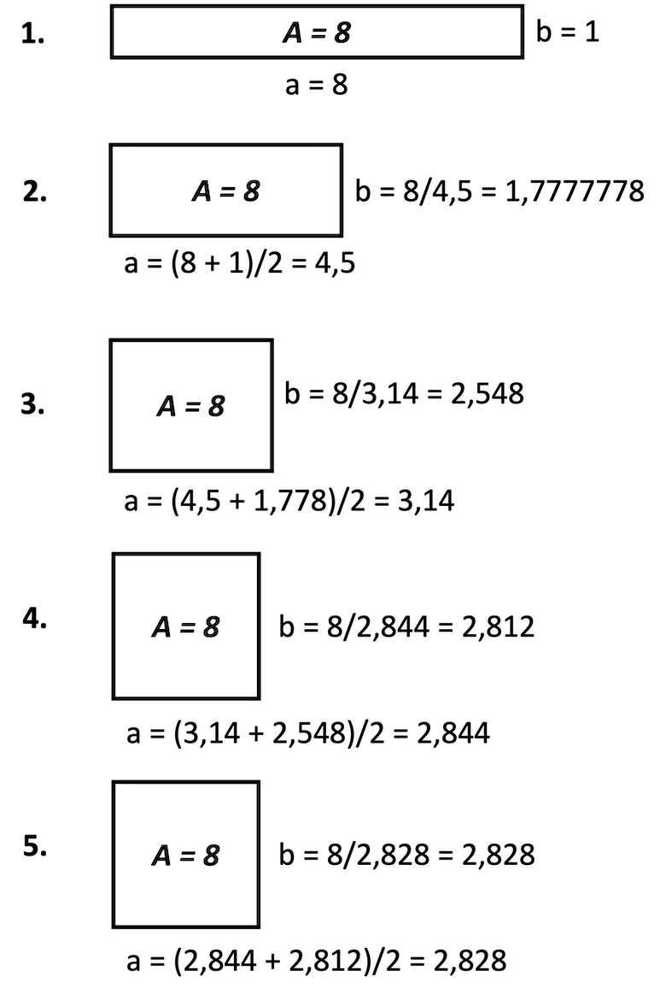

# Übungen

## Übungsblätter (wochenweise)


??? note "Übung 1 (20.10.2021)"

	**Vorbereitung**

	1. Installieren Sie - falls noch nicht geschehen - das Java Davelopment Kit (JDK) (siehe [**Java**](../tools/#java)).
	2. Installieren Sie BlueJ (siehe [**IDE**](../tools/#bluej)). 
	3. Starten Sie BlueJ und öffnen Sie (`Project --> Open Project...`) das Projekt `picture` (im BlueJ-Ordner unter `examples`). Klicken Sie dann den `Compile`-Button.
	4. Klicken Sie mit der rechten Maustaste auf die Klasse `Picture` (das orangene Kästchen mit der Beschriftung `Picture`) und erzeugen Sie davon ein Objekt `picture1`. 
	5. Klicken Sie mit der rechten Maustaste auf das Objekt `picture1` und rufen Sie die Methode `draw()` auf. 
	6. Klicken Sie erneut mit der rechten Maustaste auf die Klasse `Picture` und öffnen Sie den Editor mit `Open Editor`. Es erscheint das Java-Programm (der *Quellcode*) der Klasse `Picture`:
	=== "Picture.java"
		```java linenums="1"
				
		/**
		 * This class represents a simple picture. You can draw the picture using
		 * the draw method. But wait, there's more: being an electronic picture, it
		 * can be changed. You can set it to black-and-white display and back to
		 * colors (only after it's been drawn, of course).
		 *
		 * This class was written as an early example for teaching Java with BlueJ.
		 * 
		 * @author  Michael Kölling and David J. Barnes
		 * @version 1.1  (24 May 2001)
		 */
		public class Picture
		{
		    private Square wall;
		    private Square window;
		    private Triangle roof;
		    private Circle sun;

		    /**
		     * Constructor for objects of class Picture
		     */
		    public Picture()
		    {
		        // nothing to do... instance variables are automatically set to null
		    }

		    /**
		     * Draw this picture.
		     */
		    public void draw()
		    {
		        wall = new Square();
		        wall.moveVertical(80);
		        wall.changeSize(100);
		        wall.makeVisible();

		        window = new Square();
		        window.changeColor("black");
		        window.moveHorizontal(20);
		        window.moveVertical(100);
		        window.makeVisible();

		        roof = new Triangle();
		        roof.changeSize(50, 140);
		        roof.moveHorizontal(60);
		        roof.moveVertical(70);
		        roof.makeVisible();

		        sun = new Circle();
		        sun.changeColor("yellow");
		        sun.moveHorizontal(180);
		        sun.moveVertical(-10);
		        sun.changeSize(60);
		        sun.makeVisible();
		    }

		    /**
		     * Change this picture to black/white display
		     */
		    public void setBlackAndWhite()
		    {
		        if(wall != null)   // only if it's painted already...
		        {
		            wall.changeColor("black");
		            window.changeColor("white");
		            roof.changeColor("black");
		            sun.changeColor("black");
		        }
		    }

		    /**
		     * Change this picture to use color display
		     */
		    public void setColor()
		    {
		        if(wall != null)   // only if it's painted already...
		        {
		            wall.changeColor("red");
		            window.changeColor("black");
		            roof.changeColor("green");
		            sun.changeColor("yellow");
		        }
		    }

		}

		```
			Wir schauen uns diese Klasse ein wenig genauer an und diskutieren einige Details (Objektvariablen, Objektmethoden, Kommentare, ...).

	**Durchführung**

	1. Für diese Übung interessiert uns nur die Methode `draw()`. Die Methodenaufrufe, die wir bis jetzt immer einzeln vorgenommen haben, werden nun "aufgeschrieben" - wir **programmieren**!
	2. Ändern Sie Farben und Positionen der einzelnen Objekte!
	3. Wenn Sie Ihre Änderungen ausprobieren wollen, müssen Sie die Klasse neu `compilieren`. Durch das `Compilieren` gehen die erzeugten Objekte verloren. Warum ist das wohl so?
	4. Lassen Sie die Sonne langsam untergehen. Welche Objektmethode kommt dafür infrage? Für welches Objekt muss diese Objektmethode aufgerufen werden?

	**Tipp:** 

	1. Derzeit ist es recht mühsam, die Änderungen zu testen. Wir müssen die Klasse `Picture` compilieren, dann ein Objekt dieser Klasse erzeugen und dann für dieses Objekt die Methode `draw()` aufrufen. Wir wollen diesen Vorgang etwas vereinfachen und erstellen uns dazu eine *Testklasse*. 
	2. Klicken Sie mit der rechten Maustaste auf die Klasse `Picture` und wählen Sie `Create Test Class` aus. 
	3. Klicken Sie mit der rechten Maustaste auf diese neue Testklasse `PictureTest` und wählen Sie `Create Test Method ...` aus. 
	4. Geben Sie als Namen für diese Testmethode `drawTest` an und bestätigen Sie die Eingabe mit `OK`. 
	5. Nun wird ein Test "aufgenommen". Klicken Sie mit der rechten Maustaste auf die Klasse `Picture` und erzeugen Sie von dieser Klasse eine Objekt `picture1`. Für dieses Objekt rufen Sie die `draw()`-Methode auf. Klicken Sie dann im Hauptfenster auf der linken Seite unter `recording` den Button `End`. Sie haben nun einen Test erzeugt, den Sie leicht aufrufen können. 
	6. Ändern Sie Ihre `draw()`-Methode, compilieren Sie die Klasse `Picture` und wählen Sie nun mit der rechten Maustaste für die Klasse `PictureTest` die Methode `drawTest()` aus und rufen diese auf. 


??? note "Übung 2 (27.10.2021)"
	1. Öffnen Sie `BlueJ` und erstellen Sie ein neues Projekt `uebung2`. 
	2. Erstellen Sie darin eine Klasse `Uebung2`. 
	3. Ersetzen Sie den gesamten Code der Klasse `Uebung2` durch folgenden Code:
		```java 
		public class Uebung2
		{
		    public Uebung2()
		    {
		        
		    }

		    public void printLesson2()
		    {
		        // Schreiben Sie Ihren gesamten Code in diese Methode
		        // und fuehren Sie diese Methode aus
		        
		    }
		}
		```
	3. Deklarieren und initialisieren Sie in der `printLesson2()`-Methode jeweils eine Variable mit dem Datentyp `int`, `long`, `char`, `byte`, `short`, `float`, `double`, `boolean` und `String`. Geben Sie alle Werte einzeln durch Aufruf der `println()`-Methode aus. Erzeugen Sie dabei folgende Ausgabe (Werte nur Beispiele):
	```bash
	Wert vom Typ int 		: 	123
	Wert vom Typ long 		: 	456789
	Wert vom Typ char 		: 	a
	Wert vom Typ byte 		: 	127
	Wert vom Typ short 		: 	32767
	Wert vom Typ float 		: 	4.23
	Wert vom Typ double		: 	6.98
	Wert vom Typ boolean	: 	true
	Wert vom Typ String		: 	Hallo!
	```
	4. Setzen Sie den Wert Ihrer `int`-Variablen auf `2147483647`. Geben Sie den Wert auf der Konsole aus, z.B.:	
	```bash
	Wert von i 	: 	2147483647
	```
	Erhöhen Sie nun den Wert der Variablen um `1` und geben Sie den Wert erneut aus. Was passiert? Warum?
	5. Wiederholen Sie das gleiche mit einer `long-Variablen.
	6. Weisen Sie Ihrer `char`-Variablen den Wert `65` zu. Geben Sie den Wert Ihrer `char`-Variablen aus. Was passiert? Warum?
	7. Deklarieren Sie zwei weitere `int`-Variablen und weisen Sie diesen Variablen Werte zu. Erzeugen Sie unter Verwendung der Werte dieser beiden Variablen folgende Ausgabe (wir nehmen an, die beiden Werte sind `17` und `4`):
	```bash 
	17 geteilt durch 4 ergibt 4. Es bleibt ein Rest von 1
	```
	Ändern Sie das Programm so, dass bei einer ganzzahligen Division ohne Rest die Ausgabe in der Form ist (z.B. für die Werte `16` und `4`): 
	```bash
	16 geteilt durch 4 ergibt 4 ohne Rest.
	```
	8. Fügen Sie (mindestens) zwei weitere Anweisungen hinzu, sodass mit Hilfe der `println()`-Methode folgende Ausgaben (für die Beispielwerte `17` und `4`) erscheinen: 
	```bash 
	17/4 = 4
	17 mod 4 = 1
	```


??? question "Eine mögliche Lösung für Übung 2"
	```java
	public class Uebung2
	{
	    public Uebung2()
	    {
	        
	    }

	    public void printLesson2()
	    {
	        // Schreiben Sie Ihren gesamten Code in diese Methode
	        // und fuehren Sie diese Methode aus

	        int in = 123;
			long lo = 456789;
			char ch = 'a';
			byte by = 127;
			short sh = 32767;
			float fl = 4.23f;
			double d1 = 6.98;
			boolean b1 = true;
			String s1 = "Hallo!";
			
			System.out.println(" --- Aufgabe 3 -------");
			System.out.println();
			System.out.println("Wert vom Typ int     : " + in );
			System.out.println("Wert vom Typ long    : " + lo );
			System.out.println("Wert vom Typ char    : " + ch );
			System.out.println("Wert vom Typ byte    : " + by );
			System.out.println("Wert vom Typ short   : " + sh );
			System.out.println("Wert vom Typ float   : " + fl );
			System.out.println("Wert vom Typ double  : " + d1 );
			System.out.println("Wert vom Typ boolean : " + b1 );
			System.out.println("Wert vom Typ String  : " + s1 );
			
			System.out.println();
			System.out.println(" --- Aufgabe 4 -------");
			System.out.println();
			in = 2147483647;
			System.out.println("Wert vom Typ int     : " + in );
			in = in + 1;		// in++;
			System.out.println("Wert vom Typ int     : " + in );
			
			System.out.println();
			System.out.println(" --- Aufgabe 5 -------");
			System.out.println();
			lo = 2147483647L;
			System.out.println("Wert vom Typ long    : " + lo );
			lo = lo +1 ;
			System.out.println("Wert vom Typ long    : " + lo );
			
			System.out.println();
			System.out.println(" --- Aufgabe 6 -------");
			System.out.println();
			ch = 65;
			System.out.println("Wert vom Typ char    : " + ch );
			
			System.out.println();
			System.out.println(" --- Aufgabe 7 -------");
			System.out.println();
			int nr1 = 17;
			int nr2 = 4;
			int quotient = nr1 / nr2;
			int rest = nr1 % nr2;
			if(rest==0)
			{
				System.out.println(nr1 + " geteilt durch " + nr2 + " ergibt " + quotient + " ohne Rest.");
			}
			else
			{
				System.out.println(nr1 + " geteilt durch " + nr2 + " ergibt " + quotient 
					+ ". Es bleibt ein Rest von " + rest);
			}
			
			System.out.println();
			System.out.println(" --- Aufgabe 8 -------");
			System.out.println();
			int number1 = 17;
			int number2 = 4;
			int result = number1 / number2;
			System.out.println(number1 + "/" + number2 + " = " + result);
			
			int rest = number1 % number2;
			System.out.println(number1 + " mod " + number2 + " = " + rest);
		}
	}
	```


??? note "Übung 3 (3.11.2021)"
	1. Öffnen Sie `BlueJ` und erstellen Sie ein neues Projekt `uebung3`. 
	2. Erstellen Sie darin eine Klasse `Uebung3`. 
	3. Ersetzen Sie den gesamten Code der Klasse `Uebung3` durch folgenden Code:
		```java 
		public class Uebung3
		{
		    public Uebung3()
		    {
		        
		    }

		    public void myLesson3Method()
		    {
		        // Definieren Sie alle Ihre Methoden außerhalb dieser Methode
		        // Rufen Sie alle Ihre Methoden hier auf
		        
		    }
		}
		```
	3. Schreiben Sie eine Umrechnung für eine gegebene Anzahl von Sekunden (`printSeconds(int seconds)`), z.B. `printSeconds(3456789)`:
		```bash
		3456789 Sekunden sind 40 Tage, 13 Minuten, 9 Sekunden.
		```
		Aber z.B. `printSeconds(2345678)`:
		```bash
		2345678 Sekunden sind 27 Tage, 3 Stunden, 34 Minuten, 38 Sekunden.
		```
		Aber z.B. `printSeconds(123456)`:
		```bash
		123456 Sekunden sind 1 Tag, 10 Stunden, 17 Minuten, 36 Sekunden.
		```
		Aber z.B. `printSeconds(12345)`:
		```bash
		12345 Sekunden sind 3 Stunden, 25 Minuten, 45 Sekunden.
		```
	4. Die `printSeconds()`-Methode gibt selbst etwas aus. Welchen Rückgabetyp hat sie? Schreiben Sie eine weitere Methode `computeSeconds(int seconds)`, die genau die gleiche Funktionalität hat, aber den Ausgabestring nicht auf die Konsole ausgibt, sondern zurück. 
	5. Wie könnten (und sollten!) Sie die `computeSeconds()`-Methode in der `printSeconds()`-Methode verwenden? Warum?


??? question "Eine mögliche Lösung für Übung 3"
	```java
	public class Uebung3
		{
		    public Uebung3()
		    {
		        
		    }

		    public void printSeconds(int seconds)
			{
				int minute = 60;
				int hour = 60 * minute;		// 3600
				int day = 24 * hour;		// 86400
				
				int days = seconds / day;
				int remainingSeconds = seconds - (days * day);
				int hours = remainingSeconds / hour;
				remainingSeconds = remainingSeconds - (hours * hour);
				int minutes = remainingSeconds / minute;
				remainingSeconds = remainingSeconds - (minutes * minute);
				
				/*
				System.out.println(seconds + " Sekunden sind " + days + " Tage, " 
				+ hours + " Stunden, " + minutes + " Minuten, " + remainingSeconds + " Sekunden.");
				 */
				
				String output = seconds + " Sekunden sind ";
				if(days==1)
				{
					output = output + " 1 Tag, ";
				}
				else
				{
					if(days > 1)
					{
						output = output + days + " Tage, ";
					}
				}
				if(hours==1)
				{
					output = output + " 1 Stunde, ";
				}
				else
				{
					if(hours > 1)
					{
						output = output + hours + " Stunden, ";
					}
				}
				if(minutes==1)
				{
					output = output + " 1 Minute, ";
				}
				else
				{
					if(minutes > 1)
					{
						output = output + minutes + " Minuten, ";
					}
				}
				if(remainingSeconds==1)
				{
					output = output + " 1 Sekunde.";
				}
				else
				{
					if(remainingSeconds > 1)
					{
						output = output + remainingSeconds + " Sekunden.";
					}
				}
				System.out.println(output);
			}

			public void myLesson3Method()
		    {
				printSeconds(3456789);
				printSeconds(2345678);
				printSeconds(123456);
				printSeconds(12345);        
		    }
	}
	```


??? note "Übung 4 (10.11.2021)"
	1. Öffnen Sie `BlueJ` und erstellen Sie ein neues Projekt `uebung4`. 
	2. Erstellen Sie darin eine Klasse `Uebung4`. 
	3. Ersetzen Sie den gesamten Code der Klasse `Uebung4` durch folgenden Code:
		```java 
		public class Uebung4
		{
		    public Uebung4()
		    {
		        
		    }

		    public void myLesson4Method()
		    {
		        // Definieren Sie alle Ihre Methoden außerhalb dieser Methode
		        // Rufen Sie alle Ihre Methoden hier auf
		        
		    }
		}
		```
	4. Schreiben Sie eine Methode `isPrime(int number)`, die ein `true` zurückgibt, wenn `number` eine Primzahl ist und ein `false`, wenn nicht. Eine Primzahl ist eine natürliche Zahl größer als `1`, die nur durch `1` und sich selbst teilbar ist.   
	5. Schreiben Sie eine Methode `printprimeNumbers(int maximum)`, die alle Primzahlen von `1` bis einschließlich `maximum` wie folgt auf der Konsole ausgibt (Bsp. für `maximum=61`):
		```bash
		Zahl : 61
		.2 3 .5 .7 ...11 .13 ...17 .19 ...23 .....29 .31 .....37 ...41 .43 ...47 .....53 .....59 .61
		```
		d.h. es werden die Zahlen, die Primzahlen sind, ausgegeben und für die anderen Zahlen erscheint nur ein Punkt. Verwenden Sie in der Methode `printPrimenumbers(int)` die Methode `isPrime(int)`.

	***Zusatzaufgabe (gute Wiederholung/Vertiefung von Übung 3)***

	1. Schreiben Sie eine Methode `isLeapYear(int year)`, die ein `true` zurückgibt, wenn `year` ein Schaltjahr ist und ein `false`, wenn nicht. Ein Jahr ist ein Schaltjahr, wenn die Jahreszahl durch `4` teilbar ist, aber nicht durch `100`, außer sie ist durch `400` teilbar. 
	2. Schreiben Sie eine Methode `printleapYear(int year)`, die für `year` auf die Konsole ausgibt (Beispielwerte):
		```bash
		2021 ist kein Schaltjahr. 
		2020 war ein Schaltjahr. 
		2000 war ein Schaltjahr. 
		2024 wird ein Schaltjahr.
		2025 wird kein Schaltjahr.
		```


??? question "Eine mögliche Lösung für Übung 4"
	```java
		
	public class Uebung4
	{
	    public Uebung4()
	    {

	    }
	    
	    public boolean isPrime(int number)
	    {
	        if(number>1)
	        {
	            for (int i=2;i<number;i++)
	            {
	                if(number%i==0) //ob i number ganzzahlig teilt (Division ohne Rest)
	                {
	                    return false;
	                }
	            }
	            return true;
	        }
	        else 
	        {
	            return false;
	        }
	    }
	    
	    public void myLesson4Method()
	    {
	        //System.out.println(isPrime(1)); 
	        printPrimeNumbers(61);
	    }
	    
	    public void printPrimeNumbers(int maximum)
	    {
	        for (int i=2;i<=maximum;i++)
	            {
	                if(isPrime(i)) 
	                {
	                    System.out.print(i+" ");
	                }
	                else
	                {
	                    System.out.print(". ");
	                }
	            }
	    }
	}
	```

??? note "Übung 5 (17.11.2021)"
	1. Öffnen Sie `BlueJ` und erstellen Sie ein neues Projekt `uebung5`. 
	2. Erstellen Sie darin eine Klasse `Uebung5`. 
	3. Ersetzen Sie den gesamten Code der Klasse `Uebung5` durch folgenden Code:
		```java 
		public class Uebung5
		{
		    public Uebung5()
		    {
		        
		    }

		    public void start()
		    {
		        // Definieren Sie alle Ihre Methoden außerhalb dieser Methode
		        // Rufen Sie alle Ihre Methoden hier auf
		        
		    }
		}
		```
	4. Wir schreiben uns zwei Methoden, die mathematische Funktionen umsetzen. Die eine Funktion berechnet die Potenz `base^exp` und die andere Funktion bereechnet die Quadratwurzel einer Zahl. Ziel der Übung ist es insbesondere, uns vorab die algorithmische Idee zu überlegen. Programmieren Sie also nicht gleich los, sondern überlegen Sie gemeinsam, wie Sie die beiden Funktionen umsetzen wollen!
	5. Schreiben Sie eine Methode `public double pow(int base, int exp)`. Dabei steht `pow` für *power*. Es soll `base^exp` berechnet werden. Überlegen Sie sich zunächst z.B.:
		- Wenn `exp` positiv ist, dann wollen wir `base * base * ... * base` berechnen, wobei `base` `exp` oft miteinander multipliziert wird. Welche Kontrollstruktur verwenden wir? Was sind die einzelnen "Teile" dieser Kontrollstruktur?
		- Wir müssen uns irgendwie das `product` dieser Multiplikationen merken. Wie ist der initiale Wert von `product` und warum?
		- Funktioniert Ihre Idee auch, wenn `exp` den Wert `0` hat? Warum bzw. warum nicht?
		- Wenn `exp` negativ ist, dann ist `base^-exp = 1/(base^exp)`. Was müssen wir ändern? 
		- Warum ist der Rückgabetyp `double`? Warum nicht `int`? 
	6. Implementieren Sie eine Methode `public void printPow(int base, int exp)`, um Werte der Methodenaufrufe von `pow()` auf die Konsole auszugeben! Rufen Sie `printPow(int base, int exp)` in `start()` auf!

	***Zusatzaufgabe (falls noch Zeit ist)***

	1. Schreiben Sie eine Methode `public double sqrt(int number)`, die die Quadratwurzel der Zahl `number` berechnet. Wir verfolgen dabei folgende Idee ([Heron-Verfahren](https://de.wikipedia.org/wiki/Heron-Verfahren)):
		- Wir stellen uns ein Rechteck vor, dessen Seitenlängen `number` und `1` sind. Die Fläche dieses Rechtecks ist also `number`. Nun versuchen wir, aus diesem Rechteck ein Quadrat zu machen (rein virtuell natürlich). Der Flächeninhalt von diesem Quadrat soll `number` sein/bleiben. Ein Quadrat mit dem Flächeninhalt `numbeer` hat die Seitenlängen `sqrt(number)`, also das, was wir wollen. 
		- Um aus dem Rechteck ein Quadrat zu machen, gehen wir schrittweise vor: die eine Seite des Rechteckes/Quadrates wird der Mittelwert aus den Seiten des Rechtecks. Nun berechnen wir die andere Seite indem wir den Flächeninhalt des Rechtecks (`number`) durch die neue Seitenlänge teilen. Somit haben wir 2 neue Seitenlängen, das Rechteck behält aber den Flächeninhalt `number`. 
		- Wir berechnen erneut die neue Seitenlänge des Rechtecks, indem wir den Mittelwert der beiden Seitenlängen berechnen und ermitteln dann wieder die andere Seitenlänge, indem wir den Flächeninhalt durch die Seitenlänge teilen. Die beiden Seitenlängen nähern sich dann zunehmend an und sind irgendwann fast identisch, also ein Quadrat. 
		- Wie lange müssen wir das wiederholen? Was ist am Ende unser Ergebnis? Von welchem Datentyp sollten die Seitenlängen sein?
		- Überlegen Sie sich das Vorgehen genau, ehe Sie programmieren!
		- Beispiel zur Berechnung der Wurzel aus 8:

			{ width="250" }

	2. Implementieren Sie eine Methode `public void printSqrt(int number)`, um Werte der Methodenaufrufe von `sqrt()` auf die Konsole auszugeben! Rufen Sie `printSqrt(int number)` in `start()` auf!


??? question "Eine mögliche Lösung für Übung 5"
	```java
	public class Uebung5
	{
	    public double pow(int base, int exp)
	    {
	        double product = 1.0;
	        if(exp < 0)
	        {
	            for(int nr = 1; nr <= -exp; nr++)   // -exp !
	            {
	                product = product * base;
	            }
	            product = 1.0 / product;
	        }
	        else
	        {
	            for(int nr = 1; nr <= exp; nr++)
	            {
	                product = product * base;
	            }
	        }
	        return product;
	    }
	    
	    public double powDifferentSolution(int base, int exp)
	    {
	        double product = 1.0;
	        int copyExp = exp;
	        if(exp < 0)
	        {
	            copyExp = -exp;
	        }
	        for(int nr = 1; nr <= copyExp; nr++)
	        {
	            product = product * base;
	        }
	        if(exp < 0)
	        {
	            product = 1.0 / product;
	        }
	        return product;
	    }
    
	    public double sqrt(int number)
	    {
	        double area = number;
	        double a = number;
	        double b = 1.0;
	        double epsilon = 0.00000001;
	        
	        while( (a-b)*(a-b) > epsilon )
	        {
	            a = (a+b)/2.0;
	            b = area/a;
	        }
	        return a;
	    }
	    
	    public void start()
	    {
	        int base = 2;
	        int exp = 4; 
	        double result = pow(base, exp);
	        System.out.println(base + "^" + exp + " = " + result);
	        
	        base = 2;
	        exp = 0; 
	        result = pow(base, exp);
	        System.out.println(base + "^" + exp + " = " + result);
	        
	        base = 2;
	        exp = -4; 
	        result = pow(base, exp);
	        System.out.println(base + "^" + exp + " = " + result);
	        
	        base = -2;
	        exp = 4; 
	        result = pow(base, exp);
	        System.out.println(base + "^" + exp + " = " + result);
	        
	        base = -2;
	        exp = -4; 
	        result = pow(base, exp);
	        System.out.println(base + "^" + exp + " = " + result);
	               
	        base = -2;
	        exp = 3; 
	        result = pow(base, exp);
	        System.out.println(base + "^" + exp + " = " + result);       
	                
	        base = -2;
	        exp = -3; 
	        result = pow(base, exp);
	        System.out.println(base + "^" + exp + " = " + result);

	        System.out.println(sqrt(4));       
        	System.out.println(sqrt(8));       
        	System.out.println(sqrt(2));
	    }
	}

	```		

	
??? note "Übung 6 (24.11.2021)"
	
	1. Öffnen Sie `BlueJ` und erstellen Sie ein neues Projekt `uebung6`. 
	2. Erstellen Sie darin eine Klasse `Konto`. 
	3. Erstellen Sie eine Testklasse `KontoTest` und fügen Sie darin folgende Methode ein:
		```java

	    @Test
	    public void testKonto()
	    {
	        // hier die Kontoobjekte erzeugen
	        // und die Objektmethoden anwenden
	    }
		```	
	4. Erstellen Sie in der Klasse `Konto` zwei Objektvariablen
		- `guthaben` vom Typ `double` --> nur in der Klasse sichtbar!
		- `pin` vom Typ `int`	--> ebenfalls nur in der Klasse sichtbar!
	5. Erstellen Sie in der Klasse `Konto` einen Konstruktor für `Konto`
		- diesem Konstruktor wird als Parameter `int pPin` übergeben
		- mit dem Wert des Parameters wird innerhalb des Konstruktors der Wert von `pin` initialisiert
		- Initialisieren Sie im Konstruktor auch die Objektvariable `guthaben`. Sie bekommt den Wert `0.0` (hierfür haben wir also keinen Parameter, wir setzen den initialen Wert einfach generell auf `0.0`)
	6. Erstellen Sie in der Klasse `Konto` eine Objektmethode `einzahlen(double betrag)`
		- diese Objektmethode ist `public` und gibt nichts zurück
		- in dieser Methode wird der Wert der Objektvariablen `guthaben` um den Wert von `betrag` erhöht
		- erzeugen Sie in dieser Methode außerdem eine Ausgabe in der Form:
			```bash
			Es wurden 100,00 Euro eingezahlt.
			```
			falls der `betrag` den Wert `100.0` hatte. Die Formatierung des Betrages wird bei Ihnen anders aussehen - siehe dazu auch **Zusatzaufgabe**.
	7. Geben Sie in der `testKonto()`-Methode der Testklasse `KontoTest` ein:
		```java
		Konto k1 = new Konto(1234);
		
		k1.einzahlen(100.0);
		k1.einzahlen(50.0);
		k1.einzahlen(150.0);
		```
		und führen Sie die `testKonto()`-Methode aus. Es sollten folgende Ausgaben erzeugt werden:
		```bash
		Es wurden 100,00 Euro eingezahlt.
		Es wurden 50,00 Euro eingezahlt.
		Es wurden 150,00 Euro eingezahlt.
		```
	8. Erstellen Sie in der Klasse `Konto` eine Objektmethode `kontoauszug(int pPin)`
		- diese Objektmethode ist `public` und gibt nichts zurück
		- einen `kontoauszug(int pPin)` können Sie nur "ziehen", wenn der Parameterwert von `pPin` mit dem Wert der Objektvariablen `pin` übereinstimmt
		- wird der richtige Wert für die `pin` übergeben, geben Sie das `guthaben` in der folgenden Form aus:
			```bash
			Ihr aktuelles Guthaben betraegt 300,00 Euro.
			```
			falls `guthaben` den Wert von `300.0` hat. 
		- wird ein falscher Wert für die `pin` übergeben, geben Sie folgende Ausgabe aus:
			```bash
			Falsche PIN!
			```
	9. Erweitern Sie die `testKonto()`-Methode der Testklasse um folgende Anweisungen:
		```java
		k1.kontoauszug(1235); 		// Falsche PIN!
		k1.kontoauszug(1234); 	
		``` 
		und führen Sie die `testKonto()`-Methode aus. Es sollten folgende (weitere) Ausgaben erzeugt werden:
		```bash
		Falsche PIN!
		Ihr aktuelles Guthaben betraegt 300,00 Euro.
		```
	10. Erstellen Sie in der Klasse `Konto` eine Objektmethode `auszahlen(int pPin, double betrag)`
		- diese Objektmethode ist `public` und gibt nichts zurück
		- es kann nur etwas ausgezahlt werden, wenn der Parameterwert von `pPin` mit dem Wert der Objektvariablen `pin` übereinstimmt
		- stimmen die Werte nicht überein, geben Sie erneut 
			```bash
			Falsche PIN!
			```
			aus. 
		- stimmt der `pin`-Wert, dann müssen Sie prüfen, ob das `guthaben` reicht, um `betrag` auszuzahlen. Ist nicht genug `guthaben` vorhanden, dann geben Sie aus
			```bash
			Ihr Guthaben reicht nicht, um 400,00 Euro auszuzahlen.
			``` 
			falls `betrag` den Wert `400.0` hatte. 
		- wenn der `pin`-Wert stimmt und genug `guthaben` vorhanden ist, um den `betrag` auszuzahlen, dann reduzieren Sie `guthaben` um den entsprechenden `betrag` und geben aus
			```bash
			Es wurden 100,00 Euro ausgezahlt.
			```
			falls der `betrag` den Wert `100.0` hatte.
	11. Erweitern Sie die `testKonto()`-Methode der Testklasse um folgende Anweisungen:
		```java
		k1.auszahlen(1235, 100.0); 	// Falsche PIN!
		k1.auszahlen(1234, 100.0); 	
		k1.kontoauszug(1234); 		
		k1.auszahlen(1234, 300.0);	// Guthaben reicht nicht
		k1.auszahlen(1234, 200.0); 	
		k1.kontoauszug(1234); 	
		``` 
		und führen Sie die `testKonto()`-Methode aus. Es sollten folgende (weitere) Ausgaben erzeugt werden:
		```bash
		Falsche PIN!
		Es wurden 100,00 Euro ausgezahlt.
		Ihr aktuelles Guthaben betraegt 200,00 Euro.
		Ihr Guthaben reicht nicht, um 300,00 Euro auszuzahlen.
		Es wurden 200,00 Euro ausgezahlt.
		Ihr aktuelles Guthaben betraegt 0,00 Euro.
		```
	12. Angenommen, die gesamte Testmethode sieht jetzt so aus: 
		```java 
		@Test
		public void testKonto()
		{
		    Konto k1 = new Konto(1234);

		    k1.einzahlen(100.0);
		    k1.einzahlen(50.0);
		    k1.einzahlen(150.0);

		    k1.kontoauszug(1235);       // Falsche PIN!
		    k1.kontoauszug(1234);       

		    k1.auszahlen(1235, 100.0);  // Falsche PIN!
		    k1.auszahlen(1234, 100.0);  
		    k1.kontoauszug(1234);       
		    k1.auszahlen(1234, 300.0);  
		    k1.auszahlen(1234, 200.0);  
		    k1.kontoauszug(1234); 

		    k1.einzahlen(150.0);
		    k1.kontoauszug(1234);       
		}
		```
		dann sollte die Ausgabe ungefähr so aussehen (wahrscheinlich nur eine Stelle nach dem Komma/Punkt):
		```bash
		Es wurden 100,00 Euro eingezahlt.
		Es wurden 50,00 Euro eingezahlt.
		Es wurden 150,00 Euro eingezahlt.
		Falsche PIN!
		Ihr aktuelles Guthaben betraegt 300,00 Euro.
		Falsche PIN!
		Es wurden 100,00 Euro ausgezahlt.
		Ihr aktuelles Guthaben betraegt 200,00 Euro.
		Ihr Guthaben reicht nicht, um 300,00 Euro auszuzahlen.
		Es wurden 200,00 Euro ausgezahlt.
		Ihr aktuelles Guthaben betraegt 0,00 Euro.
		```
	12. **Zusatzaufgabe (falls noch Zeit ist):** 
		- Informieren Sie sich über die `System.out.printf()`-Methode, um stets genau 2 Stellen nach dem Komma des Betrages auszugeben (siehe [hier](../hilfsklassen/#formatierung-von-gleikommazahlen)). 


??? question "Eine mögliche Lösung für Übung 6"
	=== "Konto.java"
		```java
		public class Konto
		{
		    private double guthaben;
		    private int pin;

		    public Konto (int pin)
		    {
		        this.pin = pin;
		        this.guthaben = 0.0;
		        System.out.println("Neues Konto eroeffnet"); 	// Ausnahme, dass hier Ausgabe!!
		        												// "Das ist des Teufels"
		    }

		    public void einzahlen(double betrag)
		    {
		        this.guthaben = betrag + this.guthaben;
		        System.out.println("Es wurden " + betrag + "0 Euro eingezahlt.");
		    }
		    
		    public void auszahlen(int pin, double betrag)
		    {
		        if(pin == this.pin) // if(pin == this.pin && this.guthaben <= betrag) dann wäre es kürzer, 
		        //aber wir können nicht sehen, wo der fehler liegt, deswegen besser einzeln...)
		        {
		            if(betrag > this.guthaben)
		            {
		                System.out.println("Ihr Guthaben reicht nicht, um " + betrag + "0 Euro auszuzahlen.");
		            }
		            else
		            {
		                this.guthaben = this.guthaben - betrag;
		                System.out.println("Es wurden " + betrag + "0 Euro ausgezahlt.");
		            }
		        }
		        else
		        {
		            System.out.println("Falsche PIN!");
		        }
		    }
		    
		    public void kontoauszug(int pin)
		    {
		        if(pin == this.pin)
		        {
		            System.out.println("Ihr aktuelles Guthaben beträgt " + this.guthaben + "0 Euro.");
		        }
		        else
		        {
		            System.out.println("Falsche PIN!");
		        }
		    }
		}
		```		
	=== "KontoTest.java"
		```java

		import static org.junit.jupiter.api.Assertions.*;
		import org.junit.jupiter.api.AfterEach;
		import org.junit.jupiter.api.BeforeEach;
		import org.junit.jupiter.api.Test;

		public class KontoTest
		{
		    @Test
		    public void testKonto()
		    {
		        Konto k1 = new Konto(1234);
		        
		        k1.einzahlen(100.0);
		        k1.einzahlen(50.0);
		        k1.einzahlen(150.0);
		        
		        k1.kontoauszug(1235);       // Falsche PIN!
		        k1.kontoauszug(1234);
		        
		        k1.auszahlen(1235, 100.0);  // Falsche PIN!
		        k1.auszahlen(1234, 100.0);  
		        k1.kontoauszug(1234);       
		        k1.auszahlen(1234, 300.0);  // Guthaben reicht nicht
		        k1.auszahlen(1234, 200.0);  
		        k1.kontoauszug(1234);
		    
		        k1.einzahlen(150.0);
		        k1.kontoauszug(1234);
		        // hier die Kontoobjekte erzeugen
		        // und die Objektmethoden anwenden
		    }

		    @Test
		    public void teststart()
		    {
		    }
		}

		```		

	
??? note "Übung 7 (1.12.2021)"
	
	1. Öffnen Sie `BlueJ` und erstellen Sie ein neues Projekt `uebung7`. 
	2. Erstellen Sie darin eine Klasse `Rectangle`. 
	3. Erstellen Sie eine Testklasse `RectangleTest` und fügen Sie darin folgende Methode ein:
		```java

	    @Test
	    public void testRectangle()
	    {
	        // hier die Rectangleobjekte erzeugen
	        // und die Objektmethoden anwenden
	    }
		```	
	4. Erstellen Sie in der Klasse `Rectangle` zwei Objektvariablen
		- `a` vom Typ `int` --> nur in der Klasse sichtbar!
		- `b` vom Typ `int`	--> ebenfalls nur in der Klasse sichtbar!
		- `a` und `b` repräsentieren die Seiten des Rechtecks. 
	5. Erstellen Sie für die Klasse `Rectangle` einen parameterlosen Konstruktor `Rectangle()`. Dieser setzt für die Seite `a` den Wert `10` und für die Seite `b` den Wert `20`.
	6. Erstellen Sie außerdem einen parametrisierten Konstruktor `Rectangle(int a, int b)`. Dieser verwendet die Werte der Parameter, um den Objektvariablen Werte zuzuweisen.
	7. Erstellen Sie eine Objektmethode `area()`, die den Flächeninhalt des Rechtecks als `int` zurückgibt. 
	8. Erstellen Sie eine Objektmethode `perimeter()`, die den Umfang des Rechtecks als `int` zurückgibt. 
	9. Erstellen Sie eine Objektmethode `toString()`, die Informationen über das Rechtecks als `String` in z.B. der folgenden Form (Beispielwerte):
		```bash
		Rectangle : ( a=10, b=20, area=200, perimeter=60 )
		```
		zurückgibt. 
	
	10. Implementieren Sie eine Objektmethode `public void print()`, die den durch `toString()` erzeugten `String` auf die Konsole ausgibt.
	11. Geben Sie in der `testRectangle()`-Methode der `RectangleTest`-Klasse ein:
		```java
		// Objekte erzeugen
		Rectangle r1 = new Rectangle();
		Rectangle r2 = new Rectangle(12, 18);
		Rectangle r3 = new Rectangle(40, 5);
		Rectangle r4 = new Rectangle(20, 10);
		Rectangle r5 = new Rectangle(11, 21);
		
		System.out.printf("%n%n--------------- print()-Methode -----------------%n%n");
		r1.print();
		r2.print();
		r3.print();
		r4.print();
		r5.print();
		```
		und rufen Sie die `testRectangle()` auf. Es sollten folgende Ausgaben erzeugt werden:
		```bash
		--------------- print()-Methode -----------------

		Rectangle : ( a=10, b=20, area=200, perimeter=60 )
		Rectangle : ( a=12, b=18, area=216, perimeter=60 )
		Rectangle : ( a=40, b= 5, area=200, perimeter=90 )
		Rectangle : ( a=20, b=10, area=200, perimeter=60 )
		Rectangle : ( a=11, b=21, area=231, perimeter=64 )
		```
	10. Erstellen Sie eine Methode `sidesAreEqual(Rectangle r)`, die ein `true` zurückgibt, wenn die Seiten des aufrufenden Objektes gleich der Seiten des Rechtecks `r` sind; `false` sonst. Sie können entscheiden, dass das Rechteck auch gedreht noch gleiche Seiten haben soll, also `a=10, b=20` ist nicht nur mit `a=10, b=20` gleich, sondern auch mit `a=20, b=10`. Wenn die Seiten ungleich sind, gibt die Methode ein `false` zurück.
	11. Erstellen Sie eine Methode `areasAreEqual(Rectangle r)`, die ein `true` zurückgibt, wenn der Flächeninhalt des aufrufenden Objektes gleich dem Flächeninhalt des Rechtecks `r` ist; `false` sonst.
	12. Erstellen Sie eine Methode `perimetersAreEqual(Rectangle r)`, die ein `true` zurückgibt, wenn der Umfang des aufrufenden Objektes gleich dem Umfang des Rechtecks `r` ist; `false` sonst.
	13. Erstellen Sie eine Methode `printComparison(Rectangle r)`, die die Vergleiche mit `r` auf die Konsole ausgibt, z.B.:
		```bash
		this      Rectangle : ( a=10, b=20, area=200, perimeter=60 ) 
		the other Rectangle : ( a=12, b=18, area=216, perimeter=60 ) 
		sides are not equal 
		areas are not equal 
		perimeters are equal 

		this      Rectangle : ( a=10, b=20, area=200, perimeter=60 ) 
		the other Rectangle : ( a=40, b= 5, area=200, perimeter=90 ) 
		sides are not equal 
		areas are equal 
		perimeters are not equal 

		this      Rectangle : ( a=10, b=20, area=200, perimeter=60 ) 
		the other Rectangle : ( a=20, b=10, area=200, perimeter=60 ) 
		sides are equal 
		areas are equal 
		perimeters are equal 

		this      Rectangle : ( a=10, b=20, area=200, perimeter=60 ) 
		the other Rectangle : ( a=11, b=21, area=231, perimeter=64 ) 
		sides are not equal 
		areas are not equal 
		perimeters are not equal 
		```
	14. Fügen Sie in der `testRectangle()`-Methode der `RectangleTest`-Klasse folgende Anweisungen hinzu:
		```java	
		System.out.printf("%n%n---------- printComparison()-Methode ------------%n%n");
		r1.printComparison(r2);
		r1.printComparison(r3);
		r1.printComparison(r4);
		r1.printComparison(r5);
		```
		und rufen Sie die `testRectangle()`-Methode auf. Es sollten folgende zusätzliche Ausgaben erzeugt werden:
		```bash
		---------- printComparison()-Methode ------------

		this      Rectangle : ( a=10, b=20, area=200, perimeter=60 ) 
		the other Rectangle : ( a=12, b=18, area=216, perimeter=60 ) 
		sides are not equal 
		areas are not equal 
		perimeters are equal 

		this      Rectangle : ( a=10, b=20, area=200, perimeter=60 ) 
		the other Rectangle : ( a=40, b= 5, area=200, perimeter=90 ) 
		sides are not equal 
		areas are equal 
		perimeters are not equal 

		this      Rectangle : ( a=10, b=20, area=200, perimeter=60 ) 
		the other Rectangle : ( a=20, b=10, area=200, perimeter=60 ) 
		sides are equal 
		areas are equal 
		perimeters are equal 

		this      Rectangle : ( a=10, b=20, area=200, perimeter=60 ) 
		the other Rectangle : ( a=11, b=21, area=231, perimeter=64 ) 
		sides are not equal 
		areas are not equal 
		perimeters are not equal 
		```

	
??? note "Übung 8 (8.12.2021)"
	
	1. Öffnen Sie `BlueJ` und erstellen Sie ein neues Projekt `uebung8`. 
	2. Erstellen Sie darin eine Klasse `Date`. 
	3. Erstellen Sie eine Programmklasse `Programclass` und fügen Sie darin folgende Methode ein:
		```java

	    public void start()
	    {
	        // hier die Rectangleobjekte erzeugen
		    // und die Objektmethoden anwenden
	    }

		```	
	4. Erstellen Sie in der Klasse `Date` drei Objektvariablen
		- `day` vom Typ `int` --> nur in der Klasse sichtbar!
		- `month` vom Typ `int`	--> ebenfalls nur in der Klasse sichtbar!
		- `year` vom Typ `int`	--> ebenfalls nur in der Klasse sichtbar! 

	5. Erstellen Sie für die Klasse `Date` einen parameterlosen Konstruktor `public Date()`. Dieser setzt das "Datum" auf den `1.1.1900`.
	6. Erstellen Sie außerdem einen parametrisierten Konstruktor `public Date(int day, int month, int year)`. Dieser verwendet die Werte der Parameter, um den Objektvariablen Werte zuzuweisen.
	7. Erstellen Sie eine Objektmethode `public String toString()`, die das Datum in der Form (Beispielwerte) `"1.1.1900"` als `String` zurückgibt. 
	8. Implementieren Sie eine Objektmethode `public void print()`, die den durch `toString()` erzeugten `String` auf die Konsole ausgibt.
	11. Geben Sie in der `start()`-Methode der `Programclass`-Klasse ein:
		```java
		// Date-Objekte erzeugen
		Date d1 = new Date(11, 11, 2000);
        Date d2 = new Date(20, 10, 2020);
        Date d3 = new Date();
		
		System.out.printf("%n%n--------------- print()-Methode Date -----------------%n%n");
		d1.print();
        d2.print();
        d3.print();
		```
		und rufen Sie die `start()`-Methode auf. Es sollten folgende Ausgaben erzeugt werden:
		```bash
		--------------- print()-Methode Date -----------------

		11.11.2000
		20.10.2020
		1.1.1900
		```

	10. Erstellen Sie im Projekt eine weitere Klasse `Fruit`. 
	11. Erstellen Sie in der Klasse `Fruit` zwei Objektvariablen
		- `name` vom Typ `String` --> nur in der Klasse sichtbar!
		- `expiry` vom Typ `Date`	--> ebenfalls nur in der Klasse sichtbar!

	12. Erstellen Sie für die Klasse `Fruit` einen prametrisierten Konstruktor `public Fruit(String name, Date expiry)`. Dieser verwendet die Werte der Parameter, um den Objektvariablen Werte zuzuweisen.
	13. Erstellen Sie eine Objektmethode `public String toString()`, die die Frucht in der Form (Beispielwerte) `"Banana expires on 11.11.2000"` als `String` zurückgibt. 
	14. Implementieren Sie eine Objektmethode `public void print()`, die den durch `toString()` erzeugten `String` auf die Konsole ausgibt.
	15. Geben Sie in der `start()`-Methode der `Programclass`-Klasse ein:
		```java
		// Fruit-Objekte erzeugen
		Fruit banana = new Fruit("Banana", d1);
        Fruit apple = new Fruit("Apple", d2);
        Fruit pear = new Fruit("Pear", d3);
		
		System.out.printf("%n%n--------------- print()-Methode Fruit -----------------%n%n");
		banana.print();
        apple.print();
        pear.print();
		```
		und rufen Sie die `start()`-Methode auf. Es sollten folgende Ausgaben erzeugt werden:
		```bash
		--------------- print()-Methode Fruit -----------------

		Banana expires on 11.11.2000
		Apple expires on 20.10.2020
		Pear expires on 1.1.1900
		```

	16. Erweiteren Sie die Klasse `Date` um folgende Methode `public void later(int days)`. Bei Anwendung dieser Methode soll zum aktuellen Datum die als Parameter übergebenen `days` hinzugefügt werden. Dabei ist Folgendes zu beachten:

		- Die Anzahl von `days` kann auch mehrere Jahre und mehrere Monate umfassen. Das soll eine Wiederholung von [Übung 3]() sein - aber nicht gleich dort nachgucken, sondern nochmal überlegen!
		- Wir nehmen an, dass jeder Monat nur `30` Tage hat und ein Jahr immer nur `365`.

	17. Erweiteren Sie die Klasse `Fruit` um die Methode `public Date getExpiryDate()`. 

	18. Geben Sie in der `start()`-Methode der `Programclass`-Klasse ein:
		```java
		System.out.printf("%n%n------------ later() und getExpiryDate ----------------%n%n");
        d1.later(12);
        d2.later(123);
        d3.later(1234);
        
        d1.print();
        d2.print();
        d3.print();
        
        banana.print();
        apple.print();
        pear.print();
        
        banana.getExpiryDate().later(12);
        apple.getExpiryDate().later(123);
        pear.getExpiryDate().later(1234);
        
        d1.print();
        d2.print();
        d3.print();
		```

	19. Was stellen Sie fest? Läuft etwas schief? Was sind die Probleme? Worin liegen sie begründet? Haben Sie Ideen, wie Sie diese Probleme vermeiden könnten? (*Übrings: das Thema, das wir hier ein wenig näher beleuchten, nennt sich [immutable objects](https://www.javatpoint.com/mutable-and-immutable-in-java)*)


