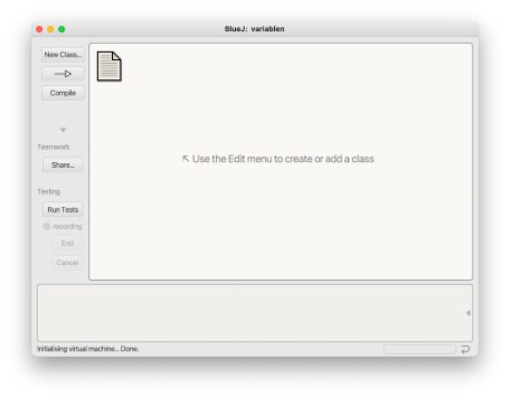
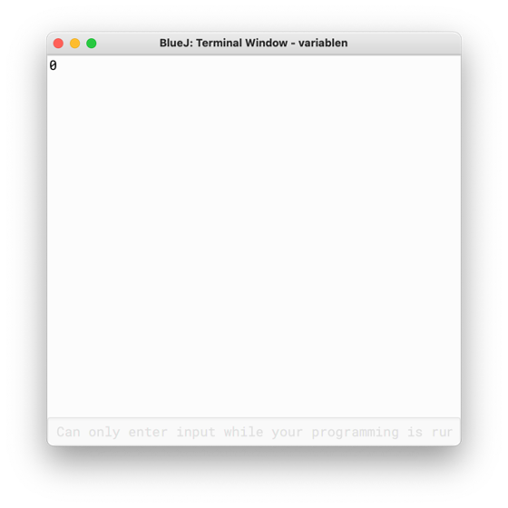
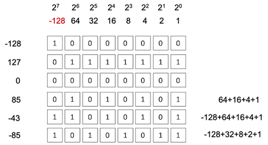

# Variablen und Datentypen

Sowohl in dem [**euklidischen Algorithmus**](../start/#beispiel-euklidischer-algorithmus) als auch bei der [**(3n+1)-Vermutung**](../start/#beispiel-3n1-vermutung-collatz-problem) haben wir mit Zahlen gerechnet. Diese haben wir in *Variablen* gespeichert (z.B. `a`, `b`, `n`). Wir kennen Variablen bereits aus der Mathematik. Dort "speichern" wir Werte in diesen Variablen. Das gleiche passiert auch beim Programmieren. 

## Unsere erste Klasse

Damit wir das Thema *Variablen und Datentypen* auch gleich anwenden können, schreiben wir nun endlich unser erstes Programm, d.h. wir implementieren unsere erste Klasse. Dazu öffnen wir BlueJ und wählen im Menü `Project --> New Project`. Es öffnet sich ein Dateiauswahlfenster. Unter `Location` sollten Sie sich einen Ordner aussuchen, in den Sie zukünftig Ihre BlueJ-Projekte speichern, z.B. unter Ihren `Dokumenten/Prog1/BlueJ`. Als Projektname können Sie z.B. `variablen` nehmen. 


Es erscheint 



Klicken Sie auf den Button `New Class...` und geben Sie Ihrer Klasse den Namen `Variablen`. Beachten Sie, dass wir Klassennamen stets mit einem Großbuchstaben beginnen!


Klicken Sie den Button `Compile`, dann verschwinden die Streifen im Klassen-Icon. Doppelklicken Sie auf die Klasse `Variablen`, es öffnet sich das Editor-Fenster:


Wir schauen uns den darin enthaltenen Code mal etwas genauer an (die erste leere Zeile habe ich gelöscht, deshalb ist die Zeilennummerierung um 1 versetzt):

```java linenums="1"
/**
 * Write a description of class Variablen here.
 *
 * @author (your name)
 * @version (a version number or a date)
 */
public class Variablen
{
    // instance variables - replace the example below with your own
    private int x;

    /**
     * Constructor for objects of class Variablen
     */
    public Variablen()
    {
        // initialise instance variables
        x = 0;
    }

    /**
     * An example of a method - replace this comment with your own
     *
     * @param  y  a sample parameter for a method
     * @return    the sum of x and y
     */
    public int sampleMethod(int y)
    {
        // put your code here
        return x + y;
    }
}
```

- Die Zeilen `1`-`6` enthalten einen Kommentar, einen sogenannten *JavaDoc-Kommentar*. *JavaDoc-Kommentare* beginnen mit `/**` und enden mit `*/`. Dazwischen kann alles stehen und solche Kommentare gehen meistens über mehrere Zeilen. Wir werden *JavaDoc* noch näher kennenlernen. 
- In Zeile `7` steht die Klassensignatur. Es handelt sich um eine öffentliche Klasse (deshalb `public` - lernen wir noch) und nach dem Schlüsselwort `class` steht der Klassenname `Variablen`. 
- In Zeile `8` beginnt die Implementierung der Klasse. Diese Implementierung wird durch eine öffnende geschweifte Klammer `{` begonnen und endet in Zeile `32` mit der schließenden geschweiften Klammer `}`.
- In Zeile `9` steht ein sogenannter *Zeilenkommentar*. Ein *Zeilenkommentar* beginnt mit `//` und endet automatisch am Ende der Zeile. Hier dient der Kommentar dazu, über die Objektvariable `x` zu informieren, die in Zeile `10` *deklariert* wird. 
- In Zeile `10` wird eine *Variable deklariert*. Der Name der Variable ist `x`. Sie ist vom *Datentyp* `int`. Wir können nur innerhalb der Klasse `Variablen` auf diese Variable zugreifen, da sie als `private` deklariert wird. Zu *Variablen und Datentypen* kommen wir gleich ausführlich. 
- In den Zeile `12-14` steht erneut ein *JavaDoc-Kommentar* - dieses Mal kommentiert er die nachfolgende Methode, den sogenannten *Konstruktor*. 
- In den Zeilen `15-19` sehen wir die erste Methode der Klasse. Diese Methode ist speziell, denn sie heißt exakt so, wie die Klasse selbst. Es handelt sich um einen sogenannten *Konstruktor*. Diese Methode wird aufgerufen, um ein Objekt der Klasse zu erzeugen. Wir werden uns ausführlich mit *Konstruktoren* beschäftigen. 
- Typischerweise werden im Konstruktor alle Objektvariablen *initialisiert*, d.h. die Objektvariablen bekommen einen initialen Wert. Hier wird der Objektvariablen `x` der Wert `0` zugewiesen (Zeile `18`).
- In den Zeilen `27-31` wird die Methode `sampleMethod()` implementiert. Dieser Methode wird ein Parameter `y` vom Typ `int` übergeben. Diese Methode gibt den Wert der Summe von `x` und `y` zurück. Wir kommen dazu, wenn wir uns ausgiebiger mit Methoden beschäftigen. 

Zunächst ändern wir dieses Programm, indem wir

- (fast) alle Kommentare löschen und 
- die `sampleMethod()`-Methode umbenennen und umprogrammieren.

Unsere Klasse sieht nun so aus:


```java linenums="1"
public class Variablen
{
    // Objektvariablen
    private int x;

    public Variablen()
    {
        x = 0;
    }

    // Objektmethoden
    public void printObjectState()
    {
        System.out.println(x);
    }
}
```

Die Implementierung unserer Objektmethode hat sich geändert:

- der Name der Methode ist nun `printObjectState()`,
- die Methode erwartet keinen Parameter mehr, 
- der *Rückgabetyp* (kennen wir noch nicht) der Methode ist nicht mehr `int`, sondern `void` und
- die Implementierung der Methode besteht aus einer einzigen Anweisung `System.out.println(x);` .

Wir klicken auf den `Compile`-Button, dann erzeugen wir uns ein Objekt von der Klasse `Variablen` und nennen es `variable1` und führen für dieses Objekt die Methode `printObjectState()` aus. Es erscheint



Dieses Fenster ist unser *Terminal-Fenster* (auch *Konsole* genannt). In diesem *Terminal-Fenster* wird der Wert der Objektvariablen `x` ausgegeben. Dieser Wert ist `0`.

### System.out.println(x);

Schauen wir uns `System.out.println(x);` zunächst etwas genauer an. Wir verwenden hier eine Klasse, nämlich die Klasse `System`. Diese Klasse existiert bereits und wurde von den Java-Entwicklern für uns geschrieben. Sie gehört zum Standardpaket von Java, existiert bereits seit der ersten Version von Java und befindet sich im Paket `java.lang` (zu *Paketen* kommen wir später). Diese Klasse hat eine interessante (Klassen-)Variable, die wir verwenden, nämlich `out`. Diese Variable stellt in unserem (Betriebs-)System die Verbindung zu unserem Standardausgabegerät bereit, in unserem Fall die *Konsole* (das *Terminal-Fenster*). Um nun eine Ausgabe auf diese Konsole zu generieren, verwenden wir die Methode `println()`. Wir sehen hier eine typische Notation in Java, die sogenannte *Punktnotation*. Mithilfe dieser Punktnotation greifen wir auf Eigenschaften von Klassen und Objekten zu. In unserem Beispiel greifen wir mit `System.out` auf das Standardausgabegerät zu und mit `System.out.println()` auf die `println()`-Methode des Ausgabegerätes[^1].

[^1]: Wenn wir ganz genau sein wollen, dann ist `out` vom Typ `PrintStream` und wir greifen auf die Objektmethode `println()` des `PrintStream`-Objektes `out` zu. 

Die Methode `println()` erzeugt also eine Ausgabe auf unsere Konsole. Jetzt müssen wir nur noch sagen, WAS ausgegeben werden sollen. Dazu übergeben wir dieser Methode hier die Variable `x`. Der Wert dieser Variablen (`0`) wird gelesen und ausgegeben. 

Bei `System.out.println(x);` handelt es sich um eine *Anweisung*. Eine Anweisung endet in Java immer mit einem Semikolon `;`. Dieses dürfen wir nicht vergessen, ansonsten haben wir einen *Syntaxfehler* und unser Programm kann nicht compiliert und nicht ausgeführt werden. 

### println() vs. print()

In unserem ersten Programm haben wir die Methode `println()` verwendet, um etwas auf der Konsole auszugeben. Es gibt noch eine andere Möglichkeit für die Ausgabe auf die Konsole, nämlich die Methode `print()`, also ohne `ln`. Das `ln` steht für *Line* und gibt an, dass nach der Ausgabe ein Zeilenumbruch erfolgt. Wir ändern zunächst unser Programm, indem wir die Anweisung `System.out.println(x);` kopieren und weitere 2x einfügen.

=== "printObjectState()-Methode mit println()"
	``` java linenums="1" hl_lines="15 16"
	public class Variablen
	{
	    // Objektvariablen
	    private int x;

	    public Variablen()
	    {
	        x = 0;
	    }

	    // Objektmethoden
	    public void printObjectState()
	    {
	        System.out.println(x);
	        System.out.println(x);
	        System.out.println(x);
	    }
	}
	```

Um das Überprüfen unserer Änderungen zu beschleunigen, klicken wir mit der rechten Maustaste auf die Klasse `Variablen` und wählen `Create Test Class`. Es entsteht eine Testklasse `VariablenTest` (grüner Kasten). Wir klicken mit der rechten Maustaste auf diesen grünen Kasten und wählen `Create Test Method...`. Wir werden nach einem Namen für die testmethode gefragt und wählen `testPrintObjectState`. Nun wird unser Test "aufgenommen". Wir erzeugen ein Objekt der Klasse `Variablen`, nennen dieses Objekt `variable1` und rufen für dieses Objekt die Methode `printObjectState()` auf. Dann beenden wir die "Aufnahme" des Tests, indem wir unter `recording` auf den Button `End` klicken. Nun brauchen wir für das Ausführen unserer Methode immer nur noch die `testPrintObjectState()`-Methode der Klasse `VariablenTest` auszuführen (Rechtsklick auf die Klasse und Methode auswählen). Das ruft die Erzeugung eines `Variablen`-Objektes auf und führt dafür die Methode `printObjectState()` aus. 

In unserem Terminal (der Konsole) erscheinen

``` bash
0
0
0
```

Eventuell sind bei Ihnen vier `0` untereinander, weil das Terminal noch die `0` vom ersten Test angezeigt hatte. Das können Sie verhindern, indem Sie im `BlueJ`-Menü `Options` auswählen und darin einen Haken bei `Clear screen at method call` setzen. 


Das heißt, dass jede der Ausgaben mithilfe der `println()`-Methode in einer neuen Zeile erfolgt. Nach jeder Ausgabe erfolgt also ein Zeilenumbruch, der Ausgabecursor wird in die nächste Zeile gesetzt. Die nächste Ausgabe beginnt am Anfang der neuen Zeile. 

Wir wollen nun unser Programm ändern und verwenden nicht mehr die `println()`- Methode, sondern `print()`:

=== "printObjectState()-Methode mit print()"
	``` java linenums="1" hl_lines="14-16"
	public class Variablen
	{
	    // Objektvariablen
	    private int x;

	    public Variablen()
	    {
	        x = 0;
	    }

	    // Objektmethoden
	    public void printObjectState()
	    {
	        System.out.print(x);
	        System.out.print(x);
	        System.out.print(x);
	    }
	}
	```

Wir führen den Test erneut aus und erhalten auf der Konsole die Ausgabe:

``` bash
000
```

Die `print()`-Methode gibt also nur den Wert der Variablen `x` aus, führt aber danach keinen Zeilenumbruch durch. Der Ausgabecursor bleibt hinter dem letzten ausgegebenen Zeichen stehen. Unsere drei Nullen werden in der Konsole deshalb hintereinander ausgegeben.

Wir ändern nun unser Programm erneut und fügen folgende Anweisungen hinzu: `System.out.println()`. Wir rufen also die `println()`-Methode auf, ohne eine Zeichenkette zu übergeben, die ausgegeben werden soll. Diese Anweisung sorgt einfach dafür, dass ein Zeilenumbruch erfolgt. Es wird also nichts ausgegeben, aber der Ausgabecursor an den Beginn der nächsten Zeile gesetzt.

=== "printObjectState()-Methode mit print() und println()"
	``` java linenums="1" hl_lines="15 17 19"
	public class Variablen
	{
	    // Objektvariablen
	    private int x;

	    public Variablen()
	    {
	        x = 0;
	    }

	    // Objektmethoden
	    public void printObjectState()
	    {
	        System.out.print(x);
	        System.out.println();
	        System.out.print(x);
	        System.out.println();
	        System.out.print(x);
	        System.out.println();
	    }
	}
	```

Wir führen den Test erneut aus und erhalten auf der Konsole die Ausgabe:

``` bash
0
0
0
```

!!! question "Übung"
	Erzeugen Sie folgende Ausgabe auf der Konsole:
	``` bash
	0

	0

	0

	```

??? example "Eine mögliche Lösung"
	``` java linenums="1"
	public class Variablen
	{
	    // Objektvariablen
	    private int x;

	    public Variablen()
	    {
	        x = 0;
	    }

	    // Objektmethoden
	    public void printObjectState()
	    {
	        System.out.println(x);
	        System.out.println();
	        System.out.println(x);
	        System.out.println();
	        System.out.println(x);
	        System.out.println();
	    }
	}
	```

So, jetzt haben wir unser erstes Programm geschrieben und können nun Variablen kennenlernen und dieses Konzept auch gleich anwenden. 

## Variablen

Eine Variable kann man sich wie eine Kiste vorstellen, in die genau ein *Wert* passt. Diese Kiste hat einen Namen (den Namen der Variable) und in der Programmierung wird auch noch gesagt, welche Art von Wert dort hineinpasst. Man spricht auch vom *Typ* der Variablen oder noch besser vom *Datentyp*. 

Eine Variable besteht also aus drei Dingen:

- dem Wert der Variablen (genau einer)
- dem Datentyp der Variablen (besteimmt den Wertebereich, also die möglichen Werte, die die Variable annehmen kann)
- dem Namen der Variablen (dafür gibt es Regeln, wie solche *Bezeichner* aussehen dürfen)


Das Erstellen einer Variablen (die *Definition einer Variablen*) besteht in der Programmierung aus zwei Schritten:

1. der *Variablendeklaration*: in der Deklaration wird festgelegt, wie die Variable heißt und von welchem Datentyp sie ist
2. der *Initialisierung*: bei der Initialisierung wird der Variablen ihr erster Wert zugewiesen

Damit wir einer Variablen ihren Datentyp zuweisen können, müssen wir die Datentypen zunächst kennenlernen, die eine Variable haben kann. 

## Datentypen in Java

In Java gibt es acht sogenannte *primitive Datentypen*. Wir bezeichnen diese *primitiven Datentypen* als *Wertetypen*. Eine Variable von einem *Wertetyp* kann genau einen Wert annehmen. In folgender Tabelle sind diese Datentypen aufgelistet und ihre jeweilige Bedeutung erklärt.

<table>
	<thead>
		<tr>
			<th> Datentyp </th>
			<th> Bedeutung </th>
		</tr>
	</thead>
	<tbody>
		<tr>
			<td> <code>int</code> </td>
			<td> eine Variable vom Datentyp <code>int</code> kann ganzzahlige Werte speichern, also positive und negative ganze Zahlen. Die kleinste Zahl vom Typ <code>int</code> ist <code>-2^31</code> "klein" und die größte Zahl vom Typ <code>int</code> ist <code>2^31-1</code> groß. <code>int</code> ist der Standard-Typ für ganze Zahlen in Java. <code>int</code> steht für <code>integer</code>. 
			</td>
		</tr>
		<tr>
			<td>  <code>byte</code>     </td>
			<td>  eine Variable vom Datentyp <code>byte</code> kann ebenfalls ganzzahlige Werte speichern, also positive und negative ganze Zahlen. Im Gegensatz zu <code>int</code> ist der Wertebereich aber viel kleiner. Die kleinste <code>byte</code>-Zahl ist <code>-2^7</code> klein und die größte <code>byte</code>-Zahl ist <code>2^7-1</code> groß. </td>
		</tr>
		<tr>
			<td>  <code>short</code>     </td>
			<td> eine Variable vom Datentyp <code>short</code> kann ebenfalls ganzzahlige Werte speichern, also positive und negative ganze Zahlen. Im Gegensatz zu <code>int</code> ist der Wertebereich aber viel kleiner. Im Gegensatz zu <code>byte</code> ist er aber größer. Die kleinste <code>short</code>-Zahl ist <code>-2^15</code> klein und die größte <code>short</code>-Zahl ist <code>2^15-1</code> groß. </td>
		</tr>
		<tr>
			<td>  <code>long</code>    </td>
			<td>  eine Variable vom Datentyp <code>long</code> kann ebenfalls ganzzahlige Werte speichern, also positive und negative ganze Zahlen. Im Gegensatz zu <code>int</code> ist der Wertebereich aber viel größer. <code>long</code> wird immer dann verwendet, wenn der Wertebereich von <code>int</code> nicht ausreicht, also entweder für sehr, sehr kleine oder sehr, sehr große Zahlen. Die kleinste <code>long</code>-Zahl ist <code>-2^63</code> klein und die größte <code>long</code>-Zahl ist <code>2^63-1</code> groß. </td>
		</tr>
		<tr>
			<td>  <code>char</code>  </td>
			<td>  Der Datenyp <code>char</code> steht für <code>character</code>. Mit diesem Datentypen werden einzelne Zeichen gespeichert. Der Datentyp <code>char</code> ist ebenfalls ein ganzzahliger Datentyp, nimmt aber nur positive Werte (aus dem Wertebereich <code>0</code> bis <code>65535</code> an.) Diese Werte sind Zahlenwerte, die der Codierung eines Zeichens entsprechen, z.B. dem Zeichen <code>'a'</code>. Ein solches Zeichen steht immer in einfachen Hochkommata <code>''</code>. </td>
		</tr>
		<tr>
			<td>  <code>boolean</code>  </td>
			<td>  Der Datentyp <code>boolean</code> kennt nur genau zwei Werte <code>true</code> und <code>false</code>. Eine Variable vom Datentyp <code>boolean</code> kann also entweder genau <code>true</code> sein oder genau <code>false</code>, nichts anderes. </td>
		</tr>
		<tr>
			<td>  <code>double</code>  </td>
			<td>  Der Datentyp <code>double</code> ist in Java der Standard-Datentyp für Gleitkommazahlen (also gebrochene Zahlen mit Komma). Die kleinste und größte <code>double</code>-Zahl lässt sich nicht genau bestimmen, denn das hängt von der Genauigkeit der Angabe hinter dem Komma ab. Es werden aber 64 bit verwendet, um eine <code>double</code>-Zahl zu speichern. </td>
		</tr>
		<tr>
			<td>  <code>float</code>  </td>
			<td>  <code>float</code> ist neben <code>double</code> ein weiterer Datentyp für Gleitkommazahlen. Die Genauigkeit der Speicherung als <code>float</code> ist aber nicht so groß wie bei <code>double</code>, da <code>float</code> nur 32 bit zur Speicherung einer Zahl zur Verfügung hat. </td>
		</tr>
	</tbody>
</table>

### Deklaration von Variablen

Nun, da wir Datentypen kennen, können wir Variablen "erzeugen". Das "Erzeugen" von Variablen besteht aus zwei Schritten:

1. wir vergeben einen Namen für unsere Variable und
2. wir weisen der Variablen einen Datentyp zu. 

Dieses Erzeugen von Variablen nennt sich *Deklaration* (oder *Variablendeklaration*). Die allgemine Syntax der Variablendeklaration ist wie folgt:

```bash
datentyp variablenName;
``` 

Wir geben also zuerst den Datentyp an, dann kommt ein Leerschritt, dann den Bezeichner für die Variable (den Namen) und dann folgt ein Semikolon, weil es sich um eine Anweisung handelt. 

Beispiele:

```java 
int ganzeZahl;
int number;
long bigNumber;
byte smallNumber;
double nr1;
float nr2;
boolean condition;
char character;
```

Für eine Variable wird die Deklaration **genau einmal** durchgeführt. Danach existiert sie und sie kann auch (in Java) nicht ihren Datentypen ändern. Noch haben unsere Variablen keine Werte. Das erfolgt erst durch die Initialisierung, also die erste Wertzuweisung. Ehe wir uns das anschauen, überlegen wir uns zunächst, welche möglichen Bezeichner wir für unsere Variablennamen verwenden können.

### Bezeichner

Wenn es um Namen geht, die wir in Java selbst vergeben wollen, dann sprechen wir von *Bezeichnern*. Bezeichner sind nicht nur die Namen von Variablen, sondern später auch für Methoden, Klassen, Enumerations, Exceptions und Interfaces. 

Es gibt einige Regeln für Bezeichner, die wir beachten müssen:

- Bezeichner **müssen** mit einem Java-Buchstaben beginnen
- Bezeichner setzen sich aus Java-Buchstaben und Java-Zahlen zusammen
- Java-Buchstaben sind mehr als `a`-`z` und `A`-`Z`
- z.B. auch `€`, `£`, `¥`, `$`, Umlaute `ä`, `ö`, `ü`, `ß`sowie Buchstaben mit Apostrophen
- Aber: wir verwenden nur die normalen Buchstaben `a`-`z` und `A`-`Z`!!! Alles andere führt zu Problemen
- wichtig: **keine** Leerzeichen, **keine** reservierten Schlüsselwörter und **keine** Sonderzeichen, wie z.B. `!`, `/`, `*`, `{`, `[`, `.`, `]`, `}`
- In Java wird Groß- und Kleinschreibung unterschieden (*case sensitive*)!

Reservierte Schlüsselwörter sind Begriffe aus dem Java-Sprachumfang (alle kleingeschrieben)[^1]. Dazu gehören:

[^1]: `const` und `goto` gehören eigentlich gar nicht zum Sprachumfang von Java und sind aber trotzdem reservierte Schlüsselwörter.


<table style="boder: none;">	
	<tr>		
		<td><code>abstract</code></td> 	
		<td><code>assert</code></td>
		<td><code>boolean</code></td>
		<td><code>break</code> 	</td> 	
		<td><code>byte</code> 		</td> 	
	</tr>
	<tr>		
		<td><code>case</code> </td>
		<td><code>catch</code> 	</td> 	
		<td><code>char</code> 		</td> 	
		<td><code>class</code> </td>
		<td><code>const</code> 	</td> 	
	</tr>
	<tr>		
		<td><code>continue</code>  </td> 	
		<td><code>default</code> </td>
		<td><code>do</code> 		</td> 	
		<td><code>double</code> 	</td> 	
		<td><code>else</code>	</td>
	</tr>
	<tr>		
		<td><code>enum</code>	</td> 	
		<td><code>extends</code> 	</td> 	
		<td><code>final</code> </td>
		<td><code>finally</code> </td>
		<td><code>float</code></td>
	</tr>
	 <tr>
		<td><code>for</code> </td>
		<td><code>goto</code></td>
		<td><code>if</code> </td>
		<td><code>implements</code> </td>
		<td><code>import</code> </td>
	</tr>
	 <tr>		
		<td><code>instanceof</code> </td>
		<td><code>int</code> </td>
		<td><code>interface</code> </td>
		<td><code>long</code> </td>
		<td><code>native</code> </td>
	</tr>
	 <tr>
		<td><code>new</code> </td>
		<td><code>package</code> </td>
		<td><code>private</code> </td>
		<td><code>protected</code> </td>
		<td><code>public</code></td>
	</tr>
	 <tr>
		<td><code>return</code> </td>
		<td><code>short</code> </td>
		<td><code>static</code></td>
		<td><code>strictfp</code> </td>
		<td><code>super</code> </td>
	</tr>
	 <tr>
		<td><code>switch</code> </td>
		<td><code>synchronized</code> </td>
		<td><code>this</code> </td>
		<td><code>throw</code> </td>
		<td><code>throws</code> </td>
	</tr>
	 <tr>
		<td><code>transient</code> </td>
		<td><code>try</code></td>
		<td><code>void</code> </td>
		<td><code>volatile</code> </td>
		<td><code>while</code></td>
	</tr>
</table>


!!! question "Übung Bezeichner"
	Warum sind das keine gültigen Bezeichner in Java?

	- `2und2macht4`
	- `class`
	- `Hose gewaschen`
	- `Hurtig!`
	- `null`

##### Konventionen

Wir wissen jetzt, was gültige Bezeichner sind und was ungültige. Darüber hinaus gibt es aber auch Vereinbarungen, die helfen, einen besser verständlichen und konsistenteren Code zu schreiben:

- wir vergeben nur "sprechende" Namen, d.h. man erkennt bereits am Bezeichner, wozu die Variable dient, z.B. `sum`, `input`, `checkIfEmpty` usw.
- Variablennamen beginnen stets mit einem Kleinbuchstaben (einzige Ausnahmen sind Konstanten, diese schreiben wir vollständig groß, d.h. aus lauter Großbuchstaben)
- Methodennamen beginnen ebenfalls mit einem Kleinbuchstaben, Klassen und Interfaces beginnen stets mit einem Großbuchstaben
- verwenden die sogenannte *camelCaseSchreibweise*. Da keine Leerzeichen erlaubt sind, wir aber sprechende Namen haben wollen, die aus mehreren Wörtern bestehen können, schreiben wir den Beginn eines neuen Wortes immer groß (außer ganz am Anfang, denn Methoden- und Variablennamen beginnen ja mit einem Kleinbuchstaben.)

### Initialisierung von Variablen

Nach der Deklaration einer Variablen existiert diese zwar, sie hat jedoch noch keinen Wert. Wir wollen sicherstellen, dass Variablen immer einen Wert haben. Du weisen wir den Variablen direkt nach der Deklaration einen Wert zu. Die erstmalige *Wertzuweisung* einer Variablen wird *Initialisierung* genannt. 

#### Der Wertzuweisungsoperator `=`

Um einer Variablen einen Wert zuzuweisen, wird der *Wertzuweisungsoperator* verwendet. Dieser ist ein eifaches Gleichheitszeichen `=`. Die Syntax der Wertzuweisung ist wie folgt:

```bash
variablenName = wert;
```

Auf der linken Seite steht also immer die Variable und auf der rechten Seite der Wert. Auch hier muss am Ende wieder zwingend das Seikolon stehen, denn es handelt sich um eine Anweisung. Wichtig ist, dass der Wert dem Datentyp der Variablen entspricht!

Wir geben einige Beispiele für Variablen an, die wir oben deklariert hatten:

```java
ganzeZahl = 5;			// int
number = -1234;			// int
bigNumber = 12345678;	// long
nr1 = 6.54321;			// double
condition = true;		// boolean
character = 'a';		// char
```

Nachdem einer Zahl mithilfe des Wertzuweisungsoperators ein Wert zugewiesen wurde, behält die Variable den Wert so lange bis ihr ein neuer Wert (mithilfe des Wertzuweisungsoperators) zugewiesen wird. Einer Variablen kann beliebig oft ein neuer Wert zugewiesen werden. 

### Deklaration und Initialisierung in einem Schritt

Da wir möchten, dass eine Variable sofort nach ihrer Deklaration einen Wert zugewiesen bekommt, ist es üblich, die Deklaration und die Initialisierung in einem Schritt, d.h. durch **eine** Anweisung durchzuführen. Die Syntax der kombinierten Anweisung (Deklaration und INitialisierung) ist wie folgt:

```bash
datentyp variablenName = wert;
```
Wir zeigen die Anwendung der kombinierten Deklaration und Initialisierung anhand der bereits verwendeten Beispiele:

```java
int ganzeZahl = 5;			
int number = -1234;			
long bigNumber = 12345678;	
double nr1 = 6.54321;			
boolean condition = true;		
char character = 'a';		
```

!!! info "Beachte"
	Wie bereits erwähnt, kann eine Variable genau ein Mal deklariert, ihr aber beliebig oft ein neuer Wert zugewiesen werden. Angenommen, Sie wollen der Variablen `ganzeZahl` einen neuen Wert zuweisen, dann schreiben Sie die Anweisung `ganzeZahl = 6;`. Sie dürfen auf keinen Fall `int ganzeZahl = 6;` schreiben, denn dann würden Sie ja versuchen, die Variable `ganzeZahl` erneut zu deklarieren. Diese existiert aber bereits. Sie bekommen einen Compilerfehler und können ihr Programm gar nicht erst übersetzen. 	

## Details zu primitiven Datentypen (Wertetypen)

Wie wir bereits bei der Vorstellung der primitiven Datentypen erwähnt haben, ist für jeden Datentyp eine gewisse Speichergröße reserviert. Hier noch einmal die Größe der primitiven Datentypen:

| Datentyp  | Größe | Wertebereich |
|-----------|-------|--------------|
| `boolean` | 1 Byte[^2] | `true` / `false` |
| `char` | 16 bit | `0` ... `65.535` (z.B. `'A'`) | 
| `byte` | 8 bit  | `-128` ... `127` |
| `short` | 16 bit | `-32.768` ... `32.767` |
| `int`  | 32 bit | `-2.147.483.648` ... `2.147.483.647` | 
| `long` | 64 bit | `-2^63` ... `2^63-1` | 
| `float` | 32 bit | `+/-1,4E-45` ... `+/-3,4E+38` |
| `double` | 64 bit | `+/-4,9E-324` ... `+/-1,7E+308` |

[^2]: Tatsächlich ist die Größe eines `boolean` gar nicht genau definiert (siehe [**hier**](https://docs.oracle.com/javase/tutorial/java/nutsandbolts/datatypes.html)). man braucht ja eigentlich nur ein bit. Man liest aber sehr häufig davon, dass einer Variablen vom Typ `boolean` ein ganzes Byte reserviert wird. 

Wir schauen uns jetzt noch einige interssante Details zu den Datentypen an.

### Ganzzahlige Datentypen `int`, `long`, `short`, `byte`

Eine ganze Zahl in einem Java-Programm ist vom Typ `int`. Dieser Datentyp ist der Standard-Datentyp für ganze Zahlen. Ganze Zahlen werden intern im sogenannten *Zweierkomplement*  dargestellt. Wir schauen uns diese Darstellung am Beispiel des Datentyps `byte` (der 8 bit groß ist) einmal genauer an. In der folgenden Darstellung steht die Bedeutung der Position der einzelnen bits ganz oben, beginnend mit der `1` (`2^0`) auf der rechten Seite ("kleinstes" bit) bis hin zu `2^7` auf der linken Seite ("größtest" bit). Beim Zweierkomplement entspricht diese höchste Position jedoch nicht der `128`, sondern der `-128`. Dies hat drei Vorteile

- es wird nicht ein ganzes bit dafür verwendet, um zu unterscheiden, ob es sich um eine positive oder negative Zahl handelt
- die `0` kommt nicht 2x vor (`1000 0000` und `0000 0000` wäre jeweils `0`, wenn das führende bit darüber entscheiden würde, ob die Zahl positiv oder negativ ist)
- sowohl die Addition als auch die Subtraktion geht einfacher



Die Abbildung zeigt in den oberen drei Zeilen die interne Darstellung von `-128`, `127` und `0`.  In den drei Zeilen darunter ist dargestellt, wie z.B. die Zahlen `85`, `-43` und `-85` als Zweierkomplement repräsentiert werden. 

Die folgende Abbildung zeigt die Addition (und somit auch die Subtraktion) zweier Zahlen im Zweierkomplement. Dargestellt sidn die Repräsentationen von `-4` und `3` als Zweierkomplement. Es wird die Addition der beiden Zahlen gezeigt. 


Da die Werte alle einen begrenzten Wertebereich haben, kann es zu einem *Wertebereichsüberlauf* kommen. Ein solcher Überlauf ist in der folgenden Abbildung dargestellt. Im Datentyp `byte` ist `127` die größte positive Zahl. Die Abbildung verdeutlicht, was passiert, wenn zu dieser größten Zahl eine `1` hinzuaddiert wird. 


Beachten Sie, dass ein solcher Überlauf unbemerkt passiert. Das bedeutet, dass Sie weder einen Fehler noch eine Warnung erhalten. Sie müssen sich also immer gut überlegen, ob ein solcher Überlauf bei Ihren Werten passieren kann. Wenn ja, dann sollten Sie zum nächstgrößeren Datentypen wechseln, also z.B. von `int` nach `long`. 

| Datentyp  |größter Wert |kleinster Wert |
|-----------|-------------:|---------------:|
| `byte` | `127` |  `-128` |
| `short` | `32.767` |  `-32.768` |
| `int`   | `2.147.483.647` | `-2.147.483.648`| 
| `long`  | `9.223.372.036.854.775.807` | `-9.223.372.036.854.775.808` | 

!!! question "Übung Zweierkomplement"
	- Warum ist `1111 1111` als Zweierkomplement im Datentyp `byte` die Dezimalzahl `-1`?
	- Wie ist die Repräsentation der Zahlen `-99` und `99` als Zweierkomplement im Datentyp `byte`?
	- Was ist das Ergebnis der Rechnung `2.147.483.647 + 1` im Datentyp `int` und warum?

#### Initialisierung von `long`-Variablen.

Eine ganze Zahl als *Literal*, also als alleinstehender Wert ist vom Typ `int`. Wenn wir folgende kombinierte Deklaration und INitialisierung betrachten:

```java 
long bigNumber = 12345678;
```

dann stellen wir fest, dass die Variable `bigNumber` auf der linken Seite des Wertzuweisungsoperators vom Typ `long` ist, die Zahl `12345678` aber vom Typ `int`. Wir werden später noch auf solche *Typkonvertierung* zu sprechen kommen. Es sei hier jedoch bereits angemerkt, dass man eine ganze Zahl auch um das Postfix `L` ergänzen kann[^3] - mit der Wirkung, dass die Zahl dann nicht mehr vom Typ `int`, sondern vom Typ `long` ist. 

[^3]: Man könnte auch nit dem kleinen Buchstaben `l` ergänzen, das macht man aber nicht, weil die Verwechselungsgefahr mit der `1` zu groß ist. 

Die "richtige" Initialisierung sieht so aus: 

```java 
long bigNumber = 12345678L;
```

Es ist nur in wenigen Fällen wirklich erforderlich, das `L` an die Zahl zu hängen, wenn wir eine `long`-Variable initialisieren. Warum das so ist, werden wir kennenlernen, wenn wir uns über * Typkonvertierung*  Gedanken machen. Trotzdem sei hier schonmal erwähnt, dass diese Deklaration und Initailisierung kein Problem ist 

```java
long bigNumber = 2147483647;
```

aber hier bekommen wir einen Fehler und können das Programm gar nicht übersetzen:

```java
long bigNumber = 2147483648;
```

Warum könnte das wohl so sein? Wenn wir es "richtig" machen, also mit angehängtem `L`, dann ist auch wieder alles in Ordnung und das Programm lässt sich compilieren:

```java
long bigNumber = 2147483648L;
```

In unseren Programmen werden wir zu 99% den Datentyp `int` für ganzzahlige Werte verwenden und zu 1% `long`. Die anderen ganzzahligen Datentypen `byte` und `short` braucht man eigentlich gar nicht mehr, da wir keinen Wert mehr darauf legen müssen, Arbeitsspeicher zu sparen. 

### `char`

Der Datentyp `char` ist für das Speichern von Zeichen vorgesehen. Es handelt sich um einen ganzzahligen Datentypen. Mit den ersten Computern stellte sich die Frage, wie Zeichen (also Ziffern und Buchstaben) intern *codiert* werden können. Es hat sich dann zunächst die Zeichencodierung des **American Standard Code for Information Interchange (ASCII)** durchgesetzt, bei der 7 Bit (=128 Zeichen) dazu verwendet wurden, die wichtigsten Zeichen zu kodieren. Neben einigen Steuerzeichen (die ersten 33 "Zeichen", z.B. Zeilenvorschub, `ESC`-Zeichen) wurden z.B. folgende Zeichen wie folgt kodiert:

| Dezimalzahl | Zeichen     | Dezimalzahl | Zeichen     | Dezimalzahl | Zeichen     |
|-------------|-------------|-------------|-------------|-------------|-------------|
| 33  | `!`  | 47  | `/`  | 61  | `=`  |
| 34  | `""` | 48  | `0`  | 62  | `>`  |
| 35  | `#`  | 49  | `1`  | 63  | `?`  |
| 36  | `$`  | 50  | `2`  | 64  | `@`  |
| 37  | `%`  | 51  | `3`  | 65  | `A`  |
| 38  |  `&` | 52  | `4`  | 66  | `B`  |
| 39  |  `'` | 53  | `5`  | 67  | `C`  |
| 40  | `(`  | 54  | `6`  | 68  | `D`  |
| 41  |  `)` | 55  | `7`  | 69  | `E`  |
| 42  |  `*` | 56  | `8`  | 70  | `F`  |
| 43  |  `+` | 57  | `9`  | 71  | `G`  |
| 44  | `,`  | 58  | `:`  | 72  | `H`  |
| 45  | `-`  | 59  | `;`  | 73  | `I`  |
| 46  | `.`  | 60  | `<`  | 74  | `J`  |

| Dezimalzahl | Zeichen     | Dezimalzahl | Zeichen     | Dezimalzahl | Zeichen     |
|-------------|-------------|-------------|-------------|-------------|-------------|
| 75  | `K`  | 89  | `Y`  | 103  | `g`  |
| 76  | `L` | 90  | `Z`  | 104 | `h`  |
| 77  | `M`  | 91  | `[`  | 105 | `i`  |
| 78  | `N`  | 92  | `\`  | 106 | `j`  |
| 79  | `O`  | 93  | `]`  | 107 | `k`  |
| 80  | `P` | 94  | `^`  | 108  | `l`  |
| 81  | `Q` | 95  | `_`  | 109 | `m`  |
| 82  | `R`  | 96  | ```  | 110 | `n`  |
| 83  | `S` | 97  | `a`  | 111 | `o`  |
| 84  | `T` | 98  | `b`  | 112 | `p`  |
| 85  | `U` | 99  | `c`  | 113 | `q`  |
| 86  | `V`  | 100  | `d`  | 114  | `r`  |
| 87  | `W`  | 101 | `e`  | 115| `s`  |
| 88  | `X`  | 102 | `f`  | 116  | `t`  |

| Dezimalzahl | Zeichen     | Dezimalzahl | Zeichen     | Dezimalzahl | Zeichen     |
|-------------|-------------|-------------|-------------|-------------|-------------|
| 117  | `u`  | 121 | `y`  | 125 | `}`  |
| 118  | `v` | 122  | `z`  | 126 | `~` |
| 119 | `w`  | 123  | `{`  | 127  | `DEL`  |
| 120 | `x`  |124 | `|`  |  |   |

Diese Zeichenkodierung erklärt, warum es sich bei `char` um einen ganzzahligen Typ handelt. Anstelle eines Zeichens, welches immer in einfachen Hochkommata `''` angegeben werden muss, kann auch der ASCII-Code als Zahl verwendet werden. Folgende Beispiele zeigen dies:

=== "char ganzzahliger Typ"
	```java
	char c1 = 'a';
	System.out.println(c1);		// a
	char c2 = 97;
	System.out.println(c2);		// a
	char c3 ='`';
	c3++;
	System.out.println(c3);		// a
	```

Die 128 verschiedenen Zeichen genügten natürlich schnell nicht mehr und es wurden deutlich größere Kodierungstabellen entwickelt. Ein de-facto Standard ist `UTF-8`, welcher Bytes (also 8 Bit) zur Kodierung der Zeichen verwendet. Die ersten 128 Zeichen sind dabei mit dem ASCII-Code identisch. Im UTF-8 können aber mehrere Bytes hintereinander geschrieben werden und ermöglichen so einen beliebig großen Kodierungsraum. Der Datentyp `char` ist 16 Bit groß, kann also 2 Byte große Kodierungsräume darstellen (65 536 verschiedene Zeichen). Eine UTF-8-Tabelle finden Sie z.B. [**hier**](https://www.utf8-zeichentabelle.de/unicode-utf8-table.pl?number=1024&htmlent=1). Die linke Spalte in dieser Tabelle zeigt den *Unicode*. Dieser kann auch in Java (in leicht abgewandelter Form) verwendet werden. Scrollen Sie in der Tabelle ein wenig bis zur Position `U+00A9` herunter. Dort sehen Sie z.B. die Codierung des (c)-Copyright-Zeichens. In Java kann dieser Code wie folgt verwendet werden:

=== "char UTF-8 Zeichen"
	```java
	char u1 = '\u00a9';
	System.out.println(u1);		// copyright-Zeichen
	char u2 = '\u00b0';
	System.out.println(u2);		// Grad-Zeichen
	char u3 = '\u00bd';
	System.out.println(u3);		// 1/2-Zeichen
	```

### Gleitkomma-Datentypen `double`, `float`

Eine Gleitkomma-Zahl (also eine Zahl mit einem Punkt, z.B. `5.0` oder `-1.2345`) in einem Java-Programm ist vom Typ `double`. Dieser Datentyp ist der Standard-Datentyp für Gleitkomma-Zahlen. Der Wertebereich der Datentypen `double` und `float` lässt sich nicht so leicht angeben, denn entweder wird relativ viel "Speicher" für die Genauigkeit verwendet (für die Anzahl der Nachkommastellen, z.B. `0.123456789`) oder für die Vorkommastellen (z.B. `987654321.0`). Generell ist der Wertebereich (die Genauigkeit) bei `double` viel höher, denn für eine Variable vom Typ `double` werden 64 bit reserviert, während eine Variable vom Typ `float` nur 32 bit groß ist. Bei `float` beschränkt sich die Genauigkeit auf ca. 7 signifikante Stellen (Nachkommastellen), während es bei `double` ca. 17 signifikante Stellen sind. 

=== "Beispiel float"
	```java
	float floatNumber = 1.0f/3.0f;
	System.out.println(floatNumber);	// 0.33333334
	```

Im obigen Beispiel wird mithilfe von `float` der Bruch `1/3` ausgerechnet. Zwei Sachen sind zu beachten

1. Wie wir das schon beim Datentyp `long` gesehen haben, gibt es auch für Gleitkommazahlen ein Postfix, hier `f`, um zu sagen, dass eine Zahl vom Typ `float` sein soll. Ohne das `f` wäre sie vom Typ `double` und wir würden sogar einen Compilerfehler erhalten, wenn wir das `f` am Ende der Zahl nicht angeben würden. Hier ist es also wichtig, bei der Wertzuweisung anzugeben, dass die Zahl vom Typ `float` sein soll - nämlcih durch die Angabe von `f` (`F` ginge auch).
2. Die Genauigkeit bei `float` ist nicht sehr hoch. `1/3` im `float`-Wertebereich ergibt `0.33333334`. Schauen wir uns das gleiche Beispiel mit `double` an:

=== "Beispiel float"
	```java
	double doubleNumber = 1.0/3.0;
	System.out.println(doubleNumber);	// 0.3333333333333333
	```

Erstens hat der `double`-Wert deutlich mehr Nachkommastellen (16 statt 8 bei `float`) und zweitens ist der Wert somit korrekter. Die Speicherung von Gleikommazahlen erfolgt nach [**IEEE 754 - Standard**](https://standards.ieee.org/standard/754-2019.html). 

Wir merken uns:

- wir sollten `float` eher nicht verwenden, wenn wir Wert auf Genauigkeit legen,
- wenn wir `float` verwenden, dann müssen wir beim Initialisieren und bei allen Wertezuweisungen darauf achten, dass wir an die Gleikommazahl ein `f` anhängen, da es sich ansonsten um eine Gleitkommazahl vom Typ `double` handelt,
- `double` ist der Standardtyp für Gleikommazahlen und wenn eine Gleitkommazahl im Programmcode vorkommt, dann handelt es sich um eine Zahl vom Typ `double`. 

| Datentyp  |größter positiver Wert |kleinster positiver Wert |
|-----------|-------------:|---------------:|
| `float`   | `~3.4028234663852886E+038` | `~1.4012984643248171E-045`| 
| `double`  | `~1.7976931348623157E+308` | `~4.9406564584124654E-324` | 


## Der Datentyp `String` 

Der Datentyp `String` ist kein primitiver Datentyp (kein Wertetyp), sondern ein sogenannter *komplexer Datentyp* (oder, wie wir sagen *Referenztyp*). Wir erkennen das bereits daran, dass der Datentyp mit einem Großbuchstaben beginnt. Der Unterschied zwischen Variablen von einem Wertetypen und Variablen von Referenztypen ist der, dass die ersten "nur" Werte speichern (`3`, `5`, `'a'`, `123.45`, `true`, ...) und die anderen speichern *Objekte* (oder richtiger: Referenzen auf Objekte) - darum kümmern wir uns später sehr ausführlich. 

Wir können uns merken (ist aber derzeit noch nicht wichtig), dass ein String ein Objekt und kein einfacher Wert ist, aber derzeit betrachten wir den Datentyp `String` wie die primitiven Wertetypen auch. 

Ein `String`-Literal erkennt man an den doppelten Anführungsstrichen. Darin kann ein beliebiger Text (bestehend aus allen möglichen Zeichen, Buchstaben, Sonderzeichen, Umlauten etc.) stehen, z.B. `"Hallo FIW!"`, `"2und2gleich4 und $ % & 0? | \ !"`, `" ä ü ö ß`.

Die Deklaration und Initialisierung einer `String`-Variablen sieht also so aus:
```java
String s1 = "Informatik";
``` 

Auch für den Datentyp `String` gibt es einen Operator, der zwei Strings miteinander verbindet. Er wird *Konkatenation* (*String-Konkatenation* oder *Zeichenkettenverbindungsoperator* genannt). Das Operatorsymbol der Konkatenation ist in Java `+`. 

```java
String s1 = "Informatik" + " und" + " Wirtschaft";
System.out.println(s1);
``` 

Die folgenden drei Ausgaben sind alle gleich:
```java
String s1 = "Informatik" + " und" + " Wirtschaft";
System.out.println(s1); 			// Informatik und Wirtschaft

String s2 = "Informatik";
String s3 = " und";
String s4 = " Wirtschaft";
System.out.println(s2 + s3 + s4);	// Informatik und Wirtschaft

String s5 = "Informatik";
String s6 = s5 + " und";
String s7 = s6 + " Wirtschaft";
System.out.println(s7);				//Informatik und Wirtschaft
```

### Doppelte Bedeutung des Operatorzeichens `+`

Das `+` wird sowohl als arithmetischer Operator für numerische Datentypen als auch als Konkatenation für Strings verwendet. In den obigen Beispielen kommen wir damit nicht durcheinander, da völlig klar ist, dass es sich dabei um die Konkatenation handelt. Es gibt aber Beispiele, bei denen in einem Ausdruck beide Bedeutungen vorkommen. Diese diskutieren wir jetzt. Zunächst schauen wir uns noch eine Typische Verendung der Konkatenation an:

=== "typisches Beispiel für die Konkatenation"
	```java linenums="1"
	int summand1 = 3;
	int summand2 = 4;
	int summe = summand1 + summand2;
	System.out.println(summand1 + " + " + summand2 + " = " + summe);	// 3 + 4 = 7
	```
Die Ausgabe bei dem obigen Beispiel ist `3 + 4 = 7`. Schauen wir uns das Beispiel genauer an:

- In Zeile `3` wird das `+` eindeutig als arithmetischer Operator verwendet, denn es steht zwischen zwei numerischen Werten (`summand1` und `summand2` sind jeweils vom Typ `int`)
- In Zeile `4` kommt `+` mehrmals vor. Der Ausdruck in den runden Klammern von `println()` wird von links nach rechts aufgelöst:
	- Das Literal `" + "` ist ein String. Hier ist `+` gar kein Operator, sondern nur ein Zeichen.
	- Das `+` in `summand1 + " + "` ist die Konkatenation. Das liegt daran, dass einer der beiden Operanden, die das `+` verbindet, vom Typ `String` ist. Intern wird der Wert von `summand1` ( die `3`) zu einem String und dieser wird mit `" + "` verbunden. Es entsteht ein String `"3 + "`.  
	- Das bedeutet, dass das nächste `+` in dem Ausdruck `"3 + " + summand2` enthalten ist und auch hier die Bedeutung der Konkatenation hat, denn einer der beiden Operanden (der erste) ist vom Typ `String`. Intern wird der Wert von `summand2` ( die `4`) zu einem String und dieser wird mit `"3 + "` verbunden. Es entsteht ein String `"3 + 4"`. 
	- Das bedeutet, dass das nächste `+` in dem Ausdruck `"3 + 4" + " = "` enthalten ist und auch hier die Bedeutung der Konkatenation hat, denn beide Operanden (der erste und der zweite) sind vom Typ `String`. Es entsteht der String `"3 + 4 = "`.   
	- Das letzte `+` steht also in dem Ausdruck `"3 + 4 = " + summe`. Auch hier handelt es sich wieder um die Konkatenation, da einer der beiden Operanden (der erste) vom Typ `String` ist. Intern wird der Wert von `summe` ( die `7`) zu einem String und dieser wird mit `"3 + 4 = "` verbunden. Es entsteht ein String `"3 + 4 = 7"`. Dieser String wird ausgegegeben. 


!!! question "Übung Doppelte Bedeutung von `+`"
	Angenommen, in dem obigen Beispiel wollen Sie die Summe der beiden Summanden nicht erst in einer Variablen zwischenspeichern, sondern gleich ausgeben. Sie schreiben deshalb folgendes Programm:
	```java
	int summand1 = 3;
	int summand2 = 4;
	System.out.println(summand1 + " + " + summand2 + " = " + summand1 + summand2);	
	```
	Sie erhalten jedoch nicht die gewünschte Ausgabe. Warum nicht? Wie können Sie doch die Summe ausgeben, ohne diese zwischenspeichern zu müssen?

!!! success
    Wir können nun Variablen deklarieren und initialisieren. Wir kennen alle acht primitiven Datentypen. Wir nennen diese Datentypen *Wertetypen*. Wir wissen, dass eine ganze Zahl im Java-Programm vom Typ `int` ist und eine Gleikommazahl vom Typ `double`. Wir kennen die interne Darstellung von ganzen Zahlen und wir wissen über die Kodierung von Zeichen Bescheid. Der datentyp `char` ist ein ganzzahliger Typ, obwohl er für das Speichern von Zeichen zuständig ist. Dies liegt an der Kodierung der Zeichen als ganze Zahlen. Der Wertzuweisungsoperator ist `=`. Wenn einer Variablen ein Wert zugewiesen werden soll, dann muss die Variablen links stehen, der Wertuweisungsoperator in der Mitte und rechts der Wert. 


## Konstanten

Wir haben gesagt, dass Variablen beliebig oft einer neuer Wert zugewisen werden kann. Manchmal möchte man aber genau das nicht. Sogenannten *Konstanten* möchte man genau einmal einen Wert zuweisen und dann soll dieser Wert nicht mehr überschrieben werden können. In Java kann man solche Konstanten mithilfe des Schlüsselwortes `final` deklarieren:

> `final datentyp KONSTANTE = Wert;`

Eine Konstante wird zunächst wie eine Variable deklariert, d.h. man vergibt einen Namen für die Variable und weist ihr einen Datentyp zu. Außerdem wird ihr mithilfe des Zuweisungsoperators ein Wert zugewiesen. Um zu verhindern, dass dieser Variablen erneut ein Wert zugewiesen kann, setzt man vor den Datentyp noch das Schlüsselwort `final`. Damit ist diese Variable schreibgeschützt und es kann ihr nie wieder ein neuer Wert zugewiesen werden. Schauen wir uns ein Beispiel an:

```java
final double PI = 3.14159265359;
```

Es wird eine Konstante `PI` deklariert und ihr der Wert `3.14159265359` zugewiesen. Damit wir Konstanten von "normalen" Variablen unterscheiden können, schreiben wir Konstenten immer **groß**. Wenn der Name einer Konstanten aus mehreren Wörtern besteht, verwendet man typischerweise den Unterstrich `_` zum Verbinden der beiden Wörter, z.B. 

```java
final int NOT_FOUND = -1;
final int MIN_VALUE = -2147483648; 
final int MAX_VALUE = 2147483647;
final char DEGREE_SYMBOL = '\u00b0';
final char DEGREE_CELSIUS = '\u2103';
final char DEGREE_FAHRENHEIT = '\u2109';
```

Ansonsten können Sie Konstanten ganz normal verwenden, aber immer nur lesend, also z.B. 

```java
double area = PI * 25.0;
System.out.println(area);
System.out.println(DEGREE_FAHRENHEIT);
System.out.println(DEGREE_CELSIUS);
String fahrenheit = DEGREE_SYMBOL+"F";
System.out.println(fahrenheit);
```

ergibt folgende Ausgabe:

```bash
78.53981633975
℉
℃
°F
```

Wenn Sie in Ihrem Programm versuchen, einer Konstanten einen neuen Wert zuzuweisen, erhalten Sie einen Fehler (`The final variable cannot be assigned`) und Sie können das Programm gar nicht erst compilieren. 

Wann immer Sie in Ihrem Programm ein Literal verwenden, also einen Wert, sollten Sie überlegen, ob Sie diesem Wert nicht besser einen Namen geben können, nämlich dafür eine Konstante verwenden, und dann stets die Konstante anstelle des Wertes verwenden. Damit werden sogenannte *magic numbers* vermieden und das Programm ist lesbarer. 

## Typkonvertierung (type-cast)

Java ist *statisch typisiert*, d.h. dass jede Variable (und jedes Literal) einen Datentyp hat. Dieser wird bei der Deklaration der Variablen festegelgt und ist somit bereits zur Compile-Zeit bekannt. Der Datentyp einer Variablen kann auch nicht mehr geändert werden[^4].

[^4]: Das ist nicht in Allen Programmiersprachen so. Beispielsweise wird in JavaScript erst zur Laufzeit ermittelt, von welchem Typ die Variable ist, denn das hängt von ihrem Wert ab. Dort kann eine Variable `foo="String"` vom Typ `string` sein und dann durch `foo=4` vom Typ `number`. Die Typisierung in solchen Programmiersprachen nennt man *dynamisch typisiert*. 

Die Typisierung einer Variablen gibt den Wertebereich vor, aus dem die Variable Werte annehmen kann (`int`-Variablen aus dem `int`-Wertebereich, `boolean` aus dem Wertebereich `{true, false}`usw.). Trotzdem ist in Java auch erlaubt, dass Wertezuweisungen nicht nur aus *identischen* Datentypen möglich sind, sondern auch aus *kampatiblen* Datentypen:

```java linenums="1"
int a = 5; 			// links ist int und rechts ist int --> identische Datentypen
long b = 5; 		// links ist long und rechts ist int --> kompatible Datentypen
int c = boolean; 	// nicht erlaubt --> Fehler!!! keine kompatiblen Datentypen (int vs. boolean)
float d = 5.0f; 	// links ist float und rechts ist float --> identische Datentypen
double e = d;		// links ist double und rechts ist float --> kompatible Datentypen
```

In den Zeilen `2` und `5` werden die Datentypen bei der Zuweisung automatisch vom Compiler umgewandelt (in Zeile `2` automatisch von `int` nach `long` und in Zeile `5` automatisch von `float` nach `double`). Diese Umwandlung von Datentypen nennt sich *Typkonvertierung* (engl. *type cast*). Die beiden Beispiele aus Zeile `2` und Zeile `5` heißen *implizite*  Typkonvertierung. 

### Implizite Typkonvertierung

Jeder Wert (jedes *Literal*) in Java ist von einem bestimmten Typ, z.B. 

```java linenums="1"
4 		// Datentyp int
4.0		// Datentyp double
true	// Datentyp boolean
'a'		// Datentyp char
"FIW"	// Datentyp String
```

Was passiert bei 

```java
double number = 4;
```

? Wir haben links eine Variable vom Typ `double` und rechts einen Wert vom Typ `int`. Die Antwort ist, dass der Compiler *implizit* den Wert `4` in den Wert `4.0` umwandelt und diesen Wert der Variablen `number` zuweist. Es findet also eine *implizite* Typkonvertierung statt. 

**Typkonvertierung** 

- immer, wenn in einer Zuweisung verschiedene Typen im Spiel sind, erfolgt eine Typkonvertierung
- der Typ, der rechts vom Zuweisungsoperator steht, muss in den Typ konvertiert werden, der links vom Zuweisungsoperator steht
- hier: von `int` nach `double`

> Wenn von Typen mit einem kleineren Wertebereich zu Typen mit einem größeren Wertebereich umgewandelt (konvertiert) werden sollen, kann dies automatisch (implizit) erfolgen --> implizite Typkonvertierung

```java linenums="1"
// Beispiel Umrechnung Fahrenheit in Celsius --> ohne Typkonvertierung
final char DEGREE_SYMBOL = '\u00b0';
int celsius = 0;
for(int fahrenheit = 0; fahrenheit <= 100; fahrenheit+=20)
{
	celsius = 5 * (fahrenheit - 32) / 9;
	System.out.printf("%3d %cF --> %3d %cC %n", fahrenheit, DEGREE_SYMBOL, celsius, DEGREE_SYMBOL);
}
```

In dem Beispiel werden `fahrenheit`-Werte in `celsius`-Werte umgerechnet. Die Variablen `celsius` und `fahrenheit` und auch die Werte `5`, `32` und `9` sind vom Typ `int`. Die Berechnungen laufen ohne Typkonvertierung ab, alles bleibt im Wertebereich von `int`. Deshalb handelt es sich bei `(fahrenheit - 32) / 9` um eine **ganzzahlige Division**. Die Ausgabe ist wie folgt:

```bash
  0 °F --> -17 °C 
 20 °F -->  -6 °C 
 40 °F -->   4 °C 
 60 °F -->  15 °C 
 80 °F -->  26 °C 
100 °F -->  37 °C
```

Wir ändern das Beispiel und deklarieren die beiden Variablen `fahrenheit` und `celsius` als `double`:

```java linenums="1"
// Beispiel Umrechnung Fahrenheit in Celsius --> mit Typkonvertierung
final char DEGREE_SYMBOL = '\u00b0';
double celsius = 0;
for(double fahrenheit = 0; fahrenheit <= 100; fahrenheit+=20)
{
	celsius = 5 * (fahrenheit - 32) / 9;
	System.out.printf("%6.2f %cF --> %7.3f %cC %n", fahrenheit, DEGREE_SYMBOL, celsius, DEGREE_SYMBOL);
}
```

Dadurch ergibt sich eine andere Ausgabe (die Platzhalter in `printf()` mussten auch angepasst werden):

```bash
  0,00 °F --> -17,778 °C 
 20,00 °F -->  -6,667 °C 
 40,00 °F -->   4,444 °C 
 60,00 °F -->  15,556 °C 
 80,00 °F -->  26,667 °C 
100,00 °F -->  37,778 °C
```

Was ist passiert? Dadurch, dass in der Wertezuweisung `celsius = 5 * (fahrenheit - 32) / 9;` auf der linken Seite ein `double` steht, wird der gesamte Ausdruck auf der rechten Seite in ein `double` *konvertiert*. Das würde aber erst **nach** Ausrechnen des Ausdrucks erfolgen, wenn nicht auch `fahrenheit` ein `double` wäre. Es passiert folgendes:

- zuerst wird der Ausdruck `(fahrenheit - 32)` aufgelöst, da er in Klammern steht. Hier ist die Operation `double - int`. Sobald einer der beiden Operanden ein `double` ist, wird der `double`-Operator `-` verwendet --> dazu wird die `32` in eine `32.0` konvertiert --> das Ergebnis ist ein `double`
- dann wird von links nach rechts aufgelöst, also zunächst `5 * double`. Auch hier ist die Operation also `int * double`, d.h. `double`-Multiplikation und somit wird aus der `5` eine `5.0`. Das Ergebnis dieser Multiplikation ist `double`
- dann erfolgt die Berechnung von `double / 9`. Wenn einer der beiden Operanden ein `double` ist, handelt es sich bei der Division um eine **Gleikommadivision**. Also gibt es auch Nachkommastellen --> das Ergebnis ist ein `double`

Diese *implizite* Typkonvertierung macht der Compiler automatisch. *Implizite* Typkonvertierung kann immer dann erfolgen, wenn von einem **schmalen** in einen **breiten** Datentyp konvertiert wird, d.h. wenn alle Werte aus dem "schmalen" Wertebereich auch Werte aus dem "breiten" Wertebereich sind. Dies ist bei `int` (schmal) nach `double` (breit) der Fall, da alle `int`-Werte auch im `double`-Wertebereich enthalten sind. 

Das hier ist also kein Problem:

```java
int v1 = 1;
double v2 = v1;					// ok
System.out.println("Wert von v2: " + v2);		// 1.0
```

aber das geht **nicht**:

```java
double v3 = 1.0;
int v4 = v3;					// Fehler!
System.out.println("Wert von v4: " + v4);
```

Obwohl ja die `1.0` ein Wert aus `int` darstellt, prüft der Compiler nicht den Wert, sondern den Typ. Da der `double`-Wertebereich viele Werte umfasst, die nicht Teil des Wertebereichs von `int` sind (z.B. `1.5`), kann hier keine implizite Typkonvertierung erfolgen, denn diese wäre von einem "breiten" in einen "schmalen" Datentypen. Wenn man sich jedoch ganz sicher ist, dass eine solche Typkonvertierung sinnvoll ist (z.B. kann man ja `1.0` nach `1` und somit `int` ohne Verlust umwandeln), kann eine solche Typkonvertierung *explizit* angestoßen werden.

### Explizite Typkonvertierung

In dem Beispiel von eben

```java
double v3 = 1.0;
int v4 = v3;					// Fehler!
System.out.println("Wert von v4: " + v4);
```

führt der Compiler keine implizite Typkonvertierung durch. Das Programm wird gar nicht compiliert. Wenn wir nun aber wollen, dass diese Typkonvertierung trotzdem durchgeführt wird, müssen wir den **Typkonvertierungsoperator** (auch *type cast operator*) verwenden. Der Typkonvertierungsoperator enthält in runden Klammern den Zieltyp und steht vor dem Wert der umgewandelt werden soll:

> `typ_A variable = (typ_A)wert;`

Die `variable` sei vom `typ_A` und der Wert von einem Typ, der nicht impliziert nach `typ_A` konvertiert werden kann. Unter Angabe von `(typ_A)` direkt vor dem `wert` wird der Wert *explizit* in `typ_A` konvertiert. 

Obiges Beispiel würde dann so aussehen:

```java
double v3 = 1.0;
int v4 = (int)v3;					// ok
System.out.println("Wert von v4: " + v4);		// 1
```

Da wir wissen, dass die `1` (der von uns zugewiesene Wert von `v3`) im Wertebereich von `int` liegt, können wir den Compiler anweisen, von `double` nach `int` zu konvertieren --> *explizite* Typkonvertierung. 

Aber **Achtung!** Explizite Typkonvertierung kann zu **Informationsverlust** führen!

```java
double v3 = 1.23456;
int v4 = (int)v3;				// explizite TK
System.out.println("Wert von v4: " + v4); 	// 1
```

Wird ein `double` in ein `int` konvertiert, werden die Nachkommastellen einfach abgeschnitten (kein Runden!).

Aber **Achtung!** Explizite Typkonvertierung kann zu **ganz anderen Werten** führen!

```java
long v5 = 2147483648L;						// L mit angeben!
int v6 = (int)v5;							// 2 hoch 31
System.out.println("Wert von v6: " + v6);	// -2147483648
```

`2147483648` ist zwar ganzzahlig, ist aber nicht mehr Teil des Wertebereiches von `int` (um `1`zu groß) --> aufgrund der [internen Zahlendarstellung (Zweierkomplement)](./#ganzzahlige-datentypen-int-long-short-byte), bekommt `v6` den Wert `-2147483648`.

> Bei expliziter Typkonvertierung muss selbständig darauf geachtet werden, dass der Wertebereich nicht überschritten bzw. nicht verlassen wird!

#### Sinnvolle Anwendungen des Typkonvertierungsoperators

Angenommen, wir haben ein `int`-Array `ia` und wollen aus den Werten in diesem Array den Mittelwert berechnen. Dann wäre folgender erster Implementierungsversuch denkbar:

```java
int[] ia = { 1, 2, 3, 4 };
int sum = 0;
for (int index = 0; index < ia.length; index++)
{
	sum = sum + ia[index];
}
double average = sum / ia.length;
System.out.println("Durchschnitt ist " + average);		// 2.0
```

Wir bilden also die Summe über alle Werte und teilen durch die Anzahl der Werte. Das entspricht der Definition des Durchschnitts. Wir überschlagen im Kopf, dass für die vier Werte `1`, `2`, `3` und `4` der Durchschnitt `2.5` ist. Ausgegeben wird aber 

```bash
Durchschnitt ist 2.0
```

Das ist **falsch** und der Grund dafür liegt darin, dass es sich bei `sum / ia.length` um die ganzzahlige Divsion handelt, da beide Operanden vom Typ `int` sind. Eine Möglichkeit wäre, die Variable `sum` als `double` zu deklarieren. Dann haben wir bereits das gewünschte Ergebnis. Eine andere ist, einen der beiden (oder beide) explizit nach `double` zu konvertieren:

```java
int[] ia = { 1, 2, 3, 4 };
int sum = 0;
for (int index = 0; index < ia.length; index++)
{
	sum = sum + ia[index];
}
double average = sum / (double)ia.length;
System.out.println("Durchschnitt ist " + average);		// 2.5
```

Wir haben jetzt die Länge explizit nach `double` konvertiert und somit ist einer der beiden Operanden der Division ein `double` und somit wird die Gleitkommadivision durchgeführt. Nun erhalten wir das richtige Ergebnis:
Kopf, dass für die vier Werte `1`, `2`, `3` und `4` der Durchschnitt `2.5` ist. Ausgegeben wird aber 

```bash
Durchschnitt ist 2.5
```

---

Ein anderes sinnvolles Beispiel ist die explizite Konvertierung eines `int`-Wertes nach `char`. Beides sind ganzzahlige Datentypen, aber der Wertebereich von `char` (8 Bit) umfasst viel weniger Werte als der Wertebereich von `int` (16 Bit). `int` ist der "breite" Datentyp und `char` der schmale und somit findet keine implizite Typkonvertierung von `int` nach `char` statt. Trotzdem möchte man häufig `int` in Bezug auf `char` nutzen, weil man unter Verwendung der numerischen ASCII-Codes (`int`) gut mit Zeichen "rechnen" kann:

```java
for(int ascii = 65; ascii < 91; ascii++)
{
	char c = (char)ascii;
	System.out.print(c+" ");
}
```

Wir müssen hier explizit konvertieren, da die implizite Typkonvertierung `char c = ascii;` nicht existiert. Das wäre also ein Fehler. Mit der expliziten Typkonvertierung klappt aber alles wie gewünscht:

```bash
A B C D E F G H I J K L M N O P Q R S T U V W X Y Z 
```

---

Hier nochmal zur Veranschaulichung, zwischen welchen Datentypen eine *implizite* Typkonvertierung durchgeführt wird:


Beachten Sie, dass von und nach `boolean` in Java keine implizite Typkonvertierung durchgeführt wird!

Hier nochmal zur Veranschaulichung, zwischen welchen Datentypen eine *explizite* Typkonvertierung durchgeführt werden kann (*kompatible* Datentypen):


Beachten Sie, dass von und nach `boolean` in Java auch keine explizite Typkonvertierung möglich ist!


